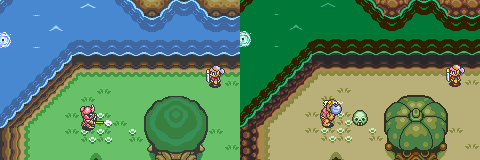
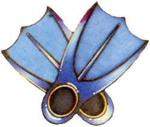
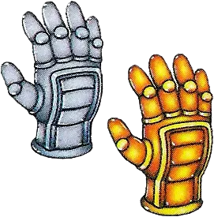

# 02 世界设计

## 核心问题

ALttP 的双世界系统（Light World / Dark World）如何在同一份地图拓扑结构上创造双倍的探索深度？世界切换机制如何从"视觉噱头"转变为探索的核心工具，同时将 1MB 卡带容量的限制转化为设计优势？

## 机制描述

### 双世界的基本结构


ALttP 的可玩世界由两个版本的海拉尔大陆构成：

| 属性 | Light World | Dark World |
|------|-------------|------------|
| 身份 | 正常的海拉尔大陆 | 被 Ganon 邪恶愿望扭曲的黄金之地 |
| 地形拓扑 | 基准地图 | 与 Light World 1:1 位置对应 |
| 视觉风格 | 绿色、明亮、可识别的地形分区 | 褐色/紫色、阴暗、敌意感 |
| 敌人密度 | 低-中 | 中-高，敌人类型更危险 |
| NPC | 正常村民、商人 | 多数为怪物或被诅咒者 |
| 背景音乐 | 安详的主旋律变奏 | 不协和音、紧张的变奏版 |

两个世界共享同一套底层地图格子数据——同一坐标位置的地形骨架（山、水、平地的轮廓）是相同的，但
覆盖在上面的图块（tile）、敌人配置、可交互物件、建筑外观全部不同。


*同一地点在Light World（左）和Dark World（右）的视觉对比——地形拓扑相同，视觉完全不同*


### 区域对应关系

| Light World | Dark World | 变化特征 |
|-------------|------------|----------|
| Kakariko Village | Village of Outcasts | 宁静村庄 → 破败的强盗据点，有隐藏的 GP race 迷宫入口 |
| Lost Woods | Skeleton Forest | 迷路的树林 → 骷髅主题森林，含 Skull Woods 地下城 |
| Desert of Mystery | Swamp of Evil | 干燥沙漠 → 有毒沼泽，需要 Hookshot 才能深入 |
| Death Mountain | 更危险的 Death Mountain | 已是险地 → 变得更险，多个悬崖和传送点 |
| Lake Hylia | 冰冻的湖面/浅水区 | 开阔水域 → 部分结冰，通行方式改变 |
| Hyrule Castle | Ganon's Tower（对应区域） | 游戏起点 → 最终关卡 |

### 世界切换机制


双世界切换通过两种途径实现，两者**不对称**：

**Magic Mirror（魔法镜）：Dark World → Light World**  
- 在 Dark World 的任意位置使用魔法镜，Link 会在 Light World 的对应位置出现
- 出现点会留下一个闪光标记（sparkle），触摸它可以返回 Dark World 的原位
- 魔法镜使用次数不限（消耗魔法值），是反复使用的核心工具
- 关键功能：如果 Link 在 Dark World 没有 Moon Pearl，会被变成粉色兔子（无法攻击、无法使用物品），用魔法镜逃回 Light World 是唯一出路


**Warp Tiles（传送点）：Light World → Dark World**
- 固定位置的特殊地板砖，踩上去后自动传送到 Dark World 对应位置
- 部分传送点初期被障碍遮挡（需要特定物品才能接近）
- 数量有限，分布在地图各处

**Hyrule Castle Tower 事件：强制传送**
- 剧情事件：击败 Agahnim 后，Link 被投入 Dark World，这是第一次进入 Dark World
- 此后 Dark World 成为可自由访问的区域

### Moon Pearl 的特殊地位

在 Dark World，如果 Link 没有携带 Moon Pearl ，他的身体会被扭曲成粉色兔子形态：

| 状态 | 人形（有 Moon Pearl） | 兔子形态（无 Moon Pearl） |
|------|----------------------|--------------------------|
| 攻击能力 | 正常 | 完全丧失 |
| 使用物品 | 正常 | 完全丧失 |
| 移动速度 | 正常 | 略快但无法防御 |
| 解法 | — | 用魔法镜返回 Light World |

Moon Pearl 在 Tower of Hera（Light World 第三个地下城）中获得。这个设计意味着：在进入 Dark World 之前，游戏确保玩家已经完成了 Light World 的全部三个地下城——Moon Pearl 充当了一道隐性的进度门。

### 表世界的区域连接与可达性控制

Light World 的区域并非完全开放。地图被分割为多个区域，区域之间的通行受物品能力控制：

```
游戏起点（Link 的家）
    ↓ 无条件
Hyrule Castle / Sanctuary / Kakariko Village
    ↓ Power Glove（搬起浅色石头）
Eastern Palace 区域 / 更多的 Kakariko 周边
    ↓ Power Glove
Death Mountain 低区 → Tower of Hera
    ↓ Titan's Mitt（搬起深色石头）或 Hookshot
Death Mountain 高区 / 更远的区域
    ↓ Zora's Flippers（游泳）
Lake Hylia / 水域通道 / Zora 瀑布
    ↓ Hookshot
跨越悬崖的区域 / 部分隐藏洞穴
```

每个核心物品同时是：
1. 地下城内的解谜/战斗工具
2. 表世界的区域解锁"钥匙"
3. （进入 Dark World 后）两个世界中都有新的可解锁区域

→ 参见 04_进度系统.md（物品能力如何控制可达性的完整分析）


 
<br><em>Zora's Flippers——解锁水域通道，将表世界的水体从障碍变为通路</em>
<em>Power Glove和Titan's Mitt——控制表世界和Dark World区域可达性的核心物品</em>

## 设计分析

### 解决了什么设计问题

**问题1：如何在 1MB 容量内提供足够的探索内容**

SNES 卡带容量的硬约束意味着不能简单地把地图做大。一个独立的、与 Light World 规模相当的新地图需要几乎双倍的图块、敌人数据和关卡布局——这在容量预算内不可行 `[推测]`。

双世界方案的核心偷巧之处：**复用地图拓扑，只替换表层**。地形的高程数据、区域边界、路径骨架可以复用——这些是地图数据中占用空间最大的部分。需要重新制作的只是图块贴图、敌人配置和可交互物品的放置。结果是用大约 1.3-1.5 倍的内容量创造了约 2 倍的探索体验 `[推测]`。

**问题2：如何让"第二幕"不让人觉得是换了皮的关卡重复**

如果 Dark World 只是 Light World 的难度提升版（同样的视觉、同样的布局、更强的敌人），玩家很快会感到被敷衍。双世界的设计通过三个层面避免了这个问题：

1. **视觉彻底不同**——不是换色调，而是完全不同的地貌主题（沙漠变沼泽、村庄变废墟）
2. **通行逻辑被重新设计**——同一位置在两个世界的可通行性不同，玩家必须重新学习路径
3. **世界切换本身成为谜题工具**——不是在两个独立世界中各玩各的，而是需要频繁在两个世界间切换来解决空间问题

**问题3：如何在非线性探索中保持叙事张力**

ALttP 的叙事需要传达"一个美好世界被邪恶力量扭曲"的主题。如果只是用 CG 过场来表现这种对比，在 SNES 时代既不可行也没有说服力。双世界让叙事变成**可游玩的**——玩家亲自在两个世界间穿梭，亲眼看到 Kakariko Village 的安宁与 Village of Outcasts 的破败之间的对比。世界本身就是叙事载体。

### 创造了什么体验

**1. "熟悉又陌生"的认知错位感**

这是双世界设计最独特的体验贡献。当玩家第一次进入 Dark World 时，会经历一个有趣的心理过程：

- **地形直觉仍然有效**——"那个方向应该是湖，那边是山"，基于 Light World 的学习成果
- **但视觉参照全部失效**——熟悉的路标、建筑外观全部改变，玩家必须重新建立空间认知
- **危险预期升高**——同样的路径在 Dark World 上可能有更强的敌人或不同的障碍

这种"半个大脑说认路、另半个大脑说完全陌生"的感觉，比纯粹的新地图更有趣，也比纯粹的换皮版更紧张。

**2. 世界切换作为"空间黑客"的快感**

当玩家学会利用双世界的不对称性后，会产生一种强烈的"我找到了窍门"的感觉：

- Dark World 某处是悬崖死路 → 用魔法镜切到 Light World → 发现那里正好有个洞穴入口
- Light World 某处被石头堵住 → 踩传送点到 Dark World 对应位置 → 那里没有石头，绕路过去

玩家不是在两个世界中平行推进，而是在两个世界**之间**寻找通路——双世界的间隙本身变成了可探索的空间。

**3. 垂直叙事**

双世界的视觉对比创造出一种不需要文字的叙事：

- Light World 的 Kakariko Village：明亮的房屋、友善的 NPC、鸡在院子里跑、背景音乐是温馨的旋律
- Dark World 的 Village of Outcasts：破败的建筑、骷髅装饰、恶意的 NPC、背景音乐是不安的变奏

玩家在两个世界间来回时，这种对比被不断强化。这就是空间叙事——空间本身就是故事的讲述者。

### 关键设计决策及其理由

**决策1：1:1 地理位置映射而非松散对应**

为什么不是"Light World 的某个区域大致对应 Dark World 的某个区域"，而是精确的坐标级对应？

理由：
- 精确映射使世界切换可预测——玩家能在 Light World 站定一个位置后，合理预判切换到 Dark World 后会在哪里
- 这是"世界切换作为探索工具"的前提：如果映射关系模糊，玩家就无法策略性地选择切换位置
- 数据复用效率更高——同一套坐标系统服务两个世界

代价：
- 某些位置在两个世界中的对应关系可能不够"自然"（为了迁就拓扑复用，Dark World 的区域主题有时需要凑合坐标位置）

**决策2：世界切换的不对称性（魔法镜 vs 传送点）**

为什么 Dark→Light 是随意的（魔法镜），而 Light→Dark 是受限的（固定传送点）？

理由 `[推测]`：
- Dark World 是更危险的世界，玩家需要随时能逃回 Light World（安全区）。如果两个方向的切换都受限，玩家在 Dark World 中的探索意愿会降低——"万一被困住怎么办"
- Light→Dark 通过传送点限制，使传送点本身成为探索目标——寻找新的传送点成为表世界探索的驱动力之一
- 不对称性强化了两个世界的性格差异：Light World 是"家/基地"，Dark World 是"冒险/前线"

**决策3：Moon Pearl 的存在**

为什么不让玩家进入 Dark World 后直接保持人形，而要设计一个"变成兔子"的惩罚？

理由：
- Moon Pearl 作为隐性进度门，确保玩家在进入 Dark World 前已完成 Light World 的三个地下城（Moon Pearl 在第三个地下城 Tower of Hera 中获得）
- "变成兔子"的体验本身具有叙事功能——玩家亲身感受到 Dark World 的扭曲力量，不是被口头告知"这里很危险"，而是身体被改变了
- 兔子形态保留了移动能力但剥夺了战斗能力，创造了一种有趣的"只能跑不能打"的紧张体验，同时魔法镜提供了逃生手段，不会造成死局

**决策4：Dark World 的传送点被物品能力封锁**

部分 Light→Dark 传送点初期不可用，需要特定物品才能接近（如需要 Titan's Mitt 搬开深色石头才能到达的传送点）。

理由：
- 与进度系统耦合：传送点的解锁节奏与物品获取节奏同步，避免玩家过早进入难度过高的 Dark World 区域
- 给后期物品（Titan's Mitt、Hookshot 等）在表世界也提供解锁价值

## 设计过程推导

从设计约束和目标反推双世界方案的诞生过程 `[推测]`：

**阶段1：确定需要更大的世界**

初代塞尔达的表世界是一个 16×8 的屏幕网格（128 屏）。ALttP 需要更大的探索空间来支撑更长的游戏流程（目标约 15-20 小时，远超前作的 8-10 小时）。简单计算：如果探索深度与地图面积成正比，地图需要显著扩大。

**阶段2：容量约束否决了"做大地图"的方案**

SNES 卡带容量约 1MB。一个更大的地图意味着更多的图块（tile set）、更多的敌人数据、更多的屏幕布局数据。如果直接把地图面积翻倍，美术和关卡数据的增量会直接突破容量预算。

**阶段3：寻找"低成本高回报"的扩容方案**

策划需要的不是"更多内容"，而是"更多探索感"。这两者并不等价——探索感来自"未知+有意义的导航决策"，而不是纯粹的屏幕数量。

→ 关键洞察：**如果玩家对同一套空间有两种不同的体验，探索深度就能翻倍，但内容量不需要翻倍。**

**阶段4：什么机制能让同一空间产生两种体验？**

可选方案：
- A. 昼夜系统——同一地图白天/夜晚有不同敌人/事件。代价：体验差异不够大，只是时间切换而非空间切换
- B. 季节系统——类似后来 Oracle of Seasons 的做法。代价：四种状态的内容量可能过多
- C. 平行世界——同一地图有两个版本，视觉和逻辑完全不同。代价：需要两套图块和敌人配置，但地形骨架可以复用

→ 方案 C 被选中。它在容量效率（复用地形骨架）和体验差异（彻底不同的视觉和逻辑）之间取得了最佳平衡。

**阶段5：为什么是"光明 vs 黑暗"而非其他主题？**

这与叙事需求重合——ALttP 的故事需要表现"三角神力被滥用后的灾难后果"。"一个被许愿扭曲的世界"天然适合用双世界来表现：Light World 是"正常"，Dark World 是"扭曲"。

→ 世界设计不是独立的系统决策，而是叙事需求 + 容量约束 + 探索深度需求三者的交汇产物。

## 反事实推演

### 反事实1：如果 Dark World 是一个完全独立的地图（不与 Light World 位置对应）

后果：
- 世界切换丧失策略性——玩家无法在 Light World 观察地形来规划 Dark World 的路线，切换变成纯粹的"传送到另一个地方"
- 地图数据量显著增加——不复用地形骨架，Dark World 需要完整的独立地图设计，可能超出容量预算
- 认知负担增加——玩家需要记忆两套完全独立的空间关系，而非"同一空间的两个版本"
- "熟悉又陌生"的体验消失——取而代之的是"全新"或"陌生"，缺少了认知错位的微妙感

→ 结论：1:1 位置映射是双世界设计成立的基石。去掉它，双世界退化为两个独立关卡。

### 反事实2：如果世界切换是双向自由的（Light→Dark 也可以用魔法镜，无需传送点）

后果：
- 传送点丧失探索驱动价值——寻找传送点不再是表世界的探索目标之一
- 玩家可能在获得足够物品能力前就过早进入 Dark World 的危险区域，导致挫败感
- Dark World 的"前线感"减弱——如果随时可以双向切换，两个世界在心理上变成"平级"的，Dark World 不再是"需要准备后才能深入的险地"
- 月之珍珠的叙事功能被削弱——如果可以随时自由切回 Light World，"变成兔子"只是一个临时麻烦而非真正的危险

→ 结论：不对称的切换机制是双世界节奏控制的关键。

### 反事实3：如果去掉 Moon Pearl 的兔子变形机制

后果：
- 进度控制出现漏洞——玩家可以在没有完成 Light World 全部地下城的情况下在 Dark World 自由活动
- Dark World 的叙事冲击减弱——玩家不会亲身感受到"这个世界有扭曲你身体的力量"
- 一个独特的小型体验（兔子 Link 的无助感）消失

→ 结论：Moon Pearl 的兔子变形同时服务于进度控制和叙事体验，去掉后两个层面都受损。

### 反事实4：如果双世界被替换为一个更大的单一世界（总面积等于两个世界之和）

后果：
- 空间叙事消失——无法通过"同一个地方被扭曲"来表现主题
- "世界切换"作为探索工具不存在——所有秘密必须通过单一世界内的手段发现
- 玩家的空间认知负担更大——需要记忆一个巨大单一世界的完整布局，而非"同一个空间的两个版本"
- 可能反而需要更多的美术资源——一个连续的巨大单一世界需要更多的过渡区域和边缘处理，而双世界可以复用同一套区域边界

→ 结论：双世界不是"变大了"，而是"变深了"。同样的面积，双世界比单一世界产生更多维度的探索体验。

## 可迁移经验

### 1. 复用骨架、替换表层——低成本翻倍探索深度的手法

当你需要扩展可探索空间但内容预算有限时，不要从零开始做新内容。找到可以复用的"骨架"（空间结构、路径逻辑、区域边界），只重新制作"表层"（视觉、敌人、可交互元素）。

ALttP 的具体做法：复用地形拓扑骨架，替换图块和敌人。玩家在两个世界中需要重新学习"表层"，但"骨架"提供的空间直觉仍然有效，这创造了"熟悉又陌生"的独特体验。

适用场景：游戏的第二幕、New Game+、平行世界、时间跳跃。

### 2. 不对称切换——让两个世界的"地位"不同

当设计两个可切换的世界/状态时，让切换成本不对称：

- "安全区→危险区"的切换受限（需要找到传送点/满足条件）
- "危险区→安全区"的切换自由（随时可用，作为逃生手段）

这种不对称使危险世界保持了"前线"的心理重量——玩家愿意深入但也会谨慎。如果双向切换同样自由，两个世界在心理上变成平级的，丧失了紧张感的梯度。

### 3. 空间叙事——用世界本身讲故事

当需要传达"对比"主题（和平 vs 战争、正常 vs 腐化、过去 vs 现在）时，不要只依赖过场动画或文字。让玩家在同一空间的两个版本之间穿梭，亲眼看到差异。

ALttP 的 Kakariko Village → Village of Outcasts 是教科书级的空间叙事：不需要任何对话，玩家看到破败的建筑和恶意的 NPC，就立即理解了"这个世界被扭曲了"。

关键手法：**让同一地理位置在两个版本中呈现最大可能的反差**。不是微妙的色调差异，而是"这是同一个地方吗？"级别的视觉冲击。

### 4. 世界切换作为探索工具——双世界的间隙是可探索空间

双世界设计的最高境界不是"玩家在两个世界中各玩各的"，而是"玩家在两个世界**之间**寻找通路"。

具体设计手法：
- 在世界 A 的某个位置是死胡同，切换到世界 B 后发现那里有通路
- 在世界 A 无法到达的高台，切换到世界 B 后发现在低处，可以走上去
- 世界 A 的某个物品/机关只能从世界 B 的对应位置绕路到达

当玩家发现这种"跨世界绕路"的逻辑时，会产生强烈的智力满足感——他们不是在操作一个角色，而是在操纵两个世界之间的关系。

### 5. 认知复用——利用已有知识降低新内容的学习成本

Dark World 复用 Light World 的地形骨架，意味着玩家之前学到的空间知识（"北边是山、南边是湖"）部分有效。这降低了 Dark World 的初始认知门槛——玩家不是完全从零开始学习一个新地图。

同时，表层的变化（视觉、敌人、通行逻辑）确保了 Dark World 不是无聊的重复——玩家需要在"旧知识部分有效"的前提下补充新知识。

这个手法可以泛化为：**在引入新阶段/新内容时，保留一部分旧规则以降低学习成本，同时引入足够的新变化以维持新鲜感。** 变化的比例大约在 50-70%——太少了是换皮，太多了是重新开始。

## 补充材料

### 数据参考

- Light World / Dark World 地图各由约 64×64 个 tile 格组成（单屏可见区域约为 16×14 tile，256×224 像素分辨率下每个 tile 为 16×16 像素）
- Dark World 的传送点（Warp Tiles）数量约 9 个，分布在 Light World 各区域
- 魔法镜每次使用消耗少量魔法值，但可以在魔法充满的条件下多次使用
- Moon Pearl 位于 Tower of Hera（Light World 第三个地下城），确保进入 Dark World 前玩家已获得足够的能力基础

### 对比参考

- → 参见 01_核心循环.md（宏循环中表世界探索阶段的节奏控制）
- → 参见 04_进度系统.md（物品能力如何控制世界可达性）
- → 参见 07_叙事结构.md（双世界作为叙事装置）
- **Metroid Prime 2: Echoes（2004）**：直接借鉴了 ALttP 的双世界设计——Light Aether / Dark Aether。Dark Aether 的地图拓扑与 Light Aether 对应，但视觉风格阴暗危险，且环境会持续伤害玩家。增加了"Dark Aether 更危险"的生存压力维度
- **A Link Between Worlds（2013）**：30 年后直接致敬 ALttP 的双世界结构，Lorule 的地图与 Hyrule 位置对应。但将物品系统改为"租借制"，使地下城攻略顺序的自由度大幅提高——这反过来说明 ALttP 的双世界设计本身足够健壮，可以在物品系统根本性改变后仍然成立
- **Ocarina of Time（1998）**：用"童年/成年"时间跳跃替代了空间双世界。Adult Hyrule 与 Child Hyrule 地形相同但状态不同（被 Ganondorf 统治 7 年后）。本质上是对同一设计思路的 3D 化改编
- **Oracle of Seasons（2001）**：四季切换是双世界概念的轻量化变体——同一地图有四个季节状态，切换季节改变地形通行性（冬天水结冰可通行、夏天藤蔓生长可攀爬）。四季系统比双世界更轻量但探索逻辑相似
- **Dark Souls（2011）**：没有双世界系统，但通过 DLC 区域"Abyss"和原世界的关系，以及"传火/灭火"的结局分支，呈现了类似的空间叙事——世界本身的状态承载叙事意义
