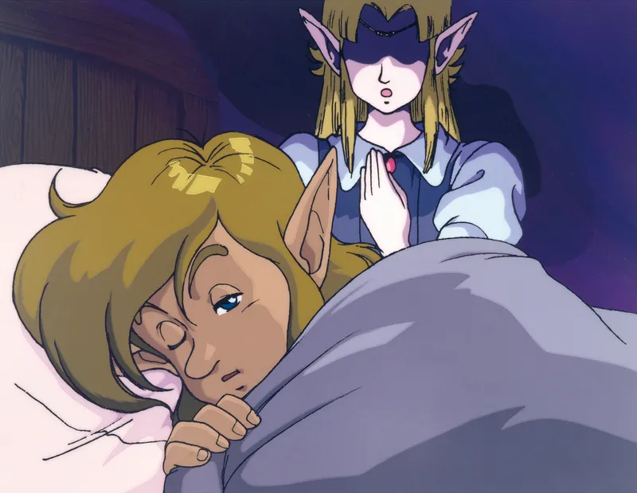
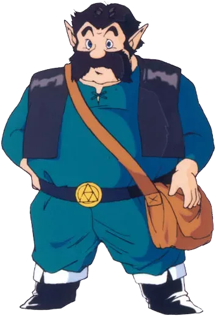
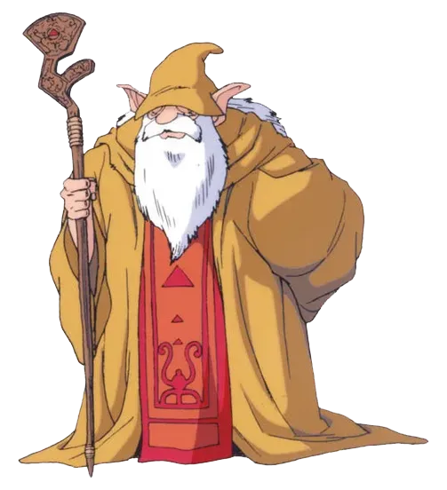
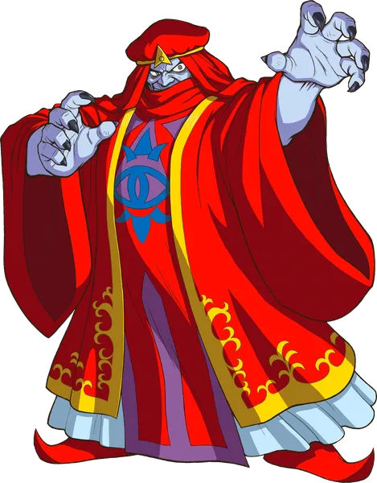
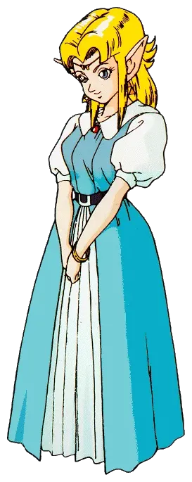

# 07 叙事结构

## 核心问题

1. 在没有语音演出和CG过场的硬件限制下，如何用最少的文本量构建一个令玩家感到紧迫且有意义的故事？
2. 线性叙事骨架如何与非线性的自由探索共存而不产生冲突？

## 机制描述

**叙事媒介：** SNES时代的塞尔达只有文本框这一种叙事工具。没有语音、没有CG动画，所有剧情传达依赖像素美术的有限表现力和文字对话。

**三幕结构的时间分配：**

| 幕 | 内容 | 时长 | 定位 |
|---|---|---|---|
| 第一幕 | Hyrule Castle逃脱（序章） | ~30分钟 | 纯教学 |
| 第二幕 | Light World（3个地下城 + Hyrule Castle Tower） | ~3-4小时 | 学习游戏规则 |
| 第三幕 | Dark World（7个地下城 + Ganon's Tower） | ~8-10小时 | 运用规则 |

**关键剧情节点（固定顺序）：**

1. Zelda心灵传呼唤醒Link
2. 叔叔受伤，交付剑与盾
3. 救出Zelda，经地下水道逃至圣域
4. 圣域祭司告知需要大师之剑
5. 寻找长老Sahasrahla，被告知收集三个挂坠
6. 完成3个Light World地下城，获得大师之剑
7. 回到城堡时Agahnim已将Zelda送入Dark World（"来晚了一步"）
8. 击败Agahnim，被投入Dark World
9. 解救7位被囚禁的少女
10. 攻入Ganon's Tower
11. 在Pyramid of Power击败Ganon
12. 获得Triforce，许愿恢复Hyrule


 
<br><em>Zelda通过心灵传呼向Link求助——"用事件而非对白讲故事"的核心理念体现</em>
<em>Link的叔叔——出场不到5分钟，完成教学、情感动机、结构功能三重任务</em>


  
<br><em>Sahasrahla——通过心灵传呼给玩家方向提示，替代物理NPC引导的巧妙设计</em>
<em>Agahnim——表面是救世主，实为Ganon的傀儡。"假主角反派"设计的经典案例</em>
<em>Zelda公主——任务的发起者和两次被拯救的叙事催化剂</em>


**角色功能一览：**

| 角色 | 叙事功能 | 出现场景 |
|---|---|---|
| Zelda公主 | 任务发起者（心灵传呼）、被两次拯救的叙事催化剂 | 序章、第一幕结尾、终局 |
| 叔叔 | 教学NPC、情感动机的锚点 | 序章（仅出场一次） |
| Sahasrahla（长老） | 引导者，通过心灵传呼给方向提示 | 第二幕、第三幕持续 |
| 圣域祭司 | 告知目标（大师之剑），被抓走的催化事件 | 第一幕末尾 |
| 七位少女 | Dark World的收集目标，逐一提供剧情信息 | 第三幕每个地下城末尾 |
| Agahnim | 假主角反派（Ganon的傀儡） | 第二幕末尾、第三幕中段 |
| Ganon | 真正的最终Boss | 终局 |
| Triforce | 终极目标物，本身无角色化 | 终局 |

**双世界叙事功能：**

- Light World：和平、秩序、希望的视觉表达
- Dark World：被Ganon的邪恶愿望扭曲的世界，是恶的具象化
- 玩家通过在两个世界中穿梭亲身感受对比，而非通过过场动画被"告知"这个对比

**心灵传呼（Telepathy）系统：** Sahasrahla和Zelda可以在任何时刻通过心灵传呼给玩家发送提示信息。这是一种不依赖物理接触、不打破沉浸感的叙事传递方式。

## 设计分析

### 解决了什么设计问题

**问题一：如何用极低的叙事带宽传达足够的剧情驱动力。**

SNES的文本框是唯一叙事通道。ALttP的策略是——不靠文本量取胜，而是靠**事件编排的节奏感**。每一次"来晚了一步"都是一个情绪节点，不需要长篇对白来解释发生了什么，玩家亲眼看到后果就够了。叔叔倒下、Zelda被抓走、祭司消失，这些瞬间的叙事效率远高于任何文字描写。

**问题二：线性故事如何与非线性探索兼容。**

ALttP的解法是将线性叙事压缩为**少数几个必须按顺序通过的关卡门（gate）**，而在关卡门之间留出大段的自由探索空间。具体来说：

- 获得三个挂坠（必须按顺序完成3个地下城）——这是线性约束
- 但每个挂坠地下城之间的Light World探索是自由的
- 进入Dark World后，7个地下城中的大部分可以以多种顺序完成——非线性空间

关键在于：**线性节点之间的间距足够大**，玩家不会感到被牵引，而非线性区域的边界足够清晰，玩家不会迷失。

### 创造了什么体验

**紧迫感与无力感的交织。** "总是来晚一步"的反复出现——叔叔刚把剑交出就倒下、到城堡塔顶时Zelda已经被送走——创造了持续的叙事张力。玩家不是在"阅读"一场危机，而是在**经历**一场总是差半拍的救援。这种设计让玩家对Link的失败产生共情，同时又不会感到挫败（因为每次"来晚"都直接推动了下一阶段的冒险）。

**世界即叙事。** Dark World不是一个"新关卡"，它是Light World的**扭曲映射**。玩家第一次进入Dark World时，看到的每一个熟悉地形的扭曲版本都在无声地讲述"Ganon的力量有多强大"。这是一种**空间叙事**——不需要任何文本，地图本身就在讲故事。

**从学习者到胜任者的成长弧线。** 三幕结构完美对应了玩家的技能成长：第一幕教操作、第二幕教策略、第三幕考验综合能力。叙事和玩法在这里完全同步——Link从一个被命运推着走的少年，成长为主动挑战Ganon的英雄，而玩家也同步完成了从新手到熟练者的蜕变。

### 关键设计决策及其理由

**决策一：Agahnim作为假主角反派。**

这是塞尔达系列首次使用"你以为这是最终Boss，但其实背后还有更大的敌人"的套路。设计理由有三：

1. 在第二幕结尾制造一个**伪高潮**，让玩家觉得"我做到了"之后立刻被投入Dark World，重新归零——这是叙事上的"断崖"，创造强烈的情绪波动
2. 将Ganon的出场推迟到第三幕末尾，让真正的最终Boss保持了足够的神秘感和威慑力
3. 让"世界翻转"这个最大的玩法转折有了叙事上的合理包装

**决策二：叔叔在序章就退场。**

叔叔只出场了不到5分钟，但他完成了三件事：给玩家第一把武器（教学功能）、创造"救家人"的情感动机（叙事功能）、用倒下制造"被迫独自上路"的起点（结构功能）。一个角色用极少的出场时间完成了三重功能，这是叙事效率的典范。

**决策三：心灵传呼系统替代物理NPC引导。**

在开放世界中，如何给玩家提示而不破坏探索感？ALttP没有选择"到处放置NPC"或"弹出提示框"，而是用心灵传呼——这个设计同时满足了叙事一致性（它符合奇幻世界观）和功能需求（可以在任何地点给玩家发信息）。Sahasrahla不需要站在玩家面前，他"一直在注视着你"的感觉反而增强了叙事的神秘感。

## 设计过程推导

**起点约束：** SNES硬件、无语音、无CG、文本框是唯一叙事媒介、总游戏时长约15小时。

**推导路径：**

1. 约束"叙事带宽极低"→ 必须用**事件**而非**对白**讲故事 → 需要强烈的视觉对比和明确的行动序列
2. 约束"15小时的游戏需要持续驱动力"→ 需要多层目标结构 → 短期目标（下一个地下城）+ 中期目标（收集挂坠/解救少女）+ 长期目标（获得Triforce）
3. 目标"让玩家感到紧迫"→ 在关键节点让玩家"来晚一步" → 制造失败感但不造成挫败感（因为每次失败都打开了新路径）
4. 约束"需要开放世界但要有故事节奏"→ 用少数固定节点控制节奏，节点之间给自由度 → 三幕结构中，第一幕完全线性、第二幕半开放、第三幕最大自由度
5. 目标"让双世界不只是玩法噱头"→ [推测] Dark World必须从叙事上解释为Ganon力量的具象化 → 每解救一位少女，世界就恢复一点希望 → 收集目标与叙事意义绑定

**关于Agahnim的进一步推导 [推测]：** 早期设计中可能只有Ganon一个反派。但纯粹"打败大魔王"的故事太直白，缺乏转折。引入Agahnim这个"表面是救世主、实际是阴谋家"的角色，不仅增加了叙事复杂度，还让故事多了一层政治阴谋的味道——国王被蒙蔽、士兵被催眠，这是一种不同于"纯粹武力对抗"的威胁类型。

## 反事实推演

**如果去掉"来晚一步"的设计：** Link每次都及时赶到救下所有人。叙事张力大幅下降。游戏会变成一系列连续的成功，缺少情绪起伏。叔叔如果不倒下，而是陪Link一起冒险，玩家的独立感会丧失——始终有一个"保护者"在身边，成长主题被削弱。

**如果Agahnim就是最终Boss：** 第二幕的高潮就是游戏高潮，Dark World不存在。游戏时长缩短一半以上，且失去了最核心的玩法转折。更重要的是，失去了"伪结局→更大危机"这个叙事弹射器。Ganon作为系列标志性反派也不会在本作中登场，可能影响系列的后续发展。

**如果Dark World只是新地图而非Light World的扭曲版本：** 双世界变成了单纯的"两关"——第一关和第二关。空间叙事的效果完全消失。玩家进入Dark World时不会有"熟悉之地变得陌生"的震撼感，只是一个新环境。双世界的核心设计意义将被大幅削弱。

**如果去掉心灵传呼系统，改为NPC物理引导：** 要么在地图各处放置大量NPC（破坏沉浸感和世界可信度），要么玩家在关键路口完全不知道该去哪（破坏节奏感）。心灵传呼是在"不给太多提示"和"不让玩家卡关"之间的优雅平衡。

## 可迁移经验

1. **用事件而非对白讲故事。** 当叙事带宽受限时（不管是硬件限制还是玩家耐心限制），让事情发生在玩家面前，比用文字描述发生过的事情有效得多。叔叔倒下、Zelda消失——这些瞬间的叙事效率超过任何数量级的前情铺陈。

2. **线性节点 + 非线性空间 = 有节奏的开放感。** 完全线性让玩家感到被牵引，完全非线性让玩家迷失。ALttP的模式是：用少数必须按顺序通过的关键节点控制节奏，节点之间留出充分的自由度。玩家的感受是"我在自由探索"，但实际上设计师在控制着情绪曲线。

3. **"来晚一步"是低成本的叙事增幅器。** 不需要额外开发内容，只需要调整事件的时序——让玩家在Boss行动之后而非之前到达。这种设计几乎零成本，但能持续制造紧迫感。

4. **假主角反派制造结构转折。** 在故事中段揭示"你以为的反派只是棋子"，这一手法可以同时服务叙事（制造转折）和玩法（开启新阶段）。关键是假反派必须足够可信，让玩家在揭示之前没有怀疑。

5. **收集目标的叙事绑定。** "解救七位少女"不仅是游戏玩法上的收集目标，每解救一位还有剧情信息和祝福作为反馈。这让收集行为有了叙事意义，而非纯粹的数字累加。原则：**收集的每一步都应该推进故事，而不仅仅是推进百分比。**

6. **引导系统的世界观包装。** 心灵传呼不是一个"UI功能"，它在游戏世界中有合理的位置。当系统功能被包装为世界观的一部分时，它不会打破沉浸感。任何需要"跳出现实"来传达的系统信息，都应该考虑是否有符合世界观的传递方式。

## 补充材料

**交叉引用：**
- → 02_世界设计.md（双世界的空间叙事如何与本文的叙事结构互相支撑）
- → 01_核心循环.md（三幕元循环结构如何与本文的三幕叙事结构对齐）

**序章叙事文本参考（英文原文）：**

封印战争的背景交代通过开场的滚动文字完成，这是ALttP唯一一次使用"打破游戏视角"的方式传达信息。此后所有叙事都在游戏内完成，不再使用meta叙事手段。

**"来晚一步"事件清单：**

| 事件 | 发生时机 | 叙事效果 |
|---|---|---|
| 叔叔倒下 | 序章，玩家刚到达城堡 | 建立"代价"感 |
| Zelda被Agahnim送入Dark World | 玩家刚获得大师之剑赶回 | 制造"努力白费"的挫败→转化为Dark World的驱动力 |
| 祭司被抓走 | 第一幕末尾 | 确认威胁升级 |

**三幕结构与玩家技能映射：**

```
第一幕（~30min）：学会操作       → Link：被动接受命运的少年
第二幕（~3-4h）：学会策略和探索   → Link：主动寻找力量的冒险者
第三幕（~8-10h）：综合运用一切   → Link：能够挑战邪恶的英雄
```

叙事和玩法在这里实现了完全同步的成长曲线。
