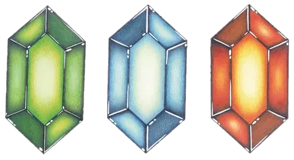

# 08 经济与资源

## 核心问题

1. 卢比作为货币，如何在一个没有真正"市场"的单人冒险游戏中保持购买决策的意义感——既不泛滥到让玩家失去兴趣，也不稀缺到制造痛苦？
2. 消耗品系统（炸弹、箭矢、瓶装物品）如何同时服务于战斗续航和解谜探索两个目标，而不让资源焦虑侵蚀探索乐趣？
3. 心之碎片和瓶子的有限数量如何转化为驱动世界探索的核心动力？

## 机制描述

### 货币系统：卢比（Rupees）

{: width="200px"}
*卢比——从绿色到金色四种面值，经济系统的基础单位*

**获取途径：**

| 来源 | 频率 | 典型金额 |
|------|------|---------|
| 击杀敌人掉落 | 高频，每次战斗 | 1-20（随敌人强度） |
| 砍草/砸罐子 | 极高频，遍布世界 | 1-5 |
| 宝箱 | 中频，地下城和隐藏地点 | 5-200 |
| 小游戏奖励 | 低频，主动参与 | 20-300 |
| 出售物品给商人 | 低频 | 按物品定价 |
| 特殊事件（如树后藏宝） | 低频，探索奖励 | 20-100 |

**面值体系：**

| 面值 | 颜色 | 稀有度 |
|------|------|--------|
| 1 | 绿色 | 极常见 |
| 5 | 蓝色 | 常见 |
| 20 | 红色 | 较少 |
| 50 | 紫色/珍贵 | 稀有 |
| 200 | 金色 | 极稀有 |

携带上限：999卢比。

**主要消耗项：**

| 物品 | 价格 | 必要性 |
|------|------|--------|
| Medicine of Life（瓶装回复药） | ~150卢比 | 高——Boss战续航核心 |
| Medicine of Magic（瓶装魔法药） | ~160卢比 | 中——依赖魔法道具的玩家更需要 |
| Medicine of Life and Magic | ~180卢比 | 中——效率最高但最贵 |
| 小游戏入场费 | 10-100卢比 | 低-中——奖励通常是心之碎片或道具 |
| 特殊NPC服务 | 不等 | 低——多为主线流程外内容 |

### 消耗品系统

**弹药类消耗品：**

| 消耗品 | 基础上限 | 升级后上限 | 恢复方式 |
|--------|---------|-----------|---------|
| 炸弹（Bomb） | 10 | 30→50 | 击杀敌人掉落、砍草掉落、宝箱、购买 |
| 箭矢（Arrow） | 30 | 50→70 | 击杀敌人掉落、砍草掉落、宝箱、购买 |

炸弹和箭矢的双重角色——既是战斗武器又是解谜工具——是消耗品系统的核心张力来源。

**魔法值系统：**

- 魔法槽提供一根统一的能量条，多种特殊道具共享消耗
- 消耗魔法的道具：Fire Rod、Ice Rod、Cane of Somaria、Cane of Byrna、Magic Cape、Lamp等
- 可升级为"大魔法槽"：效果为所有魔法消耗减半
- 恢复方式：魔法瓶（绿色瓶，敌人/草丛掉落）、瓶装魔法药、妖精泉

**瓶装物品系统：**

玩家在游戏世界中可以找到最多4个空瓶子。每个瓶子可以在特定地点装入不同物品：

| 瓶装物 | 获取方式 | 功能 |
|--------|---------|------|
| Medicine of Life | 商店购买 | 回复所有心 |
| Medicine of Magic | 商店购买 | 回复全部魔法 |
| Medicine of Life and Magic | 商店购买/特殊地点 | 回复所有心和魔法 |
| Fairy（妖精） | 妖精泉/特定地点捕捉 | 死亡时自动复活（回复几颗心） |
| Bee | 随机草丛中 | 放出后攻击敌人，效果弱 |
| Golden Bee | 特定隐藏位置 | 攻击力更强的蜜蜂 |

### 升级系统

**装备升级路线：**

| 类别 | 初始 | 升级1 | 升级2 | 升级3 | 升级方式 |
|------|------|-------|-------|-------|---------|
| 剑 | Fighter's Sword | Master Sword | Tempered Sword | Golden Sword | 地下城进度/锻造任务/大妖精 |
| 盾 | Fighter's Shield | Red Shield | Mirror Shield | — | 地下城/探索 |
| 防具 | Green Clothes | Blue Mail | Red Mail | — | 地下城 |
| 炸弹上限 | 10 | 30 | 50 | — | NPC/特殊位置 |
| 箭矢上限 | 30 | 50 | 70 | — | NPC/特殊位置 |
| 魔法槽 | 普通 | 大魔法（消耗减半） | — | — | 特殊地点NPC |

**心之系统：**

| 类型 | 获取方式 | 数量 | 总计效果 |
|------|---------|------|---------|
| 心之容器（Heart Container） | 击败Boss | 11个 | 每个+1心 |
| 心之碎片（Piece of Heart） | 世界各处散布 | 24个 | 每4个+1心 |

初始3心，最大20心。心之碎片是本作首创机制。

### 商店分布

| 商店位置 | 主要商品 | 定位 |
|---------|---------|------|
| Kakariko Village商店 | 基础药水、基础道具 | 早期补给站 |
| Light World其他商店 | 药水、特定道具 | 区域性补给 |
| Dark World商店 | 更贵的药水、高级物品 | 后期补给站 |
| 特殊商人（如蜜蜂瓶商人） | 买卖特定物品 | 独特交易体验 |
| 妖精泉 | 免费回复心/魔法、装瓶妖精 | 免费的"安全屋" |

      
 <em>全能药水（蓝）——HP和MP同时完全回复</em>
<em>魔法药水（绿）——回复MP的核心消耗品</em>
<em>生命药水（红）——回复HP的核心消耗品</em>
<em>魔法瓶——最多4个，每种瓶装物品代表一次紧急回复或战术选择</em>
<em>妖精——装瓶后可自动复活，是容错体系的最后一道防线</em>　　
<em>心之碎片——24个散布于世界各处，4枚合一，首创的"整数门槛"收集设计</em>　　
<em>Heart Container——每个Boss击倒后掉落，直接增加一格HP上限</em>　

## 设计分析

### 解决了什么设计问题

**问题一：如何让货币在单人冒险游戏中有意义。**

在RPG中，货币有意义是因为有大量可购买的装备和持续升级的需求。但在ALttP中，核心装备几乎都从地下城获取，不依赖购买。这意味着卢比不能作为进度驱动器——它必须找到另一个角色。

ALttP的解决方案是让卢比成为**战斗续航的保险**而非进度的门票。玩家不需要攒钱买装备，但需要花钱买药水来降低Boss战和长迷宫的失败成本。卢比的价值不来自"我必须买才能推进"，而来自"如果我不买，我会在Boss战更艰难"。这是一个柔和的紧迫感——不是"买不起就过不去"的硬门槛，而是"省着用会更轻松"的软激励。

**问题二：消耗品如何同时服务战斗和解谜而不产生冲突。**

炸弹是最典型案例：它既是破墙开路的解谜工具，也是对付敌人群的范围武器。这意味着每次扔炸弹都是一个隐含的资源分配决策——"我该留着炸墙还是现在用在敌人身上？"

ALttP通过一个巧妙的不对称设计消解了这个冲突：**解谜用炸弹消耗的是确定性知识**（你知道这面墙可以炸开），而战斗用炸弹消耗的是对不确定性的应对。一旦玩家知道哪里需要炸弹，他们会主动保留弹药；在未知区域，炸弹可以放心用于战斗。知识和经验自然地将消耗品分配到正确的用途上。

**问题三：如何让探索产生持续的微小奖励。**

砍草掉落1卢比、砸罐子掉落1个炸弹——这些看似微不足道的奖励，在累计数十小时的探索中构成了一个持续的"微型正反馈层"。这个微奖励层的存在使得"即使我不知道该去哪，随便走走也有收获"成为事实，降低了迷路时的挫败感。

### 创造了什么体验

**"需要但不是必须"的经济感。** 药水不便宜（150卢比约占携带上限的15%），但也不是买不起。这使得每次购买都有"我正在花掉辛苦赚来的钱"的重量感，但不至于让玩家为了省钱而反复刷怪。这种感觉的平衡点非常精确——略微偏向"充足"而非"稀缺"，确保经济系统增加深度而不增加痛苦。

**瓶子作为战术配置板。** 4个瓶子意味着4次紧急回复的机会，但每个瓶子只能装一种物品。在进入Boss战前，玩家需要决定配置：全部装回复药？留一个装妖精当保险？留一个装魔法药？这个决策本身构成了战斗准备阶段的策略乐趣。瓶子的有限性（4个，不能更多）确保了这个决策始终有意义——如果瓶子无限，配置的权衡就不存在了。

**心之碎片的"寻宝图"效应。** 24个心之碎片散布在世界各处——有些藏在需要特定道具才能到达的角落，有些需要完成小游戏，有些隐藏在可炸开的墙壁后面。每个碎片都是一个微型探索目标，它们的存在赋予了表世界漫游以目的性。当玩家走过一个可疑的角落时，"这里会不会藏着一个心之碎片？"的念头本身就是探索驱动力。

**妖精作为"黑暗中的安全网"。** Fairy的自动复活机制创造了一种独特的心理体验：带一个妖精进Boss战等于多了一条命。这不是简单的"多回复一些HP"——它是"即使我犯了致命错误，游戏也不会立刻结束"。这种安全网降低了挑战的心理门槛，让玩家敢于在Boss战中尝试更激进的战术。

### 关键设计决策及其理由

**决策一：卢比携带上限设为999。**

这个数字远超游戏内任何单次购买需求。设计意图不是让卢比成为稀缺资源，而是让玩家在早期和中期始终有"可以花"的余裕。如果上限很低（比如99），玩家会频繁面临"买这个还是存着"的焦虑，这种焦虑在ALttP的探索驱动型设计中是不必要的。999的上限确保了经济系统服务于"轻量决策"而非"生存压力"。

**决策二：弹药从环境掉落，而非仅限购买。**

草丛和敌人掉落炸弹和箭矢意味着玩家不需要频繁回城补给。这是保证探索流畅性的关键决策。如果弹药只能购买，玩家的行为模式会变成"探索→弹尽→回城→购买→返回探索"，这个循环中的"回城"环节会打断探索的心流。环境掉落让补给发生在探索过程中，维持了连续性。

**决策三：炸弹上限和箭矢上限可升级。**

初期炸弹只有10个，在需要频繁炸墙的迷宫中显得紧张。但升级到50后，资源焦虑基本消失。这个设计创造了一个"先紧后松"的资源曲线——早期教会玩家重视消耗品管理，后期让玩家自由使用。这与游戏整体的难度曲线一致：早期是"学会珍惜资源"的阶段，后期是"自由运用资源"的阶段。

**决策四：心之碎片需要4枚合一而非单独生效。**

如果每个碎片直接加0.25心，奖励感会非常弱——玩家很难感知0.25心的实际效果。4枚合一的设计创造了一种"进度积攒"的仪式感：前3枚碎片是"期待"，第4枚是"兑现"。收集过程中的"还差几枚"的追踪感本身就是一种持续的微小驱动力。

**决策五：4个瓶子的硬上限。**

瓶子不是从商店购买的——它们是散布在世界各处的收集品，总共只有4个。这个设计确保了：(1) 瓶子的获取本身是探索奖励；(2) 4个的硬上限使得瓶装物品的配置始终是一个受限的决策——你不能无限堆叠回复药。限制催生决策，决策产生策略深度。

## 设计过程推导

**起点约束：**
- 核心装备从地下城获取，商店不能卖核心进度物品
- 游戏需要长达15小时的持续驱动力
- 目标受众包括儿童和休闲玩家，不能有太重的资源管理负担

**推导路径：**

1. 核心装备不从商店获得 → 卢比不能是进度驱动器 → 卢比必须找到"辅助性"角色 → 定位为"战斗续航的保险"

2. 需要持续15小时 → 需要持续的微小正反馈 → 砍草掉落1卢比的微奖励系统 → 这同时解释了为什么世界中有如此大量的草丛和罐子

3. 不能太重的资源管理 → 弹药从环境掉落，不必购买 → 消耗品焦虑被缓解 → 玩家注意力可以集中在探索和战斗上

4. [推测] 炸弹作为消耗品的"双重角色"可能不是预设的，而是在开发过程中自然涌现的。炸弹最初可能只是解谜工具（炸墙），测试中发现玩家也想用它在战斗中炸敌人，于是正式将其纳入战斗系统。这解释了为什么战斗中的炸弹投掷手感不如专用战斗武器那么精确——它本质上是一个解谜工具被借用到战斗场景中。

5. [推测] 心之碎片的4枚合一设计可能是从心理学角度出发的。如果碎片直接加微量HP，玩家会忽视它们（太小的数值提升缺乏吸引力）。将4个碎片捆绑为一个"完整的心"创造了一种积累的仪式感——类似集齐4块拼图的满足感。这种设计将微小的数值提升包装成了有意义的收集里程碑。

6. [推测] 妖精瓶的设计可能受到了街机游戏"续币"机制的启发。街机游戏允许玩家投币继续，降低失败的心理冲击。ALttP将这个概念融入游戏世界：妖精是"免费续币"，但它需要玩家主动去捕捉和携带——不是一个被动保险，而是需要规划的主动策略。这比简单的"死亡后复活"更有参与感。

## 反事实推演

**如果药水只能通过商店购买，没有环境掉落的回复：** 每次进入迷宫前，玩家需要精确计算"我需要带多少药水"。一旦在迷宫中耗尽，必须退出迷宫、回城购买、重新进入。这个循环会严重打断探索的连贯性。更关键的是，它会将游戏的核心体验从"探索与发现"推向"资源计划与补给管理"，改变了游戏的本质性格。ALttP是一个冒险游戏，不是生存游戏。

**如果卢比上限很低（如99）：** 玩家将频繁处于"钱包满了"的状态。砍草掉落的卢比变成纯粹的无用信息——看到绿色卢比弹出，但钱包已满，产生的是轻微的失望而非奖励感。这会破坏微奖励层的核心功能。高上限确保了卢比几乎永远不会"溢出浪费"，保持了环境掉落的意义。

**如果瓶子数量不限（比如8个或更多）：** 玩家可以携带大量回复药进入任何Boss战，将Boss战变成消耗战——不需要学习Boss模式，只需要带着足够多的药水硬撑。瓶子的稀缺性（4个）迫使玩家在Boss战中认真对待每一次受伤，因为回复次数是有限的。去掉这个限制等于去掉了Boss战中最核心的生存压力。

**如果炸弹和箭矢不能升级上限：** 整个游戏过程中炸弹只有10个。在后期需要频繁炸墙和战斗的迷宫中，10个炸弹远远不够。玩家将被迫在"解谜用"和"战斗用"之间做更频繁、更痛苦的选择。升级系统的价值在于让这种选择从"持续的痛苦"逐渐变为"可控的管理"——早期紧张、后期从容，与玩家的技能成长同步。

**如果心之碎片不存在，只有Boss的心之容器：** 全游戏只有11个心之容器（加上初始3心，总计14心），比实际的最大值少了6心。更关键的是，表世界中将失去24个微型探索目标。玩家的表世界漫游将变成纯粹的"从一个地下城走到另一个地下城"的过渡行为，缺乏独立的价值。心之碎片赋予表世界探索以"除了走到目的地之外的额外理由"。

**如果所有装备都可以在商店购买：** 进度系统的核心从"完成地下城"变为"攒够钱"。玩家将反复刷怪攒钱而非探索地下城。核心循环从"探索→获取→解锁新区域"退化为"刷钱→购买→推进"，游戏的本质从冒险游戏变成了RPG刷子游戏。这直接证明了ALttP将装备获取与地下城进度绑定的设计的必要性。

## 可迁移经验

**1. 经济系统的角色定位应该匹配游戏类型。**

冒险游戏中的货币不应该成为进度门槛，而应该成为"降低难度的保险"。RPG中的货币是驱动成长的核心资源；冒险游戏中的货币是让玩家在挑战失败后不会太痛苦的缓冲垫。ALttP的卢比系统正确定位为后者——你不需要它来推进，但有它会更轻松。

**2. 消耗品的"先紧后松"曲线。**

在游戏早期让资源紧张，教会玩家重视和管理；在游戏后期让资源充裕，允许玩家自由运用。炸弹从10到50的升级路径就是一个案例。这种曲线与玩家的技能成长同步——新手时期需要外部约束来避免浪费，老手时期需要取消约束来释放创造力。

**3. 限制数量是策略深度的来源。**

4个瓶子、10个炸弹初始上限——这些硬性限制不是设计缺陷，而是策略设计的原材料。没有限制就没有决策，没有决策就没有策略。当你希望玩家在某个维度上产生有意义的思考时，不要给无限资源，而是给一个刚好够用但需要规划的数量。

**4. 微奖励层是探索的底层润滑剂。**

砍草掉落1卢比看似微不足道，但它确保了玩家在"不知道该去哪"的时候也有理由继续走动。这个设计原则可以泛化为：在任何需要自由探索的系统中，都应该有一个极低成本的随机奖励机制，使漫无目的的移动也有正反馈。

**5. 收集目标的"整数门槛"设计。**

4枚碎片合一的设计比"每枚碎片加微量属性"更有驱动力。原因在于人类心理对"完成一个整数"有强烈的满足感。当进度以"3/4"的形式展示时，玩家会产生明确的"还差一个"的目标感。当进度以"75%"展示时，同样的数值产生的主观驱动力更弱。设计收集系统时，使用离散的整数门槛而非连续百分比。

**6. "免费的"安全屋创造节奏。**

妖精泉提供免费的心和魔法回复，是一种"免费的"安全屋设计。它的功能不是提供挑战，而是提供节奏——在两个高压区域（地下城）之间插入一个低压的休息点。安全屋不需要消耗任何资源，其价值在于让玩家带着满状态进入下一个挑战，确保每次挑战的起点是公平的。

## 补充材料

### 系列横向对比

| 维度 | 众神的三角神力 (1991) | 时之笛 (1998) | 旷野之息 (2017) |
|------|----------------------|--------------|----------------|
| 货币角色 | 辅助（续航保险） | 辅助（续航+收集） | 核心（武器耐久→购买循环） |
| 瓶子数量 | 4（硬上限） | 4（硬上限） | 无限（烹饪系统替代） |
| 弹药恢复 | 环境掉落为主 | 环境掉落为主 | 完全取消弹药概念 |
| 心之收集 | 碎片4枚合一+容器 | 碎片4枚合一+容器 | 神庙（固定奖励）+ DLC |
| 消耗品焦虑 | 低（早期中等） | 低 | 中-高（武器耐久系统） |

### 资源获取节奏分析

| 游戏阶段 | 卢比收入 | 消耗压力 | 主要购买决策 |
|---------|---------|---------|-------------|
| 序章-Light World早期 | 低（敌人弱，掉落少） | 低（消耗品需求少） | 几乎没有 |
| Light World中后期 | 中（更多敌人，更多宝箱） | 中（开始有Boss战需求） | 买回复药准备Boss |
| Dark World早期 | 中-高（更强的敌人掉更多） | 高（迷宫更长更难） | 频繁补给药水和弹药 |
| Dark World中后期 | 高（探索充分，积累丰厚） | 中（装备升级减轻压力） | 偶尔补给，资金充裕 |
| 终局（Ganon's Tower） | — | 最高（最终挑战） | 全力备战 |

### 交叉引用

- → 参见 04_进度系统.md（物品能力成长如何与经济系统互补——质变靠探索，量变靠经济）
- → 参见 05_战斗系统.md（药水和瓶子如何支撑战斗续航，防具减伤如何改变消耗品需求）
- → 参见 01_核心循环.md（微循环中的击杀掉落作为即时奖励层）
- → 参见 02_世界设计.md（心之碎片在世界中的分布如何驱动表世界探索）
