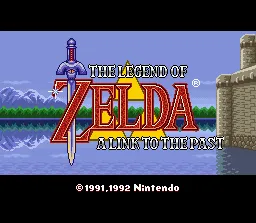

# 13 设计全景图与遗产


*众神的三角神力——奠定系列范式的里程碑作品*


## 核心问题

1. ALttP 的八大子系统和三层协同维度如何构成一个整体？系统全景图的"承重结构"是什么？
2. ALttP 确立了哪些延续至今的系列范式，哪些设计被后世淘汰及原因是什么？
3. 从 ALttP 中能提炼出哪些适用于任何动作冒险/探索类游戏的可迁移设计模式？

## 机制描述（系统全景图）

### 全景图总览

ALttP 的设计不是八个独立系统的并列，而是一个分层嵌套、以探索为核心驱动力的有机整体。以下从三个维度呈现全景：系统层级、协同网络、设计哲学骨架。

#### 维度一：系统层级

```
┌─────────────────────────────────────────────────────────────┐
│                    第四层：元结构                             │
│    线性骨架 + 非线性空间（07_叙事结构的三幕架构）              │
│    双世界系统（02_世界设计的空间复用）                         │
├─────────────────────────────────────────────────────────────┤
│                    第三层：驱动引擎                           │
│    宏循环（01_核心循环）：探索表世界 → 地下城 → 获得能力      │
│    → 解锁新区域 → 探索表世界                                 │
│    进度系统（04_进度系统）：物品即钥匙                        │
├─────────────────────────────────────────────────────────────┤
│                    第二层：内容模块                           │
│    地下城系统（03_地下城设计）：13个主题化地下城               │
│    战斗系统（05_战斗系统）：四动作框架                        │
│    谜题系统（06_谜题设计）：教学→应用→精通                   │
│    经济系统（08_经济与资源）：卢比续航 + 心之碎片驱动         │
├─────────────────────────────────────────────────────────────┤
│                    第一层：原子操作                           │
│    微循环（秒级反应）、中循环（房间级解谜/战斗）              │
│    单物品的多系统交互（09_元素协同的交互矩阵）                │
└─────────────────────────────────────────────────────────────┘
```

**阅读方式**：第一层是玩家每秒每分钟的操作体验。第二层是这些操作被组织成的内容模块（地下城/战斗/谜题/经济）。第三层是驱动整个流程循环往复的核心引擎。第四层是包裹一切的宏观结构——叙事三幕和双世界。

每个上层都依赖下层运转，但上层的质量不完全由下层决定。叙事结构（第四层）决定了情绪曲线的形状，但玩家实际感受到的情绪来自第一层和第二层的具体执行。

#### 维度二：协同网络

```
                        ┌──────────┐
                        │ 叙事结构 │
                        └────┬─────┘
                             │ 强耦合
                             ▼
┌──────────┐  强耦合  ┌──────────┐  强耦合  ┌──────────┐
│ 进度系统 │◄───────►│ 世界设计 │◄───────►│ 表/里世界│
└─────┬────┘         └────┬─────┘         └────┬─────┘
      │                   │                    │
 弱耦合│              强耦合│               弱耦合│
      │                   │                    │
      ▼                   ▼                    ▼
┌──────────┐  弱耦合  ┌──────────┐  弱耦合  ┌──────────┐
│ 战斗系统 │◄───────►│ 地下城   │◄───────►│ 经济资源 │
└─────┬────┘         └────┬─────┘         └──────────┘
      │                   │
 弱耦合│              弱耦合│
      │                   │
      ▼                   ▼
┌──────────┐  弱耦合  ┌──────────┐
│ 谜题系统 │◄───────►│ 经济资源 │
└──────────┘         └──────────┘

强耦合 7 条：骨架（移除则结构崩塌）
弱耦合 8 条：血肉（移除则体验变薄）
```

**分布规律**（→ 参见 10_系统交叉.md#系统交叉矩阵）：强耦合集中在结构层系统（世界、进度、地下城、叙事），弱耦合集中在行为层系统（战斗、经济、谜题）。结构层定义"游戏是什么"，行为层定义"玩起来怎么样"。

#### 维度三：设计哲学骨架

所有系统和协同最终可以归结为三条核心设计哲学：

**哲学一：约束催生创新**

```
SNES 6按键 → 一物多用 → 物理行为抽象 → 规则一致性 → 涌现
SNES 1MB卡带 → 双世界复用地图拓扑 → 空间复用 → 认知倍增
2D俯视角 → 空间谜题优先于物理谜题 → 推石/开关/元素触发 → 谜题类型学
```

**哲学二：线性骨架 + 非线性空间**

```
线性节点（强耦合控制）：物品获取顺序、三幕叙事转折、Boss 战顺序
非线性空间（弱耦合填充）：表世界自由探索、Dark World 地下城弹性顺序
                         心之碎片/瓶子/升级的任意顺序收集
```

**哲学三：基于状态的规则 > 基于路径的预设**

```
事件触发器检查"玩家状态是否满足"而非"玩家是否按预定路径到达"
→ 允许涌现（非预期路线）同时保障鲁棒性（Reverse Boss Order 可完整通关）
→ 规则一致性使 Bug Catching Net 自动获得反弹能力（→ 11_涌现玩法.md）
```

### 八大系统的全景定位

| 系统 | 报告 | 在全景图中的角色 | 与其他系统的关键耦合 |
|------|------|-----------------|---------------------|
| 核心循环 | 01 | 循环引擎——驱动一切运转 | 嵌套于所有系统之中 |
| 世界设计 | 02 | 空间容器——承载所有体验 | 强耦合：进度、叙事 |
| 地下城设计 | 03 | 核心内容——能力获取场所 | 强耦合：表世界、进度 |
| 进度系统 | 04 | 承重墙——物品即钥匙 | 强耦合：世界、地下城 |
| 战斗系统 | 05 | 节奏调节——紧张峰值来源 | 弱耦合：进度、谜题 |
| 谜题设计 | 06 | 认知挑战——教学→精通曲线 | 弱耦合：战斗、进度 |
| 叙事结构 | 07 | 情绪框架——三幕结构包裹 | 强耦合：世界设计 |
| 经济资源 | 08 | 续航保险——辅助而非驱动 | 弱耦合：战斗、探索 |

### 三层协同的全景整合

阶段 B 的三篇报告（09-11）揭示了系统之间如何产生超越设计者预期的化学反应。将它们整合到全景图中：

| 协同维度 | 报告 | 核心发现 | 在全景图中的位置 |
|----------|------|---------|-----------------|
| 元素协同 | 09 | Hookshot 为第一枢纽（10项交互跨三系统），物理行为抽象是协同之源 | 第一层（原子操作）的核心机制 |
| 系统交叉 | 10 | 3强耦合+4弱耦合，强弱之别决定"骨架/血肉"分工 | 跨越所有层级的连接网络 |
| 涌现玩法 | 11 | 规则推论类占60%，基于状态的检查保障鲁棒性 | 超越全景图预设的玩家行为空间 |

**关键洞察**：这三层协同不是独立的"附加层"，而是 ALttP 设计中**不可分割的有机组成部分**。如果没有一物多用（09），宏循环中"获得新能力→回去探索"就不会产生"原来这东西还能这么用"的惊喜；如果没有系统交叉（10），地下城和表世界就是两个割裂的游戏；如果没有涌现空间（11），速通社区不会持续活跃三十余年。

## 设计分析

### 0. 第一性问题：ALttP 的设计原点是什么？

如果只能保留一个设计决策作为 ALttP 的"第一性"——其他所有设计都从这个决策推导出来——那是什么？

候选答案有三个：

**候选A："物品即钥匙"（进度系统）**
- 如果选择"玩家的能力成长直接映射为空间可达性扩展"，那么：双世界是为了放大空间可达性的维度（同一物品在两个世界有不同可解锁区域），地下城是为了承载能力获取，战斗和谜题是为了让获取过程有趣。
- 支持论据：去掉"物品即钥匙"后宏循环崩塌（→ 01_核心循环.md#反事实推演），但去掉双世界后"物品即钥匙"仍然可以工作（只是探索深度减半）。
- 反驳：旷野之息没有"物品即钥匙"但实现了同样的探索驱动体验——说明"物品即钥匙"只是手段，不是目的。

**候选B："探索驱动的核心循环"**
- 如果选择"游戏的核心体验是探索未知空间"，那么：物品即钥匙是为了给探索提供结构化的节奏（获得→探索→获得→探索），双世界是为了用最小成本最大化可探索空间，教学是为了让玩家有能力探索。
- 支持论据：去掉探索驱动（改为战斗驱动或叙事驱动），ALttP 的所有系统都需要重新设计。探索是所有其他系统的"客户"——它们都服务于探索体验。
- 反驳：这太抽象了，不能推导出具体的设计决策。"探索驱动"是目标，不是设计原则。

**候选C："约束催生创新"的设计方法论**
- 如果选择"在严格约束下寻找全局最优解"作为第一性，那么：6按键→一物多用→物品即钥匙→协同涌现；1MB→双世界→空间复用；无文字→谜题自教学→三阶段。
- 支持论据：每一条具体设计决策都可以从约束+目标推导出来。这解释了"为什么是这些设计而不是其他设计"。
- 反驳：这是方法论而不是设计目标。知道"在约束下创新"不能告诉你创新的方向。

**结论** `[推测]`：ALttP 的第一性不是一个单一决策，而是**目标与方法的配对**——目标（"探索驱动的冒险"）确定了方向，方法（"约束下找最优解"）确定了路径。两者缺一不可。只有目标没有方法，设计会发散；只有方法没有目标，设计会精致但没有灵魂。

这个配对解释了为什么后续塞尔达作品虽然具体设计大不相同，但仍然"感觉像塞尔达"——它们共享同一个目标，只是在不同约束下（N64的3D、Switch的开放世界）找到了不同的最优路径。

### 1. 为什么 ALttP 的设计能够历久弥新

一个 1991 年的游戏，在三十余年后仍有活跃的速通社区、仍被视为游戏设计的教科书案例。这不是偶然。从全景图的角度可以识别出三个深层原因：

**原因一：设计哲学是约束驱动的最优解，而非时代产物**

很多"经典设计"之所以被淘汰，是因为它们是特定硬件能力的产物（如固定视角恐怖游戏源于 PS1 的 3D 渲染限制）。ALttP 的核心设计不是对限制的妥协，而是在限制中找到的**全局最优解**：

- 按键少 → 一物多用 → 不是"因为按键少所以只好让物品多用途"，而是"物品多用途本身比每个物品单一用途更好"。即使手柄有 20 个按键，一物多用仍然比逐一匹配更优雅（→ 09_元素协同.md#假设四）
- 卡带容量小 → 双世界复用 → 不是"因为容量小所以只好复用地图"，而是"同一空间的两个版本比两个独立空间更有趣"。认知复用（玩家对 Light World 的空间知识在 Dark World 部分有效）创造了双倍的探索深度，且不需要双倍的开发量（→ 02_世界设计.md）
- 没有文字教学 → 谜题自身即教学 → 不是"因为没有文字只好让谜题教玩家"，而是"通过做来学"本身是比文字说明更有效的教学方式

这些设计对硬件限制的依赖是**间接的**——限制迫使设计者探索某个方向，但设计者在该方向上找到的最优解在限制消失后仍然成立。

**原因二：规则的一致性产生了超越时代的系统深度**

ALttP 的底层设计哲学是"少量一致的规则 > 大量特殊的预设"（→ 09_元素协同.md#手法四，→ 11_涌现玩法.md#设计分析第1节）。这条哲学不依赖任何硬件或时代特征——它是一种纯粹的设计方法论。旷野之息的"化学引擎"是同一条哲学在 26 年后的全面实现，验证了其普适性。

**原因三：探索驱动的核心循环直击人类认知本能**

"看到障碍→记住它→获得能力→回去→通过障碍→发现新障碍"这个循环（→ 01_核心循环.md#宏循环）触发的不是"游戏玩家的快感"，而是人类通用的好奇心回路——对未知空间的好奇、对能力成长的满足、对记忆验证的奖励。这个回路不随时代改变。

### 2. ALttP 设计的局限与代价

全景图不应只展示成功。ALttP 的设计选择也付出了明确的代价：

**局限一：重玩时线性骨架变得可见**

首通时，线性骨架被非线性空间完美掩盖。但当玩家理解了进度系统的结构后，二周目体验会显著不同——"必须先拿弓再拿手套再打 Hera"的固定路线暴露出来。Dark World 的弹性缓解了这个问题，但 Light World 的三地下城顺序几乎完全固定。

**局限二：经济系统的深度不足**

如 08_经济与资源.md 所分析，卢比系统被有意设计为"续航保险"而非"决策引擎"。这保护了探索驱动的核心——卢比不决定"能不能去"，只决定"去得多舒服"。但代价是经济系统几乎没有策略深度。与同时期的超银河战士相比（资源管理是生存的核心），ALttP 的经济更像是辅助系统。

**局限三：叙事手段单一**

ALttP 的叙事几乎完全依赖空间叙事和线性事件触发。角色刻画极薄（Zelda 是被救援对象，Link 没有人格），对话功能性远大于文学性。空间叙事的优势是高效（不需要文本就能传达对比），劣势是情感维度有限——玩家感受到的是"氛围"而非"共情"。

**局限四：教学隐性到可能遗漏**

无文字教学在首通时创造了优雅的"发现感"，但对缺乏实验精神的玩家可能意味着"从未发现某些物品的第二用途"。现代作品倾向于在保持隐性教学的同时增加显性提示层（如旷野之息的席卡石板提示），是对这一局限的回应。

**局限五：Dark World 前期的难度跳变过于突兀**

从 Light World 到 Dark World 的难度跳变是整个游戏中最剧烈的曲线断裂。Light World 的 Tower of Hera（最后一个地下城）难度适中，但 Dark World 的第一个区域就出现了 Blue/Zazak 等显著更强的敌人。Moon Pearl 的兔子变形增加了一层额外的压力。

这种跳变在三幕结构中有叙事合理性（"被投入更危险的世界"），但对技能尚未完全巩固的中等水平玩家，可能导致一段"被碾压"的体验——不致命（因为有低死亡惩罚），但可能产生挫败感。

现代作品的处理方式通常是：在难度跳变后立即给玩家一个"喘息关卡"（如 Ocarina of Time 中成年 Link 的第一个区域实际上是安全的）。ALttP 缺少这个缓冲，可能是半线性结构在"三幕转折"处的一个设计盲点。

### 3. 设计过程的宏观还原 `[推测]`

从全景图的角度，可以逆向还原 ALttP 设计过程的宏观步骤：

```
阶段一：确定核心体验（"探索驱动的冒险"）
    → 决定：玩家的核心动力是"去新地方、发现新东西"
    → 参见 01_核心循环.md

阶段二：设计驱动引擎
    → 如何让探索持续有动力？→ "物品即钥匙"：获得能力解锁新区域
    → 参见 04_进度系统.md

阶段三：设计空间容器
    → 如何在有限容量中创造最大探索深度？→ 双世界复用地图拓扑
    → 参见 02_世界设计.md

阶段四：设计内容模块
    → 能力从哪里获得？→ 主题化地下城
    → 地下城内做什么？→ 战斗 + 谜题
    → 参见 03_地下城设计.md、05_战斗系统.md、06_谜题设计.md

阶段五：设计节奏与情绪
    → 紧张/释放如何交替？→ 表世界（放松）和地下城（紧张）的节奏交替
    → 叙事如何包裹？→ 三幕结构，线性节点控制情绪峰值
    → 参见 07_叙事结构.md

阶段六：填充辅助系统
    → 如何保障容错？→ 经济系统作为续航保险
    → 参见 08_经济与资源.md

阶段七：检验协同与涌现
    → 物品是否足够多功能？→ 一物多用检验（交互矩阵）
    → 系统之间是否有化学反应？→ 交叉映射
    → 参见 09-11 三篇报告
```

这个还原的关键观察是：**设计顺序是从上到下的**——先确定核心体验和驱动引擎（阶段一、二），再设计承载它的空间和内容（阶段三、四），最后填充辅助和检验（阶段五、六、七）。这与 10_系统交叉.md 的结论一致：先建骨架（强耦合），再填血肉（弱耦合）。

## 设计过程推导 `[推测]`

### ALttP 的设计者为什么选择了这些范式

从系列历史的角度还原这个选择过程：

**前提条件**：初代塞尔达（1986）是完全非线性的——玩家理论上可以在开局后直接前往最终地下城。Zelda II（1987）加入了更多线性约束但评价分化。ALttP 的设计团队需要在"自由探索的快感"和"引导体验的保障"之间找到平衡点 `[推测]`。

**选择过程**：

1. **保留非线性的探索感**——这是塞尔达系列的核心身份
2. **但用线性骨架确保叙事节奏**——三幕结构、物品前置关系、Boss 顺序
3. **用双世界放大"已知空间中的新发现"**——比全新的地图更高效
4. **用"物品即钥匙"替代初代的"地下城编号顺序"**——将进度控制从抽象的"你该去哪"转化为具体的"你能去哪"

这个选择的妙处在于：**玩家感受到的是"自由探索"，但设计者控制的是"什么时候能去哪里"**。自由感来自骨架之间的广阔空间，控制感来自骨架节点本身。这个范式被 Ocarina of Time 完美继承，成为塞尔达系列的基因。

## 反事实推演

### 假设一：如果去掉双世界系统

ALttP 的全景图中，双世界是最具辨识度的设计特征。假设将其替换为一个等面积的单体世界（无 Light/Dark 映射）：

后果：

- **空间叙事消失**——无法通过"同一地方被扭曲"表现善与恶的对比（→ 10_系统交叉.md#第三枢纽）
- **认知倍增效应消失**——玩家需要从零学习整个新地图，而非在"熟悉但扭曲"的空间中探索。探索深度的增量从"认知复用 × 新元素"退化为纯粹的"新地图面积"
- **世界切换作为探索工具消失**——无法在两个世界间策略性绕路（→ 02_世界设计.md）
- **Magic Mirror 的核心角色消失**——这个物品在当前设计中同时承担叙事转折、空间探索工具、地下城谜题元素三重角色，全部依赖双世界存在
- **叙事转折失去物理载体**——"被投入 Dark World"是叙事与玩法的同步高潮。如果去掉双世界，这个转折需要一个全新的替代机制

→ 结论：双世界不仅是一个"特色功能"，它是全景图中多个子系统的共同基础。移除它相当于从承重结构中抽掉一根柱子。

### 假设二：如果去掉"物品即钥匙"的进度控制

假设物品只在战斗和解谜中有用，不再作为区域解锁的工具（→ 10_系统交叉.md#假设三）：

后果：

- **宏循环断裂**——"探索→地下城→获得能力→解锁新区域"的循环失去驱动力
- **"障碍记忆"机制失效**——表世界没有需要记忆的障碍，探索变成无方向漫游
- **地下城与表世界脱钩**——地下城不再产出"钥匙"，退化为独立的关卡序列
- **全景图从"探索驱动的冒险"退化为"战斗+解谜的线性关卡序列"**

→ 结论：物品即钥匙是整个全景图的承重墙。它是 04_进度系统.md 的核心论点，也是 10_系统交叉.md 识别的第一枢纽。

### 假设三：如果 ALttP 采用现代开放世界设计（取消线性骨架）

假设取消所有物品前置关系，所有区域从一开始就可达（类似旷野之息的设计哲学）：

后果：

- **"障碍记忆"驱动的回溯探索完全消失**——没有障碍就没有记忆，没有记忆就没有"回去"的动力
- **三幕叙事结构瓦解**——线性节点是叙事节奏的锚点，取消它们意味着叙事失去控制力
- **教学→应用→精通的闭环被打破**——没有"获得物品后必须在此使用"的教学房间，新能力的学习缺乏强制验证
- **心之碎片的可达性梯度消失**——所有碎片从一开始就可达，收集从"能力验证"退化为纯粹的寻宝

但这个假设也揭示了 ALttP 设计的适用边界：**旷野之息证明了"取消线性骨架"本身可以是一种有效的设计选择**——但它需要一套全新的驱动系统（化学引擎、塔/祠的分布、料理系统）来替代"物品即钥匙"的循环。旷野之息不是"更好的 ALttP"，而是"用不同范式解决同一核心问题（如何驱动探索）的另一种回答"。

→ 参见 06_谜题设计.md（教学三阶段），→ 参见 07_叙事结构.md（三幕结构）

### 假设四：如果取消一物多用，每个物品单一用途

→ 参见 09_元素协同.md#假设一。结论：物品数量需要翻倍，菜单切换频率翻倍，探索乐趣从"发现新用途"退化为"匹配正确工具"，涌现消失。

## 可迁移经验

以下八条设计模式从 ALttP 的全景图中提炼，每条标注了在其他游戏中的应用方式和限制条件。

### 模式一：物品即钥匙的进度控制

**一句话描述**：将玩家的能力成长直接映射为空间可达性的扩展，使"变强"等价于"能去更多地方"。

**ALttP 中的具体实现**：每个核心物品同时承担三种角色——解谜工具（地下城内）、空间钥匙（表世界障碍）、战斗手段（敌人交互）。获得 Hookshot 的瞬间，玩家获得了"跨越悬崖"的能力、一种战斗眩晕手段、一个拉取远处道具的工具，三种用途共享同一个操作。

**如何在其他游戏中应用**：

- 设计每种能力/技能时，强制回答：它如何改变玩家与世界交互的方式？如果它只改变数值（伤害+10），它不是"钥匙"，只是"升级"
- 将能力与地形/环境障碍建立显式映射：能力 A → 克服障碍类型 A。映射关系的视觉线索（"这种石头只有这种能力能打碎"）让玩家形成"障碍→能力→记忆"的认知闭环
- 获取每种能力后，在世界中预置至少 3 处需要该能力的可发现区域，确保玩家有足够的"回去验证"的空间

**注意事项/限制条件**：

- 需要足够的世界空间来承载回溯探索。如果世界太小，"回去"的成本为零，记忆机制失去意义
- 物品-障碍的对应关系不能太直白（"红钥匙开红门"），否则退化为钥匙-锁的匹配游戏。ALttP 的做法是让物品的"钥匙"功能成为其物理行为的自然延伸（Hookshot 跨悬崖是"抓取并拉向"规则的语境应用）
- 这种模式适用于"探索驱动"的游戏，不适用于"叙事驱动"或"竞技驱动"的游戏

→ 参见 04_进度系统.md（物品即钥匙的完整分析）
→ 参见 09_元素协同.md（物品在多系统中的交互矩阵）

### 模式二：双世界/双状态的空间复用

**一句话描述**：让同一份物理空间在不同世界状态/时间线/维度下呈现不同的面貌，以最小内容增量获得最大体验增量。

**ALttP 中的具体实现**：Light World 和 Dark World 共享完全相同的空间拓扑（1:1 映射），但表层完全不同——视觉风格、敌人配置、可达路径、叙事意义全部改变。认知复用使玩家对 Light World 的空间知识在 Dark World 部分有效，同时新元素创造了足够的发现感。

**如何在其他游戏中应用**：

- "双状态"不限于空间维度：时间维度（过去/未来）、季节维度（夏/冬）、虚实维度（现实/梦境）都可以实现同样的空间复用
- 两个版本共享空间骨架但改变可达性——Light World 到不了的地方，Dark World 可能可以到，反之亦然。这创造了跨版本绕路的策略空间
- 在两个版本中放置"视觉上对应但功能不同"的地标（ALttP 中 Kakariko Village vs Village of Outcasts），让空间叙事自动产生

**注意事项/限制条件**：

- 两个世界的差异必须足够显著（ALttP 的做法是色调/主题/敌人全部改变），否则玩家会感觉是"换皮"
- 认知复用需要两个版本有足够多的共同点——如果完全不同，复用就失去了意义；如果太相似，就没有新发现感
- 世界切换机制本身需要足够低的成本（ALttP 的 Magic Mirror 是即时切换），否则玩家会回避切换

→ 参见 02_世界设计.md（双世界的完整分析）

### 模式三：一物多用的协同设计

**一句话描述**：让每个能力/工具在至少两个不同系统中承担不同角色，使玩家的每次能力获取都产生跨系统的连锁价值。

**ALttP 中的具体实现**：Hookshot 的 10 项交互横跨解谜（4项）、探索（3项）、战斗（3项）三个系统。核心方法是"物理行为抽象"——钩爪的核心机制是"向目标发射并拉回/拉向"，这个物理行为与不同类型的对象交互时自然产生不同效果（→ 09_元素协同.md#枢纽节点识别）。

**如何在其他游戏中应用**：

- 从物理行为出发设计能力，而非从功能需求出发。"抓取""推""拉""点燃""冻结"等物理行为天然与多种对象产生多种交互
- 建立能力-对象交互矩阵：对每种能力，列举它与世界中所有对象类型的全部可能交互。识别"每个系统至少有 1 项核心交互"的枢纽能力
- 用约束驱动多功能：限制玩家同一时间可装备的能力数量，迫使每个能力"值得占用一个装备槽"

**注意事项/限制条件**：

- 不是所有物品都需要多功能。进度门物品（Moon Pearl、Magic Mirror）可以只有单一用途——它们的角色是控制流程，不是提供玩法深度
- 多功能的上限是操作的一致性——如果同一操作在不同语境下效果完全不可预测，玩家会感到混乱。ALttP 的解决方案是让不同语境下的效果都能从物理行为推导出来
- 枢纽物品的获取时机至关重要：太早则玩家不理解系统间的联系，太晚则协同来不及展开。ALttP 将第一枢纽（Hookshot）安排在中期偏前

→ 参见 09_元素协同.md（交互矩阵和枢纽节点分析）
→ 参见 09_元素协同.md#手法一（从物理行为抽象设计物品）

### 模式四：教学→应用→精通的三阶段

**一句话描述**：每种新能力的引入遵循"安全环境展示→引导场景练习→高压考核验证"的三阶段，使玩家在不阅读任何文字的情况下掌握复杂机制。

**ALttP 中的具体实现**：每个地下城的核心物品在获取后立即进入三阶段——教学房间（无威胁环境，单一变量展示核心操作）→ 应用房间（加入敌人或时间压力，要求在干扰下使用）→ Boss 战（综合考核，必须正确使用才能获胜）。

**如何在其他游戏中应用**：

- 三阶段对应三种认知负荷：教学阶段 = 低认知负荷（只需要关注新机制）；应用阶段 = 中认知负荷（新机制 + 已有机制）；精通阶段 = 高认知负荷（新机制 + 已有机制 + 时间/生存压力）
- 每个阶段只增加一个新变量。教学→应用增加"威胁"变量，应用→精通增加"时间压力"变量。同时增加多个变量会导致认知过载
- 精通阶段（Boss 战）必须是"不使用新能力就无法通过"，否则玩家可能用旧方法回避新机制，失去学习机会

**注意事项/限制条件**：

- 三阶段的节奏感容易被打破——如果教学房间太长，老玩家会感到无聊；如果太短，新手来不及理解。ALttP 的解决方案是让教学房间极短（通常只有 1-2 个房间），但让应用阶段足够长
- 这个模式适用于有明确"新能力获取"节奏的游戏。对于开放世界游戏（能力不是按顺序获得的），需要替代的教学方案

→ 参见 06_谜题设计.md（三阶段的完整分析）

### 模式五：线性骨架 + 非线性空间

**一句话描述**：用少量不可跳过的线性节点控制叙事节奏和认知曲线，节点之间的广阔空间留给玩家自由探索。

**ALttP 中的具体实现**：线性骨架是"三个挂坠→Hyrule Castle Tower→Dark World 入口→七个地下城→Ganon's Tower"——这些节点的顺序由物品前置关系硬性锁死。但骨架之间的空间（表世界探索、Dark World 部分地下城的弹性顺序、心之碎片/瓶子/升级的任意收集）完全是非线性的。玩家感受不到线性约束的压迫，因为节点间的空间足够广阔（→ 10_系统交叉.md#设计分析第3节）。

**如何在其他游戏中应用**：

- 明确区分"骨架节点"和"自由空间"。骨架节点的特征是：移除它，后续体验会根本改变（如跳过获得 Hookshot，Swamp Palace 无法完成）。自由空间的特征是：不同玩家可以以不同顺序/方式体验，不影响核心叙事
- 骨架节点之间必须有足够的"空间距离"——如果两个节点之间的自由空间太小，玩家会感觉被牵引
- 自由空间中的内容必须是"有意义的可选"——心之碎片的收集改变 HP 上限，瓶子的获取增加回复手段。如果可选内容只是装饰性的（纯粹的收集品），它不构成"空间"的深度

**注意事项/限制条件**：

- 骨架节点的数量需要精确控制——太少则节奏失控，太多则自由感消失。ALttP 的 13 个地下城对应约 13 个骨架节点，在 15-20 小时的流程中平均约每 1-1.5 小时一个节点
- 这个模式的核心张力是"骨架的可见性"。首通时骨架应该被自由空间掩盖，但重玩时骨架会变得越来越明显——这是线性-非线性混合结构的固有代价

→ 参见 07_叙事结构.md（线性节点 + 非线性空间）
→ 参见 10_系统交叉.md#手法四（线性骨架控制节奏，非线性空间制造自由）

### 模式六：表世界/地下城的节奏交替

**一句话描述**：高压封闭空间（地下城）和低压开放空间（表世界）交替出现，形成紧张-释放-紧张-释放的心律节奏。

**ALttP 中的具体实现**：宏循环（→ 01_核心循环.md#宏循环）的本质是一次心跳——地下城是收缩（线性、高压、有明确目标），表世界是舒张（非线性、低压、自由漫游）。每次"完成地下城→回到表世界→用新能力探索"都是一次完整的紧张-释放周期。

**如何在其他游戏中应用**：

- "地下城"和"表世界"是抽象概念，可以映射为任何"封闭/开放"的空间对——任务/自由漫游、基地/战场、安全区/危险区
- 交替的节奏不是均匀的——随着流程推进，"紧张"阶段应该逐渐加长、加压。ALttP 的 Dark World 地下城比 Light World 更长更难，表世界的探索空间也更大
- "释放"阶段不是纯粹的休息——它同时是"消化新能力"的时间。玩家在表世界自由使用刚获得的新物品，在低压环境中建立直觉，为下一个高压阶段做准备

**注意事项/限制条件**：

- 交替不能变成机械的"A-B-A-B"模式。ALttP 的做法是在交替中穿插叙事事件（被投入 Dark World 是最大的节奏转折），打破机械感
- 如果"释放"阶段过长，玩家会失去目标感。ALttP 用"障碍记忆"确保表世界漫游始终有方向——"我记得那边有个到不了的地方"

→ 参见 01_核心循环.md（宏循环的紧张-释放节奏）

### 模式七："障碍记忆"作为隐式任务系统

**一句话描述**：在世界中预置可见但不可达的区域，当玩家获得对应能力后，先前的"障碍"自动转化为"任务目标"，无需任何文字提示。

**ALttP 中的具体实现**：Light World 中散布着大量需要 Power Glove/Hammer/Hookshot/Flippers 才能通过的地形障碍。玩家在首次漫游时遇到这些障碍，形成空间记忆。获得对应能力后，记忆被激活，驱使玩家回溯探索——整个过程不需要任何任务日志或地图标记。

**如何在其他游戏中应用**：

- 在玩家的早期路径上布置障碍（视觉上显著的"到不了的地方"），确保玩家在获得能力之前就已经见过它们
- 障碍的视觉线索必须足够明确——"这种颜色的石头""这种宽度的悬崖""这种深度的水"。线索的一致性让玩家形成"障碍类型→需要的未知能力"的认知关联
- 获得能力后的第一个使用场景应该在表世界（而非地下城内），让玩家立即体验到"记忆→验证→奖励"的正反馈

**注意事项/限制条件**：

- 障碍的密度需要控制——太少则记忆不成立（玩家忘了障碍在哪），太多则世界显得处处封闭
- 障碍必须在玩家的自然路径上。如果障碍藏在偏僻角落，玩家从未见过它，获得能力后也不会回去
- 这个机制依赖空间记忆，对不擅长记忆空间的玩家效果较弱。现代作品通常补充地图标记系统作为辅助

→ 参见 02_世界设计.md（障碍前置-能力后置的记忆回路）
→ 参见 10_系统交叉.md#交叉点4（障碍记忆作为世界-进度的交叉核心）

### 模式八：约束催生创新的方法论

**一句话描述**：主动引入约束（输入方式、世界空间、能力数量），迫使每个设计元素承担更多功能，从而产生超越无约束设计下的质量。

**ALttP 中的具体实现**：整个设计可以在三条约束链上还原（→ 09_元素协同.md#约束→创新的因果链）：

```
6按键约束 → 一物多用 → 物理行为抽象 → 规则一致性 → 涌现
1MB容量约束 → 双世界复用 → 空间复用 → 认知倍增
2D视角约束 → 空间谜题优先 → 推石/开关/元素触发 → 谜题类型学
```

**如何在其他游戏中应用**：

- 在设计初期，主动引入 1-2 条"不合理"的约束（如"主角不能跳跃""世界只有 3 个区域""玩家只有 3 个快捷键"），然后在这些约束下寻找最优解
- 约束必须是**真实的**——如果约束可以被轻松绕过，它不会催生任何创新。"按键不够"是真实的约束，"尽量少用按键"是虚假的约束
- 约束的数量不能太多——ALttP 的三条约束链互相不冲突，但如果有第四条（如"每个地下城必须在 5 个房间以内"），可能开始限制设计的自由度
- 关键心态：**不将约束视为需要解决的问题，而是视为设计的输入条件**。ALttP 的设计者没有问"如何解决按键不够的问题"，而是问"在按键不够的条件下，如何做出最好的物品系统"

**注意事项/限制条件**：

- 约束催生创新的前提是设计者有能力在约束中找到全局最优解。如果能力不足，约束只会导致偷工减料
- 不是所有约束都能催生创新——某些约束只是纯粹的阻碍（如开发周期过短、团队人力不足）。能催生创新的约束是**设计层面的约束**（输入方式、世界结构、核心机制），而非**执行层面的约束**（时间、人力、预算）

→ 参见 09_元素协同.md#设计分析第1节（约束→创新的因果链）
→ 参见 00_分析方法论.md#分析原则第6条（约束意识）

## 补充材料

### ALttP 确立的系列范式清单

以下元素首次出现于 ALttP，并成为塞尔达系列的标志性传统：

| 范式 | 首次登场 | 后世演变 |
|------|---------|---------|
| 大师之剑（Master Sword） | ALttP | 时之笛中成为叙事核心（拔剑=时间跳跃），旷野之息中回归为可选升级 |
| 双世界/平行世界 | ALttP（Light/Dark） | 时之笛（童年/成年）、黄昏公主（光/影）、众神的三角神力2（Lorule） |
| 贤者（Sages）角色 | ALttP | 时之笛（七贤者封印）、风之律动（续贤者传统） |
| 主题化地下城 | ALttP（森林/水/冰/骷髅/沙漠等） | 成为系列标配，时之笛将其推向3D巅峰 |
| 心之碎片（Pieces of Heart） | ALttP | 延续至天空之剑，旷野之息用"祠"替代 |
| Kakariko Village | ALttP | 时之笛、黄昏公主、旷野之息中反复出现 |
| Lake Hylia | ALttP | 时之笛、黄昏公主中的标志性地点 |
| 旋转斩（Spin Attack） | ALttP | 成为 Link 的标志性战斗动作 |
| 横向挥剑 | ALttP | 替代了初代的戳刺，成为2D塞尔达标准 |
| Cuccos 及其复仇机制 | ALttP | 成为系列传统彩蛋 |
| 假主角反派（Agahnim→Ganon） | ALttP | 时之笛（Zelda→Ganondorf）、黄昏公主（Zant→Ganondorf） |
| 多个经典音乐主题 | ALttP | Zelda's Lullaby、Hyrule Castle、Ganon 主题成为系列 DNA |

### 被后世淘汰的设计

| 被淘汰的设计 | 淘汰原因 | 淘汰者 |
|-------------|---------|--------|
| 严格的物品→进度门映射 | 过于刚性，限制玩家自由度 | 旷野之息用开放世界 + 祠系统替代 |
| 无文字教学 | 对缺乏实验精神的玩家不友好 | 后续作品增加显性提示层 |
| 固定的地下城攻略顺序 | 与开放世界哲学矛盾 | 众神的三角神力2引入"租借物品"系统 |
| 2D俯视角空间谜题 | 3D 化后空间维度改变 | 时之笛转向3D空间谜题 |
| 死亡惩罚极低 | 现代作品追求差异化难度体验 | 部分作品（如魂系列影响）增加惩罚 |

**关键观察**：被淘汰的设计不是"错误的设计"，而是"与新时代的设计哲学不兼容的设计"。严格的物品→进度门映射在 ALttP 的线性-非线性混合结构中是最优解，但在旷野之息的完全开放结构中就成了阻碍。设计模式的价值取决于上下文。

### ALttP 与后世作品的范式对比

| 设计维度 | ALttP (1991) | 时之笛 (1998) | 众神的三角神力2 (2013) | 旷野之息 (2017) |
|----------|-------------|--------------|----------------------|----------------|
| 进度控制 | 物品即钥匙（严格映射） | 物品即钥匙（3D 版） | 租借物品（弹性映射） | 祠/能力自由获取（无映射） |
| 双世界 | Light/Dark 空间 | 童年/成年 时间 | Hyrule/Lorule 空间 | 无（单一开放世界） |
| 线性程度 | 线性骨架+非线性空间 | 线性骨架更强 | 骨架弱化、空间扩大 | 几乎纯非线性 |
| 教学方式 | 纯隐性 | 隐性+少量NPC提示 | 隐性+显性混合 | 大量显性+环境隐性 |
| 物品协同 | 高（按键约束驱动） | 中（3D 化分散了协同密度） | 高（回归2D协同设计） | 极高（化学引擎） |
| 涌现程度 | 中（规则推论为主） | 中（类似涌现谱系） | 中 | 极高（涌现即核心玩法） |

**趋势总结**：从 ALttP 到旷野之息，塞尔达系列的设计演变可以用一条线概括——**从"设计者引导的发现"走向"系统驱动的涌现"**。ALttP 的大多数"发现"是设计者预设的（获得 Hookshot 后能去哪里是设计好的），但底层规则的一致性允许了非预期的涌现（Bug Catching Net 反弹）。旷野之息将这个比例反转——大多数发现是系统驱动的（化学引擎的组合），设计者预设的只是规则而非具体场景。两者不是优劣关系，而是同一设计哲学的不同实现程度。

### 全系列报告交叉引用索引

| 报告 | 核心结论 | 与本报告的关联 |
|------|---------|---------------|
| 00_分析方法论.md | 分析原则与工具箱 | 全景图的方法论基础 |
| 01_核心循环.md | 四层嵌套循环，宏循环是探索驱动引擎 | 全景图第三层（驱动引擎） |
| 02_世界设计.md | 双世界1:1映射，认知复用倍增探索深度 | 全景图第四层（元结构） |
| 03_地下城设计.md | 13个主题化地下城，路径结构类型学 | 全景图第二层（内容模块） |
| 04_进度系统.md | 物品即钥匙，按键约束塑造多功能设计 | 全景图承重墙（模式一、八的来源） |
| 05_战斗系统.md | 四动作框架，颜色编码可读性 | 全景图第二层（战斗模块） |
| 06_谜题设计.md | 教学→应用→精通三阶段 | 可迁移模式四 |
| 07_叙事结构.md | 三幕结构，线性节点+非线性空间 | 全景图第四层（元结构），模式五 |
| 08_经济与资源.md | 卢比续航保险，心之碎片驱动探索 | 全景图辅助系统定位 |
| 09_元素协同.md | Hookshot 第一枢纽，物理行为抽象，约束→创新 | 全景图维度三（设计哲学），模式三、八 |
| 10_系统交叉.md | 3强+4弱耦合，先骨架后血肉 | 全景图维度二（协同网络），模式五、七 |
| 11_涌现玩法.md | 规则推论60%，基于状态的检查保障鲁棒性 | 全景图的"溢出效应"，验证规则一致性 |
| 12_难度与心流.md | 难度曲线与节奏控制 | 全景图的节奏分析 |

---

*本报告是《塞尔达传说：众神的三角神力》游戏设计分析系列的第 13 篇（最终篇），属于阶段 C：综合评价。本系列从方法论（00）出发，经过系统拆解（01-08）、协同与涌现分析（09-11）、综合评价（12-13），最终在本报告中完成全景整合。*
