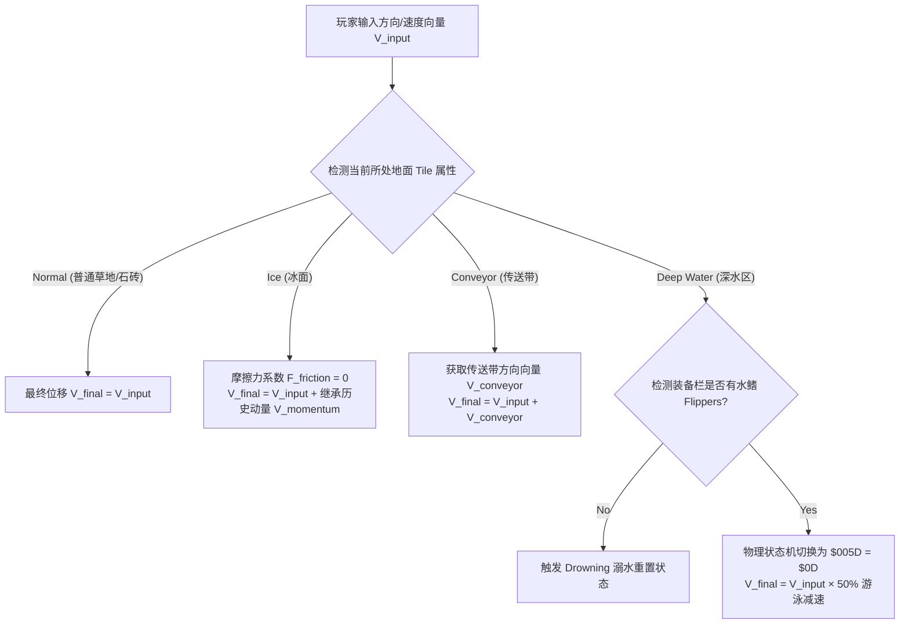

# 《塞尔达传说：众神的三角力量》角色动作状态机拆解报告

**摘要：**
《塞尔达传说：众神的三角力量》（下文简称 ALttP）的动作系统并非单纯的"动画播放"，而是一个由玩家输入、装备状态、网格物理和世界交互共同驱动的精密逻辑状态机（Logical FSM）。在超级任天堂（SNES）极度受限的硬件性能下，任天堂通过巧妙的"状态限制"与底层代码设计，硬编码出了极具深度、操作感丝滑的动作系统。

本报告从**逻辑状态机、物理规则判定、内存寄存器**等底层视角，对 ALttP 的 Link（林克）动作状态机进行终极重构与深度剖析，涵盖所有动作状态、道具交互、环境修饰、系统中断以及底层数学逻辑。

---

### 一、动作状态机全局架构图 (FSM Diagram)

本图采用**状态分层（State Clusters）**设计。左侧为全局高优先级中断，可打断绝大多数普通状态。

```
stateDiagram-v2
    %% 全局高优先级中断 (可打断除过场外的大部分状态)
    state Global_Interrupts {
        direction TB
        [*] --> Hurt_Knockback : 受击判定 (物理速度清零 → 施加反向击退力)
        Hurt_Knockback --> Invincible_Modifier : 击退结束 (约40帧无敌闪烁)
        [*] --> Death_Sequence : HP归0 (最高优先级，瞬间中止一切动作)
        [*] --> Dialogue_Read : 触发对话/NPC交互 (冻结全局时间)
        [*] --> Bunny_Form : 未装备月之珍珠进入暗黑世界 (覆盖模型与权限)
    }

    [*] --> Idle

    %% 1. 基础移动与地形修饰
    state Locomotion_&_Terrain {
        Idle --> Walking : 轴向输入
        Walking --> Idle : 无输入
        Walking --> Pushing : 阻挡物方向持续输入 > 30帧
        Pushing --> Walking : 释放方向

        Walking --> Ledge_Jump : 接触高低差单向边缘
        Ledge_Jump --> Walking : 落地 (4帧硬直)

        Walking --> Stair_Climbing : 接触楼梯/梯子碰撞区
        Stair_Climbing --> Walking : 离开楼梯边界
    }

    %% 2. 飞马靴冲刺系统
    state Pegasus_Dash_System {
        Idle --> Dash_Charging : 装备飞马靴 + 按住A键 (30帧)
        Dash_Charging --> Dashing : 蓄力满 (第31帧)
        Dashing --> Walking : 玩家按下相反方向键中断
        Dashing --> Dash_Bonk : 撞击坚固实体墙/重型阻挡物
        Dash_Bonk --> Idle : 反弹跌坐硬直结束 (约30帧)
        Dashing --> Dash_Attack : 冲刺中按下B键
        Dash_Attack --> Idle : 松开按键/停止
    }

    %% 3. 剑术战斗系统
    state Sword_Combat_System {
        Idle --> Sword_Slash : 按下B键
        Walking --> Sword_Slash : 按下B键
        Sword_Slash --> Spawn_SwordBeam : HP满值衍生远程剑气
        Sword_Slash --> Input_Buffer : 后摇最后3帧
        Input_Buffer --> Sword_Slash : 缓存了B键输入
        Input_Buffer --> Idle : 判定结束无输入

        Idle --> Spin_Charging : 长按B键 (约60帧)
        Spin_Charging --> Spin_Releasing : 释放B键
        Spin_Releasing --> Idle : 360°回旋斩判定结束

        Idle --> Hammer_Slam : 装备锤子 + 按下Y键
        Hammer_Slam --> Idle : 砸地判定及震波消失
    }

    %% 4. 道具与解谜交互系统
    state Item_&_Interaction_System {
        %% 举投抛
        Idle --> Lifting : 接近轻/重物 + 按下A键
        Lifting --> Holding_Idle : 举起动画结束 (重物需力量手套)
        Holding_Idle --> Throwing : 按下A键
        Throwing --> Idle

        %% 拔河拉扯
        Idle --> Pulling : 接近拉杆/雕像 + 按住A + 反向输入
        Pulling --> Idle : 释放A键 / 拉满触发机关

        %% 道具使用 (按控制权分配分类)
        Idle --> Boomerang_Throw : 按Y (脱手型，即刻恢复控制)
        Idle --> Bow_Shoot : 按Y (定身型，锁死移动直至箭射出)
        Idle --> Magic_Rod_Cast : 按Y (定身型，发射火/冰球)
        Idle --> Shovel_Dig : 按Y (锁定型，原地播放挖掘动画)

        %% 钩爪位移
        Idle --> Hookshot_Fire : 按下Y键
        Hookshot_Fire --> Hookshot_Fly : 击中锚点 (无视地形飞越)
        Hookshot_Fly --> Idle : 抵达目标 / 撞墙提前终止

        %% 并行修饰状态
        Idle --> Cape_Invisible : 隐身斗篷/无敌杖 (Hurtbox摘除)
        Cape_Invisible --> Idle : 魔法耗尽 / 再次按Y

        %% 全屏施法
        Idle --> Medallion_Casting : 使用三大徽章 (Ether/Bombos/Quake)
        Medallion_Casting --> Idle : 全屏判定完成
    }

    %% 5. 环境强制位移系统
    state Environmental_Forced {
        [*] --> Ice_Slipping : 踏入冰面 (摩擦力归零，继承动量)
        [*] --> Conveyor_Moving : 踏入传送带 (注入强制偏移向量)
        [*] --> Falling_Pit : 踩入深渊空洞 (坠落动画 + 扣血 + 传送至安全入口)
        [*] --> Drowning_Reset : 无水鳍落水 (溺水动画 + 扣半颗心 + 坐标回溯)
        [*] --> Swimming : 装备水鳍进入深水 (游泳状态，动作集受限)
    }

    %% 状态间中断
    Locomotion_&_Terrain --> Hurt_Knockback : 碰撞触发
    Pegasus_Dash_System --> Hurt_Knockback : 碰撞触发
    Sword_Combat_System --> Hurt_Knockback : 碰撞触发
    Item_&_Interaction_System --> Hurt_Knockback : 碰撞触发
```

---

### 二、基础移动与物理状态机 (Locomotion & Physics FSM)

最底层、优先级最低的状态循环，随时可被其他主动动作或受击状态打断。

#### 站立 (Idle)
- 地面上的静止状态，严格锁定四方向朝向（上下左右）。
- 长时间无输入，状态机触发"不耐烦"子状态（擦汗、东张西望），增强角色生命力。

#### 行走 (Walking)
- 八方向移动。由于底层代码未对斜向移动的速度向量进行归一化（Normalize）计算，林克的斜向移动速度比正向移动快约 41%（$\sqrt{1^2+1^2} \approx 1.41$）。

**拐角平移修正机制（Sub-tile Alignment / Corner Slipping）数学模型：**

林克的碰撞盒（AABB）为 $16 \times 16$ 像素。当林克向右移动，但右上角撞到墙角时：

$$\Delta Y = \text{Link\_Y} - \text{Corner\_Y}$$

- **若 $\Delta Y < 8$ 像素**：状态机判断玩家意图是通过该拐角。系统在执行常规 X 轴向右位移的同时，**硬编码一个向下的 Y 轴偏置量（Offset = +1 像素/帧）**，将林克"挤"过墙角。
- **若 $\Delta Y \ge 8$ 像素**：判定为完全碰撞阻挡，速度归零（卡住）。

这一设计保证了即使在极其狭窄的地牢通道（Tile 宽度也是 $16 \times 16$ 像素）中，玩家也不会因为 1 像素的对齐偏差而频繁卡墙，手感极为丝滑。

#### 推墙/推箱子 (Pushing)
- **状态转换滞后（Hysteresis）**：玩家必须在 `Walking` 状态下，持续向阻挡物方向输入方向键**超过 30 帧**，状态机才会流转为 `Pushing`（播放推墙动画，并判定是否触发特定物体的位移逻辑）。

#### 高低差跳跃 (Ledge Jump)
- **触发机制**：林克从高平台边缘向低处平台移动。边缘配有单向通行碰撞 mask。
- **状态表现**：跨越边缘时，系统强制将物理状态改为 `$005D = $06`（跳跃），屏蔽所有移动与攻击输入。
- **物理参数**：施加固定的 X/Y 轴抛物线轨迹位移，临时关闭与悬崖高度墙体的碰撞检测。
- **落地结算**：落地后进入 4 帧的落地硬直（Landing Buffer），随后将 Z 轴高度同步为当前低平台高度，回归 `Idle`。

#### 上下楼梯/爬梯 (Stair & Ladder Climbing)
- **进入判定**：接触楼梯（斜向位移）或梯子（垂直位移）的特定触发区域时，状态机被接管。
- **运动锁定（Axis Snapping）**：
    - **梯子**：林克被强行锁定在梯子的 X 轴中心线上，**只能进行 Y 轴（上下）移动**，屏蔽左右移动、挥剑与几乎所有道具。
    - **楼梯**：系统按固定斜率（每移动 X 轴 1 像素，同时移动 Y 轴 1 像素）进行对角线插值移动，移动速度**强制减半**。
- 离开楼梯/梯子边界后自动退回常规移动状态。

---

### 三、飞马靴冲刺系统 (Pegasus Dash System)

#### 冲刺 (Dashing)
- **进入条件**：装备飞马靴，按住 A 键持续移动约 0.5 秒（30 帧）后触发。
- **起步手感**：速度并非瞬间由 $1.5 \text{ px/f}$ 飙升至 $3 \text{ px/f}$，而是通过 30 帧的线性插值（Lerp）平滑加速，赋予飞马靴极佳的"起步重量感"。
- **碰撞分支**：
    - **撞击坚固墙壁** → 切入 `Dash_Bonk`（反弹硬直）。林克弹回跌坐约 30 帧（头上冒星星），伴随全屏震动与特定音效。**不扣除生命值**，属于纯粹的时间惩罚。
    - **撞击特定树木/障碍物** → 向被撞物体发送交互信号，触发掉落物（心、钥匙或昆虫），林克中断冲刺。
    - **撞击敌人** → 触发 Dash Attack 结算，造成击退和两倍于普通挥剑的伤害。

#### 冲刺攻击 (Dash Attack)
- **状态融合**：在 `Dashing` 状态下按下 B 键，状态机切入 `Dash_Attack`。林克的剑一直前指，碰撞判定框由横向扇形变为**前向长方形**。伤害等同于回旋斩，是速通玩家最高频使用的赶路与清怪融合动作。

---

### 四、战斗与攻击状态机 (Combat & Attack FSM)

ALttP 最精妙的模块，通过"一键多用"实现丰富的战斗深度。

#### 基础挥剑 (Basic Slash)
- **状态逻辑**：`Input (B)` → `Wind-up`（前摇4帧）→ `Active`（扇形判定12帧）→ `Recovery`（后摇6帧）。整个循环约 22-24 帧。
- **无惩罚连发**：没有连招派生树，也没有疲劳惩罚。快速连点 B 键，林克会以最快物理帧率不断重复单一的右至左横扫斩击。
- **满血剑气（Sword Beam）**：在挥剑进入 `Active` 帧的瞬间，状态机同时检测两个条件：林克当前 HP 是否满值，以及剑等级寄存器 `$0359` 是否达到 Lv2 及以上。初始的战士之剑（Fighter's Sword, Lv1）即使满血也无法释放剑气，必须升级到大师之剑（Master Sword, Lv2）及以上才能触发该状态分支。这是任天堂通过"状态机扩充"奖励玩家成长的设计哲学。
- **微操位移（挥剑微步）**：进入 `Active` 判定帧时，强制给林克一个面朝方向的微小位移（约 2 像素），让玩家通过节奏感微调攻击距离。

#### 被动盾防 (Passive Shield)
- **无键防御**：盾牌没有主动按键。当林克处于 `Idle` 或 `Walking` 状态时，正面 90° 扇形区域自动激活盾牌判定盒。
- **分级掩码（Tiered Mask）**：盾牌防御 FSM 依据装备等级调用不同的判定矩阵：
    - **小盾（Lv1）**：只能抵挡物理投射物（箭矢、守卫的长矛）。
    - **红盾（Lv2）**：增加对魔法投射物（火球）的判定掩码。
    - **镜盾（Lv3）**：增加对激光（Laser / Beamos）的判定掩码。
    - 部分敌人（如长矛兵）的近战攻击即使在正面也会无视盾牌判定，因为底层将其标记为 `Melee Hurtbox` 而非 `Projectile`。

**被动盾防扇形判定数学模型：**

设林克面朝向量为 $\vec{D}$，投射物移动向量为 $\vec{P}$：

$$\cos\theta = \frac{\vec{D} \cdot (-\vec{P})}{\|\vec{D}\| \|\vec{P}\|}$$

- 当 $\theta \le 45°$（投射物来自正面 90° 扇形区域内）：播放金属碰撞音效，销毁投射物实体或赋予反向散射速度。
- 当 $\theta > 45°$（来自侧面或背后）：判定失效，进入 `Hurt_Knockback`。

- **防御失效**：当林克处于挥剑（`Slash`）、冲刺（`Dash`）、举物（`Lift`）或受击（`Hurt`）状态时，盾牌防御判定**硬性失效**。

#### 剑刃反弹 (Sword Bounce / Recoil)
- **触发条件**：当林克用剑砍到坚固物体（墙壁、无敌装甲的敌人）时，系统切入一种微型击退状态（`$005D = $03` 类逻辑）。
- **状态表现**：发出"叮"的音效，强制给林克施加一个后退的短促向量，并在数帧内切断连续挥剑的缓冲输入。这赋予了"砍到硬物"的力反馈，防止玩家无脑连砍。

#### 蓄力回旋斩 (Spin Attack)
- **状态锁定**：长按 B 键进入 `Charge`（约 60 帧）。蓄力完成后全身闪烁。松开按键触发 360° 全方位物理判定，伤害为普通斩击的两倍，判定帧覆盖全身。蓄力期间可以移动（速度降低 25%），但无法改变面朝方向。

#### 魔力之锤 (Magic Hammer)
- **动作帧逻辑**：`Input (Y)` → `Heavy Wind-up`（起手前摇 12 帧）→ `Slam`（砸地判定 8 帧）→ `Recovery`（后摇 10 帧）。
- **物理化学反应**：
    - 砸地瞬间以锤头落点为中心生成半径约 24 像素的圆形"震波（Shockwave）"实体。
    - 震波可将特定地面机关（如人脸地桩）的高度属性强行置为 0（变平）；使重甲敌人（如面具怪 Helmasaur）的头部面罩碰撞体剥离；使特定爬行敌人翻转（进入无防备受击状态）。

---

### 五、物品、道具与解谜交互状态机 (Item & Interaction FSM)

#### 道具使用的底层状态分类

虽然都是"按下 Y 键使用道具"，但底层状态机对不同道具的处理逻辑截然不同。任天堂通过精确分配"控制权"，做出了完全不同的操作手感：

1. **脱手型（Fire-and-Forget）**：回旋镖 / 炸弹
    - 前摇极短（几帧），生成实体后立即将状态交还给 `Idle`。玩家可以一边跑位一边等炸弹爆炸，或扔出回旋镖后立刻拔剑斩击。高机动性。
2. **定身施法型（Stationary Cast）**：弓箭 / 火冰杖 / 铲子
    - 进入施法动画，直到实体生成前，**林克的移动输入被完全切断**。使用弓箭必须原地站定，增加远程高伤害攻击的风险成本。
3. **接管型（Physics Takeover）**：钩爪（Hookshot）
    - 一旦钩爪判定命中锚点，状态机立即将 `$005D` 覆写为 `$0002`（钩爪飞行）。系统直接剥夺玩家控制，接管物理坐标计算。拥有"悬浮（Hover）"特权，可直接越过深渊坠落判定区域。
4. **并行修饰型（Parallel Modifier）**：隐形斗篷 / 拜尔娜之杖
    - 不改变基础动作循环，作为"状态修饰器（Modifier）"运行。开启后底层代码在碰撞检测时直接跳过林克的受击判定（Hurtbox 摘除），实现真正的无敌。

#### 举物与投掷 (Lifting & Throwing)
- **状态流程**：接触容器（罐子、草丛）→ 按下 A 键进入 `Lift` 动画（移速降低约 30%，物品位置绑定在林克头顶）→ 再次按下 A 键进入 `Throw` 状态（物品转为飞行道具实体）。
- **隐藏防御判定**：`Holding`（举物）状态下，举起的罐子碰撞盒覆盖林克头部，能完美防御正上方的落石或下砸攻击。举起重物需要力量手套或泰坦手套。
- **受击打断与强制清理（Force Cleanup）**：如果林克在 `Holding` 状态下切入 `Hurt_Knockback`（受击），状态机**不会**保留举起状态。底层会在触发受击的同一帧，强制销毁林克头顶的物品实体，或将其判定为原地碎裂。

#### 拔河拉扯 (Pulling / Yanking)
- **触发路径**：接触可拉动实体（墙壁拉杆、特定雕像）→ 朝向目标 → 按住 A 键（抓取）→ **向后（相反方向）输入方向键**。
- **状态特性**：林克进入后退拉扯动画，物理移动速度降低 75%。向目标物体发送"拉力物理帧计数"。累计帧数达到设定值（如拉杆拉满需 60 帧），触发机关开启，林克进入短暂松手后摇。

#### 挖掘 (Shovel Digging)
- **强锁定状态**：使用铲子时进入 `Digging` 动画（约 20 帧）。强制锁定林克全部移动和转向，在动画特定帧向林克前方网格**动态生成实体（洞/掉落物）**。

#### 魔法披风隐身 (Magic Cape Invisibility)
- **状态本质**：不改变主动作循环（`$005D` 保持为 `$00`），而是通过激活**独立的并行标志位寄存器**作为"状态修饰器"运行。
- **并行寄存器**：
    - **`$02E0`（Magic Cape Active Flag）**：当开启时，系统每帧检测此标志位，扣除魔法值，并在碰撞检测函数中跳过林克的受击判定（Hurtbox 摘除）。
    - **`$0055`（Z-Depth / Visual Priority）**：控制林克的半透明视觉效果。
- **物理 Mask 变更**：
    - 林克外观变为半透明。
    - 底层碰撞检测代码每帧读取 `$02E0` 标志位，若为 True 则直接跳过林克与敌人/伤害网格的 Overlap 判定，实现真无敌——同时不影响玩家的正常移动和攻击输入。
    - 关闭林克与特定虚体障碍物（如蓝色/红色障碍护栏）的碰撞，允许直接穿过。
- **资源门控**：每秒（60帧）按固定比率自动扣除魔法值。魔法值为 0 时标志位清零，林克显形。

#### 三大魔导徽章 (Medallions: Ether, Bombos, Quake)
- **动作性质**：全屏环境即死与判定改写状态。
- **运行流程**：
    1. **全局冻结（Time Freeze）**：林克高举宝剑，背景变黑，除林克与魔法特效外，所有敌人、飞行道具的逻辑更新全部暂停。
    2. **绝对无敌（Absolute Invincible）**：林克获得无条件无敌判定，屏蔽包括深渊、刺针在内的所有伤害。
    3. **全屏判定爆发**：特效结束帧，向全屏所有活动实体发送对应属性的伤害包（Ether-冰冻/直接击杀，Bombos-火属性重击，Quake-大地碎裂/使非飞行敌人转化为史莱姆）。
    4. **长后摇恢复**：整个过程持续约 120-180 帧，极高魔耗但极高收益的清屏动作。

#### 游泳与落水 (Swimming & Flippers)
- **无水鳍落水**：进入深水区触发"溺水"，播放落水动画并扣除半颗心，随后**强制将林克传送回最后一次立足的陆地安全点（Respawn Point）**。
- **溺水重置机制**：系统播放溺水动画（林克在水中挣扎 3 下），在第 45 帧时调取 `Last_Safe_X` 和 `Last_Safe_Y`（最后站在陆地上的坐标），直接将物理坐标重置到该位置并恢复 `Idle`。
- **有水鳍游泳**：平滑切入 `Swimming`。移速减半（`V_final = V_input × 50%`），物理惯性增加（阻尼提高），屏蔽剑盾。可通过按 Y 键进入潜水（Dive）子状态，规避水面敌人。

---

### 六、环境强制位移状态机 (Environmental Force FSM)

林克所处的游戏世界充满了各种物理干扰，这些干扰通过"坐标叠加"和"状态覆盖"影响林克的最终物理位移。



- **冰面滑行（Ice Slip）**：踏上冰面，摩擦力参数归零。状态机切断玩家的"停止"指令，**继承当前物理动量**，直到撞墙或走出冰面才会切入 `Idle`。
- **传送带（Conveyor）**：进入特定网格后，状态机被注入**强制偏移向量**。玩家可叠加输入横向移动，但无法逆着传送带方向移动（速度小于传送带时会被强制后推）。
- **深渊坠落（Falling Pit）**：踩到地牢黑洞，立刻剥夺所有输入权限，切入 `Falling` 状态（朝黑洞中心做向心力位移），播放坠落动画，扣除半颗心，重置到当前房间的安全入口。
- **重生锚点差异**：溺水与坠渊使用不同的底层坐标源，这在速通（Speedrun）中极为重要：
    - **溺水（`$12`）**：调取 `Last_Safe_X` 和 `Last_Safe_Y`——这是系统每帧都在记录的"最后一个处于地面的坐标"，因此落水通常只是回到岸边。
    - **坠渊（`$01`）**：不调用上一个安全坐标，而是直接调取**当前房间（Room ID）的入口 Spawn 坐标**或预设的门锚点，因此掉进洞里通常会回到房间门口。

---

### 七、受击、异常与系统中断 (Hurt, Abnormal & System Interrupts)

由外部伤害或特定场景触发的被动状态，拥有极高的系统优先级。

#### 受击与击退 (Hurt & Knockback)
- **物理重置**：受击判定生效的瞬间，系统**清零林克当前的所有速度向量**，随后赋予一个背离伤害来源的反向固定击退向量，切入 `Knockback` 状态。
- **汇编级清零操作**：

```assembly
STZ $0029  ; Store Zero to Link's X-Velocity RAM
STZ $002A  ; Store Zero to Link's Y-Velocity RAM
```

这一操作阻断了玩家利用任何前序速度向量进行"受击逃逸"的可能，保证受击惩罚的确定性。

- **无敌帧保护**：击退结束后，流转为 `Invincibility`（无敌闪烁，约 40 帧）。无敌期间免疫敌人身体碰撞伤害，但**环境即死判定（掉入深渊、被压杀）依然生效**。

#### 墙角抽搐现象（Hitstun Loop）
受击后的无敌闪烁**仅仅屏蔽了"伤害结算代码"，并没有屏蔽"物理阻挡判定（AABB Overlap）"**。若林克被敌人逼到墙角，且敌人攻击判定盒极大，林克在无敌期间依然会被判定框反复"推挤"。由于击退方向被墙壁阻挡，状态机会在 `Knockback` 和 `Idle` 之间高频交替，导致林克在墙角疯狂抽搐且无法操作，直至无敌帧结束再次受到伤害。

#### 兔子诅咒 (Bunny Form)
- **全局覆盖**：未携带"月之珍珠"进入黑暗世界时触发。林克形态被硬性重构为兔子，**屏蔽除基础移动（改为缓慢跳跃）和开门/对话外的一切动作节点**（无法攻击、无法使用任何道具）。
- **唯一特权——魔镜（Magic Mirror）**：兔子形态下可以使用魔镜，这是底层代码硬写的一个极其特殊的 Interrupt Exception（中断特例），目的是防止玩家在暗黑世界因变为兔子且无法使用道具而遭遇死档（Softlock）。
- 即使在兔子形态下，落水重置判定依然工作——若无水鳍，同样会触发落水扣血并传送回安全点。

#### 对话/阅读 (Dialogue / Text Box)
- 接触告示牌或 NPC 按下 A 键。这不是一个简单的 UI 弹出，而是在状态机底层切入 `$000E`（文本渲染状态）。此时除音乐外的**全部游戏逻辑（Entity Logic）被硬性暂停**——世界时间冻结。

#### 死亡结算 (Death Sequence)
- **终极优先级**：当 HP 归零，无论林克处于冲刺、挥剑还是举物状态，一切动作**瞬间被中止**。进入 `Death_Spin`（林克变红并旋转倒地）不可控动画，随后切入 Game Over 画面。

---

### 八、底层架构与寄存器 (Low-Level Architecture & Registers)

在 16 位机（SNES）的 65C816 汇编代码中，物理逻辑状态由 RAM 核心字节 **`$005D`**（1 字节）严格控制。该字节的值直接决定当前帧所运行的代码分支，从底层避免逻辑冲突。

#### 1. RAM 状态指针 `$005D` 完整逻辑映射表

经逆向工程验证的完整底层状态映射：

| `$005D` 状态值 (Hex) | 逻辑状态名称 | 运动学特性 | 动作中断规则 |
| :--- | :--- | :--- | :--- |
| **`$00`** | **Normal Ground** | 自由移动，支持拐角平移修正，八方向速度未归一化。 | 可被任何主动按键动作、环境位移或受击状态中断。 |
| **`$01`** | **Falling (Pit)** | 锁定所有玩家输入，朝黑洞中心做向心力位移。 | 无法中断，运行至动画最后一帧执行 HP 扣除并重置。 |
| **`$02`** | **Hookshotting** | 锁定 Y 轴/X 轴，以固定 4 像素/帧的高速做直线位移。 | 只能被碰撞阻挡（Wall Collision）中断。 |
| **`$03`** | **Recoil / Bounce** | 玩家输入无效，执行反弹曲线位移。 | 无法主动中断，直至撞墙或反弹位移减速至0。 |
| **`$04`** | **Swimming / Water Transition** | 踏入深水区的过渡切入状态，随后流转至 `$0D` 游泳循环。 | 状态转换完成后自动进入 `$0D`。 |
| **`$05`** | **Spin Charge** | 锁定面朝朝向，允许移动（移动速度降低 25%）。 | 可被受击（Hurt）硬直打断；松开 B 键释放。 |
| **`$06`** | **Ledge Jumping** | 锁定输入，物理引擎接管，执行 XZ 轴抛物线模拟。 | 无法中断，直到碰撞检测到低平台地面。 |
| **`$07`** | **Digging** | 锁定坐标，播放挖掘动画，产生泥土碎片。 | 无法主动中断，持续约 20 帧。 |
| **`$08`** | **Pulling** | 移动速度极慢，播放拉扯动画，反向输入触发。 | 释放 A 键或目标拉满时中断。 |
| **`$09`** | **Medallion Cast** | 全局实体更新挂起（Freeze），播放全屏法阵特效。 | 绝对无敌，无法被任何敌人或伤害打断。 |
| **`$0D`** | **Swimming** | 物理惯性增加（阻尼提高），移动速度减半，屏蔽剑盾。 | 可通过按 Y 键进入下潜（Dive）子状态。 |
| **`$11`** | **Pegasus Dashing** | 沿单一轴向高速移动（3 像素/帧），碰撞判定向前延伸。 | 只能被方向键反向输入、撞墙或受击中断。 |
| **`$12`** | **Drowning** | 锁定坐标，播放挣扎粒子，触发坐标回溯。 | 无法中断，结算后强制重置林克坐标。 |
| **`$14`** | **Climbing Stairs** | 限制移动轴向，按斜率/垂直插值执行坐标更新。 | 离开楼梯边界后自动退回 `$00`。 |

> **补充注解：并行修饰寄存器 (Parallel Modifier Registers)**
> 诸如"魔法披风隐身"、"拜尔娜之杖光环"以及"受击后的无敌闪烁"，在底层**并不占用主状态寄存器 `$005D`**。任天堂在 RAM 中开辟了如 `$02E0`（披风状态标志）、`$037B`（无敌帧计时器）等次级并行标志位。这种"主状态机负责动作 + 次级标志位负责碰撞修饰"的解耦设计，使得林克可以在保持隐身无敌的同时，依然完美执行 `$00` 下的所有行走与战斗指令。

#### 2. 状态机优先级仲裁表 (Priority Table)

当多个事件在同一帧（1/60秒）被触发时，底层系统严格按照以下优先级表（从高到低）进行裁决：

| 优先级 | 状态分类 | 典型代表状态 | 底层处理规则 |
| :---: | :--- | :--- | :--- |
| **1** | **环境即死/重置** | 掉落深渊、房间重载、大宝箱获取 | 强制覆写所有寄存器，屏蔽玩家一切输入。 |
| **2** | **受击硬直与异常** | `Knockback`（击退）、兔子转换 | 立即清零当前速度向量，强行中断前摇/后摇。 |
| **3** | **剧情/强制位移** | 钩爪飞行（`$02`）、旋风传送 | 锁定林克输入，由系统接管物理坐标计算。 |
| **4** | **主动交互与战斗** | 挥剑斩击、使用道具、举起物品 | 动画播放期间限制移动速度，盾牌防御判定失效。 |
| **5** | **常规移动** | 奔跑、行走、推墙 | 最易被打断的状态，随时响应上级状态的强占。 |

#### 3. 输入缓冲 (Input Buffering) 的手感微调

为了解决 16 位机游戏普遍存在的"粘手"或"输入漏判"问题，ALttP 在动作状态的 `Recovery`（后摇）最后 3-4 帧引入了**极短的输入缓冲窗口**。

**应用实例**：在挥剑后摇快结束时，玩家提前按下 B 键，系统会将该指令暂存在内存缓冲区。一旦后摇结束、状态机回归 `Idle` 的那一帧，系统立刻读取缓存并无缝衔接下一次挥剑。这正是林克动作显得极其"丝滑"的技术秘密。

---

### 总结：戴着镣铐跳舞的交互奇迹

《塞尔达传说：众神的三角力量》的动作状态机之所以成为 2D 动作游戏的金科玉律，是因为它在 SNES 极其有限的硬件资源下，没有依赖任何现代物理引擎，而是完全依靠**状态枚举（RAM `$005D`）**、**帧计数器（Frame Counters）** 和**精妙的子图块对齐（Corner Slipping）**，硬编码出了极具"重量感"和"化学反应"的动作系统。

它的设计哲学是：**"用状态的互相限制，来创造操作的深度"**。为了用盾牌防御，你必须放弃主动攻击；为了获得回旋斩的高伤害，你必须承担蓄力时无法改变朝向的风险；为了跨越深渊，你必须利用钩爪锁定自身状态；为了全屏清敌，你必须承受长后摇和巨额魔耗。每一个新道具的加入（魔法披风、锤子、徽章），本质上都是在原本闭环的状态机中插入新的逻辑分支。

这种高度严密、克制且逻辑自洽的 FSM 设计——通过一个核心状态指针寄存器 `$005D` 配合拐角平移修正，在 1991 年就完美解决了 2D Grid 动作游戏的"卡顿感"；通过被动盾防与攻击动作的互斥，创造了"攻防转换"的动态博弈——正是其动作手感历经 30 余年，依然被现代顶尖独立游戏（如《空洞骑士》、《蔚蓝》）反复致敬与学习的根本原因。
