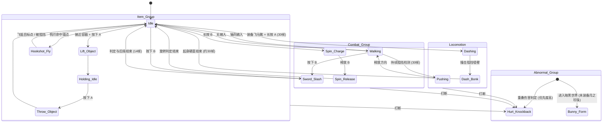

# 《塞尔达传说：众神的三角力量》角色动作状态机（Action State Machine）终极拆解报告

**摘要：**
《塞尔达传说：众神的三角力量》（下文简称 ALttP）的动作系统并非单纯的“动画播放”，而是一个由玩家输入、装备状态、网格物理和世界交互共同驱动的精密逻辑状态机（Logical FSM）。在超级任天堂（SNES）极度受限的硬件性能下，任天堂通过巧妙的“状态限制”与底层代码设计，硬编码出了极具深度、操作感丝滑的动作系统。

本报告从**逻辑状态机、物理规则判定、内存寄存器**等底层视角，对 ALttP 的 Link（林克）动作状态机进行重构与深度剖析。

---

### 状态机核心架构示意图 (FSM State Diagram)

---

### 一、 基础移动与物理状态机 (Locomotion & Physics FSM)

这是最底层、优先级最低的状态循环，随时可被其他主动动作或受击状态打断。

*   **站立 (Idle)**
    *   **状态描述**：地面上的静止状态，严格锁定四方向朝向（上下左右）。
    *   **特殊反馈**：长时间无输入，状态机会触发“不耐烦”子状态（如擦汗、东张西望），这是早期游戏增强角色生命力的经典设计。
*   **行走 (Walking)**
    *   **状态描述**：八方向移动。由于底层代码未对斜向移动的速度向量进行归一化（Normalize）计算，林克的斜向移动速度比正向移动快约 41%（$\sqrt{1^2+1^2} \approx 1.41$）。
    *   **拐角平移修正机制（Sub-tile Alignment / Corner Slipping）**：
        ALttP 拥有极其出色的手感，得益于底层的“子图块对齐”算法。当林克斜向或正向走近墙角时，若其物理碰撞盒（AABB）的中心线偏离墙角边缘**小于 8 个像素（半个图块宽度）**，状态机不会卡住玩家，而是自动计算一个垂直于阻挡面的平移向量（Nudge），将林克**丝滑地推过拐角**。
*   **推墙/推箱子 (Pushing)**
    *   **状态转换滞后（Hysteresis）**：为了防止玩家在靠近墙壁时频繁触发推墙动画，系统设计了时间阈值。玩家必须在 `Walking` 状态下，持续向阻挡物方向输入方向键**超过 30 帧**，状态机才会流转为 `Pushing`（播放推墙动画，并判定是否触发特定物体的位移逻辑）。
*   **冲刺 (Dashing - 绑定飞马靴)**
    *   **进入条件**：装备飞马靴，按住 A 键持续移动约 0.5 秒（30 帧）后触发。
    *   **状态特性**：速度激增，碰撞盒（Hitbox）沿移动方向延伸，获得冲撞和破坏判定。
    *   **碰撞分支逻辑**：
        *   **撞击坚固墙壁** $\rightarrow$ 切入 `Dash_Bonk`（反弹硬直）子状态。林克弹回并在地上跌坐约 30 帧（头上冒星星），伴随全屏震动与特定音效。**此过程不扣除生命值**，属于纯粹的时间惩罚。
        *   **撞击特定树木/障碍物** $\rightarrow$ 向被撞物体发送交互信号，触发 Drop Item（掉落心、钥匙或昆虫），林克中断冲刺。
        *   **撞击敌人** $\rightarrow$ 触发 Dash Attack 结算，造成击退和两倍于普通挥剑的伤害。
*   **环境强制位移状态机 (Environmental Force FSM)**
    *   **冰面滑行 (Ice Slip)**：踏上冰面，摩擦力参数归零。状态机切断玩家的“停止”指令，**继承当前物理动量**，直到撞墙或走出冰面才会切入 `Idle`。
    *   **水流/传送带 (Conveyor)**：进入特定网格后，状态机被注入**强制偏移向量**。玩家可叠加输入横向移动，但无法逆着传送带方向移动（速度小于传送带时会被强制后推）。
    *   **坠落陷阱 (Hole/Pull)**：踩到地牢黑洞，立刻剥夺所有输入权限，切入 `Falling` 状态（播放坠落动画，扣除半颗心，重置到当前房间的安全入口）。

---

### 二、 战斗与攻击状态机 (Combat & Attack FSM)

这是 ALttP 最精妙的模块，通过极其克制的“一键多用”实现丰富的战斗深度。

*   **基础挥剑与动作循环 (Basic Slash)**
    *   **状态逻辑**：`Input (B)` $\rightarrow$ `Wind-up` (前摇4帧) $\rightarrow$ `Active` (扇形判定12帧) $\rightarrow$ `Recovery` (后摇6帧)。整个循环约为 22-24 帧。
    *   **无惩罚连发**：游戏**没有**现代游戏的连招派生树，也**没有**任何疲劳（Stamina）惩罚。只要玩家快速连点 B 键，林克就会以最快物理帧率不断重复单一的右至左横扫斩击。
    *   **【机制】满血剑气（Sword Beam）**：在挥剑进入 `Active` 帧的瞬间，状态机检测林克当前生命值。若为满血状态，则朝林克正前方派生一个独立的远程飞行道具（Projectile）实体。
    *   **微操位移（挥剑微步）**：在进入 `Active` 判定帧的瞬间，状态机会强制给林克一个面朝方向的微小位移（约 2 像素），让玩家可以通过节奏感微调攻击距离。
*   **被动盾防状态机 (Passive Shield FSM)**
    *   **无键防御 (Passive Block)**：ALttP 中的盾牌**没有主动按键**。当林克处于 `Idle` 或 `Walking` 状态时，其正面 90 度扇形区域内自动激活盾牌判定盒，可以弹开飞行道具（如箭矢、章鱼怪射出的石头）。
    *   **防御失效状态（Block Blocked）**：当林克处于挥剑（`Slash`）、冲刺（`Dash`）、举物（`Lift`）或受击（`Hurt`）状态时，盾牌防御判定**硬性失效**。
*   **蓄力回旋斩 (Spin Attack)**
    *   **状态锁定**：长按 B 键进入 `Charge`（约 60 帧）。蓄力完成后，林克全身闪烁。此时松开按键，触发 360 度全方位物理判定，伤害为普通斩击的两倍，且判定帧覆盖全身。蓄力期间林克可以移动，但无法改变面朝方向。

---

### 三、 物品与环境交互状态机 (Item & Interaction FSM)

这些状态由玩家按键或环境触发，优先级高于基础移动，是解谜的核心。

*   **物品使用子状态族 (Item Usage Sub-states)**
    *   **投掷类（回旋镖/弓箭）**：`使用前摇` $\rightarrow$ 产生实体 $\rightarrow$ 进入 `冷却/回收等待`（此时禁止再次使用同类物品，直至实体销毁或返回）。
    *   **放置类（炸弹）**：`放置动画` $\rightarrow$ 生成独立物理炸弹实体，林克立刻返回 `Idle` 状态。
    *   **功能类（魔镜/符文）**：进入不可打断的施法动画 (Unskippable Cast)，暂停除粒子特效外的全局实体逻辑（全局静止），触发转场或全屏判定。
*   **举物与投掷 (Lifting & Throwing)**
    *   **状态流程**：接触容器（罐子、草丛） $\rightarrow$ 持续按下 A 键进入 `Lift` 动画（移速降低约 30%，物品位置绑定在林克头顶） $\rightarrow$ 再次按下 A 键进入 `Throw` 状态（物品转为飞行道具实体，林克恢复 `Idle`）。
    *   **隐藏防御判定**：在 `Holding`（举物）状态下，举起的罐子碰撞盒会覆盖林克头部，能完美防御正上方的落石或部分敌人的下砸攻击。
*   **钩爪位移 (Hookshot Transit)**
    *   **状态接管**：发射钩爪一旦命中可锚定目标（宝箱、木桩），林克立即进入 `Hookshot_Fly` 状态。此状态**完全剥夺玩家的输入控制权**，林克以极高速度沿直线向锚点移动，期间处于无视地面陷阱（如深渊）的悬空状态。若中途碰撞到墙壁物理实体，位移会提前中断并强制着陆。
*   **游泳与落水重置 (Swimming & Flippers Logic)**
    *   **落水判定（无水鳍）**：在未获得水鳍（Flippers）时进入深水区，状态机判定林克“溺水”，播放落水动画并扣除半颗心，随后**强制将林克传送回最后一次立足的陆地安全点（Respawn Point）**。
    *   **游泳判定（有水鳍）**：持有水鳍时进入深水，状态机平滑切入 `Swimming`。移速变慢，屏蔽除“潜水（Dive）”和特定水上道具以外的所有攻击和互动。

---

### 四、 受击与异常状态机 (Hurt & Abnormal FSM)

由外部伤害或特定场景触发的被动状态，拥有极高的系统优先级。

*   **受击与击退 (Hurt & Knockback)**
    *   **物理重置**：受击判定生效的瞬间，系统**清零林克当前的所有速度向量（Velocity Vectors）**，随后赋予一个背离伤害来源的反向固定击退向量，林克切入 `Knockback` 状态。
    *   **无敌帧保护**：击退结束后，状态机流转为 `Invincibility`（无敌闪烁，约 40 帧）。无敌期间，林克免疫敌人身体碰撞伤害，但**环境即死判定（掉入深渊、被压杀）依然生效**。
*   **兔子诅咒 (Bunny Form)**
    *   **全局覆盖**：未携带“月之珍珠”进入黑暗世界时触发。林克形态被硬性重构为兔子，**屏蔽除基础移动（改为缓慢跳跃）和开门/对话外的一切动作节点**（无法攻击、无法使用任何道具）。
    *   **落水逻辑继承**：即使在兔子形态下，落水重置判定依然工作——若无水鳍，同样会触发落水扣血并传送回安全点的逻辑，而非直接即死。

---

### 五、 状态机的底层架构与汇编级代码逻辑

在 16 位机（SNES）上运行如此复杂的逻辑，ALttP 依赖于极其高效的内存管理和优先级仲裁机制。

#### 1. RAM 状态指针：核心控制字 `$005D`
在 ALttP 的系统 RAM 中，林克的物理逻辑状态被硬性绑定在 **`$005D` 寄存器**（1 字节）。该字节的值直接决定了当前帧所运行的代码分支，从底层避免了逻辑冲突：

| `$005D` 值 (Hex) | 对应的逻辑状态 (Logical State) | 允许的输入打断 |
| :--- | :--- | :--- |
| **`$0000`** | Ground (常规站立/行走) | 允许所有主动动作与受击打断 |
| **`$0001`** | Falling (坠落深渊中) | 屏蔽所有玩家输入 |
| **`$0002`** | Hookshotting (钩爪飞行中) | 屏蔽移动与道具输入 |
| **`$0004`** | Bow / Arrow (拉弓/射箭中) | 锁定移动，仅响应受击打断 |
| **`$0009`** | Spin Attack (回旋斩释放中) | 锁定方向与移动 |
| **`$0011`** | Pegasus Dashing (飞马靴冲刺中) | 仅响应碰撞和受击中断 |

#### 2. 状态机优先级仲裁表 (Priority Table)
当多个事件在同一帧（1/60秒）被触发时，底层系统严格按照以下优先级表（从高到低）进行裁决：

| 优先级 | 状态分类 | 典型代表状态 | 底层处理规则 |
| :---: | :--- | :--- | :--- |
| **1** | **环境即死/重置** | 掉落深渊、房间重载、大宝箱获取 | 强制覆写所有寄存器，屏蔽玩家一切输入。 |
| **2** | **受击硬直与异常** | `Knockback` (击退), 兔子转换 | 立即清零当前速度向量，强行中断前摇/后摇。 |
| **3** | **剧情/强制位移** | 钩爪飞行 (`$0002`)、旋风传送 | 锁定林克的输入，由系统接管林克的物理坐标计算。 |
| **4** | **主动交互与战斗** | 挥剑斩击、使用道具、举起物品 | 动画播放期间限制移动速度，盾牌防御判定失效。 |
| **5** | **常规移动** | 奔跑、行走、推墙 | 最易被打断的状态，随时响应上级状态的强占。 |

#### 3. 输入缓冲 (Input Buffering) 的手感微调
为了解决 16 位机游戏普遍存在的“粘手”或“输入漏判”问题，ALttP 在动作状态的 `Recovery`（后摇）最后 3-4 帧引入了**极短的输入缓冲窗口**。
*   **应用实例**：在挥剑后摇快结束时，玩家提前按下 B 键，系统会将该指令暂存在内存缓冲区。一旦后摇结束、状态机回归 `Idle` 的那一帧，系统立刻读取缓存并无缝衔接下一次挥剑。这正是林克动作显得极其“丝滑”的技术秘密。

#### 4. Hitstun（受击硬直）与碰撞盒欺骗
*   **底层冲突隐患**：受击后的无敌闪烁（Invincibility）**仅仅屏蔽了“伤害结算代码”，并没有屏蔽“物理阻挡判定（AABB Overlap）”**。
*   **墙角抽搐现象（Hitstun Loop）**：若林克被敌人逼到墙角，且敌人的攻击判定盒极大，林克在无敌期间依然会被敌人的判定框反复“推挤”。由于击退方向被墙壁阻挡，状态机会在 `Knockback` 和 `Idle` 之间高频交替，导致林克在墙角疯狂抽搐且无法操作，直至无敌帧结束再次受到伤害。

---

### 总结：戴着镣铐跳舞的交互奇迹

《塞尔达传说：众神的三角力量》的动作状态机之所以成为 2D 动作游戏的金科玉律，是因为它在 SNES 极其有限的硬件资源下，没有依赖任何现代物理引擎，而是完全依靠**状态枚举（RAM `$005D`）**、**帧计数器（Frame Counters）** 和**精妙的子图块对齐（Corner Slipping）**，硬编码出了极具“重量感”和“化学反应”的动作系统。

它的设计哲学是：**“用状态的互相限制，来创造操作的深度”**。为了用盾牌防御，你必须放弃主动攻击；为了获得回旋斩的高伤害，你必须承担蓄力时无法改变朝向的风险；为了跨越深渊，你必须利用钩爪锁定自身状态。这种高度严密、克制且逻辑自洽的 FSM 设计，正是其动作手感历经 30 年，依然被现代顶尖独立游戏（如《空洞骑士》、《蔚蓝》）反复致敬与学习的根本原因。