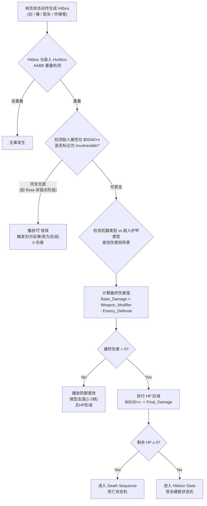
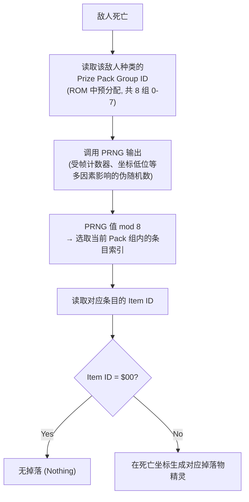

# 《塞尔达传说：众神的三角力量》敌人受击反馈状态机拆解报告

**前言：**
ALttP 动作手感的精妙绝非仅靠林克自身的状态机就能成立。**敌人被击中后的反馈系统**——击退距离、硬直时长、闪烁频率、死亡动画、属性免疫——构成了"打击感"的另一半。本文档从底层 RAM 寄存器、伤害查找表、状态流转逻辑三个维度，对 ALttP 敌人的受击反馈状态机进行完整拆解。

> **地址注记：** 本文所列 RAM 地址基于 ALttP 美版（USA v1.0，SNES）的社区反汇编参考资料，部分地址经过简化处理或采用偏移量表示形式，与实际逆向工程结果可能存在细微出入。如需精确地址参考，请查阅 [alttpr-disasm](https://github.com/alttpr/alttpr-disasm) 项目。

---

## 一、敌人实体的底层数据结构

### 1. 精灵槽（Sprite Slot）架构

ALttP 的游戏逻辑层面将**可交互实体（Sprite Entity）**划分为独立管理的槽位系统：

- **敌人/NPC 逻辑槽位**：16 个（Slot 0-15），每帧顺序遍历执行 AI 更新
- **投射物槽位**：约 8 个（独立地址段，敌人弹幕、箭矢等）
- **掉落物/物品槽位**：约 16 个（心、卢比、炸弹等捡取实体）
- **辅助特效槽位**：若干（粒子、冒出的星星等纯视觉实体）

以上所有逻辑实体共同竞争 SNES OAM 的 128 个硬件精灵对象与每条扫描线 32 个精灵的渲染限制。每个敌人槽位由一组连续的 RAM 地址阵列驱动，与受击反馈直接相关的核心寄存器如下：

| RAM 地址范围 | 字段名称 | 功能描述 |
| :--- | :--- | :--- |
| `$0DD0 + x` | **Sprite State** | 精灵主状态寄存器（类似林克的 `$005D`），控制当前行为分支 |
| `$0E50 + x` | **Hit Timer / Hitstun Counter** | 受击硬直倒计时帧数。非零时敌人停止 AI 逻辑更新 |
| `$0EB0 + x` | **Knockback Speed X** | 受击后 X 轴击退速度分量 |
| `$0EC0 + x` | **Knockback Speed Y** | 受击后 Y 轴击退速度分量 |
| `$0E00 + x` | **HP (Hit Points)** | 当前生命值。归零时触发死亡流程 |
| `$0E60 + x` | **Damage Class / Armor Type** | 防御等级/护甲类型索引，决定受击伤害减免 |
| `$0F60 + x` | **Invincibility Timer** | 受击后无敌帧倒计时。非零时跳过碰撞伤害判定 |
| `$0DE0 + x` | **Sprite Type ID** | 敌人种类编号（如 `$06` = 士兵，`$53` = Lynel），索引行为表与伤害表 |
| `$0D90 + x` | **Bump Damage Class** | 该敌人身体碰撞对林克造成的伤害等级 |
| `$0E20 + x` | **Sprite X Position (Low)** | 敌人 X 坐标低字节 |
| `$0E40 + x` | **Sprite Y Position (Low)** | 敌人 Y 坐标低字节 |
| `$0F50 + x` | **Death Animation Flag** | 死亡动画类型标志（普通消散 / Boss 特殊演出） |
| `$0E30 + x` | **Sprite Status / Substate** | 精灵子状态（含冻结、石化、翻转等特殊状态位） |
| `$0DA0 + x` | **Sprite Properties** | 属性位掩码（是否可击退、是否免疫特定武器等） |

> **寄存器寻址方式说明：** `x` 代表精灵槽位索引（0-15）。例如，Slot 3 的 HP 读取地址为 `$0E00 + 3 = $0E03`。所有精灵共享同一套地址偏移结构，通过 X 寄存器索引实现多实体并行管理。

---

## 二、全局伤害计算流程

在分析受击反馈之前，需先理解伤害是如何从"林克的攻击动作"传递到"敌人的 HP 扣减"的。

### 伤害结算流水线（Damage Pipeline）



### 伤害矩阵表（Damage Matrix / Lookup Table）

ALttP 在 ROM 中存储了一张**武器-护甲交叉查找表（Weapon × Armor LUT）**。每种敌人拥有一个"防御等级"（Defense Class），每种攻击手段拥有一个"攻击等级"（Attack Class）。最终伤害通过索引这张二维表直接读取，无需实时运算。

#### 简化还原的伤害矩阵示例

| | **Fighter Sword (Lv1)** | **Master Sword (Lv2)** | **Tempered Sword (Lv3)** | **Golden Sword (Lv4)** | **Arrow** | **Bomb** | **Hammer** | **Hookshot** | **Boomerang** |
|:---|:---:|:---:|:---:|:---:|:---:|:---:|:---:|:---:|:---:|
| **绿衣士兵 (Def 1)** | 2 | 4 | 8 | 16 | 4 | 8 | 8 | 2 | 0 (击晕) |
| **蓝衣士兵 (Def 2)** | 1 | 2 | 4 | 8 | 2 | 4 | 4 | 1 | 0 (击晕) |
| **红衣士兵 (Def 3)** | 1 | 2 | 4 | 8 | 2 | 4 | 4 | 1 | 0 (击晕) |
| **Lynel (Def 4)** | 2 | 2 | 4 | 8 | 2 | 4 | 4 | 0 | 0 |
| **Helmasaur (有面罩)** | 0 (弹刀) | 0 (弹刀) | 0 (弹刀) | 0 (弹刀) | 0 | 0 | **面罩剥离** | 0 | 0 |
| **Helmasaur (无面罩)** | 2 | 4 | 8 | 16 | 4 | 8 | 8 | 2 | 0 (击晕) |

> **银箭（Silver Arrow）注记：** 银箭对普通敌人的伤害等同于普通箭矢，并无特殊效果。其"即死"属性仅对最终 Boss Ganon 生效，这是硬编码的特例判定，而非通用的"即死"属性标签。
>
> **关键设计洞察：**
> - **回旋镖**对大多数敌人伤害为 0，但会写入一个特殊的"击晕"状态标志（`$0E30+x` 的特定位），触发完全不同的受击反馈分支。
> - **锤子（Hammer）**对 Helmasaur 面罩的"剥离"效果不走伤害流水线，而是直接修改敌人的子状态寄存器 `$0E30+x`，将面罩碰撞体标记为"已移除"。

---

## 三、敌人 AI 基础状态框架（简述）

ALttP 的敌人 AI 同样是一个有限状态机（FSM），每个敌人种类的行为表被存储在 ROM 中，通过 `$0DE0,x`（Sprite Type ID）索引对应的 AI 行为指针。

大多数敌人的 AI 包含以下基础状态层：

| AI 状态 | 描述 |
| :--- | :--- |
| **Idle / Patrol** | 无目标时的巡逻或静止等待 |
| **Alert / Chase** | 检测到林克进入感知范围，切入追踪模式 |
| **Attack Wind-up** | 进入攻击前摇，锁定攻击方向 |
| **Attack Active** | 攻击判定激活帧（Hitbox 生效） |
| **Attack Recovery** | 攻击后摇，暂时无法再次攻击 |
| **Hurt（受击）** | **由外部伤害事件强制写入**，中断以上所有状态 |

受击（Hurt）状态的**强制中断特性**是其核心设计：无论敌人处于任何 AI 状态（包括攻击前摇中），只要伤害判定成立，系统立刻将 AI 状态覆写为受击，这保证了玩家的攻击输入始终能得到即时反馈。

**唯一例外——无敌帧（`$0F60,x > 0`）期间：** 伤害判定代码会在读取完武器-护甲矩阵之后、执行 HP 扣减之前，检查无敌帧计时器。若非零，则跳过整个受击流程（包括 AI 中断），这防止同一次攻击在多帧内触发多次受击。

---

## 四、敌人受击反馈状态机（Enemy Hitstun FSM）

### 全局状态流转图

```
stateDiagram-v2
    [*] --> Normal_AI : 敌人正常巡逻/追踪/攻击

    Normal_AI --> Damage_Response : Hitbox 重叠判定成立

    state Damage_Response {
        direction TB

        state "伤害类型分支" as DamageBranch

        [*] --> DamageBranch

        DamageBranch --> Standard_Hitstun : 普通物理伤害 (剑/箭/炸弹)
        DamageBranch --> Stun_Paralysis : 回旋镖/击晕类攻击 (0伤害)
        DamageBranch --> Freeze_Shatter : 冰杖/Ether 冰冻属性
        DamageBranch --> Burn_Damage : 火杖/Bombos/灯笼 火焰属性
        DamageBranch --> Quake_Transmute : Quake 徽章大地属性
        DamageBranch --> Hammer_Flip : 锤子对特定敌人 (翻转类)
        DamageBranch --> Sword_Bounce : 攻击无效 (护甲/无敌)
    }

    Damage_Response --> Normal_AI : 硬直结束 / 状态恢复
    Damage_Response --> Death_Sequence : HP ≤ 0

    state Standard_Hitstun {
        direction LR
        [*] --> Hitstun_Flash : 受击瞬间 (颜色覆写为白色 1帧)
        Hitstun_Flash --> Knockback_Slide : 施加击退向量 (方向 = 攻击来源的反方向)
        Knockback_Slide --> Hitstun_Recovery : 击退速度衰减至 0 / 撞墙停止
        Hitstun_Recovery --> [*] : 硬直计时器 $0E50+x 归零 → 恢复 Normal_AI
    }

    state Stun_Paralysis {
        direction LR
        [*] --> Stun_Enter : 播放击晕动画 (头上冒星星/旋转)
        Stun_Enter --> Stunned_Idle : 完全停止AI更新 (持续约120-180帧)
        Stunned_Idle --> [*] : 计时器归零 → 恢复 Normal_AI
    }

    state Freeze_Shatter {
        direction LR
        [*] --> Freeze_Enter : 精灵调色板替换为蓝色/白色
        Freeze_Enter --> Frozen_Solid : 完全冻结 (约180-300帧)
        Frozen_Solid --> Shatter_Check : 冻结期间再次受到物理攻击?
        Shatter_Check --> Shatter_Death : Yes → 直接粉碎死亡 (跳过常规死亡动画)
        Shatter_Check --> Thaw_Recover : No + 计时器归零 → 解冻恢复 Normal_AI
    }

    state Burn_Damage {
        direction LR
        [*] --> Ignite : 精灵覆盖火焰粒子特效
        Ignite --> Burn_Tick : 每16帧施加1点持续伤害 (DoT)
        Burn_Tick --> Burn_End : 火焰持续约60帧后熄灭
        Burn_End --> [*] : HP>0 → 恢复 Normal_AI
        Burn_Tick --> Death_By_Fire : HP≤0 → 火焰死亡特效
    }

    state Quake_Transmute {
        direction LR
        [*] --> Ground_Shake : 全屏震动 (非飞行型敌人触发)
        Ground_Shake --> Transmute_Slime : 敌人 Sprite Type ID 被覆写为史莱姆
        Transmute_Slime --> [*] : 变为可一击消灭的史莱姆实体
    }

    state Hammer_Flip {
        direction LR
        [*] --> Flip_Animation : 精灵 Y 轴翻转 (上下颠倒)
        Flip_Animation --> Flipped_Vulnerable : 防御等级临时降为0 (约180帧)
        Flipped_Vulnerable --> Unflip : 计时器归零 → 翻转恢复, 防御等级还原
        Unflip --> [*] : 恢复 Normal_AI
    }

    state Sword_Bounce {
        direction LR
        [*] --> Clang_Effect : 播放金属碰撞音效 + 火花粒子
        Clang_Effect --> Micro_Recoil : 敌人无位移 / 极微击退 (1-2像素)
        Micro_Recoil --> [*] : 立即恢复 Normal_AI (0帧硬直)
    }

    %% 所有路径的死亡出口
    Standard_Hitstun --> Death_Sequence : HP ≤ 0 时在击退结束帧触发
    Burn_Damage --> Death_Sequence : 持续伤害导致HP归零

    state Death_Sequence {
        direction LR
        [*] --> Death_Flash : 全身快速闪烁 (白/原色交替, 约16帧)
        Death_Flash --> Death_Spin : 旋转缩小 / 爆炸粒子 (约20帧)
        Death_Spin --> Loot_Drop : 执行掉落物生成判定
        Loot_Drop --> Slot_Free : 释放精灵槽位, 清零所有寄存器
    }
```

---

## 五、标准受击硬直的逐帧解析（Standard Hitstun）

这是最常见、最核心的受击反馈路径。以"Lv2 大师之剑砍中蓝衣士兵"为典型案例进行逐帧拆解：

### 第 0 帧：碰撞判定与伤害结算

```
1. AABB 重叠检测成立
2. 读取武器攻击等级 (Master Sword = Attack Class 2)
3. 读取敌人防御等级 ($0E60+x = Defense Class 2)
4. 索引伤害矩阵表 → 最终伤害 = 2
5. 执行 HP 扣减: $0E00+x -= 2
6. 写入硬直计时器: $0E50+x = $10 (16帧)
7. 写入无敌帧计时器: $0F60+x = $10 (16帧，防止同一次攻击多段判定)
```

### 第 0-1 帧：受击闪白（Damage Flash）

```
- 敌人精灵的调色板被强制覆写为全白色 (OAM Palette Override)
- 持续 1-2 帧
- 同时播放受击音效 (SFX ID: 命中肉体声)
```

**底层实现：** SNES 的 PPU 允许通过修改 OAM 条目的调色板索引，在不重绘精灵图像数据的情况下瞬间改变颜色。系统将 `$0DA0+x` 的调色板位暂时覆写为全白调色板编号，1-2 帧后恢复原值。这比逐像素修改高效得多。

### 第 0-8 帧：击退滑行（Knockback Slide）

**击退方向计算：**

```assembly
; === 击退方向计算（简化伪代码，基于65C816语法习惯）===
; 第一步：计算 X 轴位置差，判断左右方向
LDA $22         ; 读取林克 X 坐标低字节（Direct Page）
SEC
SBC $0E20,x     ; 减去当前精灵槽 x 的敌人 X 坐标
STA $00         ; 暂存 X 轴差值

; 第二步：计算 Y 轴位置差，判断上下方向
LDA $20         ; 读取林克 Y 坐标低字节
SEC
SBC $0E40,x     ; 减去敌人 Y 坐标
STA $01         ; 暂存 Y 轴差值

; 第三步：比较 X/Y 差值绝对值，选择主轴方向
; 若 |ΔX| > |ΔY|：水平击退（左或右）
; 若 |ΔX| < |ΔY|：垂直击退（上或下）
; 若相近：对角线击退（8 方向之一）
; 最终将击退方向枚举值写入击退速度寄存器
```

击退方向被量化为 **8 个离散方向**（上、下、左、右、四个对角），而非连续向量。系统比较攻击来源与敌人的 X/Y 坐标差值，选取最接近的离散方向。

**击退速度曲线：**

击退并非匀速运动，而是遵循**线性衰减（Linear Deceleration）**模型：

$$V_{knockback}(t) = V_{initial} - k \cdot t$$

其中：
- $V_{initial}$：初始击退速度（通常为 **2-3 像素/帧**，因武器类型而异）
- $k$：衰减系数（固定值，约 **0.25-0.5 像素/帧²**）
- $t$：经过的帧数

| 武器类型 | 初始击退速度 $V_{initial}$ | 击退持续帧数 | 总击退距离（约） |
| :--- | :---: | :---: | :---: |
| Fighter Sword (Lv1) | 2 px/f | 6 帧 | 8-9 像素 |
| Master Sword (Lv2) | 2 px/f | 8 帧 | 10-12 像素 |
| Golden Sword (Lv4) | 3 px/f | 8 帧 | 14-16 像素 |
| Bomb (爆炸) | 4 px/f | 10 帧 | 24-28 像素 |
| Hammer (锤子) | 3 px/f | 12 帧 | 20-22 像素 |
| Arrow (弓箭) | 1 px/f | 4 帧 | 3-4 像素 |
| Hookshot (钩爪) | 2 px/f | 6 帧 | 8-9 像素 |
| Spin Attack (回旋斩) | 3 px/f | 10 帧 | 18-20 像素 |

> **设计洞察：** 炸弹和锤子拥有最大的击退距离，这不仅是"力量感"的表达，更是功能性设计——炸弹爆炸时林克也在爆炸范围内，大击退可以防止敌人被炸飞后立即回到林克身边造成碰撞伤害。

**撞墙截断逻辑：**

击退运动过程中，系统每帧对敌人执行与地形的 Tile 碰撞检测。若检测到墙壁碰撞：

```
IF (Knockback_Active AND Wall_Collision_Detected) THEN
    $0EB0+x = 0   ; X 轴击退速度清零
    $0EC0+x = 0   ; Y 轴击退速度清零
    ; 敌人停在墙边，剩余硬直帧继续消耗但无位移
END IF
```

**特殊情况——撞墙反弹（Wall Bounce）：** 某些重型敌人（如铁球兵 Ball & Chain Trooper）在撞墙时不会停止，而是执行反弹——将击退速度向量取反并乘以衰减系数。这是通过敌人属性位 `$0DA0+x` 中的特定标志位控制的。

### 第 8-16 帧：硬直恢复（Hitstun Recovery）

击退位移结束后，敌人仍处于硬直状态（`$0E50+x > 0`）。在这段时间内：

- 敌人的 **AI 逻辑更新完全暂停**（不会转向、不会发起攻击、不会改变巡逻路径）
- 敌人的 **精灵动画冻结在受击帧**（通常是一个向后仰的姿势）
- 敌人的 **碰撞判定（对林克的身体接触伤害）依然有效**——这意味着林克砍中敌人后如果不及时后退，在敌人硬直恢复前依然会被"碰伤"
- 硬直计时器每帧递减 1，归零后流转回 `Normal_AI`

> **帧数差异化设计：** 不同防御等级的敌人拥有不同的基础硬直帧数。低级敌人（绿衣士兵）硬直长达 16-20 帧，给玩家充裕的连续攻击窗口；高级敌人（Lynel、暗黑骑士）硬直仅 8-10 帧，迫使玩家在"再砍一刀"和"安全后撤"之间做决策。

---

## 六、特殊受击反馈分支的详细解析

### 1. 回旋镖击晕（Boomerang Stun）

回旋镖是 ALttP 中唯一的"纯控制"武器——**0 伤害，但施加长时间完全麻痹**。

**状态流程：**

```
第 0 帧:  碰撞判定成立
          伤害结算 = 0 (查表结果)
          写入击晕标志: $0E30+x |= STUN_BIT
          写入击晕计时器: $0E50+x = $B0 (176帧 ≈ 2.93秒)

第 1 帧:  敌人精灵开始播放"击晕循环动画"
          - 头顶旋转星星粒子 (OAM 附加精灵)
          - 敌人主精灵静止不动 / 原地微颤

第 1-176 帧: AI 完全挂起
             身体碰撞伤害仍然有效
             可被林克的任何攻击正常命中 (无减伤/无免疫)

第 176 帧: 击晕计时器归零
           清除击晕标志: $0E30+x &= ~STUN_BIT
           恢复 Normal_AI
```

**设计价值：** 回旋镖击晕创造了一个**安全输出窗口**——玩家可以先用回旋镖定住危险敌人，再切换到高伤害武器从容输出。这在面对 Lynel 等高速高攻敌人时是核心策略。

### 2. 冰冻与粉碎（Freeze & Shatter）

冰杖（Ice Rod）和 Ether 徽章对敌人施加冰冻属性效果。

**冰冻状态的内存操作：**

```
第 0 帧:  碰撞判定成立
          写入冰冻标志: $0E30+x |= FREEZE_BIT
          写入冰冻计时器: $0E50+x = $FF (255帧 ≈ 4.25秒)
          调色板覆写: 敌人全身替换为蓝/白冰冻调色板

第 1-255 帧:
          AI 完全挂起
          精灵动画完全冻结 (停在被冻瞬间的帧)
          身体碰撞伤害 → 关闭 (冰冻状态下接触不伤害林克)
          受击判定 → 开启 (可以被攻击)
```

**粉碎分支（Shatter）：**

在冰冻期间，若敌人再次受到**任何物理伤害**（剑、锤、箭、炸弹等），无论剩余 HP 为多少，系统直接执行：

```
$0E00+x = 0           ; HP 强制归零
$0F50+x = SHATTER     ; 死亡动画类型设为"冰碎"
; 触发特殊死亡动画: 敌人碎裂为多个冰晶碎片粒子向四周飞散
; 跳过常规的死亡闪烁与旋转
```

这一设计赋予冰杖极高的战术价值：低攻击力武器配合冰冻可以"秒杀"任何可冰冻的敌人。

**免疫列表：** 并非所有敌人都可被冰冻。Boss、火属性敌人（Fire Keese、Kodongo）以及特定谜题实体在 `$0DA0+x` 中标记了 `FREEZE_IMMUNE` 位，冰杖命中后不写入冰冻标志，仅造成基础伤害。部分水属性敌人（如 Zora）同样免疫冰冻。幽灵类敌人（Poe）对冰冻的免疫性也需注意。

#### 属性免疫关系速查表

| 属性效果 | 免疫的典型敌人 | 免疫原因 |
| :--- | :--- | :--- |
| 冰冻（Ice Rod/Ether） | Fire Keese、Kodongo、Zora、部分 Boss | 火属性/水属性豁免标志位 |
| 燃烧（Fire Rod/Bombos） | Freezor（冰霜体）、幽灵类（Poe） | 冰属性豁免 / 无实体标志 |
| Quake 变形 | 所有飞行类、所有 Boss | IS_FLYING 标志 / Boss 豁免标志 |
| 回旋镖击晕 | Lynel、暗黑骑士、所有 Boss | 精英敌人豁免标志 |

### 3. 火焰燃烧（Burn Damage over Time）

火杖（Fire Rod）、灯笼（Lantern 偶发）和 Bombos 徽章施加火属性效果。

**燃烧状态流程：**

```
第 0 帧:   碰撞判定成立
           写入燃烧标志: $0E30+x |= BURN_BIT
           写入燃烧计时器: 60帧 (约1秒)
           即时伤害: 施加火属性基础伤害 (查表)

第 1-60 帧:
           视觉: 敌人精灵被火焰覆盖粒子包裹，调色板交替为红/橙
           运动: 敌人不执行正常AI，而是以随机方向高速移动 (惊慌乱窜)
                 移动速度 = 正常速度 × 1.5
                 每16帧改变一次随机方向
           持续伤害: 每16帧 $0E00+x -= 1 (每16帧扣1点HP)

第 60 帧:  燃烧计时器归零
           清除燃烧标志
           IF $0E00+x > 0 THEN 恢复 Normal_AI
           ELSE 触发 Death_Sequence (火焰特殊死亡: 变为灰烬消散)
```

**敌人燃烧期间的"惊慌乱窜"**是一个极其出色的反馈设计——它不仅传达了"着火了"的视觉信息，还创造了战术风险：燃烧的敌人移动路径不可预测，可能冲撞到正在输出的林克。

**火焰免疫/特殊交互：**
- **冰属性敌人**（Freezor）：火焰直接造成即死效果（无燃烧过程），是设计意图上的属性克制。
- **Boss 级实体**：免疫持续燃烧（DoT），但接受即时火属性伤害。
- **幽灵/Anti-Fairy**：火焰免疫（无实体，无法燃烧）。

### 4. Quake 变形（Transmutation）

Quake 徽章的受击反馈是 ALttP 中最具"化学反应"的设计——**直接改写敌人的存在本身**。

```
第 0 帧:   Quake 全屏判定生效
           遍历所有16个精灵槽位
           FOR x = 0 TO 15:
               IF sprite_is_active(x) AND NOT is_flying(x) AND NOT is_boss(x) THEN
                   $0DE0+x = $20     ; Sprite Type ID 覆写为 Slime (史莱姆)
                   $0E00+x = $01     ; HP 设为 1
                   $0E60+x = $00     ; 防御等级设为 0 (最低)
                   $0D90+x = $01     ; 碰撞伤害设为最低
                   ; 重载精灵图形数据指针为史莱姆
                   ; 重载AI行为指针为史莱姆巡逻逻辑
               END IF
           NEXT x
```

**飞行豁免规则：** Quake 是"大地"属性，底层逻辑检测敌人是否标记了 `IS_FLYING` 属性位。飞行类敌人（Keese 蝙蝠、Poe 幽灵、Stalfos 跳跃态）完全免疫——这是少数将"物理直觉"融入底层代码判定的精妙案例。

### 5. 锤子翻转（Hammer Flip）

针对特定爬行/带壳敌人（如龟岩 Terrorpin、独眼巨人 Hinox 等），锤子的砸地震波不造成直接伤害，而是触发"翻转"。

```
第 0 帧:   锤子震波判定与敌人 Hurtbox 重叠
           检查 $0DA0+x 是否标记 FLIPPABLE

           IF FLIPPABLE THEN
               $0E30+x |= FLIPPED_BIT        ; 写入翻转子状态
               精灵 OAM 属性: V-Flip = TRUE   ; 图像垂直翻转
               $0E60+x = $00                  ; 防御等级临时降为 0
               写入翻转恢复计时器 = 180帧 (3秒)
           END IF

第 1-180 帧:
           敌人图像上下颠倒，露出柔软腹部
           AI 切换为"挣扎模式" (原地小幅抖动，无攻击/无移动)
           防御等级为 0: 任何攻击均造成完整伤害

第 180 帧: 翻转恢复计时器归零
           $0E30+x &= ~FLIPPED_BIT
           V-Flip = FALSE
           $0E60+x = 原始防御等级
           恢复 Normal_AI
```

**设计精要：** 翻转机制将"不可直接击败的敌人"变为一个两步解谜流程——**先用锤子创造弱点窗口，再用剑输出**。这种"工具组合"思维正是 ALttP 道具设计哲学的缩影。

### 6. 特殊状态叠加规则（State Stacking Rules）

ALttP 的敌人在同一时刻**最多只能处于一种特殊受击状态**。当新的特殊状态被触发时，系统按以下规则处理：

| 当前状态 | 新触发状态 | 处理结果 |
| :--- | :--- | :--- |
| 冰冻（Freeze） | 物理攻击 | **粉碎死亡**，跳过正常状态覆盖 |
| 冰冻（Freeze） | 火焰（Burn） | 属性相消：冰冻解除，不施加燃烧，造成一次即时伤害 |
| 燃烧（Burn） | 冰冻（Freeze） | 燃烧解除，施加冰冻（冰克火） |
| 击晕（Stun） | 任何攻击 | 正常结算伤害，击晕计时器重置（延长控制时间） |
| 翻转（Flip） | 回旋镖 | 击晕不写入（翻转状态屏蔽击晕标志位） |
| 任何特殊状态 | Quake | Quake 的变形判定优先级最低，若敌人已处于任何特殊状态则跳过 |

---

## 七、敌人投射物系统与镜盾反射（Projectile & Mirror Shield Reflection）

### 投射物的实体生命周期

敌人发射的投射物（如士兵的长矛、Beamos 的激光、Medusa 的蛇发射线）作为独立精灵实体存在，拥有独立的速度向量和碰撞判定。

### 镜盾反射判定

当敌人投射物的碰撞体与林克的盾牌判定扇形重叠时：

```
IF Link_Shield_Level = Lv3 (镜盾) THEN
    IF Projectile_Type = LASER OR MAGIC_BALL THEN
        投射物速度向量取反: V_proj = -V_proj
        投射物所属方改为"玩家方"
        → 可对敌人造成伤害
    END IF
END IF
```

被反射的投射物**不生成新实体**，而是直接修改原投射物的速度向量和阵营标签（Faction Tag），这是 SNES 内存限制下的高效实现。

### Beamos 激光的特殊处理

Beamos 的激光是持续性射线（Line Cast）而非离散投射物实体，其碰撞判定每帧重新计算，无法被镜盾"反射"（因为没有可修改速度向量的实体），只能通过盾牌防御"吸收"（阻断伤害结算）。

---

## 八、敌人攻击 Hitbox 的生成与林克受击判定

敌人的攻击判定（Hitbox）存在两种类型：

**类型一：身体碰撞伤害（Contact Damage）**
- 敌人的身体 AABB 碰撞体**始终有效**（除非特定状态关闭，如冰冻）
- 每帧检测与林克 Hurtbox 的重叠
- 命中后直接调用林克的受击流程，伤害值从 `$0D90,x`（Bump Damage Class）读取
- 无方向性——来自任何方向的身体接触均触发

**类型二：技能攻击判定（Attack Hitbox）**
- 敌人在特定 AI 状态下生成的临时判定盒
- 具有方向性和时效性（仅在特定动画帧激活）
- 可被林克的盾牌扇形判定拦截（若命中方向在防御扇形内）
- 携带额外属性标签（如火焰、冰冻、穿盾），决定盾牌是否有效

### 穿盾攻击（Shield-Bypass Attack）

部分攻击（长矛兵的近战刺击、Helmasaur King 的尾部横扫）被标记为 `MELEE_BYPASS`，即使从正面命中林克盾牌也无法被拦截。底层实现：

```
IF Attack_Flag & MELEE_BYPASS THEN
    跳过盾牌判定逻辑
    直接调用 Link_Hurt_Routine
END IF
```

---

## 九、环境伤害与友伤（Environmental Damage & Friendly Fire）

ALttP 中部分环境伤害对所有实体（含敌人）均生效：

**炸弹爆炸（Bomb Explosion）：**
炸弹的圆形伤害判定对所有非投射物实体均有效，包括其他敌人。这意味着玩家可以利用敌人之间的"友伤"，用一颗炸弹同时伤害多个密集的敌人。炸弹对敌人的结算走与玩家攻击完全相同的伤害流水线。

**落石/推落机关（Falling Boulder）：**
特定地牢的落石陷阱对敌人同样有效——这是底层逻辑不区分"玩家"和"敌人"作为受害者的结果，属于意外但合理的游戏性。

**敌人之间的身体碰撞：**
敌人与敌人之间**没有相互身体碰撞伤害**（Faction 标签防止同阵营实体互伤），但存在**物理推挤**：密集区域内多个敌人的 AABB 重叠时，系统执行简单的分离向量计算，将敌人轻微推开，防止完全堆叠。

---

## 十、死亡序列状态机（Death Sequence FSM）

敌人 HP 归零后触发的终结流程。根据敌人类型和致死攻击的属性，分为多个死亡动画分支。

### 标准死亡流程（Standard Death）

```
第 1-4 帧:   最终受击闪白 (与普通受击相同，但持续更长)

第 5-20 帧:  死亡闪烁循环
             精灵在原色与白色之间以每2帧为周期高速交替
             同时播放"啪"的死亡音效 (SFX)

第 21-36 帧: 死亡旋转/消散
             精灵以自身中心为轴快速旋转 (每帧旋转90°)
             同时体积逐帧缩小至消失
             OR: 分裂为4个碎片向四角飞散 (适用于骷髅兵等)

第 37 帧:    掉落物生成判定
             ↓ (详见掉落物系统)

第 38 帧:    精灵槽位释放
             清零所有关联 RAM 地址
             $0DD0+x = $00 (标记为空槽，可供新敌人使用)
```

### 受击反馈的技术来源

ALttP 没有现代动作游戏中成熟的逐帧暂停式 Hitlag 系统。其"打击感"的技术来源是多个子系统的协同效果：

1. **受击闪白（1-2 帧调色板覆写）**：在视觉层面创造微停顿感
2. **SPC700 音效的零延迟触发**：受击音效不经过游戏逻辑帧，由音频处理器独立响应，确保音画精准同步
3. **敌人 Hitstun 的即时锁定**：敌人 AI 在受击帧立刻停止更新，动作"卡住"的视觉效果等效于顿帧
4. **林克挥剑的微步位移**：命中瞬间林克向前微移 2 像素，强化了"力道穿透"的物理感

这四个子系统的叠加效果，在没有真正 Hitlag 的情况下，模拟出了令人信服的打击感。

> **与林克受击的对称设计：** 林克被敌人击中时，**不存在**上述反馈效果——系统直接进入击退而无特殊处理。这一不对称设计强化了"玩家攻击 = 有力量感"与"玩家受击 = 突如其来的危险"的心理感受差异。

真正意义上的"全局游戏逻辑暂停"（Freeze Frame）主要出现在**特定场景事件**（获得大宝箱、Boss 死亡演出启动瞬间），而非每次普通攻击命中时。

### 特殊死亡动画分支

| 死亡类型 | 触发条件 | 视觉表现 | 底层标记 |
| :--- | :--- | :--- | :--- |
| **标准消散** | 大多数物理攻击致死 | 闪烁 → 旋转缩小 → 消失 | `$0F50+x = $00` |
| **冰碎** | 冰冻状态下被击碎 | 无闪烁，直接碎裂为冰晶碎片 | `$0F50+x = $01` |
| **火焰灰化** | 燃烧状态下 HP 归零 | 身体变黑 → 缩小为灰烬 → 消散 | `$0F50+x = $02` |
| **坠落** | 被击退至深渊边缘 | 与林克坠落类似的缩小+阴影动画 | `$0F50+x = $03` |
| **Boss 演出** | Boss HP 归零 | 全屏闪烁、爆炸粒子密集释放、长时间光效 | Boss 专用代码段 |

---

## 十一、掉落物生成系统（Loot Drop System）

敌人死亡后的掉落物并非纯随机，而是由一套**伪随机查表系统**驱动。

### 掉落判定流程



> **速通操控掉落的实际原理：** 速通玩家并非追踪"击杀计数器"，而是通过控制**游戏帧数**（即控制动作的精确时机）来影响 PRNG 的输出值，从而预测并操控特定敌人的掉落结果。这是一种帧级别的 RNG 操纵（RNG Manipulation），而非简单的"顺序循环"。

### 掉落组（Prize Pack Group）示例

| Group ID | 条目 0 | 条目 1 | 条目 2 | 条目 3 | 条目 4 | 条目 5 | 条目 6 | 条目 7 |
| :---: | :---: | :---: | :---: | :---: | :---: | :---: | :---: | :---: |
| **Group 0** | 绿卢比 | 心 | 绿卢比 | 绿卢比 | 绿卢比 | 心 | 绿卢比 | 绿卢比 |
| **Group 1** | 蓝卢比 | 绿卢比 | 蓝卢比 | 红卢比 | 蓝卢比 | 绿卢比 | 蓝卢比 | 蓝卢比 |
| **Group 2** | 心 | 绿卢比 | 心 | 心 | 绿卢比 | 心 | 心 | 绿卢比 |
| **Group 3** | 炸弹×4 | 炸弹×4 | 心 | 炸弹×4 | 炸弹×4 | 心 | 炸弹×4 | 炸弹×4 |
| **Group 4** | 箭×5 | 小魔法 | 箭×5 | 箭×5 | 箭×5 | 小魔法 | 箭×5 | 箭×5 |
| **Group 5** | 大魔法 | 小魔法 | 大魔法 | 箭×10 | 大魔法 | 小魔法 | 大魔法 | 箭×10 |
| **Group 6** | 大心 | 绿卢比 | 心 | 蓝卢比 | 大心 | 绿卢比 | 心 | 蓝卢比 |
| **Group 7** | 心 | 绿卢比 | 绿卢比 | 绿卢比 | 心 | 绿卢比 | 绿卢比 | 绿卢比 |

每个敌人种类在 ROM 中被**预先分配**到特定的 Prize Pack Group。掉落物序列由伪随机数生成器（PRNG）驱动，PRNG 的输出受游戏帧计数器、玩家坐标低位等多个因素影响。

---

## 十二、Boss 受击反馈的差异化设计

Boss 实体在受击反馈上与普通敌人存在系统性差异，以体现"精英对手"的设计意图。

### Boss 与普通敌人的受击参数对比

| 参数 | 普通敌人 | Boss |
| :--- | :--- | :--- |
| **击退距离** | 8-28 像素 | 0-4 像素（多数 Boss 几乎不被击退） |
| **硬直帧数** | 8-20 帧 | 2-8 帧（极短，快速恢复攻击） |
| **无敌帧** | 16 帧 | 16-32 帧（防止被高速连击秒杀） |
| **闪白持续** | 1-2 帧 | 4-8 帧（更醒目的受击反馈） |
| **受击音效** | 通用受击音 | 专用 Boss 受击音（更低沉/更有冲击力） |
| **弱点机制** | 无（全身受击均匀） | 大量采用分阶段/弱点限定判定 |

### Boss 分阶段受击判定（Phase-Based Vulnerability）

#### 案例 1：Helmasaur King（面具王）

```
=== Phase 1: 面具完整 ===
$0DA0+x 属性位: FRONT_ARMOR = TRUE

受击判定:
  IF 攻击 Hitbox 与面具碰撞体重叠 THEN
      IF 武器 = Hammer THEN
          面具 HP -= 1  (面具有独立HP池, 值为6)
          播放金属撞击音效
          IF 面具 HP = 0 THEN
              销毁面具精灵
              $0DA0+x: FRONT_ARMOR = FALSE  → 进入 Phase 2
              播放面具碎裂动画 (大量碎片粒子飞散)
          END IF
      ELSE
          播放弹刀音效 (叮)
          触发林克 Sword_Bounce 状态
          0 伤害
      END IF
  ELSE IF 攻击 Hitbox 与尾部碰撞体重叠 THEN
      尾部始终可受击, 正常走伤害流水线
  END IF

=== Phase 2: 面具破碎 ===
$0DA0+x 属性位: FRONT_ARMOR = FALSE

受击判定:
  正面与背面均可受击
  走标准伤害流水线
  Boss 进入 Enrage 模式: 移动速度 ×1.5, 攻击频率 ×2
```

#### 案例 2：Agahnim（阿加赫尼姆）——反射型弱点

Agahnim 是 ALttP 中唯一**完全免疫所有物理攻击**的 Boss，必须使用特定道具将其投射物反弹才能造成伤害。其底层逻辑：

```
Agahnim 属性位: PHYSICAL_IMMUNE = TRUE
               REFLECT_VULNERABLE = TRUE

受击判定:
  IF 攻击来源 = 玩家物理武器 THEN
      0 伤害，无任何受击反馈（连弹刀效果都没有）
  END IF

  IF 攻击来源 = 被反弹的自身投射物 THEN
      投射物携带 REFLECT_DAMAGE 标签
      无视 PHYSICAL_IMMUNE 标志
      正常走伤害流水线 → $0DB0,x -= Reflect_Damage
  END IF
```

这是 ALttP 通过"受击系统豁免逻辑"来强制要求玩家学习特定机制的极端案例——**受击系统本身成为谜题的一部分**。

### 多段体 Boss 的受击判定架构

部分 Boss（如 Lanmolas、Moldorm）由多个独立实体组成，每个部位拥有独立的精灵槽位和生命值：

以 Lanmolas（沙虫）为例：
- **头部（Head Segment）**：独立精灵槽，HP = 8，是唯一有效的攻击目标
- **身体节（Body Segments）**：各占独立精灵槽，标记 `INVULNERABLE`，碰撞造成伤害但无法被攻击
- **死亡判定**：仅当 Head Segment 的 HP 归零时触发整体死亡序列；Body Segment 的 HP 字段从不被读取

这种"分体判定"架构要求每个 Boss 部位各自占用一个精灵槽位，是 ALttP 在 16 槽位限制下对复杂 Boss 设计的工程解决方案。

### Boss 死亡演出（Boss Death Sequence）

Boss HP 归零后，不走标准的 16 帧死亡流程，而是进入专用的长篇死亡演出：

```
第 1-30 帧:    Boss 闪烁加剧 (全身红白交替, 频率递增)
第 31-90 帧:   多个爆炸粒子实体在 Boss 身体各部位依次生成
               全屏持续轻微震动
               BGM 切换为胜利前奏
第 91-120 帧:  Boss 精灵分裂为多个碎片向四周飞散
               屏幕白闪 (PPU 亮度强制拉满)
第 121 帧:     Boss 精灵槽位释放
               生成心之容器 / 水晶囚笼 掉落物
               BGM 切换为道具获取音效
```

---

## 十三、敌人受击反馈与林克动作系统的耦合关系

敌人受击系统并非独立运作，它与林克的动作状态机存在多个关键交互点：

### 耦合交互点一览表

| 交互场景 | 林克侧状态变化 | 敌人侧状态变化 | 耦合机制 |
| :--- | :--- | :--- | :--- |
| **剑击命中** | 挥剑 `Active` 帧消耗，微步位移 +2px | 进入 `Hitstun`，闪白+击退 | Hitbox-Hurtbox AABB 重叠 |
| **弹刀** | 进入 `Sword_Bounce`（后退 + 硬直） | 无反应 / 微击退 | 武器伤害 = 0 时触发林克侧反弹 |
| **回旋镖命中** | 回旋镖往返双重判定，林克无状态变化 | 进入 `Stun_Paralysis`（长时间麻痹） | 回旋镖伤害表条目 = 0 + Stun 标志 |
| **炸弹爆炸** | 林克若在范围内也受击退（自伤） | 大击退 + 高伤害 | 炸弹爆炸判定对所有实体（含林克）均生效 |
| **冲刺撞击** | 进入 `Dash_Attack` 判定 | 进入 `Hitstun`（高击退） | 冲刺 Hitbox 特殊判定（前向矩形） |
| **钩爪命中** | 林克被拉向敌人 / 钩爪弹回 | 进入 `Hitstun`（低伤害 + 低击退） | 钩爪 Hitbox 命中后判定是否为可拉动实体 |

### "碰撞伤害与受击硬直"的不对称设计

一个容易被忽略但极其重要的设计决策：

**敌人处于 Hitstun 期间，其身体碰撞判定（对林克的接触伤害）并不关闭。**

这意味着：
1. 林克砍中敌人后，若不后退，仍然会被正在击退中的敌人"碰伤"
2. 这迫使玩家在**攻击后必须执行"后撤"微操作**，而非站桩输出
3. 唯一例外是**冰冻状态**——冰冻期间身体碰撞伤害被关闭，这是鼓励玩家近身补刀粉碎的设计激励

这一不对称规则直接塑造了 ALttP 战斗的核心节奏："进攻 → 后撤 → 等待安全窗口 → 再进攻"的攻防循环。

---

## 十四、受击反馈参数汇总速查表（按敌人分类）

| 敌人类别 | 代表敌人 | HP | 硬直帧数 | 击退距离 | 可冰冻 | 可击晕 | 可翻转 | 可变形(Quake) |
| :--- | :--- | :---: | :---: | :---: | :---: | :---: | :---: | :---: |
| **轻步兵** | 绿衣士兵 | 2 | 16 | 12px | ✓ | ✓ | ✗ | ✓ |
| **重步兵** | 蓝衣士兵 | 4 | 12 | 10px | ✓ | ✓ | ✗ | ✓ |
| **精英步兵** | 红衣骑士 | 6 | 10 | 8px | ✓ | ✓ | ✗ | ✓ |
| **高速猛兽** | Lynel | 8 | 8 | 6px | ✗ | ✗ | ✗ | ✗ |
| **甲壳类** | Terrorpin | 6 | 0 (翻转前) | 0px | ✓ | ✗ | **✓** | ✓ |
| **飞行类** | Keese (蝙蝠) | 1 | 0 (一击死) | N/A | ✓ | ✓ | ✗ | **✗** |
| **幽灵类** | Poe | 4 | 12 | 8px | ✗ | ✗ | ✗ | **✗** |
| **重甲类** | Helmasaur | 4+面罩 | 10 | 4px | ✗ | ✗ | ✗ | ✓ |
| **Boss** | Moldorm | 12 | 4 | 0px | ✗ | ✗ | ✗ | ✗ |
| **Boss** | Helmasaur King | 24+面罩6 | 6 | 2px | ✗ | ✗ | ✗ | ✗ |

> **※ 标注说明：**
> - Terrorpin 的"可冰冻 ✓"仅在**锤子翻转后**（防御等级降为 0 后）生效；正常状态下其护甲标志同时屏蔽冰冻判定。
> - 飞行类敌人标注"可冰冻 ✓"的前提是其 `IS_FLYING` 标志不影响冰冻判定（飞行豁免仅对 Quake 生效）。

---

## 总结：三层反馈语言的统一编码

ALttP 的敌人受击反馈系统本质上是一套**三层反馈语言（Three-Layer Feedback Language）**：

**第一层——即时感知层（0-4 帧）：**
闪白、受击音效、Hitstun 锁定，告诉玩家"攻击命中了"。这是纯感官层面的信号，无需思考即可接收。

**第二层——战术信息层（动画全程）：**
击退距离、硬直时长、弹刀反馈、特殊状态表现（燃烧乱窜、冰冻静止），告诉玩家"这次攻击的效果如何，敌人有多强，需要什么策略"。这是需要玩家在游玩中积累理解的"隐性教程"。

**第三层——系统认知层（跨多次交互）：**
冰冻+粉碎的组合机制、锤子翻转+剑击的两步流程、Quake 变形的属性豁免规则，告诉玩家"这个游戏世界有深层的物理逻辑，值得探索和研究"。这是形成玩家成就感和掌控感的根本来源。

三层语言由同一套底层代码统一编码，在 ROM 中以查找表和标志位的形式高效存储，却在玩家感知层面产生了远超代码行数的叙事密度。这正是 ALttP 在 1991 年就已奠定的、至今仍被反复研究的设计遗产。