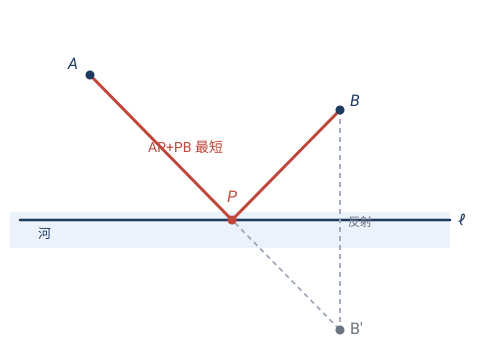
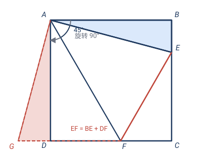
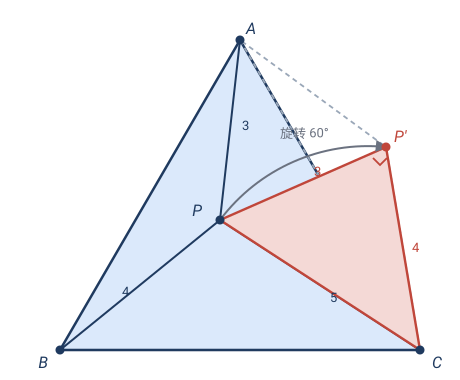
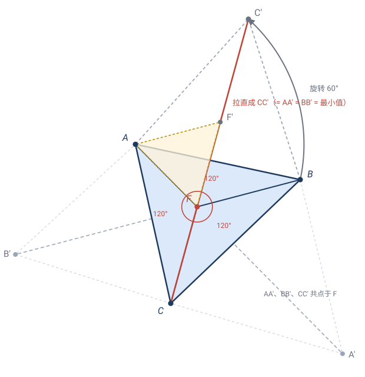
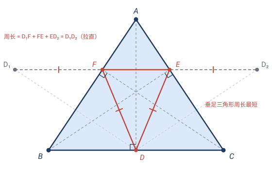
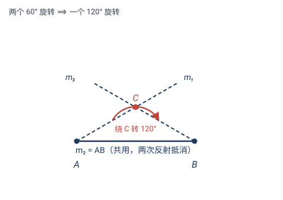
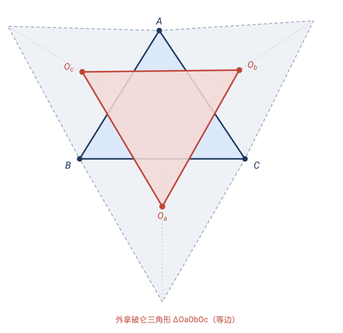
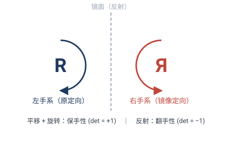
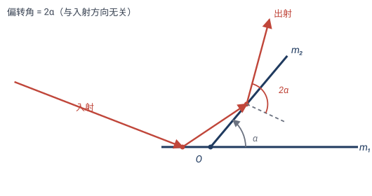

# 第 2 章 · 经典习题：用刚体变换"一招制敌"

> 这一节的 5 道题有一个共同特点：**用刚体变换（反射或旋转）一两步就漂亮地解决；可若要硬算——建坐标系、设未知数、求导——往往极其繁琐，甚至无从下手。** 这正是变换几何的威力：它把"分散的线段"接到一起，把"要求和的距离"翻折成直线。

> 📌 **两组题的区别**
> - **第一组（题 1–5）· 经典构造题**：可以用变换语言漂亮地重述，但**就算没学刚体变换，凭"对称、旋转"的几何直觉和辅助线也能做**——变换在这里主要提供一个更清晰的视角。
> - **第二组（题 6–10）· 非用本章结论不可**：必须**用到第 2 章的某个理论结论**（反射生成定理、等距分类、定向、复数形式、群复合……）才好下手；不学这些结论，要么无从着手，要么硬算到崩溃。每道题都标了它依赖的章节。

---

## 第一组 · 经典构造题（变换是更清晰的视角）

> 💡 **总窍门**：一看到"求几条线段之和的最值"或"几条分散线段要凑成三角形"，第一反应就该是——**能不能用一个反射或旋转，把这些线段首尾相接地拼起来？** 下面 5 题，5 次都是这个套路。

---

## 题 1 · 将军饮马（反射）

直线 $\ell$（一条河）的同侧有定点 $A$、$B$。要在河岸 $\ell$ 上选一点 $P$，使 $A\to P\to B$ 的总路程 $AP+PB$ 最短。$P$ 该选在哪？

> 💡 **变换思路**：$AP+PB$ 难算，因为 $P$ 在动、两段都变。但若把 $B$ 关于 $\ell$ **反射**到对岸 $B'$，则对任意 $P\in\ell$ 都有 $PB=PB'$（反射保距，且 $\ell$ 上的点不动）。于是
> $$AP+PB = AP+PB' \ge AB',$$
> 最后一步用"两点之间直线最短"，等号当 $A,P,B'$ 共线时成立。

**解**：作 $B$ 关于 $\ell$ 的对称点 $B'$，连 $AB'$ 交 $\ell$ 于 $P$，此 $P$ 即为所求。

> ✏️ **不用变换会怎样**：设 $\ell$ 为 $x$ 轴、$A=(a_1,a_2)$、$B=(b_1,b_2)$，$P=(t,0)$，则
> $$AP+PB=\sqrt{(t-a_1)^2+a_2^2}+\sqrt{(t-b_1)^2+b_2^2},$$
> 对 $t$ 求导令其为零，要解一个带两个根号的方程——高中生能做，但远不如反射一行利落。

---

## 题 2 · 正方形里的 45° 角（旋转 90°）

正方形 $ABCD$，$E$ 在 $BC$ 上、$F$ 在 $CD$ 上，且 $\angle EAF=45°$。求证：
$$EF = BE + DF.$$

> 💡 **变换思路**：要证 $EF$ 等于两段 $BE,DF$ 之和，可这两段分散在两条相邻边上。**把 $\triangle ABE$ 绕 $A$ 旋转 $90°$**（让 $B$ 转到 $D$），$BE$ 就被"搬到"了 $DF$ 的延长线上，与 $DF$ 共线，直接相加。

**证**：把 $\triangle ABE$ 绕 $A$ 逆时针旋转 $90°$ 到 $\triangle ADG$（$G$ 落在 $DC$ 的延长线上）。则
- $AG=AE$，$DG=BE$（旋转保长）；
- $\angle GAF=\angle GAD+\angle DAF=\angle BAE+\angle DAF=90°-\angle EAF=45°=\angle EAF$。

在 $\triangle AEF$ 与 $\triangle AGF$ 中：$AE=AG$、$AF$ 公共、夹角 $\angle EAF=\angle GAF=45°$，故 $\triangle AEF\cong\triangle AGF$（SAS），所以
$$EF=GF=GD+DF=BE+DF. \quad\square$$

> ✏️ **点睛**：旋转把 $BE$ 搬到 $DF$ 旁边，三段 $BE,DF,EF$ 共线后立刻 $EF=BE+DF$。这是"旋转凑全等"的范本——不旋转的话，要靠"截长补短"凑辅助线，思路不直观。

---

## 题 3 · 三条分散的线段（旋转 60°）

$P$ 是等边三角形 $ABC$ 内一点，已知 $PA=3,\;PB=4,\;PC=5$。求 $\angle APB$。

> 💡 **变换思路**：$PA,PB,PC$ 朝三个不同方向，互不相干，根本拼不成三角形——这正是"无从下手"的根源。**把 $\triangle ABP$ 绕 $A$ 旋转 $60°$**（让 $B$ 转到 $C$），$PB$ 就被搬到 $P'C$，而 $PP'$ 恰好 $=PA$（因为 $\triangle APP'$ 是等边三角形）。三段 $PA,PB,PC$ 立刻首尾相接成 $\triangle PP'C$。

**解**：把 $\triangle ABP$ 绕 $A$ 旋转 $60°$（$B\to C$）到 $\triangle ACP'$。则
- $AP'=AP=3$，且 $\angle PAP'=60°$，故 $\triangle APP'$ 等边，$PP'=AP=3$；
- $P'C=PB=4$（旋转保长）；
- 又已知 $PC=5$。

于是 $\triangle PP'C$ 三边为 $PP'=3,\;P'C=4,\;PC=5$。验证 $3^2+4^2=9+16=25=5^2$，故 $\triangle PP'C$ 是直角三角形，$\angle PP'C=90°$。因此
$$\angle APB=\angle AP'C=\angle AP'P+\angle PP'C=60°+90°=150°.$$

> ✏️ **点睛**：$3,4,5$ 是最经典的勾股数，但它们分散在三个方向时毫无用处；旋转 $60°$ 把它们接成一个直角三角形，答案自然浮现。**不用变换，这道题几乎无法下手。**

---

## 题 4 · 费马点（旋转 60°）

$\triangle ABC$ 的每个内角都小于 $120°$。求其内部一点 $F$，使 $FA+FB+FC$ 最小（这个点叫**费马点**）。

> 💡 **变换思路**：又是"三条线段之和的最小值"。把 $\triangle ABF$ 绕 $A$ 旋转 $60°$ 到 $\triangle AC'F'$（转到形外），则 $FB=F'C'$、$FA=F'F$（$\triangle AFF'$ 等边）。于是三段和 $FA+FB+FC$ 变成了一条**折线** $C\to F\to F'\to C'$ 的长度——最小化一条折线 ⟺ 把它**拉直**成直线段 $CC'$。

**解**：由上，$FA+FB+FC$ 等于折线 $CFF'C'$ 的长，它 $\ge CC'$，等号当 $C,F,F',C'$ 共线。

当共线时，$C,F,F'$ 在一条直线上，$\angle CFF'=180°$；而 $\triangle AFF'$ 等边，$\angle AFF'=60°$，故
$$\angle AFC=180°-60°=120°.$$
对另外两条边同样操作（分别绕 $B$、绕 $C$ 旋转 $60°$），得 $\angle AFB=\angle BFC=120°$。

> 🎯 **结论**：费马点是 $\triangle ABC$ 内那个"看三边都成 $120°$"的点；最小值 $FA+FB+FC=CC'$。
>
> ✏️ **点睛**：不用变换，这是三元函数 $f(F)=FA+FB+FC$ 的极值问题，要大学微积分；旋转 $60°$ 把"求和最小"翻译成"折线拉直"，初等方法就解了。

**完备讨论 · 三个必须补上的"为什么"**

**① 为什么正三角形要向外作？**

绕 $A$ 把 $B$ 转 $60°$，像点有两个候选——直线 $AB$ 两侧各有一个正三角形顶点。取等条件要求 $C,F,F',C'$ **依次**共线、且 $F$ 是形内点。选**外侧**（与 $C$ 异侧）的顶点 $C'$ 时，$C$ 与 $C'$ 分居直线 $AB$ 两侧，线段 $CC'$ 必然横穿三角形内部，等号配置才有形内解。若选内侧，$C'$ 与 $C$ 同侧，共线条件会把 $F$ 推到三角形外——下界 $CC'$ 虽然依旧成立，却永远取不到等号，算出来的就不是真正的最小值。

直观地说：向外作正三角形，是把 $FB$ **翻到形外**，让折线 $C\to F\to F'\to C'$ "一路向外走、不回头"，这样才拉得直；向内作，折线折回来，三点顺序就不对了。

**② 为什么 $AA'$、$BB'$、$CC'$ 三条连线恰好交于一点？**

设三边向外各作正三角形 $\triangle BCA'$、$\triangle CAB'$、$\triangle ABC'$。关键在于：**同一把"$60°$ 旋转"可以绕三个顶点各做一次**，每次都把 $FA+FB+FC$ 接成一条折线——

- 绕 $A$ 转（$B\to C'$）：$FA+FB+FC = CF+FF'+F'C' \ge CC'$，等号 ⟺ $C,F,F',C'$ 共线（这要求 $\angle AFC=\angle AFB=120°$）；
- 绕 $B$ 转（$C\to A'$）：$FA+FB+FC = AF+F\tilde F+\tilde FA' \ge AA'$，等号 ⟺ $A,F,\tilde F,A'$ 共线（这要求 $\angle BFA=\angle BFC=120°$）；
- 绕 $C$ 转（$A\to B'$）：$FA+FB+FC = BF+F\hat F+\hat FB' \ge BB'$，等号 ⟺ $B,F,\hat F,B'$ 共线（这要求 $\angle CFB=\angle CFA=120°$）。

同一个量 $FA+FB+FC$ 一下子有了**三个下界** $AA',BB',CC'$；而三组取等条件合起来都是同一句话——"$F$ 看三边皆成 $120°$"。上面找到的费马点 $F$ 同时满足全部条件，因此它**同时躺在线段 $AA'$、$BB'$、$CC'$ 上**：三条连线共点于费马点，并且三条线段等长，

$$AA'=BB'=CC'=FA+FB+FC\ (\text{最小值}).$$

共点不是巧合，而是"同一个 $F$ 让三条折线同时拉直"的必然结果。

**③ 若某个内角 $\ge 120°$，结论怎么修正？**

设 $\angle BAC\ge 120°$。先看这个 $120°$ 门槛从哪里来：$C'$ 满足 $AC'=AB$、$\angle BAC'=60°$（外侧），故

$$\angle CAC'=\angle BAC+60°.$$

当 $\angle BAC=120°$ 时 $\angle CAC'=180°$——顶点 $A$ **恰好落在线段 $CC'$ 上**，此时 $F=A$ 就使折线取等（折线 $C\to A\to A\to C'$ 的长 $=CA+AC'=CA+AB=CC'$）。一旦 $\angle BAC>120°$，$\angle CAC'>180°$，$A$ "翻过"了直线 $CC'$，取等所要求的 $F$ 被挤到三角形外——**形内等号不可达**。这也解释了①里"每个内角 $<120°$"这个前提：外向正三角形的 $60°$ 与原内角拼成平角，恰是 $\angle BAC+60°\le180°$ ⟺ $\angle BAC\le120°$。

内点为何必然失败，也可以直接看：对任一**内点** $F$，
$$\angle BFC=180°-\angle FBC-\angle FCB>180°-\angle ABC-\angle ACB=\angle BAC\ge120°,$$
与费马条件 $\angle BFC=120°$ 矛盾——形内根本不存在"看三边皆 $120°$"的点。

那最小值落到哪里？$f(F)=FA+FB+FC$ 是三个距离之和，是**凸函数**（碗状，谷底唯一）。谷底既然不在形内，最小点就贴在边界上——正是那个大角顶点 $A$。严格验证 $A$ 最优：从 $A$ 沿任一指向形内的方向移动一小段 $t$，$FA$ 增加 $t$；$FB,FC$ 分别减少 $t\cos\theta_1,\;t\cos\theta_2$（$\theta_1,\theta_2$ 是移动方向与 $AB,AC$ 的夹角，$\theta_1+\theta_2=\angle BAC\ge120°$），而
$$\cos\theta_1+\cos\theta_2=2\cos\frac{\theta_1+\theta_2}{2}\cos\frac{\theta_1-\theta_2}{2}\le 2\cos\frac{\angle BAC}{2}\le 2\cos 60°=1,$$
总和不减。凸函数在 $A$ 没有任何下降方向，故 $A$ 就是全局最小点。

> 🎯 **结论（完整版）**：
> - **三角皆 $<120°$**：费马点 = 形内唯一"看三边皆 $120°$"的点 $=AA'\cap BB'\cap CC'$；最小值 $=AA'=BB'=CC'$。
> - **某角 $\ge120°$**（如 $\angle A$）：费马点**退化到该顶点**，$F=A$；最小值 $=AB+AC$。
> - **临界 $\angle A=120°$** 时两情形无缝衔接：$A$ 落在线段 $CC'$ 上，且 $B,A,B'$ 共线——$AA',BB',CC'$ 仍共点（于 $A$），$AA'=BB'=CC'=AB+AC$。

---

## 题 5 · 周长最短的内接三角形（反射展开）

锐角 $\triangle ABC$ 内接一个三角形 $DEF$（$D\in BC,\;E\in CA,\;F\in AB$）。哪个内接三角形**周长最短**？

> 💡 **变换思路**：周长 $DF+FE+ED$ 是三段之和，三段又分散。这次用**反射"展开"**：把 $D$ 关于 $AB$ 反射到 $D_1$、关于 $AC$ 反射到 $D_2$，则 $DF=D_1F$、$DE=D_2E$（反射保距）。于是周长变成 $D_1F+FE+ED_2$——一条从 $D_1$ 经 $F,E$ 到 $D_2$ 的折线，最短就是直线 $D_1D_2$。

**解**：固定 $D\in BC$。如上，周长 $=D_1F+FE+ED_2\ge D_1D_2$，等号当 $D_1,F,E,D_2$ 共线（此时 $F,E$ 被 $D_1D_2$ 与 $AB,AC$ 的交点唯一确定）。

所以固定 $D$ 时的最小周长 $=D_1D_2$。注意 $D_1,D_2$ 到 $A$ 的距离都 $=AD$，且 $\angle D_1AD_2=2\angle BAC$（两次反射把 $\angle BAC$ 翻倍），由余弦定理/正弦定理
$$D_1D_2 = 2\cdot AD\cdot\sin\angle BAC.$$
要让周长最短，就要让 $AD$ 最短——而 $D$ 在 $BC$ 上移动时，$AD$ 最短恰为 $A$ 到 $BC$ 的**高**，即 $D$ 是 $A$ 的**垂足**。同理 $E,F$ 是另两个顶点的垂足。

> 🎯 **结论（法格纳诺定理）**：锐角三角形周长最短的内接三角形，是它的**垂足三角形**（三条高线的垂足连成的三角形）。
>
> ✏️ **点睛**：反射不只"对折一次"，可以**连续反射把折线完全展开成直线**——这是处理"封闭折线（周长）最值"的通用绝招。本题不用变换几乎无解。

---

## 第二组 · 非用第 2 章结论不可（变换是必需工具）

> 下面 5 题，每一道都标着"用到第 X 节"。它们靠的不是辅助线技巧，而是**等距变换的理论结论**——反射如何拼成一切、等距如何分类、定向为何重要、复数如何让旋转可算。

## 题 6 · 两个旋转的复合（2.3 反射分解 + 2.5 群封闭）

> 🔖 **用到**：2.3 节"旋转 = 两条过中心、夹角半转角的镜面反射的复合"，2.5 节"两个正向等距的复合仍是正向等距"。

平面上两点 $A,B$。设 $\mathbf{R}_A$ = 绕 $A$ 转 $60°$、$\mathbf{R}_B$ = 绕 $B$ 转 $60°$（两个旋转**同向**；具体顺时针还是逆时针不影响结论，下图按同向画）。复合 $\mathbf{R}_B\mathbf{R}_A$（先 $\mathbf{R}_A$ 后 $\mathbf{R}_B$）是什么？绕哪个点、转多少度？

> 💡 **关键**：硬算要套两个旋转矩阵 + 平移再相乘、再识别、再求中心，坐标满天飞。用 2.3 的**反射分解**——每个旋转拆成两个反射，让相邻反射"共用一条镜面"互相抵消——两行就化简。

**解**：把每个旋转拆成两个反射，**故意让中间两个反射共用直线 $AB$**：
- $\mathbf{R}_A=\mathbf{S}_{m_2}\mathbf{S}_{m_1}$，$m_1,m_2$ 过 $A$、夹角 $30°$，取 $m_2=$ 直线 $AB$；
- $\mathbf{R}_B=\mathbf{S}_{m_3}\mathbf{S}_{m_2'}$，$m_2',m_3$ 过 $B$、夹角 $30°$，取 $m_2'=$ 直线 $AB$。

于是
$$\mathbf{R}_B\mathbf{R}_A=\mathbf{S}_{m_3}\,\mathbf{S}_{AB}\,\mathbf{S}_{AB}\,\mathbf{S}_{m_1}=\mathbf{S}_{m_3}(\mathbf{S}_{AB}^2)\mathbf{S}_{m_1}=\mathbf{S}_{m_3}\mathbf{S}_{m_1},$$
中间 $\mathbf{S}_{AB}^2=\mathbf{id}$（同一镜面反射两次 = 不动）。现在 $m_1,m_3$ 是两条相交直线（$m_1$ 过 $A$ 与 $AB$ 夹 $30°$、$m_3$ 过 $B$ 与 $BA$ 夹 $30°$），交于点 $C$，夹角 $60°$。

由 2.3，**两个相交镜面的反射 = 绕交点转 $2\times$ 夹角**，所以
$$\mathbf{R}_B\mathbf{R}_A=\text{绕 }C\text{ 转 }2\times 60°=120°\text{ 的旋转}.$$

> 🎯 **结论**：两个 $60°$ 旋转的复合，是绕第三点 $C$ 转 $120°$ 的旋转；其中 $C$ 满足 $\angle CAB=\angle CBA=30°$（在 $AB$ 同侧，故 $\angle ACB=120°$）。
>
> ✏️ **点睛**：2.5 保证复合一定是旋转（正向等距对复合封闭，不会跑出别的类型）；2.3 的反射分解则给出**算中心、算角度**的工具。两条结论一用，问题瞬间塌缩。

---

## 题 7 · 拿破仑定理（2.7 复数形式）

> 🔖 **用到**：2.7 节复数形式——旋转写成乘 $e^{i\theta}$，"等边三角形"变成一个**代数**条件。

任意 $\triangle ABC$，三边**向外**各作一个等边三角形，记其外心为 $O_a$（$BC$ 边外）、$O_b$（$CA$ 边外）、$O_c$（$AB$ 边外）。证明 $\triangle O_aO_bO_c$ 是等边三角形（**外拿破仑三角形**）。

> 💡 **关键**：纯几何证明要相当精巧的辅助线。用 2.7 复数形式，它变成**机械的代数验算**——复数的威力正在此。

**解**：设 $A,B,C$ 为复数 $a,b,c$，$\omega=e^{i\pi/3}$（转 $60°$），则 $\bar\omega=1-\omega$、$\omega^2=\omega-1$。设 $\triangle ABC$ 逆时针定向。把 $BC$ 的向量乘 $\bar\omega$（转 $60°$）即指向 $BC$ 的**外侧**（远离 $A$），故 $BC$ 外侧等边三角形第三顶点
$$a'=b+(c-b)\bar\omega,$$
其外心（等边三角形三心合一）$O_a=\dfrac{b+c+a'}{3}=\dfrac{(2-\bar\omega)b+(1+\bar\omega)c}{3}$。循环地，
$$O_b=\frac{(2-\bar\omega)c+(1+\bar\omega)a}{3},\quad O_c=\frac{(2-\bar\omega)a+(1+\bar\omega)b}{3}.$$

$\triangle O_aO_bO_c$ 等边 $\iff$ 一条边向量转 $120°$（乘 $\omega^2$）等于下一条边：要证 $O_c-O_b=\omega^2(O_b-O_a)$。算出
$$O_b-O_a=\tfrac13\bigl[(1+\bar\omega)a-(2-\bar\omega)b+(1-2\bar\omega)c\bigr].$$
逐项核对三个系数（关键恒等 $\bar\omega=1-\omega,\;\omega^2=\omega-1$）：
$$\omega^2(1+\bar\omega)=1-2\bar\omega,\quad -\omega^2(2-\bar\omega)=1+\bar\omega,\quad \omega^2(1-2\bar\omega)=-(2-\bar\omega),$$
恰好等于 $O_c-O_b$ 的对应系数。故 $O_c-O_b=\omega^2(O_b-O_a)$。$\square$

> 🎯 **结论**：$\overrightarrow{O_bO_c}$ 由 $\overrightarrow{O_aO_b}$ 转 $120°$ 得到，故三边等长、相邻成 $60°$，$\triangle O_aO_bO_c$ 等边。
>
> ✏️ **点睛**：旋转写成"乘 $\omega$"后，"等边"这个几何关系变成**代数等式**——证明退化成验算系数。这就是 2.7 的价值：**把几何难题翻译成代数计算**。（三个等边三角形改作**向内**，结论仍成立，得"内拿破仑三角形"。）

---

## 题 8 · 这个变换是什么？求旋转中心（2.6 分类 + 2.7 复数）

> 🔖 **用到**：2.6 节等距分类（看线性部分），2.7 节用复数解不动点。

变换 $\mathbf{T}(x,y)=(-y+1,\;x+2)$。(a) 它是哪一类等距？(b) 求旋转中心。

> 💡 **关键**：2.6 让你"看线性部分就分类"，2.7 给你"解不动点方程"的标准动作——两步机械完成。

**解**：
(a) 线性部分 $M=\begin{pmatrix}0&-1\\1&0\end{pmatrix}$ 是绕原点转 $90°$ 的矩阵（$\det M=1$）。因 $M\ne I$，它不是平移；$\det=+1$（正向），由 2.6，$\mathbf{T}$ 是**绕某点转 $90°$ 的旋转**。

(b) 旋转中心 = 不动点。用 2.7 复数：$\mathbf{T}$ 即 $z\mapsto iz+(1+2i)$，不动点 $z=iz+(1+2i)$，故
$$z=\frac{1+2i}{1-i}=\frac{(1+2i)(1+i)}{2}=\frac{-1+3i}{2}=-\tfrac12+\tfrac32\,i,$$
中心 $\bigl(-\tfrac12,\,\tfrac32\bigr)$。

> ✏️ **点睛**：2.6 让你**一眼**看出类型，2.7 让你**一行**解出中心。不学这两条，得手算判别 $M$、再解二元方程组——多绕几圈。

---

## 题 9 · 左手能转成右手吗？（2.2 定向）

> 🔖 **用到**：2.2 节**定向**——平移、旋转是正向等距（$\det=+1$，保手性），反射是反向等距（$\det=-1$，翻手性）。

能否只用**平移和旋转**（不许翻面、不许照镜子），把一只左手的手型变成右手的手型？

> 💡 **关键**：直觉说"不能"，但**为什么**？2.2 的定向给出严格判据。

**解**：不能。平移、旋转都是**正向等距**（$\det=+1$），保持"手性"——左手系映成左手系，绝不变成右手系（回想 2.2：字母 $\mathbf{R}$ 怎么转都还是 $\mathbf{R}$，只有反射才把它翻成镜像 $\mathbf{Я}$）。而右手是左手的**镜像**（反向），把左手变右手需要**翻转定向**，这只有**反射**（反向等距，奇数个反射）做得到。

> 🎯 **结论**：左手到右手**必须**经过反射，单靠平移 + 旋转永远做不到。
>
> ✏️ **推论**：两个 SSS 全等的三角形，若顶点顺序"一顺一逆"（定向相反），连接它们的等距必含反射；定向相同则只用平移 + 旋转就够。**定向是全等之外的一份额外信息**。日常里鞋分左右脚、螺丝分正反扣、DNA 双螺旋分左右手——都是定向。

---

## 题 10 · 双镜反射的偏转角（2.3 两反射 = 旋转 $2\alpha$）

> 🔖 **用到**：2.3 节"两个相交镜面的反射 = 绕交点转 $2\times$ 镜面夹角的旋转"。

两面镜子夹角 $\alpha$。一束光线射入，依次经两面镜子反射后射出。证明：**出射光线相对入射光线的偏转角恒为 $2\alpha$，与入射方向无关。**

> 💡 **关键**：朴素做法要逐镜面套"入射角 = 反射角"，式子里满是入射角，**看似**依赖入射方向。把每次反射看成反射变换，2.3 一句话点破。

**解**：记两面镜子为镜面 $m_1,m_2$（夹角 $\alpha$），反射变换 $\mathbf{S}_1,\mathbf{S}_2$。光线方向（一个向量）被反射变换作用：入射方向 $\mathbf{v}$ 经两次反射变为 $\mathbf{S}_2\mathbf{S}_1(\mathbf{v})$。

由 2.3，**两个相交镜面的反射复合 $\mathbf{S}_2\mathbf{S}_1$ 是绕交点转 $2\alpha$ 的旋转**——与 $\mathbf{v}$ 是什么无关。所以无论从哪个方向射入，出射方向都是入射方向**统一转 $2\alpha$**，偏转角恒为 $2\alpha$。$\square$

> 🎯 **应用**：自行车尾灯（多组垂直小镜面，偏转恒 $180°$，把射来的光原路弹回）、潜望镜（两次 $90°$ 反射偏转 $180°$，实现"拐弯"看）——都靠"偏转与入射无关"。
>
> ✏️ **点睛**：把"反射"当**代数对象相乘**，问题立刻塌缩成"两个反射的复合是什么"，而答案 2.3 早就准备好了。

---

## 🧠 回顾

**第一组（题 1–5）** 的共同套路——

> **反射或旋转，把分散的、要求和的线段，首尾相接地拼成一条折线，再"拉直"取最小。**

- 题 1：反射 1 次，把 $AP+PB$ 拉直成 $AB'$。
- 题 2：旋转 1 次（$90°$），把 $BE$ 搬到 $DF$ 旁边共线相加。
- 题 3：旋转 1 次（$60°$），把 $PA,PB,PC$ 接成一个三角形。
- 题 4：旋转 1 次（$60°$），把 $FA+FB+FC$ 拉直成 $CC'$；绕三顶点各转一次还得三线 $AA',BB',CC'$ 共点且等长，某角 $\ge120°$ 时退化到该顶点。
- 题 5：反射 2 次，把周长折线展开成直线 $D_1D_2$。

**第二组（题 6–10）** 则展示了第 2 章**理论结论**的实战力量——

| 题 | 用到的第 2 章结论 | 它替你省掉了什么 |
|---|---|---|
| 6 两旋转复合 | 2.3 反射分解 + 2.5 群封闭 | 矩阵相乘 + 求中心的坐标运算 |
| 7 拿破仑定理 | 2.7 复数形式 | 精巧的辅助线，变成机械代数 |
| 8 识别等距 | 2.6 分类 + 2.7 不动点 | 画图试探、解方程组的弯路 |
| 9 左右手 | 2.2 定向 | 把"直觉上不行"变成严格判据 |
| 10 双镜偏转 | 2.3 两反射 = 转 $2\alpha$ | 逐镜面套入射角公式的推导 |

两组合起来，正是第 2.3 节"反射生成定理"的完整回响：**既然任何刚体运动都是反射拼出来的，那么解题时主动"拼"一个反射或旋转（第一组），或直接调用等距的理论结构（第二组），往往就是破题的那一步。**

---

> 📚 返回 [第 2 章 · 刚体变换](02-刚体变换-等距.md) ｜ [目录](README.md)
