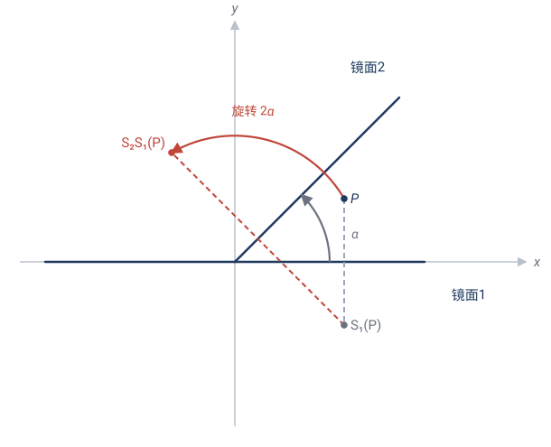
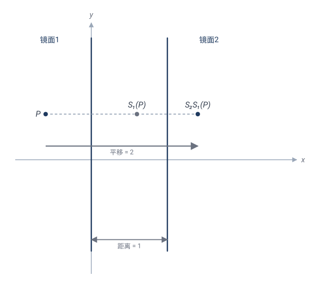
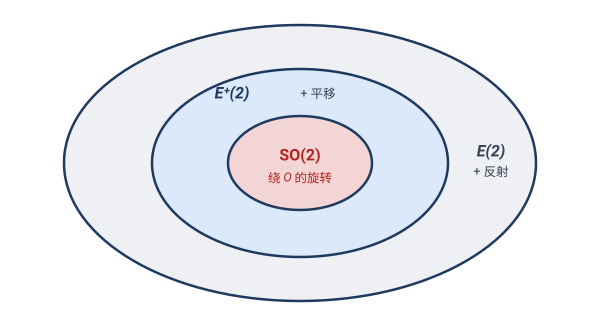

# 第 2 章 · 刚体变换：把图形当一块"刚硬的铁板"

## 2.1 什么是"刚体"

把一个三角形画在一张**硬纸板**上，剪下来。你能对它做的事，无非三种：

- **平移**：整个推走，不转；
- **旋转**：钉住一个点，转动；
- **翻折**：翻个面（镜像）。

无论怎么折腾，这块硬纸板**绝不变形**——边长、角、面积都不变。这就是"**刚体**"（rigid body）的含义：**任何两点间的距离都不变**。

> 🎯 **定义**：平面上的一个变换 $\mathbf{T}$ 称为**等距变换**（isometry，又称**刚体运动**），如果它**保持任意两点的距离**：
> $$\text{对任意 } P,Q,\quad d(\mathbf{T}(P),\,\mathbf{T}(Q)) = d(P,Q).$$

这是变换几何的**地基**。整个欧氏几何研究的，就是这种变换下不变的性质。

> 💡 "等距"的精确定义只要求"保距"，**没有**直接要求保角、保面积、把直线变直线。神奇的是——**这些全是"保距"的自动推论**（2.4 节逐一证）。等距变换天然保角、保面积、把直线映成直线。这就是"不变量"思想的第一课：**一个不起眼的不变量（距离），竟能拖出一整套性质。**

## 2.2 三种基本等距：平移、旋转、反射

我们用坐标公式把它们一个个写清楚。

### (1) 平移 translation

把平面上每个点都朝同一方向移动同样距离。设移动向量 $(a,b)$：
$$\mathbf{T}_{(a,b)}:\;(x,y) \mapsto (x+a,\; y+b).$$

> ✏️ **手算**：平移 $(3,-2)$ 把点 $(1,4)$ 送到 $(4,2)$；把原点 $(0,0)$ 送到 $(3,-2)$。
>
> **保距验证**：任两点 $P=(x_1,y_1), Q=(x_2,y_2)$，平移后 $P'=(x_1+a,y_1+b), Q'=(x_2+a,y_2+b)$。
> $$d(P',Q')=\sqrt{((x_2+a)-(x_1+a))^2+((y_2+b)-(y_1+b))^2}=\sqrt{(x_2-x_1)^2+(y_2-y_1)^2}=d(P,Q).\checkmark$$
> 减号把 $a,b$ 全消掉了——平移保距，根本原因在此。

### (2) 旋转 rotation

钉住一个点 $O$（旋转中心），把每个点绕 $O$ 转过角度 $\theta$。最常见的是绕原点：
$$\mathbf{R}_\theta:\;(x,y)\mapsto (x\cos\theta - y\sin\theta,\; x\sin\theta + y\cos\theta).$$

> ✏️ **手算**：绕原点转 $90°$（$\theta=\pi/2$，$\cos=0,\sin=1$）：
> $$(x,y)\mapsto (-y,\;x).$$
> 检验：$(1,0)\mapsto(0,1)$ ✓（正 $x$ 轴转到正 $y$ 轴）；$(0,1)\mapsto(-1,0)$ ✓。

为什么旋转保距？最优雅的看法是**复数**。记 $z=x+iy$，绕原点转 $\theta$ 就是乘以 $e^{i\theta}=\cos\theta+i\sin\theta$：
$$z \mapsto e^{i\theta} z.$$

而乘法保模长：$|e^{i\theta}z|=|e^{i\theta}|\,|z|=1\cdot|z|=|z|$。两个点 $z_1,z_2$ 的距离是 $|z_1-z_2|$，旋转后
$$|e^{i\theta}z_1-e^{i\theta}z_2|=|e^{i\theta}|\,|z_1-z_2|=|z_1-z_2|.$$

**一行就证完了。**

### (3) 反射 reflection

关于一条直线（"镜面"$\ell$）翻折。每个点 $P$ 映到它关于 $\ell$ 的对称点 $P'$。

最简单的三个反射：

- 关于 $x$ 轴：$(x,y)\mapsto(x,-y)$；
- 关于 $y$ 轴：$(x,y)\mapsto(-x,y)$；
- 关于直线 $y=x$：$(x,y)\mapsto(y,x)$（横纵坐标互换）。

> ✏️ **手算**：关于 $y=x$ 反射，把 $(3,5)\mapsto(5,3)$。在直角坐标系里，这就是点 $(3,5)$ 翻到对角线另一侧的镜像。

反射**保距**（镜像不拉伸），但它**反转定向**——左手变右手。这是反射区别于平移、旋转的关键，下面会用到。

### 定向：左手系 vs 右手系

平移和旋转（叫"**正向等距**"，proper isometries）保持图形的"手性"：一个字母 **R** 转来转去还是 R，不会变成镜像。

反射把 **R** 变成 **Я**（镜像）。这种"翻面"的变换叫"**反向等距**"（improper）。

判定一个等距是正向还是反向，看它的矩阵行列式：$\det = +1$ 正向，$\det=-1$ 反向。

| 变换 | 矩阵（线性部分） | $\det$ | 定向 |
|---|---|---|---|
| 旋转 $\theta$ | $\begin{pmatrix}\cos\theta&-\sin\theta\\\sin\theta&\cos\theta\end{pmatrix}$ | $+1$ | 正 |
| 关于 $x$ 轴反射 | $\begin{pmatrix}1&0\\0&-1\end{pmatrix}$ | $-1$ | 反 |
| 关于 $y=x$ 反射 | $\begin{pmatrix}0&1\\1&0\end{pmatrix}$ | $-1$ | 反 |

## 2.3 ⭐ 反射生成定理：万物皆由镜子造

现在来了本章最重要、也最优雅的定理。

> **定理（反射生成定理）**：平面上的**任何**等距变换，都可以写成**至多三个反射的复合**。

换句话说——**平面上所有的刚体运动，全都是"照镜子"造出来的**。镜面反射是唯一的"基本砖"，平移和旋转都是用砖砌出来的。

我们用具体例子拆开来看，每一种等距怎么由反射拼出。

### 例 1：两个反射 = 一个旋转（当镜面相交）

取两条过原点、夹角为 $\alpha$ 的直线作镜面，做两次反射，结果是**绕原点转 $2\alpha$**。

> ✏️ **手算**：取镜面为 $x$ 轴，再取镜面为直线 $y=x$（与 $x$ 轴夹角 $\alpha=45°$）。
>
> - 关于 $x$ 轴反射：$\mathbf{S}_1(x,y)=(x,-y)$；
> - 关于 $y=x$ 反射：$\mathbf{S}_2(x,y)=(y,x)$。
>
> 先 $\mathbf{S}_1$ 后 $\mathbf{S}_2$（注意复合顺序，右起作用）：
> $$\mathbf{S}_2\mathbf{S}_1(x,y)=\mathbf{S}_2(x,-y)=(-y,\;x).$$
> 这正是绕原点转 $90°$！而 $90° = 2\times 45° = 2\alpha$。✓

**为什么是 $2\alpha$？** 一面镜子把方向"翻过去"，翻的角度是 $2\alpha$；再翻一次只是平移了镜面，不再增加转角。几何直观：两条相交直线间的角 $\alpha$，反射一次把光线"折"了 $2\alpha$。

### 例 2：两个反射 = 一个平移（当镜面平行）

取两条**平行**直线作镜面，做两次反射，结果是**沿垂直方向的一个平移**，平移距离 = 两镜面距离的 2 倍。

> ✏️ **手算**：取镜面 $x=0$（$y$ 轴）和 $x=1$（与 $y$ 轴平行，距离 1）。
>
> - 关于 $x=0$ 反射：$\mathbf{S}_1(x,y)=(-x,y)$；
> - 关于 $x=1$ 反射：$\mathbf{S}_2(x,y)=(2-x,y)$（点 $(x,y)$ 关于直线 $x=1$ 的对称点横坐标为 $2-x$）。
>
> 先 $\mathbf{S}_1$ 后 $\mathbf{S}_2$：
> $$\mathbf{S}_2\mathbf{S}_1(x,y)=\mathbf{S}_2(-x,y)=(2-(-x),\;y)=(x+2,\;y).$$
> 这是**沿 $x$ 方向平移 $2$**！而两镜面距离 $1$，平移量 $2=2\times1$。✓

### 例 3：旋转 + 平移 = 还是旋转（或平移）

正向等距 $\mathbf{R}_\theta$ 后接平移 $\mathbf{T}$，结果**仍然是某个旋转**（只是旋转中心变了）；除非 $\theta=0$，那就退化成平移。

**用复数一眼看穿**：先转 $\theta$ 再平移 $b$（$b\in\mathbb C$ 是平移向量），合起来是
$$z\;\mapsto\;e^{i\theta}z+b.$$
（其实**任意两个正向等距的复合**都长这样：转角相加、平移向量叠加。）要证它是旋转，只需**找出旋转中心**——即不动点 $z_0$（满足 $z_0\mapsto z_0$）：
$$e^{i\theta}z_0+b=z_0\quad\Longrightarrow\quad z_0=\frac{b}{1-e^{i\theta}}.$$
分母不为零当且仅当 $\theta\ne0$（$e^{i\theta}=1$ 仅在 $\theta=0$）。

- $\theta\ne0$：$z_0$ 存在且唯一。把变换**绕** $z_0$ 改写：
$$e^{i\theta}z+b=e^{i\theta}(z-z_0)+\underbrace{(e^{i\theta}z_0+b)}_{=z_0}=e^{i\theta}(z-z_0)+z_0,$$
这正是"绕 $z_0$ 转 $\theta$"（先减 $z_0$ 移到原点、转 $\theta$、再加回）。✓ 中心从原点**搬**到了 $z_0$，转角不变。
- $\theta=0$：$z\mapsto z+b$，退化成**平移**。✓

> ✏️ **手算**：先绕原点转 $90°$，再右移 $2$，即 $z\mapsto iz+2$。
> - 不动点 $z_0=\dfrac{2}{1-i}=\dfrac{2(1+i)}{(1-i)(1+i)}=\dfrac{2(1+i)}{2}=1+i$（点 $(1,1)$）。
> - 验证它确是不动点：$i(1+i)+2=i-1+2=1+i$。✓
> - 故"绕原点转 $90°$ 再右移 $2$"**等价于"绕点 $(1,1)$ 转 $90°$"**。
> - 抽检原点：原变换 $i\cdot0+2=2$，即 $(2,0)$；绕 $(1,1)$ 转 $90°$，$(0,0)$ 相对 $(1,1)$ 是 $(-1,-1)$，转 $90°$（$(x,y)\mapsto(-y,x)$）成 $(1,-1)$，加回 $(1,1)$ 得 $(2,0)$。✓ 两条路殊途同归。

> 💡 **精髓**：旋转 + 平移"还是旋转"，根子在**不动点**。$\theta\ne0$ 让方程 $e^{i\theta}z_0+b=z_0$ 总能解出唯一的 $z_0$，而"一个等距若有不动点、且线性部分是旋转（$\det=+1$、非恒等），就是绕该点的旋转"。$\theta=0$ 时方程无解（只要 $b\ne0$），没有不动点，只能是平移——这正是 2.6 分类定理的正向部分。

这就是说：**正向等距全体对"复合"封闭**——它们组成一个"群"（2.5 节正式讲什么是群、为什么等距是群）。

### 一般等距的拼装

把上面的规律组合起来：

| 等距类型 | 反射个数 | 拼法 |
|---|---|---|
| 平移 | 2 | 两平行镜面 |
| 旋转 | 2 | 两相交镜面 |
| 反射 | 1 | 一面镜子 |
| 滑移反射（glide reflection） | 3 | 反射 + 沿镜面平移 |

所以任何等距 $\le 3$ 个反射搞定。下面给出**严格证明**——它是本章最重要的证明，值得逐行跟进。

### ⭐ 反射生成定理的证明

证明分两步：先证一个引理（等距被三点钉死），再用"逐点对齐法"构造反射。

> **引理（等距被不共线三点唯一决定）**：若两个等距 $\mathbf{T},\mathbf{U}$ 在**不共线**的三点 $A,B,C$ 上取值相同（即 $\mathbf{T}(A)=\mathbf{U}(A)$ 等），则对平面上**任意**点 $X$ 都有 $\mathbf{T}(X)=\mathbf{U}(X)$，从而 $\mathbf{T}=\mathbf{U}$。
>
> *证*：$\mathbf{T}(X)$ 到 $\mathbf{T}(A),\mathbf{T}(B),\mathbf{T}(C)$ 的三个距离，等于 $X$ 到 $A,B,C$ 的三个距离（等距保距）。同理 $\mathbf{U}(X)$ 到这三点也等于同样的三个距离。
>
> 所以 $\mathbf{T}(X)$ 与 $\mathbf{U}(X)$ 都是"以三个不共线的已知点为心、已知半径的三个圆"的公共交点。而**三个圆心不共线时，三个圆至多一个公共点**——两个交点必然要求圆心共线（两圆交点的连线垂直于连心线，第三圆要过这两点，则其圆心也在那条连线上）。故 $\mathbf{T}(X)=\mathbf{U}(X)$。$\square$
>
> 💡 这正是 **GPS 三点定位**的原理：到三个不共线卫星的距离，唯一锁定你的位置。

**主定理的构造证明**：给定等距 $\mathbf{T}$ 和不共线三点 $A,B,C$，记 $A'=\mathbf{T}(A)$ 等。我们**造出**至多三个反射 $\mathbf{S}_1,\mathbf{S}_2,\mathbf{S}_3$，让它们的复合把 $A,B,C$ 依次送到 $A',B',C'$。

- **第 1 个反射（对齐 $A$）**：若 $A\ne A'$，取线段 $AA'$ 的**中垂线** $\ell_1$。中垂线上每点到 $A,A'$ 等距，故关于 $\ell_1$ 的反射 $\mathbf{S}_1$ 把 $A$ 送到 $A'$。（若 $A=A'$，跳过这步。）
- **第 2 个反射（对齐 $B$，同时保住 $A$）**：记 $B_1=\mathbf{S}_1(B)$。因 $\mathbf{S}_1$ 保距，$|A'B_1|=|AB|$；因 $\mathbf{T}$ 保距，$|A'B'|=|AB|$。所以 $B_1,B'$ 同在以 $A'$ 为心、半径 $|AB|$ 的圆上。若 $B_1\ne B'$，取 $B_1B'$ 的中垂线 $\ell_2$——它**过 $A'$**（因为 $A'$ 到 $B_1,B'$ 等距）。关于 $\ell_2$ 的反射 $\mathbf{S}_2$ 把 $B_1$ 送到 $B'$，且**固定 $A'$**（因 $A'\in\ell_2$）。于是 $\mathbf{S}_2\mathbf{S}_1$ 已把 $A\to A'$、$B\to B'$。
- **第 3 个反射（对齐 $C$，同时保住 $A,B$）**：记 $C_2=\mathbf{S}_2\mathbf{S}_1(C)$。$C_2$ 和 $C'$ 到 $A'$ 的距离都是 $|AC|$、到 $B'$ 的距离都是 $|BC|$。以 $A',B'$ 为心的两个圆至多两个交点，且关于直线 $A'B'$ 对称。所以若 $C_2\ne C'$，它们关于直线 $A'B'$ 对称；关于 $A'B'$ 的反射 $\mathbf{S}_3$ 固定 $A',B'$，把 $C_2$ 送到 $C'$。

至此 $\mathbf{S}_3\mathbf{S}_2\mathbf{S}_1$ 把 $A,B,C$ 分别送到 $A',B',C'$，与 $\mathbf{T}$ 在三点上取值相同。由引理，$\mathbf{T}=\mathbf{S}_3\mathbf{S}_2\mathbf{S}_1$——**至多 3 个反射**。$\square$

> 💡 这个证明是**构造性**的：它不只说"存在"，还告诉你**怎么造**镜面（中垂线、连线）。每一步"对齐一个新点、保住已对齐的点"。这种"逐步对齐"是几何作图与几何证明的典范手法，后面（第 8 章对称群）会反复见到它的影子。

> 💡 **为什么这个定理重要？**
> 1. 它说明反射是等距的"**原子**"——复杂运动有简单结构。
> 2. 它是"**几何代数化**"的典范：把几何操作（运动）还原为代数操作（反射的复合）。
> 3. 它在三维、在物理（晶体对称、分子结构）里直接复用：3D 中任何刚体运动 = 至多 4 个反射。

## 2.4 等距变换的不变量

等距变换下，**什么东西不变**？这是爱尔兰根纲领精神的预演。

| 不变量 | 在等距变换下 |
|---|---|
| **距离** | ✓ 保持（定义 · 源不变量） |
| **直线**（共线、顺序） | ✓ 保持（距离可加性） |
| **角度** | ✓ 保持（余弦定理） |
| **面积** | ✓ 保持（边长 + 角） |
| 平行、垂直 | ✓ 保持（保直线 + 保角） |

下面把最关键的三条——保直线、保角、保面积——从"保距"逐一证出来。它们是后面（2.5 复数形式、2.6 全等）的工具。

> **命题（等距保直线）**：等距把直线映成直线，且保持线上点的顺序。
>
> *证*：关键是"共线 ⟺ 距离可加"。三点 $P,Q,R$ 中 $Q$ 落在 $P,R$ 之间，当且仅当
> $$d(P,R)=d(P,Q)+d(Q,R)$$
> （这正是三角不等式 $d(P,R)\le d(P,Q)+d(Q,R)$ 取等号的情形）。
>
> 等距保距，故左、右两边的距离在像点 $P',Q',R'$ 处逐一相等，等式依然成立，即 $Q'$ 仍落在 $P',R'$ 之间。所以共线性与顺序都保持：直线映成直线，线段映成线段，射线映成射线。$\square$

> **命题（等距保角、保面积）**：等距变换保持角的大小与面积。
>
> *证（保角）*：设 $\angle BAC$ 是 $\triangle ABC$ 的一角。等距 $\mathbf{T}$ 把它映成 $\triangle A'B'C'$，三边 $|AB|=|A'B'|$、$|AC|=|A'C'|$、$|BC|=|B'C'|$。由余弦定理：
> $$\cos\angle A = \frac{|AB|^2+|AC|^2-|BC|^2}{2|AB|\cdot|AC|} = \frac{|A'B'|^2+|A'C'|^2-|B'C'|^2}{2|A'B'|\cdot|A'C'|} = \cos\angle A'.$$
> 角在 $[0,\pi]$ 内由余弦唯一决定，故 $\angle A=\angle A'$。同理另两角。$\square$
>
> *证（保面积）*：三角形面积 $S=\tfrac12|AB|\cdot|AC|\sin\angle A$，完全由边长和角决定；等距保边保角，故 $S$ 不变。任意多边形可剖分成三角形，故多边形（乃至任意由多边形组成的图形）面积也不变。$\square$

> 🤔 **想一想（精髓）**：上面三条证明的窍门是同一个——**角、面积、共线，全从距离被决定**。距离是"**源不变量**"，角、面积是"**派生不变量**"。
>
> 爱尔兰根纲领的精神正源于此：找到**最小**的源不变量集，其余性质都从它派生。欧氏几何里，距离这一个源不变量，就派生出了角、面积、平行、垂直……整片大厦。

这就解释了第 1 章那句话：**一个不起眼的不变量（距离），拖出整片欧氏几何。**

## 2.5 等距变换构成一个群

### 什么是"群"？——一组变换 + "接着做"的运算

我们已经攒了平移、旋转、反射，还看到它们能**复合**（两个反射 = 旋转或平移，见 2.3）。把这些变换放在一起，它们有某种统一的结构——数学上叫**群**。群是描述"对称"和"可逆操作"的基本语言。

> 🎯 **群的定义（变换版本）**：一组变换 $G$，配上"**复合**"这个运算（记 $\mathbf{S}\circ\mathbf{T}$ 或简写 $\mathbf{ST}$，意思是"先做 $\mathbf{T}$，再做 $\mathbf{S}$"），满足四条公理：
>
> 1. **封闭**：$G$ 中任两个 $\mathbf{S},\mathbf{T}$，其复合 $\mathbf{ST}$ **仍在 $G$ 中**。
> 2. **结合律**：$(\mathbf{ST})\mathbf{R}=\mathbf{S}(\mathbf{TR})$（连做三次，先合并哪两次不影响结果）。
> 3. **单位元**：$G$ 中有一个"什么都不做"的恒等变换 $\mathbf{id}$，对任何 $\mathbf{T}$ 满足 $\mathbf{id}\,\mathbf{T}=\mathbf{T}\,\mathbf{id}=\mathbf{T}$。
> 4. **逆元**：$G$ 中每个 $\mathbf{T}$ 都有"撤销"它的 $\mathbf{T}^{-1}$，使 $\mathbf{T}\,\mathbf{T}^{-1}=\mathbf{T}^{-1}\mathbf{T}=\mathbf{id}$。

一句话：**群 = 一组"动作"，可以接连着做（封闭）、有个"不做"（单位）、每个都能撤销（有逆）**。复合就是群的"乘法"。

> 💡 **群乘法不一定可交换**：$\mathbf{ST}$ 未必等于 $\mathbf{TS}$。例如"先平移再旋转"和"先旋转再平移"，结果一般不同。拿 $(1,0)$ 试一下：先右移 1 再转 90° 得 $(0,2)$，先转 90° 再右移 1 得 $(2,0)$——不同。所以群允许"乘法不交换"，这是它比普通加法丰富的地方。

### 为什么等距变换是群？——逐条验证

这是本章最重要的"群练习"：把抽象的四条公理，落到"等距"这个具体对象上。

**① 封闭**：两个等距的复合还是等距。若 $\mathbf{S},\mathbf{T}$ 都保距，对任意 $P,Q$：
$$d\bigl((\mathbf{ST})(P),(\mathbf{ST})(Q)\bigr)=d\bigl(\mathbf{S}(\mathbf{T}P),\mathbf{S}(\mathbf{T}Q)\bigr)\overset{\mathbf{S}\text{ 保距}}{=}d(\mathbf{T}P,\mathbf{T}Q)\overset{\mathbf{T}\text{ 保距}}{=}d(P,Q).$$
所以 $\mathbf{ST}$ 保距，是等距。✓

**② 结合律**：变换复合天然结合，这是"函数复合"的普遍性质（与是否等距无关）。对任意点 $P$：
$$((\mathbf{ST})\mathbf{R})(P)=(\mathbf{ST})(\mathbf{R}P)=\mathbf{S}(\mathbf{T}(\mathbf{R}P))=\mathbf{S}((\mathbf{TR})(P))=(\mathbf{S}(\mathbf{TR}))(P).$$
所以 $(\mathbf{ST})\mathbf{R}=\mathbf{S}(\mathbf{TR})$。✓

**③ 单位元**：恒等变换 $\mathbf{id}(P)=P$ 不动任何点，自然保距，是等距。✓

**④ 逆元**：先说明等距一定是**双射**。

**单射**：若 $\mathbf{T}(P)=\mathbf{T}(Q)$，则 $0=d(\mathbf{T}P,\mathbf{T}Q)=d(P,Q)$，故 $P=Q$。**满射**：由反射生成定理 $\mathbf{T}=$ 反射的复合，而每个反射是双射，复合仍双射，故 $\mathbf{T}$ 满射。于是 $\mathbf{T}^{-1}$ 存在。

它还保距：对任意 $P',Q'$，令 $P=\mathbf{T}^{-1}P',\,Q=\mathbf{T}^{-1}Q'$（即 $P'=\mathbf{T}P,\,Q'=\mathbf{T}Q$），则
$$d(\mathbf{T}^{-1}P',\mathbf{T}^{-1}Q')=d(P,Q)=d(\mathbf{T}P,\mathbf{T}Q)=d(P',Q').$$
所以 $\mathbf{T}^{-1}$ 也是等距，**仍在 $E(2)$ 中**。✓

四条全满足——**全体等距变换构成一个群**，记作 $E(2)$（二维欧氏群）。

> 💡 **反射生成定理的新含义**：$E(2)$ 这个群，由"反射"这一类元素**生成**——整个群从这一种砖砌出来。反射叫做 $E(2)$ 的**生成元**。这是"用生成元刻画群"的第一个例子，第 8 章会反复用到。

## 2.6 等距的分类定理

反射生成定理（2.3）说每个等距 $\le 3$ 个反射。按"**最少需要几个反射来实现它**"分类，恰好得到五类：

> **等距分类定理**：每个平面等距，恰为以下五类之一：
>
> | 最少反射数 | 类型 | 几何描述 |
> |---|---|---|
> | 0 | 恒等 $\mathbf{id}$ | 不动 |
> | 1 | **反射** | 关于一条直线翻折 |
> | 2 | **旋转** 或 **平移** | 两镜面相交 → 旋转；两镜面平行 → 平移（见 2.3） |
> | 3 | **滑动反射**（glide reflection） | 反射 + 沿镜面方向平移 |
>
> 这五类**穷尽且互斥**——每个等距属于且仅属于一类。（证明要点：反射个数决定定向——偶数个反射为正向、奇数个为反向；再用"是否有不动点"区分旋转/平移、反射/滑动反射。）

**滑动反射**是唯一还没解释的一类：先关于一条直线 $\ell$ 反射，再沿 $\ell$ 方向平移一段**非零**距离。最直观的例子是**沙滩上一串脚印**——左右脚交替，每一步正是"翻面（换左右脚）+ 沿前进方向平移"。

> ✏️ **手算**：关于 $x$ 轴反射，再沿 $x$ 轴平移 $1$：$(x,y)\mapsto(x,-y)\mapsto(x+1,-y)$。点 $(0,1)$ 经此滑动反射到 $(1,-1)$：既翻到 $x$ 轴下方，又右移了 $1$。
>
> 注意：若平移量恰好是 $0$，它就退化成普通反射（1 个反射）；所以"真正的"滑动反射要求平移非零，这才需要 $3$ 个反射。

### 为什么 3 个反射一定合成滑动反射？（证明）

"3 个反射**能**凑出滑动反射"很好理解——滑动反射 = 反射 + 平移 = 1 个反射 + 2 个反射 = 3 个反射。难的是反方向：**任意 3 个反射的复合，为什么一定塌缩成滑动反射（或退化成反射）**？这需要两招化简。

#### 招 1（核心引理）：反射与平移的复合 = 滑动反射（或反射；与顺序无关）

设 $\mathbf{S}_\ell$ 是关于直线 $\ell$ 的反射，$\mathbf{T}_{\mathbf v}$ 是平移。把 $\mathbf v$ 拆成**沿 $\ell$** 的分量 $\mathbf v_\parallel$ 和**垂直 $\ell$** 的分量 $\mathbf v_\perp$：

- **垂直分量能"吸进"反射**：关于 $\ell$ 反射再沿 $\mathbf v_\perp$ 平移，等价于关于**另一条平行线 $\ell'$** 的反射（$\ell'$ 由 $\ell$ 沿 $\mathbf v_\perp/2$ 平移得到）。

  > ✏️ **手算**：取 $\ell$ 为 $x$ 轴、$\mathbf v_\perp=(0,a)$。"$x$ 轴反射 + 上移 $a$"：$(x,y)\mapsto(x,-y)\mapsto(x,a-y)$。而关于直线 $y=a/2$ 的反射正是 $(x,y)\mapsto(x,a-y)$。两者相同！✓ 也就是说垂直平移被一条平移后的镜面"吃掉了"。

- **平行分量吸不进去**：沿镜面方向的平移和反射**可交换**（沿镜子滑动不改变镜像），只能留在外面。

合起来（以**先反射、后平移** $\mathbf{T}_{\mathbf v}\mathbf{S}_\ell$ 为例）：垂直分量被 $\ell'$ 吃掉，只剩平行分量挂在外面——
$$\mathbf{T}_{\mathbf v}\,\mathbf{S}_\ell=\mathbf{T}_{\mathbf v_\parallel}\,\mathbf{S}_{\ell'}.$$
右边正是**滑动反射**（$\mathbf v_\parallel\ne\mathbf 0$：沿 $\ell'$ 平移 $\mathbf v_\parallel$ + 关于 $\ell'$ 反射），或退化成纯**反射** $\mathbf{S}_{\ell'}$（$\mathbf v_\parallel=\mathbf 0$）。

反过来**先平移、后反射**（$\mathbf{S}_\ell\mathbf{T}_{\mathbf v}$）同理得 $\mathbf{S}_{\ell''}\mathbf{T}_{\mathbf v_\parallel}$（$\ell''$ 是 $\ell$ 沿 $-\mathbf{v}_\perp/2$ 的平行线），仍是滑动反射。**两种顺序殊途同归**，根子在"平行分量"那条——**沿镜面方向的平移与关于该镜面的反射可交换**，所以平移挂在反射之前还是之后、只要沿镜面方向都不改结果。$\square$

#### 招 2：3 个反射总能化成"反射 + 平移"

设 $\mathbf{T}=\mathbf{S}_3\mathbf{S}_2\mathbf{S}_1$，看前两个 $\mathbf{S}_2\mathbf{S}_1$：

- **情形 A（两镜面平行）**：$\mathbf{S}_2\mathbf{S}_1=$ 平移（2.3 节）。于是 $\mathbf{T}=\mathbf{S}_3\circ(\text{平移})=\mathbf{S}_3\mathbf{T}_{\mathbf v}$，是"**先平移、后 $\mathbf{S}_3$ 反射**"——招 1 已点明这种顺序也成滑动反射，**用招 1**（顺序无关）⟹ 滑动反射 / 反射。✓

- **情形 B（两镜面相交）**：$\mathbf{S}_2\mathbf{S}_1=$ 旋转 $\mathbf{R}$（绕交点 $O$），于是 $\mathbf{T}=\mathbf{S}_3\mathbf{R}$，看着像"反射 + 旋转"，不像滑动反射——**但旋转可以重新拆**。

  把旋转 $\mathbf{R}$ 重新写成两个反射 $\mathbf{S}_b\mathbf{S}_a$（都过 $O$、夹角 $\theta/2$）。关键自由度：这**两个镜面可以整体旋转**（只要保持夹角 $\theta/2$），所以**故意让镜面 $b\parallel\ell_3$**（$\ell_3$ 是 $\mathbf{S}_3$ 的镜面；过 $O$ 作 $\ell_3$ 的平行线当 $b$）。

  这样 $\mathbf{S}_3\mathbf{S}_b$ 成了"两个**平行**镜面的反射" = **平移**！于是
  $$\mathbf{T}=\mathbf{S}_3\,\mathbf{S}_b\,\mathbf{S}_a=(\underbrace{\mathbf{S}_3\mathbf{S}_b}_{\text{平移}})\,\mathbf{S}_a=\mathbf{T}_{\mathbf v}\,\mathbf{S}_a,$$
  即"**先反射、后平移**"，正是招 1 的主例，**用招 1** ⟹ 滑动反射 / 反射。✓

两种情形都化为"反射 + 平移"，再由招 1 得出滑动反射（或退化成反射）。$\square$

> 💡 **精髓**：两个化简招——(1) **反射 + 平移** 总能整理成滑动反射；(2) **旋转可重拆为两反射**，且能**挑**其中一个镜面去和别的反射"对齐"成平移。两招一用，3 个反射必然塌缩成滑动反射形态。这就是"最少 3 个反射" $\Leftrightarrow$ "滑动反射"的真正原因，也是分类定理最难的一块。

### 子群：群里的群

> **问**：平移、旋转、反射、滑动反射，这四类合起来构成群吗？
>
> **答**：**是。** 因为这四类（加恒等）**穷尽了所有等距**——它们的并集就是 $E(2)$ 全体，而 $E(2)$ 是群（上面已证四条公理）。所以"四类合起来" $=E(2)=$ 群。

但**单独每一类不一定是子群**，要逐个甄别：

- **平移**全体：是子群 ✓（平移 + 平移 = 平移）。
- **绕同一点 $O$ 的旋转**全体：是子群 ✓（即 $\mathrm{SO}(2)$）。但"绕**任意**点的所有旋转"**不是**子群——两个绕**不同**点的旋转复合，通常仍是旋转（转角相加 $\theta+\varphi\ne0$ 时，绕第三个点转 $\theta+\varphi$）；可一旦两个转角**互为相反数**（例如绕 $A$ 转 $90°$ 再绕另一点 $B$ 转 $-90°$），复合就退化成一个**平移**，掉出了"旋转"这一类！
- **反射**全体：**不是**子群——两个反射的复合是旋转或平移（2.3），已经掉出反射类。
- **滑动反射**全体：**不是**子群——两个滑动反射的复合可能是平移。

> 💡 **关键区别**：**"几类的并集是群"** $\ne$ **"每一类自己是子群"**。并集能成群，是因为它们**加起来**覆盖了 $E(2)$、而 $E(2)$ 满足公理；但每类**内部**对复合不封闭（复合后可能掉到另一类），所以单独不成群。这正好印证 2.3 的教训——**反射不成群，却能生成整个 $E(2)$**。

下面正式介绍几个"够格"的子群。$E(2)$ 里有些子集自己也是群（用同样的复合运算），叫**子群**：

- **平移群** $\mathrm{Trans}(2)$：所有平移。两个平移复合 = 平移（向量相加 $\mathbf{T}_{\mathbf a}\mathbf{T}_{\mathbf b}=\mathbf{T}_{\mathbf a+\mathbf b}$），平移的逆 = 平移（反向量 $\mathbf{T}_{\mathbf a}^{-1}=\mathbf{T}_{-\mathbf a}$）。是 $E(2)$ 的子群，而且**交换**（向量加法可交换）。
- **正向等距群** $E^{+}(2)$：只含平移和旋转（行列式 $=+1$，不翻面）。两个正向复合还是正向（$\det$ 相乘 $+1\cdot{+1}=+1$，见 2.2），逆也正向。是子群。但**反射不在**其中（$\det=-1$）。
- **绕定点 $O$ 的旋转群** $\mathrm{SO}(2)$：所有绕**同一点** $O$ 的旋转。$\mathbf{R}_\alpha\mathbf{R}_\beta=\mathbf{R}_{\alpha+\beta}$ 还是绕 $O$ 的旋转，逆是 $\mathbf{R}_{-\alpha}$。是 $E^{+}(2)$ 的子群（从而也是 $E(2)$ 的子群），且**交换**（转 $\alpha$ 再转 $\beta$ = 转 $\alpha{+}\beta$ = 转 $\beta$ 再转 $\alpha$）。

它们层层嵌套：
$$\mathrm{SO}(2)\;\subset\;E^{+}(2)\;\subset\;E(2).$$

> 🤔 **想一想**：所有**反射**的集合是子群吗？**不是**——两个反射的复合是旋转或平移（2.3 节），已经不再是反射，**不满足封闭**。所以"反射"单独不成群，但它**生成**了整个 $E(2)$。这里有个重要区别：**生成元 ≠ 群元素**——一个集合本身可以不是群，却能生成一个群。

### 为什么"是群"这件事很重要？

"等距构成群"不是分类游戏，它有三重后果：

1. **复合可以无限进行**：任何复杂刚体运动都能拆成基本变换的复合（反射生成定理保证"拆得开"），拆出来的东西还在群里（封闭保证"装得回"）。
2. **每个运动都能撤销**：有逆元，所以"先 $\mathbf{T}$ 再 $\mathbf{T}^{-1}$"回到原状——刚体运动"不丢失信息"。
3. **它是爱尔兰根纲领的地基**：第 7 章克莱因说"几何 = 变换群 + 不变量"，那个"群"正是 $E(2)$。**欧氏几何 = 研究 $E(2)$ 的不变量**（距离、角、面积——见 2.4 节）。

> 💡 群是描述"对称"的通用语言。一个图形的"对称" = $E(2)$ 中那些**固定该图形**的元素组成的子群——这正是第 8 章"对称群"的起点。我们在第 2 章埋下的种子，会在 07、08 开花。

## 2.7 等距的复数形式

$e^{i\theta}z+c$（正向）与 $e^{i\theta}\bar z+c$（反向）这两行形式，**不必等分类定理，也不必借助 2.4 的派生不变量（保直线、保角）——单凭"保距"这一个定义，靠代数就能一步步推出来**，而且正反两种形式**一气呵成**。记 $z=x+iy$。

设 $\mathbf T$ 保距：$|\mathbf T(z)-\mathbf T(w)|=|z-w|$，$\forall z,w$。

**先把平移挪开。** $\mathbf T$ 未必固定原点，但 $\mathbf T(z)-\mathbf T(0)$ 固定原点（取 $z=0$ 即得 $0$）且仍保距。记这个**固定原点的部分**为
$$L(z):=\mathbf T(z)-\mathbf T(0).$$
（它就是 $\mathbf T$ 扣掉平移后的"**线性部分**"；最后 $\mathbf T(z)=L(z)+\mathbf T(0)$ 自然落回。）

**引理（保距 + 固定原点 ⟹ 实线性）**：$L(0)=0$ 且保距，则 $L$ 实线性（$L(z+w)=L(z)+L(w)$、$L(\lambda z)=\lambda L(z)$，$\lambda\in\mathbb R$）。

*证*：取 $w=0$ 得 $|L(z)|=|z|$（保长度）。再把 $|L(z)-L(w)|^2=|z-w|^2$ 用 $|u-v|^2=|u|^2+|v|^2-2\,\mathrm{Re}(u\bar v)$ 展开，前两项由保长度对消，剩下
$$\mathrm{Re}\!\bigl(L(z)\overline{L(w)}\bigr)=\mathrm{Re}(z\bar w),$$
即 $L$ **保实内积** $\langle z,w\rangle:=\mathrm{Re}(z\bar w)$（顺带：保距里已藏好"保角"——角由内积定，不必援引 2.4）。

接着用一句"**内积非退化**"——与一切向量的内积都相等的两个向量必相同。对任意 $u$：
$$\langle L(z+w),L(u)\rangle=\langle z+w,u\rangle=\langle z,u\rangle+\langle w,u\rangle=\langle L(z)+L(w),L(u)\rangle.$$
等距是双射（2.5：单射由保距直接得，满射靠反射生成定理），故 $L(u)$ 跑遍全平面，上式对所有向量成立，$\Rightarrow L(z+w)=L(z)+L(w)$。实数乘同理。$\square$

> 💡 这个引理是整个推导**唯一**的"硬步骤"——把"保距"翻译成"实线性 + 保内积"。一旦翻过这道坎，剩下的直观极了。

**核心一问：$1$ 和 $i$（相对原点）走到哪了？** 设
$$a=L(1)=\mathbf T(1)-\mathbf T(0),\qquad b=L(i)=\mathbf T(i)-\mathbf T(0).$$
（这个 $a$ 正是最终公式 $az+c$ 里的那个系数 $a$。）保距逼着 $a,b$ 成为**一对互相垂直的单位向量**：

- **保长度**：$|a|=|1|=1$，$|b|=|i|=1$；
- **保垂直**：$|a-b|=|L(1)-L(i)|=|1-i|=\sqrt2$；配合 $|a|=|b|=1$，由 $|a-b|^2=|a|^2+|b|^2-2\,\mathrm{Re}(a\bar b)=2$ 推出 $\mathrm{Re}(a\bar b)=0$，即 $a\perp b$。

而**复平面上，与单位向量 $a$ 垂直的单位向量只有两个**：$ia$ 与 $-ia$。于是 $b=\pm ia$——整个等距的全部自由度，就**这一个正负号**：

- **$b=ia$（保手性 / 正向）**：实线性展开
$$L(x+iy)=x\,a+y\,b=x\,a+y\,(ia)=(x+iy)\,a=a\,z.$$
- **$b=-ia$（翻手性 / 反向）**：
$$L(x+iy)=x\,a+y\,(-ia)=a\,(x-iy)=a\,\bar z.$$

$|a|=1$ 故 $a=e^{i\theta}$（$\theta=\arg a$）。代回 $\mathbf T(z)=L(z)+\mathbf T(0)$，并记 $c=\mathbf T(0)$：

$$\boxed{\;\mathbf T(z)=e^{i\theta}z+c\;\;(\text{正向：平移、旋转})\quad\text{或}\quad \mathbf T(z)=e^{i\theta}\bar z+c\;\;(\text{反向：反射、滑动反射}).\;}$$

> 💡 **精髓**：两条复数形式，全从**一个问题**长出来——**"$1$ 和 $i$ 映到哪两个向量？"** 保距把它们逼成一对垂直单位向量，而 2 维里这种对**只有两种**（$a,ia$ 或 $a,-ia$），恰对应正反两手性（$\mathbb R^2$ 正交变换的 $\det=\pm1$ 两类，见 2.2、2.6）。所以这两行公式不是横空出世，是 2 维空间**仅有的两种选择**。

**不动点（顺手印证分类定理）**：解 $\mathbf T(z)=z$。

- **正向** $e^{i\theta}z+c=z$ 给出 $z=\dfrac{c}{1-e^{i\theta}}$：$\theta\ne0$ 时唯一存在（**旋转**中心），$\theta=0$ 时无不动点（**平移**）。
- **反向** $e^{i\theta}\bar z+c=z$：两边取共轭得 $\bar z=e^{-i\theta}(z-\bar c)$，代回原式化简，推出**相容条件**
$$e^{i\theta}\bar c+c=0.$$
  - **不满足** ⟹ 矛盾，**无不动点** ⟹ **滑动反射**（平移带沿镜面分量）。
  - **满足** ⟹ 代回那步退化成 $0=0$、不再定 $z$。要把"$z$ 还能取什么"看清楚，把原复方程 $e^{i\theta}\bar z+c=z$ 拆成实虚两部（写 $z=x+iy$、$e^{i\theta}=\cos\theta+i\sin\theta$、$c=c_1+ic_2$，先算 $e^{i\theta}\bar z=(x\cos\theta+y\sin\theta)+i(x\sin\theta-y\cos\theta)$）：
    $$(\cos\theta-1)\,x+\sin\theta\,y=-c_1,\qquad \sin\theta\,x-(\cos\theta+1)\,y=-c_2.$$
    这是关于 $(x,y)$ 的两个线性方程，其系数行列式
    $$\begin{vmatrix}\cos\theta-1&\sin\theta\\\sin\theta&-(\cos\theta+1)\end{vmatrix}$$
    $$=(\cos\theta-1)\cdot\bigl(-(\cos\theta+1)\bigr)-\sin\theta\cdot\sin\theta$$
    $$=-(\cos\theta-1)(\cos\theta+1)-\sin^2\theta$$
    $$=-(\cos^2\theta-1)-\sin^2\theta\qquad\bigl(\text{平方差 }(a-b)(a+b)=a^2-b^2\bigr)$$
    $$=1-\cos^2\theta-\sin^2\theta=1-1=0.\qquad\bigl(\sin^2\theta+\cos^2\theta=1\bigr)$$
    行列式**恒为 $0$**（与 $\theta$、$c$ 全无关！），说明两方程总线性相关、退化成**一个**有效约束——而平面上一个线性约束定的是**一条直线**，不是点。记这条不动点直线为 $\ell$。

    **而且相容条件能正面把镜面造出来。** 取不动点方程的任一解 $z_0$——相容条件 $e^{i\theta}\bar c+c=0$ 的真正作用，正是保证这样的 $z_0$ **存在**（行列式为 $0$ + 右端相容 ⟹ 有解）。把原点平移到 $z_0$、记 $w=z-z_0$：
    $$T(z)-z_0=e^{i\theta}\bar z+c-z_0=e^{i\theta}(\bar z_0+\bar w)+c-z_0=e^{i\theta}\bar w,$$
    （末步用了 $z_0$ 是不动点 $e^{i\theta}\bar z_0+c=z_0$，前两项抵消。）于是
    $$T(z)-z_0=e^{i\theta}\,\overline{(z-z_0)}.$$
    而右端 $e^{i\theta}\bar w=e^{2i(\theta/2)}\bar w$ 正是关于**方向角 $\theta/2$ 的直线**的反射（自验：乘 $e^{-i\theta/2}$ 把该直线转到 $x$ 轴，取共轭，再乘 $e^{i\theta/2}$ 转回）。所以 $T$ = "移到 $z_0$ → 关于方向 $\theta/2$ 的直线反射 → 移回"，即关于**过 $z_0$、方向 $\theta/2$** 的那条直线的反射。镜面被显式造出：
    $$\ell=\{\,z_0+r\,e^{i\theta/2}:r\in\mathbb R\,\},$$
    正是上面行列式所说的"那条不动点直线"——$\ell$ 是镜面，$T$ 是关于它的反射，一气呵成。

四类等距的不动点情形，全从这两行复数形式自动吐出——**代数又一次自己给出了几何分类**。

> 💡 把上面 $|a|=1$ 全换成一般 $|a|=k$，正是第 3 章 3.5 相似变换的推导（$z\mapsto az+b$、$z\mapsto a\bar z+b$——那里只需"除以 $k$ 掉回等距"一步归约）。所以**等距 = 相似取 $k=1$、$|a|=1$ 的特例**——两章是"特例 → 推广"的关系：复数形式在这里自包含地从定义长出来，到第 3 章只需把模长从 $1$ 放开成 $k$。

---

## 2.8 用变换重新看"全等"

中学里"全等三角形"判别法（SSS, SAS, ASA, AAS）用变换几何重述：

> **两个图形全等 ⟺ 存在一个等距变换，把一个映成另一个。**

几条判据都在问同一件事：**给多少数据，一个三角形就被定死？** 而"全等"无非是说——两个三角形能**保距地**对应起来（对应点的距离都不变）。SSS 最底层，直接证它；其余归约到它。

### SSS：三边相等 ⟺ 边上距离结构相同 ⟺ 全等

三边对应相等 ⟹ 三角对应相等——余弦定理 $\cos\angle A=\dfrac{|AB|^2+|AC|^2-|BC|^2}{2|AB|\cdot|AC|}$ 右边逐项由三边定，故 $\angle A=\angle A'$，同理另两角（2.4 证"保角"已用过这步）。

于是**边上任意两点**的距离都被保持。任取两点 $D,E$：

- 同一条边上：$DE$ 是弧长之差，由边等长直接得 $DE=D'E'$。
- 两条相邻边上：三角形任意两边共享一个顶点，取它为枢（设为 $A$，$D$ 在 $AB$、$E$ 在 $AC$），由余弦定理
$$DE^2=AD^2+AE^2-2\cdot AD\cdot AE\cos\angle A,$$
而 $AD=A'D'$、$AE=A'E'$（弧长对应）、$\angle A=\angle A'$，故 $DE=D'E'$。

边上任意两点的距离都被保持——两个三角形也就全等了。$\square$

### SAS、ASA：归约到 SSS

SSS 地基一稳，其余判据只需补全边长，便归约到 SSS：

- **SAS**：$|AB|=|A'B'|$、$|AC|=|A'C'|$、夹角 $\angle A=\angle A'$。第三边被余弦定理钉死：
$$|BC|^2=|AB|^2+|AC|^2-2|AB|\cdot|AC|\cos\angle A,$$
右边每项都已给定，故 $|BC|=|B'C'|$ ⟹ 归约到 SSS。
- **ASA**：$\angle B=\angle B'$、$\angle C=\angle C'$、夹边 $|BC|=|B'C'|$。先由内角和 $\pi$ 补出第三角 $\angle A=\angle A'$，再用正弦定理
$$\frac{|AB|}{\sin\angle C}=\frac{|BC|}{\sin\angle A}=\frac{|AC|}{\sin\angle B}$$
定出 $|AB|,|AC|$ ⟹ 归约到 SSS。（AAS 同理：内角和补出第三个角，归约到 ASA。）

> ✏️ **再看 AAA**：为什么"角角角"不够？回头看 SSS 的证明——它靠的全是**边长**：按弧长对应边上的点（$AD=A'D'$）、用余弦定理从边长定角。AAA 却只给角、不给任何一条边长：连 $|A'B'|$ 多长都不知道，边上的点没法对应，余弦定理也没有边长可代入——整套机制缺了"距离"这个燃料，启动不了。
>
> 这就是"角定形状、定不住大小"的**构造性**原因——存在**相似但不全等**的三角形（边长按比例缩放，角不变），它们之间隔着的是**相似变换**（下章主角），不是等距。**AAA 是相似变换的判据，不是等距变换的判据**。变换的层级，直接解释了为何有些判据成立、有些不成立。

### 正全等与反全等：要不要"翻个面"才能对上

"全等 ⟺ 存在等距连接"（本节开头）只问了**能不能对上**，没问**怎么对上**。但等距分正向（平移、旋转）与反向（反射、滑动反射，见 2.2 定向），所以全等也自然分两类：

> 🎯 **定义**：设图形 $F,F'$ 全等。
> - **正全等**（直接全等，directly congruent）：存在**正向等距**（平移或旋转）把 $F$ 映成 $F'$——**不翻面**就对上了。
> - **反全等**（镜像全等，oppositely congruent）：只能靠**反向等距**（反射或滑动反射）把 $F$ 映成 $F'$——**必须翻个面**。

与四类等距的对应一目了然：

| 全等类型 | 连接它的等距 | $\det$ | 手性 |
|---|---|---|---|
| **正全等** | 平移、旋转 | $+1$ | 保持 |
| **反全等** | 反射、滑动反射 | $-1$ | 翻转 |

最直观的例子还是字母：**R** 平移、旋转任意角度，得到的还是正放的 **R**——与之**正全等**；而 **R** 的镜像 **Я**，无论怎么平移、旋转都回不到 **R**，**必须翻面**——与 **R** **反全等**。

**怎么判别两个三角形是正全等还是反全等？看顶点的环绕方向。** 给定 $\triangle ABC$ 与 $\triangle A'B'C'$（顶点按对应顺序）：

- $A\to B\to C$ 与 $A'\to B'\to C'$ 环绕方向**相同**（都顺时针或都逆时针）⟹ **正全等**；
- 环绕方向**相反** ⟹ **反全等**。

> ✏️ **手算**：$\triangle ABC$ 取 $A=(0,0),\,B=(2,0),\,C=(0,1)$（$A\to B\to C$ 逆时针）；$\triangle A'B'C'$ 取 $A'=(0,0),\,B'=(2,0),\,C'=(0,-1)$（$A'\to B'\to C'$ 顺时针）。两者三边对应相等（$2,1,\sqrt5$），但环绕方向相反 ⟹ **反全等**。连接它们的等距正是关于 $x$ 轴的反射：固定 $A,B$、把 $C=(0,1)$ 翻到 $C'=(0,-1)$。✓

**一个微妙点：正、反真的互斥吗？** 多数情形是的，但**当 $F$ 自己有反射对称时就不互斥**。道理：设 $\mathbf T$（正向）把 $F\to F'$，而 $F$ 有一条对称轴、即存在反射 $\mathbf S$ 固定 $F$，那么 $\mathbf{T}\mathbf{S}$（$\det=-1$，**反向**！）也把 $F\to F'$。于是 $F,F'$ **既**能正向连接、**又**能反向连接——既正全等又反全等。等腰三角形、矩形、圆都是这种"既正又反"的例子。

反过来，若 $F$ **没有任何**反射对称（叫**手性图形**，如不等边三角形、字母 **R**），连接 $F\to F'$ 的等距**全体同号**，正、反全等**恰居其一**——这才是严格的"非正即反"。

> 💡 这一步其实预告了第 8 章的**对称群**：把 $F$ 映成 $F'$ 的等距全体恰好是 $\{\mathbf T_0\mathbf S:\mathbf S\in\mathrm{Sym}(F)\}$（$\mathbf T_0$ 是其中任一个），所以正/反全等是否互斥，**完全取决于 $F$ 的对称群里有没有反向元素**。

**SSS/SAS/ASA 只问"边角对应相等"，不问手性**——所以它们**同时**覆盖正全等和反全等。给定三边能拼出的两个三角形（一正一反），判据都判"全等"，但变换几何能进一步说出是正还是反。中学记号 $\triangle ABC\cong\triangle A'B'C'$ 要求顶点**按对应顺序**书写：若顺势保持环绕方向则提示**正全等**、若翻转则提示**反全等**——记号本身已悄悄携带了手性。

> 💡 **精髓**：正/反全等是 2.2 节"定向（手性）"概念落到"全等"上的投影。"全等"只说"形状大小一样"，"正/反全等"进一步说"对上去要不要翻面"。而"要不要翻面" = 连接等距的 $\det$ 符号 = 顶点环绕方向有没有反——代数、几何、组合三个角度是同一件事。下一章的相似变换会完全平行地分出**正相似 / 反相似**（保手性 / 翻手性）。

## 2.9 本章小结

- **等距变换** = 保距变换 = 刚体运动；它**自动**保角、保面积、保共线。
- 三种基本等距：**平移、旋转、反射**。
- **反射生成定理**：任何等距 $\le 3$ 个反射的复合。镜子是几何运动的"原子"。
- **不变量**：等距保距离，进而保直线、保角、保面积。距离是源不变量，其余都从它派生。
- **等距分类定理**：每个等距恰为恒等 / 反射 / 旋转 / 平移 / 滑动反射之一（按最少反射数 $0/1/2/2/3$）。这五类并集 = $E(2)$ = 群；但单独各类未必是子群（反射、滑动反射自身都不成群）。
- **等距构成群 $E(2)$**：以"复合"为运算，四条公理（封闭、结合、单位、逆）逐条成立。反射是它的**生成元**；重要子群有平移群、正向等距群 $E^{+}(2)$、绕定点旋转群 $\mathrm{SO}(2)$，且 $\mathrm{SO}(2)\subset E^{+}(2)\subset E(2)$。
- 平移、旋转 = 两个反射（平行镜面 / 相交镜面）。
- **手性（定向）**：平面有两套手性——**右手系**（两基向量逆时针排列）与**左手系**（顺时针）。正向等距（平移、旋转，$\det{=}{+}1$）**保持**手性，反向等距（反射、滑动反射，$\det{=}{-}1$）**翻转**手性。它是 $\mathbb{Z}_2$ 性质（只有正 / 反两态），故**奇数次反射翻转、偶数次保持**——与"乘 $-1$"同理。手性图形（无反射对称，如字母 **R**）与其镜像不重合；这是正 / 反全等、下章正 / 反相似的根。（深度延伸见 [手性：维度的牢笼](02-侧栏-手性.md)：手性为何是"维度划下的边界"、为什么照镜子里的你永远够不着。）
- **全等** = 存在等距把它们连起来；SSS 是地基，SAS/ASA/AAS 归约到 SSS，AAA 够不上等距（只够相似）。
- **正全等 / 反全等**：连接两图形的等距是正向（平移/旋转）则**正全等**、是反向（反射/滑动反射）则**反全等**，由 $\det$ 符号或顶点环绕方向判定。手性图形（无反射对称）非正即反；有反射对称的图形既正又反——是否互斥取决于对称群有没有反向元素（第 8 章）。

下一章我们迈出放松的第一步：不再要求保距，只要求"保形"（保角）——那就是**相似变换**（仿射变换是再下一章、第 4 章的事）。

下一章：[03-相似变换.md](03-相似变换.md)

---

## 🧩 本章习题

**题 2.1（手算）旋转的复合。** $\mathbf{R}_{90°}$ 表示绕原点转 $90°$。求 $\mathbf{R}_{90°}\circ\mathbf{R}_{90°}$（做两次）和 $\mathbf{R}_{90°}\circ\mathbf{R}_{60°}$（先转 $60°$ 再转 $90°$）。

*答*：两次 $90°$ = 转 $180°$：$(x,y)\mapsto(-x,-y)$。$60°$ 再 $90°$ = 转 $150°$。

**题 2.2（手算）拼出反射。** 用第 2.3 节的"两相交镜面 = 旋转"，拼出一个绕原点转 $60°$ 的旋转。需要哪两条镜面？

*答*：取 $x$ 轴和与它夹角 $30°$ 的直线 $y=\tan30°\cdot x=\frac{x}{\sqrt3}$，依次反射。

**题 2.3（思考）为什么"反向等距"不能是平移或旋转？** 提示：平移和旋转的矩阵行列式是多少？反射呢？

*答*：平移、旋转 $\det=+1$（正向），反射 $\det=-1$（反向）。一个等距是否反向，看它含**奇数**个反射。两个反射的复合总是正向的。

**题 2.4（证明）等距保面积。** 设等距 $\mathbf{T}$ 的线性部分矩阵为 $M$。证明 $|\det M|=1$，进而面积不变。

*提示*：等距把单位正方形 $(0,0),(1,0),(0,1)$ 映成一个边长为 1 的直角三角形（其实仍是单位正方形），其面积 $=|\det M|=1$。

**题 2.5（进阶）三维情形。** 在 3D 中，"反射"是关于一个**平面**的对称。猜一猜：3D 中任何刚体运动等于至多几个平面反射的复合？

*答*：至多 4 个。这正是分子几何与晶体对称学的基础。

---

> 📚 **延伸：用刚体变换"一招制敌"的经典几何题**（共 10 道，分两组），见 [02-刚体变换-等距-习题.md](02-刚体变换-等距-习题.md)。**第一组**（将军饮马、正方形 45° 角、3-4-5 求角、费马点、法格纳诺）用反射/旋转一两步漂亮解决，是变换视角下的经典构造；**第二组**（两旋转复合、拿破仑定理、识别等距、左右手定向、双镜偏转）则**非用到本章理论结论**（反射生成定理、分类、定向、复数形式）不可。
