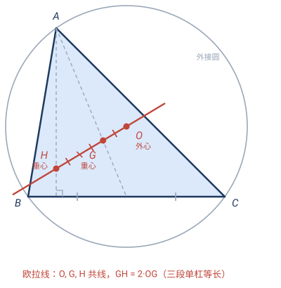
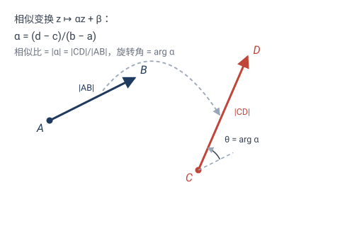
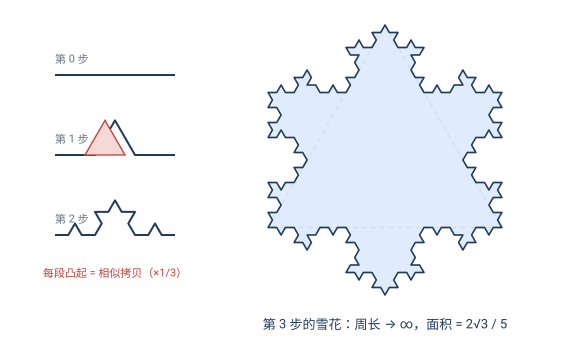
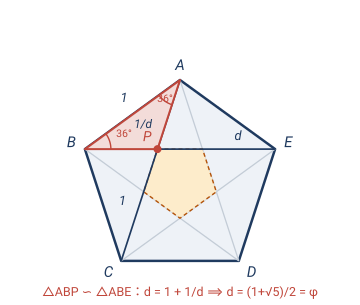
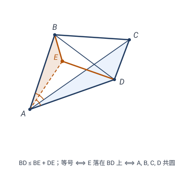

# 第 3 章 · 经典习题：相似变换的应用

> 这一节的题都用第 3 章的某个结论——**复数形式 $z\mapsto az+b$、位似、螺旋相似的不动点与"手拉手"、自相似**——来漂亮解题。不用这些工具，要么要解方程组，要么要繁琐的辅助线。

> 📌 每道题标了它依赖的章节。

---

## 题 1 · 欧拉线定理（3.2 位似）

> 🔖 **用到**：3.2 节位似——以定点为中心、按比例放缩。

$\triangle ABC$ 中，$O$ 是外心、$G$ 是重心、$H$ 是垂心。证明：$O,G,H$ 三点共线（**欧拉线**），且 $GH=2\,OG$。

> 💡 **关键**：硬证要算三点的坐标再验证共线，繁。但用一个**位似**，共线和比例**同时**掉出来。

**解**：取**以重心 $G$ 为中心、比 $-1/2$ 的位似** $\mathcal{H}$（"$-1/2$"表示反向放缩到一半）。

- 因为 $G$ 把每条中线分成 $2:1$（$AG:GD=2:1$，$D$ 为 $BC$ 中点），所以 $\mathcal{H}$ 恰把顶点 $A,B,C$ 分别映到对边中点 $D,E,F$：即 $\mathcal{H}$ 把 $\triangle ABC$ 映成它的**中点三角形** $\triangle DEF$。
- 位似把外接圆映成外接圆，所以 $\mathcal{H}$ 把 $\triangle ABC$ 的外心 $O$ 映成 $\triangle DEF$ 的外心。
- 而 $\triangle DEF$ 的外接圆正是**九点圆**，其圆心 $N$ 是 $OH$ 的中点（九点圆的性质）。

故 $\mathcal{H}(O)=N$。由位似的性质，$O,G,N$ 共线；再因 $N$ 是 $OH$ 中点（$N$ 在直线 $OH$ 上），三条线 $OG$、$ON$、$OH$ 重合——故 $O,G,H$ 共线。比例上 $\mathcal{H}$ 是比 $-1/2$，给出 $GN=\tfrac12\,OG$，结合 $ON=\tfrac12\,OH$ 可解出 $GH=2\,OG$。$\square$

> ✏️ **点睛**：一个位似，同时把"三点共线"和"精确比例 $2:1$"两件事一次说清。这是位似的招牌威力——**它把"分散的三个特殊点"用同一个放缩中心串起来**。

---

## 题 2 · 把线段 $AB$ 映到 $CD$（3.5 复数形式）

> 🔖 **用到**：3.5 节相似变换的复数形式 $z\mapsto az+b$。

给定两条线段 $AB$ 和 $CD$，求一个**正向相似变换**把 $A\to C$、$B\to D$，并读出它的相似比与旋转角。

> 💡 **关键**：正向相似就一行 $z\mapsto az+b$，两个参数 $a,b$。把 $A\to C$、$B\to D$ 两个条件代进去，直接解出。

**解**：把 $A,B,C,D$ 当作复数 $a,b,c,d$（这里 $a,b$ 是点的复坐标，注意别和参数 $a$ 混——下面参数改记 $\alpha,\beta$）。设变换 $z\mapsto \alpha z+\beta$。

- $A\to C$：$\alpha\,a+\beta=c$；
- $B\to D$：$\alpha\,b+\beta=d$。

两式相减：$\alpha(b-a)=d-c$，故
$$\boxed{\;\alpha=\frac{d-c}{b-a},\qquad \beta=c-\alpha\,a.\;}$$

读几何意义：
- **相似比** $=|\alpha|=\dfrac{|CD|}{|AB|}$（两线段长之比）；
- **旋转角** $=\arg\alpha$（从向量 $\overrightarrow{AB}$ 到 $\overrightarrow{CD}$ 的转角）。

> ✏️ **点睛**：两个对应点就把一个正向相似**完全钉死**（等距要两个、相似也只要两个，因为"放缩比"和"长度"一起被 $|\alpha|$ 吃掉）。不学复数形式，要解四元线性方程组；现在一行除法。这也是计算机图形学里"把一个图形贴到任意位置/方向/大小"的标准算法。（这个唯一存在的变换，其**旋转放缩中心**的几何作图——两圆交点——见主文 3.8 节。）

---

## 题 3 · 螺旋相似的不动点（3.7 分类定理）

> 🔖 **用到**：3.7 节——$k\ne1$ 的正向相似是**螺旋相似**，有唯一不动点 $z_0=\dfrac{b}{1-a}$。

变换 $z\mapsto 2iz+3-2i$。(a) 它是什么变换？(b) 求它的旋转放缩中心（不动点）。

> 💡 **关键**：3.7 说 $|a|\ne1$ 的正向相似有唯一不动点，直接解 $z=az+b$。

**解**：
(a) $a=2i$，$|a|=2\ne1$，$\arg a=90°$。由 3.7，这是**螺旋相似**——绕某点转 $90°$ 同时放缩 $2$ 倍。

(b) 不动点 $z_0=\dfrac{b}{1-a}=\dfrac{3-2i}{1-2i}=\dfrac{(3-2i)(1+2i)}{5}=\dfrac{7+4i}{5}=1.4+0.8i$。

即旋转放缩中心是 $(1.4,\,0.8)$。$\square$

> ✏️ **点睛**：3.7 的不动点公式把"绕哪个点、同时缩放"一次解出。这类"边转边缩"的变换在分形（如螺旋自相似图形）和机械传动里到处都是。

---

## 题 4 · Koch 雪花的面积（3.10 自相似）

> 🔖 **用到**：3.10 节自相似——图形由自己的若干相似拷贝拼成。

Koch 雪花从边长为 $1$ 的正三角形开始，每一步把每条边的中间 $1/3$ 替换成向外凸起的等边三角形的两条边（如此无穷步）。证明：它的**周长趋于无穷，但面积有限**，并求出面积。

> 💡 **关键**：每一步新增的小三角形，都是**整体的相似拷贝**（相似比 $1/3^n$）。用自相似把"无穷多个小三角形面积"加成一个几何级数。

**解**：初始正三角形面积 $A_0=\dfrac{\sqrt3}{4}$。

- **周长**：每步每段长乘 $\tfrac43$（$1$ 段变 $4$ 段，每段 $\tfrac13$），$n$ 步后周长 $=3\cdot(\tfrac43)^n\to\infty$。
- **面积**：第 $n$ 步（$n\ge1$）新增 $3\cdot 4^{\,n-1}$ 个小三角形，每个边长 $(1/3)^n$、面积 $\dfrac{\sqrt3}{4}\cdot\dfrac{1}{9^n}$。新增面积合计为一个**几何级数**：
$$\Delta A=\sum_{n=1}^{\infty}3\cdot 4^{\,n-1}\cdot\frac{\sqrt3}{4}\cdot\frac{1}{9^n}
=\frac{3\sqrt3}{4}\sum_{n=1}^{\infty}\frac{4^{\,n-1}}{9^n}
=\frac{3\sqrt3}{4}\cdot\frac{1/9}{1-4/9}
=\frac{3\sqrt3}{4}\cdot\frac{1}{5}
=\frac{3\sqrt3}{20}.$$

总面积
$$A=A_0+\Delta A=\frac{\sqrt3}{4}+\frac{3\sqrt3}{20}=\frac{5\sqrt3+3\sqrt3}{20}=\boxed{\;\frac{2\sqrt3}{5}\;}.$$

> ✏️ **点睛**：周长 $\infty$、面积 $\dfrac{2\sqrt3}{5}\approx0.69$——"无限长的边界围有限的面积"，这是分形的招牌奇观。关键工具就是**自相似**：每一级新增的小三角形是上一级的相似拷贝，相似比 $1/3$ 让面积以 $4/9<1$ 的比例衰减，几何级数收敛。

---

## 题 5 · 正五边形的黄金比（3.4 相似不变量）

> 🔖 **用到**：3.4 节——相似变换保长度比，自相似给出比例方程。

正五边形边长为 $1$。证明：它的对角线长 $d=\dfrac{1+\sqrt5}{2}$（黄金比 $\varphi$）。

> 💡 **关键**：正五边形的对角线相交，会截出一个**内部的更小正五边形**——整体与局部**自相似**，相似关系直接给出关于 $d$ 的方程。

**解**：设正五边形 $ABCDE$，边长 $1$，对角线长 $d$。对角线 $AC$ 与 $BE$ 交于 $P$。

**第一步：算 $AP$。** $\triangle ABC$ 等腰（$AB=BC=1$），$\angle ABC=108°$，故 $\angle BAC=36°$。$\triangle ABE$ 等腰（$AB=AE=1$），$\angle BAE=108°$，故 $\angle ABE=36°$。在 $\triangle ABP$ 中：$\angle BAP=36°$、$\angle ABP=36°$，故 $\angle APB=108°$。它的三角 $(36°,36°,108°)$ 与 $\triangle ABE$ 的 $(\angle ABE,\angle AEB,\angle BAE)=(36°,36°,108°)$ 相同，所以 $\triangle ABP\sim\triangle ABE$。对应边 $AB\leftrightarrow BE$ 即 $1\leftrightarrow d$，相似比为 $d$；再看 $AP\leftrightarrow AB$（即 $1$），故 $AP\cdot d=1$，即 $AP=\dfrac{1}{d}$。

**第二步：算 $PC$。** 在 $\triangle BCP$ 中：$\angle PBC=\angle ABC-\angle ABP=108°-36°=72°$，$\angle BCP=\angle BCA=36°$，故 $\angle BPC=72°$。$\angle PBC=\angle BPC$，故 $\triangle BCP$ 等腰，$PC=BC=1$。

**第三步：合成方程。** $AC=AP+PC$，即 $d=\dfrac{1}{d}+1$，化简
$$d^2-d-1=0\;\Longrightarrow\;d=\frac{1+\sqrt5}{2}=\varphi.\quad\square$$

> ✏️ **点睛**：黄金比 $\varphi\approx1.618$ 之所以"美"，根源就在正五边形的**自相似**——对角线在内部再造出一个缩小的小五边形，相似比就是 $\varphi$。这也是正五角星、向日葵花盘螺旋、帕特农神庙立面里反复出现 $\varphi$ 的几何原因。

---

## 题 6 · 托勒密不等式（3.8 手拉手）

> 🔖 **用到**：3.8 节——螺旋相似的"手拉手"定理：一对相似 ⟹ 另一对相似。

证明**托勒密不等式**：对任意四边形 $ABCD$，
$$AC\cdot BD\le AB\cdot CD+AD\cdot BC,$$
且等号成立 ⟺ $A,B,C,D$ **共圆**（此时的等式即**托勒密定理**：圆内接四边形对角线之积 = 对边之积之和）。

> 💡 **关键**：硬导要反复凑比例式。用螺旋相似：造一个点 $E$ 使 $\triangle ACD\sim\triangle ABE$（第一对，**构造**），"手拉手"再免费送出 $\triangle ACB\sim\triangle ADE$（第二对，**白捡**）——两条新线段 $BE,DE$ 恰好把不等式两边拼成一条折线 $B\!-\!E\!-\!D$。

**证**：设 $\sigma$ 是绕 $A$ 把 $C\mapsto B$ 的螺旋相似（转角 $\angle CAB$、相似比 $\dfrac{AB}{AC}$），记 $E=\sigma(D)$。

- **第一对相似**：$\sigma$ 把 $A\mapsto A$、$C\mapsto B$、$D\mapsto E$，故 $\triangle ACD\sim\triangle ABE$，相似比 $\dfrac{AB}{AC}$。对应边 $CD\leftrightarrow BE$：
$$BE=CD\cdot\frac{AB}{AC}.$$
- **第二对相似（手拉手，3.8）**：同一 $\sigma$ 把 $C\mapsto B$、$D\mapsto E$，故 $\triangle ACB\sim\triangle ADE$ 自动成立。对应边 $CB\leftrightarrow DE$，相似比 $\dfrac{AD}{AC}$（由第一对知 $\dfrac{AE}{AD}=\dfrac{AB}{AC}$，与 $\dfrac{AD}{AC}=\dfrac{AE}{AB}$ 一致）：
$$DE=CB\cdot\frac{AD}{AC}.$$
- **三角不等式**：$BD\le BE+DE$，代入上两式、同乘 $AC$：
$$AC\cdot BD\le AB\cdot CD+AD\cdot BC.\quad\square$$

**等号情形**：$BD=BE+DE$ ⟺ $E$ 落在线段 $BD$ 上 ⟺ $\angle ABE=\angle ABD$。而第一对相似给出 $\angle ABE=\angle ACD$，故等号 ⟺ $\angle ABD=\angle ACD$ ⟺ $A,B,C,D$ 共圆（同弦 $AD$ 张等角）。$\square$

> ✏️ **点睛**：整个证明只有三步——造一个螺旋相似、用一次手拉手、加一次三角不等式。第一对相似是**构造**（人为作 $E$），第二对是**白捡**的（3.8 的定理）：这就是"相似成对出现"的威力。第 6 章会用**反演**给托勒密完全不同的一证——把圆翻成直线，乘积式自动变线段加法（见 [06 · 习题 2](06-反演变换-习题.md)）。同一定理，两种变换各显神通。

---

## 🧠 回顾

| 题 | 用到的第 3 章结论 | 它替你省掉了什么 |
|---|---|---|
| 1 欧拉线 | 3.2 位似 | 算三点坐标验证共线 |
| 2 映 $AB\to CD$ | 3.5 复数形式 | 解四元方程组 |
| 3 螺旋不动点 | 3.7 分类 + 不动点公式 | 画图试探、迭代求解 |
| 4 Koch 面积 | 3.10 自相似 | 逐个加无穷多个三角形 |
| 5 黄金比 | 3.4 不变量 + 自相似 | 繁琐的角度推导 |
| 6 托勒密 | 3.8 手拉手 + 三角不等式 | 反复凑比例辅助线 |

主线还是那个套路：**相似变换（复数形式、位似、螺旋相似、手拉手）把"分散的几何关系"浓缩成一个参数、一个不动点、一对相似三角形、一个比例方程**。第 2 章用反射/旋转拼线段，第 3 章用相似/位似把"大小+位置+方向"一次对齐。

---

> 📚 返回 [第 3 章 · 相似变换](03-相似变换.md) ｜ [目录](README.md)
