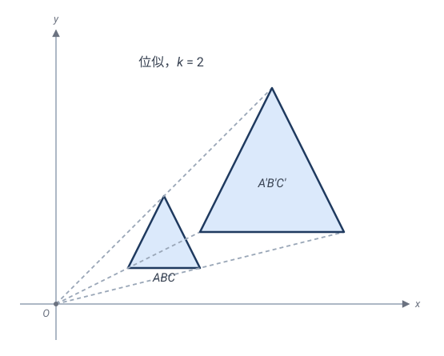
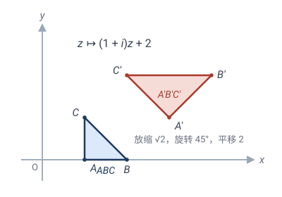
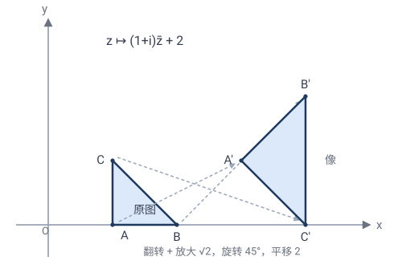
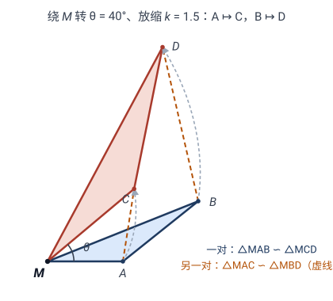

# 第 3 章 · 相似变换：允许放缩，保住形状

上一章的等距变换坚持"保距"——硬纸板不能变形。现在我们**放松第一道约束**：允许整体放大缩小，但不允许"只拉一个方向"。这就是**相似变换**。

> 一句话：**相似 = 等距 + 放缩**。它丢了"大小"，保住"形状"。

> 💡 **本章与第 2 章完全平行**——同一套架构，只把"距离"换成"距离之比"：
> - **几何主线**：第 2 章靠**反射生成定理**（任何等距 $\le 3$ 个反射，2.3），本章靠**相似生成定理**——任何相似 = **一个位似 + 至多三个反射**（3.3）；
> - **代数主线**：第 2 章从"保距"推出 $z\mapsto e^{i\theta}z+c$（2.7），本章从"距离同乘 $k$"推出 $z\mapsto az+b$（3.5）——而且只需**一步归约**：除以 $k$ 就掉回等距；
> - **绝妙示例**：第 2 章有拿破仑定理，本章有**螺旋相似中心与"手拉手"定理**（3.8），以及习题里两步证出的**托勒密不等式**。

---

## 3.1 什么是相似变换

把硬纸板换成一张**能均匀拉伸的橡胶膜**——你可以整体放大缩小，但每个方向按同一比例。

> 🎯 **定义**：变换 $\mathbf{T}$ 是**相似变换**（similarity），如果存在常数 $k>0$（**相似比**），使得
> $$d(\mathbf{T}(P),\mathbf{T}(Q)) = k\cdot d(P,Q) \quad \text{对任意 } P,Q.$$
> $k=1$ 时就是等距；$k\ne 1$ 时是真正的"放缩"。

> 💡 "所有距离同乘 $k$"这个条件**极强**——它不只要求"变大"，而是**每个方向均匀变大**。如果横拉 2 倍、纵不动（不同方向不同比例），那就不是相似，而是下一章的**仿射**了。

和等距一样，相似也分**手性**（定向）：**正相似**保持手性（不翻面），**反相似**翻转手性（含奇数次反射）。这条线索会和第 2 章完全平行地贯穿全章（复数形式 3.5、分类 3.7）。

### 相似比、面积比、体积比

距离乘 $k$，立刻推出：

- **长度** $\times k$；
- **面积** $\times k^2$（二维：长、宽各乘 $k$）；
- **体积** $\times k^3$（三维）。

> ✏️ **手算**：把一张 1:1 图纸按相似比 $k=5$ 放大。边长变 5 倍，面积变 $25$ 倍。原图是个边长 $2$ 的正方形（面积 $4$），放大后边长 $10$、面积 $100=25\times 4$ ✓。

---

## 3.2 位似：最纯粹的相似

第 2 章有三种基本等距（平移、旋转、反射）当"砖"。本章放松了一个自由度——**大小**——所以需要添一块新砖：**位似**。

固定一点 $O$（**位似中心**），把每个点沿射线 $OP$ 放缩 $k$ 倍：$\mathbf{H}_{O,k}(P)$ 在射线 $OP$ 上，且 $\dfrac{O\mathbf{H}(P)}{OP}=k$。这叫**位似变换**（homothety）。它是相似里"不旋转、不平移，只放缩"的纯净版本。取 $O$ 为原点，复数形式就一行：

$$z\mapsto kz\qquad(k>0).$$

位似的几条看家性质（都从上式一眼读出）：

- **把直线映成平行直线**（方向不变，只放大）；
- **把圆映成圆**（圆心同样放缩，半径乘 $k$）；
- **中心 $O$ 是不动点**——位似是"有心的放缩"；
- **保角且保持手性**（不旋转、不翻面）。

> ✏️ **手算**：以原点为中心、$k=2$ 的位似：$(1,2)\mapsto(2,4)$；单位圆 $x^2+y^2=1$ 映成 $x^2+y^2=4$（圆心不变、半径乘 2）✓。

> 💡 **约定 $k>0$。** "负位似"（$k<0$，放大同时掉头）= 正位似 + 绕 $O$ 转 $180°$——旋转那部分归给等距，所以本章只说 $k>0$ 的位似。

### 位似成群吗？——和反射一样的微妙答案

- **绕同一点 $O$ 的位似**全体：成群 ✓——比相乘 $k_1k_2$、逆是 $1/k$，与正实数乘法群 $\mathbb{R}^{+}$ 同构。
- **不同中心的两个位似**复合：用复数一行看穿。取 $O_1$ 为原点，$O_2=o_2$：
$$z\overset{\mathbf{H}_{O_1,k_1}}{\longmapsto}k_1 z\overset{\mathbf{H}_{O_2,k_2}}{\longmapsto}k_2(k_1z-o_2)+o_2=k_1k_2\,z+(1-k_2)o_2.$$
$k_1k_2\ne1$：有不动点（$\frac{(1-k_2)o_2}{1-k_1k_2}$，在直线 $O_1O_2$ 上），仍是**位似**；$k_1k_2=1$：退化成**平移**，掉出位似这一类！

> 💡 这一幕在第 2 章见过：**反射不成群，却生成整个 $E(2)$**。位似也一样——单独不成群，但它和反射合在一起，恰好生成所有相似变换。这就是下一节的生成定理。

---

## 3.3 ⭐ 相似生成定理：位似 + 等距生成一切

现在来本章的几何主线，与 2.3 完全平行。

> **定理（相似生成定理）**：平面上的**任何**相似变换，都可以写成**至多一个位似**与**至多三个反射**的复合：
> $$\mathbf{T}=\mathbf{U}\circ\mathbf{H},$$
> 其中 $\mathbf{H}$ 是比 $k$ 的位似，$\mathbf{U}$ 是等距（由 2.3，$\le 3$ 个反射）。

换句话说——**反射管"位置、方向、手性"，位似管"大小"，这两类原子就够造出一切相似。** 证明手法也和 2.3 相同：先证"三点钉死"，再构造对齐。

> **引理（相似被不共线三点唯一决定）**：若两个相似 $\mathbf{T},\mathbf{U}$ 在不共线三点 $A,B,C$ 上取值相同，则 $\mathbf{T}=\mathbf{U}$。
>
> *证*：相似比先被两点钉死——$k=\dfrac{d(\mathbf{T}(A),\mathbf{T}(B))}{d(A,B)}$，两个相似给出同一个 $k$。于是 $\frac{1}{k}\mathbf{T}$ 与 $\frac{1}{k}\mathbf{U}$ 都是**等距**（距离同除以 $k$ 后保距），且在 $A,B,C$ 上取值相同；由 2.3 的引理（等距被不共线三点决定），$\frac{1}{k}\mathbf{T}=\frac{1}{k}\mathbf{U}$，即 $\mathbf{T}=\mathbf{U}$。$\square$

**主定理的构造证明**：给定相似 $\mathbf{T}$（比 $k$）和不共线三点 $A,B,C$，记 $A'=\mathbf{T}(A)$ 等。分两步对齐：

- **第 1 步（对齐大小）**：任取一点 $O$，作位似 $\mathbf{H}=\mathbf{H}_{O,k}$。它把 $\triangle ABC$ 映成 $\triangle A_1B_1C_1$，三边都是原来的 $k$ 倍；而 $\triangle A'B'C'$ 的三边也是 $\triangle ABC$ 的 $k$ 倍（$\mathbf{T}$ 是比 $k$ 的相似）。所以两三角形三边对应相等——由 SSS（2.8），$\triangle A_1B_1C_1\cong\triangle A'B'C'$。
- **第 2 步（对齐位置与方向）**：全等 ⟹ 存在等距 $\mathbf{U}$ 把 $\triangle A_1B_1C_1$ 映成 $\triangle A'B'C'$；由 2.3 的反射生成定理，$\mathbf{U}$ 是至多三个反射的复合。

于是 $\mathbf{U}\circ\mathbf{H}$ 把 $A,B,C$ 分别送到 $A',B',C'$，与 $\mathbf{T}$ 在三点上取值相同。由引理，$\mathbf{T}=\mathbf{U}\circ\mathbf{H}$——**至多 1 个位似 + 至多 3 个反射**。$\square$

> 💡 这个证明的读法：**先任意位似把大小对齐，剩下的必然是等距**——因为大小对齐之后，距离已经不变了。所以"研究相似"自动分解成"研究位似（一行 $z\mapsto kz$）+ 研究等距（第 2 章已完工）"。

> 💡 **与 2.3 的对照**：
> 1. 等距的原子是**反射**；相似的原子是**反射 + 位似**——只多一块砖，多管一件事（大小）。
> 2. 它同样是构造性的：镜面取中垂线（2.3），位似中心可任选。
> 3. 3D 直接推广：任何空间相似 = 至多 1 个位似 + 至多 4 个反射。

---

## 3.4 相似变换的不变量

| 不变量 | 在相似变换下 |
|---|---|
| **长度比** $\dfrac{AB}{CD}$ | ✓ 保持（定义 · 源不变量） |
| **角度** | ✓ 保持（余弦定理） |
| **直线**（共线、顺序） | ✓ 保持（距离可加性） |
| **面积比** | ✓ 保持（都被同乘 $k^2$） |
| 平行、垂直 | ✓ 保持（保直线 + 保角） |
| 绝对长度 | ✗ 丢失（被 $k$ 缩放） |
| 绝对面积 | ✗ 丢失（被 $k^2$ 缩放） |

和 2.4 一样，派生不变量从源不变量逐一证出：

> **命题（相似保直线）**：相似把直线映成直线，且保持线上点的顺序。
>
> *证*：共线 ⟺ 距离可加：$Q$ 落在 $P,R$ 之间 ⟺ $d(P,R)=d(P,Q)+d(Q,R)$。等式两边同乘 $k$ 仍是等式，故像点保持共线与顺序。$\square$

> **命题（相似保角）**：相似变换保持角的大小。
>
> *证*：$\triangle ABC$ 的三边被同乘 $k$，余弦定理
> $$\cos\angle A = \frac{|AB|^2+|AC|^2-|BC|^2}{2|AB|\cdot|AC|}$$
> 的分子分母同乘 $k^2$，比值不变，故 $\cos\angle A=\cos\angle A'$，$\angle A=\angle A'$。$\square$

**关键洞察**：相似变换丢失了"**大小**"，但保留了"**形状**"。

> 💡 "**形状**"的数学精确含义：**两个图形同形 ⟺ 存在一个相似变换把它们互变**。日常说"这两个三角形形状一样"，就是存在相似变换连接它们。

> 🤔 **想一想（精髓）**：注意**源不变量悄悄换了**——等距的源不变量是"距离"本身；相似的源不变量是"**距离之比**"（任意两段长度的比例）。角、共线、平行、形状全由"距离比"派生（余弦定理里 $k$ 约掉了，可加性里 $k$ 提走了）。
>
> 这是爱尔兰根纲领的第二课：**变换群放大一级（$E(2)\subset\mathrm{Sim}(2)$），不变量就丢掉一层**（绝对长度、绝对面积没了，比值还在）。第 4 章仿射、第 5 章射影会把这个规律一路推到底。

---

## 3.5 ⭐ 相似的复数形式

现在走代数主线。目标：从定义 $d(\mathbf{T}(P),\mathbf{T}(Q))=k\,d(P,Q)$ 推出相似的通用复数形式。2.7 为等距干了这件事，花了真功夫（保距 + 固定原点 ⟹ 实线性；追踪 $1$ 和 $i$ 的像）。本章**不必重推**——有一步绝妙的归约：

**除以 $k$，掉回等距。** 设 $\mathbf{T}$ 是比 $k$ 的相似，令
$$\mathbf{U}(z):=\frac{\mathbf{T}(z)}{k}.$$
则对任意 $z,w$：
$$|\mathbf{U}(z)-\mathbf{U}(w)|=\frac{1}{k}\,|\mathbf{T}(z)-\mathbf{T}(w)|=\frac{1}{k}\cdot k\,|z-w|=|z-w|,$$
即 $\mathbf{U}$ **保距**，是等距！由 2.7，$\mathbf{U}(z)=e^{i\theta}z+c$（正向）或 $\mathbf{U}(z)=e^{i\theta}\bar z+c$（反向）。乘回 $k$，并记 $a=ke^{i\theta}$（故 $|a|=k$）、$b=kc$：

$$\boxed{\;\mathbf{T}(z)=az+b\;\;(\text{正相似})\quad\text{或}\quad \mathbf{T}(z)=a\bar z+b\;\;(\text{反相似}),\qquad a,b\in\mathbb{C},\;a\ne0,\;|a|=k.\;}$$

- $|a|$ 是**相似比**（放缩倍数）；
- $\arg a$（$a$ 的幅角）是**旋转角**；
- $b$ 是**平移**。

"**乘一个复数 + 加一个复数**" = 旋转 + 放缩 + 平移，一气呵成。这正是"相似 = 等距（旋转 + 平移）+ 放缩（$|a|$）"的复数表达。

> 💡 **精髓**：2.7 的全部硬功夫原样继承——**常数 $k$ 从复数乘法里穿过去**，什么论证都不用改。这正兑现了 2.7 末尾的预告："把 $|a|=1$ 全换成一般 $|a|=k$"。两章的复数形式是**同一推导**的两个读数。手性也一样：正相似 $az+b$ 保手性、反相似 $a\bar z+b$ 翻手性——乘正实数 $k$ 不改变行列式的符号。

> ✏️ **手算**：$z\mapsto 2iz$。$|2i|=2$（放大 2 倍），$\arg(2i)=90°$（转 $90°$）。它把 $(1,0)$（即 $z=1$）送到 $2i=(0,2)$：放大 2 倍、转 $90°$。✓

**不动点（预告分类定理）**：解 $\mathbf{T}(z)=z$。

- **正向** $az+b=z$ 给出 $(1-a)z=b$：
  - $a\ne1$（即 $k\ne1$ 或 $\theta\ne0$）：**唯一**不动点 $z_0=\dfrac{b}{1-a}$；
  - $a=1$（$k=1$ 且 $\theta=0$）：无不动点（$b\ne0$），是**平移**——等距情形，见 2.7。
- **反向** $a\bar z+b=z$：取共轭得 $\bar z=\bar a z+\bar b$，代回原式：
$$z=a(\bar a z+\bar b)+b=|a|^2 z+(a\bar b+b)\quad\Longrightarrow\quad \bigl(1-|a|^2\bigr)z=a\bar b+b.$$
  - $|a|\ne1$（$k\ne1$）：系数非零，**唯一**不动点 $z_0=\dfrac{a\bar b+b}{1-|a|^2}$；
  - $|a|=1$（$k=1$）：方程退化成 $0\cdot z=a\bar b+b$，要靠相容条件 $a\bar b+b=0$ 救场——这正是 2.7 反向等距的讨论（不满足：无不动点，滑动反射；满足：一整条不动直线，反射）。

> 💡 **注意这个对比**：$k=1$ 时反向方程退化（$z$ 的系数是 $0$），不动点要么没有、要么一整条；$k\ne1$ 时系数 $1-|a|^2\ne0$，**自动**有唯一不动点。放缩像一只"引力中心"，把不动点**吸**了出来——这是 3.7 分类定理的关键。

---

## 3.6 相似群

全体相似变换构成一个**群**（用复合运算），叫**相似群** $\mathrm{Sim}(2)$。用 3.5 的复数形式 $\mathbf{T}_{a,b}:z\mapsto az+b$（**正向**相似，$a\ne 0$）来写，群的运算——**复合**与**逆**——有完全显式的公式：

- **复合**（群的"乘法"，先做 $\mathbf{T}_{a_2,b_2}$、再做 $\mathbf{T}_{a_1,b_1}$）：
$$\mathbf{T}_{a_1,b_1}\circ\mathbf{T}_{a_2,b_2}:\; z\mapsto a_1(a_2 z+b_2)+b_1=(a_1 a_2)\,z+(a_1 b_2+b_1),$$
即复合的参数为 $a=a_1 a_2$、$b=a_1 b_2+b_1$。读出几何意义：**相似比相乘**（$|a|=|a_1||a_2|=k_1 k_2$）、**转角相加**（$\arg a=\arg a_1+\arg a_2$）。所以"先放缩 $2$ 倍转 $30°$、再放缩 $3$ 倍转 $20°$" $=$ "一次放缩 $6$ 倍转 $50°$"——多次操作可合并成一次，这正是封闭性的内容（$a_1 a_2\ne 0$，结果仍是相似）。
- **逆**：解 $w=az+b$ 得 $z$，
$$\mathbf{T}_{a,b}^{-1}:\; z\mapsto \tfrac{1}{a}(z-b)=\tfrac{1}{a}z-\tfrac{b}{a},\qquad\text{即 }a'=\tfrac{1}{a},\ b'=-\tfrac{b}{a},$$
相似比从 $|a|$ 变成 $1/|a|$（放缩 $k$ 的逆是放缩 $1/k$）✓。
- **单位**：$\mathbf{T}_{1,0}:z\mapsto z$（比 $1$、不转、不平移）。

四条公理由此逐条成立（封闭：$a_1a_2\ne0$ ✓；结合律：复数乘法/加法天然结合；单位、逆：如上）。

### 子群与层级

- **等距群** $E(2)\subset\mathrm{Sim}(2)$：$k=1$（即 $|a|=1$）的那些。两个 $k=1$ 复合还是 $k=1$（比相乘），逆也是 $k=1$（$1/1=1$），故封闭，是子群。
- **正相似群** $\mathrm{Sim}^{+}(2)$：只含 $z\mapsto az+b$（不翻面）。反相似 = 任一固定反射 × 正相似，单独不成群（两个反相似复合是正的）。
- **绕同一点 $O$ 的位似群** $\cong\mathbb{R}^{+}$：比相乘（3.2），是 $\mathrm{Sim}^{+}(2)$ 的子群。

层级（对照 2.5 的 $\mathrm{SO}(2)\subset E^{+}(2)\subset E(2)$）：
$$E(2)\;\subset\;\mathrm{Sim}(2),\qquad E^{+}(2)\;\subset\;\mathrm{Sim}^{+}(2)\;\subset\;\mathrm{Sim}(2).$$

> 💡 **"是群"为什么重要**：它意味着"先放缩 2 倍、再放缩 3 倍"等价于"一次放缩 6 倍"——多次放缩可以合并。这种"可合并"正是群结构的威力。第 7 章爱尔兰根纲领会把它变成：**相似几何 = 研究 $\mathrm{Sim}(2)$ 的不变量**（角、长度比——见 3.4）。

---

## 3.7 ⭐ 相似的分类定理

等距按"最少反射数"分成五类（2.6）。相似的分类**更简洁**——只看相似比 $k$ 和正反向，因为 3.5 的不动点分析已经把活儿干完了。

**$k=1$**：就是等距，退化为 2.6 的五类（恒等 / 反射 / 旋转 / 平移 / 滑动反射）。

**$k\ne 1$（真正放缩）**：只剩两类，**都有唯一不动点**——

|  | 复数形式 | 类型 | 不动点 |
|---|---|---|---|
| 正向 | $z\mapsto az+b$，$\|a\|\ne1$ | **螺旋相似**（旋转位似） | 唯一：$z_0=\dfrac{b}{1-a}$ |
| 反向 | $z\mapsto a\bar z+b$，$\|a\|\ne1$ | **反射位似** | 唯一：$z_0=\dfrac{a\bar b+b}{1-\|a\|^2}$ |

- **螺旋相似**：绕不动点 $z_0$ 改写（$w=z-z_0$）：
$$\mathbf{T}(z)-z_0=az+b-z_0=a(z-z_0)\qquad(\text{用了 }az_0+b=z_0),$$
即"绕 $z_0$ 转 $\arg a$、以 $z_0$ 为心放缩 $|a|$"。只放缩不转（$\arg a=0$）就是纯**位似**；只转不放缩（$|a|=1$）则退化成纯旋转。
- **反射位似**：同样绕 $z_0$ 改写：
$$\mathbf{T}(z)-z_0=a\,\overline{(z-z_0)}=k\,e^{i\theta}\bar w,$$
而 $e^{i\theta}\bar w$ 是关于**方向角 $\theta/2$ 的直线**的反射（2.7 已验），所以这是"关于过 $z_0$、方向 $\theta/2$ 的轴反射 + 以 $z_0$ 为心放缩 $k$"。

> 💡 **为什么 $k\ne 1$ 只有这两类？** 看 3.5 的不动点方程：正向是 $(1-a)z=b$、反向是 $(1-|a|^2)z=a\bar b+b$——$k\ne1$ 时系数**必然非零**，方程必然有唯一解。等距里"平移、滑动反射"这类**无不动点**的运动，在真正放缩时根本不存在：平移再放缩 $z\mapsto kz+b$（$k\ne1$）总解得出不动点 $z_0=b/(1-k)$，它不再是平移，而是绕 $z_0$ 的位似。**放缩把无不动点的运动全吸成了有心的。**

> 💡 **精髓**：等距的分类靠"数反射个数"（2.6），相似的分类靠"**解不动点方程**"——$k=1$ / $k\ne1$ 正对应方程退化 / 不退化。复数形式再一次自己吐出了几何分类。

---

## 3.8 ⭐ 绝妙示例：螺旋相似中心与"手拉手"

第 2 章的拿破仑定理展示了"旋转 = 乘 $\omega$"的代数威力。本章的招牌是**螺旋相似中心**——它把"两条线段的对应"浓缩成一点处的一对相似三角形，是竞赛几何里出现频率最高的变换工具。

**问题**：给定两条线段 $AB$ 与 $CD$（不等长或不平行），是否存在正向相似把 $A\mapsto C$、$B\mapsto D$？唯一吗？它的旋转放缩中心在哪？

**代数答案（一行）**：设 $z\mapsto \alpha z+\beta$。两个条件 $\alpha a+\beta=c$、$\alpha b+\beta=d$ 相减：
$$\alpha=\frac{d-c}{b-a},\qquad \beta=c-\alpha a.$$
**存在且唯一**（详见 [习题 2](03-相似变换-习题.md)）。$|\alpha|\ne1$ 时，由 3.7 它是螺旋相似，中心 $M$ 是它的不动点。

**几何答案（尺规可作）**：中心 $M$ 在哪？

- 因为 $M\mapsto M$、$A\mapsto C$、$B\mapsto D$，所以 $\triangle MAB$ 整个被映成 $\triangle MCD$：
$$\triangle MAB\sim\triangle MCD\quad(\text{直接相似}).$$
- 设直线 $AB$ 与 $CD$ 交于 $X$。转角 $\angle AMC=\arg\alpha$ 正是"直线 $AB$ 转到直线 $CD$ 的角" $=\angle AXC$。$M$ 对弦 $AC$ 张的角等于 $X$ 对弦 $AC$ 张的角，故 **$M$ 在过 $X,A,C$ 的圆上**（同弦等角）。同理，**$M$ 在过 $X,B,D$ 的圆上**。
- 两圆已交于 $X$，**另一个交点就是 $M$**。两圆一画，中心到手。$\square$

**手拉手定理（一对相似 ⟹ 另一对相似）**：同一个 $M$ 处，还藏着第二对相似——
$$\triangle MAC\sim\triangle MBD.$$
*证*：考虑绕 $M$ 把 $A\mapsto B$ 的螺旋相似（转角 $\angle AMB$、比 $MB/MA$）。由 $\triangle MAB\sim\triangle MCD$ 得 $\dfrac{MC}{MA}=\dfrac{MD}{MB}$ 且 $\angle AMC=\angle BMD$——同一个转角、同一个比恰好也把 $C\mapsto D$。于是 $A\mapsto B$、$C\mapsto D$、$M\mapsto M$，$\triangle MAC$ 被映成 $\triangle MBD$。$\square$

> ✏️ **经典特例（中考招牌"手拉手模型"）**：共顶点 $A$ 的两个同向等边三角形 $\triangle ABC$、$\triangle AMN$。绕 $A$ 转 $60°$ 把 $B\mapsto C$、$M\mapsto N$（$k=1$ 的螺旋相似），所以线段 $BM$ 的像是 $CN$——**$BM=CN$ 且夹角 $60°$**，一步证完。它的真身就是螺旋相似；把等边三角形换成两个共顶点的**相似**三角形，$k\ne1$，结论变成 $CN=\dfrac{AC}{AB}\,BM$——同一个定理。

> 💡 **平行退化**：若 $AB\parallel CD$，交点 $X$ 跑去无穷远，两圆退化成直线 $AC$ 与 $BD$——它们的交点就是 $M$（此时 $\arg\alpha=0$，$M$ 是纯**位似中心**，即两线段的"内 / 外相似中心"）。特别地，任意两个半径不等的圆之间必有两个位似中心。

> 💡 **为什么它是本章的"拿破仑"**：拿破仑定理把"等边"翻译成代数恒等式；螺旋相似中心把"两线段对应"翻译成 $M$ 点处的**一对相似三角形**——而"手拉手"说这种相似**成对出现**：看见 $\triangle MAB\sim\triangle MCD$，就免费得到 $\triangle MAC\sim\triangle MBD$。[习题 6](03-相似变换-习题.md) 会用它两步证出**托勒密不等式**——那是本章理论最漂亮的一次出手。

---

## 3.9 相似三角形：AAA 判定的变换本质

中学里"相似三角形"判据（AAA、SAS 相似、SSS 相似）用变换一句话说完：

> **两个图形相似 ⟺ 存在一个相似变换把一个映成另一个。**

几条判据都在问：**给多少数据，一个三角形的形状就被定死（大小可任选）？** 而"相似"无非是说——两个三角形能按同一比例 $k$ **缩放着**对应起来（所有距离都乘 $k$，3.1）。AAA 最底层，直接证；其余归约到它。（这与 2.8 全等判据的结构一模一样：那里 SSS 是地基，这里 AAA 是地基——因为源不变量从"距离"换成了"距离之比"。）

### AAA：三角相等 ⟺ 边上距离同比例 ⟺ 相似

三角对应相等 ⟹ 三边成同一比例：正弦定理给出同一三角形内 $|AB|:|BC|:|AC|=\sin\angle C:\sin\angle A:\sin\angle B$，两三角形角相同 ⟺ 三边之比相同 ⟺ 对应边成同一比例 $k$（$|A'B'|=k|AB|$ 等）。

于是**边上任意两点**的距离都按 $k$ 缩放。任取两点 $D,E$：
- 同一条边上：$DE$ 是弧长之差，按 $k$ 缩放得 $D'E'=k\cdot DE$。
- 两条相邻边上：取公共顶点为枢（设为 $A$，$D$ 在 $AB$、$E$ 在 $AC$），由余弦定理
$$DE^2=AD^2+AE^2-2\cdot AD\cdot AE\cos\angle A,$$
而 $A'D'=k\cdot AD$、$A'E'=k\cdot AE$、$\angle A'=\angle A$，故 $D'E'=k\cdot DE$。

边上任意两点的距离都按同一 $k$ 缩放 ⟺ 两三角形相似。$\square$

### SAS、SSS 相似：归约到 AAA

- **SAS 相似**（$\angle A=\angle A'$ 且 $\dfrac{|AB|}{|A'B'|}=\dfrac{|AC|}{|A'C'|}$）：第三边由余弦定理定，且成同一比例；三边成比例 ⟹ 三角相等（余弦定理反推）⟹ 归约到 AAA。
- **SSS 相似**（三边成同一比例 $k$）：余弦定理 $\cos\angle A=\dfrac{|AB|^2+|AC|^2-|BC|^2}{2|AB|\cdot|AC|}$，三边同比 ⟹ $\cos\angle A=\cos\angle A'$ ⟹ $\angle A=\angle A'$，同理三角 ⟹ 归约到 AAA。

> 🤔 **对比"全等"与"相似"**：差别就一个"大小"——
> - **全等**（第 2 章）= 所有距离**不变**（$k=1$）⟺ 大小、形状都同 ⟺ 判据用 SSS（边长定）。
> - **相似**（本章）= 所有距离**同乘 $k$** ⟺ 形状同、大小可异 ⟺ 判据用 AAA（角定形状）。
>
> 全等比相似多约束了"大小"。**约束放松（$k=1$ → $k$ 任意），判据就从"边"换成"角"**——这是变换层级给的一个干净洞察。AAA 之所以是相似的旗舰判据，正因为它直接动用了相似变换最该保的不变量：角。这也正是 2.8 末尾那个悬念（"AAA 为什么不够判全等"）的答案：AAA 本来就是**这一层**的判据。

---

## 3.10 自相似与分形：相似在造"怪东西"

相似变换有个迷人应用：**反复用相似，造出自相似图形（分形）**。

**Koch 雪花**：从一条线段开始，反复"把每段中间 $1/3$ 替换成向外小三角形的两条边"。每一步，图形由**四个相似比 $1/3$ 的小拷贝**拼成——它是**自相似**的（局部放大 3 倍 ≈ 整体）。

> ✏️ **手算 Koch 曲线长度**：每步把每段长度乘 $4/3$（1 段 → 4 段，每段 $1/3$）。初始长 1，$n$ 步后长 $(4/3)^n$。$n\to\infty$ 时长度 $\to\infty$——但它围的面积有限！**无限长的边界围有限的面积**，这是分形的奇观。

**Sierpiński 三角形**：把一个三角形分四份、挖中间那个、对剩下三个重复。每步 = 三个相似比 $1/2$ 的小拷贝。

**曼德博集合**：那个著名的"心形 + 无数小芽"，每个小芽放大后又是整体的相似拷贝。

> 💡 分形几何（Mandelbrot, 1975）的核心正是**自相似**——图形在相似变换下不变。相似不只用于"放大地图"，它是描述自然界（海岸线、云、血管、闪电）粗糙结构的语言。

---

## 3.11 应用：地图、模型、缩放

相似变换无处不在：

- **地图与模型**：1:1000 的地图 = 把现实按 $k=1/1000$ 缩小。形状对（角不变），大小不对。
- **缩放 UI / 字体**：放大字体 = 相似变换，字形不变。
- **黄金比例**：正五边形里到处是黄金比 $\varphi$——它和相似的"不动点"有关（第 8 章对称群会再遇 $D_5$）。

---

## 3.12 本章小结

本章与第 2 章是**同一架构的两次实现**——对照着记：

- **定义**：等距 = 保距；相似 = **距离同乘 $k$**（$k=1$ 即等距）。
- **几何主线（生成定理）**：等距 $\le 3$ 个反射（2.3）；相似 = **至多 1 个位似 + 至多 3 个反射**（3.3）。原子从"反射"扩成"反射 + 位似"。
- **不变量**：等距的源不变量是**距离**；相似的源不变量是**距离之比**——角、共线、形状全由它派生（3.4）。群放大一级，不变量丢一层。
- **代数主线（复数形式）**：等距 $z\mapsto e^{i\theta}z+c$ / $e^{i\theta}\bar z+c$（2.7）；相似 $z\mapsto az+b$ / $a\bar z+b$，$|a|=k$（3.5）——证明只有一步：**除以 $k$ 掉回等距**。
- **群**：$E(2)\subset\mathrm{Sim}(2)$（3.6）；复合 = 比相乘、角相加；逆 = 比取倒数。
- **分类**：等距五类按"最少反射数"（2.6）；相似按"$k=1$ / $k\ne1$ × 正 / 反"（3.7）——$k\ne1$ 只剩**螺旋相似**（正向）与**反射位似**（反向）两类，**都有唯一不动点**（平移、滑动反射被放缩吸收）。
- **绝妙示例**：拿破仑定理（第 2 章）⟷ **螺旋相似中心与手拉手定理**（3.8）：$\triangle MAB\sim\triangle MCD\iff\triangle MAC\sim\triangle MBD$，一对相似免费生另一对；习题 6 用它两步证托勒密不等式。
- **判据**：全等 SSS 是地基（2.8）⟷ 相似 AAA 是地基（3.9）——判据从"边"换成"角"，因为源不变量从"距离"换成了"距离之比"。
- **自相似**造出分形（Koch、Sierpiński、曼德博，3.10）。

下一章我们再放松一步——允许"斜切、单向拉伸"，得到**仿射变换**：保住平行，但丢掉角和圆。

下一章：[04-仿射变换.md](04-仿射变换.md)

---

## 🧩 本章习题

**题 3.1（手算）相似比与旋转角。** 变换 $z\mapsto 3(\cos 30°+i\sin 30°)\,z+5$ 的相似比和旋转角各是多少？
*答*：$a=3(\cos 30°+i\sin 30°)$，$|a|=3$（相似比 3），$\arg a=30°$（转 $30°$）。

**题 3.2（思考）相似 vs 等距。** 两个相似变换复合，相似比是多少？为什么 $E(2)$ 是 $\mathrm{Sim}(2)$ 的子群？
*答*：相似比相乘 $k_1 k_2$。等距 = $k=1$ 的相似，两个 $k=1$ 复合还是 $k=1$，故 $E(2)$ 在 $\mathrm{Sim}(2)$ 中封闭，是子群。

**题 3.3（应用）地图面积。** 1:50000 的地图上某省面积 $120\text{ cm}^2$，实际面积多少？
*答*：相似比 $k=1/50000$，面积比 $k^2=1/(2.5\times10^9)$。实际 $=120\times 2.5\times10^9\text{ cm}^2=3\times10^{11}\text{ cm}^2=30\text{ km}^2$。

**题 3.4（动手）位似作图。** 以 $O$ 为中心、$k=2$ 位似，三角形 $ABC$ 的像在哪？面积变几倍？
*答*：每顶点沿 $OA,OB,OC$ 方向延伸到 $2$ 倍距离处。面积变 $2^2=4$ 倍。

**题 3.5（进阶）分形维数。** Sierpiński 三角形每步 = 三个相似比 $1/2$ 的小拷贝。它的（Hausdorff）维数是多少？
*提示*：自相似维数 $d=\dfrac{\log N}{\log(1/k)}$，$N$ 是拷贝数，$k$ 是相似比。
*答*：$N=3,k=1/2$，$d=\dfrac{\log 3}{\log 2}\approx 1.585$——介于 1 维（线）和 2 维（面）之间，这就是"分形维数"。

---

> 📚 **延伸：相似变换的经典应用题**（欧拉线定理、把线段 $AB$ 映到 $CD$、螺旋相似的不动点、Koch 雪花面积、正五边形黄金比、**托勒密不等式**，共 6 道），见 [03-相似变换-习题.md](03-相似变换-习题.md)。这些题用位似、复数形式、螺旋相似、手拉手等第 3 章结论一两步解决——正是相似变换的威力。
