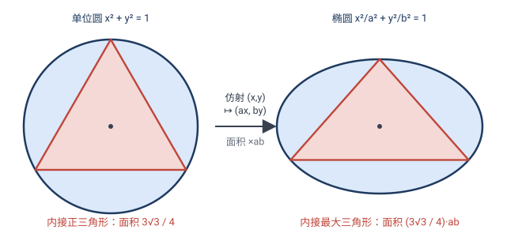
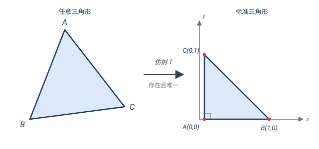
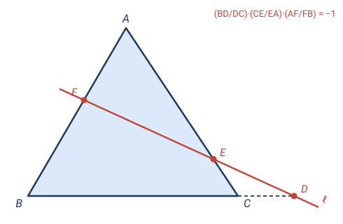
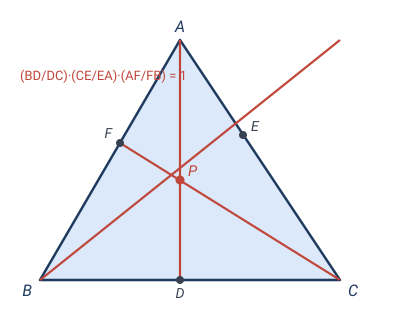
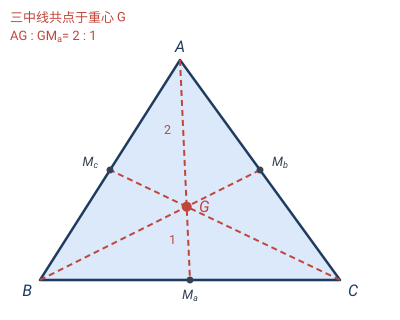
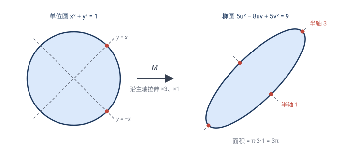

# 第 4 章 · 经典习题：仿射变换的应用

> 仿射变换的招牌威力是**标准化**：把椭圆"还原"成圆、把任意三角形"拉成"标准三角形——只要命题只涉及**共线、平行、比例**，就只需在最简单的情形算一次，再靠"仿射不变量"搬回去。前 5 题全是这个套路；后 2 题（题 6、7）是 4.4、4.5 两节新定理的实战。

> 📌 每道题标了它依赖的章节。

---

## 题 1 · 椭圆内接三角形的最大面积（4.6 椭圆 = 拉伸的圆）

> 🔖 **用到**：4.6 节——椭圆是圆经仿射得到，仿射把"圆的极值"搬给椭圆。

求椭圆 $\dfrac{x^2}{a^2}+\dfrac{y^2}{b^2}=1$ 的**内接三角形**的最大面积。

> 💡 **关键**：椭圆的极值问题直接做要拉格朗日乘数法（大学）。但仿射 $\mathcal{A}:(x,y)\mapsto(x/a,\,y/b)$ 把椭圆变成**单位圆**，问题瞬间归约到圆。

**解**：$\mathcal{A}$ 把椭圆变成单位圆（面积乘 $\tfrac{1}{ab}$），且把"椭圆的内接三角形"一一对应成"圆的内接三角形"，面积同比缩放。

- 单位圆内接三角形面积最大的是**正三角形**，面积 $\dfrac{3\sqrt3}{4}$；
- 仿射保"内接"、保面积比，所以椭圆内接三角形最大面积 $=$ 圆内接最大三角形面积 $\times ab$。

故
$$\boxed{\;S_{\max}=\frac{3\sqrt3}{4}\,ab.\;}$$

> 📐 **补证：单位圆内接三角形面积为何最大是正三角形。** 设三内角 $A,B,C$（$A+B+C=\pi$），外接圆半径 $1$。由正弦定理三边 $a=2\sin A$ 等，面积
> $$S=\tfrac12 ab\sin C=2\sin A\sin B\sin C.$$
> 固定 $C$（即固定 $A+B=\pi-C$），用积化和差
> $$\sin A\sin B=\tfrac12\bigl[\cos(A-B)-\cos(A+B)\bigr]=\tfrac12\bigl[\cos(A-B)+\cos C\bigr]$$
> （末步 $\cos(A+B)=\cos(\pi-C)=-\cos C$）。而 $\cos(A-B)\le 1$，等号 $A=B$，故固定 $C$ 时 $\sin A\sin B$ 在 $A=B$ 处取最大。
>
> **先确认最大值存在**：三个顶点都在圆周（紧集——闭且有界）上、面积关于顶点位置连续，由**极值定理**最大值**取得到**。否则像 $1/x$ 在 $(0,1)$ 上无最大那样，下面的调角法就悬空了。
>
> **调角法**：设面积已取到最大。固定 $C$，由上 $\sin A\sin B$ 在 $A=B$ 处最大；若 $A\ne B$，把 $A,B$ 调成相等（保持 $A+B$ 不变）面积会更大，矛盾。故必须 $A=B$；同理 $B=C$。于是 $A=B=C=60°$，正三角形。此时
> $$S_{\max}=2(\sin 60°)^3=2\Bigl(\tfrac{\sqrt3}{2}\Bigr)^3=\frac{3\sqrt3}{4}.\;\;\square$$
>
> 💡 这招"固定一个、让另两个相等能更大 ⟹ 极值处必须全等"叫**调整法（smoothing）**，是处理"对称约束下求极值"的通用武器——圆内接 $n$ 边形面积最大是正 $n$ 边形，同一个套路。
>
> 💡 **想完全不依赖"最大值存在"**：改用 $\ln\sin x$ 在 $(0,\pi)$ 的凹性（$(\ln\sin x)''=-1/\sin^2 x<0$），Jensen 直接给出**不等式**
> $$\sin A\sin B\sin C\le\Bigl(\sin\tfrac{A+B+C}{3}\Bigr)^3=\bigl(\sin\tfrac\pi3\bigr)^3=\frac{3\sqrt3}{8},$$
> 取等 $A=B=C$。这是"对所有三角形 $S\le\tfrac{3\sqrt3}{4}$"的**逐点不等式**，而非"找最大"，从根上绕开了存在性。

> ✏️ **点睛**：椭圆的极值 ⟶ 圆的极值（圆的答案见上补证：正三角形）。这是 4.6 思想"复杂对象 = 简单对象 + 变换"的典型战例。

---

## 题 2 · 任何三角形都能仿射成任何三角形（4.4 仿射基本定理）

> 🔖 **用到**：4.4 节——仿射基本定理：三对不共线对应点唯一决定一个仿射（$6$ 自由度）；4.7 节——仿射 = 换坐标系。

证明：任给两个三角形 $\triangle ABC$ 与 $\triangle A'B'C'$（顶点都不共线、定向相同），存在**唯一**仿射变换把 $A\to A'$、$B\to B'$、$C\to C'$。

> 💡 **关键**：这是"仿射标准化"的理论依据——有了它，下三题只需对**标准三角形**验证。

**证**：仿射 $\mathbf{x}\mapsto M\mathbf{x}+\mathbf{t}$ 有 $6$ 个自由度（$M$ 的 $4$ 个 $+\mathbf{t}$ 的 $2$ 个）。三个像点条件 $A\to A',B\to B',C\to C'$ 给出 $3\times2=6$ 个线性方程。因 $A,B,C$ **不共线**，$\overrightarrow{AB},\overrightarrow{AC}$ 线性无关，方程可解且唯一。

构造（显式）：以 $A$ 为原点、$\overrightarrow{AB},\overrightarrow{AC}$ 为新基，任一点 $\mathbf{x}=\mathbf{A}+x_1\overrightarrow{AB}+x_2\overrightarrow{AC}$。令
$$\mathbf{T}(\mathbf{A}+x_1\overrightarrow{AB}+x_2\overrightarrow{AC})=\mathbf{A}'+x_1\overrightarrow{A'B'}+x_2\overrightarrow{A'C'},$$
它显然把 $A,B,C$ 分别送到 $A',B',C'$，且是仿射（关于 $x_1,x_2$ 线性 $+$ 平移）。$\square$

> ✏️ **点睛**：所以**任何三角形都能仿射成标准三角形**（如 $A(0,0),B(1,0),C(0,1)$）。凡是只含"共线、平行、共线比例"的命题，只需对标准三角形验证一次——这正是梅涅劳斯、塞瓦、重心下面三题的统一窍门。

---

## 题 3 · 梅涅劳斯定理（4.3 保共线比例）

> 🔖 **用到**：4.3 节保共线比例——可标准化。

$\triangle ABC$ 被一条直线截 $BC,CA,AB$（或其延长线）于 $D,E,F$ 三点。证明（有向长度）
$$\frac{BD}{DC}\cdot\frac{CE}{EA}\cdot\frac{AF}{FB}=-1.$$

**证**：由题 2，仿射把 $\triangle ABC$ 标准化为 $A(0,0),B(1,0),C(0,1)$（共线比例是仿射不变量，标准化后不改变）。设截线 $\ell:\,px+qy=r$。

- $BC$ 方程 $x+y=1$。$D=B+t(C-B)=(1-t,t)$，代入 $\ell$ 得 $t=\dfrac{r-p}{q-p}$，故 $\dfrac{BD}{DC}=\dfrac{t}{1-t}=\dfrac{r-p}{q-r}$。
- $CA$ 方程 $x=0$。$E=(0,e)$，$qe=r$ 得 $e=\dfrac rq$，故 $\dfrac{CE}{EA}=\dfrac{1-e}{e}=\dfrac{q-r}{r}$。
- $AB$ 方程 $y=0$。$F=(f,0)$，$pf=r$ 得 $f=\dfrac rp$，故 $\dfrac{AF}{FB}=\dfrac{f}{1-f}=\dfrac{r}{p-r}$。

三式相乘：
$$\frac{r-p}{q-r}\cdot\frac{q-r}{r}\cdot\frac{r}{p-r}=\frac{(r-p)\cdot(q-r)\cdot r}{(q-r)\cdot r\cdot(p-r)}=\frac{r-p}{p-r}=-1.\quad\square$$

> ✏️ **点睛**：标准三角形 + 一条截线，代数一气呵成。
>
> ⚖️ **公平地说**：本题有更短的经典证法——从 $A,B,C$ 向 $\ell$ 作垂线 $h_A,h_B,h_C$，三对相似三角形直接给出 $AF/FB=h_A/h_B$、$BD/DC=h_B/h_C$、$CE/EA=h_C/h_A$，乘积约成 $1$（负号由有向线段给出）。仿射证法赢的不是"短"，而是**零巧思**：不用想"该作哪条辅助线"，同一套路通吃所有只谈共线比例的定理。

---

## 题 4 · 塞瓦定理（4.3 保共线比例）

> 🔖 **用到**：4.3 节——保共线比例，可标准化。

$\triangle ABC$ 内一点 $P$，连线 $AP,BP,CP$ 分别交对边于 $D,E,F$。证明
$$\frac{BD}{DC}\cdot\frac{CE}{EA}\cdot\frac{AF}{FB}=1.$$

**证**：标准化为 $A(0,0),B(1,0),C(0,1)$，设 $P=(u,v)$（$u,v>0$，$u+v<1$）。

- $D=AP\cap BC$：直线 $AP$ 为 $t(u,v)$，与 $x+y=1$ 交于 $t=\dfrac1{u+v}$，故 $D=\bigl(\tfrac{u}{u+v},\tfrac{v}{u+v}\bigr)$，$\dfrac{BD}{DC}=\dfrac vu$。
- $E=BP\cap CA$（$x=0$）：直线 $BP$ 为 $(1,0)+s(u-1,v)$，令 $x=0$ 得 $s=\dfrac1{1-u}$，$E=\bigl(0,\tfrac{v}{1-u}\bigr)$，$\dfrac{CE}{EA}=\dfrac{1-u-v}{v}$。
- $F=CP\cap AB$（$y=0$）：直线 $CP$ 为 $(0,1)+t(u,v-1)$，令 $y=0$ 得 $t=\dfrac1{1-v}$，$F=\bigl(\tfrac{u}{1-v},0\bigr)$，$\dfrac{AF}{FB}=\dfrac{u}{1-u-v}$。

三式相乘：
$$\frac{v}{u}\cdot\frac{1-u-v}{v}\cdot\frac{u}{1-u-v}=1.\quad\square$$

> ✏️ **点睛**：和梅涅劳斯几乎同一套代数。塞瓦定理的逆也成立（乘积为 $1$ ⟹ 三线共点）——它是证明"三线共点"的通用工具，而仿射标准化让证明变成几行代数。
>
> ⚖️ **公平地说**：塞瓦最短的是**面积法**：$BD/DC=[ABD]/[ADC]=[PBD]/[PDC]$（同高三角形），由分比性质得 $BD/DC=[ABP]/[APC]$，三个轮换式相乘直接望远镜成 $1$，三行收工。但"比哪块面积"的巧思未必次次找得到；换成任何陌生的"共点 ⟺ 比例"定理，标准化 + 坐标这台机器永远打得开。

---

## 题 5 · 三中线共点 + 重心分比 $2:1$（4.3）

> 🔖 **用到**：4.3 节——保共线、保比例。

证明：$\triangle ABC$ 的三条中线（顶点到对边中点）交于一点 $G$（**重心**），且 $G$ 把每条中线分成 $2:1$（靠顶点那段较长）。

**证**：标准化为 $A(0,0),B(1,0),C(0,1)$。设 $M_a,M_b,M_c$ 分别为 $BC,CA,AB$ 的中点：$M_a(\tfrac12,\tfrac12)$、$M_b(0,\tfrac12)$、$M_c(\tfrac12,0)$。

- $A$ 的中线：从 $(0,0)$ 到 $(\tfrac12,\tfrac12)$，方程 $y=x$。
- $B$ 的中线：从 $(1,0)$ 到 $(0,\tfrac12)$，参数 $(1-s,\,\tfrac{s}{2})$。与 $y=x$ 联立：$\tfrac{s}{2}=1-s$，得 $s=\tfrac23$，交点 $(\tfrac13,\tfrac13)$。
- 验 $C$ 的中线（从 $(0,1)$ 到 $(\tfrac12,0)$）也过 $(\tfrac13,\tfrac13)$：参数 $(\tfrac t2,\,1-t)$，$1-t=\tfrac13$ 得 $t=\tfrac23$，$x=\tfrac13$ ✓。

故三中线共点 $G=(\tfrac13,\tfrac13)$。$G$ 在 $A$ 的中线上：$A=(0,0)$，$M_a=(\tfrac12,\tfrac12)$，$G=\tfrac23 M_a$，所以 $AG:GM_a=\tfrac23:\tfrac13=2:1$。

仿射保共线、保比例 ⟹ 任意 $\triangle ABC$ 的三中线共点，重心分中线 $2:1$。$\square$

> ✏️ **点睛**：标准化把"共点 + 精确比例"两件事一起压成坐标计算。注意：仿射**不保长度**，所以"中线长 $2:1$"看似涉及长度，其实它只是**共线比例**（仿射不变量），所以才逃得过仿射的"洗劫"。

---

## 题 6 · 仿射基本定理实战：给定三对点求矩阵（4.4）

> 🔖 **用到**：4.4 节——仿射基本定理：三对点唯一决定一个仿射，构造归结为"基上的像定 $M$"。

求把 $A(1,0),B(0,1),C(1,1)$ 映到 $A'(2,3),B'(1,5),C'(4,6)$ 的仿射变换 $\mathbf{x}\mapsto M\mathbf{x}+\mathbf{t}$，并求它把直线 $x+y=1$ 映成什么。

**解**：$\mathbf{b}=B-A=(-1,1)$，$\mathbf{c}=C-A=(0,1)$；$\mathbf{b}'=B'-A'=(-1,2)$，$\mathbf{c}'=C'-A'=(2,3)$。

由 $M\mathbf c=\mathbf c'$ 直接读出 $M\binom{0}{1}=\binom{2}{3}$（第二列）；由 $M\mathbf b=M\bigl(\binom{0}{1}-\binom{1}{0}\bigr)=\binom{-1}{2}$ 得 $M\binom{1}{0}=\binom{2}{3}-\binom{-1}{2}=\binom{3}{1}$（第一列）。故
$$M=\begin{pmatrix}3&2\\1&3\end{pmatrix},\qquad \mathbf{t}=A'-M A=\binom{2}{3}-\binom{3}{1}=\binom{-1}{2}.$$
检验：$M B+\mathbf t=(2,3)+(-1,2)=(1,5)=B'$ ✓；$M C+\mathbf t=(5,4)+(-1,2)=(4,6)=C'$ ✓。$\det M=7$，面积乘 $7$。

直线 $x+y=1$ 过 $A,B$，其像过 $A',B'$：参数点 $(1-s,s)$ 映为
$$\binom{3(1-s)+2s-1}{(1-s)+3s+2}=\binom{2-s}{3+2s},$$
消去 $s$ 得像直线 $\boxed{2x+y=7}$（检验 $A'(2,3)$：$4+3=7$ ✓，$B'(1,5)$：$2+5=7$ ✓）。

> ✏️ **点睛**：三对点 = 六个方程，但根本不用解方程组——**以 $A$ 为原点、$\overrightarrow{AB},\overrightarrow{AC}$ 为基**，$M$ 的列直接"读"出来。这就是基本定理证明里"基上的像定线性映射"的实战手感。

---

## 题 7 · 主轴定理实战：求椭圆的方程与主轴（4.5）

> 🔖 **用到**：4.5 节——主轴定理：对称矩阵沿两垂直主轴纯拉伸；4.6 节——椭圆是圆的仿射像。

$M=\begin{pmatrix}2&1\\1&2\end{pmatrix}$ 把单位圆 $x^2+y^2=1$ 映成椭圆。求该椭圆的方程、主轴方向与两半轴长，并写出分解 $M=R_2DR_1$。

**解**：**主轴**：$M$ 是对称矩阵，直接试 $45°$ 方向：
$$M\binom{1}{1}=\binom{3}{3}=3\binom{1}{1},\qquad M\binom{1}{-1}=\binom{1}{-1}=1\cdot\binom{1}{-1}.$$
主轴为直线 $y=x$ 与 $y=-x$（垂直 ✓），拉伸倍数 $s_1=3,\ s_2=1$，乘积 $3=\det M$ ✓。

**椭圆方程**：$(u,v)=M(x,y)$ 即 $(x,y)=M^{-1}(u,v)=\frac13\begin{pmatrix}2&-1\\-1&2\end{pmatrix}\binom{u}{v}$，代回 $x^2+y^2=1$：
$$\frac{(2u-v)^2+(-u+2v)^2}{9}=1\;\Longrightarrow\;\boxed{\;5u^2-8uv+5v^2=9.\;}$$
检验长轴端点 $\pm\frac{3}{\sqrt2}(1,1)$：$5\cdot\tfrac92-8\cdot\tfrac92+5\cdot\tfrac92=2\cdot\tfrac92=9$ ✓。半轴长 $3$（沿 $y=x$）、$1$（沿 $y=-x$），面积 $\pi\cdot3\cdot1=3\pi=\det M\cdot\pi$ ✓。

**分解**：$D=\begin{pmatrix}3&0\\0&1\end{pmatrix}$，$R_1=R(-45°)$（把 $y=x$ 方向转到 $x$ 轴），$R_2=R(45°)$（拉完转回去）：
$$R(45°)\begin{pmatrix}3&0\\0&1\end{pmatrix}R(-45°)=\frac12\begin{pmatrix}1&-1\\1&1\end{pmatrix}\begin{pmatrix}3&3\\-1&1\end{pmatrix}=\frac12\begin{pmatrix}4&2\\2&4\end{pmatrix}=M.\;\checkmark$$

> ✏️ **点睛**：对对称 $M$，主轴定理的分解是**完全可手算的**：试 $45°$ 方向 → 读出拉伸倍数 → 椭圆方程、半轴、面积一次全出。这就是"仿射 = 旋转 + 垂直拉伸 + 旋转"的杀伤力。

---

## 🧠 回顾

| 题 | 用到的第 4 章结论 | 它替你省掉了什么 |
|---|---|---|
| 1 椭圆内接最大三角形 | 4.6 椭圆 = 拉伸的圆 | 拉格朗日乘数法求极值 |
| 2 三角形仿射标准化 | 4.4 仿射基本定理（6 自由度） | 为下三题铺路 |
| 3 梅涅劳斯 | 4.3 保共线比例 | "作哪条辅助线"的巧思（单论本题，垂线法更短） |
| 4 塞瓦 | 4.3 保共线比例 | "比哪块面积"的巧思（单论本题，面积法更短） |
| 5 重心 $2:1$ | 4.3 保共线、保比例 | 坐标几何或向量计算 |
| 6 三对点求矩阵 | 4.4 仿射基本定理 | 六元方程组 → 直接读矩阵 |
| 7 主轴定理求椭圆 | 4.5 主轴定理 | 椭圆方程、半轴、面积一次全出 |

主线：**仿射标准化**——把任意三角形变成 $A(0,0),B(1,0),C(0,1)$，把椭圆变成圆，所有"只谈共线/平行/比例"的问题在最简情形一算就出，再靠"仿射不变量"搬回原题。需要坦白：题 3、4 单论证明长度不如经典的垂线法、面积法，它们在这里的角色是**用名题给机器背书**；真正让仿射"非用不可"的是题 1、6、7 这类主场作战。第 2 章用反射拼线段、第 3 章用相似对齐大小方向、第 4 章用仿射做标准化——变换的层级在解题中层层升级。

---

> 📚 返回 [第 4 章 · 仿射变换](04-仿射变换.md) ｜ [目录](README.md)
