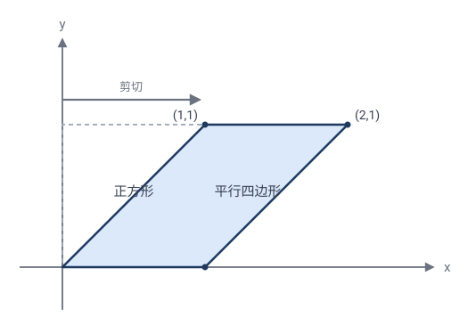
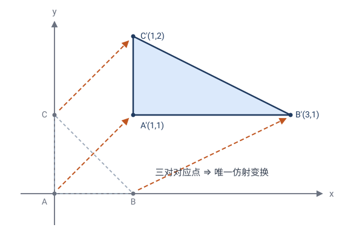
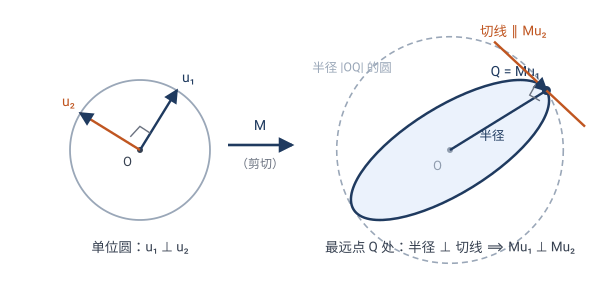
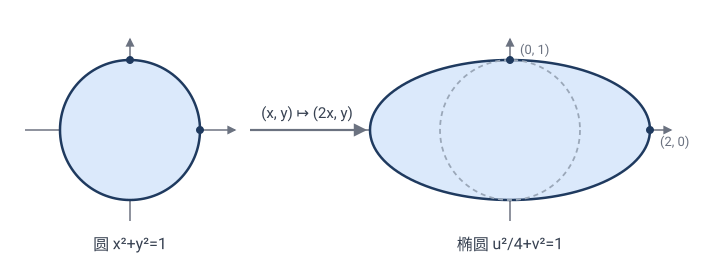

# 第 4 章 · 仿射变换：保住平行，丢掉角和圆

上一章我们允许"均匀放缩"（相似）。现在再放松一步：**允许"斜切"和"单向拉伸"**——不再要求各方向同比例。这就是**仿射变换**。

> 一句话：**仿射 = 任意可逆线性变换 + 平移**。它丢了角和圆，但保住平行与共线比例。本章两大高潮：**主轴定理**（仿射 = 旋转 + 垂直拉伸 + 旋转）和**椭圆就是被拉伸的圆**。

---

## 4.1 什么是仿射变换

把橡胶膜换成一张**可以斜着推、可以单方向拉伸的弹性膜**。现在你可以：

- 横向拉长纵向不动；
- 像推一副扑克牌那样**斜推**（剪切）；
- 任意线性变形。

> 🎯 **定义**：**仿射变换**（affine）形如
> $$\mathbf{x}\mapsto M\mathbf{x}+\mathbf{t},\quad M\text{ 是任意可逆 } 2\times2\text{ 矩阵},\;\mathbf{t}\text{ 是平移向量}.$$

用坐标写：
$$\begin{pmatrix}x'\\y'\end{pmatrix}=\begin{pmatrix}a&b\\c&d\end{pmatrix}\begin{pmatrix}x\\y\end{pmatrix}+\begin{pmatrix}e\\f\end{pmatrix},\qquad ad-bc\ne0.$$

它就是"**任意可逆线性变换 + 平移**"。等距（$M$ 正交）和相似（$M=k\cdot$正交）都是它的特例——只限制了 $M$ 的形式。

> 💡 "$ad-bc\ne0$"就是 $\det M\ne0$，保证 $M$ 可逆（变换能撤销）。若 $\det M=0$，整个平面被压成一条线或一点，信息丢失，**不**算仿射。

---

## 4.2 三个经典仿射：拉伸、剪切、挤压

**(a) 单向拉伸**：$M=\begin{pmatrix}2&0\\0&1\end{pmatrix}$，即 $(x,y)\mapsto(2x,y)$。
- 单位正方形 → 长方形（宽变 2，高不变）。
- 单位**圆** → 4.6 节证明：变成**椭圆**。

**(b) 剪切**（shear）：$M=\begin{pmatrix}1&1\\0&1\end{pmatrix}$，即 $(x,y)\mapsto(x+y,\,y)$。
- 像推一摞卡片：横坐标越往上偏移越大。
- 单位正方形 → 平行四边形。

> ✏️ **手算剪切**：单位正方形四顶点 $(0,0),(1,0),(1,1),(0,1)\mapsto(0,0),(1,0),(2,1),(1,1)$，是个**平行四边形**。面积 $\det M=1$，**不变**——剪切"歪了但没缩"，这是它的特色。

**(c) 挤压**（squeeze）：$M=\begin{pmatrix}k&0\\0&1/k\end{pmatrix}$。横拉 $k$ 倍、纵压 $1/k$ 倍，$\det=1$ 面积不变。物理上"光沿 $x$ 方向洛伦兹收缩"就是这个矩阵。

---

## 4.3 仿射变换的不变量

仿射"暴力"得多——**不再保角、不再保圆**。但保住：

| 不变量 | 仿射下 |
|---|---|
| **共线**（三点在一条直线上） | ✓ |
| **平行**（两直线平行） | ✓ |
| **共线线段之比** $\dfrac{AB}{BC}$ | ✓ 关键 |
| **平行线段之比** | ✓ |
| **面积之比** | ✓（都被乘 $|\det M|$） |
| 角度 | ✗ 丢失 |
| 圆 | ✗ 丢失（变椭圆） |
| 绝对面积 | ✗ 丢失（被 $|\det M|$ 缩放） |

### 为什么保平行？（招牌性质）

> 设直线 $\ell_1\parallel\ell_2$，方向向量都是 $\mathbf{v}$。$\ell_1$ 上点形如 $\mathbf{p}_1+t\mathbf{v}$。仿射 $\mathbf{x}\mapsto M\mathbf{x}+\mathbf{t}$ 把它映成 $M\mathbf{p}_1+\mathbf{t}+t\,M\mathbf{v}$，方向变成 $M\mathbf{v}$。两条平行线方向**相同**（都是 $\mathbf{v}$），映后方向都是 $M\mathbf{v}$，**仍然平行**。✓
>
> 关键：平行 = 方向相同；线性变换 $M$ 把同一个方向映成同一个方向。

### 为什么保共线比例？

设 $A,B,C$ 共线，$B$ 分 $AC$ 成 $\lambda:(1-\lambda)$，即 $\mathbf{b}=\lambda\mathbf{a}+(1-\lambda)\mathbf{c}$。仿射是"线性 + 平移"，**保持仿射组合**（系数和为 1 的线性组合）：
$$\mathbf{T}(\lambda\mathbf{a}+(1-\lambda)\mathbf{c})=\lambda\mathbf{T}(\mathbf{a})+(1-\lambda)\mathbf{T}(\mathbf{c}).$$
所以 $\mathbf{T}(B)$ 仍以**同样的 $\lambda$** 分割 $\mathbf{T}(A)\mathbf{T}(C)$——比例不变。✓ 这条性质是仿射几何的命根子。

### 为什么保面积之比？

关键事实：**线性变换 $M$ 把每个三角形面积都乘以同一个因子 $|\det M|$**。证：$\triangle ABC$ 面积 $=\tfrac12\bigl|\det(\overrightarrow{AB},\overrightarrow{AC})\bigr|$。仿射后 $\overrightarrow{AB}\mapsto M\overrightarrow{AB}$，$\overrightarrow{AC}\mapsto M\overrightarrow{AC}$，而
$$\det(M\overrightarrow{AB},\,M\overrightarrow{AC})=\det(M)\cdot\det(\overrightarrow{AB},\overrightarrow{AC})$$
（矩阵乘法的行列式 = 行列式相乘）。所以每个三角形面积都乘 $|\det M|$，**面积之比自然不变**。✓ 多边形剖分成三角形，结论推广。

> 💡 三个证明合起来揭示仿射的"骨架"：**保共线、保平行、保比例、保面积比**——丢了角和长度，保住一切"用直线和平行能表达"的关系。**仿射几何 = 不在乎直角与刻度的几何**。

---

## 4.4 仿射基本定理：三对点定一个仿射

第 2、3 章有一条暗线："**决定一个变换，需要几对对应点？**"现在轮到仿射。

> 🎯 **仿射基本定理**：设 $A,B,C$ **不共线**，$A',B',C'$ 是任意三点。则**存在唯一**的仿射变换 $\mathbf{T}$ 使
> $$\mathbf{T}(A)=A',\qquad \mathbf{T}(B)=B',\qquad \mathbf{T}(C)=C'.$$
> 它是真仿射（可逆）当且仅当 $A',B',C'$ 也**不共线**。

**为什么恰好三对点？** 数自由度：仿射 $\mathbf{x}\mapsto M\mathbf{x}+\mathbf{t}$ 有 $4+2=6$ 个参数（$M$ 四元、$\mathbf t$ 两元）。每规定一对对应点给出 2 个方程（$x,y$ 各一）。三对点恰好 6 个方程——**不多不少**。

**唯一性的证明（一步线性代数）**：先平移把 $A$ 送到原点。记 $\mathbf{b}=B-A,\ \mathbf{c}=C-A$。不共线 ⟺ $\mathbf b,\mathbf c$ **线性无关**（构成平面的一组基）。条件 $\mathbf{T}(B)=B',\ \mathbf{T}(C)=C'$ 变成
$$M\mathbf b=\mathbf b',\qquad M\mathbf c=\mathbf c'.$$
$\mathbf b,\mathbf c$ 是基，而线性映射被它在一组基上的像**唯一决定**——$M$ 定死了。若 $\mathbf b',\mathbf c'$ 也线性无关，$M$ 把基映成基，可逆 ✓；若 $A',B',C'$ 共线，则 $\mathbf b'\parallel\mathbf c'$，$\det M=0$，平面被压到一条线上——退化。$\square$

> ✏️ **手算一个**：把 $A=(0,0),B=(1,0),C=(0,1)$ 映到 $A'=(1,1),B'=(3,1),C'=(1,2)$。
> $\mathbf b=(1,0)\mapsto\mathbf b'=(2,0)$，$\mathbf c=(0,1)\mapsto\mathbf c'=(0,1)$，直接读出
> $$M=\begin{pmatrix}2&0\\0&1\end{pmatrix},\qquad \mathbf t=A'=(1,1).$$
> 正是"横向拉伸 2 倍 + 平移"，$\det M=2$，面积全部翻倍。

### 递进线：几对点定一个变换？

| 变换 | 需要几对对应点 | 参数个数 |
|---|:-:|:-:|
| 等距（第 2 章） | 2 对（正向唯一；允许反向则差一个反射） | 3 |
| 相似（第 3 章） | 2 对（3.8 节：存在且唯一） | 4 |
| **仿射（本章）** | **3 对** | 6 |
| 射影（下一章） | 4 对 | 8 |

每放松一层约束，变换多出两个自由度，就要多喂一对点才能把它钉死。**"几对点"是贴在每类变换身上的标本签**——下一章的射影变换会把这条线推到尽头。

---

## 4.5 ⭐ 分类定理：主轴定理——仿射 = 旋转 + 垂直拉伸 + 旋转

3.7 节用不动点把相似分成两类。仿射的分类更惊人：**所有仿射变换，拆开都长一个样。**

### 先交代平移：分解是对"线性部分"说的

仿射是 $\mathbf{x}\mapsto M\mathbf{x}+\mathbf{t}$，有两个零件：$M$ 和 $\mathbf t$。定理为什么只管 $M$？因为**平移不变形，只搬家**——它不改变任何图形的形状、方向和拉伸倍数，"这个仿射长什么样"的全部信息都在 $M$ 里。所以主轴定理分解的是线性部分 $M$，完整变换是

$$\text{平移}\;\circ\;\text{旋转}\;\circ\;\text{沿两垂直方向的拉伸}\;\circ\;\text{旋转}.$$

而且平移往往还能"隐身"：本节末会看到，**大多数仿射有不动点，绕不动点重写后平移被吸进中心**——整个变换就是"绕某一点的 转 + 拉 + 转"。

> 🎯 **主轴定理**：对任何可逆 $2\times2$ 矩阵 $M$，存在旋转 $R_1,R_2$ 与对角拉伸 $D=\begin{pmatrix}s_1&0\\0&s_2\end{pmatrix}$（$s_1\ge s_2>0$），使
> $$M=R_2\,D\,R_1.$$
> （若 $\det M<0$ 即反向，$R_1,R_2$ 中有一个是反射型的反向等距；以下手算都是正向情形。）

几何读法：随便给一个仿射变换，平面里都存在一对**垂直方向**，变换后它们**仍然垂直**，且各自只被等倍拉伸（$s_1$ 倍、$s_2$ 倍）——它们叫变换的**主轴**。变换的全部内容就是：转到主轴、沿轴拉伸、再转到位。

### 证明：找"被拉得最狠"的方向（几何论证）

核心断言：**存在一对垂直的单位向量 $\mathbf u_1,\mathbf u_2$，使 $M\mathbf u_1\perp M\mathbf u_2$**（像保持垂直）。有了它，定理立刻到手——下面先证断言。

一句话版本：**单位圆的像上，离中心最远的点，半径一定垂直于切线**（否则挪一步会更远）。这个"最远点"的原像，和它的垂直伙伴，就是主轴。看图就懂了：

**第一步：最狠方向存在。** 单位圆被 $M$ 映成一条闭合有界曲线（4.6 节会证明它正是椭圆）。像曲线上离原点**最远**的点 $Q$ 一定存在。设 $Q=M\mathbf u_1$（$\mathbf u_1$ 单位向量）——$\mathbf u_1$ 就是"被拉得最狠"的方向，$s_1=|M\mathbf u_1|$ 是最大拉伸倍数。图中即椭圆长轴端点。

**第二步：垂直伙伴的像躺在切线上。** 这一步里有两个小弯，逐个拐。

**第一弯：为什么切线方向是 $M\mathbf u_2$？** "切线方向"就是"**沿曲线走一小步时，面朝的方向**"。沿单位圆走一小步 $t=\varepsilon$（比如 $\varepsilon=0.01$）：
$$\mathbf c(\varepsilon)=\cos\varepsilon\,\mathbf u_1+\sin\varepsilon\,\mathbf u_2\;\approx\;\mathbf u_1+\varepsilon\,\mathbf u_2,$$
因为 $\varepsilon$ 很小时 $\cos\varepsilon\approx1$、$\sin\varepsilon\approx\varepsilon$（$\varepsilon=0.01$ 时 $\cos\varepsilon=0.99995$、$\sin\varepsilon=0.00999\ldots$，误差仅十万分之一）。也就是说：从 $\mathbf u_1$ 出发沿圆走 $\varepsilon$ 步，大致等于"朝 $\mathbf u_2$ 方向走 $\varepsilon$ 步"。被 $M$ 一映（用**线性**拆开）：
$$\boldsymbol{\gamma}(\varepsilon)=M\mathbf c(\varepsilon)\;\approx\;M\mathbf u_1+\varepsilon\,M\mathbf u_2\;=\;Q+\varepsilon\,M\mathbf u_2.$$
像点从 $Q$ 出发，面朝 $M\mathbf u_2$ 的方向——**所以 $M\mathbf u_2$ 就是像曲线在 $Q$ 处的切线方向**（图中橙色切线）。

**第二弯：为什么最远点处切线 ⊥ 半径？** 把切线方向 $M\mathbf u_2$ 拆成两份：一份**沿半径 $OQ$**（朝外为正），一份**垂直于半径**。

- 若"向外分量" $>0$：沿切线往前走一小步 $\varepsilon$，新点 $\approx Q+\varepsilon\,M\mathbf u_2$，它到 $O$ 的距离 $\approx|Q|+\varepsilon\times(\text{向外分量})>|Q|$——**比"最远"还远**，矛盾；
- 若"向外分量" $<0$（即朝内）：沿切线**退**一小步（$\varepsilon<0$），距离同样变大——**后方**像点比 $Q$ 更远，也矛盾。

唯一出路是"向外分量" $=0$，即切线与半径垂直：$M\mathbf u_2\perp OQ=M\mathbf u_1$。✓

> ✏️ **用圆校准一下直觉**：单位圆上最右的点 $(1,0)$ 是离 $y$ 轴"最远"的点，那里的切线是**竖直**的——沿水平方向（半径方向）的分量恰好为 $0$。设想某条曲线在它的"最右点"处切线是斜的（指向右上方），那么沿切线再挪一点，$x$ 坐标就会超过这个"最右点"——说明它根本不是最右点。**"最远 ⟹ 半径 ⊥ 切线"对任何闭曲线都成立**，理由完全相同：最远点处，曲线只能"横着走"，不能"往外走"。

> 🔧 **严格化（一行，可跳过）**："走一小步距离变大"的严格版是一个展开式。记 $v=M\mathbf u_2$，用 $\boldsymbol{\gamma}(\varepsilon)=\cos\varepsilon\,Q+\sin\varepsilon\,v$ 的**精确**公式：
> $$|\boldsymbol{\gamma}(\varepsilon)|^2=\cos^2\varepsilon\,|Q|^2+2\sin\varepsilon\cos\varepsilon\,(Q\cdot v)+\sin^2\varepsilon\,|v|^2.$$
> $\varepsilon$ 很小时 $\cos^2\varepsilon\approx1$、$2\sin\varepsilon\cos\varepsilon\approx2\varepsilon$、$\sin^2\varepsilon\approx\varepsilon^2$，于是
> $$|\boldsymbol{\gamma}(\varepsilon)|^2\approx|Q|^2+2\varepsilon\,(Q\cdot v)+(\text{含 }\varepsilon^2\text{ 的项}).$$
> $Q\cdot v$ 正是"向外分量"（半径方向与切线方向的内积）。$\varepsilon$ 充分小时，一次项 $2\varepsilon(Q\cdot v)$ 说了算，二次项跟不上：$Q\cdot v>0$ 取 $\varepsilon>0$，$Q\cdot v<0$ 取 $\varepsilon<0$，都得到 $|\boldsymbol{\gamma}(\varepsilon)|^2>|Q|^2$——比最远还远，矛盾。故 $Q\cdot v=0$，即 $M\mathbf u_1\perp M\mathbf u_2$。几何直觉到此被翻译成不等式。

**第三步：从断言到定理。** 写
$$M\mathbf u_1=s_1\mathbf w_1,\qquad M\mathbf u_2=s_2\mathbf w_2,$$
其中 $\mathbf w_1\perp\mathbf w_2$ 是单位向量，$s_1,s_2>0$ 是像的长度。$\mathbf u_1,\mathbf u_2$ 是一组（旋转了的）标准基，在这组基下 $M$ 的作用就是"沿两轴各乘 $s_1,s_2$"——正是对角矩阵 $D$。把"坐标轴 → $\mathbf u$ 基"的旋转记为 $R_1^{-1}$、"$\mathbf w$ 基 → 坐标轴"的旋转记为 $R_2$，串起来即 $M=R_2DR_1$。$\square$

> 💡 **证明的精髓**：整个证明就是一条几何事实——**"最远处的半径垂直于切线"**。$\mathbf u_1$ 是"被拉得最狠"的方向，它的像 $Q$ 是椭圆的长轴端点；$\mathbf u_2$ 的像自动躺在 $Q$ 处的切线上，与长轴垂直——短轴方向也就位了。**主轴就是椭圆的长短轴**，4.6 节的椭圆在这里已经整个露头了。
>
> 另有一个等价的直觉（"转十字"）：让一对垂直方向连续转动，像的夹角从锐角渐渐变成钝角——连续变化中间必有一刻恰好是 $90°$。同一个定理的两种说法，"最狠方向"版还顺带告诉我们主轴**在哪里**。

### 手算：$s_1,s_2$ 不用猜，两个方程解出来

拉伸倍数由 $M$ 完全确定，靠两条守恒：

- **乘积**：$s_1s_2=|\det M|$（面积缩放因子，4.3 节）；
- **平方和**：$s_1^2+s_2^2=M$ 四个元素的平方和。理由：$M^{\mathsf T}M=R_1^{\mathsf T}D^2R_1$，左边对角线之和恰是 $M$ 各元平方和，右边经旋转共轭对角线之和不变，等于 $s_1^2+s_2^2$。

> ✏️ **手算一（对称矩阵）**：$M=\begin{pmatrix}2&1\\1&2\end{pmatrix}$。平方和 $=4+1+1+4=10$，$\det M=3$。$s_1^2,s_2^2$ 是 $\lambda^2-10\lambda+9=0$ 的两根：$\lambda=9,1$，故 $s_1=3,\ s_2=1$。主轴方向试 $45°$：
> $$M\binom{1}{1}=\binom{3}{3}=3\binom{1}{1},\qquad M\binom{1}{-1}=\binom{1}{-1}=1\cdot\binom{1}{-1}.$$
> 沿 $y=x$ 拉 3 倍、沿 $y=-x$ 不动，乘积 $3=\det M$ ✓。

> ✏️ **手算二（剪切里藏着黄金比例）**：4.2 节的剪切 $M=\begin{pmatrix}1&1\\0&1\end{pmatrix}$。平方和 $=1+1+0+1=3$，$\det M=1$。$s_1^2,s_2^2$ 是 $\lambda^2-3\lambda+1=0$ 的两根：
> $$\lambda=\frac{3\pm\sqrt5}{2}.$$
> 注意 $\dfrac{3+\sqrt5}{2}=\left(\dfrac{1+\sqrt5}{2}\right)^2=\varphi^2$（黄金比例的平方！），故
> $$s_1=\varphi\approx1.618,\qquad s_2=\frac1\varphi\approx0.618.$$
> $\varphi$ **不是猜的，是解出来的**。主轴方向直接验证：取 $\mathbf u_1=(1,\varphi)$、$\mathbf u_2=(-\varphi,1)$（垂直），用 $\varphi^2=\varphi+1$：
> $$M\mathbf u_1=(1+\varphi,\ \varphi)=(\varphi^2,\varphi)=\varphi\,(\varphi,1),\qquad M\mathbf u_2=(1-\varphi,\ 1)=\left(-\tfrac1\varphi,\ 1\right).$$
> 两个像方向 $(\varphi,1)$ 与 $(-\tfrac1\varphi,1)$ 的点积 $=-1+1=0$——**仍然垂直** ✓，拉伸倍数恰为 $\varphi$ 与 $\tfrac1\varphi$。所以剪切 = 旋转 + "一方向拉 $\varphi$ 倍、垂直方向压 $\tfrac1\varphi$ 倍" + 旋转。乘积 $\varphi\cdot\tfrac1\varphi=1$——又一次看到"剪切面积不变"。

### 平移去哪儿了：不动点把它"吸收"成中心

回到完整的 $\mathbf{T}(\mathbf{x})=M\mathbf{x}+\mathbf{t}$。问：$\mathbf T$ 有没有**不动点**？解
$$\mathbf{x}=M\mathbf{x}+\mathbf{t}\quad\Longleftrightarrow\quad (I-M)\mathbf{x}=\mathbf{t}.$$

- **$\det(I-M)\ne0$（绝大多数情形）**：唯一不动点 $\mathbf{p}=(I-M)^{-1}\mathbf{t}$。绕 $\mathbf p$ 改写：
$$\mathbf{T}(\mathbf{x})-\mathbf{p}=M(\mathbf{x}-\mathbf{p}),$$
即**整个变换 = 绕 $\mathbf p$ 的"转 + 拉 + 转"**——平移不见了，只剩一个中心。这正是 3.7 节螺旋相似的老把戏：$k\ne1$ 时平移被不动点吸收；在仿射里，只要 $M$ 不以 $1$ 为"不动方向倍率"，同一招依然有效。
- **$\det(I-M)=0$**：方程可能无解（纯平移 $M=I,\ \mathbf t\ne\mathbf0$：无不动点），也可能有整条不动直线。例如剪切：$I-M=\begin{pmatrix}0&-1\\0&0\end{pmatrix}$，不动点条件是 $y=0$——**整个 $x$ 轴逐点不动**，剪切就是"钉住 $x$ 轴的滑动"。

于是仿射的全貌：**中心型**（绕不动点的 $R_2DR_1$，绝大多数）+ **滑移/平移型**（$\det(I-M)=0$ 的少数派，如平移、剪切）。

> ✏️ **手算三（找中心）**：$\mathbf{T}(x,y)=(2x+1,\ y+2)$。$I-M=\begin{pmatrix}-1&0\\0&0\end{pmatrix}$ 不可逆——属于少数派（沿 $y$ 方向是平移）。改成 $\mathbf{T}(x,y)=(2x+1,\ 2y+2)$：$(I-M)\mathbf p=(-p_1,-p_2)=(1,2)$，不动点 $\mathbf p=(-1,-2)$。验证：$\mathbf{T}(\mathbf p)=(−2+1,−4+2)=(-1,-2)=\mathbf p$ ✓。绕 $\mathbf p$ 它就是"放大 2 倍的位似"——平移被吸进了中心。

### 顺手得到层级分类：两个数 $s_1,s_2$ 里的三层几何

主轴定理把前三章的层级压缩进两个数 $s_1,s_2$：

- $s_1=s_2=1$：$M=R_2R_1$ 是旋转（或反射）—— **等距**（第 2 章）；
- $s_1=s_2=k\ne1$：$M=k\,R_2R_1$ 是旋转位似 —— **相似**（第 3 章）；
- $s_1\ne s_2$：仿射的特有成员 —— 把圆拉成**真正的椭圆**。

但这只是"主轴语言"。同一个分类，用**矩阵元素**和**复数**各怎么说呢？三种语言都要会说，才算把分类做踏实了。

#### 矩阵语言：看两列

$M$ 的两列不是别人，正是坐标轴方向的像 $\mathbf c_1=M\mathbf e_1,\ \mathbf c_2=M\mathbf e_2$。逐层翻译：

- **等距** ⟺ $\mathbf c_1,\mathbf c_2$ **都是单位长且垂直** ⟺ $M^{\mathsf T}M=I$（$M$ 正交）。此时 $M=\begin{pmatrix}\cos\theta&\mp\sin\theta\\ \sin\theta&\pm\cos\theta\end{pmatrix}$：旋转（同号）或反射型（异号）。
- **相似** ⟺ $\mathbf c_1,\mathbf c_2$ **等长且垂直**（公共长度 $k$）⟺ $M^{\mathsf T}M=k^2I$ ⟺ $M=k\cdot$正交。
- **仿射** ⟺ 只要求 $\mathbf c_1,\mathbf c_2$ **不共线**（$\det M\ne0$）——等长、垂直全不要求。

> ✏️ **手算判层（看两列就够了）**：
> **(a)** $M=\begin{pmatrix}3/5&-4/5\\4/5&3/5\end{pmatrix}$：两列 $(\tfrac35,\tfrac45)$、$(-\tfrac45,\tfrac35)$ 都是单位长，点积 $-\tfrac{12}{25}+\tfrac{12}{25}=0$ → **等距**，旋转角 $\cos\theta=\tfrac35$（$\theta\approx53°$）。
> **(b)** $M=\begin{pmatrix}1&-\sqrt3\\ \sqrt3&1\end{pmatrix}$：两列长度都是 $\sqrt{1+3}=2$，点积 $-\sqrt3+\sqrt3=0$ → **相似**，$k=2$；$\det=4>0$ 为正向，转角 $\cos\theta=\tfrac12$ 即 $60°$——正是 3.7 节的**螺旋相似**（旋转 $60°$ + 放大 2 倍）。
> **(c)** $M=\begin{pmatrix}2&1\\1&2\end{pmatrix}$：两列等长 $\sqrt5$，但点积 $3\ne0$，**不垂直** → 不是相似，是**真仿射**（上文手算一已见：主轴 $45°$，拉伸 $3$ 与 $1$）。

#### 复数语言：为什么复数乘法天生只会"相似"

第 2、3 章的复数形式 $z\mapsto az+b$（正向）、$z\mapsto a\bar z+b$（反向），写成矩阵正是（设 $a=p+qi$）：

$$z\mapsto az:\;\; M=\begin{pmatrix}p&-q\\ q&p\end{pmatrix};\qquad z\mapsto a\bar z:\;\; M=\begin{pmatrix}p&q\\ q&-p\end{pmatrix}.$$

检查正向的两列 $(p,q)$、$(-q,p)$：**自动等长**（都是 $|a|$）、**自动垂直**（点积 $-pq+qp=0$）。换句话说，**单个复数乘法 $z\mapsto az$ 天生"各方向同转 $\arg a$、同缩 $|a|$"——它只会做相似，想做真仿射都做不了**。这就是复数形式的刚性：2.7、3.5 节的分类之所以"自己吐出来"，根子在这里。

那一般仿射怎么用复数写？需要 **$z$ 与 $\bar z$ 两条通道**：任何实线性映射都能写成
$$z\;\longmapsto\;\alpha z+\beta\bar z.$$
**相似 ⟺ $\alpha,\beta$ 恰有一个为 $0$**（只剩一条通道，保角）。两条都非零时，$z$ 通道逆时针拧、$\bar z$ 通道顺时针拧，各方向拉伸倍数不再一致——这才是真仿射。而且拉伸倍数有漂亮公式：$|z|=1$ 时 $|\alpha z+\beta\bar z|=|\alpha+\beta\,e^{-2i\theta}|$，最大 $|\alpha|+|\beta|$、最小 $\bigl||\alpha|-|\beta|\bigr|$，即
$$s_1=|\alpha|+|\beta|,\qquad s_2=\bigl||\alpha|-|\beta|\bigr|.$$

> ✏️ **手算验证（黄金比例第三条来路）**：剪切 $(x,y)\mapsto(x+y,y)$ 写成复数：$z\mapsto\alpha z+\beta\bar z$，解出 $\alpha=1-\tfrac{i}{2},\ \beta=\tfrac{i}{2}$。$|\alpha|=\tfrac{\sqrt5}{2}$，$|\beta|=\tfrac12$，于是
> $$s_1=\frac{\sqrt5+1}{2}=\varphi,\qquad s_2=\frac{\sqrt5-1}{2}=\frac1\varphi.$$
> 与主轴定理用 $\lambda^2-3\lambda+1=0$ 解出的 $s_1=\varphi,\ s_2=\tfrac1\varphi$ **完全一致**——$\varphi$ 从复数通道又冒出来了。

> 💡 **精髓**：**仿射 = 两个等距夹一个轴向拉伸**。第 2、3 章的变换是零件，仿射只是它们的组装——等距与相似的差别、相似与仿射的差别，全压缩在 $s_1,s_2$ 这两个数里。三种语言对照着记：主轴看 $s_1,s_2$、矩阵看两列、复数看几条通道。4.7 节还会补上第四种语言——坐标系（尺子），并给出四合一总表。

> 💡 **与下一节的联系**：单位圆被 $M$ 映成椭圆，椭圆的**长轴、短轴方向正是主轴经 $R_2$ 转出的方向**，半轴长就是 $s_1,s_2$。所以"椭圆 = 拉伸的圆"将升级为最一般形式：**任何椭圆都是圆经"垂直拉伸 + 旋转"得到的**，不必轴向对齐。

---

## 4.6 ⭐ 高潮：椭圆是圆的仿射像

仿射几何最漂亮的成果：

> **定理**：任何**椭圆**都是某个**圆**经过仿射变换得到的。圆是椭圆的特例（两轴相等）。

证明一行代数。单位圆 $x^2+y^2=1$，施加横向拉伸 $(x,y)\mapsto(2x,y)$。令像点 $(u,v)=(2x,y)$，则 $x=u/2,\;y=v$，代回圆方程：
$$\left(\frac{u}{2}\right)^2+v^2=1\;\Longrightarrow\;\frac{u^2}{4}+v^2=1.$$
正是**半轴 $2$ 和 $1$ 的椭圆**！✓

> ✏️ **手算验证几个点**：$(1,0)\mapsto(2,0)$（椭圆右端点）；$(0,1)\mapsto(0,1)$（上端点）；$(\tfrac{\sqrt2}{2},\tfrac{\sqrt2}{2})\mapsto(\sqrt2,\tfrac{\sqrt2}{2})$，代入 $\tfrac{(\sqrt2)^2}{4}+(\tfrac{\sqrt2}{2})^2=\tfrac24+\tfrac12=1$ ✓。

> 💡 这只是轴向拉伸的情形。由 4.5 主轴定理，**最一般的椭圆**（主轴倾斜的）也不过是再复合一个旋转——结论不变：一切椭圆都是圆的仿射像。

### 这意味着什么？

**圆和椭圆，在仿射几何里没有区别。** 圆的仿射性质自动适用于椭圆：

- **椭圆中平行弦的中点共线**（圆里平行弦中点在直径上；仿射保平行、保中点）。
- **椭圆的切线**：仿射把圆的切线变成椭圆的切线。

> 💡 **思想升华**：中学里椭圆性质要单独推导，又长又烦。现在——**椭圆 = 圆 + 一次仿射**。圆的性质"传递"给椭圆，靠"仿射不变量"这座桥。**复杂对象 = 简单对象 + 变换**，这是变换几何最强大的用法。

### 经典应用：椭圆面积（免积分！）

单位圆面积 $\pi$，横向拉伸 2 倍后面积乘 $|\det M|=2$。椭圆 $\tfrac{x^2}{4}+y^2=1$ 面积 $=2\pi$。

一般地，半轴 $a,b$ 的椭圆 = 单位圆经 $(x,y)\mapsto(ax,by)$，$\det=ab$，面积 $=\pi ab$。

> ✏️ **一行得椭圆面积公式** $S=\pi ab$，无需任何积分！这就是变换的力量——**把椭圆"看作"被拉伸的圆**，问题瞬间简化。

---

## 4.7 仿射坐标系：换一把"尺子"

仿射还有一层深刻含义：它等于**换了一个坐标系**。这是同一个变换的"被动读法"：

- **主动读法**（点动）：$\mathbf T$ 把点 $\mathbf x$ 搬到 $M\mathbf x+\mathbf t$——前几章我们都是这么读的；
- **被动读法**（尺子动）：点一个没动，是**原点搬到 $\mathbf t$、坐标轴换成 $M\mathbf e_1,\,M\mathbf e_2$**——$\mathbf T(\mathbf x)$ 是"同一点在新尺子下的读数"。

一个变换，两种读法。这一节换上"被动"眼镜：三层几何忽然变成**三把尺子**。

### 三层几何 = 三把尺子

4.5 用主轴、矩阵、复数三种语言做了分类。被动读法给出第四种：

- **等距 = 全等的尺子**：新尺子与旧尺子一模一样——直角、同样的刻度，只是挪了位置、转了方向（或照了镜子）。所有度量结论原样成立。
- **相似 = 缩放的尺子**：还是直角、两轴刻度仍然**相同**，但刻度单位整体放大 $k$ 倍、方向转了 $\theta$。长度统一乘 $k$，角度不变——所以相似保角不保距。
- **仿射 = 任意的尺子**：两轴**不垂直、刻度不一样**的平行四边形网格。"垂直""长度"在这把尺子下失去意义；但"平行、共线、共线比例"是**纯网格概念**（数格子就能判断），依然有效。

被动读法下，分类一句话说完：**尺子越随便，能谈论的性质越少**。

### 手算：仿射尺子下，"圆"是椭圆

拿一把简单的仿射尺子：新原点 $\mathbf{O}'=(1,1)$，新轴 $\mathbf b_1=(2,0)$、$\mathbf b_2=(0,1)$（轴还垂直，但刻度不一样）。点 $P=(5,3)$ 的新坐标是多少？解 $P=\mathbf O'+x'\mathbf b_1+y'\mathbf b_2$：
$$(5,3)=(1,1)+2\cdot(2,0)+1\cdot(0,1)\;\Longrightarrow\;(x',y')=(2,1).$$

现在在新尺子下画"单位圆" $x'^2+y'^2=1$。换回旧坐标（$x=1+2x',\;y=1+y'$）：
$$\left(\frac{x-1}{2}\right)^2+(y-1)^2=1$$
——是**椭圆**！同一条曲线：直角尺子看是椭圆，仿射尺子看就是"圆"。

> 💡 **4.6 的被动读法**："椭圆 = 圆的仿射像"（主动）就是"**椭圆 = 仿射坐标系下的圆**"（被动）——两种读法，同一事实。这也解释了为什么仿射几何里圆和椭圆没有区别：换把尺子，它们本来就是同一条曲线。
>
> 若新轴也不垂直（如 $\mathbf b_2=(1,1)$），同一方程给出**倾斜**椭圆——正是题 4.2 剪切的情形。

### 四种语言一张表

| 层级 | 主轴 $s_1,s_2$（4.5） | 矩阵判据 | 复数形式 | 尺子（坐标系） | 保住 |
|---|---|---|---|---|---|
| 等距 | $1,\,1$ | $M^{\mathsf T}M=I$ | $z\mapsto az+b$，$\lvert a\rvert=1$（反向 $z\mapsto a\bar z+b$） | 全等的直角尺 | 距离、角度、一切度量 |
| 相似 | $k,\,k$ | $M^{\mathsf T}M=k^2I$ | $z\mapsto az+b$，$\lvert a\rvert=k$ | 缩放 $k$ 倍、旋转 $\theta$ 的直角尺 | 角度、长度之比 |
| 仿射 | $s_1\ne s_2$ | $\det M\ne0$ | $z\mapsto\alpha z+\beta\bar z$（两条通道） | 任意平行四边形网格 | 平行、共线、比例、面积比 |

> **仿射几何 = 不在乎坐标轴是否垂直、刻度是否均匀的几何**。它只承认"用直线网格定位"，至于网格是不是方的、疏密是否一样，无所谓。

> 🤔 **对照**：欧氏坚持"直角 + 等距"网格；相似允许刻度统一缩放；仿射放松到"任意平行四边形网格"。每放松一层，尺子更随便、能谈论的性质更少，但承认的变换更多、结论的普适性更强。**放松"直角"这个奢侈要求，换来的是普适性。**

---

## 4.8 仿射群

和等距、相似一样，全体仿射变换也构成**群**（复合运算），叫**仿射群** $\mathrm{Aff}(2)$：

- **封闭**：两个仿射 $(M_1,\mathbf{t}_1),(M_2,\mathbf{t}_2)$ 的复合 $=(M_2M_1,\;M_2\mathbf{t}_1+\mathbf{t}_2)$ 还是仿射。
- **单位**：$(I,\mathbf{0})$。
- **逆**：$(M,\mathbf{t})^{-1}=(M^{-1},-M^{-1}\mathbf{t})$。

子群链越来越长：
$$\mathrm{SO}(2)\;\subset\;E(2)\;\subset\;\mathrm{Sim}(2)\;\subset\;\mathrm{Aff}(2).$$

每往右一步，矩阵 $M$ 的限制更松：旋转（正交且 $\det=1$）→ 等距（正交）→ 相似（$k\cdot$正交）→ 仿射（任意可逆）。**群越大，约束越松，不变量越少**——这正是第 7 章爱尔兰根纲领要讲的核心。

---

## 4.9 几何层级的雏形

至此我们排出一列：

$$\boxed{\;\text{等距} \;\subset\; \text{相似} \;\subset\; \text{仿射}\;}$$

每往右一步，变换更多，**不变量更少**：

| 性质 | 等距 | 相似 | 仿射 |
|---|:-:|:-:|:-:|
| 距离 | ✓ | ✗ | ✗ |
| 角度 | ✓ | ✓ | ✗ |
| 平行 | ✓ | ✓ | ✓ |
| 共线比例 | ✓ | ✓ | ✓ |
| 共线 | ✓ | ✓ | ✓ |

记住这张表——它是第 7 章爱尔兰根纲领的预演。

下一章：[05-射影几何-交比.md](05-射影几何-交比.md)

---

## 4.10 本章小结

- **定义**：仿射 = 任意可逆线性 + 平移，$\mathbf x\mapsto M\mathbf x+\mathbf t$（$\det M\ne0$）。等距（$M$ 正交）、相似（$M=k\cdot$正交）都是限制 $M$ 形式的特例（4.1）。
- **三个经典**：单向拉伸、剪切、挤压——剪切与挤压 $\det=1$，"歪了但没缩"，面积不变（4.2）。
- **不变量**：保共线、平行、共线比例、面积之比；丢角度、长度、圆、绝对面积。保平行、保比例、保面积比三个证明是全章骨架（4.3）。
- **仿射基本定理**：三对不共线对应点**唯一**决定一个仿射；自由度 $6=3$ 对点 $\times\,2$。"几对点定一个变换"的递进线推进到 3 对（4.4）。
- **分类（主轴定理）**：线性部分 = 旋转 ∘ 垂直拉伸 ∘ 旋转，$M=R_2DR_1$；几何证明只需"最远点半径 ⊥ 切线"——主轴就是像椭圆的长短轴；$s_1,s_2$ 由"乘积 $=|\det M|$、平方和 $=M$ 各元平方和"解出。平移只负责搬家——有不动点时被吸收成中心，整个变换就是绕不动点的"转 + 拉 + 转"。层级分类四种语言：主轴看 $s_1,s_2$、矩阵看两列（等长？垂直？）、复数看几条通道（$z\mapsto\alpha z+\beta\bar z$，相似 ⟺ 单通道）、坐标系看尺子（4.5、4.7）。
- **高潮**：椭圆 = 圆的仿射像，圆的仿射性质免费传给椭圆；椭圆面积 $S=\pi ab$ 免积分——"复杂对象 = 简单对象 + 变换"（4.6）。
- **另一视角（三把尺子）**：变换的被动读法 = 换坐标系。等距 = 全等的直角尺，相似 = 缩放旋转的直角尺，仿射 = 任意平行四边形网格；"椭圆 = 仿射坐标系下的圆"（4.7）。
- **群与层级**：$\mathrm{Aff}(2)$ 成群；子群链 $\mathrm{SO}(2)\subset E(2)\subset\mathrm{Sim}(2)\subset\mathrm{Aff}(2)$，每往右约束更松、不变量更少——第 7 章的预演（4.8、4.9）。

下一章我们放上最后一只"猛兽"：允许**投影**——平行线可以相交，圆可以变抛物线。不变量只剩一个，但它极其顽强：**交比**。

---

## 🧩 本章习题

**题 4.1（手算）椭圆像。** 仿射 $(x,y)\mapsto(3x,2y)$ 把单位圆变成什么椭圆？写出方程，求半轴和面积。
*答*：$\frac{x^2}{9}+\frac{y^2}{4}=1$，半轴 $3,2$，面积 $\pi\cdot3\cdot2=6\pi$（原圆面积 $\pi$ 乘 $|\det|=3\cdot2=6$）。

**题 4.2（手算）剪切的面积。** 剪切 $(x,y)\mapsto(x+y,y)$ 把单位圆变成什么？面积多少？
*答*：$\det\begin{pmatrix}1&1\\0&1\end{pmatrix}=1$，**面积不变仍是 $\pi$**。形状是被斜推的椭圆。写方程：令像点 $(u,v)=(x+y,y)$，则 $x=u-v,y=v$，代回 $x^2+y^2=1$ 得 $(u-v)^2+v^2=1$，是倾斜椭圆。

**题 4.3（思考）为什么不保角？** 仿射 $(x,y)\mapsto(2x,y)$ 把 $y=x$ 和 $y=-x$（原本垂直）映成什么？还垂直吗？
*答*：映成 $y=\frac{x}{2}$ 和 $y=-\frac{x}{2}$，斜率积 $\frac14\ne-1$，**不再垂直**。✗ （坐标轴 $x=0,y=0$ 碰巧是特征方向仍垂直，是巧合。）

**题 4.4（证明）仿射保中点。** 设 $M$ 是 $AB$ 中点。证明 $\mathbf{T}(M)$ 是 $\mathbf{T}(A)\mathbf{T}(B)$ 的中点。
*提示*：中点 $\mathbf{m}=\frac12(\mathbf{a}+\mathbf{b})$ 是仿射组合（系数和 $\frac12+\frac12=1$），仿射保持仿射组合。

**题 4.5（应用）椭圆里的弦。** 用"椭圆 = 拉伸的圆"证明：椭圆中所有**平行于同一方向**的弦的中点共线（在一条过椭圆中心的直线上）。
*提示*：圆里平行弦中点在过圆心、垂直于弦方向的直径上；仿射保平行、保中点，搬到椭圆仍成立。这条线就是椭圆的"共轭直径"。

**题 4.6（进阶）仿射群。** 验证两个仿射 $(M_1,\mathbf{t}_1)$ 与 $(M_2,\mathbf{t}_2)$ 的复合是 $(M_2M_1,\,M_2\mathbf{t}_1+\mathbf{t}_2)$，仍是仿射。由此说明全体仿射构成群。
*答*：$(M_2M_1)$ 仍可逆（$\det M_2M_1=\det M_2\det M_1\ne0$），故是仿射，封闭成立。单位 $(I,0)$、逆 $(M^{-1},-M^{-1}\mathbf t)$ 都在，故成群。

**题 4.7（手算）三对点定仿射。** 求把 $(0,0),(1,0),(0,1)$ 映到 $(2,1),(0,1),(2,3)$ 的仿射变换。它其实属于哪一类更"小"的变换？
*答*：$\mathbf b=(1,0)\mapsto\mathbf b'=(-2,0)$，$\mathbf c=(0,1)\mapsto\mathbf c'=(0,2)$，故 $M=\begin{pmatrix}-2&0\\0&2\end{pmatrix}$，$\mathbf t=(2,1)$。$M=2\cdot(-I)$ 是"旋转 $180°$ + 放大 2 倍"——解出来竟是个**相似**（螺旋相似/旋转位似）！仿射基本定理只承诺仿射，碰巧落进子群完全可能。

**题 4.8（手算）主轴与拉伸倍数。** 求 $M=\begin{pmatrix}2&1\\1&2\end{pmatrix}$ 的主轴方向与两个拉伸倍数，并验证倍数之积等于 $\det M$。
*答*：$M(1,1)=(3,3)=3(1,1)$，$M(1,-1)=(1,-1)=(1,-1)$。主轴为直线 $y=x$ 与 $y=-x$（互相垂直 ✓），拉伸倍数 $3$ 与 $1$，乘积 $3=\det M$ ✓。单位圆被拉成半轴 $3$、$1$、主轴沿 $y=x$ 的椭圆。

---

> 📚 **延伸：仿射变换的经典应用题**（椭圆内接三角形最大面积、三角形仿射标准化、梅涅劳斯定理、塞瓦定理、重心 $2:1$，加上**仿射基本定理求矩阵**、**主轴定理分解剪切**，共 7 道），见 [04-仿射变换-习题.md](04-仿射变换-习题.md)。它们都用**仿射标准化**——把椭圆变圆、把任意三角形变标准三角形——一两步解决，正是仿射几何"只在乎共线、平行、比例"的威力。
