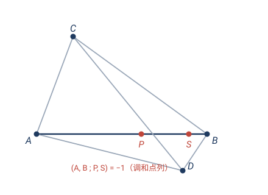
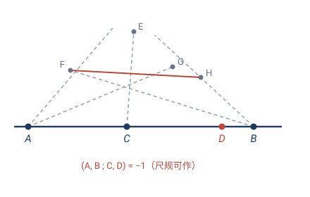
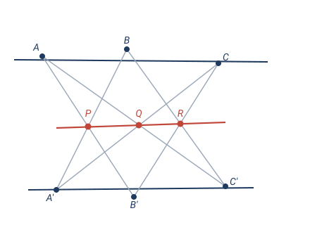
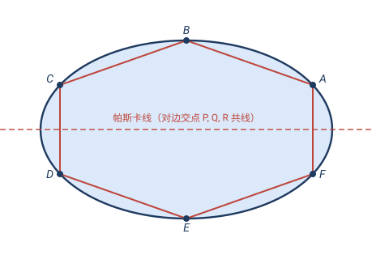

# 第 5 章 · 经典习题：射影几何的应用

> 射影几何是"最暴力变换 + 最隐蔽不变量"。它的经典题有两类：一类是**用交比反推**（已知交比求未知点），一类是**经典构型与定理**（完全四点形、帕普斯、帕斯卡）——后者"只谈共线共点、不提长度角度"，是真正的射影定理。这节把它们一并收进来。

> 📌 每道题标了它依赖的章节。

---

## 题 1 · 用交比反推第四个点（5.3 交比不变量）

> 🔖 **用到**：5.3 节——交比是射影不变量，可当作"已知量"列方程。

实数轴上三点 $A=0,\,B=1,\,C=3$。求点 $D$，使 $(A,B;\,C,D)=2$。

> 💡 **关键**：交比是四个点的一个代数关系；知道三个点和交比值，第四个点就被定死——解一个一元方程。

**解**：代入交比定义
$$\frac{(C-A)/(C-B)}{(D-A)/(D-B)}=\frac{(3-0)/(3-1)}{(D-0)/(D-1)}=\frac{3/2}{\,D/(D-1)\,}=2.$$
解：
$$\frac32\cdot\frac{D-1}{D}=2\;\Longrightarrow\;3(D-1)=4D\;\Longrightarrow\;D=-3.$$
验证：$(0,1;\,3,-3)=\dfrac{3/2}{(-3)/(-4)}=\dfrac{3/2}{3/4}=2$ ✓

> ✏️ **点睛**：这正是题 5.5"灭点测距"的代数内核——**照片里能量到的位置**和**交比这个不变量**一联立，就能反推出照片外的未知点。射影几何把"看不见的点"算出来。

---

## 题 2 · 完全四点形产生调和点列（5.3 + 5.4）

> 🔖 **用到**：5.3 交比；5.4 无穷远点（证明靠"投影到无穷远"）。

四个一般位置的点 $A,B,C,D$（无三点共线）连同六条连线构成**完全四点形**。三对对边交出三个**对角点**：
$$P=AB\cap CD,\quad Q=AC\cap BD,\quad R=AD\cap BC.$$
证明：在边 $AB$ 上，记 $S=AB\cap QR$（$QR$ 是另两个对角点的连线），则
$$(A,B;\,P,S)=-1\quad(\text{调和点列}).$$

> 💡 **关键**：这是调和点列（交比 $-1$）的**几何来源**——它不是凑出来的，而是完全四点形的内禀结构。证明用射影招牌手法：**把某条线投影到无穷远**，让构型变简单。

**证（思路）**：作一个中心投影，把直线 $QR$ **送到无穷远直线**去（即让 $QR$ 方向的直线投成平行线）。投影保持交比（5.3）。

投影后，$Q,R$ 跑到无穷远，意味着完全四点形变成：**两组对边各自平行**的构型——即 $AC\parallel BD$ 且 $AD\parallel BC$，所以 $ABCD$ 变成一个**平行四边形**。此时：
- $P=AB\cap CD$：因 $CD$ 是平行四边形一边，$P$ 是 $AB$ 的一个端点方向……更精确地，在平行四边形里 $QR\parallel AB$（都到无穷远），$S=AB\cap QR$ 跑到 $AB$ 的无穷远点；
- 退化检查：$P$ 成为 $AB$ 的**中点**（平行四边形对角线互相平分），$S$ 成为 $AB$ 的**无穷远点**。

中点 $P$ 把 $AB$ 分成 $1:1$，即 $\dfrac{AP}{PB}=1$；$S$ 在无穷远，$\dfrac{AS}{SB}=-1$（有向，无穷远比）。故
$$(A,B;\,P,S)=\frac{AP/PB}{AS/SB}=\frac{1}{-1}=-1.\quad\square$$

> ✏️ **点睛**：题 5.4 用代数硬凑出交比 $-1$；这里看到 $-1$ 的**几何出身**——它是完全四点形的"中点 ↔ 无穷远"对偶。**调和点列 = 中点和无穷远点的射影化身**，这就是它在射影几何里扮演"中点"角色的原因。

---

## 题 3 · 第四调和点的尺规作图（5.3，应用题 2）

> 🔖 **用到**：题 2 的完全四点形构型——它是作图工具。

给定直线上三点 $A,B,C$，用尺规作出第四点 $D$，使 $(A,B;\,C,D)=-1$（$D$ 叫 $C$ 关于 $A,B$ 的**第四调和点**）。

**作法**：
1. 过 $A$ 任作一直线 $l_1$（异于 $AB$），过 $B$ 任作一直线 $l_2$，设 $l_1\cap l_2=E$。
2. 连 $CE$；在 $l_1$ 上任取另一点 $F$（$\ne A,E$）。
3. 连 $BF$ 交 $CE$ 于 $G$；连 $AG$ 交 $l_2$ 于 $H$。
4. 连 $FH$，与直线 $AB$ 交于 $D$。

则 $D$ 即为所求（$(A,B;\,C,D)=-1$）。

**原理**：$A,B,E,F$ 恰构成一个完全四点形（$E=l_1\cap l_2$、$F\in l_1$、$H\in l_2$、$G=CE\cap BF$ 是它的对角关系），由题 2，$C$（$=CE$ 与 $AB$ 的交，对应那里的 $P$）与 $D$（$=FH$ 与 $AB$ 的交，对应那里的 $S$）把 $AB$ 分成调和点列。

> ✏️ **点睛**：纯尺规、无需任何长度计算，就作出"交比 $-1$"的点。这说明调和点列是**射影可作**的（只用直尺就够，连圆规都不必）——它属于射影几何，不属于度量几何。

---

## 题 4 · 帕普斯定理的证明（5.6）

> 🔖 **用到**：5.4 无穷远点 + 5.6 帕普斯定理本身。

证明帕普斯定理：两条直线 $\ell,m$ 上各取三点 $A,B,C\in\ell$ 和 $A',B',C'\in m$，则
$$P=AB'\cap A'B,\quad Q=AC'\cap A'C,\quad R=BC'\cap B'C$$
三点共线。

**证（思路：投影到无穷远）**：帕普斯定理只谈"共线、共点"，是射影命题，所以可以施中心投影而不改变结论真假。把直线 $\ell$ 与 $m$ 的交点 $O=\ell\cap m$ **投影到无穷远**，于是 $\ell\parallel m$（变成两条平行线）。

现在只需证**平行情形**的帕普斯。设 $\ell,m$ 是两条水平线，$A,B,C$ 在上、$A',B',C'$ 在下。用坐标：$A=(a,1),B=(b,1),C=(c,1)$，$A'=(a',0),B'=(b',0),C'=(c',0)$。
- $AB'$ 与 $A'B$ 的交点 $P$：直接解两条直线方程，其 $x$ 坐标是 $a,b,a',b'$ 的一个分式线性组合；
- 同理 $Q$（用 $a,c,a',c'$）、$R$（用 $b,c,b',c'$）。

把三点 $P,Q,R$ 代入直线方程检验，三者满足同一条直线方程（代数运算略，关键是三个 $x$ 坐标呈线性关系）。故 $P,Q,R$ 共线。$\square$

> ✏️ **点睛**："投影到无穷远"把任意两条相交直线变成平行线，让坐标大大简化——这是证射影定理的招牌招数（帕斯卡定理也这么证）。**射影命题不怕投影，所以专挑最省事的投影来证。**

---

## 题 5 · 帕斯卡定理（5.5 圆锥曲线统一 + 5.6）

> 🔖 **用到**：5.5 圆锥曲线都射影等价（可投影成圆）+ 帕普斯定理。

圆锥曲线（椭圆/抛物线/双曲线）上任取六点 $A,B,C,D,E,F$，三对"对边"交点
$$P=AB\cap DE,\quad Q=BC\cap EF,\quad R=CD\cap FA$$
共线（这条线叫**帕斯卡线**）。

**证（思路）**：由 5.5，所有非退化圆锥曲线射影等价。作中心投影把该圆锥曲线变成**圆**（投影不改变"共线"关系）。

圆上的帕斯卡定理可用**退化**思路优雅得到：让六边形中 $B\to A$、$E\to D$（两对相邻点重合），则边 $AB$、$DE$ 退化为圆在 $A$、$D$ 处的**切线**；$P$ 变成"两切线"的交点。退化构型的共线性可由圆的对称性（或角度）验证。由连续性，一般六点情形也成立。

回到原圆锥曲线（再做一次投影回去），共线性保持，故原命题成立。$\square$

> ✏️ **点睛**：帕斯卡定理是射影几何的巅峰成果之一——**圆、椭圆、抛物线、双曲线统一适用**，因为它只谈"共线"，而共线是射影不变量。16 岁的帕斯卡就是靠它一战成名。注意它**不提距离、不提角度、不提焦点**——纯射影。

---

## 🧠 回顾

| 题 | 用到的第 5 章结论 | 它替你省掉了什么 |
|---|---|---|
| 1 反推第四点 | 5.3 交比 | 不可直接测量的点，靠不变量算出 |
| 2 完全四点形 | 5.3 + 5.4 投影到无穷远 | 调和点列 $-1$ 的几何来源 |
| 3 第四调和点作图 | 题 2 构型 | 纯尺规，无需度量 |
| 4 帕普斯定理 | 5.4 + 射影方法 | 平行化简后纯坐标计算 |
| 5 帕斯卡定理 | 5.5 圆锥曲线统一 | 投影成圆 + 退化 |

主线：**"投影到无穷远" + "交比不变"** 是射影几何的两件法宝——前者把任意构型变到最简位置来证，后者把看不见的量变成可算的不变量。第 5 章是最"贫乏"的几何（不变量最少），却也是最"普适"的（结论跨一切投影成立）。

---

> 📚 返回 [第 5 章 · 射影几何](05-射影几何-交比.md) ｜ [目录](README.md)
