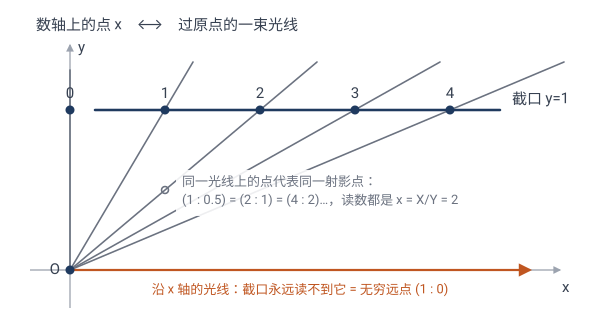
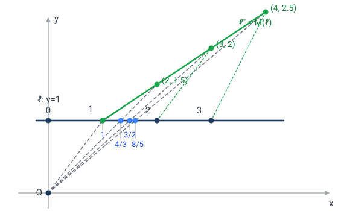
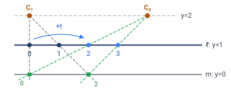

# 侧栏 · 齐次坐标：为什么射影变换"恰好"是分式线性变换

> 正文 5.3 节有两个断言：射影直线上的射影变换，在普通坐标下就是分式线性变换 $x\mapsto\dfrac{ax+b}{cx+d}$；在齐次坐标下则是 $2\times2$ 可逆矩阵。这个侧栏**不断言、只推导**：从 5.1 的定义（射影变换 = 中心投影的复合）出发，先把一次投影的坐标公式硬算出来，让分式、矩阵、齐次坐标依次自己冒出来。

---

## 1. 普通坐标的麻烦：投影会"漏点"

回顾正文图 09 的构造：把数轴摆成直线 $\ell:y=1$（点 $(x,1)$ 的读数即 $x$），从原点 $O$ 中心投影到直线 $\ell':x=1$ 上。过 $(x,1)$ 的光线交 $\ell'$ 于 $(1,\tfrac1x)$——这就是 $x\mapsto\tfrac1x$ 的几何出身。

但有一个方向出事了：**过 $(0,1)$ 的那条光线——沿 $y$ 轴方向——与竖直截口 $\ell'$ 平行，永远打不到它**。普通坐标下我们只好说"$x=0$ 没有像"，分式 $\tfrac1x$ 也在 $x=0$ 处炸掉。（作为对照：沿 $x$ 轴的光线——数轴上"无穷远"的方向——反而结结实实打中 $\ell'$ 上的 $(1,0)$，读数 $0$。这正是 $\infty\mapsto0$，它从来就不是例外。）

> 🤔 这个"例外"是几何本身的毛病，还是**记账法**的毛病？齐次坐标的回答是：后者。光线明明存在，只是你的账本上没给它留科目。

---

## 2. 关键想法：把"点"换成"过原点的光线"

别再盯着点 $(x,1)$ 本身——改看**从原点射向它的那条光线**，即过 $(0,0)$ 和 $(x,1)$ 的直线。

- 每条过原点的直线（除了 $x$ 轴）恰好穿过读数线 $y=1$ **一次**，交点 $(x,1)$ 给出读数 $x$。所以"点 ↔ 光线"几乎一一对应。
- 那条唯一的例外——$x$ 轴本身——就是**无穷远点**：它不是不存在，只是读数线 $y=1$ 读不到它。

于是：**射影直线 = 平面上过原点直线的全体**。每条直线用它上面任意一个非零点 $(X,Y)$ 来标记——但同一条线上所有点标记的是同一个射影点，所以

$$(X:Y)=(\lambda X:\lambda Y),\quad\lambda\ne0.$$

这就是**齐次坐标**的全部定义。普通读数不过是选定截口 $y=1$ 之后做的一次除法：

$$x=\frac{X}{Y}\quad(Y\ne0);\qquad Y=0\ \Longrightarrow\ \text{无穷远点}.$$

> 💡 注意角色转换：普通坐标里，$(x,1)$ 是"点本身"；齐次坐标里，它只是**光线的代表元**之一。$(2:1)$、$(4:2)$、$(1:0.5)$ 都是同一条光线，读数都是 $2$。除法 $X/Y$ 对代表元的选择免疫——这正是"成比例同一点"与"读数"自洽的原因。

---

## 3. 换一条截口 = 一次中心投影

同一束光线，换一条截口线来读，读数就变了。比如改用竖直截口 $x=1$：光线 $(X:Y)$ 与它交于 $(1,\tfrac{Y}{X})$，读数变成 $\tfrac{Y}{X}=\tfrac1x$——正文图 09 那幅。

**这就是中心投影的本质：光束没动，动的只是"在哪儿读数、按什么规则读数"。** 两条截口之间的读数换算，就是两条直线之间的中心投影。

齐次坐标 $(X:Y)$ 是光束的**内禀坐标**——它属于光线本身，与截口无关。这个味道你在 5.3 节已经尝过：交比不变，正是因为交比是光束的内禀属性（视点处角度的正弦比），与截线无关。**齐次坐标和交比，是同一个思想的记账版和数值版。**

> 💡 这套话**暗示**了中心投影在代数上是"线性"的：截口上的读数规则是线性函数（"取横坐标""取纵坐标"都是线性的），换截口只是给同一向量换一个代表元（乘个倍数），而齐次坐标对倍数免疫。但暗示不算推导。下一节换个最老实的方式：**不诉诸任何新语言，直接把一次中心投影的坐标公式硬算出来。**

---

## 4. 从定义硬算：一次中心投影的坐标公式

按 5.1 的定义，**射影变换 = 有限次中心投影的复合**。那就先把"一次中心投影"的公式算出来——不许断言，只许算。

**摆设**（取最简单的一组坐标；一般情形只是换坐标系，公式形状不变）：投影中心 = 原点 $O$；原线 = 截口 $\ell:y=1$，读数 $x$；像线 = 任意不过 $O$ 的直线 $\ell':\alpha X+\beta Y=1$；$\ell'$ 上的读数规则 = 任意线性函数 $\rho X+\sigma Y$。

> 💡 **"读数规则"为什么恰好是线性函数？** 顺着推。读数规则 = 一把**尺子**：给 $\ell'$ 上每个点发一个数 $R$，且等距的点须拿到等间隔的读数。把符号定死：任取**基点** $P_0=(x_0,y_0)$ 和**方向向量** $\mathbf v=(v_1,v_2)\ne\mathbf 0$（沿 $\ell'$ 的朝向），则 $\ell'$ 上每个点唯一写成 $P(t)=(x_0+tv_1,\;y_0+tv_2)$，且等间隔的 $\Delta t$ 就是等距的点（步长恒为 $|\Delta t|\cdot|\mathbf v|$）。
>
> **第一步：尺子的定义直接说出 $R$ 的形状。** "每走 $\Delta t$，读数增量都相同"正是说 $R$ 是 $t$ 的一次函数：
> $$R(t)=\lambda t+\mu\qquad(\lambda\ \text{为刻度率};\ \lambda=0\ \text{则读数纹丝不动，尺子报废}).$$
>
> **第二步：$t$ 本身是 $(X,Y)$ 的线性函数。** 由 $(X,Y)=P_0+t\mathbf v$ 反解：两边与 $\mathbf v$ 点乘，得
> $$t=\frac{v_1(X-x_0)+v_2(Y-y_0)}{v_1^2+v_2^2},$$
> 对 $(X,Y)$ 是线性的。（例：$y=1$ 上取 $P_0=(0,1)$、$\mathbf v=(1,0)$，得 $t=X$；$x=1$ 上取 $P_0=(1,0)$、$\mathbf v=(0,1)$，得 $t=Y$。）
>
> **第三步：复合。** $R=\lambda t+\mu$ 是"线性函数的仿射函数"，代回即得 $R(X,Y)=\rho X+\sigma Y+\mu'$，其中 $(\rho,\sigma)=\dfrac{\lambda}{v_1^2+v_2^2}(v_1,v_2)$，常数 $\mu'$ 是 $\mu$ 与基点 $P_0$ 的贡献之和。
>
> **第四步：常数项蒸发。** 在 $\ell'$ 上 $\alpha X+\beta Y=1$，故 $\rho X+\sigma Y+\mu'=(\rho+\mu'\alpha)X+(\sigma+\mu'\beta)Y$——零点平移被吸收进 $(\rho,\sigma)$。
>
> 结论：**$\ell'$ 上的尺子恰好就是线性函数 $\rho X+\sigma Y$**（要求 $(\rho,\sigma)\not\propto(\alpha,\beta)$——否则 $\lambda=\rho v_1+\sigma v_2=0$，尺子报废，这正是 §5 的坍缩条件）。

**算。** 过 $(x,1)$ 的光线是 $t\,(x,1)$（$t\in\mathbb R$）。打进 $\ell'$ 的时刻：

$$\alpha(tx)+\beta(t)=1\;\Longrightarrow\;t=\frac{1}{\alpha x+\beta},$$

交点是 $\Bigl(\dfrac{x}{\alpha x+\beta},\,\dfrac{1}{\alpha x+\beta}\Bigr)$，按规则读数：

$$\rho\cdot\frac{x}{\alpha x+\beta}+\sigma\cdot\frac{1}{\alpha x+\beta}\;=\;\frac{\rho x+\sigma}{\alpha x+\beta}.$$

> 🎯 **一次中心投影 = 两个一次多项式相除。** 分式线性函数不是谁规定的，是"光线参数方程 + 直线方程 = 解一个一次方程"**直接掉出来的**：交点参数 $t$ 是 $x$ 的分式（分母一次），坐标自然也长着同一副分母。

顺带一问：分母 $\alpha x+\beta=0$ 的那个 $x$ 是什么？正是"光线与 $\ell'$ 平行"的方向——§1 的"漏点"在公式里自动现形，无需另行声明。

---

## 5. 复合两次：矩阵乘法自己冒出来

定义要的是**复合**。所以下一个问题必然是：分式线性喂给分式线性，还是分式线性吗？设

$$f(x)=\frac{ax+b}{cx+d},\qquad g(x)=\frac{ex+f}{gx+h},$$

硬算（分子分母同乘 $cx+d$）：

$$g(f(x))=\frac{e\,\dfrac{ax+b}{cx+d}+f}{g\,\dfrac{ax+b}{cx+d}+h}=\frac{(ea+fc)\,x+(eb+fd)}{(ga+hc)\,x+(gb+hd)}.$$

不但仍是分式线性，系数的组合方式还眼熟——正是**矩阵乘法** $\begin{pmatrix}e&f\\g&h\end{pmatrix}\begin{pmatrix}a&b\\c&d\end{pmatrix}$。于是一串结论连锁倒下：

- **任意有限次中心投影的复合 = 分式线性变换**，其系数矩阵 = 各次投影系数矩阵的乘积。$2\times2$ 矩阵不是另起炉灶的定义，而是**复合运算的乘法表**。
- 系数整体乘 $\lambda$（$\lambda\ne0$）分式不变 ⟹ 真正独立的是矩阵**模比例**：变换群 $\mathrm{PGL}_2=\mathrm{GL}_2/\{\lambda I\}$。这里 $\mathrm{GL}_2$ 是**一般线性群**（全体 $2\times2$ 实可逆矩阵，按乘法成群）；$\mathrm{PGL}_2$ 是**射影一般线性群**（可逆矩阵模去整体倍数，每个元素是等价类 $\{\lambda M\}$）。自由度 $4-1=3$——正文"3 对点定一个一维射影变换"的代数根源。
- 可逆条件 $ad-bc\ne0$ 的几何身份：对一次投影，$\rho\beta-\sigma\alpha=0$ 当且仅当读数规则 $(\rho,\sigma)$ 与截口方程 $(\alpha,\beta)$ **成比例**——那时所有点的读数全相同，投影坍缩成一个点。行列式在复合时相乘，"不坍缩"一路继承下去。

**齐次坐标在这里回收。** 系数既然按矩阵乘法组合，最省事的记账法就是把 $x$ 写成 $(X:Y)=(x:1)$，让矩阵**线性**作用，最后按 $X/Y$ 读回：

$$x\;\longrightarrow\;\begin{pmatrix}x\\1\end{pmatrix}\;\longrightarrow\;\begin{pmatrix}a&b\\c&d\end{pmatrix}\begin{pmatrix}x\\1\end{pmatrix}=\begin{pmatrix}ax+b\\cx+d\end{pmatrix}\;\longrightarrow\;\frac{ax+b}{cx+d}.$$

§2 那套语言至此不再是预先的假设，而是这张乘法表的**自然包装**：分式是"读回坐标"那步除法的形状；矩阵整体倍数无关，因为齐次坐标本来就不认比例；无穷远自动归队——$(1:0)\mapsto(a:c)$ 即 $\infty\mapsto\tfrac ac$；$x=-\tfrac dc$ 被送到 $\bigl(\tfrac{bc-ad}{c}:0\bigr)$，$Y=0$ 正是无穷远（$ad\ne bc$ 保证它没压成原点）。

**反向也成立**：每个分式线性变换都是射影变换（中心投影的复合），标准分解见 §6 末尾的框注。两个方向合上：**直线上的射影变换 ⟺ 分式线性变换**——从定义证完。

> ✏️ **对照正文**：$x\mapsto\tfrac1x$ 的矩阵是 $\begin{pmatrix}0&1\\1&0\end{pmatrix}$（行列式 $-1\ne0$）。逐点看：普通点 $(x:1)\mapsto(1:x)$，读回正是 $\tfrac1x$。两个"端点"也各归其位——$(1:0)\mapsto(0:1)$，即 $\infty\mapsto0$；$(0:1)\mapsto(1:0)$，即 $0\mapsto\infty$（$M^2=I$，两者正好互换）。普通坐标里的两个"例外"（$0$ 没像、$\infty$ 没定义），在齐次坐标下干干净净，一个都不剩。

---

## 6. 矩阵那一步的几何图像：搬线 + 投影

§3 说"换截口 = 中心投影"，§5 说"射影变换的系数按矩阵乘法组合"。两边一对照，问题就来了：**换截口时光束原地不动，一个代表元都不换——那矩阵 $M$ 到底"动"了什么？**

答案是：一般的射影变换不只换读数位置，还会**重新排布整束光线**。这个"重新排布"，就是矩阵的几何身份。分两步看。

**第一步：矩阵 = 整个平面的线性运动（搬光束）。** $(x,1)\mapsto(ax+b,\;cx+d)$ 不只是挪动 $\ell$ 上的点——$M$ 作用在平面的**每个**点上（旋转、缩放、剪切的组合）。关键性质：线性映射把**过原点的直线**映成**过原点的直线**，所以它把每条光线送到另一条光线，等于把光束整个重新排布了一遍。截口线 $\ell:y=1$ 也随之被整体搬到一条新直线

$$\ell''=\{(b,d)+t(a,c):t\in\mathbb R\}\qquad(\text{过 }(b,d),\text{方向 }(a,c)),$$

$M$ 可逆保证 $\ell''$ 不过原点（光束不会被压塌成一个方向）。

**第二步：读数 = 从原点把 $\ell''$ 投影回 $y=1$。** 这就是 §3 的"换截口"：光线 $O\to(X',Y')$ 交 $y=1$ 于 $(\tfrac{X'}{Y'},1)$。

合起来：**任何分式线性变换 = 一次线性运动（重新排布光束）+ 一次中心投影（读数）**；纯"换截口"是 $M=I$ 的特例（光束不动，只换读数位置——$x\mapsto\tfrac1x$ 就是这种）。

**跟着图走一个点**（实例 $M=\begin{pmatrix}1&1\\ 1/2&1\end{pmatrix}$，即 $x\mapsto\dfrac{x+1}{x/2+1}$）。看 $x=2$：

$$(2,1)\;\xrightarrow{\;M\;}\;(3,2)\;\xrightarrow{\;\text{从 }O\text{ 投回 }y=1\;}\;\Bigl(\frac32,\,1\Bigr)\;\xrightarrow{\;\text{读数}\;}\;\frac32.$$

图上：深蓝点 $(2,1)$ 沿绿色点线被搬到绿线 $\ell''$ 上的绿点 $(3,2)$；从 $O$ 出发的灰色虚线穿过它，在 $\ell$ 上交出蓝点——读数 $\tfrac32$。四个点的读数 $1,\tfrac43,\tfrac32,\tfrac85$ 都是这样走出来的。（另外注意：$\ell$ 与 $\ell''$ 的交点 $(1,1)$ 在投影下原地不动——它是 $x=0$ 的像，读数自然是 $1$。）

> 💡 **还能再拆细**（这也是 §5"反向也成立"的证明）。代数上有标准分解（$c\ne0$ 时）：
> $$\frac{ax+b}{cx+d}=\frac ac+\frac{bc-ad}{c^2\,(x+d/c)},$$
> 即**平移 → 缩放 → 取倒数 → 缩放 → 平移**的复合。三种基本件各有一次性投影实现：$x\mapsto kx$ 是从原点把 $y=1$ 投到平行线 $y=k$；$x\mapsto\tfrac1x$ 是投到竖直线 $x=1$（正文图 09）；$x\mapsto x+t$ 用两次中心投影实现——为什么一步不够、两步具体怎么摆，拆在下方附注里细说。**分式线性变换的一般形状，正是"中心投影的复合"（5.1 的定义）在公式上的样子——定义闭环了。**

### 附：平移为什么一步不够、两步怎么摆

**先证"一步不行"。** 按定义，中心投影的像是射线 $OP$ 与像线的交点。若像线就是原线 $\ell$ 本身：中心 $O\notin\ell$ 时，射线 $OP$（$P\in\ell$）与 $\ell$ 的交点**有且只有 $P$ 自己**——每个点纹丝不动，投出来的是恒等变换；$O\in\ell$ 时更糟，所有射线都躺在 $\ell$ 里，"交点"是整条线，投影根本没有定义。所以 $\ell\to\ell$ 的非恒等投影变换**必须借道一条中间线 $m$**，两步起步。

**再看"借道"的代价：交点自动不动。** 设两步链 $\ell\xrightarrow{C_1}m\xrightarrow{C_2}\ell$。若 $Q\in\ell\cap m$，第一步里 $Q$ 已经在 $m$ 上，射线 $C_1Q$ 交 $m$ 于 $Q$ 自己；第二步同理。所以 **$\ell\cap m$ 上的每个点都是复合变换的不动点**。

而平移 $x\mapsto x+t$（$t\ne0$）**一个普通不动点都没有**——它唯一的不动点是无穷远点（$\infty+t=\infty$）。两面一对，结论被逼出来：

$$m\ \text{必须与}\ \ell\ \text{平行},$$

把交点推到无穷远去，复合变换的不动点恰好只剩 $\infty$——正中平移的下怀。换句话说，"拿平行线当中转站"不是谁碰巧发明的巧招，是不动点分析下的**唯一选择**。

**剩下的只是摆设和硬算。** 取

$$\ell:\ y=1\ (\text{读数线}),\qquad m:\ y=0,\qquad C_1=(0,2),\quad C_2=(2t,\,2)$$

（两个视点摆在同一条"观望线" $y=2$ 上，相距 $2t$）。

- **第一步**，从 $C_1$ 投到 $m$：射线 $(0,2)+s\,(x,-1)$ 在 $s=2$ 时落地，交点 $(2x,\,0)$。读数上即 $x\mapsto2x$——以 $0$ 为中心、比率 $2$ 的**位似**。
- **第二步**，从 $C_2$ 投回 $\ell$：射线 $(2t,2)+s\,(u-2t,\,-2)$ 在 $s=\tfrac12$ 时打到 $y=1$，横坐标 $2t+\dfrac{u-2t}{2}=\dfrac u2+t$。即 $u\mapsto\dfrac u2+t$——比率 $\tfrac12$、中心在 $2t$ 的位似。
- **复合**：$x\mapsto2x\mapsto x+t$。✓

跟着图走一个点（$t=2$）：$\ell$ 上 $x=1$ 的深蓝点 $(1,1)$ 被 $C_1$ 的灰射线压到 $m$ 上的绿点 $(2,0)$（读数翻倍），再被 $C_2$ 的绿射线捞回 $\ell$ 上的蓝点 $(3,1)$——读数 $1+2=3$。$x=0$ 那个点走的是 $0\mapsto0\mapsto2$，同样平移 $2$。

最后认一个老熟人：两步各是一个位似，比率 $2$ 与 $\tfrac12$ 乘积为 $1$，复合退化成平移——这正是 3.2 节"**两个位似复合，比率之积为 $1$ 时退化成平移**"在射影舞台上的重演；视点错开的距离 $2t$ 经两次缩放折算，正好变成读数上的 $t$。

---

## 7. 二维照抄一遍（呼应 5.5）

| | 射影直线 $\mathbb P^1$ | 射影平面 $\mathbb P^2$（5.5 节） |
|---|---|---|
| 定义 | $\mathbb R^2$ 中过原点直线全体 | $\mathbb R^3$ 中过原点直线全体 |
| 齐次坐标 | $(X:Y)$，成比例同一点 | $(X:Y:Z)$，成比例同一点 |
| 截口 / 读数 | $Y=1$，读数 $x=X/Y$ | $Z=1$，读数 $(X/Z,\,Y/Z)$ |
| 无穷远 | $Y=0$：一个点 $(1:0)$ | $Z=0$：一条无穷远直线 |
| 射影变换 | $2\times2$ 可逆矩阵模比例（$\mathrm{PGL}_2$，3 个自由度） | $3\times3$ 可逆矩阵模比例（$\mathrm{PGL}_3$，8 个自由度） |
| 普通坐标下的样子 | 分式线性 $\dfrac{ax+b}{cx+d}$ | $\Bigl(\dfrac{aX+bY+c}{gX+hY+i},\,\dfrac{dX+eY+f}{gX+hY+i}\Bigr)$ |

一行都不新——只是多一个坐标。回顾整条链：**定义（中心投影的复合）→ 硬算一次投影（分式现身）→ 复合（系数按矩阵乘法组合）→ 齐次坐标（乘法表的自然包装）**。点是光线，投影是换截口，矩阵是线性运动，分式是读回坐标时的除法——四件事说清，射影几何的代数骨架就全在你手里了。

---

> 📚 **回到正文**：[05-射影几何-交比.md](05-射影几何-交比.md) 5.3 节（交比不变的手算验证）、5.5 节（射影平面与齐次坐标）。
