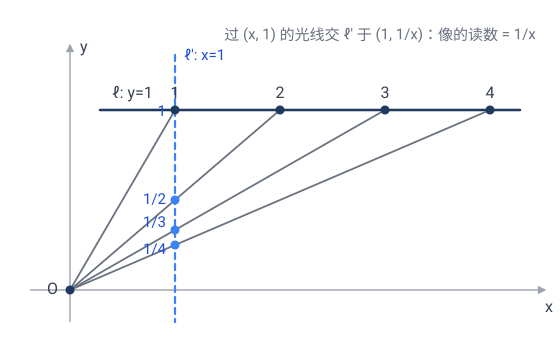
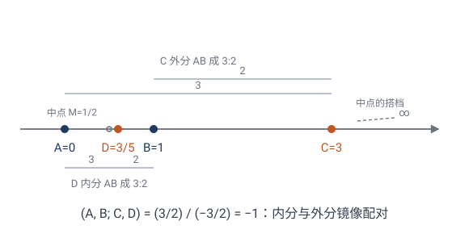
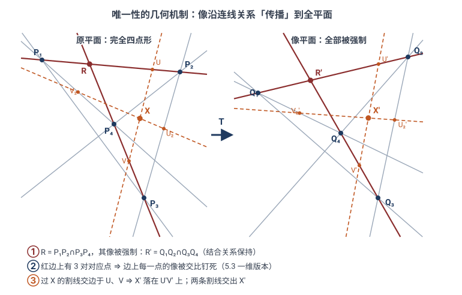
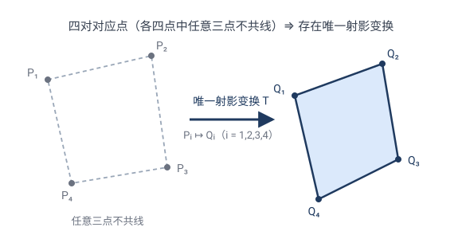
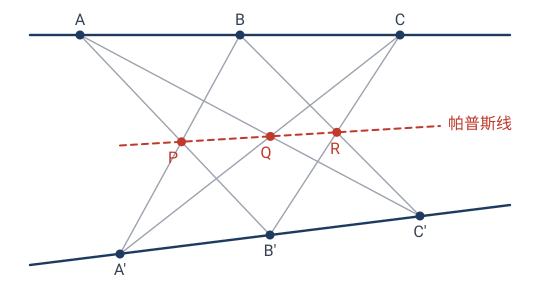
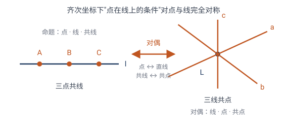

# 第 5 章 · 射影几何：最"暴力"的变换，最"隐蔽"的不变量

前面几章的变换（等距、相似、仿射）都还"客气"——至少把直线映成直线、把平行映成平行。本章的**射影变换**彻底放飞：它是**从一个点出发的投影**，可以把平行线投成相交线，把圆投成抛物线。

但奇迹在于：哪怕这么狂野的变换，仍有**一个**量顽强地保持不变——它叫**交比**。整个射影几何，就是围绕这一个不变量展开的。本章主线：**画家的灭点与地平线 → 射影平面 → 交比 → 圆锥曲线统一 → 只谈结合关系的招牌定理 → 对偶原理**；"几对点定一个变换"的递进线也将在 5.6 节收束于射影基本定理。

---

## 5.1 从画家的透视说起

想象你站在铁轨中间往前看。两条平行的铁轨，在你的视野里**汇交到远处地平线上的一个点**（"灭点"）。

这是怎么回事？因为**光线**从铁轨上的点出发，射进你的眼睛（视点）。你的"视野"是这些光线穿过的一个面（比如视网膜，或一块画布）。把铁轨上的每个点，沿"点 → 视点"的连线，投到画布上——这就是**中心投影**。

中心投影 $\mathbf{T}$ 的精确定义：固定视点 $O$，把每个点 $P$ 沿直线 $OP$ 投到某个目标平面 $\Pi'$ 上（$P'$ 是 $OP$ 与 $\Pi'$ 的交点）。

> 🎯 **射影变换**（projective transformation）= 任意有限次中心投影的复合。

它干的事，和“透视绘画”完全一样。德沙格和帕斯卡正是从透视法里抽象出了这门几何。

> 💡 **延伸专题**：从文艺复兴画家布鲁内莱斯基、阿尔贝蒂的“透视纱幕”，到 1639 年被同行嘲笑、愤而销毁手稿的德沙格，到 16 岁少年帕斯卡，再到俄罗斯战俘营里复活的蓬斯莱——射影几何走了四百年。见 [从画布到德沙格：透视如何孕育了一门几何](05-侧栏-德沙格.md)。

### 画家的两件法宝：灭点与地平线

文艺复兴的画家把中心投影变成了**作图规程**。要在平的画布上骗过人的眼睛，他们靠两条经验法则：

- **每一族平行线，在画布上汇交于一个点**——灭点（vanishing point）。画方格地板：两组地砖缝各有一个灭点，45° 对角线也有自己的灭点；画铁轨，两根铁轨奔向同一个灭点。
- **地平面里所有方向的灭点，排在同一条直线上**——地平线（horizon line）。先定地平线、再点灭点、最后从灭点"拉"出所有透视线，是透视作图的标准流程。

这两件法宝不是玄学，从中心投影的定义一眼就能看穿：

- 灭点是**方向**的像，与画哪条线无关：从视点 $O$ 作一条与这族平行线**平行**的光线，它打在画布上的点就是灭点。铁轨画在哪一段都行，只要方向相同，灭点就相同。
- 地平线是**平面**的像：过 $O$ 作与地面平行的平面，它与画布的交线就是地平线。地面上的每个方向都躺在这个平面里，所以它们的灭点全挤在这条线上。

### 灭点是"谁"的像？

画家只管画，数学家追问到底：**灭点到底是铁轨上哪个点的像？**

沿着铁轨往远处走，像点离灭点越来越近——但**任何一个真实的铁轨点都到不了灭点**。从 $O$ 引出的光线里，唯独那条与铁轨平行的光线在画布上打出了灭点，而它**与铁轨永不相交**。一般的中心投影也卡在同一处：若光线 $OP$ 平行于目标面 $\Pi'$，$P$ 就没有像。

灭点其实是"**走到无穷远的那个点**"的像。数学家索性把这个点正式请进几何：

> 🎯 给**每个方向**（每族平行线）配上**一个**新点——**无穷远点**，作为这族平行线的"公共交点"；所有方向的无穷远点组成一条**无穷远直线**。补齐之后的平面，叫**射影平面** $\mathbb{P}^2$。

画家的两件法宝就此有了正式身份：**灭点 = 无穷远点在画布上的像，地平线 = 无穷远直线在画布上的像。**

补完之后，两件事变好：

- **任意两条直线都相交**——不平行的交于普通点，平行的交于无穷远点。"两条直线确定一个点"不再有例外。
- **中心投影永远有定义**——原来"光线平行于画布"的死角，像恰好是无穷远点，没有特例。

> 💡 这一"补"看似小动作，回报贯穿全章：5.4 节"中点 ↔ 无穷远点"的调和配对、5.7 节三类圆锥曲线在无穷远合一、5.9 节对偶原理，全靠它兜底。5.5 节会给它配上坐标（齐次坐标），并把"补点"严格化成一个代数定义。

### 中心投影破坏了什么

把一个棋盘格（两组平行线）从视点投到斜面上：

- **平行线投成了相交线**（灭点）。
- **等距的格点投成了不等距**（近大远小）。
- **直角投成了任意角**。
- **圆投成了椭圆 / 抛物线 / 双曲线**（取决于投到多斜的面）。

平行没了、角没了、距离没了、连"圆"都没了。还剩什么？

> 🤔 **德沙格之问**：在中心投影下，**到底什么性质幸存下来**？

答案是：**共线**（三个在一条直线上的点，投完还在一条直线上），以及一个深藏不露的量——**交比**。

---

## 5.2 一维上的故事：直线上四个点的"交比"

射影几何的不变量，先在最简单的情形——**一条直线上的四个点**——登场。

设直线上四个点 $A,B,C,D$（按某个顺序）。定义它们的**交比**（cross ratio）：

$$\boxed{\;(A,B;\,C,D) \;=\; \frac{AC/BC}{AD/BD}\;}$$

其中 $AC,BC,AD,BD$ 是**有向线段长度**（带正负号）。

> 💡 怎么记这个公式？四个点 $A,B$ 是"基准对"，$C,D$ 是"插入对"。交比 = "$C$ 分 $AB$ 的比" ÷ "$D$ 分 $AB$ 的比"。它是"两个分点位置"的对比。

### 手算交比

> ✏️ **例 1**：实数轴上四点 $A=1,B=2,C=3,D=4$。
> $$AC=3-1=2,\;BC=3-2=1,\;AD=4-1=3,\;BD=4-2=2.$$
> $$(1,2;3,4)=\frac{2/1}{3/2}=\frac{2}{3/2}=\frac{4}{3}.$$
> 注意：均匀分布的四点（等差数列）交比**总是** $4/3$，不管刻度怎么标——你可以用 $0,1,2,3$ 或 $10,20,30,40$ 再试，答案不变。所以交比不是"间隔"的简单复述，而是四点**相对位置**的"形状特征"。

> ✏️ **例 2**：不均匀的四点 $A=0,B=2,C=3,D=7$。
> $$(0,2;3,7)=\frac{(3-0)/(3-2)}{(7-0)/(7-2)}=\frac{3/1}{7/5}=\frac{15}{7}.$$
> 间距一变，交比立刻跟着变——它对四点的"摆法"非常敏感。下一节会看到，唯独**投影**这种特定动法动不了它。

> ✏️ **例 3**：四点 $A=0,B=1,C=1,D=2$ 不行——$C=B$ 时 $BC=0$，交比无穷（退化）。这告诉我们交比"怕重合"。

---

## 5.3 ⭐ 核心定理：交比是射影不变量

> **定理**：在中心投影下，一条直线上四点的**交比不变**。

这是射影几何的**灵魂定理**。距离变了、间隔变了、顺序可能都看不清了——但交比岿然不动。

### 手算验证（最有力的一击）

让我们**真算一遍**，看交比怎么顶住一个射影变换。

取变换 $x\mapsto\dfrac{1}{x}$。**它凭什么算"射影变换"？** 两个角度都讲得通：

- **代数**：射影直线上的射影变换，在普通坐标下正是**分式线性变换** $x\mapsto\dfrac{ax+b}{cx+d}$（$ad-bc\ne0$）——齐次坐标下 $2\times2$ 可逆矩阵的化身（5.5 节那个 $3\times3$ 矩阵的一维微缩版）。**为什么长这样？** 点 $x$ 写成齐次坐标 $(x:1)$，矩阵 $\begin{pmatrix}a&b\\c&d\end{pmatrix}$ 把它送到 $(ax+b:\,cx+d)$，按规则"$X/Y$"读回普通坐标，就是那个分式——**分式是"读回坐标"这一步除法的产物，齐次坐标里它自始至终只是个线性矩阵**。这一步几何上也看得见：$(x,1)\mapsto(ax+b,\,cx+d)$ 是把**整个平面**做线性运动，直线 $\ell$ 被整体搬到某条新直线上；再按 $X/Y$ 读数，等价于从原点把它**中心投影**回标准读数线——正是下面几何角度的做法。（这一步从定义出发的完整推导见侧栏 [齐次坐标：为什么射影变换"恰好"是分式线性变换](05-侧栏-齐次坐标.md)。）而 $x\mapsto\dfrac1x=\dfrac{0\cdot x+1}{1\cdot x+0}$ 正合此形（矩阵 $\begin{pmatrix}0&1\\1&0\end{pmatrix}$，行列式 $-1\ne0$）。

- **几何**：它确实就是一次中心投影的诱导。把数轴摆成直线 $\ell:y=1$（点 $(x,1)$ 的读数即 $x$），从原点 $O$ 投到直线 $\ell':x=1$ 上：过 $(x,1)$ 的光线交 $\ell'$ 于 $(1,\tfrac1x)$，读数正是 $\tfrac1x$。一次中心投影，当然是射影变换。

它把

$$1 \mapsto 1,\quad 2 \mapsto \tfrac12,\quad 3 \mapsto \tfrac13,\quad 4 \mapsto \tfrac14.$$

四个点的间距**全变了**（$1$ 到 $2$ 原本间隔 $1$，现在 $1$ 到 $\frac12$ 间隔 $\frac12$）。交比呢？

$$\begin{aligned}
(1,\tfrac12;\,\tfrac13,\tfrac14)
&= \frac{(\tfrac13-1)/(\tfrac13-\tfrac12)}{(\tfrac14-1)/(\tfrac14-\tfrac12)}\\[2mm]
&= \frac{(-\tfrac23)/(-\tfrac16)}{(-\tfrac34)/(-\tfrac14)}\\[2mm]
&= \frac{\;(-\tfrac23)\cdot(-6)\;}{\;(-\tfrac34)\cdot(-4)\;}
= \frac{4}{3}.\quad\checkmark
\end{aligned}$$

**变换前是 $\frac43$，变换后还是 $\frac43$！** 哪怕每个点都跑到了新位置、间距全乱，这个比值纹丝不动。

这就是不变量的威力——它是藏在表象之下的"**真正的几何量**"。距离是"幻觉"（投影会骗你），交比才是"真实"。

> 💡 **哲学时刻**：射影几何告诉我们——**不要相信眼睛看到的距离和角度**（它们会被投影扭曲），要找那个**投影扭曲不了的东西**。交比就是这种东西。这种"剥去表象、找不变内核"的思维方式，是现代数学的灵魂。

### ⭐ 为什么交比不变？（严格证明）

> **定理**：设直线 $\ell$ 上四点 $A,B,C,D$ 从视点 $O$ 中心投影到另一条直线 $\ell'$ 上，得到 $A',B',C',D'$，则
> $$(A,B;\,C,D)=(A',B';\,C',D').$$

（图中特意把 $\ell'$ 画成与 $\ell$ **不平行**的一般位置——下面的证明不依赖任何平行、垂直关系，截线怎么放都对。）

**证明的关键想法**：把"距离的比"重新表达成"**视点 $O$ 处夹角的正弦比**"——而这个角只取决于**光束** $OA,OB,OC,OD$ 的形状，与你把光束截在 $\ell$ 还是 $\ell'$ 上无关。

设 $h$ 为 $O$ 到 $\ell$ 的距离。对 $\ell$ 上任意两点 $X,Y$，三角形 $\triangle OXY$ 的面积有两种算法（以 $XY$ 为底，或以 $O$ 处两边为邻边）：

$$2[\triangle OXY]\;=\;h\cdot|XY|\;=\;|OX|\cdot|OY|\cdot\sin\angle XOY,$$

所以
$$|XY|=\frac{|OX|\cdot|OY|\cdot\sin\angle XOY}{h}.$$

把它代入交比定义里的四个长度：

$$\frac{AC}{BC}=\frac{|OA|\cdot\sin\angle AOC}{|OB|\cdot\sin\angle BOC},\qquad \frac{AD}{BD}=\frac{|OA|\cdot\sin\angle AOD}{|OB|\cdot\sin\angle BOD}.$$

两式相除，$|OA|,|OB|$ 被约掉，得到交比的**角表达式**：

$$\boxed{\;(A,B;\,C,D)\;=\;\frac{\sin\angle AOC\,/\,\sin\angle BOC}{\sin\angle AOD\,/\,\sin\angle BOD}.\;}$$

右端**只含 $O$ 处的四个角** $\angle AOC,\angle BOC,\angle AOD,\angle BOD$。

现在对 $\ell'$ 上的像 $A',B',C',D'$ 重复同样的推导（把 $h$ 换成 $O$ 到 $\ell'$ 的距离 $h'$），得到一模一样的角表达式，只是 $A,B,C,D$ 换成 $A',B',C',D'$。

但中心投影的定义告诉我们：$A'$ 在光线 $OA$ 上、$C'$ 在光线 $OC$ 上——所以 $\angle A'OC'$ **就是** $\angle AOC$（同一束光，夹角没变！）。其余三个角同理。于是两个角表达式**逐项相等**：

$$(A',B';\,C',D')=\frac{\sin\angle AOC\,/\,\sin\angle BOC}{\sin\angle AOD\,/\,\sin\angle BOD}=(A,B;\,C,D).\qquad\square$$

> 💡 **证明的精髓**：交比表面上是 $\ell$ 上"距离的比"，骨子里却是"光束角正弦的比"——后者是**光束的内禀属性**，与你在哪儿截取它无关。这正是"不变量"最深刻的含义：**变的是表象（距离），不变的是本质（光束形状）**。射影几何的整套理论，几乎都是从这一个证明里长出来的。

### 为什么只有交比？（自由度计数）

**先看变换有多少自由度。** 直线上的射影变换 = 分式线性变换 $x\mapsto\dfrac{ax+b}{cx+d}$：表面 4 个系数，但整体同乘一个非零常数变换不变，所以独立参数只有 $4-1=3$ 个。几何上的表现是：**任给 3 对互不重合的对应点，恰好唯一决定一个射影变换**（3 对点列 3 个方程，解出 3 个参数）——这正是 5.6 节二维"四对点定变换"的一维版本。

**再看四个点还剩多少信息。** 固定 $A,B,D$，让 $C$ 动起来。盯着这个式子看：

$$X\;\longmapsto\;(A,B;\,X,D)=\frac{AX/BX}{AD/BD}$$

它本身是 $X$ 的**分式线性函数**——也就是说，它就是一个射影变换！看它把四个点各送到哪：

$$A\mapsto 0\;(\text{分子 }AA=0),\qquad B\mapsto\infty\;(\text{分母 }BX=0),\qquad D\mapsto 1\;(\text{两因子相消}),$$

而 $C$ 被送到 $(A,B;\,C,D)$——**正是交比本身**。

所以交比有一个极直观的身份：**交比 = 把 $A,B,D$ 标准化到 $0,\infty,1$ 之后，$C$ 的坐标**。标准化用的变换被三对对应唯一钉死，于是 $C$ 落到的那个数无处可逃——四个点的全部射影信息，就压缩在这一个数里。

口号再念一遍就通了：**4 个点 − 3 个自由度 = 1 个不变量 = 交比。** 而且这个推理给出了更强的结论：任何"只依赖四点射影构型"的量，在标准化之后都只能由 $C$ 的那个坐标决定——所以它必是交比的函数。**交比不是"一个"射影不变量，而是"唯一"的那个。** 5.6 节会把"几点定变换"这条线推到二维。

---

## 5.4 调和点列：交比 $-1$，射影几何里的"中点"

交比取什么值最特殊？$0,1,\infty$ 都意味着点重合（退化）。第一个"正常"的特殊值是 $\boxed{-1}$——重要到有自己的名字。

> 🎯 **定义**：若 $(A,B;\,C,D)=-1$，称 $A,B,C,D$ 为**调和点列**，又称 $C,D$ **调和分割** $AB$。

含义：交比 $=\dfrac{C\text{ 分 }AB\text{ 的比}}{D\text{ 分 }AB\text{ 的比}}=-1$，即两个分比**互为相反数**——$C,D$ 一个内分、一个外分，分割率相同，像隔着 $AB$ 照镜子。

> ✏️ **手算**：$A=0,B=1$。取 $C=3$（外分），求 $D$ 使 $(0,1;\,3,D)=-1$：
> $$\frac{3/2}{D/(D-1)}=-1\;\Longrightarrow\;3(D-1)=-2D\;\Longrightarrow\;D=\frac35.$$
> 验证：$(0,1;\,3,\tfrac35)=\dfrac{3/2}{(3/5)/(-2/5)}=\dfrac{3/2}{-3/2}=-1$ ✓。$C=3$ 把 $AB$ 外分成 $3:2$，$D=\frac35$ 把 $AB$ 内分成 $3:2$——镜像分割。

### 为什么它是"射影中点"

取 $C$ 为 $AB$ 的**中点**，$D$ 为**无穷远点**（5.1 已登场；无穷远处的分比 $AD/BD\to1$）：
$$(0,1;\,\tfrac12,\infty)=\frac{(1/2)/(-1/2)}{1}=\frac{-1}{1}=-1.$$

**"中点"本来是个仿射概念**（靠距离相等定义，第 4 章保住它）。但射影变换连中点也不保——中点投完不再是中点。调和点列救回了它：

> 💡 $C$ 是 $AB$ 的中点 ⟺ $(A,B;\,C,\infty)=-1$。**调和点列 = "中点 ↔ 无穷远点"这对组合的射影化身**：射影变换把无穷远点拉回有限处，中点偏移出去，但"$-1$"这个关系永存。射影几何里没有中点，但有调和——**调和是射影化了的中点**。

> 💡 调和点列无处不在：**完全四点形**的对角线自动产生调和点列，而且**只用直尺**（不用圆规、不带刻度）就能作出第四调和点——见 [习题 题 2、题 3](05-射影几何-交比-习题.md)。不需要任何度量，这正是射影几何"无度量作图"的招牌。

---

## 5.5 齐次坐标：处理无穷远的工具

5.1 已经把平面补成了射影平面 $\mathbb{P}^2$：每个方向一个无穷远点，全体无穷远点组成无穷远直线，中心投影再也没有"没有像"的死角。但光有名词还不能**算**——需要一套把无穷远点和普通点"一视同仁"的坐标。

普通平面点 $(x,y)$ 在射影平面里写成 $(x:y:1)$。一般地，**射影点**用三元组 $(X:Y:Z)$ 表示，且**成比例的三元组是同一点**：
$$(X:Y:Z)=(\lambda X:\lambda Y:\lambda Z),\quad \lambda\ne0.$$

- $Z\ne0$：是普通点 $(X/Z,\,Y/Z)$；
- $Z=0$：是**无穷远点**，代表"$(X:Y)$ 方向"。

> ✏️ **手算**：$(2:4:2)=(1:2:1)$ 是普通点 $(1,2)$。$(1:1:0)$ 是"斜率 1 方向"的无穷远点（所有 $y=x+b$ 这族平行线的公共点）。

射影变换在齐次坐标下极其干净：**就是一个 $3\times3$ 可逆矩阵**
$$(X:Y:Z)\;\mapsto\;\begin{pmatrix}a&b&c\\d&e&f\\g&h&i\end{pmatrix}(X:Y:Z).$$

仿射变换是它的特例（矩阵最后一行是 $(0\;0\;1)$）。射影变换多了那两个自由度 $g,h$，正是它们制造了"灭点"效应。

### 🔧 射影几何的代数骨架：定义与方程

上面的讲法偏几何（补无穷远点、中心投影复合）。射影几何其实有完全**代数**的定义，干净到一行——这才是它的"方程"。

**① 射影平面的定义**：
$$\mathbb{P}^2=\bigl(\mathbb{R}^3\setminus\{\mathbf 0\}\bigr)\Big/\!\sim,\qquad (X,Y,Z)\sim(\lambda X,\lambda Y,\lambda Z)\;(\lambda\ne0).$$
每个等价类 $(X:Y:Z)$ 是一条**过原点的直线**——所以 $\mathbb{P}^2$ 就是 **$\mathbb{R}^3$ 中过原点直线的全体**。这把"补无穷远点"严格化：取截面 $Z=1$，过原点直线交它于普通点 $(x,y,1)$；而躺在 $Z=0$ 平面内的直线 $(X:Y:0)$ 交不到 $Z=1$，正是无穷远点。**齐次坐标不是人为约定，而是这个定义的自然产物。**

**② 射影变换的定义**：齐次坐标下的可逆线性变换
$$(X:Y:Z)\;\mapsto\;M(X:Y:Z),\qquad M\in\mathrm{GL}_3(\mathbb{R}),$$
其中 $\mathrm{GL}_3(\mathbb{R})$ 是**一般线性群**（general linear group）：全体 $3\times3$ **实可逆矩阵**，按矩阵乘法成群（封闭、有单位元 $I$、每个元素有逆）。它与 5.1 的几何定义（中心投影的复合）**等价**——中心投影"改方向"在齐次坐标下就是线性的，复合仍是线性的。$M$ 与 $\lambda M$（$\lambda\ne0$）给同一个变换（$[\lambda M X]=[M X]$），故真正的变换群要把"整体倍数"模掉：
$$\mathrm{PGL}_3=\mathrm{GL}_3/\{\lambda I\},$$
称为**射影一般线性群**（projective general linear group）：每个元素是一个**等价类** $\{\lambda M:\lambda\ne0\}$——同一个射影变换的所有矩阵代表。自由度 $9-1=8$（对应下一节的**射影基本定理**：4 对点定一个射影变换，每对点给 2 个约束，4 对正好 8 个）。

**③ 曲线的方程 = 齐次多项式**：在 $\mathbb{P}^2$ 里曲线写成 $F(X,Y,Z)=0$，$F$ 是**齐次**多项式（$F(\lambda X,\lambda Y,\lambda Z)=\lambda^d F$），这样才与"成比例同一点"自洽。
- 直线：$aX+bY+cZ=0$；
- 圆锥曲线：$AX^2+BXY+CY^2+DXZ+EYZ+FZ^2=0$。

所有非退化二次曲线射影等价，代数上就是"二次型经可逆线性变换可化到标准形"——5.7 节"三类曲线合一"的根子，就在这一步代数。

> 💡 所以射影几何有**两套等价语言**：几何的（投影、灭点、交比）和代数的（等价类、矩阵、齐次多项式）。前者直观、是历史源头（画家透视）；后者严谨、是计算和证明的工具。两套来回切换，是这门几何的常态。

---

## 5.6 ⭐ 射影基本定理：四对点定一个射影变换

4.4 节埋下的递进线——"**决定一个变换，需要几对对应点？**"——走到最后一站。

> 🎯 **射影基本定理**：设 $P_1,P_2,P_3,P_4$ 中**任意三点不共线**，$Q_1,Q_2,Q_3,Q_4$ 亦然。则**存在唯一**的射影变换把 $P_i\mapsto Q_i$（$i=1,2,3,4$）。

**为什么恰好四对？** 上节算过：射影变换 = $3\times3$ 矩阵模比例，自由度 $9-1=8$。每对对应点给 2 个约束（像点的两个坐标），$4\times2=8$——**不多不少**。对比仿射：6 个自由度、3 对点。射影比仿射多两个自由度（正是矩阵最后一行的 $g,h$），所以多要一对点。

**构造思路（一步代数）**：齐次坐标下有"标准四点"
$$E_1=(1:0:0),\quad E_2=(0:1:0),\quad E_3=(0:0:1),\quad E_4=(1:1:1).$$
先求把 $P_i$ 映到 $E_i$ 的矩阵：前三对定出矩阵的三列方向，第四对 $P_4\mapsto E_4$ 负责定出三列之间的**相对比例**——这正是"第四对点"的活儿。再求把 $E_i$ 映到 $Q_i$ 的矩阵，两者复合即得。全程只解线性方程；存在性与唯一性都归结为"任三点不共线 ⟺ 相应行列式非零"。

**几何上怎么理解？** 一句话：**三对点钉死"仿射部分"，第四对点钉死"无穷远直线的去向"。** 分三步看。

**① 三对点之后还剩什么自由？** 给定 $P_1,P_2,P_3\mapsto Q_1,Q_2,Q_3$，若只是仿射变换这已经定死了（4.4 节）。但射影比仿射多出的本事只有一件：**能把某条普通直线送到无穷远去**（等价地，把无穷远直线拉到眼前——画家眼里的地平线）。所以固定三对点后，剩下的全部自由就是"**哪条直线将变成地平线**"——平面上一条直线恰有 2 个自由度，正好补上 $8-6=2$ 的差额。三对点不够（习题 5.7），缺的就是"地平线还没定"。

**② 唯一性的几何证明（完全四点形的传播）。** 只用"射影变换保持共线关系"和 5.3 的一维版本：

- 四点 $P_1P_2P_3P_4$ 构成**完全四点形**（6 条边）。设 $R=P_1P_2\cap P_3P_4$。射影变换保持交点关系，故 $R$ 的像**必须是** $Q_1Q_2\cap Q_3Q_4$——被强制了。
- 看直线 $P_1P_2$：上面已有三对对应点 $P_1\mapsto Q_1$、$P_2\mapsto Q_2$、$R\mapsto R'$。由一维基本定理，这条边上的射影变换被唯一钉死——边上每个点的像都被交比强制。六条边同理全部钉死。
- 任意点 $X$：过 $X$ 作一条线交两条边于 $U,V$（像已知），则 $X$ 的像必在直线 $U'V'$ 上；再作一条线得第二条约束线，两线相交即得 $X$ 的像——唯一确定。

从四对点出发，像的确定沿着连线关系**传播**到全平面（这套构造即 von Staudt 的"射影网格"），没有任何选择余地——这就是"唯一"的几何含义。下图右半由左半经**真实射影变换**算出：$R'$、$U'V'$、$X'$ 的位置没有一处是自由的。

**③ 第四对点"在干什么活"。** 对照上面的代数构造：前三对点定三列的**方向**（三个顶点去哪，即仿射骨架），第四对点定三列的**相对比例**。几何翻译：$P_4$ 相对于三角形 $P_1P_2P_3$ 的位置，编码的正是"无穷远直线被拉到了哪、平面朝哪个方向以多大透视压缩率弯向地平线"。

至于条件"任三点不共线"：若有三点共线，它们只激活一维理论（3 个约束），钉不死平面（要 8 个）；而"任三点不共线"保证完全四点形的六条边、所有交点都非退化，② 的传播机制才转得起来。

**代数版本：矩阵证明（与几何证明 ② 对照）。** 射影变换在齐次坐标下极其干净——就是一个 $3\times3$ 可逆矩阵（模比例）。于是基本定理其实是一道线性代数题：把上面的"构造思路"写完整即可。记 $\vec p_i$ 为 $P_i$ 的齐次坐标列向量。

**约化**：只需证标准四点 $E_1,E_2,E_3,E_4$ 可以唯一地映到任意四点 $P_i$——一般的 $P_i\mapsto Q_i$ 由"$\{E\}\to\{Q\}$"复合"$\{E\}\to\{P\}$ 的逆"即得。

**存在性**：任三点不共线 ⟺ $\vec p_1,\vec p_2,\vec p_3$ **线性无关**。取三列各带一个待定比例的矩阵
$$M=\begin{pmatrix} a\vec p_1 & b\vec p_2 & c\vec p_3 \end{pmatrix},$$
它已自动把 $E_i\mapsto P_i$（$i=1,2,3$，因为 $M\vec e_1=a\vec p_1$ 与 $\vec p_1$ 代表同一点）。剩下要求 $E_4=(1:1:1)\mapsto P_4$，即
$$a\,\vec p_1+b\,\vec p_2+c\,\vec p_3=\vec p_4$$
——一个 $3\times3$ 线性方程组，系数矩阵可逆，$(a,b,c)$ **唯一**解出；且 $a,b,c$ 全不为零（若 $a=0$，则 $\vec p_4$ 落在 $\vec p_2,\vec p_3$ 张成的平面内，即 $P_2,P_3,P_4$ 共线，矛盾）。三列无关故 $M$ 可逆。存在性证毕——**"第四对点定相对比例"，在代数里就是解出 $(a,b,c)$ 这一步**。

**唯一性**：设 $M,N$ 都把 $E_i\mapsto P_i$，则 $S=N^{-1}M$ 固定四个 $E_i$。固定 $E_1,E_2,E_3$（作为点）⇒ $S$ 的每列都是坐标轴方向 ⇒ $S=\mathrm{diag}(s_1,s_2,s_3)$ 是**对角矩阵**；再固定 $E_4=(1:1:1)$ ⇒ $(s_1,s_2,s_3)\propto(1,1,1)$ ⇒ $S$ 是数量阵 ⇒ 在 $\mathrm{PGL}_3$ 里就是**恒等**。故 $M\propto N$。一般的 $P_i\mapsto Q_i$ 情形经上述约化共轭即得。

> 💡 **两种证明是同一件事的两种语言**：几何证明用直尺和交比把像**一步步传播**到全平面（机制直观）；矩阵证明用线性代数**一页算完**（"任三点不共线"就是 $\det\ne0$，自由度 $9-1=8$ 就是九个矩阵元模掉整体倍数）。前者告诉你变换"为什么被钉死"，后者告诉你它"有多好算"。

### 递进线收束

| 变换 | 需要几对对应点 | 自由度 |
|---|:-:|:-:|
| 等距（第 2 章） | 2 对（正向唯一；允许反向则差一个反射） | 3 |
| 相似（第 3 章） | 2 对（存在且唯一） | 4 |
| 仿射（第 4 章） | 3 对 | 6 |
| **射影（本章）** | **4 对** | 8 |

变换越狂野，"指纹"越难采集——但永远只要**有限对点**就能完全钉死。这条从 2 到 4 的线，把第 2–5 章串成了一本书。

> 💡 **一维版本呼应 5.3**：直线上的射影变换有 3 个自由度，**3 对点**定死它。于是 4 个点剩 $4-3=1$ 个独立信息——正是交比。**"几点定变换"（基本定理）与"还剩几个不变量"（交比唯一性）是同一枚硬币的两面。**

---

## 5.7 ⭐ 圆锥曲线的统一：投影把三类曲线合一

中学里椭圆、抛物线、双曲线是三件分开的事。射影几何一句话：**它们是同一个东西。**

> **定理**：在射影几何里，**所有非退化圆锥曲线都等价**——任何一个都是某个圆的中心投影。

物理图像：拿一个**圆锥**（双顶对顶的无限锥面），用不同角度的平面去截：

- 截面垂直于轴 → **圆**；
- 稍稍倾斜 → **椭圆**；
- 倾斜到**平行于一条母线** → **抛物线**；
- 更陡，截面穿过两个锥叶 → **双曲线**。

这四种曲线，**本质上是同一个圆锥的不同截面**——也就是同一个射影对象（圆锥上的"圆截线"）在不同平面上的投影。

### 为什么它们射影等价？（证明思路）

设圆锥顶点为 $V$。取一个**垂直于轴**的截面，截出一个圆 $c$（称为"圆截线"）。现在任取另一个截面 $\Pi$，它与圆锥面的交线记为 $\gamma$。

**关键观察**：$\gamma$ 上每一点 $P'$ 都在某条母线 $VQ$（$Q\in c$）上——因为 $\gamma$ 在圆锥面上，而圆锥面正是所有母线 $VQ$ 扫出来的。所以 $P' = VQ \cap \Pi$。

但"$VQ \cap \Pi$"恰恰是把圆 $c$ 上的点 $Q$、从视点 $V$、**中心投影**到平面 $\Pi$ 的像。因此：

> $\gamma$ = 圆 $c$ 从顶点 $V$ 到平面 $\Pi$ 的中心投影。

而中心投影就是射影变换。所以**任何圆锥曲线都是某个圆的射影像**——它们在射影几何里全部等价。$\square$

> 💡 **补注（Dandelin 球）**：上面证明了"射影等价"，但没说明 $\gamma$ 具体是椭圆、抛物线还是双曲线。判定它的经典工具是 **Dandelin 球**——在圆锥与截面之间塞入恰好同时切于两者的球，切点就是圆锥曲线的**焦点**；由切线长相等，可导出椭圆"到两焦点距离之和为常数"、双曲线"距离差为常数"、抛物线"到焦点与到准线等距"等定义。何时是哪种，取决于截面与母线的相对倾斜。

> 💡 **这意味着什么**：抛物线和双曲线不是椭圆的"另类"，而是椭圆（圆）在"无穷远"处的**不同遭遇**——椭圆不碰无穷远直线、抛物线**相切**于无穷远直线、双曲线**相交**于无穷远直线两点。三者的差别，全在"它们如何接触无穷远"。**射影几何让三类曲线在无穷远统一。**

---

## 5.8 射影几何的招牌定理：德沙格定理与帕普斯定理

射影几何有大批"只涉及共线、共点"的定理——它们**不提长度、不提角度、不提平行**，所以在中心投影下永远成立。这就是射影定理的特征：**只谈"结合关系"（谁在谁的线上）。**

### 德沙格定理（Desargues, 1648）

> 平面上两个三角形，如果**三对对应顶点的连线交于一点**，那么**三对对应边的交点共线**（反之亦然）。

（图中三对对应边的交点 $P=AB\cap A'B'$、$Q=BC\cap B'C'$、$R=CA\cap C'A'$ 落在同一直线上——这条线就是**德沙格轴**。）

这个定理在 3D 里几乎是显然的（两个三角形是两个不同平面截同一个"三棱锥"），平面情形靠"提升到 3D 再投影下来"证明——这是射影几何的典型手法。**德沙格定理只谈点和线的结合，完全不动距离角度，所以它是真正的射影定理。**

### 帕普斯定理（Pappus, 约公元 300 年）

> 两条直线上各取三点 $A,B,C$ 和 $A',B',C'$。三对"交叉连线" $AB'\cap A'B$、$AC'\cap A'C$、$BC'\cap B'C$ **共线**。

（三对交叉连线的交点 $P,Q,R$ 落在同一直线上——**帕普斯线**。）

这两个定理（加上交比）是射影几何的基石。注意它们**完全没有数字**——纯靠"谁在谁的线上"叙述。这正是射影几何的"**无度量**"本色。

---

## 5.9 ⭐ 对偶原理：点与线的镜像世界

射影几何藏着一条**元定理**——它不证明具体命题，而是把已有命题**全部翻倍**。

回看齐次坐标（5.5）：**点**写作 $(a:b:c)$，**直线**写作 $aX+bY+cZ=0$——同一组三个数，既能当点的坐标，也能当直线的系数。而且"点 $(a:b:c)$ 落在直线 $(a':b':c')$ 上"的条件
$$aa'+bb'+cc'=0$$
对 $(a:b:c)$ 和 $(a':b':c')$ **完全对称**——把"点"和"直线"的帽子互换，结合关系一字不改。于是：

> 🎯 **对偶原理**：射影几何中任何只涉及"点、直线、共线、共点、相交"的定理，把**点 ↔ 直线**、**共线 ↔ 共点**互换后，所得的**对偶命题仍然成立**。

> ✏️ **手算翻译一条**："任意两**点**确定一条**直线**" ⟷ 对偶："任意两**直线**确定一个**点**（交点）"。欧氏平面里第二条有例外（平行线不相交），射影平面里平行线交于无穷远点——**天衣无缝**。这正是补无穷远点的深层回报。

**例一**：德沙格定理（5.8）的对偶是它的**逆定理**——"对应边交点共线 ⟹ 对应顶点连线共点"。定理与逆定理其实互为对偶，证一个送一个。

**例二**：帕普斯定理的对偶——过两个点的各三条直线 $a,b,c$ 与 $a',b',c'$，三对"交叉交点的连线"（$a\cap b'$ 与 $a'\cap b$ 的连线等）**共点**。同样是真定理。

**例三**：[习题 题 5](05-射影几何-交比-习题.md) 的**帕斯卡定理**（圆内接六边形三组对边交点共线），对偶过来是**布利昂雄定理**（圆外切六边形三条主对角线共点）——不用重新证明，对偶原理直接赠送。

> 💡 **为什么这是射影几何独有的福利**：欧氏几何里点和线不对称（两点定一线，两线却未必交出普通点）。射影平面补齐无穷远后，对称性完美了——**对偶原理是"补无穷远点"收到的最大红利：一条定理的证明，自动变成两条定理。**

---

## 5.10 射影几何的不变量清单

全章零散出现的"保 / 不保"，这里收拢成一张清单，并**逐条给出证明或反例**。工具就是本章的两套语言：几何的（中心投影）与代数的（矩阵 $M\in\mathrm{PGL}_3$，点 $X\mapsto MX$）。

| 性质 | 射影变换下 | 理由（见下） |
|---|:-:|---|
| 共线 / 共点（一切结合关系） | ✓ | ① |
| **交比** | ✓ **（唯一的数值不变量）** | ② |
| 调和点列（交比 $-1$） | ✓ | ③ |
| 圆锥曲线（作为一类） | ✓ | ④ |
| 相切 / 切线 | ✓ | ⑤ |
| 平行 | ✗ | ⑥ |
| 简比、长度、角度、面积 | ✗ | ⑦ |
| "圆"（作为特殊曲线） | ✗ | ⑧ |

### 保持的（证明）

**① 共线、共点——一切结合关系。** 代数证明最干净：点 $X$ 在直线 $l$ 上 ⟺ $l^{\mathsf T}X=0$（$l=(a,b,c)^{\mathsf T}$ 是直线坐标，5.9）。变换后像点集满足 $l^{\mathsf T}M^{-1}Y=0$——仍是**一条直线**（其坐标为 $M^{-\mathsf T}l$）。所以直线仍映成直线，"点在直线上"一字不改；可逆线性映射保持子空间的交与和，故交点映成交点、连线映成连线。共点是共线的对偶（5.9），自动成立。几何说法同样直观：中心投影把直线映成"投影平面与像平面的交线"，仍是直线。

**② 交比——唯一的数值不变量。** 几何证明见 5.2（交比 = 光束角正弦之比，光束的内禀属性）。代数证明也只需一行：直线上的射影变换在参数 $t$ 下是分式线性变换 $t\mapsto\dfrac{\alpha t+\beta}{\gamma t+\delta}$，而
$$t_i'-t_j'=\frac{(\alpha\delta-\beta\gamma)\,(t_i-t_j)}{(\gamma t_i+\delta)(\gamma t_j+\delta)},$$
代入交比的四个差，因子 $\alpha\delta-\beta\gamma$ 与分母两两**约去**——交比分毫不动。

**③ 调和点列。** 交比 $-1$ 的特例，② 的直接推论（完全四点形、第四调和点随之保持，5.4）。

**④ 圆锥曲线（作为一类）。** 圆锥曲线 $X^{\mathsf T}AX=0$（$A$ 对称，5.5）。代 $X=MY$ 得 $Y^{\mathsf T}(M^{\mathsf T}AM)Y=0$，$M^{\mathsf T}AM$ 仍对称——仍是圆锥曲线；且 $M$ 可逆故**秩不变**，非退化的仍非退化。注意保的是"一类"：具体是椭圆、抛物线还是双曲线**不保**，那取决于曲线与无穷远直线的位置关系（5.7）。

**⑤ 相切 / 切线。** 直线与曲线相切 ⟺ 代入后方程有**重根**；可逆线性代换不改变根的重数。故切线映成切线——帕斯卡与布利昂雄互为对偶（5.9）能落到同一舞台，靠的就是这条加④。

### 不保持的（反例）

**⑥ 平行 ✗。** 平行 = "交于无穷远直线"。射影变换把 $Z=0$ 映成一条普通直线（像平面上的地平线），原先交于无穷远的两线如今交于普通点——铁轨在照片里汇于灭点（5.1）。代数上：无穷远直线的像是 $M^{-\mathsf T}(0,0,1)^{\mathsf T}$，一般不再是 $(0,0,1)^{\mathsf T}$。

**⑦ 简比、长度、角度、面积 ✗。** 连一条直线上最简单的**简比** $\dfrac{AC}{BC}$ 都不保：它是交比的特例 $(A,B;C,\infty)=\dfrac{AC}{BC}$（$\infty$ 为该线的无穷远点），而射影变换恰恰会把无穷远点挪到有限处。反例俯拾即是：照片上等距的枕木间距不再相等；正方形拍成一般四边形——角度、面积自然全军覆没。

**⑧ "圆" ✗。** 圆只是圆锥曲线中"与无穷远直线交于两个固定点"的特殊成员；经一般射影变换后成为任意圆锥曲线——5.7 已见圆可变成抛物线、双曲线。

### 为什么说交比"唯一"（完备性）

清单不只是"交比不变"，更强的断言是"**数值不变量本质上只有交比**"：

- **直线上**：$n$ 个点（$n\ge4$）。射影变换的 3 个自由度恰好把其中 3 点标准化到 $\infty,0,1$（唯一，5.3）；剩下 $n-3$ 个点的坐标被钉死——它们是**全部**独立不变量，而每个本身就是一个交比：$t_i=(\infty,0;\,1,t_i)$（按 5.2 的约定取极限即得）。
- **平面上**：$n$ 个一般位置的点共 $2n$ 个坐标，群有 8 个自由度（5.6），故独立不变量 $2n-8$ 个。用基本定理把 4 点送到标准位置后，其余点的坐标全被钉死；每个坐标经"连线、投影到定线"都能读成某条直线上四点的交比。

**点构形的一切射影不变量都是交比的函数**——这就是"射影几何第一基本定理"。交比不是众多不变量中的一个，而是**生成全部不变量的唯一原子**。

> 💡 **不变量越少的几何越"大"**：等距保长度，相似保角度，仿射保平行与简比，射影只剩交比与结合关系。变换群每放大一次，不变量就丢掉一批——第 7 章爱尔兰根纲领将把这种**群与不变量的此消彼长**说成一般原理。

射影几何是**最"贫乏"也最"普适"**的经典几何：不变量最少（基本只有交比和结合关系），但结论适用于一切投影——所以绘画、摄影、计算机视觉里的"灭点校正"全靠它。

下一章我们看一种**特殊**的变换——反演，它能把直线变圆，是"保角"的典范。

下一章：[06-反演变换.md](06-反演变换.md)

---

## 5.11 本章小结

- **起点**：从画家的灭点与地平线出发，中心投影引出射影平面（补无穷远点、无穷远直线）；平行可相交、圆可变抛物线，度量性质全部崩溃——只剩共线与交比幸存（5.1）。
- **灵魂不变量**：交比 $(A,B;C,D)=\dfrac{AC/BC}{AD/BD}$，射影下不变。证明靠"距离比 = 视点处角的正弦比"——交比是**光束的内禀属性**，与截线无关（5.2、5.3）。
- **调和点列**：交比 $-1$；"中点 ↔ 无穷远点"的射影化身，完全四点形自动产生，纯直尺可作（5.4）。
- **工具**：齐次坐标 $(X:Y:Z)$（$Z=0$ 即无穷远点）；射影变换 = $3\times3$ 可逆矩阵（$\mathrm{PGL}_3$，8 自由度）；曲线 = 齐次多项式（5.5）。
- **射影基本定理**：四对点（任三点不共线）唯一决定一个射影变换；"几对点定一个变换"递进线收束于 4，与"交比是唯一一维不变量"互为硬币两面（5.6）。
- **圆锥曲线统一**：椭圆、抛物线、双曲线都是圆的射影像，差别全在"如何接触无穷远直线"（5.7）。
- **招牌定理**：德沙格、帕普斯——只谈结合关系，不提度量（5.8）。
- **对偶原理**：点 ↔ 线、共线 ↔ 共点互换，定理仍成立；帕斯卡 ⟷ 布利昂雄。补无穷远点的最大红利（5.9）。
- **层级终章**：等距 $\subset$ 相似 $\subset$ 仿射 $\subset$ 射影，不变量一路丢到只剩交比与结合关系——第 7 章将用"群"把这盘棋一次说清（5.10）。

下一章画风一变：**反演**——把直线变成圆的魔法，一种不在上述层级里的"保角"变换。

---

## 🧩 本章习题

**题 5.1（手算）算交比。** 实数轴上四点 $0,1,3,7$，求交比 $(0,1;3,7)$。
*答*：$\dfrac{(3-0)/(3-1)}{(7-0)/(7-1)}=\dfrac{3/2}{7/6}=\dfrac{3}{2}\cdot\dfrac67=\dfrac97$。

**题 5.2（手算）验证不变。** 对上题四点施加射影变换 $x\mapsto\dfrac{1}{x+1}$（注意先把 $0,1,3,7$ 映成 $1,\frac12,\frac14,\frac18$），重新算交比，验证仍是 $\frac97$。
*答*：四像为 $1,\frac12,\frac14,\frac18$。
$\dfrac{(\frac14-1)/(\frac14-\frac12)}{(\frac18-1)/(\frac18-\frac12)}=\dfrac{(-\frac34)/(-\frac14)}{(-\frac78)/(-\frac38)}=\dfrac{3}{7/3}=\dfrac97$。✓

**题 5.3（思考）交比的对称。** 交换 $A,B$，交比 $(B,A;C,D)$ 变成什么？提示：与原值的关系是 $\lambda,\dfrac1\lambda,1-\lambda,\dfrac1{1-\lambda}$ 等几个值之一。四点的 24 种排列只产生 **6** 个不同的交比值。
*答*：$(B,A;C,D)=1/(A,B;C,D)$。所以交比 $\lambda$ 在排列下只取 $\{\lambda,\frac1\lambda,1-\lambda,\frac1{1-\lambda},\frac{\lambda-1}{\lambda},\frac{\lambda}{\lambda-1}\}$ 这 6 个值。

**题 5.4（手算）构造调和点列。** $A=0,B=1$，取 $C=2$（外分点），求 $D$ 使 $(0,1;2,D)=-1$；再取 $C=\frac12$（中点），$D$ 在哪里？
*答*：$\dfrac{2/1}{D/(D-1)}=-1\Rightarrow 2(D-1)=-D\Rightarrow D=\frac23$。验证 $(0,1;2,\frac23)=\dfrac{2/1}{(2/3)/(-1/3)}=\dfrac{2}{-2}=-1$ ✓。$C=\frac12$ 时方程 $\dfrac{-1}{D/(D-1)}=-1$ 无有限解——$D$ 必须是**无穷远点**：这正是 5.4 节"中点 ↔ 无穷远点"的调和配对。

**题 5.5（应用）灭点测距。** 一张照片里，已知铁轨上四个等距的枕木（实际等距，交比 $=4/3$），照片上量出它们的像的位置。如何反推相机的朝向？提示：用"实际交比 = 像交比"列方程。
*讨论*：这正是计算机视觉"由单幅图像恢复三维结构"的数学基础——交比是把 2D 照片和 3D 现实连起来的桥梁。

**题 5.6（手算）对偶翻译。** 把命题"两条直线上各取三点，交叉连线的三个交点共线"（帕普斯）逐词翻译成对偶命题，并判断它是否需要重新证明。
*答*："过两个点的各三条直线 $a,b,c$ 与 $a',b',c'$，三对交叉交点（$a\cap b'$ 与 $a'\cap b$ 等）的连线**共点**。"由对偶原理（5.9），它不需要重新证明——帕普斯定理的证明经同样的点线互换后就是它的证明。

**题 5.7（思考）为什么三对点不够？** 用自由度计数说明：射影平面上**三对**对应点不能唯一决定一个射影变换。这和一维情形（5.3：3 对点定死一条直线上的射影变换）矛盾吗？
*答*：射影变换 8 个自由度，三对点只给 $3\times2=6$ 个约束，剩 2 个自由度——变换不唯一，故必须四对点（5.6）。不矛盾：一维射影变换只有 3 个自由度，3 对点（3 个约束）恰好够。约束数 = 每对点的坐标数 × 对数，维数不同，每对点"值"的约束数不同。

---

> 📚 **延伸：射影几何的经典应用题**（交比反推求第四点、完全四点形产生调和点列、第四调和点尺规作图、帕普斯定理证明、帕斯卡定理，加上**射影基本定理解矩阵**、**对偶命题翻译练习**、**调和点列的摄影应用**，共 8 道），见 [05-射影几何-交比-习题.md](05-射影几何-交比-习题.md)。它们展示射影几何两件法宝——"投影到无穷远"和"交比不变"——如何把任意构型归约到最简情形、把看不见的量变成可算的不变量。
