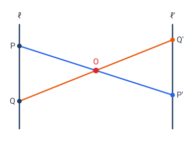
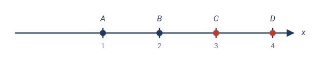
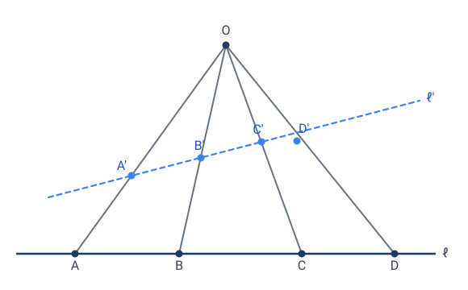
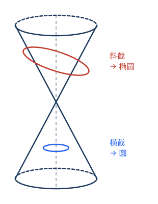
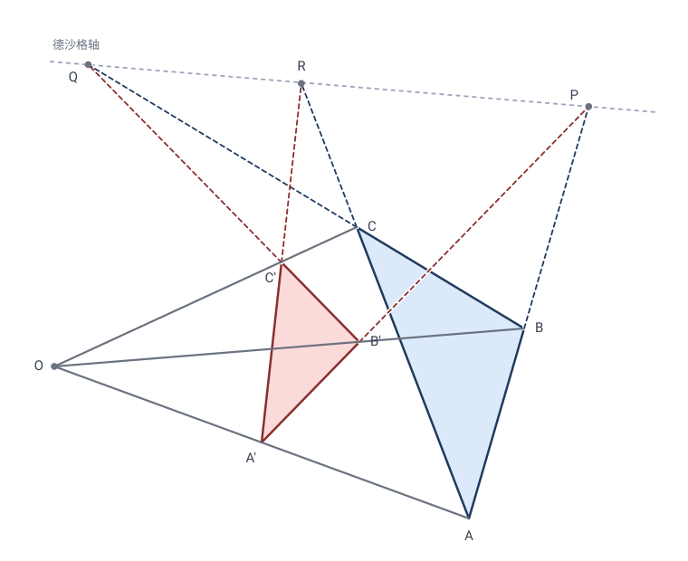

# 第 5 章 · 射影几何：最"暴力"的变换，最"隐蔽"的不变量

前面几章的变换（等距、相似、仿射）都还"客气"——至少把直线映成直线、把平行映成平行。本章的**射影变换**彻底放飞：它是**从一个点出发的投影**，可以把平行线投成相交线，把圆投成抛物线。

但奇迹在于：哪怕这么狂野的变换，仍有**一个**量顽强地保持不变——它叫**交比**。整个射影几何，就是围绕这一个不变量展开的。

---

## 5.1 从画家的透视说起

想象你站在铁轨中间往前看。两条平行的铁轨，在你的视野里**汇交到远处地平线上的一个点**（"灭点"）。

这是怎么回事？因为**光线**从铁轨上的点出发，射进你的眼睛（视点）。你的"视野"是这些光线穿过的一个面（比如视网膜，或一块画布）。把铁轨上的每个点，沿"点 → 视点"的连线，投到画布上——这就是**中心投影**。

中心投影 $\mathbf{T}$ 的精确定义：固定视点 $O$，把每个点 $P$ 沿直线 $OP$ 投到某个目标平面 $\Pi'$ 上（$P'$ 是 $OP$ 与 $\Pi'$ 的交点）。

> 🎯 **射影变换**（projective transformation）= 任意有限次中心投影的复合。

它干的事，和"透视绘画"完全一样。德沙格和帕斯卡正是从透视法里抽象出了这门几何。

### 中心投影破坏了什么

把一个棋盘格（两组平行线）从视点投到斜面上：

- **平行线投成了相交线**（消失点）。
- **等距的格点投成了不等距**（近大远小）。
- **直角投成了任意角**。
- **圆投成了椭圆 / 抛物线 / 双曲线**（取决于投到多斜的面）。

平行没了、角没了、距离没了、连"圆"都没了。还剩什么？

> 🤔 **德沙格之问**：在中心投影下，**到底什么性质幸存下来**？

答案是：**共线**（三个在一条直线上的点，投完还在一条直线上），以及一个深藏不露的量——**交比**。

---

## 5.2 一维上的故事：直线上四个点的"交比"

射影几何的不变量，先在最简单的情形——**一条直线上的四个点**——登场。

设直线上四个点 $A,B,C,D$（按某个顺序）。定义它们的**交比**（cross ratio）：

$$\boxed{\;(A,B;\,C,D) \;=\; \frac{AC/BC}{AD/BD}\;}$$

其中 $AC,BC,AD,BD$ 是**有向线段长度**（带正负号）。

> 💡 怎么记这个公式？四个点 $A,B$ 是"基准对"，$C,D$ 是"插入对"。交比 = "$C$ 分 $AB$ 的比" ÷ "$D$ 分 $AB$ 的比"。它是"两个分点位置"的对比。

### 手算交比

> ✏️ **例 1**：实数轴上四点 $A=1,B=2,C=3,D=4$。
> $$AC=3-1=2,\;BC=3-2=1,\;AD=4-1=3,\;BD=4-2=2.$$
> $$(1,2;3,4)=\frac{2/1}{3/2}=\frac{2}{3/2}=\frac{4}{3}.$$

> ✏️ **例 2**：四点均匀分布 $A=0,B=1,C=2,D=3$。
> $$(0,1;2,3)=\frac{(2-0)/(2-1)}{(3-0)/(3-1)}=\frac{2/1}{3/2}=\frac{4}{3}.$$
> 注意：均匀四点的交比**总是** $4/3$（不管刻度怎么标）——这是个"形状特征"。

> ✏️ **例 3**：四点 $A=0,B=1,C=1,D=2$ 不行——$C=B$ 时 $BC=0$，交比无穷（退化）。这告诉我们交比"怕重合"。

---

## 5.3 ⭐ 核心定理：交比是射影不变量

> **定理**：在中心投影下，一条直线上四点的**交比不变**。

这是射影几何的**灵魂定理**。距离变了、间隔变了、顺序可能都看不清了——但交比岿然不动。

### 手算验证（最有力的一击）

让我们**真算一遍**，看交比怎么顶住一个射影变换。

取射影变换 $x\mapsto\dfrac{1}{x}$（这是从原点出发的一个投影在数轴上的诱导公式，是典型的射影变换）。它把

$$1 \mapsto 1,\quad 2 \mapsto \tfrac12,\quad 3 \mapsto \tfrac13,\quad 4 \mapsto \tfrac14.$$

四个点的间距**全变了**（$1$ 到 $2$ 原本间隔 $1$，现在 $1$ 到 $\frac12$ 间隔 $\frac12$）。交比呢？

$$\begin{aligned}
(1,\tfrac12;\,\tfrac13,\tfrac14)
&= \frac{(\tfrac13-1)/(\tfrac13-\tfrac12)}{(\tfrac14-1)/(\tfrac14-\tfrac12)}\\[2mm]
&= \frac{(-\tfrac23)/(-\tfrac16)}{(-\tfrac34)/(-\tfrac14)}\\[2mm]
&= \frac{\;(-\tfrac23)\cdot(-6)\;}{\;(-\tfrac34)\cdot(-4)\;}
= \frac{4}{3}.\quad\checkmark
\end{aligned}$$

**变换前是 $\frac43$，变换后还是 $\frac43$！** 哪怕每个点都跑到了新位置、间距全乱，这个比值纹丝不动。

这就是不变量的威力——它是藏在表象之下的"**真正的几何量**"。距离是"幻觉"（投影会骗你），交比才是"真实"。

> 💡 **哲学时刻**：射影几何告诉我们——**不要相信眼睛看到的距离和角度**（它们会被投影扭曲），要找那个**投影扭曲不了的东西**。交比就是这种东西。这种"剥去表象、找不变内核"的思维方式，是现代数学的灵魂。

### ⭐ 为什么交比不变？（严格证明）

> **定理**：设直线 $\ell$ 上四点 $A,B,C,D$ 从视点 $O$ 中心投影到另一条直线 $\ell'$ 上，得到 $A',B',C',D'$，则
> $$(A,B;\,C,D)=(A',B';\,C',D').$$

**证明的关键想法**：把"距离的比"重新表达成"**视点 $O$ 处夹角的正弦比**"——而这个角只取决于**光束** $OA,OB,OC,OD$ 的形状，与你把光束截在 $\ell$ 还是 $\ell'$ 上无关。

设 $h$ 为 $O$ 到 $\ell$ 的距离。对 $\ell$ 上任意两点 $X,Y$，三角形 $\triangle OXY$ 的面积有两种算法（以 $XY$ 为底，或以 $O$ 处两边为邻边）：

$$2[\triangle OXY]\;=\;h\cdot|XY|\;=\;|OX|\cdot|OY|\cdot\sin\angle XOY,$$

所以
$$|XY|=\frac{|OX|\cdot|OY|\cdot\sin\angle XOY}{h}.$$

把它代入交比定义里的四个长度：

$$\frac{AC}{BC}=\frac{|OA|\cdot\sin\angle AOC}{|OB|\cdot\sin\angle BOC},\qquad \frac{AD}{BD}=\frac{|OA|\cdot\sin\angle AOD}{|OB|\cdot\sin\angle BOD}.$$

两式相除，$|OA|,|OB|$ 被约掉，得到交比的**角表达式**：

$$\boxed{\;(A,B;\,C,D)\;=\;\frac{\sin\angle AOC\,/\,\sin\angle BOC}{\sin\angle AOD\,/\,\sin\angle BOD}.\;}$$

右端**只含 $O$ 处的四个角** $\angle AOC,\angle BOC,\angle AOD,\angle BOD$。

现在对 $\ell'$ 上的像 $A',B',C',D'$ 重复同样的推导（把 $h$ 换成 $O$ 到 $\ell'$ 的距离 $h'$），得到一模一样的角表达式，只是 $A,B,C,D$ 换成 $A',B',C',D'$。

但中心投影的定义告诉我们：$A'$ 在光线 $OA$ 上、$C'$ 在光线 $OC$ 上——所以 $\angle A'OC'$ **就是** $\angle AOC$（同一束光，夹角没变！）。其余三个角同理。于是两个角表达式**逐项相等**：

$$(A',B';\,C',D')=\frac{\sin\angle AOC\,/\,\sin\angle BOC}{\sin\angle AOD\,/\,\sin\angle BOD}=(A,B;\,C,D).\qquad\square$$

> 💡 **证明的精髓**：交比表面上是 $\ell$ 上"距离的比"，骨子里却是"光束角正弦的比"——后者是**光束的内禀属性**，与你在哪儿截取它无关。这正是"不变量"最深刻的含义：**变的是表象（距离），不变的是本质（光束形状）**。射影几何的整套理论，几乎都是从这一个证明里长出来的。

### 为什么只有交比？（深刻）

直线上的射影变换有 3 个自由度（由 3 对点的对应完全决定）。所以"4 个点里，真正独立的射影信息只有 $4-3=1$ 个"——这一个，就是交比。**4 个点 → 减去 3 个自由度 → 剩 1 个不变量 = 交比。** 这是"自由度计数"的经典推理，也是为什么交比"恰好"是唯一的射影不变量。

---

## 5.4 射影平面与"无穷远点"

中心投影有个麻烦：如果光线 $OP$ **平行于**目标面 $\Pi'$，那 $P$ 没有像（光线不穿过 $\Pi'$）。铁轨的"灭点"就是这种——平行铁轨投到画布上"消失在无穷远"。

为了让投影**永远有定义**，数学家给平面"补"上了一批**无穷远点**：

- 每个方向（每族平行线）配上**一个**无穷远点，作为这族平行线的"公共交点"。
- 所有方向的无穷远点组成一条**无穷远直线**。

补完之后得到**射影平面** $\mathbb{P}^2$。在它里面：

- **任意两条直线都相交**（平行线在无穷远点相交，不平行线在普通点相交）。
- 投影永远有定义，没有"特例"。

### 齐次坐标：处理无穷远的工具

普通平面点 $(x,y)$ 在射影平面里写成 $(x:y:1)$。一般地，**射影点**用三元组 $(X:Y:Z)$ 表示，且**成比例的三元组是同一点**：
$$(X:Y:Z)=(\lambda X:\lambda Y:\lambda Z),\quad \lambda\ne0.$$

- $Z\ne0$：是普通点 $(X/Z,\,Y/Z)$；
- $Z=0$：是**无穷远点**，代表"$(X:Y)$ 方向"。

> ✏️ **手算**：$(2:4:2)=(1:2:1)$ 是普通点 $(1,2)$。$(1:1:0)$ 是"斜率 1 方向"的无穷远点（所有 $y=x+b$ 这族平行线的公共点）。

射影变换在齐次坐标下极其干净：**就是一个 $3\times3$ 可逆矩阵**
$$(X:Y:Z)\;\mapsto\;\begin{pmatrix}a&b&c\\d&e&f\\g&h&i\end{pmatrix}(X:Y:Z).$$

仿射变换是它的特例（矩阵最后一行是 $(0\;0\;1)$）。射影变换多了那两个自由度 $g,h$，正是它们制造了"灭点"效应。

---

## 5.5 ⭐ 圆锥曲线的统一：投影把三类曲线合一

中学里椭圆、抛物线、双曲线是三件分开的事。射影几何一句话：**它们是同一个东西。**

> **定理**：在射影几何里，**所有非退化圆锥曲线都等价**——任何一个都是某个圆的中心投影。

物理图像：拿一个**圆锥**（双顶对顶的无限锥面），用不同角度的平面去截：

- 截面垂直于轴 → **圆**；
- 稍稍倾斜 → **椭圆**；
- 倾斜到**平行于一条母线** → **抛物线**；
- 更陡，截面穿过两个锥叶 → **双曲线**。

这四种曲线，**本质上是同一个圆锥的不同截面**——也就是同一个射影对象（圆锥上的"圆截线"）在不同平面上的投影。

### 为什么它们射影等价？（证明思路）

设圆锥顶点为 $V$。取一个**垂直于轴**的截面，截出一个圆 $c$（称为"圆截线"）。现在任取另一个截面 $\Pi$，它与圆锥面的交线记为 $\gamma$。

**关键观察**：$\gamma$ 上每一点 $P'$ 都在某条母线 $VQ$（$Q\in c$）上——因为 $\gamma$ 在圆锥面上，而圆锥面正是所有母线 $VQ$ 扫出来的。所以 $P' = VQ \cap \Pi$。

但"$VQ \cap \Pi$"恰恰是把圆 $c$ 上的点 $Q$、从视点 $V$、**中心投影**到平面 $\Pi$ 的像。因此：

> $\gamma$ = 圆 $c$ 从顶点 $V$ 到平面 $\Pi$ 的中心投影。

而中心投影就是射影变换。所以**任何圆锥曲线都是某个圆的射影像**——它们在射影几何里全部等价。$\square$

> 💡 **补注（Dandelin 球）**：上面证明了"射影等价"，但没说明 $\gamma$ 具体是椭圆、抛物线还是双曲线。判定它的经典工具是 **Dandelin 球**——在圆锥与截面之间塞入恰好同时切于两者的球，切点就是圆雉曲线的**焦点**；由切线长相等，可导出椭圆"到两焦点距离之和为常数"、双曲线"距离差为常数"、抛物线"到焦点与到准线等距"等定义。何时是哪种，取决于截面与母线的相对倾斜。

> 💡 **这意味着什么**：抛物线和双曲线不是椭圆的"另类"，而是椭圆（圆）在"无穷远"处的**不同遭遇**——椭圆不碰无穷远直线、抛物线**相切**于无穷远直线、双曲线**相交**于无穷远直线两点。三者的差别，全在"它们如何接触无穷远"。**射影几何让三类曲线在无穷远统一。**

---

## 5.6 射影几何的招牌定理：德沙格定理与帕普斯定理

射影几何有大批"只涉及共线、共点"的定理——它们**不提长度、不提角度、不提平行**，所以在中心投影下永远成立。这就是射影定理的特征：**只谈"结合关系"（谁在谁的线上）。**

### 德沙格定理（Desargues, 1648）

> 平面上两个三角形，如果**三对对应顶点的连线交于一点**，那么**三对对应边的交点共线**（反之亦然）。

（图中三条蓝边与对应红边的交点会落在同一条直线上，这条线就是**德沙格轴**；上图轴的位置为示意。）

这个定理在 3D 里几乎是显然的（两个三角形是两个不同平面截同一个"三棱锥"），平面情形靠"提升到 3D 再投影下来"证明——这是射影几何的典型手法。**德沙格定理只谈点和线的结合，完全不动距离角度，所以它是真正的射影定理。**

### 帕普斯定理（Pappus, 约公元 300 年）

> 两条直线上各取三点 $A,B,C$ 和 $A',B',C'$。三对"交叉连线" $AB'\cap A'B$、$AC'\cap A'C$、$BC'\cap B'C$ **共线**。

这两个定理（加上交比）是射影几何的基石。注意它们**完全没有数字**——纯靠"谁在谁的线上"叙述。这正是射影几何的"**无度量**"本色。

---

## 5.7 射影几何的不变量清单

| 性质 | 射影变换下 |
|---|:-:|
| 共线 / 共点 | ✓ |
| **交比** | ✓ **（唯一的核心不变量）** |
| 圆锥曲线（作为一类） | ✓ |
| 平行 | ✗（平行线会相交） |
| 角度、长度、面积 | ✗ |
| "圆" | ✗（圆变抛物线 / 双曲线） |

射影几何是**最"贫乏"也最"普适"**的经典几何：不变量最少（基本只有交比和结合关系），但结论适用于一切投影——所以绘画、摄影、计算机视觉里的"灭点校正"全靠它。

下一章我们看一种**特殊**的变换——反演，它能把直线变圆，是"保角"的典范。

下一章：[06-反演变换.md](06-反演变换.md)

---

## 🧩 本章习题

**题 5.1（手算）算交比。** 实数轴上四点 $0,1,3,7$，求交比 $(0,1;3,7)$。
*答*：$\dfrac{(3-0)/(3-1)}{(7-0)/(7-1)}=\dfrac{3/2}{7/6}=\dfrac{3}{2}\cdot\dfrac67=\dfrac97$。

**题 5.2（手算）验证不变。** 对上题四点施加射影变换 $x\mapsto\dfrac{1}{x+1}$（注意先把 $0,1,3,7$ 映成 $1,\frac12,\frac14,\frac18$），重新算交比，验证仍是 $\frac97$。
*答*：四像为 $1,\frac12,\frac14,\frac18$。
$\dfrac{(\frac14-1)/(\frac14-\frac12)}{(\frac18-1)/(\frac18-\frac12)}=\dfrac{(-\frac34)/(-\frac14)}{(-\frac78)/(-\frac38)}=\dfrac{3}{7/3}=\dfrac97$。✓

**题 5.3（思考）交比的对称。** 交换 $A,B$，交比 $(B,A;C,D)$ 变成什么？提示：与原值的关系是 $\lambda,\dfrac1\lambda,1-\lambda,\dfrac1{1-\lambda}$ 等几个值之一。四点的 24 种排列只产生 **6** 个不同的交比值。
*答*：$(B,A;C,D)=1/(A,B;C,D)$。所以交比 $\lambda$ 在排列下只取 $\{\lambda,\frac1\lambda,1-\lambda,\frac1{1-\lambda},\frac{\lambda-1}{\lambda},\frac{\lambda}{\lambda-1}\}$ 这 6 个值。

**题 5.4（概念）调和点列。** 交比 $=-1$ 的四点叫**调和点列**。验证 $A=0,B=1$ 时，求 $C,D$ 使 $(0,1;C,D)=-1$（取 $C=\frac12$ 求 $D$）。
*答*：$\dfrac{(C-0)/(C-1)}{(D-0)/(D-1)}=-1$。代入 $C=\frac12$：$\dfrac{(1/2)/(-1/2)}{D/(D-1)}=\dfrac{-1}{D/(D-1)}=-1$，得 $\dfrac{D}{D-1}=1$，无有限解——实际上 $C=\frac12$ 时 $D$ 须为无穷远点。改取 $C=2$：$\dfrac{2/1}{D/(D-1)}=-1\Rightarrow\dfrac{2(D-1)}{D}=-1\Rightarrow 2D-2=-D\Rightarrow D=\frac23$。验证 $(0,1;2,\frac23)=\dfrac{2/1}{(2/3)/(-1/3)}=\dfrac{2}{-2}=-1$ ✓。调和点列在射影几何里扮演"中点"的角色。

**题 5.5（应用）灭点测距。** 一张照片里，已知铁轨上四个等距的枕木（实际等距，交比 $=4/3$），照片上量出它们的像的位置。如何反推相机的朝向？提示：用"实际交比 = 像交比"列方程。
*讨论*：这正是计算机视觉"由单幅图像恢复三维结构"的数学基础——交比是把 2D 照片和 3D 现实连起来的桥梁。
