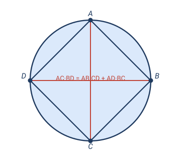
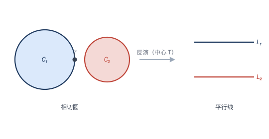
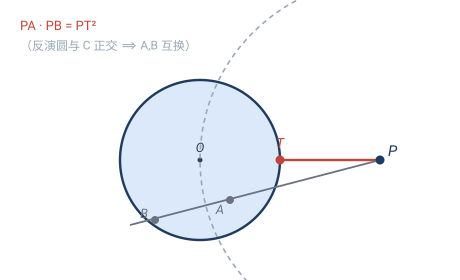
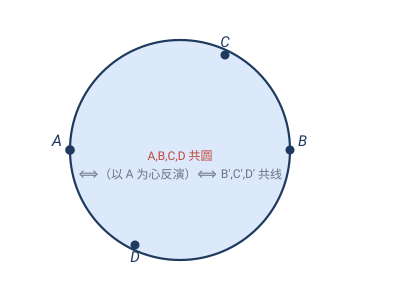

# 第 6 章 · 经典习题：反演变换的应用

> 反演的招牌是"**直线 ↔ 圆**"和"**保角（保相切）**"。它的解题套路是：**选一个巧妙的反演中心，把乱七八糟的圆翻成整齐的直线/同心圆，问题瞬间塌缩，解完再翻回去**。下面 5 题都用这个套路。

> 📌 每道题标了它依赖的章节。

---

## 题 1 · 反演的距离公式（6.1 坐标公式）

> 🔖 **用到**：6.1 节单位圆反演 $z\mapsto 1/\bar z$。

证明：单位圆反演下，任两点 $A,B$ 的像 $A',B'$ 满足
$$|A'B'|=\frac{|AB|}{|OA|\cdot|OB|}.$$

> 💡 **关键**：反演不保距，但距离**按一个可算的公式**变形——这是用反演做计算的基石。

**证**：用复数。设 $A=a,\,B=b$（复数），则 $A'=1/\bar a,\,B'=1/\bar b$。
$$|A'B'|=\left|\frac1{\bar a}-\frac1{\bar b}\right|=\left|\frac{\bar b-\bar a}{\bar a\,\bar b}\right|=\frac{|\,\overline{b-a}\,|}{|a|\cdot|b|}=\frac{|AB|}{|OA|\cdot|OB|}.\quad\square$$

> ✏️ **手算**：$A=(2,0),B=(0,2)$。$|AB|=2\sqrt2$，$|OA|=|OB|=2$，故 $|A'B'|=\dfrac{2\sqrt2}{4}=\dfrac{\sqrt2}{2}$。直接算 $A'=(\tfrac12,0),B'=(0,\tfrac12)$，$|A'B'|=\sqrt{\tfrac14+\tfrac14}=\tfrac{\sqrt2}{2}$ ✓。
>
> 点睛：这个公式把"反演像的距离"还原成"原距离除以两个原半径"——后面托勒密、切割线全靠它。

---

## 题 2 · 托勒密定理（6.2 直线 ↔ 圆）

> 🔖 **用到**：6.2 节——过反演中心的圆反演成直线；加题 1 的距离公式。

证明**托勒密定理**：圆内接四边形 $ABCD$（顶点按圆周顺序），对角线之积等于对边之积之和：
$$AC\cdot BD=AB\cdot CD+AD\cdot BC.$$

> 💡 **关键**：硬证要用相似三角形反复导。反演证法**一行思路**——把外接圆（过 $A$）反演成直线，四边形塌成三点共线，"对角线积 = 对边积和"自动变成"线段相加"。

**证**：以 $A$ 为反演中心、任意半径 $R$ 反演。外接圆过 $A$，故反演成一条**不过 $A$ 的直线**（6.2(d)）。$B,C,D$ 落到这条直线上，记为 $B',C',D'$（共线，且 $C'$ 在 $B',D'$ 之间）。于是
$$|B'C'|+|C'D'|=|B'D'|.$$
用题 1 的距离公式 $|X'Y'|=\dfrac{R^2\,|XY|}{|AX|\cdot|AY|}$ 代入三项：
$$\frac{R^2|BC|}{|AB||AC|}+\frac{R^2|CD|}{|AC||AD|}=\frac{R^2|BD|}{|AB||AD|}.$$
两边乘 $\dfrac{|AB||AC||AD|}{R^2}$：
$$|BC|\cdot|AD|+|CD|\cdot|AB|=|BD|\cdot|AC|,$$
即 $AC\cdot BD=AB\cdot CD+AD\cdot BC$。$\square$

> ✏️ **点睛**：反演把"圆内接四边形"变成"三点共线"，托勒密不等式瞬间变成线段加法。这是反演解题的典范——**把曲线问题翻成直线问题**。（另一经典证法用**相似变换**：造一对相似、靠"手拉手"白捡第二对、再加三角不等式，见 [03 · 习题 6](03-相似变换-习题.md)。同一定理，两种变换各显神通。）

---

## 题 3 · 两个相切圆 → 两条平行直线（6.2 + 6.3）

> 🔖 **用到**：6.2 过中心的圆变直线；6.3 保角。

两个圆 $C_1,C_2$ 相切于点 $T$。证明：存在一个反演，把它们同时变成**两条平行直线**。

**证**：取**切点 $T$ 为反演中心**（任取半径）。因 $C_1,C_2$ 都过 $T$，由 6.2(d) 它们反演后都变成**不过 $T$ 的直线** $L_1,L_2$。

又 $C_1,C_2$ 在 $T$ 处**相切**（即在该点夹角为 $0$，共切线）。反演保角（6.3），所以 $L_1,L_2$ 的夹角也是 $0$——即 $L_1\parallel L_2$。$\square$

> ✏️ **应用**：一串两两相切的圆（"圆链"，如阿波罗尼斯垫片、帕普斯链），把反演中心选在公共切点，整串圆翻成一串**等距平行线**——原本要逐个求半径的难题，变成"平行线间距"的简单算术。这就是 6.5 元思想"翻到顺手位置"的实战。

---

## 题 4 · 切割线定理（6.3 保角 + 6.4 正交圆）

> 🔖 **用到**：6.3 保角；6.4 "两圆正交 ⟺ 反演互保"。

证明**切割线定理**：圆 $C$ 外一点 $P$，$PT$ 是切线（$T$ 为切点），$PAB$ 是任一割线（交 $C$ 于 $A,B$），则
$$PA\cdot PB=PT^2.$$

> 💡 **关键**：取一个**特殊的反演**——以 $P$ 为心、$PT$ 为半径。它"恰好"与圆 $C$ 正交，于是 $C$ 反演成自身，割线两端 $A,B$ 互为反演像。

**证**：以 $P$ 为反演中心、**半径 $PT$** 作反演 $\mathcal{I}$。
- $PT$ 是 $C$ 的切线 ⟹ $PT\perp OT$（$O$ 是 $C$ 的圆心）。故 $|PO|^2=|PT|^2+|OT|^2$（勾股），这恰好是"反演圆 $\mathcal{I}$ 与 $C$ **正交**"的条件（圆心距² = 两半径平方和）。
- 两圆正交 ⟹ $\mathcal{I}$ 把 $C$ **映成自身**（$C$ 上每点反演后仍在 $C$ 上）。
- 割线 $PAB$ 过反演中心 $P$，反演后仍是**同一条直线**。线上 $A,B$ 都在 $C$ 上 ⟹ 像仍在此直线与 $C$ 的交点上，即 $A,B$ 互为反演像：$\mathcal{I}(A)=B$。

由反演定义 $|PA|\cdot|P\,\mathcal{I}(A)|=|PT|^2$，即
$$PA\cdot PB=PT^2.\quad\square$$

> ✏️ **点睛**：巧妙之处在于**反演半径选成切线长**——这让反演圆与 $C$ 正交，从而 $C$ "不变"、割线两端"互换"。整条定理变成反演定义的一行。相交弦定理、割线定理都同源——它们都是"圆幂"的不同面貌。

---

## 题 5 · 用反演证明四点共圆（6.2 + 6.5）

> 🔖 **用到**：6.2 过中心的圆变直线；6.5 反演的灵活选心。

证明一个通用技巧：**要证四点 $A,B,C,D$ 共圆，只需选 $A$ 为反演中心，证 $B,C,D$ 的反演像 $B',C',D'$ 共线**。

**原理**：过 $A$ 的圆 ⟺ 反演后的直线（6.2(d)，一一对应）。所以
$$A,B,C,D\text{ 共圆（圆过 }A\text{）}\;\Longleftrightarrow\;B',C',D'\text{ 共线}.$$

> 💡 **应用**：把"四点共圆"这种**二维**的判定，降维成"三点共线"——而三点共线往往一眼可看（如三个像都落在某条已知直线上）。

**例（可动手验证）**：取 $A=(0,0)$、$B=(2,0)$、$C=(1,1)$、$D=(1,-1)$。它们共圆吗？以 $A$ 为心、$R=1$ 反演：
$$B'=\tfrac{(2,0)}{4}=(\tfrac12,0),\quad C'=\tfrac{(1,1)}{2}=(\tfrac12,\tfrac12),\quad D'=\tfrac{(1,-1)}{2}=(\tfrac12,-\tfrac12).$$
三个像全在直线 $x=\tfrac12$ 上——**共线**，所以 $A,B,C,D$ **共圆**。✓

> ✏️ **验证**：过 $A,B,C$ 的圆设为 $x^2+y^2+Dx+Ey=0$（过原点无常数项）。代入 $B$：$4+2D=0$，$D=-2$；代入 $C$：$2-2+E=0$，$E=0$。圆为 $x^2+y^2=2x$，代入 $D=(1,-1)$：$1+1-2=0$ ✓。反演给出的答案与直接计算一致。

> ✏️ **点睛**：反演是"共圆 ⟺ 共线"的翻译机——**涉及圆的命题，翻一下变成涉及直线的命题**，而直线总是比圆好处理。这是反演在竞赛几何里被反复使用的根本原因。

---

## 🧠 回顾

| 题 | 用到的第 6 章结论 | 它替你省掉了什么 |
|---|---|---|
| 1 距离公式 | 6.1 坐标公式 | 反演像距离的计算基石 |
| 2 托勒密 | 6.2 圆变直线 + 距离公式 | 反复相似三角形导比例 |
| 3 相切圆→平行线 | 6.2 + 6.3 保角 | 逐个求圆链半径 |
| 4 切割线 | 6.3 + 正交反演 | 割线定理的硬证 |
| 5 共圆判定 | 6.2 + 灵活选心 | 圆的问题降维成直线 |

主线：**选一个巧妙的反演中心，把圆翻成直线、把相切翻成平行、把共圆翻成共线**。反演不像等距/相似/仿射/射影那样"保持某类对象"，它专门负责"互换对象类型"（圆 ↔ 线），所以最擅长把曲线问题直线化。至此第 2–6 章五类变换集齐，下一章爱尔兰根纲领把它们统一。

---

> 📚 返回 [第 6 章 · 反演变换](06-反演变换.md) ｜ [目录](README.md)
