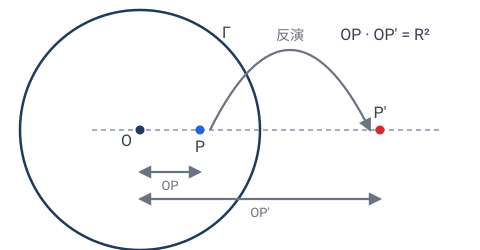
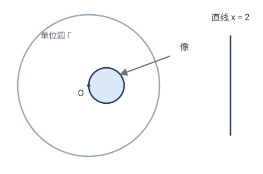

# 第 6 章 · 反演变换：把直线变圆的魔法

前面几章的变换都是"直线映成直线"的（线性或射影）。本章的反演是个**异数**：它能把**直线变成圆**、把**圆变成直线**。它来自复分析和"保角映射"的世界，是几何工具箱里最神奇的扳手之一。

---

## 6.1 什么是反演

固定一个圆 $\Gamma$（圆心 $O$、半径 $R$）。圆内一点 $P$ 沿射线 $OP$ "弹"到圆外对应位置 $P'$，使得

$$\boxed{\;OP\cdot OP' = R^2.\;}$$

这就是关于圆 $\Gamma$ 的**反演**（inversion），记 $\mathbf{I}_\Gamma$。

直观上：反演把"靠近圆心"的点推到"远离圆心"，反之亦然，**圆周上的点不动**，圆心和"无穷远"互换。

### 坐标公式（单位圆）

最常用的是**关于单位圆**（$O$ 为原点，$R=1$）的反演。点 $(x,y)$ 沿原点方向"弹"，距离从 $r$ 变成 $1/r$（因为 $r\cdot r'=1$），方向不变：

$$\boxed{\;\mathbf{I}(x,y)=\frac{(x,y)}{x^2+y^2}=\left(\frac{x}{x^2+y^2},\;\frac{y}{x^2+y^2}\right).\;}$$

用复数写更优雅：$z\mapsto\dfrac{1}{\bar z}$（取倒数 + 共轭；共轭是为了保证"沿原射线方向"，因为 $1/\bar z$ 与 $z$ 同幅角）。

> ✏️ **手算几个点**（单位圆反演）：
> - $(2,0)$：$r^2=4$，$\mapsto(2/4,0)=(\tfrac12,0)$。点从距原点 $2$ 弹到 $\frac12$，$2\times\frac12=1=R^2$ ✓。
> - $(1,1)$：$r^2=2$，$\mapsto(\tfrac12,\tfrac12)$。距离 $\sqrt2\to\frac{1}{\sqrt2}$，$\sqrt2\cdot\frac1{\sqrt2}=1$ ✓。
> - $(1,0)$（在圆周上）：$\mapsto(1,0)$，不动 ✓。
> - 原点 $(0,0)$：无定义（"弹到无穷远"）。这正是反演在无穷远点处的奇点。

---

## 6.2 ⭐ 反演的招牌绝活：直线 ↔ 圆

反演最反直觉也最强大的性质：

> **定理**：
> (a) 过反演中心 $O$ 的**直线**，反演后仍是**过 $O$ 的直线**；
> (b) 不过 $O$ 的**直线**，反演后变成**过 $O$ 的圆**；
> (c) 不过 $O$ 的**圆**，反演后变成**不过 $O$ 的圆**；
> (d) 过 $O$ 的**圆**，反演后变成**不过 $O$ 的直线**。

一句话：**直线和圆在反演下互通**（取决于是否过中心）。

### 手算验证 (b)：直线 $x=2$ 反演成圆

直线 $x=2$ 不过原点。其上点形如 $(2,t)$，$t\in\mathbb{R}$。反演：
$$(u,v)=\left(\frac{2}{4+t^2},\;\frac{t}{4+t^2}\right).$$

我们来消去 $t$，找 $(u,v)$ 满足的方程。注意
$$u^2+v^2=\frac{4+t^2}{(4+t^2)^2}=\frac{1}{4+t^2},\qquad \frac{u}{2}=\frac{1}{4+t^2}.$$
所以 $u^2+v^2=\dfrac{u}{2}$，整理：
$$u^2-\tfrac12 u+v^2=0\;\Longrightarrow\;\left(u-\tfrac14\right)^2+v^2=\tfrac{1}{16}.$$

这是**圆心 $(\frac14,0)$、半径 $\frac14$ 的圆**！而且它**过原点**（代入 $(0,0)$ 成立）。

> ✏️ **验证端点**：直线 $x=2$ 上的 $(2,0)$ 反演成 $(\frac12,0)$，应在圆上：$(\frac12-\frac14)^2+0=(\frac14)^2$ ✓。直线"跑向无穷"的点（$t\to\infty$），反演 $\to(0,0)$——所以圆经过原点，正是直线"无穷远端"被反演拉回来的结果。✓

### 直观理解

- **过中心的直线**：直线上每点都在过 $O$ 的射线上，反演只是把它沿射线挪位置，仍在该射线上 → 仍是直线。
- **不过中心的直线**：离 $O$ 越远的点，反演后越靠近 $O$；最近的点（垂足）反演后最远。这些像点描出一条"闭合"的曲线——一个过 $O$ 的圆。
- **过中心的圆**：圆上离 $O$ 近的弧反演成远弧，整个圆"展开"成一条不过 $O$ 的直线。

### 一般证明（坐标法）

上面只验证了一条具体直线 $x=2$。下面证**任意**不过中心的直线都反演成过中心的圆。

设反演圆是单位圆（$O$ 为原点）。不过原点的直线总可写成（把方程 $ax+by+c=0$ 除以 $-c\ne0$）：
$$\alpha x+\beta y=1 \qquad (\alpha,\beta \text{ 不全为 }0).$$

反演 $(x,y)\mapsto(u,v)=\dfrac{(x,y)}{x^2+y^2}$ 是**自逆**的（做两次回到原处），所以逆变换同为 $x=\dfrac{u}{u^2+v^2},\;y=\dfrac{v}{u^2+v^2}$。代入直线方程：
$$\alpha\cdot\frac{u}{u^2+v^2}+\beta\cdot\frac{v}{u^2+v^2}=1 \;\Longrightarrow\; \alpha u+\beta v=u^2+v^2.$$

整理成圆的标准方程：
$$\left(u-\frac{\alpha}{2}\right)^2+\left(v-\frac{\beta}{2}\right)^2=\frac{\alpha^2+\beta^2}{4}.$$

这是**圆心 $\bigl(\tfrac{\alpha}{2},\tfrac{\beta}{2}\bigr)$、半径 $\tfrac{\sqrt{\alpha^2+\beta^2}}{2}$ 的圆**。把 $(0,0)$ 代入成立，所以它**过原点 $O$**。$\square$

> 💡 对照具体例子 $x=2$（即 $\alpha=\tfrac12,\beta=0$）：圆心 $(\tfrac14,0)$、半径 $\tfrac14$——正是上面手算的结果。一般证明把"巧合"变成了"必然"。（其余三条 (a)(c)(d) 同理可用坐标法验证，留作习题。）

> 💡 **思想点**：在反演眼里，"直线"和"圆"不是两类东西，而是**同一类**（都叫"广义圆"），只是看它过不过反演中心。这种"把对立概念统一"的能力，是高级几何的标志。

---

## 6.3 反演保角（反向）

反演**不保距**（它把近的拉远、远的拉近），也**不保直线**。但它保一件大事——**角**。

> **定理**：反演是**保角变换**（conformal）：两条曲线的夹角，等于它们反演后的夹角。但方向**反转**（左手变右手）。

直观证明草图：反演在每点附近"近似于"一个反射 + 放缩，而反射保角、放缩保角，所以夹角不变（只是方向反了）。下面给出**能算**的证明（用复数）。

> **证明（反演保角）**：把单位圆反演写成复数形式 $I(z)=1/\bar z$（取共轭是为保证"沿原射线方向"，见 5.1）。固定一点 $z_0\ne0$，给它一个小位移 $\mathrm{d}z$，看像点怎么动（一阶近似）：
> $$I(z_0+\mathrm{d}z)=\frac{1}{\bar z_0+\overline{\mathrm{d}z}}\approx\frac{1}{\bar z_0}-\frac{\overline{\mathrm{d}z}}{\bar z_0^{\,2}}.$$
> 所以位移 $\mathrm{d}z$ 被映成 $\displaystyle -\frac{1}{\bar z_0^{\,2}}\,\overline{\mathrm{d}z}$。拆成两步看：
> 1. 取共轭 $\mathrm{d}z\mapsto\overline{\mathrm{d}z}$：关于实轴的**反射**——把方向角 $\theta$ 变成 $-\theta$（角的大小不变，方向反转）；
> 2. 乘以 $-\dfrac{1}{\bar z_0^{\,2}}$：一个固定复数，作用是**旋转 + 均匀放缩**（所有方向的幅角同加一个常数、模长同乘一个常数）——同样不改方向之间的夹角。
>
> 两步合起来：每个方向都被转了**同一个**角度（再统一放缩），方向之间的夹角纹丝不动；只是因为共轭，整体方向反转。这正是"**反向保角**"。$\square$
>
> 💡 关键在于：反演在每点的局部线性化形如 $\mathrm{d}z\mapsto(\text{复数})\cdot\overline{\mathrm{d}z}$，即"**反射 × 相似**"。反射和相似都保角，复合保角。其中"$\overline{\mathrm{d}z}$"带来"反向"，"复数乘法"带来"保角"——分工明确。

> ✏️ **手算感受**：两条直线 $y=0$（$x$ 轴）和 $x=0$（$y$ 轴）在原点垂直。它们都过反演中心 $O$，反演后仍是 $y=0$ 和 $x$ 轴，仍然垂直 ✓。再看 $y=0$ 和 $y=x$（夹角 $45°$），都过 $O$，反演后仍是这两条直线，夹角仍 $45°$ ✓。

> 💡 **复分析的视角**：复函数 $z\mapsto 1/z$（去掉共轭）是"解析"的（处处保角，正向）。加上共轭 $z\mapsto 1/\bar z$（反演）则"反向保角"。复分析里一大类**莫比乌斯变换** $z\mapsto\dfrac{az+b}{cz+d}$（$ad-bc\ne0$）正是反演、旋转、放缩、平移的复合——它们全体构成"保圆映射"的精华，是把复杂区域"驯服"成简单区域的法宝。

---

## 6.4 用反演解题：把难问题变简单

反演的实战价值：**它能把"涉及一堆相切圆"的难题，翻成一个简单题**。因为反演保角（保相切），但可以改变圆的"形状、位置、大小"，于是能把乱七八糟的圆变成整齐的（比如全变成直线）。

### 经典：阿波罗尼斯问题

> **问题**：给定三个圆，求作一个圆与它们都相切（古典三大作图难题之一的推广版）。

直接做很难。技巧：选一个合适的反演，把其中两个已知圆"翻成直线"（让反演中心落在它们交点上，则两圆 → 两直线）。于是问题变成："**作一个圆与两条直线和第三个圆都相切**"——这比原题简单得多。做完后，再反演回去（反演保相切），就得到答案。

### 经典：两条平行线 + 一个圆

两条平行直线之间夹一个圆，求与之都相切的圆。把反演中心选在某处，让两条平行线变成**两个相切的圆**——等等，平行线"相交于无穷远"，反演后……总之反演能把"平行"和"相切"互相转化，把问题翻到更顺手的样子。

> 💡 **元思想**：反演解题 = **"找一个变换，把难情形翻成易情形，解完再翻回去"**。这种"先变形、再求解、后还原"的策略，贯穿整个数学（积分里的换元、代数里的配方，都是这个套路）。

---

## 6.5 反演的几何不变量

| 性质 | 反演下 |
|---|:-:|
| **角**（大小） | ✓（反向保角） |
| **相切** | ✓（保角推论） |
| 圆 ↔ 直线（广义圆） | ✓（互换） |
| 距离 | ✗ |
| 直线 → 直线 | ✗（可能变圆） |
| 面积 | ✗ |
| **共线** | ✗（共线三点反演后不一定共线——除非原直线过中心） |

注意最后一行：**反演不保共线**！这点和射影、仿射都不同。所以反演**不是**射影变换（它不属于爱尔兰根纲领里那条经典层级）。它是"保角几何"（共形几何）家族的成员。

---

## 6.6 一个视觉奇观：反演把整个平面"翻个里外"

把一张世界地图（除了原点）做单位圆反演。靠近原点的细节被放大到无穷，远处的国家被压缩到原点附近。结果是另一张"里外翻面"的地图：南极变北极邻居、赤道附近被拉得巨大……但所有**角度**（海岸线的走向、国境线的夹角）都保持原样——所以地图的"局部形状"是对的，只是大小乱了。

这正是地图学里"**保角投影**"（如墨卡托投影）的精神：**牺牲面积，保住角度**，让航海者能画直线航向。反演是这种思想最纯粹的体现。

下一章我们把这些变换**全部**收进一个统一框架——爱尔兰根纲领。

下一章：[07-爱尔兰根纲领-几何的统一.md](07-爱尔兰根纲领-几何的统一.md)

---

## 🧩 本章习题

**题 6.1（手算）反演点。** 单位圆反演下，求下列点的像：$(3,4)$、$(0,5)$、$(\frac35,\frac45)$。
*答*：$(3,4)$，$r^2=25$，$\mapsto(\frac{3}{25},\frac{4}{25})$；$(0,5)\mapsto(0,\frac15)$；$(\frac35,\frac45)$，$r^2=1$，在圆周上，不动 $\mapsto(\frac35,\frac45)$。

**题 6.2（手算）直线变圆。** 单位圆反演下，直线 $y=1$ 变成什么？写出圆心和半径。
*答*：点 $(t,1)$，反演 $(\frac{t}{t^2+1},\frac{1}{t^2+1})$。设 $(u,v)$，则 $u^2+v^2=\frac1{t^2+1}=v$，即 $u^2+(v-\frac12)^2=\frac14$，圆心 $(0,\frac12)$、半径 $\frac12$，过原点。

**题 6.3（思考）圆心反演到哪？** 一个以原点为圆心、半径 $2$ 的圆，反演成什么？
*答*：圆上每点距原点 $2$，反演后距原点 $\frac12$，所以变成**以原点为心、半径 $\frac12$ 的圆**（同心缩小）。一般地，圆心在反演中心的圆，反演成**同心圆**，半径 $r\mapsto R^2/r$。

**题 6.4（应用）切线问题。** 单位圆外有一个圆 $C$（圆心 $(3,0)$，半径 $1$），它与单位圆外切。把整个图形单位圆反演，$C$ 变成什么？它和单位圆（反演不变）的关系如何？
*提示*：$C$ 不过原点（原点在 $C$ 内吗？$(3,0)$ 到原点 $3>1$，原点在 $C$ 外），所以 $C$ 反演成另一个圆。因反演保相切，像圆仍与单位圆**相切**。具体：$C$ 与单位圆切于 $(1,0)$（切点在单位圆周，反演不动），像圆也过 $(1,0)$ 并与单位圆相切。

**题 6.5（进阶）为什么反演保角？** 提示：在每点附近，反演近似为"反射 + 均匀放缩"。反射保角、放缩保角，复合保角。试着计算反演在点 $(1,0)$ 附近的"局部线性化"，看它是否像一个反射乘以某个倍数。
*讨论*：反演的雅可比矩阵在每点都是"正交矩阵 × 标量"，正交矩阵保角，标量放缩保角——所以反演处处保角。这是共形映射的典型特征。
