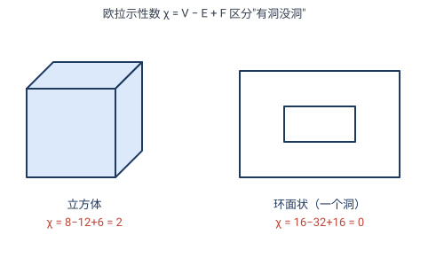

# 第 7 章 · 经典习题：用克莱因纲领看几何

> 第 7 章是"统一"章——它的题不是去解某个图形，而是戴上**变换层级 + 不变量**这副眼镜，重新看清前 6 章。核心训练：**给变换归类、给性质找层级、判断"相同"、用不变量识别对象**。

> 📌 每道题标了它依赖的章节。

---

## 题 1 · 把变换归到正确的几何（7.3 + 7.4）

> 🔖 **用到**：7.3 几何 = 群 + 不变量；7.4 层级 $\mathrm{SO}(2)\subset E(2)\subset\mathrm{Sim}(2)\subset\mathrm{Aff}(2)\subset$ 射影 $\subset$ 同胚。

把下列每个变换归到**最弱**的经典层级（若不在经典层级，注明）：

| 变换 | 归类 |
|---|---|
| (a) $(x,y)\mapsto(x+3,\,y-2)$ | ? |
| (b) $(x,y)\mapsto(2x,\,2y)$ | ? |
| (c) $(x,y)\mapsto(2x,\,y)$ | ? |
| (d) $z\mapsto 1/\bar z$ | ? |
| (e) 从一点中心投影 | ? |

**答**：
- (a) 平移 ⟹ 等距 ⟹ **欧氏**。
- (b) 位似（均匀放缩 $2$）⟹ **相似**（保角、保长度比，不保长度）。
- (c) 横向单拉 ⟹ **仿射**（保平行，不保角）。
- (d) 反演 ⟹ **共形几何**（保角，但**不在**经典层级链里，它是一条独立的线，和射影层级交叉——见正文 7.7 / 题 7.5）。
- (e) 中心投影 ⟹ **射影**（连平行都保不住）。

> ✏️ **点睛**：归类看"它破坏了哪些、保住了哪些"——保距→欧氏，保角→相似及更弱，保平行→仿射及更弱，只保共线→射影，只保角→共形（另起一线）。

---

## 题 2 · 每个性质属于哪一层（7.4 不变量层级）

> 🔖 **用到**：7.4 群越大、不变量越少。

为下列每个几何性质，找出**最弱仍保住它**的经典层级：

| 性质 | 最弱的层 |
|---|---|
| (a) 两点距离 | ? |
| (b) 两线夹角 | ? |
| (c) 两线平行 | ? |
| (d) 三点共线 | ? |
| (e) "是一块"（连通） | ? |

**答**：距离→**欧氏**；角度→**相似**（角是相似不变量）；平行→**仿射**；共线→**射影**（最弱保共线的经典层）；连通→**拓扑**。

> ✏️ **点睛**：每个性质都对应"最弱能保它的群"。**性质越"硬"（越依赖度量），保它的群越小（层级越靠左）；性质越"软"（只谈结构），保它的群越大（层级越靠右）。** 这张表就是克莱因纲领的浓缩。

---

## 题 3 · "相同"是相对的（7.5 同一个问题，五种答案）

> 🔖 **用到**：7.5——"相同 = 存在该级变换互变"，不同层级答案不同。

圆 $C$ 和椭圆 $E$（非圆），在每一级里是否"相同"？第一次"相同"出现在哪一级？

**答**：

| 级别 | 圆与椭圆相同吗？ | 理由 |
|---|---|---|
| 欧氏 | ✗ 不同 | 不等距（椭圆两轴不等） |
| 相似 | ✗ 不同 | 不相似（相似保"圆性"） |
| **仿射** | **✓ 相同** | 横向拉伸把圆变椭圆（第 4 章） |
| 射影 | ✓ 相同 | 仿射是射影子群 |
| 拓扑 | ✓ 相同 | 都是简单闭曲线 |

**首次相同在仿射**。

> ✏️ **点睛**：圆和椭圆"是不是同一个东西"，**取决于你站在哪一级**。在刚体眼里它们天差地别，在拓扑眼里它们毫无区别。**"相同"不是绝对的，是相对于你选的变换群的**——这是爱尔兰根纲领最颠覆日常直觉的结论。

---

## 题 4 · 用欧拉示性数分类多面体（7.5 拓扑不变量）

> 🔖 **用到**：7.5 欧拉示性数 $\chi=V-E+F$ 是拓扑不变量。

计算下列多面体的 $\chi=V-E+F$（顶点数 $-$ 边数 $+$ 面数）：

| 多面体 | $V$ | $E$ | $F$ | $\chi$ |
|---|---|---|---|---|
| (a) 立方体 | 8 | 12 | 6 | ? |
| (b) 八面体 | 6 | 12 | 8 | ? |
| (c) 二十面体 | 12 | 30 | 20 | ? |
| (d) "甜甜圈状"（立方体挖通一个洞） | 16 | 32 | 16 | ? |

**答**：(a) $8-12+6=\mathbf{2}$；(b) $6-12+8=\mathbf{2}$；(c) $12-30+20=\mathbf{2}$；(d) $16-32+16=\mathbf{0}$。

> ✏️ **点睛**：(a)(b)(c) 都是 $\chi=2$——它们拓扑等价于**球面**（没洞）。(d) 是 $\chi=0$——它拓扑等价于**环面**（一个洞）。$\chi$ 是拓扑不变量，**连续变形改不了它**，所以它能区分"有洞没洞"。这就是用"不变量"分类对象的典范：不用细看形状，只看 $\chi$。

---

## 题 5 · 为何 AAA 够相似、却不够等距（7.3 + 2.8）

> 🔖 **用到**：7.3 不变量决定判据；2.8 全等的判据。

用克莱因纲领解释：为什么"角角角"（AAA）是**相似**三角形的判据，却**不够**判定两个三角形**全等**？

**答**：
- **AAA ⟹ 相似**：三个角相等 ⟹ 三角形形状相同。而"角"正是**相似群**的不变量（7.4）。三个角把"形状"（相似意义下的身份）定死，所以 AAA 是相似判据。
- **AAA 够不上等距**：等距群（欧氏）的源不变量是**距离**。AAA 只给角、不给任何一条边长——**完全没有距离信息**。所以存在"角相同但大小不同"的三角形（一个按比例 $k\ne1$ 放缩），它们 AAA 相似但**不全等**。连接它们的是**相似变换**（放缩 $k$），不是等距。

> ✏️ **点睛**：判据的"强弱"完全由**它动用了哪一级的不变量**决定。SSS 动用距离（欧氏不变量）⟹ 欧氏判据；AAA 动用角（相似不变量）⟹ 相似判据。**变换的层级，直接决定了哪些判据成立、哪些不够。** 这是第 2.8 节那段讨论的"纲领版"重述。

---

## 🧠 回顾

| 题 | 训练的核心能力 |
|---|---|
| 1 变换归类 | 看一个变换"破坏什么、保住什么" |
| 2 性质找层 | 每个性质对应最弱保它的群 |
| 3 相对的"相同" | 同一对对象，不同层级不同答案 |
| 4 欧拉示性数 | 用不变量给对象分类 |
| 5 判据的层级 | 不变量决定判据强弱 |

主线：**克莱因纲领 = 一副眼镜**。戴上它，你不再问"这两个图形一样吗"，而问"在哪个变换群下一样"；不再问"这个性质重要吗"，而问"它在哪个层级是不变量"。前 6 章的五种变换（等距、相似、仿射、射影、反演），在这副眼镜下排成一张清晰的层级表。

---

> 📚 返回 [第 7 章 · 爱尔兰根纲领](07-爱尔兰根纲领-几何的统一.md) ｜ [目录](README.md)
