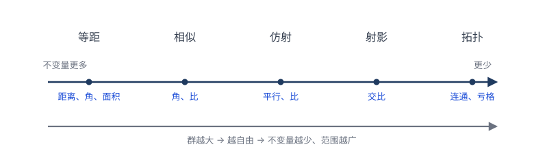
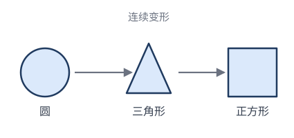

# 第 7 章 · 爱尔兰根纲领：一句话统一全部几何

> 这一章是全书的高潮。前 5 章我们攒了一抽屉的变换——等距、相似、仿射、射影、反演——它们各自"保"一些性质。1872 年，23 岁的克莱因站在这些成果之上，说了一句**把所有几何收进一个公式**的话。

## 7.1 1872 年的几何学：一盘散沙

19 世纪中叶的几何学，是一团**混乱的繁荣**。

- 欧几里得几何还在教；
- 射影几何（德沙格、帕斯卡的后继者，如彭赛列、施泰纳）蓬勃发展，自认比欧氏更"基本"；
- 仿射几何、相似几何各有信徒；
- **非欧几何**（罗巴切夫斯基、波尔约、黎曼）横空出世，动摇了"平行公设"两千年的地位；
- **微分几何**（高斯、黎曼）研究曲面上的几何，方法完全不同；
- 庞大杂乱的"**度量几何**"派系林立。

每派都有自己的概念、定理、教材，彼此**鸡同鸭讲**。一个根本问题悬而未决：

> **到底什么是"一种几何"？凭什么说射影几何和欧氏几何是"两门"几何，而不是同一门的两个部分？**

这个问题不解决，几何学就永远是一堆互不连通的碎片。

## 7.2 克莱因的钥匙：群

年轻克莱因的洞察，借来了一个**30 年前刚诞生的强大工具**——**群**。

群的概念来自**伽罗瓦**（Évariste Galois, 1811–1832，21 岁死于决斗）。伽罗瓦研究"方程什么时候能用根式求解"时发现：关键不在方程本身，而在它的**根的对称性**——根之间可以互相替换而保持代数关系，这些"允许的替换"组成一个**群**（伽罗瓦群）。群的"大小"决定了方程能不能解（这套故事第 8 章细讲）。

> 💡 **回顾：我们早在 2.4 节就见过群了**。那里我们把"全体等距变换"放在一起、配上"复合"运算，逐条验证了封闭、结合、单位、逆——它们构成**等距群 $E(2)$**，还看到子群 $\mathrm{SO}(2)\subset E^{+}(2)\subset E(2)$。所以"群"对读者已经不是新词，记住那句白话定义即可：**一组变换 + 复合运算 + 四条公理（封闭、结合、有恒等、有逆）= 群**。

克莱因的天才不在"发明群"（那是伽罗瓦），而在一次**层次跃迁**：

> **伽罗瓦**：给定一个方程，它的根有什么样的对称群？
> **克莱因**：给定一个**群**，它定义一门**几何**。

换句话说，克莱因把问题**反过来**了——不再问"这个图形有什么对称"，而是**先选一个群 $G$，再问"在 $G$ 的所有变换下，什么不变"**。不同的选择，得到不同的几何：

- 选 $G=E(2)$（等距群）→ 欧氏几何（不变量：距离、角、面积）；
- 选 $G=$ 相似群 → 相似几何（不变量：角、长度比）；
- 选 $G=$ 仿射群 → 仿射几何（不变量：平行、共线比）；
- 选 $G=$ 射影群 → 射影几何（不变量：交比）；
- 选 $G=$ 同胚群 → 拓扑（不变量：连通性、亏格）。

**同一个平面，换一群，就换一门几何。** 这就是下一节"爱尔兰根宣言"的核心。

> ✏️ **一个让人安心的事实**：上面每"一级"变换都**各自成群**——验证方法和 2.4 节对等距做的一样（复合封闭、有恒等、有逆），只是把"保距"换成"保角/保平行/保共线/保连续"。例如两个仿射 $\mathbf{x}\mapsto M_1\mathbf{x}+\mathbf t_1$ 和 $\mathbf{x}\mapsto M_2\mathbf{x}+\mathbf t_2$ 的复合 $\mathbf{x}\mapsto M_2M_1\mathbf{x}+(M_2\mathbf t_1+\mathbf t_2)$ 还是仿射（$M_2M_1$ 仍可逆）。所以每一级几何都有自己的群，群与群之间还一个套一个（第 7.4 节）。

## 7.3 ⭐ 核心宣言：几何 = 群 + 不变量

克莱因在爱尔兰根纲领里给出的，是这样一个**定义**（用现代语言表述）：

> **一种"几何"，由两样东西完全决定**：
> 1. 一个集合 $S$（研究的对象，比如平面上的点）；
> 2. 一个作用在 $S$ 上的**变换群** $G$。
>
> **这门几何要研究的，是 $G$ 的不变量**——也就是那些在 $G$ 的所有变换下都不变的性质。

把不同想法翻译成这个定义：

| 几何 | 集合 $S$ | 变换群 $G$ | 关心不变量 |
|---|---|---|---|
| **欧氏几何** | 平面 | 等距群 | 距离、角、面积 |
| **相似几何** | 平面 | 相似群 | 角、长度比 |
| **仿射几何** | 平面 | 仿射群 | 平行、共线比 |
| **射影几何** | 射影平面 | 射影群 | 交比、共线/共点 |
| **拓扑** | 平面 | 同胚群 | 连通性、亏格、欧拉示性数 |
| **球面几何** | 球面 $S^2$ | 绕球心旋转群 | 大圆距离、球面角 |

> 🎯 **一句话**：**几何学 = 变换群 + 该群的不变量。** 不同的群 → 不同的几何。

注意上表悄悄多了一行——**球面几何**。它提醒我们一个前几章藏起来的事实：**"集合 $S$"不只是平面**。换一片"地"，配一个合适的群，就是一门新几何。最震撼的例子是**非欧几何**：

- **球面几何**（地是球面 $S^2$，群是绕球心的旋转）：球面上的"直线"是**大圆**（如赤道、经线）。三角形内角和 **$>180°$**——而且没有平行线，任何两个大圆都相交。
- **双曲几何**（地是庞加莱圆盘，群是双曲等距变换）："直线"是垂直于边界的圆弧。三角形内角和 **$<180°$**——而且过直线外一点有**无穷多条**平行线。

把欧氏、球面、双曲摆在一起，就是著名的"**非欧三巨头**"：

$$\text{三角形内角和}\;\begin{cases}\;>180° & \text{球面}\\[2pt]\;=180° & \text{欧氏}\\[2pt]\;<180° & \text{双曲}\end{cases}$$

**同一句话**（研究变换群的不变量），换三片地，就得到三种结论截然不同的几何。更妙的是——球面和双曲都"**进得来**"爱尔兰根纲领（它们都有足够大的等距群，见习题 7.4），只有一般弯曲的**黎曼流形**（地太"不均匀"，没有大群）才进不来（见 7.7 节）。所以"换地"的自由度很大，纲领的边界在第 7.7 节。

这一下子解决了 6.1 的混乱：原来"两门几何"的区别，**就是变换群的区别**。射影几何和欧氏几何之所以不同，因为它们的变换群（射影群 vs 等距群）不同。混乱变成了秩序。

### 手算一个例子：欧氏几何的不变量

光看定义还是抽象。我们用**欧氏几何**（$G=$ 等距群 $E(2)$）把"在 $G$ 的所有变换下都不变"这句话每个字都摸到。

**主角**：一个 3-4-5 直角三角形 $\triangle ABC$，$A=(0,0),\; B=(3,0),\; C=(0,4)$。在 $G$ 里挑一个变换——绕原点逆时针旋转 $90°$，即 $(x,y)\mapsto(-y,x)$：

$$A\to A'=(0,0),\quad B\to B'=(0,3),\quad C\to C'=(-4,0)$$

查"边长"——它顶住了吗？

| 边 | 变换前 | 变换后 |
|---|---|---|
| $AB$ | $3$ | $A'B'=3$ ✓ |
| $AC$ | $4$ | $A'C'=4$ ✓ |
| $BC$ | $\sqrt{3^2+4^2}=5$ | $\sqrt{4^2+3^2}=5$ ✓ |

三边纹丝不动。再换 $G$ 里别的成员——平移 $(x,y)\mapsto(x+1,y+2)$、关于 $y$ 轴反射 $(x,y)\mapsto(-x,y)$——边长**还是**不变。**"距离"顶住了 $G$ 里每一个变换**，所以它是 $E(2)$ 的不变量。这就是欧氏几何真正研究的主角。

> ✏️ **反例：光顶住一个变换不算数。** 那"$A$ 到原点的距离"算不变量吗？绕原点旋转 $90°$，$A=(0,0)$ 还在原点，距离 $0$，没变——看起来"不变"。但换一个 $G$ 里的变换：平移 $(x,y)\mapsto(x+1,y)$，$A$ 跑到 $(1,0)$，到原点的距离从 $0$ 变成 $1$。**变了！** 所以"到原点的距离"顶不住 $E(2)$ 里的平移，**不是** $E(2)$ 的不变量——它只是"绕原点旋转群"这个**更小子群**的不变量。

这句话的内涵，全在**"所有"**两个字：

> 不变量不是"在某一个变换下不变"，而是"在 $G$ 里**随便挑哪一个**都不变"。

$G$ 越大（变换越多），能同时顶住的量越少——这就是下一节"群越大，不变量越少"的来历。所以欧氏几何**不关心**"$B$ 的坐标是 $(3,0)$ 还是 $(0,3)$"（这会变），**只关心**"边长 $3$、内角 $90°$、面积 $6$"（这些不变）。**全等判定 SSS** 正是这套思想的结晶：边长这个不变量把三角形在等距群下的"身份"定死了——三边一对上，就存在 $G$ 里的某个变换把两者互变，它们就是"同一个"三角形。

## 7.4 几何的层级：群越大，不变量越少

注意一个关键事实：前面那些群，**一个套一个**（子群关系）：

$$\underbrace{\text{等距群}}_{\text{欧氏}} \;\subset\; \underbrace{\text{相似群}}_{\text{相似}} \;\subset\; \underbrace{\text{仿射群}}_{\text{仿射}} \;\subset\; \underbrace{\text{射影群}}_{\text{射影}} \;\subset\; \underbrace{\text{同胚群}}_{\text{拓扑}}$$

每个群都是后一个的**子群**（更"小"、约束更多）。这件事有深刻推论：

> **群越大（变换越多），不变量越少，但结论越普适（适用范围越广）。**

为什么"群大 ⟹ 不变量少"？因为"不变量"要顶住群里**每一个**变换。群里变换越多，要同时满足的条件越苛刻，能"幸存"的量自然越少。

为什么"不变量少 ⟹ 结论更普适"？因为不变量是**所有这些变换都承认**的性质——变换越多，承认这个性质的范围越广，结论越"放之四海皆准"。

### 一个数轴图

## 7.5 同一个问题，五种答案

理解层级最好的办法，是看**同一个问题在不同几何里**的答案。我们问：**"圆和三角形是同一个东西吗？"**

- **欧氏几何**：当然不同。圆无边、三角形有三边；任何等距都保不住"边数"。
- **相似几何**：仍不同（相似保形，圆还是圆，三角形还是三角形）。
- **仿射几何**：仍不同（仿射把圆变椭圆，但不会变成三角形）。
- **射影几何**：仍不同（射影把圆变椭圆/抛物线/双曲线，但不会变三角形）。
- **拓扑**：**是同一个东西！** 圆和三角形的边界都是一条**简单闭曲线**（不交叉、闭合），可以连续变形（把圆"捏"成三角形）。在拓扑眼里，圆 = 三角形 = 正方形 = 椭圆。

每一次"放宽"（群变大），原本"不同"的东西变得"相同"。

> ✏️ **再看"椭圆和圆"**：
> - 欧氏：不同（不能等距互变）；
> - 仿射：**相同**（拉伸就能互变，第 4 章）；
> - 拓扑：相同（都是闭曲线）。
>
> "相同"还是"不同"，取决于你站在哪一级。

### 拓扑的不变量举例

拓扑是最"狂野"的一级（允许任意连续变形，像揉橡皮泥，只要不撕裂不粘合）。它丢失了几乎所有度量，只剩"**最顽固**"的几个性质：

- **连通性**：一块还是几块？（"0" 连通，"8" 两块相交，"O" 一块有洞）。
- **洞的个数（亏格）**：球面 $0$ 个洞，甜甜圈 $1$ 个洞，双圈 $2$ 个洞。
- **欧拉示性数** $\chi = V-E+F$（顶点数 - 边数 + 面数）。

> ✏️ **欧拉示性数**：立方体 $V{=}8,E{=}12,F{=}6$，$\chi=8-12+6=2$。四面体 $V{=}4,E{=}6,F{=}4$，$\chi=4-6+4=2$。八面体 $V{=}6,E{=}12,F{=}8$，$\chi=6-12+8=2$。**所有"球面状"的多面体，$\chi$ 都是 $2$！** 因为它们拓扑等价于球面。而甜甜圈状的多面体 $\chi=0$。$\chi$ 是拓扑不变量——连续变形改不了它。这是拓扑层级里"交比"级别的基本量。

## 7.6 不变量哲学：剥去表象，留下本质

爱尔兰根纲领背后，是一种深刻的**认识论**：

> **一个东西的"本质"，是它在所有允许的变化下都不变的那部分。表象（会变的）不重要，本质（不变的）才重要。**

这种思想在数学内外都威力巨大：

- **物理学**：一个实验在中国做和在美国做，结果一样（空间平移不变）→ 推出**动量守恒**（诺特定理）。"对称性"↔"守恒律"——这是爱尔兰根纲领思想在物理学的回响（第 9 章详谈）。
- **计算机视觉**：识别一只猫，不管它旋转、缩放、遮挡——要找的是"猫"的**不变特征**，而不是某个特定姿态。
- **不变量理论**（代数）：研究多项式在某些变换下不变的组合，是 19 世纪代数的核心，直接通向现代代数几何。

> 💡 **元思想**：**"找不变量"是一种通用解题/认知策略**——面对一个变化的系统，别盯着变化的部分发愁，去揪住那个"守恒"的量。它往往是问题的钥匙。

## 7.7 纲领的边界：什么没被统一

克莱因的纲领极其成功，但**不是**几何的全部。它统一了"**齐性**"几何（有足够多对称变换的空间），但有两类对象**不在**框架内：

1. **黎曼微分几何**：黎曼研究"任意弯曲"的曲面/空间，它们**没有**大群的对称变换（一般 curved 空间除了恒等变换没别的等距）。克莱因的纲领要求一个大群，所以黎曼几何的"局部"视角**进不去**这个框架。后来（20 世纪，嘉当的"几何子流形"理论）才把两者调和。
2. **代数几何 / 度量数论**：研究方程定义的图形，方法更代数，不和变换群直接挂钩。

所以爱尔兰根纲领是**一座大山，不是全部山脉**。但作为"用变换统一经典几何"的纲领，它至今是几何学的骨架。

## 7.8 历史意义：群征服几何

爱尔兰根纲领的真正分量，在于它标志着**"群"这个概念完成了对数学的全面征服**：

- 1830 伽罗瓦：群征服**代数**（方程论）；
- 1872 克莱因：群征服**几何**（爱尔兰根纲领）；
- 之后：群征服**物理**（晶体、相对论、粒子物理的规范对称）。

"用群来组织一门学科"成了现代数学的范式。一个 23 岁年轻人的就职演讲，定义了之后 150 年几何学的语言。

下一章我们看变换思想最直观的应用——**对称性**：一个图形的"对称"，正是"保持它不变的变换"组成的群。

下一章：[08-对称性与群.md](08-对称性与群.md)

---

## 🧩 本章习题

**题 7.1（概念）分类。** 下列性质分别属于哪一级几何的不变量（从欧氏、相似、仿射、射影、拓扑里选最"弱"的那级）？
(a) 三角形内角和 $180°$；(b) 三点共线；(c) 线段长度；(d) 两条直线平行；(e) 圆的周长；(f) 一条闭曲线把平面分成内外两块（若尔当定理）。
*答*：(a) 相似（角不变量，但长度没了）；(b) 射影（最弱的一级仍保共线）；(c) 欧氏；(d) 仿射；(e) 欧氏；(f) 拓扑。**关键**：把每个性质归到"最弱仍保住它"的那级。

**题 7.2（手算）欧拉示性数。** 计算下列多面体的 $\chi=V-E+F$：(a) 三棱柱；(b) 一个"框"形（四棱柱挖掉中间一个小四棱柱贯通）。
*答*：(a) 三棱柱 $V=6,E=9,F=5,\chi=6-9+5=2$（球面状）。(b) 框形拓扑等价于**甜甜圈**（一个洞），$\chi=0$。数一下：外框 8 顶点 + 内框 8 顶点 = 16；边数较多，但 $V-E+F$ 必等于 $0$（甜甜圈状）。

**题 7.3（思考）"相同"还是"不同"。** 字母 **R** 和字母 **Я**（R 的镜像）在各级几何里是否相同？
*答*：欧氏、相似、仿射、射影里都**不同**（反向等距把 R 变 Я，但这些都是"等距/相似"等变换——等等：镜像反射**是**等距！所以 R 和 Я 在欧氏里**是相同的**，因为存在等距（反射）把它们互变）。**修正**：R 和 Я 在欧氏几何里**相同**（反射是等距）。真正"不同"的是定向，但定向不是欧氏不变量。这道题提醒：判断"相同"要看**有没有**变换连接它们，反射是合法的等距。

**题 7.4（进阶）非欧几何进得了纲领吗？** 球面几何（在球面上，"直线"是大圆）有自己的等距群（绕球心的旋转）。它符合爱尔兰根纲领吗？
*答*：符合。球面几何 = {球面上的点} + {绕球心的旋转群}，不变量是大圆距离、球面角等。非欧的双曲几何也类似（有完整的等距群）。克莱因纲领对**齐性**的非欧几何完全适用；只是对一般弯曲的黎曼流形不适用（见 6.7）。

**题 7.5（开放）反演在哪一级？** 反演保角但不保共线、不保直线。它在爱尔兰根纲领的层级里吗？
*讨论*：反演**不**在经典层级（欧氏⊂相似⊂仿射⊂射影）里——它是"**共形几何**"（保角几何）的成员，对应"莫比乌斯变换群"。共形几何是另一条独立的层级线，和射影层级交叉。这说明变换群的世界比单一层级更丰富。

---

> 📚 **延伸：用克莱因纲领看几何的练习题**（变换归类、性质找层、"相同"的相对性、欧拉示性数分类、判据的层级，共 5 道），见 [07-习题-经典应用.md](07-习题-经典应用.md)。它们不是解某个图形，而是戴上"变换层级 + 不变量"这副眼镜，把前 6 章重新看清。
