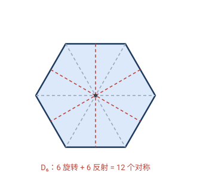
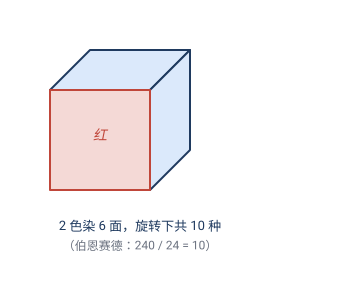
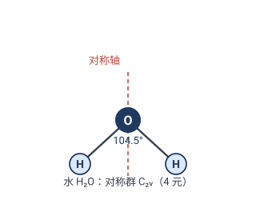

# 第 8 章 · 经典习题：对称性的应用

> 对称 = 保持图形不变的变换。这一节用对称群**数对称**、用伯恩赛德引理**计数**、用对称群**分类物质**、用对称**简化计算**——四件对称群最擅长的事。

> 📌 每道题标了它依赖的章节。

---

## 题 1 · 正六边形的对称群 $D_6$（8.2 + 8.3）

> 🔖 **用到**：8.2 二面体群 $D_n$（$2n$ 个元素）；8.3 正 $n$ 边形对称群。

正六边形有几个对称？写出它的对称群。

**答**：正 $n$ 边形的对称群是二面体群 $D_n$，有 $2n$ 个元素（$n$ 个旋转 $+\;n$ 个反射）。故正六边形的对称群是
$$D_6,\quad |D_6|=2\times6=12\text{ 个}：$$
- **6 个旋转**：$0°,60°,120°,180°,240°,300°$（绕中心）；
- **6 个反射**：3 条**过对角顶**的对称轴 $+\;3$ 条**过对边中点**的对称轴。

> ✏️ **点睛**：$D_6$ 是正六边形（蜂窝、雪花、苯环）的"指纹"。对称越多（$|D_6|=12$），图形越"规整"。

---

## 题 2 · 正方体面染色的不同染法（8.6 伯恩赛德）

> 🔖 **用到**：8.6 伯恩赛德引理——不同对象数 = 群里各变换"固定数"的平均。

正方体的 $6$ 个面染 $2$ 种颜色（红/蓝），**整体旋转视为同一种**，共有几种不同的染色？

> 💡 **关键**：朴素数 $2^6=64$，但旋转会把很多重复掉。正方体旋转群有 $24$ 个元素，用伯恩赛德取平均。

**解**：正方体旋转群有 $24$ 元，分 $5$ 类。对每类，数"被它固定的染色"（即旋转后不变的红蓝分布）：

| 旋转类型 | 元素数 | 面的轮换结构 | 固定染色数 |
|---|---|---|---|
| 恒等 | $1$ | $6$ 面各不动 | $2^6=64$ |
| 绕面心转 $\pm90°$ | $6$（$3$ 轴$\times2$） | 上下面各不动 $+$ 侧面 $4$-循环（共 $3$ 循环） | $2^3=8$ |
| 绕面心转 $180°$ | $3$ | 上下面不动 $+$ 侧面两对对换 | $2^4=16$ |
| 绕对角顶转 $\pm120°$ | $8$（$4$ 对角$\times2$） | 面 $3+3$ 两循环 | $2^2=4$ |
| 绕对棱中点转 $180°$ | $6$（$6$ 对棱） | 面 $2+2+2$ 三对换 | $2^3=8$ |

伯恩赛德：
$$N=\frac{1\cdot64+6\cdot8+3\cdot16+8\cdot4+6\cdot8}{24}=\frac{64+48+48+32+48}{24}=\frac{240}{24}=\mathbf{10}.$$

> ✏️ **点睛**：**$10$ 种**——这就是著名的"双色染立方体"答案（$0$ 到 $6$ 个红面各贡献 $1,1,2,2,2,1,1$ 种，合计 $10$）。伯恩赛德把"难的去重"变成"数每类旋转的固定染色"这种局部、机械的计算。化学里数异构体、组合里数项链，用的都是这一招。

---

## 题 3 · 分子的对称群（8.4 对称群是"指纹"）

> 🔖 **用到**：8.4——对称群的大小与结构是分子的"指纹"。

判断下列分子的对称群（大小）：

| 分子 | 结构 | 对称群 | 元素数 |
|---|---|---|---|
| 水 $\mathrm{H_2O}$ | O 在中央，两个 H 张成 $104.5°$ | ? | ? |
| 氨 $\mathrm{NH_3}$ | N 在三角锥顶，三个 H 成正三角形底 | ? | ? |
| 甲烷 $\mathrm{CH_4}$ | C 在正四面体中心，四个 H 在四个顶点 | ? | ? |

**答**：
- **水** $\mathrm{H_2O}$：只有 $1$ 条对称轴（平分 $\angle\mathrm{HOH}$ 的直线，转 $180°$ 把两 H 互换）$+\;2$ 个镜面 ⟹ $C_{2v}$，$|C_{2v}|=4$。
- **氨** $\mathrm{NH_3}$：$1$ 条三重轴（过 N 垂直于 H₃ 底面，转 $120°$）$+\;3$ 个镜面 ⟹ $C_{3v}$，$|C_{3v}|=6$。
- **甲烷** $\mathrm{CH_4}$：正四面体全部对称 ⟹ $T_d$，$|T_d|=24$。

> ✏️ **点睛**：对称越多，分子越"硬"（甲基转来转去自由，甲烷则高度对称）。**对称群直接决定分子的光谱性质**（哪些振动是红外活性的）——这是第 9.5 节化学应用的基础。

---

## 题 4 · 柏拉图立体的对称群（8.3 + 8.7）

> 🔖 **用到**：8.3 正 $n$ 边形 $D_n$；8.7 分类思想。

五种**正多面体**（柏拉图立体）的旋转对称群各有多大？

**答**：

| 正多面体 | 顶点/面/棱 | 旋转群大小 | 同构于 |
|---|---|---|---|
| 正四面体 | $4,4,6$ | $12$ | $A_4$（4 元偶置换） |
| 立方体 / 正八面体 | $8,6,12$ / $6,8,12$ | $24$ | $S_4$（4 条对角线的置换） |
| 正十二面体 / 正二十面体 | $20,12,30$ / $12,20,30$ | $60$ | $A_5$（5 个内嵌立方体的置换） |

> ✏️ **点睛**：$12,24,60$——这三个数恰好对应三个"非交换单群" $A_4,S_4,A_5$。**正多面体的对称群，就是有限群的"原子"**。古希腊人纯几何发现的五种正多面体，背后藏着现代代数最深刻的结构（有限单群分类的源头之一）。

---

## 题 5 · 用对称简化计算（8.1 + 9.3 诺特雏形）

> 🔖 **用到**：8.1 对称 = 保持不变的变换；第 9 章诺特定理（对称 ⟺ 守恒）。

用"对称"解释：为什么偶函数 $f(-x)=f(x)$ 满足 $\displaystyle\int_{-a}^{a} f(x)\,\mathrm{d}x = 2\int_0^a f(x)\,\mathrm{d}x$？

**答**：$f$ 是偶函数，即它关于**反射 $x\mapsto -x$**（$y$ 轴）**对称**——图形左右两半互为镜像。所以负半轴 $[-a,0]$ 上的积分，等于正半轴 $[0,a]$ 上的积分（反射不改变面积）。两者相加，$[-a,a]$ 上的总面积就是正半轴的 $2$ 倍：
$$\int_{-a}^{a} f = \int_{-a}^{0} f + \int_{0}^{a} f \;\overset{\text{反射对称}}{=}\; \int_{0}^{a} f + \int_{0}^{a} f = 2\int_{0}^{a} f.$$

> ✏️ **点睛**：这是诺特定理的**最朴素版本**——"函数有一个对称（反射不变）⟹ 积分有一个简化（$2$ 倍关系）"。第 9.3 节把这套思想推到物理：**空间反射/平移/旋转对称 ⟹ 宇称/动量/角动量守恒**。从一个偶函数积分，到宇宙的守恒律，是同一条思想线。

---

## 🧠 回顾

| 题 | 用到的第 8 章结论 | 它替你省掉了什么 |
|---|---|---|
| 1 正六边形 $D_6$ | 8.2 二面体群 | 逐个数 $12$ 个对称 |
| 2 正方体面染色 | 8.6 伯恩赛德 | 暴力枚举 $64$ 种再去重 |
| 3 分子对称群 | 8.4 对称群指纹 | 经验判断分子的对称性 |
| 4 柏拉图立体 | 8.3 + 8.7 | 逐个数立体旋转 |
| 5 偶函数积分 | 8.1 + 诺特雏形 | 分两段硬算积分 |

主线：**对称群既是"指纹"（识别对象），又是"工具"（简化计算、计数去重）**。一个图形的对称群越大，它越规整、越好算。这正是第 8 章的核心——也是第 9 章里"对称决定物理定律"的预演。

---

> 📚 返回 [第 8 章 · 对称性与群](08-对称性与群.md) ｜ [目录](README.md)
