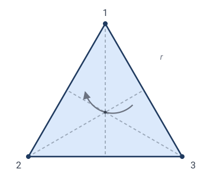
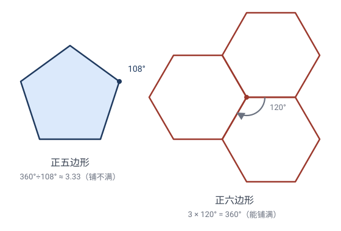

# 第 8 章 · 对称性与群：变换的最美应用

> "对称"是日常语言，但它在数学里有**精确**的定义——而且这个定义，正是变换。

## 8.1 什么是"对称"

看一个等边三角形。它"很对称"。但"对称"到底是什么？

精确说法：**对称，是一种让图形看起来"没变"的变换**。

- 把等边三角形**绕中心转 $120°$**：它和原来**重合**（每个顶点跑到另一个顶点的位置，整体图形纹丝不动）。
- 把它**关于一条对称轴翻折**：也重合。

> 🎯 **定义**：图形 $\Omega$ 的一个**对称**，是一个**把 $\Omega$ 映成它自己**的变换 $\mathbf{T}$（即 $\mathbf{T}(\Omega)=\Omega$）。
>
> 图形 $\Omega$ 的**全体对称**组成一个群，叫它的**对称群** $\mathrm{Sym}(\Omega)$。

这就是变换与对称的联系：**对称 = 保持图形不变的变换；所有对称凑成一个群。**

> 💡 一个图形越"对称"，对称群越大。圆的对称群**无穷大**（任意角度旋转、任意直径反射都让圆不变）；任意三角形的对称群只有恒等（如果它不等边不等腰）。

---

## 8.2 ⭐ 手算：等边三角形的对称群 $D_3$

给等边三角形三个顶点编号：$1$（顶）、$2$（左下）、$3$（右下）。

每个对称变换都把三个顶点**重新排列**——所以可以用"置换"记号记录。比如 $(1\,2\,3)$ 表示"$1\to2\to3\to1$ 的轮换"。

### 旋转（3 个）

| 变换 | 置换 | 含义 |
|---|---|---|
| 转 $0°$（恒等 $e$） | $()$ | 不动 |
| 转 $120°$（$r$） | $(1\,2\,3)$ | $1\to2,2\to3,3\to1$ |
| 转 $240°$（$r^2$） | $(1\,3\,2)$ | 再转一次 |

> ✏️ **手算 $r^2$**：$r=(123)$，$r$ 把 $1$ 送到 $2$ 的位置、$2$ 送到 $3$、$3$ 送到 $1$。再转一次 $r$：现在 $1$（已经到 2 位置）再被 $r$ 送到 3 位置。所以 $r^2$ 把原 $1$ 送到了 3 位置、原 $2$ 到 1、原 $3$ 到 2，即 $(132)$ ✓。

### 反射（3 个）

每条对称轴（从顶点到对边中点）一个反射：

| 变换 | 置换 | 对称轴 |
|---|---|---|
| $s_1$ | $(2\,3)$ | 过顶点 1，固定 1 |
| $s_2$ | $(1\,3)$ | 过顶点 2，固定 2 |
| $s_3$ | $(1\,2)$ | 过顶点 3，固定 3 |

> ✏️ **手算 $s_1$**：关于"过顶点 1 的对称轴"反射，顶点 1 不动，左下、右下互换：$2\leftrightarrow3$，即 $(2\,3)$ ✓。

### 凑成群 $D_3$

$$D_3=\{e,\,(1\,2\,3),\,(1\,3\,2),\,(2\,3),\,(1\,3),\,(1\,2)\},\quad |D_3|=6.$$

> ✏️ **验证群性质（封闭性抽查）**：做 $r$ 后再做 $s_1$（先转 $120°$，再关于"过顶点1轴"反射）。用置换复合（右起）：
> $$s_1\circ r: \quad 1\xrightarrow{r}2\xrightarrow{s_1}3,\quad 2\xrightarrow{r}3\xrightarrow{s_1}2,\quad 3\xrightarrow{r}1\xrightarrow{s_1}1.$$
> 结果 $1\to3,2\to2,3\to1$，即 $(1\,3)=s_2$。**还在 $D_3$ 里** ✓。
>
> 这也说明 $D_3$ 的运算**不交换**：$s_1\circ r=s_2\ne r\circ s_1$（你可以自己算 $r\circ s_1$，会得到另一个反射）。$D_3$ 是**非交换群**——这是它比"加法群"复杂的地方。

**关键洞察**：等边三角形的对称群 $D_3$ **恰好等于**三个元素的全体置换群 $S_3$（$|S_3|=3!=6$）。这并非巧合——因为等边三角形的任何顶点置换都能实现为某个对称变换。

---

## 8.3 正方形的对称群 $D_4$

正方形有 4 个顶点，对称更多：

- **4 个旋转**：$0°,90°,180°,270°$；
- **4 个反射**：2 条对角线反射 + 2 条中轴线反射。

$$|D_4|=4+4=8.$$

一般地，正 $n$ 边形的对称群 $D_n$ 有 $2n$ 个元素（$n$ 个旋转 + $n$ 个反射），叫**二面体群**。

> ✏️ **数一数**：正五边形 $D_5$ 有 $10$ 个；正六边形 $D_6$ 有 $12$ 个；正十七边形（高斯的那个！）$D_{17}$ 有 $34$ 个。边越多，对称越丰富。

---

## 8.4 对称群揭示"结构"

对称群不只是"数对称有多少"，它**编码了图形的全部对称结构**。比如：

- **圆**的对称群是无穷的（含所有旋转和反射），叫 $O(2)$。圆是"最对称"的平面图形。
- **长方形（非正方形）**的对称群只有 4 个元素：恒等、转 $180°$、两条中轴反射。它"不如"正方形对称。
- **任意三角形**的对称群只有恒等（除非等腰/等边）。

> 💡 **思想**：**对称群的大小和结构，是图形的"指纹"。** 两个图形"对称等价"当且仅当它们的对称群同构。这就是为什么化学家用对称群分类分子（水分子 $C_{2v}$，甲烷 $T_d$，苯 $D_{6h}$……），物理学家用对称群分类粒子。

---

## 8.5 ⭐ 与伽罗瓦理论的深刻类比

这里出现全书最惊人的联系之一：**几何的对称群** 和 **代数的伽罗瓦群**，是**同一件事**的两个面孔。

| | 几何（图形的对称） | 代数（方程的伽罗瓦） |
|---|---|---|
| 研究对象 | 图形 $\Omega$（如三角形） | 多项式方程的根 |
| 变换 | 把图形映成自己的几何变换 | 把根重新排列、保持代数关系的置换 |
| 群 | 对称群 $\mathrm{Sym}(\Omega)$ | 伽罗瓦群 $\mathrm{Gal}(f)$ |
| 群越"大" | 图形越对称 | 方程越"难解"（根之间关系越乱） |
| 群的结构 | 决定图形对称类型 | **决定方程能不能用根式求解** |

伽罗瓦的伟大定理：**方程 $f$ 能用根式求解 ⟺ 它的伽罗瓦群 $\mathrm{Gal}(f)$ 是"可解群"**（一种结构较简单的群）。

- 一二三四次方程：伽罗瓦群足够小、可解 → 根式可解（有求根公式）。
- 一般五次方程：伽罗瓦群是 $S_5$（120 个元素），$S_5$ **不可解** → **没有根式求根公式**（阿贝尔-鲁菲尼定理）。

> 💡 **类比点睛**：正五边形（对称群 $D_5$）和五次方程（伽罗瓦群 $S_5$），都涉及"5"和"对称"——这不是巧合。"5"是**第一个**让事情变复杂的临界点：正五边形可以用直尺圆规作（高斯之前就知道），但一般五次方程不能根式解。**群的结构**是隐藏在两者背后的共同本质。

这就是为什么克莱因能"用群统一几何"，而伽罗瓦"用群攻克代数"——**群是对称的通用语言**，跨学科通用。

---

## 8.6 用群计数：伯恩赛德引理（彩珠手链）

对称群还能干一件漂亮的事——**计数**。

> **问题**：用 3 颗珠子串成手链，每颗珠子有 2 种颜色（黑/白）。**旋转和翻转视为同一种**，共有几种不同的手链？

朴素数法：每颗 2 色，$2^3=8$ 种染色。但"黑白黑"转一下变成"白黑白"——它们是**同一种**手链。

正确工具是**伯恩赛德引理**：

> **不同手链数** $=$ **群里所有变换的"固定染色数"的平均值**。

群是 $D_3$（6 个对称），对每个对称，数有多少染色被它**固定**：

| 对称 $g$ | 固定 $g$ 的染色数 |
|---|---|
| $e$（恒等） | 全部 $2^3=8$（恒等不动所有染色） |
| $r,(1\,2\,3)$ | $2$（三珠必须同色才不变：全黑/全白） |
| $r^2,(1\,3\,2)$ | $2$（同上） |
| 3 个反射 | 各 $2^2=4$（一对珠被对换必须同色，第三珠任意） |

伯恩赛德：
$$\text{手链数}=\frac{8+2+2+4+4+4}{6}=\frac{24}{6}=4.$$

### 为什么这个公式成立？（伯恩赛德引理的证明）

伯恩赛德引理的一般形式是：**有限群 $G$ 作用在有限集 $X$ 上，本质不同的对象（轨道）数**
$$|X/G|=\frac{1}{|G|}\sum_{g\in G}|\mathrm{Fix}(g)|,\qquad \mathrm{Fix}(g)=\{x:g\cdot x=x\}.$$

证明要用一个**小引理**。

> **小引理（轨道-稳定子定理）**：$|G|=|\mathrm{Orb}(x)|\cdot|\mathrm{Stab}(x)|$，其中 $\mathrm{Stab}(x)=\{g:g\cdot x=x\}$（"稳定子"——固定 $x$ 的元素个数），$\mathrm{Orb}(x)$ 是 $x$ 的轨道大小。
>
> *证*：两个元素 $g_1,g_2$ 把 $x$ 送到同一个像 $g_1x=g_2x$ $\iff$ $g_2^{-1}g_1 x=x$ $\iff$ $g_2^{-1}g_1\in\mathrm{Stab}(x)$ $\iff$ $g_1,g_2$ 在 $\mathrm{Stab}(x)$ 的**同一个左陪集**里。所以"不同的像"个数 = "$\mathrm{Stab}(x)$ 的陪集数" $=|G|/|\mathrm{Stab}(x)|$，即 $|\mathrm{Orb}(x)|=|G|/|\mathrm{Stab}(x)|$。$\square$

**伯恩赛德引理的证明**（经典的"**双向计数**"）：数一数满足 $g\cdot x=x$ 的数对 $(g,x)$ 有多少个，从两个方向数：

- **按 $g$ 数**：每个 $g$ 贡献 $|\mathrm{Fix}(g)|$ 个 $x$，总计 $\displaystyle\sum_g|\mathrm{Fix}(g)|$。
- **按 $x$ 数**：每个 $x$ 贡献 $|\mathrm{Stab}(x)|$ 个 $g$，总计 $\displaystyle\sum_x|\mathrm{Stab}(x)|$。

两者数的是同一批数对，故相等。再用轨道-稳定子 $|\mathrm{Stab}(x)|=|G|/|\mathrm{Orb}(x)|$：
$$\sum_x|\mathrm{Stab}(x)|=\sum_x\frac{|G|}{|\mathrm{Orb}(x)|}.$$
关键观察：**同一轨道内**每个 $x$ 的 $|\mathrm{Orb}(x)|$ 相同（都等于轨道大小 $r$），而该轨道恰有 $r$ 个点，每个贡献 $|G|/r$，所以**一个轨道总贡献** $r\cdot\frac{|G|}{r}=|G|$。若轨道总数为 $N=|X/G|$，则
$$\sum_x|\mathrm{Stab}(x)|=N\cdot|G|.$$
结合双向计数 $\sum_g|\mathrm{Fix}(g)|=\sum_x|\mathrm{Stab}(x)|=N\cdot|G|$，解出
$$N=\frac{1}{|G|}\sum_g|\mathrm{Fix}(g)|.\qquad\square$$

> 💡 **精髓**：直接数"不同对象"难（要反复去重），但数"被某个 $g$ 固定的对象"容易（局部问题）。双向计数把"难"转成了"易"——这是组合数学反复出现的妙招。

> ✏️ **4 种手链**：全黑、全白、一黑二白、二黑一白（其余染色都旋转/翻转到这 4 种之一）。手算可验证确实 4 种 ✓。

> 💡 伯恩赛德引理的精神：**直接数"不同的对象"很难（要不断去重），但数"被某个变换固定的对象"很容易（局部问题），取平均就得到答案**。这是"用群作用简化计数"的典范，化学里数异构体、晶体里数构型都用它。

---

## 8.7 对称的分类：结晶学约束与 17 种壁纸图案

把对称推到极致，会得到惊人的**分类定理**。

**问题**：平面上的"装饰图案"（无限延展的对称花纹，如伊斯兰几何花纹、埃舍尔的画），按对称群能分几类？

答案：**恰好 17 种**（**壁纸群**，wallpaper groups，1891 年费德罗夫证明）。

> ✏️ 17 种壁纸群对应 17 种不同的"对称组合方式"——哪些旋转（只允许 $2,3,4,6$ 倍，**不允许 5 倍**！）、哪些反射、哪些滑移反射，组合出 17 种本质不同的图案。

**为什么不允许 5 倍旋转？** 这是著名的"**结晶学约束**"：平面上正 $n$ 边形能铺满平面（无缝隙）的只有 $n=3,4,6$，**没有 $n=5$**。所以装饰图案里**不能有 5 重对称**——这就是为什么伊斯兰花纹和埃舍尔的画里你看不到真正的五重旋转对称，却到处是六重、四重。

> **证明**：正 $n$ 边形的内角是 $\dfrac{(n-2)\cdot 180°}{n}$。要铺满平面，几个正 $n$ 边形要在每个顶点处凑成 $360°$，即 $360°\div$ 内角 必须是整数 $k\ge 3$：
> $$k=\frac{360°}{\text{内角}}=\frac{360\,n}{(n-2)\cdot 180}=\frac{2n}{n-2}=2+\frac{4}{n-2}.$$
> $k$ 是整数 $\iff \dfrac{4}{n-2}$ 是整数 $\iff n-2$ 整除 $4$ $\iff n-2\in\{1,2,4\}$ $\iff n\in\{3,4,6\}$。
>
> 逐一验证 $k\ge3$：$n=3\Rightarrow k=6$（6 个三角形拼一点）；$n=4\Rightarrow k=4$（4 个正方形）；$n=6\Rightarrow k=3$（3 个正六边形）。都成立。而 $n=5$ 给 $k=2+\tfrac43\approx3.33$ 不是整数——拼不出 $360°$，必留 $36°$ 缝。$\square$

三维类比：晶体有 **230 种**空间群（1890 年代分类完成），这是固体物理和结晶学的数学骨架。

> 💡 **元思想**：**群论 + 不变量 = 完备分类**。给一类对象（壁纸图案、晶体、粒子），用对称群分门别类，得到有限的、穷尽的列表。这种"分类纲领"是现代数学反复出现的模式（单李群分类、有限单群分类……）。

---

## 8.8 本章小结

- **对称 = 保持图形不变的变换**；所有对称组成**对称群**。
- 等边三角形 $D_3 \cong S_3$（6 元），正 $n$ 边形 $D_n$（$2n$ 元）。
- **对称群是图形的"指纹"**，决定图形的对称类型。
- **伽罗瓦类比**：图形对称群 ↔ 方程伽罗瓦群；群的结构决定可解性（五次方程无根式解）。
- **伯恩赛德引理**：用群作用做去重计数。
- **分类**：17 种壁纸群、230 种晶体空间群——对称的完备清单。

下一章我们走出几何，看这套"变换 + 不变量 + 群"的思想如何塑造整个现代数学与物理学。

下一章：[09-影响与意义.md](09-影响与意义.md)

---

## 🧩 本章习题

**题 8.1（手算）$D_3$ 的乘法。** 在 $D_3=\{e,r,r^2,s_1,s_2,s_3\}$ 里，求 $r\circ s_1$（先 $s_1$ 后 $r$）。验证它 $\ne s_1\circ r$（说明 $D_3$ 不交换）。
*答*：用置换：$r=(123),s_1=(23)$。$r\circ s_1$：$1\xrightarrow{s_1}1\xrightarrow{r}2$，$2\xrightarrow{s_1}3\xrightarrow{r}1$，$3\xrightarrow{s_1}2\xrightarrow{r}3$，即 $1\to2,2\to1,3\to3$，等于 $(1\,2)=s_3$。而前面算过 $s_1\circ r=s_2$。$s_3\ne s_2$，所以不交换 ✓。

**题 8.2（手算）长方形的对称群。** 非正方形的长方形有几个对称？写出群元素。
*答*：4 个：恒等 $e$、转 $180°$、关于两条中轴的反射。注意**没有**转 $90°$（转完不重合）、**没有**对角线反射（对角线反射把长方形变歪）。

**题 8.3（思考）圆的对称群。** 圆的对称群有多大？它含哪些变换？
*答*：无穷群 $O(2)$：绕圆心**任意角度**的旋转（连续无穷个）+ 关于**任意直径**的反射（连续无穷个）。圆是最对称的紧致平面图形。

**题 8.4（计数）四珠手链。** 用 4 颗珠子，2 色，旋转翻转视为相同，几种手链？（用伯恩赛德。）
*答*：群 $D_4$（8 元）。逐个数"被固定的染色数"：
- $e$：固定全部 $2^4=16$；
- 转 $\pm90°$（4-轮换）：四珠全同色才不变，各 $2$ 种；
- 转 $180°$（$(13)(24)$，两对对换）：每对同色，$2^2=4$ 种；
- 2 条**对角线**反射（固定 2 个对角顶点，对换另 2 个）：被对换的 2 珠同色，固定的 2 珠任意，各 $2^3=8$ 种；
- 2 条**中线**反射（两对对换）：每对同色，各 $2^2=4$ 种。

$$\text{手链数}=\frac{16+2+4+2+8+8+4+4}{8}=\frac{48}{8}=6.$$
**6 种**：全黑、全白、一白三黑、一黑三白、相邻两白两黑、相对两白两黑。✓

**题 8.5（进阶）为什么五边形铺不满。** 证明正五边形不能铺满平面（无缝隙）。提示：铺满要求每个顶点处几个内角之和恰为 $360°$；正五边形内角是多少？能整除 $360°$ 吗？
*答*：正五边形内角 $108°$。$360/108\approx3.33$ 不是整数，所以几个正五边形拼在顶点处凑不出 $360°$，必有缝隙。这就是结晶学约束的根源，也是为什么没有 5 重对称的壁纸图案。
