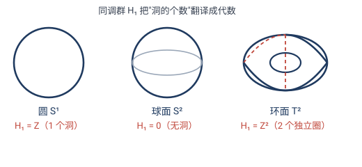

# 第 9 章 · 经典习题：变换思想的应用

> 第 9 章讲"变换 + 不变量 + 群"这套思想如何渗透到代数、拓扑、物理、工程。这一节的题不是解几何图形，而是用这套思想解决**跨学科**的小问题——它们是第 2–8 章思想在远方的回响。

> 📌 每道题标了它依赖的章节。

---

## 题 1 · 时空间隔不变（9.3 相对论）

> 🔖 **用到**：9.3——洛伦兹群的不变量是时空间隔 $\Delta s^2=c^2t^2-x^2-y^2-z^2$。

事件 $P$ 在惯性系 $S$ 中的时空坐标（取 $c=1$）为 $(t,x)=(5,3)$。
(a) 求 $\Delta s^2$。
(b) 另一惯性系 $S'$ 沿 $x$ 方向以 $v=0.6c$ 运动，求 $P$ 在 $S'$ 中的坐标 $(t',x')$，并验证 $\Delta s'^2=\Delta s^2$。

> 💡 **关键**：时间、坐标都会随参考系变，但**时空间隔**不变——这正是"群（洛伦兹群）+ 不变量"在物理里的模样。

**解**：
(a) $\Delta s^2=c^2t^2-x^2=5^2-3^2=25-9=\mathbf{16}$。
(b) 洛伦兹变换（$\beta=0.6$，$\gamma=1/\sqrt{1-\beta^2}=1.25$）：
$$t'=\gamma(t-\beta x)=1.25(5-0.6\times3)=1.25\times3.2=4,$$
$$x'=\gamma(x-\beta t)=1.25(3-0.6\times5)=1.25\times0=0.$$
验证：$\Delta s'^2=t'^2-x'^2=4^2-0=\mathbf{16}=\Delta s^2$ ✓

> ✏️ **点睛**：时间从 $5$ 变 $4$、位置从 $3$ 变 $0$——**全变了**。但间隔 $\Delta s^2=16$ 纹丝不动。这就是相对论的"不变量"：**别信坐标，要信间隔**。和第 5 章交比、第 6 章保角一样，都是"剥去表象找不变内核"。

---

## 题 2 · 诺特定理：对称 ↔ 守恒配对（9.3）

> 🔖 **用到**：9.3 诺特定理——每一种连续对称对应一个守恒律。

把下列"物理对称"和它对应的"守恒量"配对：

| 对称性（物理定律在何种变换下不变） | 守恒量 |
|---|---|
| (a) 时间平移（今天与明天一样） | ? |
| (b) 空间平移（这里与那里一样） | ? |
| (c) 空间旋转（朝哪个方向都一样） | ? |
| (d) $\mathrm{U}(1)$ 规范对称 | ? |

**答**：(a)→**能量**守恒；(b)→**动量**守恒；(c)→**角动量**守恒；(d)→**电荷**守恒。

> ✏️ **点睛**：这些守恒律**不是实验凑出来的**，而是对称性的**必然推论**。诺特定理把"宇宙有某种对称"翻译成"宇宙有某个守恒量"——这是爱尔兰根纲领（几何 = 群 + 不变量）在物理学里最壮丽的回响：**物理定律 = 某个对称群的不变量**。

---

## 题 3 · 同调群数"洞"（9.2 代数拓扑）

> 🔖 **用到**：9.2——同调群 $H_1$ 是拓扑不变量，$H_1=\mathbb{Z}^g$ 中 $g$ = "一维洞"的个数。

求下列空间的一维同调群 $H_1$（即数它们有几个"能套住但缩不成点"的圈）：

| 空间 | "一维洞"数 | $H_1$ |
|---|---|---|
| (a) 圆 $S^1$ | ? | ? |
| (b) 球面 $S^2$（球表面） | ? | ? |
| (c) 甜甜圈 $T^2$（环面） | ? | ? |

**答**：
- (a) 圆：$1$ 个洞（圆本身就是一个圈）⟹ $H_1=\mathbb{Z}$。
- (b) 球面：$0$ 个一维洞（球面上任何圈都能缩成点）⟹ $H_1=0$。
- (c) 环面：$2$ 个独立圈（经线圈 $+$ 纬线圈）⟹ $H_1=\mathbb{Z}^2$。

> ✏️ **点睛**：同调群把"有几个洞"这种**拓扑**性质，编码成**代数**对象（$\mathbb{Z},0,\mathbb{Z}^2$）。同胚的空间有相同的同调群，所以它能区分球面和环面（$\mathbb{Z}^2\ne0$）——就像第 7 章用欧拉示性数区分一样，但同调群更精细。**把形状翻译成代数**，是代数拓扑的灵魂。

---

## 题 4 · 判别式分类圆锥曲线（9.1 不变量理论）

> 🔖 **用到**：9.1——判别式 $\Delta=b^2-4ac$ 是二次型 $ax^2+bxy+cy^2$ 在坐标变换下的不变量。

用判别式 $\Delta=b^2-4ac$ 判断下列二次曲线的类型：

| 曲线 | $a,b,c$ | $\Delta$ | 类型 |
|---|---|---|---|
| (a) $x^2+y^2=1$（单位圆） | $1,0,1$ | ? | ? |
| (b) $x^2-y^2=1$（双曲线） | $1,0,-1$ | ? | ? |
| (c) $y=x^2$（抛物线，写成 $x^2-y=0$） | $1,0,0$ | ? | ? |

**答**：(a) $\Delta=0-4=-4<0$ ⟹ **椭圆型**（圆是特例）；(b) $\Delta=0+4=4>0$ ⟹ **双曲型**；(c) $\Delta=0-0=0$ ⟹ **抛物型**。

> ✏️ **点睛**：$\Delta$ 的**符号**（正/零/负）在任意坐标变换下不变——所以椭圆/抛物线/双曲线的分类是**坐标无关**的内禀性质。这就是 19 世纪不变量理论的开端：**找一个在变换下不变的量，用它给对象分类**。和第 7 章用 $\chi$ 分类、第 5 章用交比一样，都是同一条思路。

---

## 题 5 · 设计一个"不变特征"（9.4 计算机视觉）

> 🔖 **用到**：9.4——找"变换下不变的特征"是机器视觉的核心任务。

设计一个图像特征，使它对**平移、旋转、缩放**都不变（即同一物体无论怎么摆放、缩放，特征值相同）。

> 💡 **关键**：把变换"消除掉"——先规范化，再在规范化对象上提取特征。

**答**（一种标准做法）：
1. **消除平移**：把图像的**质心**（亮度加权中心）平移到原点；
2. **消除缩放**：把图像**面积归一化**（缩放到固定大小）；
3. **消除旋转**：找出**主轴**（使二阶矩矩阵对角化的方向），旋转图像让主轴对齐 $x$ 轴；
4. 在这个**规范化**的图像上提取任意特征（如某区域的形状描述子）。

如此得到的特征对平移、旋转、缩放都不变。

> ✏️ **点睛**：这就是 SIFT、矩不变量等算法的核心——**先把变换群"规范化掉"，再在规范位置上提取特征**。和第 4 章仿射标准化、第 5 章"投影到无穷远"是同一个思想：**与其对抗变换，不如先吃掉它**。

---

## 🧠 回顾：全书的回响

| 题 | 域 | 对应的前章思想 |
|---|---|---|
| 1 时空间隔 | 相对论 | 第 7 章群+不变量 |
| 2 诺特配对 | 物理学 | 第 8 章对称群 |
| 3 同调群 | 拓扑 | 第 7 章拓扑不变量 |
| 4 判别式 | 代数 | 第 7 章用不变量分类 |
| 5 不变特征 | 工程视觉 | 第 4–5 章标准化 |

**一个洞见贯穿全书**：从欧几里得的静止图形，到克莱因的运动眼光——盯住**变化中不变的东西**。它在几何里是距离/角/交比（第 2–6 章），在分类里是层级（第 7 章），在物理里是守恒律（第 9 章），在工程里是鲁棒特征（第 9 章）。学会这副眼光，你看世界的维度就变了。

---

> 📚 返回 [第 9 章 · 影响与意义](09-影响与意义.md) ｜ [目录](README.md)
