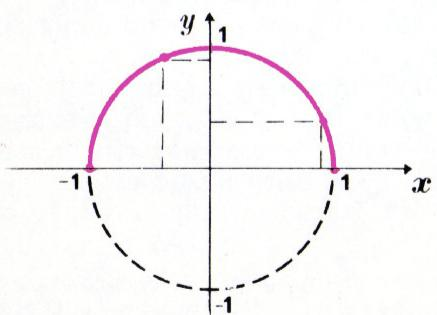
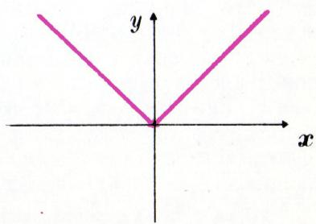
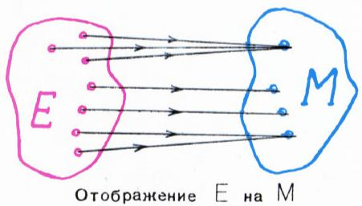
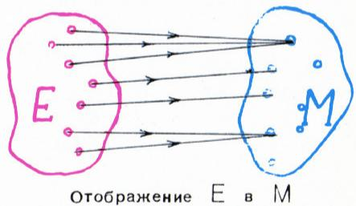
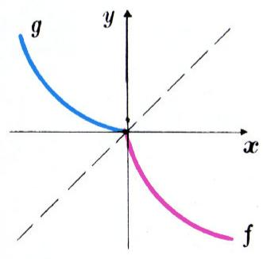
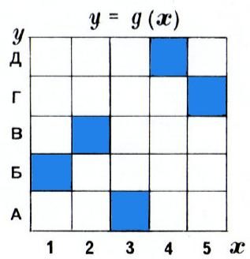
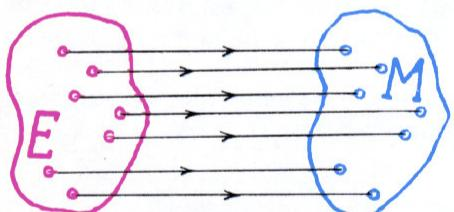
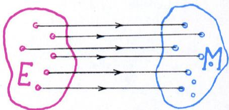
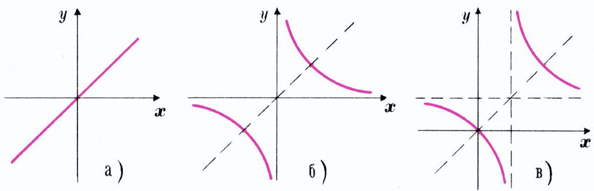
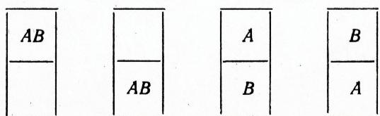

# 什么是函数？

> **原标题**：Что такое функция?
> **作者**：А. Н. Колмогоров（A. N. 柯尔莫哥洛夫，1903—1987，苏联数学家，Kvant 创刊主编之一）
> **译自**：Квант 1970, № 1, с. 27–36
> **原文扫描**：https://www.kvant.digital/data/kvant_1970_1/jpg/0027.jpg
> **主题**：函数概念（映射、可逆函数、单射／满射／双射）
> **难度**：★★（文字初中可读，但映射、可逆、双射等概念属高中／竞赛层面）
> **译者**：Claude（初译）／ 2026-06-24

---

> *本文向读者解释「函数」一词的现代的、一般性的理解。这不是一篇可以轻松浏览的文章：它要求读者留意每一个字眼，尽管并不预设任何超出中学范围的专业知识。此外，本文还假定读者已经会用「集合」与「集合的元素」这两个词。*
> *——作者按*

## 1. 引言

对于「什么是函数？」这个问题，中学生常常这样回答：「函数可以用表格、图像或公式来给出。」显然，这并不是一个定义。不过，那些回避给出明确定义、而直接去描述「函数是如何给出的」的学生，也并不完全算错。数学不可能从定义开始。在表述某个概念的定义时，我们不可避免地要在定义本身之中用到另一些概念。只要我们还不理解任何概念的含义，我们就一步也迈不出去，连一个定义也写不出来。因此，任何数学理论的讲述，总是从某些**基本概念被不加定义地接受下来**开始；借助它们，才有可能去表述进一步的派生概念的定义。

那么，人们究竟是用什么办法向彼此说明自己对基本概念含义的理解呢？除此之外别无他法，只能**借助于例子和对其特征性质的详尽描述**来加以阐发。这些描述在细节上起初未必十分清楚、也未必完备，但渐渐地，概念的含义会从中以足够的清晰度呈现出来。我们也正是这样来接近「函数」这个概念的——把它视为最基本的、不作形式定义的数学概念之一。

> [原文方括号注] 诚然，下文将会说到：函数无非是把一个集合**映到**另一个集合（把函数的定义域映到它的值域）。但在这里，「映射」一词仅仅是「函数」一词的**同义词**——它们是同一个概念的两个名字。用一个等价的词去解释另一个词，并不能替代它所表达的概念的定义。

例 1. 设字母 $x$ 和 $y$ 表示实数。记号 $\sqrt{\ }$ 我们理解为取算术平方根。等式

$$
y = \sqrt{1 - x^{2}}\tag{1}
$$

意味着下列条件成立：

$$
x^{2} \leqslant 1, \quad y \geqslant 0, \quad x^{2} + y^{2} = 1.\tag{2}
$$

坐标满足这些条件的点，构成图 1 中用红线画出的半圆周。

*图 1*

图 1 把下面这些事实变得一目了然（你也可以用纯代数的途径来证明它们）：

1° 公式 (1) 使得对任何一个满足

$$
-1 \leqslant x \leqslant 1,\tag{3}
$$

的 $x$，都能算出与之对应的、满足不等式

$$
0 \leqslant y \leqslant 1;\tag{4}
$$

的 $y$；

2° 反过来，对每一个满足不等式 (4) 的 $y$，都至少存在一个 $x$，使得按公式 (1) 与这个事先给定的 $y$ 相对应。

于是可以说：公式 (1) 给出了一个**映射**，它把满足不等式 (3) 的数 $x$ 所成的集合，**映到**满足不等式 (4) 的数 $y$ 所成的集合上。数学家们（尤其是近来）常用**箭头**来记映射。我们所讨论的这个映射，用箭头可以写成：

$$
x \rightarrow \sqrt{1 - x^{2}}.\tag{5}
$$

例如：

$$
\left.\begin{array}{l}-1 \rightarrow \sqrt{1 - (-1)^{2}} = 0,\quad -\dfrac{4}{5} \rightarrow \sqrt{1 - \left(-\dfrac{4}{5}\right)^{2}} = \dfrac{3}{5},\\[4pt]\dfrac{3}{5} \rightarrow \sqrt{1 - \left(\dfrac{3}{5}\right)^{2}} = \dfrac{4}{5},\quad 0 \rightarrow \sqrt{1 - 0^{2}} = 1.\end{array}\right\}\tag{6}
$$

> **译者注**：原 OCR 在 $-\tfrac45$ 一项误识别为 $-\tfrac35$（多一个负号）；此处已据算术根 $\sqrt{1-16/25}=\sqrt{9/25}=\tfrac35$ 校正。

请注意：一个映射**完全确定**，需要：

а) 给定了被映射的集合 $E$；

б) 对集合 $E$ 中的每一个元素 $x$，都指定了 $x$ 所映到的元素 $y$。

把所有 $y$ 值组成的集合记作 $M$。在例 1 中，$E$ 是满足条件 (3) 的数所成的集合，而 $M$ 是满足条件 (4) 的数所成的集合。

例 2. 规则

$$
1)\ \ x \rightarrow \sqrt{x^{2}},
$$

$$
2)\ \ x \rightarrow \begin{cases}x, & \text{若}\ x \geqslant 0,\\ -x, & \text{若}\ x < 0\end{cases}
$$

给出的是同一个映射

$$
x \rightarrow |x|\tag{7}
$$

即把实数 $x$ 映到它的模（绝对值）$|x|$（见图 2）。映射 (7) 把全体实数的集合

$$
R = (-\infty, \infty)
$$

映到非负实数的集合

$$
R_{+} = [0, \infty)
$$

上。

*图 2*

既然「映射」与「函数」是同义词，那我们也可以把映射 (5) 写成

$$
f(x) = \sqrt{1 - x^{2}},\tag{8}
$$

把映射 (7) 写成

$$
f(x) = |x|.\tag{9}
$$

于是公式 (6) 中所列的函数 (8) 的那些特殊值，就可写成：

$$
f(-1) = 0,\quad f\!\left(-\dfrac{4}{5}\right) = \dfrac{3}{5},\quad f\!\left(\dfrac{3}{5}\right) = \dfrac{4}{5},\quad f(0) = 1.
$$

函数 (9) 的定义域是全体实数的集合 $R$；它的值域是非负实数的集合 $R_{+}$。

例 3. 佩佳、科里亚、萨沙和沃洛佳同住一间宿舍。二月份他们排了这样一张值班表：

|  | 1 | 2 | 3 | 4 | 5 | 6 | 7 | 8 | 9 | 10 | 11 | 12 | 13 | … | 28 |
|---|---|---|---|---|---|---|---|---|---|---|---|---|---|---|---|
| 佩佳 | ■ |  |  |  | ■ |  |  |  | ■ |  |  |  | ■ | … |  |
| 科里亚 |  | ■ |  |  |  | ■ |  |  |  | ■ |  |  |  | … |  |
| 萨沙 |  |  | ■ |  |  |  | ■ |  |  |  | ■ |  |  | … |  |
| 沃洛佳 |  |  |  | ■ |  |  |  | ■ |  |  |  | ■ |  | … | ■ |

（■ 表示该生当天值班。）

## 2. 函数的一般概念

立刻引人注目的，是这张表与你们在中学代数课上熟悉的**函数图像**之间的相似。这种类比是否有精确的逻辑含义？孩子们是不是在这里建立了一个集合到另一个集合的映射，也就是说，是不是确定了一个函数？他们是不是画出了这个函数的图像？（请注意日常用语中「排了一张值班**表**！」这种说法。*——译注：俄语「график」兼有「图像／曲线」与「时刻表／值班表」之意。*）

不难看出，在例 3 中，二月的 28 天里每一天都指派了一位确定的值班者。换言之，二月份所有日子组成的集合，被映射到分担值班的孩子所组成的集合上。我们约定：字母 $x$ 表示二月里的任意一天，而 $y = f(x)$ 表示第 $x$ 天的值班者。没有任何理由拒绝把映射

$$
\text{日}\ x \rightarrow y = \text{第}\ x\ \text{天的值班者}
$$

称作函数，并把这个映射写成：

$$
y = f(x).
$$

**我们把集合 $E$ 到集合 $M$ 上的任意一个映射 $f$，称为一个以 $E$ 为定义域、以 $M$ 为值域的函数。**

不要忘记，当我们说「映射 $f$ 把集合 $E$ 映到集合 $M$ 上」时，我们的意思是：$y = f(x)$ 对 $E$ 中的**每一个** $x$ 都有定义（且仅对 $E$ 中的 $x$ 有定义），而函数 $f$ 的值 $y$ 必定属于集合 $M$，并且 $M$ 中的**每一个** $y$ 都是函数 $f$ 在某个自变量值 $x$ 处的值。

*映射 $E$ 到 $M$ 上（「映满」）*

如果仅仅知道函数 $f$ 的值必定属于集合 $M$，但**并不**断言 $M$ 中的每一个元素都是 $f$ 的值，那我们就说：函数把自己的定义域 $E$ **映入**集合 $M$，或者说映射 $f$ 是集合 $E$ **到**集合 $M$ **中**的映射（「映入」而非「映满」）。

*映射 $E$ 到 $M$ 中（「映入」，未必映满）*

> **译者注**：原文在这里要读者「严格区分两个说法」——「把 $E$ 映**到** $M$ 上」（映满）与「把 $E$ 映**入** $M$ 中」（未必映满）。OCR 此处公式残缺，已据上下文还原。下文「映到…上」= surjective（满射）的雏形，「映入」则未必。

例如，关于映射

$$
x \rightarrow |x|
$$

可以说它是 $R$ 到 $R$ 中（映入）的映射，却**不能**说它是「$R$ 到 $R$ 上」的映射。

从纯逻辑的角度看，最简单的情形是函数的定义域为**有限集**的情形。显然，定义域由 $n$ 个元素组成的函数，取值不可能多于 $n$ 个不同的值。因此，定义在有限集上的函数，实现的是有限集到有限集的映射。这类映射正是数学中一个重要分支——**组合数学**的研究对象之一（参见习题 8、11、18、19）。

例 4. 考虑这样的函数：其定义域是两个字母组成的集合

$$
M = \{A, B\},
$$

而其值也属于同一个集合，也就是 $M$ 到自身的映射。

这样的函数一共只有四个。用列表的方式给出它们：

| $x$ | $f_1(x)$ | $f_2(x)$ | $f_3(x)$ | $f_4(x)$ |
|---|---|---|---|---|
| $A$ | $A$ | $B$ | $A$ | $B$ |
| $B$ | $A$ | $B$ | $B$ | $A$ |

函数 $f_1$ 和 $f_2$ 是**常数**（常值）函数：每个函数的值域都只由单独一个元素组成。

函数 $f_3$ 和 $f_4$ 把集合 $M$ 映到自身上。函数 $f_3$ 可以用公式

$$
f_3(x) = x.
$$

给出。这是**恒等映射**：集合 $E$ 的每个元素都被映到它自身。

为了把「函数」这个概念本身的含义讲透，还要指出一点：选用哪个字母来表示「自变量」（即定义域中的任意元素）和「因变量」（即值域中的任意元素），是完全无关紧要的。写法

$$
x \stackrel{f}{\rightarrow} \sqrt{x},\quad \xi \stackrel{f}{\rightarrow} \sqrt{\xi},\quad y \stackrel{f}{\rightarrow} \sqrt{y},
$$

$$
f(x) = y = \sqrt{x},\quad f(\xi) = \eta = \sqrt{\xi},\quad f(y) = x = \sqrt{y}
$$

定义的都是**同一个**函数 $f$——它把非负数映到它的算术平方根。无论用哪种写法，我们都得到

$$
f(1) = 1,\quad f(4) = 2,\quad f(9) = 3
$$

等等。

## 3. 可逆函数

函数

$$
y = f(x)
$$

称为**可逆的**，如果它的每一个值都**只取到一次**（即被唯一地取到）。例 4 中的 $f_3(x)$ 和 $f_4(x)$ 就是这样的函数。而例 4 的 $f_1(x)$、$f_2(x)$，以及例 1、2、3 中的函数，都是不可逆的。

要证明某个函数不可逆，只需指出两个自变量值 $x_1 \ne x_2$，使得

$$
f(x_1) = f(x_2).
$$

在例 3 中，只需注意到佩佳既在 1 日、又在 5 日值班。因此例 3 的函数不可逆。

例 5. 函数 $f$

$$
x \stackrel{f}{\rightarrow} y = -\sqrt{x}
$$

是可逆的。它定义在非负数集合 $R_{+}$ 上，其值域是

$$
R_{-} = (-\infty, 0]
$$

即全体非正数。给定 $R_{-}$ 中的任意一个 $y$，都可以按公式 $x = y^{2}$ 求出对应的 $x$。

函数 $g$

$$
y \stackrel{g}{\rightarrow} x = y^{2}\quad (\text{当}\ y \leqslant 0)
$$

是函数 $f$ 的**反函数**。它把集合 $R_{-}$ 映到集合 $R_{+}$ 上。如前所述，自变量与因变量用什么字母表示并不重要。函数 $f$ 和 $g$ 可以写成

$$
f(x) = -\sqrt{x}\ \ (\text{当}\ x \geqslant 0),\qquad g(x) = x^{2}\ \ (\text{当}\ x \leqslant 0).
$$

图 3 画出了互为反函数的 $f$ 与 $g$ 的图像。

*图 3：互反函数 $f$ 与 $g$ 的图像*

例 6. 用下表给出的函数 $f$

| $x$ | А | Б | В | Г | Д |
|---|---|---|---|---|---|
| $y=f(x)$ | 3 | 1 | 2 | 5 | 4 |

定义在俄文字母表前五个字母组成的集合上，而其值域是前五个自然数组成的集合。反函数 $g$ 由下表给出：

| $x$ | 1 | 2 | 3 | 4 | 5 |
|---|---|---|---|---|---|
| $y=g(x)$ | Б | В | А | Д | Г |

图 4 给出了这两个函数的图像。

*图 4*

> **译者注**：原文用俄文字母表前五字母 А、Б、В、Г、Д 作为定义域；OCR 曾把 Б、В 与拉丁 B 混淆，此处已还原。

现在给出精确定义。设 $f$ 是集合 $E$ 到集合 $M$ 上的映射。如果对集合 $M$ 中的**每一个**元素 $y$，都**存在唯一**的一个

$$
x = g(y)
$$

属于集合 $E$，使得

$$
f(x) = y,
$$

那么映射 $f$ 是可逆的，而

$$
y \stackrel{g}{\rightarrow} x
$$

称为映射 $f$ 的**逆映射**。

*可逆映射：把 $E$ 映**到** $M$ 上*

*可逆映射：把 $E$ 映**入** $M$ 中*

于是，映射 $f$ 的可逆性意味着它存在逆映射 $g$。$f$ 的逆映射习惯上记作 $f^{-1}$。例如，若

$$
f(x) = x^{3},
$$

则

$$
f^{-1}(x) = \sqrt[3]{x}.
$$

既然「函数」只是「映射」的同义词，那么我们也就同时定义了「反函数」这个说法的含义。

*图 5*

请你自己试着把上面说过的话，用「函数」一词代替「映射」一词再说一遍。

显然，反函数 $f^{-1}$ 的定义域是函数 $f$ 的值域，而 $f^{-1}$ 的值域是 $f$ 的定义域。

反函数 $f^{-1}$ 的反函数，就是原来的函数 $f$：

$$
(f^{-1})^{-1} = f.
$$

因此，函数 $f$ 与 $f^{-1}$ 总是互为反函数。

例 7. 存在**以自身为反函数**的函数。例如：

$$
f(x) = x,
$$

$$
f(x) = \dfrac{1}{x},
$$

$$
f(x) = \dfrac{x}{x - 1}.
$$

请验证！这些函数的图像见图 5。注意，所有这些图像都关于第一、第三象限的角平分线、即直线 $y = x$ 对称。

我们用示意图来表示集合 $A$ 到集合 $B$ 的各种映射之间的关系：

- **映入 $B$**（$A$ 到 $B$ 中）：最一般的情形；
- **映到 $B$ 上**（$A$ 到 $B$ 上）：像集恰好等于 $B$；
- 在「映到 $B$ 上」中，**可逆**的那些（每个像唯一）；
- 在「映入 $B$」中，**可逆**的那些。

再次提醒：最一般的概念是「$A$ 到 $B$ 中」的映射。若在此映射下 $A$ 的像集恰为 $B$，便称作「$A$ 到 $B$ 上」的映射。

可逆映射还有一个名字，叫**一一映射**（взаимно однозначное отображение）。这个术语你在书中会经常遇到。不过人们不常说「一一函数」。既然我们把「函数」和「映射」视为同义词，所以我们宁可用「可逆函数」或等价的「可逆映射」来代替「一一」这个说法。

近年来，法国的术语在我国文献中也流传开来：

1° 法国人把「$A$ 到 $B$ 上」的映射称为**满射**（сюръективное，сюръекция）；
2° 把可逆的「$A$ 到 $B$ 中」的映射称为**单射**（инъективное，инъекция）；
3° 把可逆的「$A$ 到 $B$ 上」的映射，在法国术语中称为**双射**（биективное，биекция）。

请注意：只要认真对待介词「到…中」（в）与「到…上」（на）的用法，这一大堆术语其实都是多余的。

## 习题

> 标有 ° 的是非常容易的问题，你可以用它来检验自己是否读懂了文章。较难的题标有星号 *。不必全部都做。

**§1 引言**

1°. 求下列函数的定义域与值域：

$$
\text{а)}\ \ y = f(x) = \dfrac{1}{x^{2}},\qquad \text{б)}\ \ y = f(x) = \sqrt{x^{2} - 1}.
$$

2. 数 $x$ 的**整数部分** $[x]$ 定义为不超过 $x$ 的最大整数。例如

$$
[0] = 0,\quad [7{,}5] = [7] = 7,\quad [-0{,}3] = -1,\quad [-\pi] = -4.
$$

差 $x - [x]$ 称为数 $x$ 的**分数部分**，记作 $\{x\}$。作出下列函数的图像，并求其定义域与值域：

$$
\text{а)}\ f_1(x) = [x],\quad \text{б)}\ f_2(x) = \{x\},\quad \text{в)}\ f_3(x) = \{x\} - \tfrac{1}{2},\quad \text{г)}\ f_4(x) = \left|\{x\} - \tfrac{1}{2}\right|,
$$

$$
\text{д}^{*})\ f_5(x) = \left[\tfrac{1}{x}\right],\quad \text{е}^{*}\ f_6(x) = \tfrac{1}{[x]},\quad \text{ж}^{*})\ f_7(x) = \left\{\tfrac{1}{x}\right\},\quad \text{з}^{*})\ f_8(x) = \tfrac{1}{\{x\}}.
$$

3\*. 对任意自然数 $n$，令 $s(n)$ 为 $n$ 的（除 $n$ 自身外的）因数之和。例如

$$
s(1) = 0,\quad s(2) = 1,\quad s(6) = 6,\quad s(12) = 16,\quad s(28) = 28,\dots
$$

证明：$s(n)$ 不会取到 2 和 5 这两个值。

**§2 函数**

4°. 两个人（$A$ 和 $B$）住进两间房，共有四种住法：

*习题 4 配图：$A,B$ 住两间房的 4 种分配*

问有多少种住法：(а) 两人住三间房；(б) 三人住两间房；(в) 三人住两间房且没有一间空着？

5°. 集合 $M$ 由 3 个元素组成，集合 $N$ 由 2 个元素组成。有多少个：(а) $M$ 到 $N$ 中的映射；(б) $M$ 到 $N$ 上的映射；(в) $N$ 到 $M$ 中的映射；(г) $N$ 到 $M$ 上的映射？

6. 有多少个七位电话号码？其中只由数字 0、1、2、3 组成的有多少个？

7. 证明：只取 0、1 两个值、且定义在前 20 个自然数组成的集合上的函数，超过一百万个。

8. 集合 $M$ 由 $m$ 个元素组成，集合 $N$ 由 $n$ 个元素组成。有多少个定义在 $M$ 上、取值属于 $N$ 的函数？

> **注**：习题 8、11、18、19 属于组合数学的基本问题。我们在此列出它们，是想说明：组合数学的很大一部分，正是在于计算有限集到有限集的这种或那种映射的个数。

9. 有多少种坐法：(а) 2 位客人坐 2 把椅子；(б) 3 位坐 3 把；(в) 6 位坐 6 把？

10. 集合 $E$ 由 6 个元素组成。证明：以 $E$ 同时作为定义域与值域的函数，恰好有 720 个。

11. 有限集到自身的映射称为**置换**（подстановка）。一个集合的不同置换的个数只取决于其元素个数 $n$，记作 $n!$。证明：

$$
1! = 1,\quad 2! = 2,\quad 3! = 6,\quad 4! = 24,\quad 5! = 120,\quad 6! = 720.
$$

并给出计算 $n!$ 的一般方法。

**§3 可逆函数**

12°. 下列函数哪些可逆，哪些不可逆？

$$
f_1(x) = x^{3},\quad f_2(x) = x^{4},\quad f_3(x) = x^{17},\quad f_4(x) = x^{18}
$$

13. 班里每张课桌最多坐两人。让每个学生对应他的同桌；若他独坐，则对应他自己。这个映射的逆映射是什么？

14. 把俄语中每个词对应到由同样字母、但顺序倒过来写成的词（所谓「词」，指字母的任意有限序列）。这个函数可逆吗？若可逆，反函数是什么？

15. 有限集到自身的映射总是可逆的。请举一个**不可逆**的、自然数集到自身的映射的例子。

16. 9 名游客要分乘 3 条船。在下列要求下各有多少种分法：(а) 每条船恰好 3 人；(б) 每条船不少于 2 人、不多于 4 人；(в) 每条船至少有 1 名游客？（船有编号：1 号、2 号、3 号。）

17\*. 若主人家的椅子够多，通常不会让两位客人合坐一把椅子：客人集合被可逆地映入椅子集合。若房间里一共有 6 把椅子，那么有多少种坐法安排：(а) 1 位客人；(б) 2 位；(в) 3 位；(г) 4 位；(д) 5 位；(е) 6 位客人？

18\*. 一个有限集 $M$ 到另一个有限集 $N$ 的可逆映射，在组合数学中称为**排列**（размещение，即把客人「安排」到椅子上）。$M$ 到 $N$ 的可逆映射的个数只取决于 $M$ 的元素个数 $m$ 与 $N$ 的元素个数 $n$，记作 $A_n^m$。证明：

$$
A_1^1 = 1,\quad A_2^1 = A_2^2 = 2,\quad A_3^1 = 3,\quad A_3^2 = A_3^3 = 6,\quad A_{10}^2 = 90,
$$

并给出计算 $A_n^m$ 的一般规则。证明恒有 $A_n^{n-1} = A_n^n$。

19\*. 习题 16в 可以抽象地表述为：一个 9 元素集合到一个 3 元素集合上的映射有多少个。记一个 $n$ 元素集合到一个 $m$ 元素集合上的映射的个数为 $D_n^m$。验证

$$
D_3^2 = 6,\quad D_4^2 = 12,\quad D_4^3 = 36,\quad D_n^n = n!
$$

并试着给出计算 $D_n^m$ 的一般规则（这比习题 8、11、18 略难一些）。

20\*. 有多少个定义在 28 元素集合上、且把四个值 П、К、С、В 各取 6 次的函数？

> 这道题，就是关于「二月份如何在佩佳、科里亚、萨沙和沃洛佳之间公平地分配值班」（见第 29 页例 3）的分配方式数目的问题。

---

## 译者注与校对说明

1. **OCR 校正**：本文由 MinerU 对扫描页做俄文 OCR 后翻译。已校正若干 OCR 错误：公式 (6) 中 $-\tfrac45$ 一项的值由误识的 $-\tfrac35$ 改为 $\tfrac35$；例 6 字母表 А、Б、В、Г、Д（OCR 误将 Б、В 与拉丁 B 混淆）；原文中 `\text{при}`（当…时）被误识为 `p r i n`；项目字母 а) б) в) г) 被误识为 a) 6) b) r)。其余公式均与扫描页核对。
2. **术语**：本文核心是**映射／函数**（отображение / функция）的同一性，以及**映到…上**（满）与**映入…中**（未必满）的区分，由此自然引出**满射／单射／双射**（сюръекция / инъекция / биекция）。术语遵照《01_工作规范.md》对照表。
3. **图表**：原文插图（图 1—5 及若干映射示意图）由 MinerU 从整页扫描中自动裁出，存于 `images/1970_01_kolmogorov_function/fig_*.png`；值班表与例 4、例 6 的表格改用 Markdown 重排。图号、表格内容均与扫描页一致。

## 建议讨论题

1. 柯尔莫哥洛夫为什么坚持「函数」不能靠一句定义来教会，而要用例子逐步「泡」出来？这种看法对你们学新概念有什么启发？
2. 「映到 $M$ 上」与「映入 $M$ 中」的区别，能否用你们自己的例子（比如班级、座位、值日）重新讲一遍？
3. 例 4 中 $\{A,B\}$ 到自身的四个函数里，哪些可逆、哪些不可逆？把 $A,B$ 换成你们的两个名字，结论会变吗？
4. 习题 3 中 $s(n)$ 取不到 2 和 5，你能想清楚为什么吗？（提示：什么样的数 $n$ 会让因数之和 $s(n)$ 很小？）

---

> **版权说明**：原文版权归 MCCME（莫斯科连续数学教育中心）及作者继承者所有。本译文为非商业、自用、数学圈内部参考，未获授权不得公开分发。原文扫描见 [kvant.digital](https://www.kvant.digital/data/kvant_1970_1/jpg/0027.jpg)。

> **复用说明**：本译文的俄文 OCR 原文与所有插图均存档于 `ocr/A01_kolmogorov_1970_01_什么是函数/`（`ru.md` 为合并 OCR 文本，`meta.json` 为图映射）。如对译文质量不满意，可直接基于 `ru.md` 重译，无需重跑 OCR。
