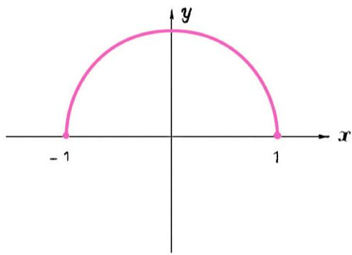
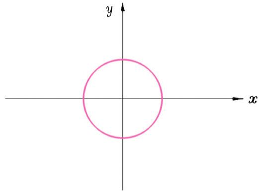
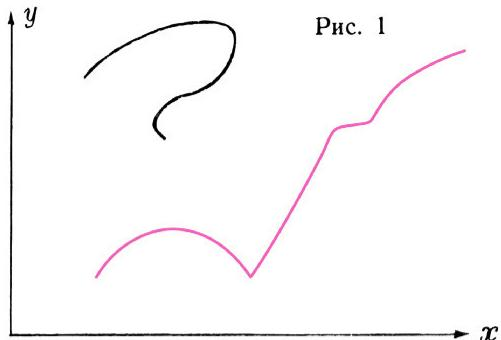
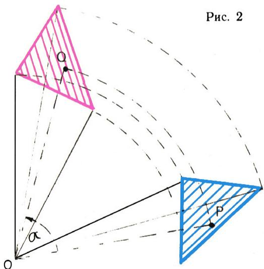
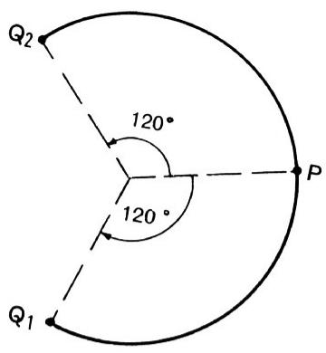
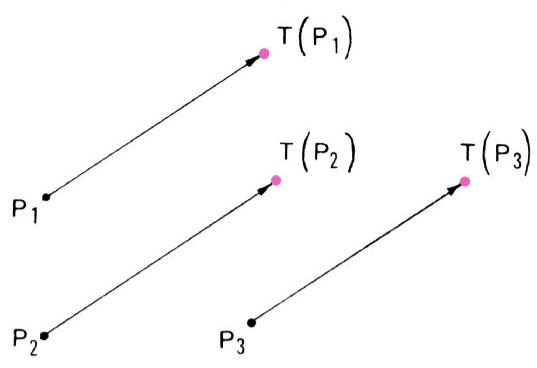
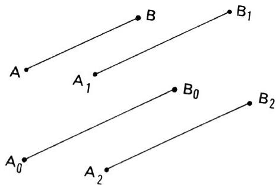
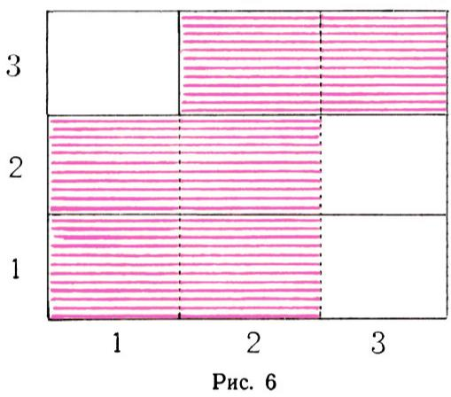

# 什么是函数的图像？

> **原标题**：Что такое график функции?
> **作者**：А. Н. Колмогоров（A. N. 柯尔莫哥洛夫，1903—1987）
> **译自**：Квант 1970, № 2, с. 3–13（答案见 с. 62）
> **原文扫描**：https://www.kvant.digital/data/kvant_1970_2/jpg/0003.jpg
> **主题**：函数／图像（函数图像的一般定义、数值平面、几何变换、向量）
> **难度**：★★（高一；系《什么是函数？》的续篇，需先读 A01）
> **译者**：Claude（初译）／ 2026-06-24

---

> *这里继续用新的、更一般的观点，来讲解中学里早已熟知的两个概念——函数及其图像。这一讲解始于本刊第 1 期的《什么是函数？》一文。要读懂本文，必须掌握第一篇里定义过的那些概念。*
> *——作者按*

## 1. 回顾与若干补充

在第 1 期《什么是函数？》一文中，你们已经了解了「函数」一词的现代的、一般的含义：**函数就是某个集合 $E$ 到另一个集合 $M$ 的完全任意的映射**。集合 $E$ 称为函数的**定义域**，集合 $M$ 称为它的**值域**。要给定一个以 $E$ 为定义域的函数，就要对 $E$ 中的每一个元素 $x$ 指定一个完全确定的对象

$$
y = f(x).
$$

无论用什么方式做到这一点，我们都得到一个定义域为 $E$ 的函数。例如，若 $E$ 由你们班上的同学组成，那么对任意一个同学 $x$，可以取他名字的第二个字母作为 $y = f(x)$（假定班里没有名字只有一个字母的同学——尽管我认识一个小女孩奥丽娅，大家就叫她一个字「奥」）。

这样给定函数时，它的值域 $M$ 也就自然确定了：$M$ 是所有那些至少存在一个 $x\in E$ 使 $f(x)=y$ 的对象 $y$ 的全体。因此，在描述「函数」一词的含义时，甚至可以不显式提及值域。例如，这样说就是对的：「**函数是一个规则，按照它，某个集合 $E$ 的每个元素 $x$ 都对应着一个完全确定的对象 $y=f(x)$**」。不过我们强调过，所有这些描述最好**不要当成定义**。倘若我们真想通过「规则」这个概念来定义函数，就会被要求先精确定义「规则」一词的含义，如此等等。我们把「函数」视为数学的基本概念之一，其含义只是加以说明，而不作形式定义。

在中学里，你们习惯于只和**数值函数**打交道——定义域由数组成、函数值也是数。「实变实值函数」的含义并不完全确定，因为「数」这个概念本身在中学里是逐步扩充的。我们取九年级学到的**全体实数**集合 $R$。实变实值函数主要在高中学习，其图像你们会在「数值平面」上绘制。

中学课本上写：「数值平面」是一个以某种确定方式引入了坐标的平面。若照字面相信课本，数值平面就有许许多多：老师在黑板上画下坐标轴，就把黑板平面变成了「数值平面」；学生在笔记本的一页上就能造出一个又一个「数值平面」，甚至一页上好几个！

在第 3 节你们会看到，数学家们真正打交道的数值平面是哪一个。但首先，我想对《什么是函数？》作一点补充。

中学代数里最常处理的是用公式「解析地」给出的函数。若没有别的说明，这种函数的定义域，就认为是使公式所规定的全部运算都能执行的那些自变量值的全体。例如，按中学惯例把 $\sqrt{\ }$ 理解为「算术」平方根，那么公式

$$
y = f(x) = (\sqrt{x})^{2}\tag{1}
$$

仅在 $x\geqslant 0$ 时才能算出对应的 $y$（否则平方根「开不出」）。当 $x\geqslant 0$ 时

$$
y = f(x) = x.\tag{2}
$$

公式 (2) 比公式 (1) 简单，我们很愿意把它当作定义该函数的公式。可是由公式 (2) 给出的函数，其定义域不止是非负数，而是**所有** $x$。若想重新给出由 (1) 定义的同一个函数，应当写成

$$
y = f(x) = \begin{cases} x, & \text{当}\ x \geqslant 0,\\ \text{无定义}, & \text{当}\ x < 0. \end{cases}\tag{3}
$$

类似地，函数 $g(x) = \dfrac{x^{3}-1}{x-1}$ 可写成

$$
g(x) = \begin{cases} x^{2}+x+1, & \text{当}\ x \neq 1,\\ \text{无定义}, & \text{当}\ x = 1. \end{cases}\tag{4}
$$

在中考和高校考试中，这类问题都要求完全精确。

## 2. 函数的图像

来看下面这张值班表（见《Квант》№ 1 第 29 页）：

|  | 一 | 二 | 三 | 四 | 五 | 六 | 日 |
|---|---|---|---|---|---|---|---|
| 佩佳 | ■ |  |  |  | ■ |  |  |
| 科里亚 |  | ■ |  |  |  | ■ |  |
| 萨沙 |  |  | ■ |  |  |  | ■ |
| 沃洛佳 |  |  |  | ■ |  |  |  |

我们已经知道这是一张函数的图像：值班者的名字可以看作「星期几」的函数。由于一星期有 7 天、孩子有 4 个，我们画了 $7\times 4 = 28$ 个格子，但只用红色涂了其中 7 个。要是孩子们决定按字母顺序排列自己的名字，就会得到第 6 页那张表。它看上去不同，但表示的是同一个值班分配——同一个函数。

在两张表里，28 个格子对应着 28 个可能的（星期，孩子）配对。其中被挑出了 7 对：

$$(\text{一, 佩佳}),\ (\text{二, 科里亚}),\ (\text{三, 萨沙}),\ (\text{四, 沃洛佳}),\ (\text{五, 佩佳}),\ (\text{六, 科里亚}),\ (\text{日, 萨沙}),$$

也就是所有「把星期几与那天的值班者配在一起」的对，即（星期几，那天的值班者），抽象地说，就是形如

$$
(x,\ f(x))
$$

的对。唯有这些对的选取，才对给定函数是本质的。

有了这个例子作铺垫，下面这个定义也许就不显得突兀了：

> **函数 $f$ 的图像**，是所有满足下面两个条件的对 $(x, y)$ 的集合：1° 对的第一个元素 $x$ 属于函数的定义域；2° 对的第二个元素 $y = f(x)$。

在我们的例子里，函数 $f$ 的图像是
$$
\Gamma_{f} = \{(\text{一, 佩佳}),\ (\text{二, 科里亚}),\ (\text{三, 萨沙}),\ (\text{四, 沃洛佳}),\ (\text{五, 佩佳}),\ (\text{六, 科里亚}),\ (\text{日, 萨沙})\}.
$$

对于上篇例 4 那张表给出的函数 $f_1,f_2,f_3,f_4$（定义在 $M=\{A,B\}$ 上），按此定义，它们的图像分别是

$$
\Gamma_{1} = \{(A,A),(B,A)\},\quad \Gamma_{2} = \{(A,B),(B,B)\},
$$
$$
\Gamma_{3} = \{(A,A),(B,B)\},\quad \Gamma_{4} = \{(A,B),(B,A)\}.
$$

显然，对于定义域有限的函数，图像的元素个数（即所含对的个数）等于定义域的元素个数。当定义域无限时，所有对 $(x, f(x))$ 无法一一列出，只能用它们的性质来描述。例如对函数 $y = f(x) = \sqrt{1-x^{2}}$，其图像由一切形如 $(x,\ \sqrt{1-x^{2}})$ 的数对组成，也就是所有满足下面两个条件的对 $(x,y)$：

$$
x^{2}+y^{2}=1\ \text{且}\ y\geqslant 0.
$$

这个图像定义可以写成

$$
\Gamma_{f} = \{(x,y)\mid x^{2}+y^{2}=1,\ y\geqslant 0\}.
$$

*函数 $y=\sqrt{1-x^{2}}$ 的图像（上半圆周）*

而函数图像最一般的定义可写成

$$
\Gamma_{f} = \{(x,y)\mid y = f(x)\}.
$$

把图像定义为「由自变量值与对应的函数值组成的对的集合」之后，我们就把图像这一概念从一切偶然因素中解放了出来。在这种抽象理解下，每个函数有且仅有一个图像。

## 3. 数值平面

现在来看中学里最常见的实变实值函数。中学里你们习惯于：这种函数 $f$ 的图像，是数值平面上所有坐标满足

$$
y = f(x)
$$

的点 $P(x, y)$ 的集合。这种说法和第 2 节给出的一般定义很像，但略有不同：第 2 节说的是**对** $(x, y)$ 的集合，而中学定义说的是**点** $P$（带坐标 $x, y$）的集合。能不能把这两种说法完全统一起来？

原来这很简单，而且这个简单的解决办法在现代科学文献中已普遍采用：**把数值平面定义为全体实数对的集合**。数值平面记作 $R^{2}$，其定义可形式地写成

$$
R^{2} = \{(x,y)\mid x\in R,\ y\in R\}.
$$

稍加思索你便会确信：在这种定义下，中学里关于实变实值函数图像的通常定义，就成了第 2 节一般定义的一个特例。

记号 $P(x, y)$（表示坐标为 $x, y$ 的点）现在变得多余了——数值平面的「点」，就是实数对 $(x, y)$ 本身。我们可直接说「点 $(0,0)$」（原点）、点 $(1, 2)$、点 $(-2, -1)$ 等等。

不妨注意，「数值直线」一词现在也获得了新含义：**数值直线就是实数集合 $R$ 本身**，其上的「点」就是实数本身。中学课本虽不明说，却常对数使用几何语言：把数集

$$
[a, b] = \{x\mid a\leqslant x\leqslant b\}
$$

称为「线段」，说「点」2 属于「线段」$[1, 3]$ 等等。

数值平面上任何一个点集，都称为该平面上的一个**几何图形**。例如以 $(0,0)$ 为圆心、半径为 1 的圆，就是所有满足 $x^{2}+y^{2}=1$ 的数对 $(x, y)$ 的集合。

自然，数值平面上的点和图形可以直观地画在图上：在真实平面（纸或黑板）上选好坐标轴，把数值平面的点 $(x, y)$ 画作坐标为 $x, y$ 的真实点。当然这种画法只能是近似的。纸面或黑板上的图像，只是函数「真正的」图像的近似表示——后者在我们新的理解下，不过是数值平面的一个子集。「函数完全由其图像确定」这句话，针对的正是这些「真正的」图像。

给定一个对 $(x, y)$ 的集合 $M$（数值平面上的任何「图形」都是这样的集合），要它成为某个函数的图像，需要额外要求什么？

*图 1：红线是函数图像，黑线不是*

答案不难：**必要且只要**在 $M$ 中找不到两个对 $(x, y_{1})$ 与 $(x, y_{2})$，它们有相同的第一个元素 $x$、却有不同的第二个元素 $y_{1}\neq y_{2}$。（请自行证明。）图 1 中红色曲线是函数的图像，黑色曲线则不是。

一个不含有 $(x, y_{1}), (x, y_{2})$（$y_{1}\neq y_{2}$）这种对的 $(x, y)$ 集合，可以称为**函数性图像**。注意，我们此刻定义「函数性图像」时并未用到「函数」概念。能否由此反过来给出「函数」概念的形式定义（我们原把它当作基本的、不作形式定义的概念）？这里先不回答——它并不很简单。本刊以后还有机会回到函数概念的现代理解及其历史。

## 4. 几何变换

为体会「函数」一词所涵盖的范围之广，再看几个最简单的几何变换。

要把一个平面图形绕点 $O$ 旋转（图 2），可把图形轮廓描到覆在图面上的描图纸上，用大头针把描图纸固定在点 $O$，转动描图纸，再把描图纸上图形副本的轮廓转描到图面上（例如借助复写纸）。旋转时，图形的 all 点都绕 $O$ 沿同一方向转过同一角度。

记

$$
Q = R_{O}^{\alpha}(P)\tag{1}
$$

为点 $P$ 逆时针转角 $\alpha$ 后的位置。若 $O$ 与 $\alpha$ 给定，则每个点 $P$ 都由公式 (1) 对应一个完全确定的点 $Q$。可见按我们的一般定义，$R_{O}^{\alpha}$ 是一个函数，其定义域是平面的所有点。

*图 2：绕 $O$ 旋转*

旋转角带符号。图 3 中点 $Q_{2}$ 由 $P$ 转 $120^{\circ}$ 得到，而 $Q_{1}$ 由 $P$ 转 $-120^{\circ}$（即转 $240^{\circ}$）得到。若 $Q$ 由 $P$ 转 $\alpha$ 度得到，则 $P$ 可由 $Q$ 转 $-\alpha$ 度得到：若

$$
Q = R_{O}^{\alpha}(P),\quad\text{则}\quad P = R_{O}^{-\alpha}(Q).
$$

可见旋转 $R_{O}^{\alpha}$ 总是**可逆函数**。谈到旋转时，更常说「映射」。$R_{O}^{\alpha}$ 的逆映射是 $R_{O}^{-\alpha}$：

$$
R_{O}^{-\alpha}\!\left(R_{O}^{\alpha}(P)\right) = P,\qquad \left(R_{O}^{\alpha}\right)^{-1} = R_{O}^{-\alpha}.
$$

*图 3：带符号的旋转角*

旋转把平面的点集映射到自身。若认为平面就是它自身点的集合（现代几何陈述正是如此），那么旋转就是平面到自身的可逆映射。**平面到自身的可逆映射，就叫作平面的几何变换。** 你们还会在本刊多次遇到几何变换。这里再举一例：**平行移动（平移）** 是平面到自身的映射

$$
P \to Q = T(P),
$$

其中所有点 $P$ 都沿同一方向移动同一距离（图 4）。

*图 4：平行移动 $T$*

## 5. 向量

也许你们已经对新概念、以及对旧概念的新讲法感到疲倦，但还是再作一次努力吧。让我们弄清：**平行移动 $P\to Q=T(P)$ 的图像**是什么。按一般定义，它是所有满足 $B=T(A)$ 的点对 $(A, B)$ 的集合。

*图 5：平移 $T$ 的图像 = 自由向量*

任取这样一对点 $(A_{0}, B_{0})$。其余的对有何特征？在于：线段 $AB$ 与线段 $A_{0}B_{0}$ **等长且同向**（图 5）。平移 $T$ 的图像，按定义就是所有这种点对 $(A, B)$ 的集合。

通常认为，任一对点 $(A, B)$ 确定一个「**绑定向量** $\overrightarrow{AB}$」；而绑定向量 $\overrightarrow{AB}$ 与 $\overrightarrow{A'B'}$ 确定同一个「**自由向量**」，当且仅当线段 $AB$ 与 $A'B'$ 等长且同向。

更简单的说法是：「绑定向量」就是点对 $(A, B)$ 本身；而「自由向量」$\overrightarrow{AB}$ 是所有与 $(A, B)$ 等长且同向的绑定向量 $(A', B')$ 的集合。而按图像的一般定义，这个集合不是别的，正是由 $T(A)=B$ 所确定的平移 $T$ 的图像。

若 $T(A_{1})=B_{1},\ T(A_{2})=B_{2},\ T(A_{3})=B_{3},\ldots$，则记

$$
\overrightarrow{A_{1}B_{1}} = \overrightarrow{A_{2}B_{2}} = \overrightarrow{A_{3}B_{3}} = \cdots = \mathbf{a},
$$
$$
T = T_{\overrightarrow{A_{1}B_{1}}} = T_{\overrightarrow{A_{2}B_{2}}} = \cdots = T_{\mathbf{a}}.
$$

形成一般概念的逻辑，把我们引向一个略不寻常的结论：**自由向量 $\mathbf{a}$，无非就是沿向量 $\mathbf{a}$ 所作平移 $T_{\mathbf{a}}$ 的图像**。要是你能完全想清楚——这是所采用的「图像」「自由向量（等长同向绑定向量的集合）」「绑定向量（点对）」这些定义的必然推论——那就很好。不过该说明，关于绑定向量与自由向量的这种定义并非完全通用，尽管作者认为它们最为方便。

## 习题

**§1 回顾与补充**

1. 求下列函数的定义域：
$$
f_{1}(x) = \frac{x}{x - |x|},\quad f_{2}(x) = \frac{\sqrt{1-x}}{\sqrt{1+x^{2}}},\quad f_{3}(x) = \frac{x^{4}-1}{x^{2}-1}.
$$

2. 要在公式 $f(x) = x^{2}+1$ 上加什么条件，它才能确定题 1 中的函数 $f_{3}$？

3. 要在公式 $f(x) = 1$ 上加什么条件，才能得到函数 $f_{4}(x) = (\sqrt{x})^{2} + (\sqrt{1-x})^{2}$ 的定义？

> *注：题 1—3 中，$\sqrt{\ }$ 均指「算术」平方根，即非负值。*

**§2 函数的图像**

4. 定义域为 $\{1,2,3\}$、且图像是集合 $\{(1,1),(1,2),(2,1),(2,2),(2,3),(3,3)\}$ 的子集的函数，共有多少个（见图 6）？其中有多少个有反函数？

*图 6：题 4 的点集*

5. 证明：反函数 $f^{-1}$ 的图像由下式确定
$$
\Gamma_{f^{-1}} = \{(x,y)\mid (y,x)\in\Gamma_{f}\}.
$$
（当然，前提是 $f$ 有反函数。）

**§3 数值平面**

6. 描述**狄利克雷函数**图像的构造：
$$
D(x) = \begin{cases}1, & x\ \text{为有理数},\\ 0, & x\ \text{为无理数}.\end{cases}
$$

7\*. 把区间 $[0,1]$ 上的数 $x$ 展成无穷三进制小数 $x = 0.x_{1}x_{2}x_{3}\ldots$（$x_{n}=0,1,2$）。函数 $y = C(x)$ 的值由二进制小数 $y = 0.y_{1}y_{2}y_{3}\ldots$（$y_{n}=0,1$）按下述规则给出：若 $x_{n}=0$，则 $y_{n}=0$；若 $x_{n}=1$ 或 $2$，则——在 $x_{1},\ldots,x_{n-1}$ 中尚未出现过 1 时取 $y_{n}=1$、已经出现过 1 时取 $y_{n}=0$。试作出这个函数的图像，证明它含无穷多条水平线段；若你熟悉连续性，证明该函数连续。

> *注：本题不回避从某位起全为 2 的三进制小数、从某位起全为 1 的二进制小数。如三进制下 $0.2222\ldots = 1$，$0.12222\ldots = 0.20000\ldots$；二进制下 $0.1111111\ldots = 1$，$0.01011111\ldots = 0.01100000\ldots$。*

**§4 几何变换**

8. 用几何语言描述下列数值平面的变换：
$$
\begin{aligned}
\text{а)}\ &(x,y)\to(-y,x),\\ \text{б)}\ &(x,y)\to(x,-y),\\ \text{в)}\ &(x,y)\to(y,-x),\\ \text{г)}\ &(x,y)\to(-x,y),\\ \text{д)}\ &(x,y)\to(x+1,y),\\ \text{е)}\ &(x,y)\to(x+a,\ y+a).\end{aligned}
$$

9. 对绕同一中心 $O$ 的旋转，证明
$$
R_{O}^{\alpha}\!\left[R_{O}^{\beta}(P)\right] = R_{O}^{\alpha+\beta}(P).\tag{1}
$$

10. 证明：对任意中心 $O_{1}, O_{2}$，变换 $F(P) = R_{O_{1}}^{\alpha}\!\left[R_{O_{2}}^{-\alpha}(P)\right]$ 是一个平移。它沿什么方向、移动多远？

**§5 向量**

11. 证明 $T_{\mathbf{a}}\!\left[T_{\mathbf{b}}(P)\right] = T_{\mathbf{a}+\mathbf{b}}(P)$。

12. 证明 $F(P) = T_{\mathbf{a}}\!\left[R_{O}^{\alpha}(P)\right]$ 是一个旋转，转角为 $\alpha$。绕哪个中心？

> *注：公式 (1)、(2) 常简记为 $R_{O}^{\alpha}R_{O}^{\beta} = R_{O}^{\alpha+\beta}$，$T_{\mathbf{a}}T_{\mathbf{b}} = T_{\mathbf{a}+\mathbf{b}}$。「函数的函数」（映射的复合）在许多方面像乘法，但这是另一话题，本文容纳不下。下面题 13、14 用此简记。*

13. 证明总有 $T_{\mathbf{a}}T_{\mathbf{b}} = T_{\mathbf{b}}T_{\mathbf{a}}$，且绕同一中心的旋转满足 $R_{O}^{\alpha}R_{O}^{\beta} = R_{O}^{\beta}R_{O}^{\alpha}$。举例说明：绕不同中心 $O_{1},O_{2}$ 时，一般地 $R_{O_{1}}^{\alpha}R_{O_{2}}^{\beta} \neq R_{O_{2}}^{\beta}R_{O_{1}}^{\alpha}$。

14. 完整讨论：何时确有 $R_{O_{1}}^{\alpha}R_{O_{2}}^{\beta} = R_{O_{2}}^{\beta}R_{O_{1}}^{\alpha}$。

---

### 答案与提示（с. 62）

1. 1) $x\neq 0$；2) $x\leqslant 1$；3) $x\neq -1$ 且 $x\neq +1$。
3. $0\leqslant x\leqslant 1$。
4. 共 6 个，其中 2 个有反函数。
6. 图像的所有点都落在两条线段 $D=0,\ 0\leqslant x\leqslant 1$ 与 $D=1,\ 0\leqslant x\leqslant 1$ 上，且在每条线段上都「处处稠密」（即对该线段上任一点 $M$ 和任一 $\varepsilon>0$，都能找到图像上与 $M$ 距离小于 $\varepsilon$ 的点）。
7. 见图 1（答案页）。
8. а) 绕原点逆时针转 $90^{\circ}$；б) 关于 $Ox$ 轴的对称；е) 当 $a>0$ 时沿 $Oxy$ 角平分线方向平移距离 $|a|$，$a<0$ 时反向。
10. 沿以 $O_{2}$ 为起点、$R_{O_{1}}^{\alpha}(O_{2})$ 为终点的向量平移（等价地，沿以 $R_{O_{2}}^{-\alpha}(O_{1})$ 为起点、$O_{1}$ 为终点的向量）。
11. 把点 $B$ 关于角平分线对称反射。
13. 证明：在 $\triangle ABC$ 中，若 $BM$ 是中线且 $AB>BC$，则 $\angle ABM < \angle MBC$；再由条件 $AH=BM$ 推出 $\angle MBC = 30^{\circ}$。

> **译者注**：第 13 题答案页的文字似与本题主线（旋转向量复合）略有出入，疑为原版答案页跨题排印所致；此处照录，供对照原文核查。

---

## 译者注与校对说明

1. **续篇关系**：本文是 A01《什么是函数？》的直接续篇，沿用「函数=映射」「图像=对的集合」的一般观点，并把它推广到数值平面 $R^{2}$（定义为实数对集合）、几何变换（旋转、平移）、向量（=平移的图像）。
2. **OCR 校正**：本篇扫描页存在新旧两套命名（`p03.jpg` 与 `p3.jpg` 等）导致 OCR 重复，已用更新后的 `archive_ocr.py` 按页码去重；俄文项目字母 а/б/в/г/д/е（OCR 误作 a/6/b/r）已还原；狄利克雷函数、Cantor 型函数 $C(x)$、旋转复合 $R_{O}^{\alpha}R_{O}^{\beta}$ 等公式均与扫描页核对。
3. **插图**：原文图 1—6 由 MinerU 裁出存于 `images/1970_02_kolmogorov_grafik/fig_pXX_NN.png`（已按 hash 去重）；值班表、$f_1$—$f_4$ 表用 Markdown 重排。

## 建议讨论题

1. Kolmogorov 为何坚持把「数值平面的点」就定义为**数对** $(x,y)$ 本身，而不是带坐标的「点 $P(x,y)$」？这一字之差解决了什么问题？
2. 「函数完全由其图像确定」——那么一个点集要成为函数的图像，充要条件是什么？图 1 的红线满足、黑线不满足，为什么？
3. 把「自由向量」理解为某个平移的**图像**，这种讲法和中学里「有大小有方向的量」相比，好处在哪？
4. （开放）第 7 题的 Cantor 型函数 $C(x)$ 把三进制小数「翻译」成二进制小数，它是连续的——你能猜到它的图像长什么样吗？（提示：与 Cantor 三分集有关。）

---

> **版权说明**：原文版权归 MCCME 及作者继承者所有。本译文为非商业、自用、数学圈内部参考。原文扫描见 [kvant.digital](https://www.kvant.digital/data/kvant_1970_2/jpg/0003.jpg)。
>
> **复用说明**：俄文 OCR 与插图存档于 `ocr/1970_02_kolmogorov_grafik/`（`ru.md` 已去重）。如对译文不满意，可基于 `ru.md` 重译，无需重跑 OCR。
