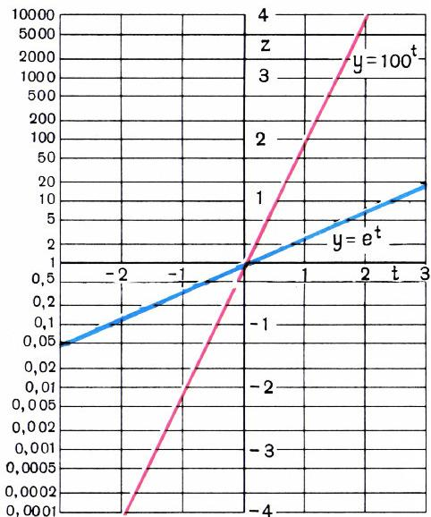
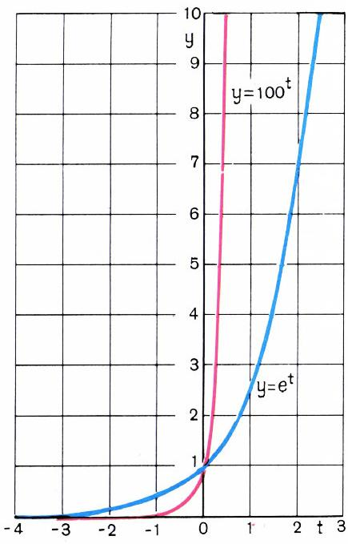
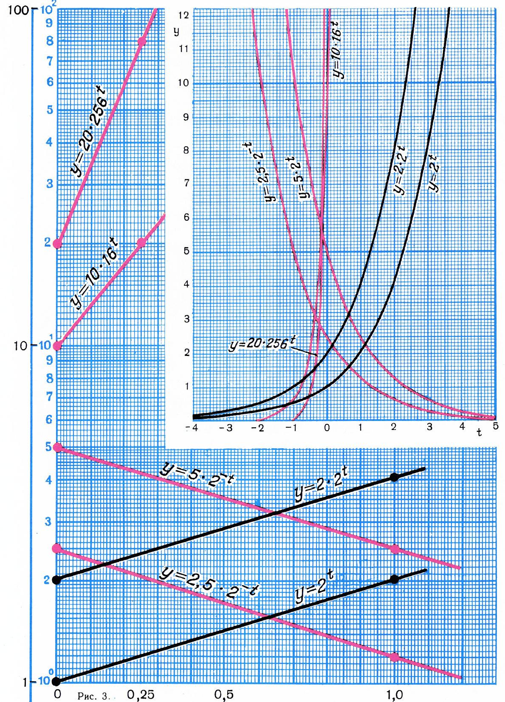
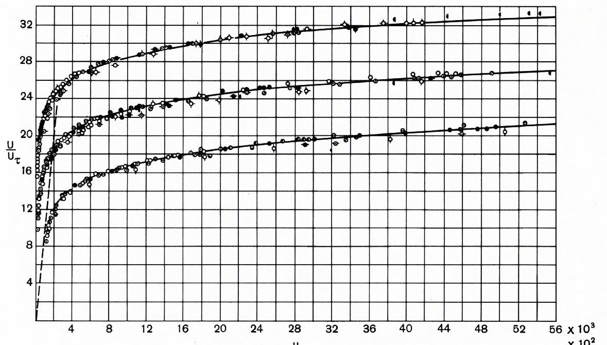
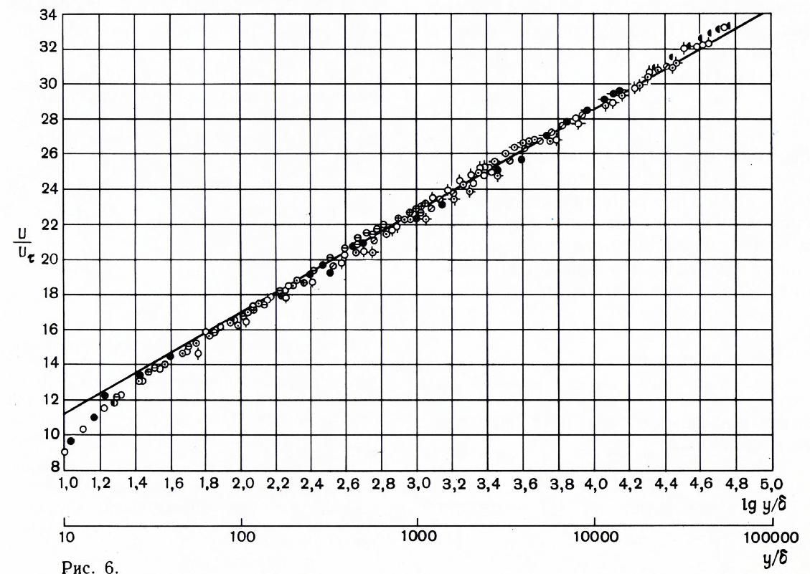
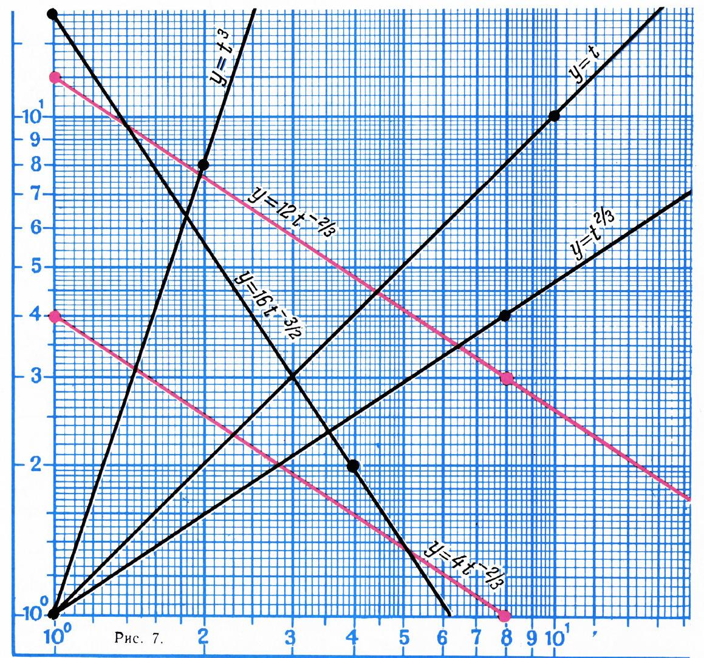
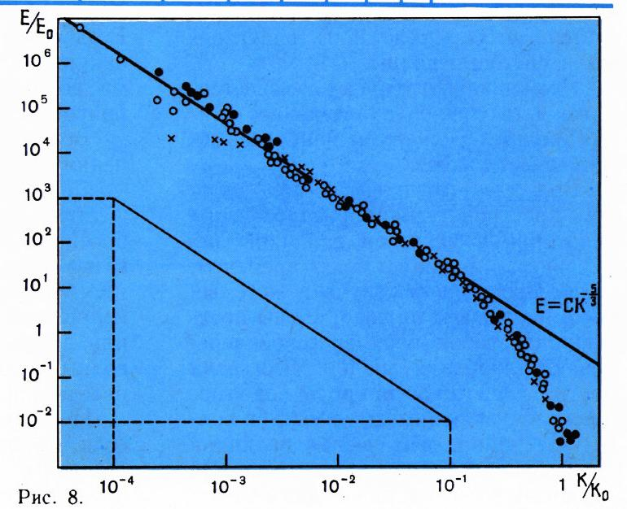

# 半对数与全对数坐标纸

> **原标题**：Полулогарифмическая и логарифмическая сетки
> **作者**：А. Н. Колмогоров（A. N. 柯尔莫哥洛夫，1903—1987）
> **译自**：Квант 1973, № 3, с. 2–7
> **原文扫描**：https://www.kvant.digital/data/kvant_1973_3/jpg/0002.jpg
> **主题**：函数／对数坐标（指数增长、幂律的图形化）
> **难度**：★★（高一；用到对数与导数概念）
> **译者**：Claude（初译）／ 2026-06-24

---

## 1.

《Квант》1972 年第 12 期曾刊出《指数函数》一文。文中指出，许多量随时间变化时，其**变化速度**与该量**已经达到的值**成正比。这种指数依赖关系 $y$ 对 $t$ 的一般形式可写成

$$
y = y_{0}\, a^{t},\tag{1}
$$

其中 $y_{0}$ 是 $t=0$ 时 $y$ 的值。令

$$
k = \lg a,\quad z = \lg y,\quad b = \lg y_{0},
$$

则由 (1) 得 $z = kt + b$。

可见 $z$ 对 $t$ 的依赖是**线性**的，其图像是一条直线。按通常方式画出这条直线后，我们就可以在 $z$ 轴（或与之平行的直线）上标出对应的 $y = 10^{z}$ 的值。于是，沿这条直线的图形，就能对任意给定的 $t$ 直接读出 $y$。图 1 用这种作图方式画出了函数 $y = 100^{t}$ 和 $y = e^{t}$（$e = 2{,}718\ldots$）。它们在普通直角坐标系中的图像见图 2。

*图 1：$y=100^{t}$、$y=e^{t}$ 在半对数坐标纸上（直线）*

*图 2：同样两个函数在普通直角坐标系中*

商店里出售一种**半对数纸**。在这种纸上，竖线像普通毫米纸那样以 1 mm 为间距画出；而横线到下边缘的距离则等于 $100\lg y$，其中 $y$ 依次取

$$
1,\ 1{,}05,\ 1{,}10,\ 1{,}15,\ldots\quad(\text{第一个十进位段}),
$$
$$
2,\ 2{,}1,\ 2{,}2,\ 2{,}3,\ldots\quad(\text{第二个十进位段}),
$$

等等（请对照图 3 弄清这条刻度是怎样构造的！）。图 3 的下部展示了如何根据两点 $t=0,\ y=y_{0}$ 和 $t=1,\ y=y_{0}a$ 在半对数纸上作出形如 (1) 的函数图像。

*图 3：半对数纸刻度的构造与作图*

在半对数纸上，$\Delta t = 1$ 的增量对应 10 cm。我们在图 3 的 $y$ 轴上也选了同样的尺度，因此所画图像的角系数（斜率）等于 $k = \lg a$。它正是 $y$ 随 $t$ 变化的**相对速度**：

$$
\frac{1}{y}\lim_{\Delta t \to 0}\frac{\Delta y}{\Delta t} = \frac{y'}{y} = \lg a = k
$$

（这里 $y'$ 是函数 $y = f(t) = y_{0}a^{t}$ 的导数）。若 $y$ 轴的尺度另选，则需另作换算，这你自能处理。

当我们要判断某个由表格给出的依赖关系 $y = f(t)$ 能否（至少近似地）看作服从指数增长（或衰减）规律时，就在半对数纸上作图。举一个例子——苏联工业产值（以 1940 年产值为 100% 计）：

| 年份 | 1937 | 1940 | 1945 | 1950 | 1955 | 1960 | 1965 | 1970 |
|---|---|---|---|---|---|---|---|---|
| % | 77 | 100 | 92 | 173 | 320 | 524 | 791 | 1190 |

*图 4：苏联工业产值的半对数图*

半对数图见图 4（普通线性纵轴的图你可以自己画来对比）。从图上可以看出，除 1940—1945 年这段战争时期外，工业产值的增长**近似地服从指数规律**。请自行求出图中平均倾斜角对应每年百分之几的增长。图上还显示，1945—1955 年的增长率略高于 1960—1970 年。

有趣的是，把 1945 和 1950 年对应的点剔除后，其余各点几乎落在一条直线上：在 1945—1955 这十年间，我国工业弥补了战争期间的损失。请算出 1937—1970 年间产值的平均年增长率（每年百分之几）。

## 2.

显然，形如

$$
y = A\lg t + B
$$

的依赖关系，只要在横轴上标 $s = \lg t$、纵轴上标 $y$，其图像也是一条直线。作为一个例子，考虑图 5 所示的依赖关系：流体沿平壁作**湍流**流动时，速度 $u$ 与到壁面距离 $y$ 的关系。这里 $\delta$ 和 $u_{\tau}$ 是适当选定的长度与速度尺度。测量是在 $y/\delta$ 从 10 到 56 000 的范围内进行的，因此为了表示测量结果，原本需要三张横轴尺度不同的图。改用 $y/\delta$ 的**对数尺度**后，所有数据都落在了一张图上（见图 6），而且图「变直」了。图 6 中的直线方程为

$$
\frac{u}{u_{\tau}} = 5{,}5 + 5{,}75\,\lg\, y/\delta.\tag{2}
$$

可见从 $y/\delta = 100$ 起，这一规律符合得非常好；$y/\delta$ 更小时出现系统性偏离，而 $y/\delta < 15$ 时偏离之大，使得 (2) 式在此已完全不能用了。

*图 5—6：湍流边界层速度 $u(y)$：普通坐标（三段不同尺度）与对数坐标（合并成直线）*

## 3.

形如

$$
y = c\, t^{\alpha}\tag{3}
$$

的依赖关系，在换成变量

$$
s = \lg t,\quad z = \lg y
$$

后也同样「变直」。事实上，由 (3) 得

$$
z = \alpha s + b,\tag{4}
$$

其中 $b = \lg c$。为了用直线图像表示形如 (3) 的依赖关系，人们使用**对数纸**（双对数坐标纸，它在商店里也有售）。图 7 给出了对数纸上图像的例子。容易看出，这里图像的角系数等于 $\alpha$。

*图 7：对数纸上幂函数图像示例*

当有理由认为某个经验依赖关系近似服从 (3) 的规律时，就在对数纸上作图。图 8 在对数纸上画出了湍流脉动能谱分布的经验数据：$E(k)$ 是对应频率 $k$ 的脉动能量谱密度，$E_{0}$ 与 $k_{0}$ 是 $E$ 与 $k$ 的约定单位。可以看到，当

$$
10^{-4} k_{0} \leqslant k \leqslant 10^{-1} k_{0}
$$

时，该依赖关系很好地用如下形式的公式表达

$$
E = c\, k^{-5/3},
$$

这个公式是从理论考虑出发由 А. М. 奥布霍夫（Obukhov）提出的。

*图 8：湍流脉动能谱 $E(k)$（对数纸），符合 Obukhov 的 $k^{-5/3}$ 律*

这里 $\lg k$ 和 $\lg E$ 的尺度不同，因此与给定 $\alpha$ 对应的图像角系数并不等于 $\alpha$。图中展示了如何用图形法作出斜率对应于 $\alpha = \tfrac{5}{3}$ 的直线。

## 习题

把第 7 页表格中苏联工业产值按两组——**甲组**（生产资料生产）与**乙组**（消费品生产），均以 1913 年为 100%——的数据画在半对数纸上。

| 年份 | 甲组(A) | 乙组(B) |
|---|---|---|
| 1913 | 100 | 100 |
| 1917 | 81 | 67 |
| 1928 | 155 | 120 |
| 1932 | 424 | 187 |
| 1937 | 1013 | 373 |
| 1940 | 1340 | 460 |
| 1945 | 1504 | 273 |
| 1950 | 2746 | 566 |
| 1955 | 5223 | 996 |
| 1960 | 8936 | 1498 |
| 1965 | 14156 | 2032 |
| 1970 | 21359 | 3281 |

> *注：在全部工业产值中，甲组所占比重 1913 年为 35.1%，1970 年为 74.8%。*

问：哪些年份甲组产值的增长超过了乙组，哪些年份两者并驾齐驱？请比较两次世界大战战时情况的特点。

---

## 译者注与校对说明

1. **主题与背景**：本文讲如何用**半对数纸**（纵轴按 $\lg y$ 刻度）把指数型 $y=y_{0}a^{t}$ 化直、用**（全）对数纸**（双轴均按对数刻度）把幂律型 $y=ct^{\alpha}$ 化直，并借此从经验数据判定律型。物理例子（湍流边界层速度律 $u/u_{\tau}=5{,}5+5{,}75\lg(y/\delta)$、湍流能谱 $E\sim k^{-5/3}$ 的 Obukhov 律）皆为经典。
2. **时代背景**：文中苏联工业产值数据为 1973 年原文所附的历史统计，保留原貌不作改写（参见《01_工作规范.md》关于保留时代感的规定）。
3. **OCR 校正**：原文第 2 页半对数纸纵轴刻度表（$1,1{,}05,\ldots;\ 2,2{,}1,\ldots$）OCR 排版错乱，已按「每个十进位段」重排；俄文小数用逗号（$5{,}5$）保留以存原貌。公式与各图均与扫描页核对。
4. **图号说明**：原文插图编号 рис.1—8，由 MinerU 自动裁出（存 `images/1973_03_kolmogorov_A03/fig_pXX_NN.png`）；图 3 跨 p3—p4，图 5—6（湍流速度的普通/对数对比）合述。

## 建议讨论题

1. 为什么 $y = 2^{t}$ 在半对数纸上是直线，而在普通坐标纸上不是？直线的斜率告诉了你什么？
2. 用半对数纸判断「是否指数增长」比直接看普通图像好在哪？试想如果数据有周期性波动，半对数图上会是什么样？
3. 幂律 $y = ct^{\alpha}$ 在双对数纸上是斜率为 $\alpha$ 的直线——你能用这个事实，从一组 $(t,y)$ 数据快速估出 $\alpha$ 吗？
4. （开放）湍流能谱的 $k^{-5/3}$ 律是 1941 年 Kolmogorov 自己提出的（文中归功于 Obukhov 的相关表述）。查一查这个「$-5/3$」在物理上意味着什么？

---

> **版权说明**：原文版权归 MCCME 及作者继承者所有。本译文为非商业、自用、数学圈内部参考。原文扫描见 [kvant.digital](https://www.kvant.digital/data/kvant_1973_3/jpg/0002.jpg)。
>
> **复用说明**：俄文 OCR 原文与插图存档于 `ocr/A03_kolmogorov_1973_03_半对数与全对数坐标纸/`（`ru.md` 为合并 OCR 文本）。如对译文不满意，可基于 `ru.md` 重译，无需重跑 OCR。
