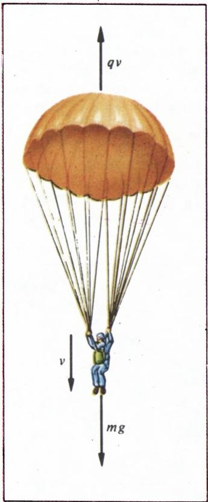
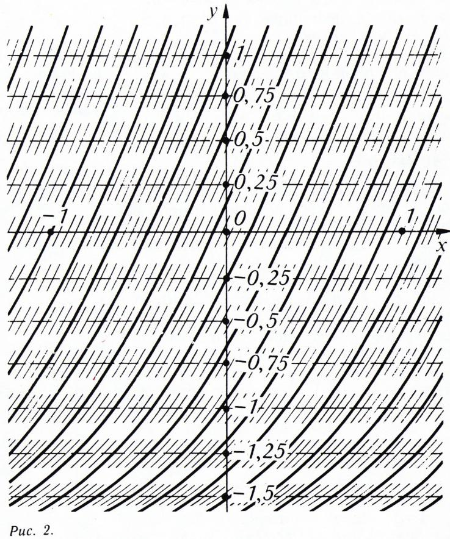
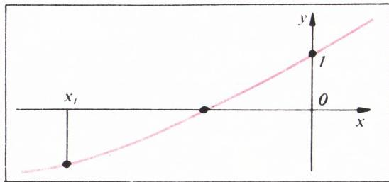
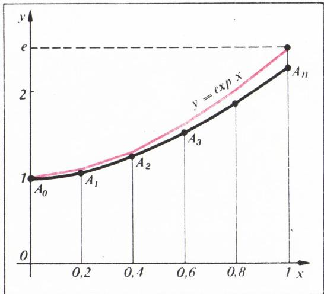
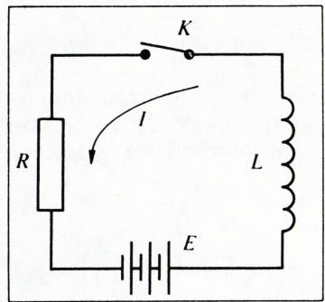
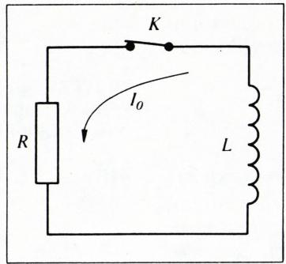
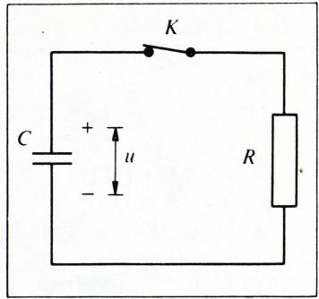

# 指数函数

> **原标题**：Экспонента
> **作者**：В. Г. Болтянский（V. G. 博尔强斯基，1915—1991，苏联数学家，苏联教育科学院通讯院士）
> **译自**：Квант 1984, № 10, с. 20–24
> **原文扫描**：https://www.kvant.digital/magazines/1984-10
> **主题**：指数函数 exp、数 $e$、线性微分方程 $y'=ay+b$ 的解法
> **难度**：★★（高中；需用到导数与微分方程的基本概念）
> **译者**：Claude（初译）／ 2026-06-24

---

## 1. 物体在阻力介质中下落的问题

在一具正在下落的跳伞员身上，作用着重力与空气阻力（在无风的日子里，其他影响可以忽略不计）。空气阻力可以认为与速度 $v$ 成正比，也就是说其大小等于 $qv$（系数 $q$ 主要取决于降落伞的直径与形状）。于是

$$
m a = m g - q v,
$$

其中 $a=v'$ 是加速度的大小（$qv$ 前的负号与下述事实有关：空气阻力的方向与下落方向相反；见图 1）。两边除以 $m$，得

$$
v ^ {\prime} = - \frac {q}{m} v + g.\tag{1}
$$

关系式 (1) 是一个线性微分方程：未知函数 $v=v(t)$（要从该方程确定的）的导数，被表示成这个未知函数的一个一次多项式。把未知函数记作 $y=y(x)$，把系数记作 $a$ 和 $b$，则微分方程写作

$$
y ^ {\prime} = a y + b.\tag{2}
$$

并非只有物体在阻力介质中下落才由这样的微分方程来描述，许多别的物理过程也是如此。

*图 1*

## 2. 存在与唯一性定理

**定理 1.** 无论实数 $x_0,\ y_0$ 如何，都存在、并且只存在唯一的一个函数 $y=y(x)$，它既是方程 (2) 的解，又满足关系式 $y(x_0)=y_0$。这个解在整个实数轴上都有定义。

关系式 $y(x_0)=y_0$ 称为**初值条件**。于是，定理 1 的意思是：方程 (2) 在任意给定的初值条件下都有解（而且是唯一的）。

下面给出这一定理的几何解释，并就 $a=1,\ b=2$ 的特例加以考察，也就是取方程

$$
y ^ {\prime} = y + 2.\tag{3}
$$

在 $y=0$ 的点处（即在 $x$ 轴上），按 (3) 有 $y'=2$，也就是说，所求函数 $y(x)$ 的图像在这些点处的切线斜率应为 2。我们在横轴上的一些点处用短划线标出切线方向（图 2）。进一步，当 $y=1$ 时，按 (3) 有 $y'=3$，也就是说在直线 $y=1$ 上的点处，所求函数图像的切线斜率应为 3；我们在直线 $y=1$ 上的点处也用短划线标出切线方向。然后，我们还可以在平行于横轴的其他直线上标出短划线（图 2）。现在，这个「方向场」的「力线」的行为就变得清楚起来了：每条「力线」在它的每一点处都与相应的短划线相切，也就是说它的切线斜率 $y'$，按照短划线的作法，等于 $y+2$。这意味着，「力线」就是满足方程 (3) 的函数的图像。从图中可以清楚看到，每一点 $(x_0;\ y_0)$ 处都有一条、且只有一条「力线」经过。这就直观地证实了定理 1 的正确性。

*图 2：方程 $y'=y+2$ 的方向场*

它的证明（在我们所需的特殊情形下）在文末（见习题 12—15）中勾勒。

## 3. 指数函数

满足微分方程 $y'=y$ 及初值条件 $y(0)=1$ 的函数，称为**指数函数**，记作 $\exp$。

注意，方程 $y'=y$ 是方程 (2) 的特殊情形；因此，根据定理 1，它带有初值条件 $y(0)=1$ 的解存在而且被唯一地确定，且这个解（即指数函数）的定义域是整个实数轴。

由定义直接可知，指数函数是可微函数，且其导数与它自身相重合（因为它是方程 $y'=y$ 的解）：

$$
(\exp x) ^ {\prime} = \exp x.\tag{4}
$$

**定理 2.** 函数 $\exp$ 的值都是正的，即对任意实数 $x$ 都有 $\exp x > 0$。

**证明.** 假设对某个 $x_0$ 有 $\exp x_0 = 0$。那么函数 $y=\exp x$ 既满足方程 $y'=y$ 又满足条件 $y(x_0)=0$。函数 $y\equiv 0$ 也满足方程 $y'=y$ 及条件 $y(x_0)=0$。而函数 $y=\exp x$ 与 $y\equiv 0$ 是不同的（例如 $\exp 0=1$，即 $\exp 0 \ne 0$）。这样一来，方程 $y'=y$ 在初值条件 $y(x_0)=0$ 下就有两个不同的解，这与定理 1 矛盾。所以，$\exp x=0$ 对任何 $x$ 都不可能成立。

现在假设对某个 $x_1$ 有 $\exp x_1 < 0$。函数 $\exp$ 是可微的，因而也是连续的；于是在两个它取不同符号值的点之间（$\exp x_1 < 0$，$\exp 0 = 1$），这个函数必然取到零值（图 3）。但我们已经看到，这是不可能的。

*图 3*

因此，指数函数既不能取零值，也不能取负值；也就是说，对任意 $x \in \mathbb{R}$ 都有 $\exp x > 0$。

**推论.** 指数函数是单调递增的。

事实上，函数 $\exp$ 的导数（即它自身）按定理 2 只取正值，所以函数 $\exp$ 是递增的。

**定理 3.** 对任意 $p,\ q \in \mathbb{R}$，有

$$
\exp (p + q) = \exp p \cdot \exp q.\tag{5}
$$

**证明.** 考察函数 $y=\exp(p+x)$。有

$$
y ^ {\prime} = (\exp (p + x)) ^ {\prime} = \exp (p + x) = y
$$

（参见 (4)），即这个函数满足方程 $y'=y$。此时 $y(0) = \exp p$。

再考察函数 $y=\exp p \cdot \exp x$。有

$$
y ^ {\prime} = \exp p \cdot (\exp x) ^ {\prime} = \exp p \cdot \exp x = y,
$$

即这个函数也满足方程 $y'=y$。此时 $y(0) = \exp p$。由定理 1，所考察的两个函数相同：

$$
\exp (p + x) = \exp p \cdot \exp x.
$$

特别地，取 $x=q$ 即得 (5)。

## 4. 数 $e$

函数 $\exp$ 在 $x=1$ 处的值用一个字母 $e$ 来记，即 $e=\exp 1$。为了求出数 $e$ 的近似值，可如下进行。把区间 $[0;\ 1]$ 分成 $n$ 等份（每份长度为 $\Delta x = 1/n$）。过点 $A_0\,(0;\ 1)$ 作一条与方程 $y'=y$ 相应的「短划线」；它的斜率 $k_1 = y$，即 $k_1 = 1$。我们考察位于区间 $[0;\ 1/n]$ 上方的这一段「短划线」。它的右端点 $A_1$ 的坐标是 $x=1/n$，$y=1+k_1 \Delta x = 1+1\cdot 1/n = 1+1/n$（图 4）。

过 $A_1$ 作一条新的「短划线」，它同样与方程 $y'=y$ 相应；它的斜率等于 $y$（即点 $A_1$ 的纵坐标），也就是说等于 $k_2 = 1+1/n$。考察位于 $[1/n;\ 2/n]$ 上方的这一段。它的右端点 $A_2$ 的坐标是

$$
x = \frac{2}{n},\quad y = \left(1 + \frac{1}{n}\right) + k_2 \Delta x = \left(1 + \frac{1}{n}\right) + \left(1 + \frac{1}{n}\right) \cdot \frac{1}{n} = \left(1 + \frac{1}{n}\right) ^ {2}.
$$

过 $A_2$ 再作一条与方程 $y'=y$ 相应的「短划线」。它的斜率 $k_3$ 等于点 $A_2$ 的纵坐标，即 $k_3 = (1+1/n)^{2}$，而右端点 $A_3$ 的坐标是 $x = 3/n$，$y = (1+1/n)^{2} + k_3 \Delta x = (1+1/n)^{3}$。

如此继续，便得到折线 $A_0 A_1 A_2 \ldots A_n$——方程 $y'=y$ 的**欧拉折线**（图 4 中为方便起见两坐标轴取了不同的比例）；点 $A_n$ 的坐标是 $x=1$，$y=(1+1/n)^{n}$。这条折线给出了过点 $A_0$ 的方程 $y'=y$ 的解、即函数 $y=\exp x$ 的一个近似图景（图 4 中的红色曲线）；特别地，点 $A_n$ 与 $y=\exp x$ 的图像上横坐标为 $x=1$ 的那个点、即点 $(1;\ e)$ 很接近。换言之，$(1+1/n)^{n} \approx e$。$n$ 越大，这个近似等式就越精确，因此

$$
\lim _ {n \rightarrow \infty} \left(1 + \frac {1}{n}\right) ^ {n} = e.\tag{6}
$$

例如，取 $n=1\,000\,000$，即计算 $1{,}000001^{1000000}$（用微型计算器不难做到），可得 $e = 2{,}7182818\ldots$

*图 4*

## 5. 记号 $e^{x}$

**引理.** 对任意有理数 $x$，成立等式

$$
\exp x = e ^ {x}.\tag{7}
$$

**证明.** 反复应用公式 (5)，可得

$$
\exp 2x = \exp (x + x) = \exp x \cdot \exp x = (\exp x) ^ {2},
$$

$$
\exp 3x = \exp (2x + x) = \exp 2x \cdot \exp x = (\exp x) ^ {2} \cdot \exp x = (\exp x) ^ {3}
$$

如此等等。于是，对自然数 $n$ 有 $\exp nx = (\exp x)^{n}$，由此 $\exp x = (\exp nx)^{1/n}$。在此式中令 $x=m/n$（其中 $m$ 为自然数），得

$$
\exp \frac {m}{n} = (\exp m) ^ {1/n} = \bigl((\exp 1) ^ {m}\bigr) ^ {1/n} = (\exp 1) ^ {m/n} = e ^ {m/n}.
$$

这表明，对正有理数 $x=m/n$，所证引理成立。容易验证，它对负有理数（以及 $x=0$）也仍然成立。

我们约定**按定义**认为关系式 (7) 对任意实数 $x$ 都成立。换言之，我们约定把 $e^{x}$ 看作仅仅是 $\exp x$ 的另一种写法（而对有理数 $x$ 而言，根据已证的引理，这种写法与有理指数幂的概念是一致的）。采用这一记号后，公式 (5) 就具有熟知的形状 $e^{p+q} = e^{p} e^{q}$。请注意，在数学文献中，指数函数的两种写法 $y=e^{x}$ 与 $y=\exp x$ 都在使用。

## 6. 解微分方程

在书写微分方程的解时，更多采用 $e^{x}$ 这一记号，而不是 $\exp x$。我们也遵循这一惯例。

**定理 4.** 当 $a \ne 0$ 时，微分方程 (2) 带初值条件 $y(0)=y_0$ 的解具有如下形式

$$
y = - \frac {b}{a} + c\, e ^ {a x},\tag{8}
$$

其中 $c = b/a + y_0$。

**证明.** 既然（根据定理 1）所求解是唯一的，那么只需验证函数 (8)（在所指定的 $c$ 值下）既满足方程 (2)、又满足所要求的初值条件即可。我们有

$$
y ^ {\prime} = \left(c\, e ^ {a x}\right) ^ {\prime} = c \left(e ^ {a x}\right) ^ {\prime} = c\, a\, e ^ {a x} = a \left(c\, e ^ {a x}\right) = a \left(y + \frac {b}{a}\right) = a y + b,
$$

即函数 (8) 的确满足方程 (2)（对任意常数 $c$ 的值都成立）。其次，

$$
y(0) = - \frac {b}{a} + c\, e ^ {0} = - \frac {b}{a} + c = - \frac {b}{a} + \left(\frac {b}{a} + y_0\right) = y_0,
$$

所以在所指定的 $c$ 值下，函数 $y$ 也满足所要求的初值条件。

已证定理通常这样使用。$y = -b/a$ 这一项容易记住：只要令 $y'=0$ 就得到它；其次，(2) 中未知函数前的系数 $a$，变成了指数函数指数中自变量前的系数。至于常数 $c$，它的值（定理 4 中所指出的）通常不必记，而是在每个具体例子中利用初值条件求出 $c$。

**例 1.** 设在时刻 $t$，一块矿石中所含放射性物质的质量为 $m(t)$，它随时间递减，即导数 $m'(t)$（衰变速度）为负。当放射性物质的数量不大时，衰变速度与放射性物质的质量成正比：

$$
m ^ {\prime} = - k m
$$

（其中系数 $k>0$ 取决于放射性物质的种类）。求质量 $m(t)$ 随时间变化的规律，已知在初始时刻 $t=0$ 时放射性物质的质量为 $m_0$。

**解.** 由定理 4 得 $m(t) = c\,e^{-kt}$。代入 $t=0$，得 $m_0 = c\,e^{0}$，故 $c = m_0$。最终有 $m(t) = m_0\,e^{-kt}$。

**例 2.** 经过多少时间 $T$，放射性物质的量恰好减少一半？

**解.** 要由方程 $m_0/2 = m_0\,e^{-kT}$ 求出 $T$，即 $e^{-kT} = 1/2$，亦即 $e^{kT} = 2$。这个关系式等价于 $\ln 2 = kT$，故 $T = (\ln 2)/k \approx 0{,}7/k$。

$T = (\ln 2)/k$ 这个值称为**半衰期**。它取决于 $k$（即取决于放射性物质的种类）；例如，对镭而言 $T \approx 1600$ 年。

**例 3.** 求物体在阻力介质中下落的规律，已知在 $t=0$ 时下落速度为 $v_0$。

**解.** 由方程 (1)，按定理 4 得

$$
v (t) = \frac {m g}{q} + c\, e ^ {- \frac {q}{m} t}.
$$

代入 $t=0$，得 $v_0 = mg/q + c\,e^{0}$，故 $c = v_0 - mg/q$。于是最终有

$$
v (t) = \frac {m g}{q} + \left(v_0 - \frac {m g}{q}\right) e ^ {- \frac {q}{m} t}.
$$

由于当 $t \rightarrow \infty$ 时 $e^{-\frac{q}{m} t} \rightarrow 0$，故 $v(t) \rightarrow mg/q$，也就是说，下落速度会逐渐稳定下来。例如，一名以高速做延迟式跳伞下落的跳伞员，在打开降落伞之后会很快达到大致恒定的速度 $mg/q$（它取决于跳伞员的质量和降落伞的参数）。由此便可据以设计降落伞，使着陆安全。

## 习题

1. 证明：对任意 $x \ne 0$，成立不等式 $\exp x > x + 1$。

2. 利用不等式 $\exp \tfrac{1}{n} > 1 + \tfrac{1}{n}$（见习题 1），证明 $e > \left(1 + \tfrac{1}{n}\right)^{n}$。

3. 利用不等式 $\exp\!\left(-\tfrac{1}{n+1}\right) > 1 - \tfrac{1}{n+1}$（见习题 1），证明 $e < \left(1 + \tfrac{1}{n}\right)^{n+1}$。

4. 借助习题 2 和习题 3 中得到的不等式，证明等式 (6) 成立。

5. 证明：方程 (2) 带初值条件 $y(x_0) = y_0$ 的解具有形式 (8)，其中 $c = \left(b/a + y_0\right) e^{-a x_0}$。

6. 在时刻 $t = t_0$，一块矿石中所含放射性物质的质量为 $m_0$，而在时刻 $t = t_1$ 它等于 $m_1$。求半衰期。

7. 一克放射性物质衰变时，生成 $d$ 克衰变产物。已知该放射性物质的半衰期为 $T$。设某块矿石中含有 $p$ 克所论放射性物质及 $q$ 克其衰变产物，求这块矿石的年龄。

8. 由于与环境的热交换，受热物体逐渐冷却，即其温度 $t(\tau)$ 随时间 $\tau$ 降低。按牛顿冷却定律，冷却速度正比于物体温度与环境温度之差：$t'(\tau) = -k\bigl(t(\tau) - t_{\text{ср}}\bigr)$。设环境温度 $t_{\text{ср}}$ 恒定，导出冷却规律的公式。

9. $RL$ 电路（图 5）中通过的电流 $I(t)$ 按如下规律变化：$LI' + RI = E$，其中 $L$ 是线圈的电感，$R$ 是电阻器的电阻。设在电路接通瞬间（$t=0$）电流为零，求电流的变化规律 $I(t)$。

*图 5：$RL$ 电路*

10. 在 $RL$ 回路（图 6）中，$t=0$ 时刻通过的电流为 $I_0$。求 $t>0$ 时电路中通过的电流。

*图 6：$RL$ 回路*

11. 电压 $u(t)$（电容器两极板间的电势差）在 $RC$ 电路（图 7）中按如下规律变化：$Cu' + u/R = 0$。设在时刻 $t=0$ 电压为 $u_0$，求电压的变化规律。

*图 7：$RC$ 电路*

12. 考察方程 $y' = y$ 带初值条件 $y(0) = 1$ 的欧拉折线，证明：对固定的 $x > 0$，序列 $\left(1 + x/n\right)^{n}$ 单调递增且有界。

13. 利用魏尔斯特拉斯关于有界递增序列的定理及习题 12，先对固定的 $x \geqslant 0$ 建立极限 $\lim_{n\to\infty}\left(1 + x/n\right)^{n}$ 的存在性，再对 $x < 0$ 的情形建立该极限的存在性。

14\*. 证明指数函数的存在性。**提示**：令 $y(x) = \lim_{n\to\infty}\left(1 + x/n\right)^{n}$，验证 $y'(x)$ 可表为 $\lim_{n\to\infty}$（某相应表达式），进而推出 $y(x)$ 是方程 $y' = y$ 带初值条件 $y(0) = 1$ 的解。（计算 $y'(x)$ 时，可利用牛顿二项式公式。）

15\*. 证明指数函数的唯一性。**提示**：从反面假设（存在两个不同的指数函数），考察它们的差。

---

## 译者注与校对说明

1. **OCR 校正**：本文由 MinerU 对 1984 年第 10 期 Kvant 第 20–24 页扫描件做俄文 OCR 后翻译。已校正的主要 OCR 错误如下：
   - **指数函数记号**：OCR 把俄文/拉丁文 $\exp$ 反复误作 `ехр`（混入西里尔字母）、`EXP.`（全大写加点）、`expr`、以及公式内的 `\text{p}`（如 p23 第 158 行 $\exp 3x$ 被误作 `\text{p} 3 x`）。译文一律还原为 $\exp$。
   - **公式 (5) 证明**：p22 第 109 行 $y(0)=\exp p$ 中的 $p$ 被 OCR 误作 $r$（$\exp r$），已校正。
   - **数 $e$ 的近似**：p22 第 135 行原文为「взяв $n=1\,000\,000$, то есть выполнив действие $1{,}000001^{1000000}$...」，OCR 把底数误识为 `1,000001`（俄文小数逗号，即 $1.000001$），指数 $1000000$ 误作 $100000$，已据扫描页校正。
   - **习题 3**：原文要证 $e < \left(1+\tfrac{1}{n}\right)^{n+1}$，OCR 将后半句错排为 $e > (1+1/n)^n$（与习题 2 雷同），据上下文校正。
   - **习题 13**：OCR 末尾残缺，仅剩孤立的一行 `$x < 0$`；据上下文（习题 12 处理 $x>0$，习题 13 要求再用魏尔斯特拉斯定理把极限的存在性推广）补全为「先对 $x\geqslant 0$、再对 $x<0$ 建立极限存在性」。
   - **习题 14**：原文 $y'(x)$ 的表达式经 OCR 后多处残破（出现孤立的 $y'(x)$ 行），据提示语「利用牛顿二项式公式计算 $y'(x)$」补述。
   - **图注 Puc.**：OCR 把俄文「Рис.」（图）一律误作 `Puc.`，译文还原。
   - 其余公式（含 (1)、(2)、(6)、(8) 等）均与扫描页逐式核对。

2. **术语**：核心术语依《01_工作规范.md》对照表：экспонента=指数函数、дифференциальное уравнение=微分方程、производная=导数、начальное условие=初值条件、ломаная Эйлера=欧拉折线、период полураспада=半衰期、теорема=定理、лемма=引理、следствие=推论、пример=例、задача=题。文中「силовая линия」「поле направлений」分别译为「力线」「方向场」（方向场法/力线法是微分方程定性理论的经典直观手段）。

3. **背景**：本文是 Болтянский 为中学生写的一篇用微分方程 $y'=ay+b$ 引入指数函数 $\exp$、进而定义数 $e$、并推导 $e^x$ 记号合理性的科普文章。其特色是：不把 $e^x$ 当作「事先给定」的对象，而是从「导数等于自身」这一性质出发唯一确定 $\exp$，使加法定理 $\exp(p+q)=\exp p\cdot\exp q$（定理 3）成为自然推论，再反过来证明对有理数它确与幂的概念一致（引理）。文末习题 12—15 即为定理 1（存在唯一性）在该框架下的严格证明提纲（欧拉折线 + 魏尔斯特拉斯定理 + 牛顿二项式）。

4. **图表**：原文 8 幅插图（图 1 跳伞受力图、图 2 方向场、图 3 连续性反证、图 4 欧拉折线、图 5—7 三种电路）由 MinerU 自整页扫描裁出，存于 `images/1984_10_boltyanskij_A04/fig_*.png`。其中图 4 为 chart 类型（含坐标系与曲线）。所有图号、图注与扫描页一致。

## 建议讨论题

1. 本文不用「先定义 $a^n$ 再推广到实指数」的传统路线，而用微分方程 $y'=y$ 来「定义」指数函数。这样做的好处是什么？你能看出它和「$e$ 的自然对数是其自身」这一说法之间的联系吗？
2. 定理 3（$\exp(p+q)=\exp p\cdot\exp q$）的证明，关键是用定理 1 把两个满足同一方程、同一初值的函数「认定」为同一个。这种「用唯一性证恒等式」的手法，在你们学过的别的定理中出现过吗？
3. 习题 2、3 给出 $\left(1+\tfrac1n\right)^n < e < \left(1+\tfrac1n\right)^{n+1}$，由此夹逼出极限 (6)。请用 $n=10$ 和 $n=100$ 实际算一下这两个界，看看它们把 $e$ 夹得多紧。
4. 例 3 说明跳伞员最终趋于「收尾速度」$mg/q$。如果阻力系数 $q$ 趋于零（即介质越来越稀薄，接近真空），收尾速度会怎样？这与自由落体 $v=gt$ 一致吗？

---

> **版权说明**：原文版权归 MCCME（莫斯科连续数学教育中心）及作者继承者所有。本译文为非商业、自用、数学圈内部参考，未获授权不得公开分发。原文扫描见 [kvant.digital](https://www.kvant.digital/magazines/1984-10)。

> **复用说明**：本译文的俄文 OCR 原文与所有插图均存档于 `ocr/1984_10_boltyanskij_A04/`（`ru.md` 为合并 OCR 文本，`meta.json` 为图映射）。如对译文质量不满意，可直接基于 `ru.md` 重译，无需重跑 OCR。
