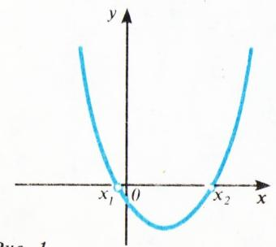
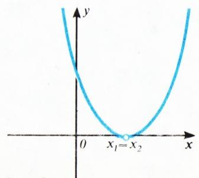
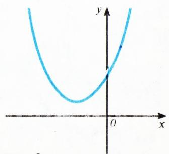
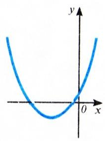
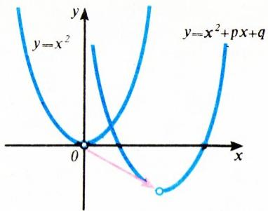
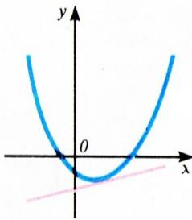
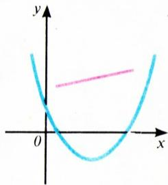

# 一元二次方程

> **原标题**：Квадратное уравнение
> **作者**：В. Г. Болтянский（V. G. 博尔强斯基，1915—2001，苏联/俄罗斯数学家，物理-数学博士，苏联国家列宁奖金获得者）
> **译自**：Квант 1992, № 6, с. 44–47
> **原文扫描**：https://www.kvant.digital/kvant/1992/06
> **主题**：一元二次方程的解法、判别式、韦达定理，及其与二次函数图像、不等式、参数问题的联系
> **难度**：★★（文字初中可读，但复数根、根的分布、凸性等内容涉及高中／竞赛层面）
> **译者**：Claude（初译）／ 2026-06-24

---

首先回顾一下，如何求解带实系数 $p,\ q$ 的一元二次方程

$$
x^{2} + p x + q = 0.\tag{1}
$$

它可以改写成

$$
\left(x + \frac{p}{2}\right)^{2} = \frac{1}{4}(p^{2} - 4q)\tag{2}
$$

（把左边括号展开即可验证）。数 $p^{2} - 4q$ 称为方程 (1) 的**判别式**，记作 $D$。于是方程可写作

$$
\left(x + \frac{p}{2}\right)^{2} = \frac{1}{4}D.\tag{3}
$$

由此立即可见：若 $D$ 非负，则方程 (1) 有两个实根

$$
x_{1} = \frac{1}{2}(-p + \sqrt{D}), \quad x_{2} = \frac{1}{2}(-p - \sqrt{D}),\tag{4}
$$

且当 $D > 0$ 时这两个根互不相同，当 $D = 0$ 时二者相等。

若 $D$ 为负，则方程 (3)、从而方程 (1) 没有实根，因为对任何实数 $x$，(3) 的左端都不可能是一个负数。此时可把方程 (3) 改写成

$$
\left(x + \frac{p}{2}\right)^{2} - \frac{1}{4}(\sqrt{-D}\, i)^{2} = 0,\tag{5}
$$

其中 $i$ 是虚数单位，即 $i^{2} = -1$^{\!*}。现在把左端分解因式，得到

$$
\left(x + \frac{p}{2} - \frac{1}{2}\sqrt{-D}\, i\right)\left(x + \frac{p}{2} + \frac{1}{2}\sqrt{-D}\, i\right) = 0,
$$

由此可见方程有两个复根

$$
x_{1} = \frac{1}{2}(-p + \sqrt{-D}\, i),
$$

$$
x_{2} = \frac{1}{2}(-p - \sqrt{-D}\, i).\tag{6}
$$

于是，下述定理成立。

**定理 1.** 带实系数 $p,\ q$ 的一元二次方程 (1) 有两个根，其形式取决于判别式 $D = p^{2} - 4q$ 的值。当 $D > 0$ 时根为实数且互异（见 (4)）；当 $D = 0$ 时根为实数且相等；当 $D < 0$ 时根为复数（见 (6)）。

下述定理是由著名的法国数学家弗朗索瓦·韦达（François Viète，1540—1603）建立的；他是字母记号与现代代数符号的奠基人之一。

**定理 2（韦达定理）.** 一元二次方程 (1) 的根 $x_{1}$ 和 $x_{2}$ 满足关系

$$
x_{1} + x_{2} = -p, \quad x_{1} x_{2} = q.\tag{7}
$$

事实上，在实根情形（即 $D$ 非负时），由公式 (4) 算得

$$
\begin{array}{r l}
x_{1} + x_{2} & = \dfrac{1}{2}(-p + \sqrt{D}) + \dfrac{1}{2}(-p - \sqrt{D}) = \\[4pt]
 & = -p, \\[4pt]
x_{1} x_{2} & = \dfrac{1}{4}(-p + \sqrt{D})(-p - \sqrt{D}) = \\[4pt]
 & = \dfrac{1}{4}(p^{2} - D) = q.
\end{array}
$$

在复根情形（即 $D < 0$ 时），韦达公式 (7) 同样可由 (6) 类似地得出。

*图 1*

*图 2*

*图 3*

**定理 3.** 任何一个二次三项式都可分解为两个一次因式之积：

$$
x^{2} + px + q = (x - x_{1})(x - x_{2}),
$$

其中 $x_{1}$、$x_{2}$ 是方程 (1) 的根。

事实上，由韦达公式，$x^{2} + px + q = x^{2} - (x_{1} + x_{2})x + x_{1}x_{2} = (x - x_{1})(x - x_{2})$。

有时，在作因式分解时，与其用公式 (4) 或 (6) 求根，不如直接**配方**（参见 (2)）更为方便。例如

$$
x^{2} + 8x - 33 = (x + 4)^{2} - 49,
$$

于是得到所需的分解

$$
x^{2} + 8x - 33 = (x - 3)(x + 11).
$$

还要指出，$\dfrac{1}{4}D = \left(\dfrac{p}{2}\right)^{2} - q$，$\dfrac{1}{2}\sqrt{D} = \sqrt{\left(\dfrac{p}{2}\right)^{2} - q}$。当 $p$ 为偶数时，用这两个公式更为方便。

## 习题

1. 证明：方程 $x^{2} + px + q = 0$ 的判别式 $D$ 等于 $(x_{1} - x_{2})^{2}$，其中 $x_{1},\ x_{2}$ 是该方程的根。

2. 用代入法验证：当 $D \geqslant 0$ 时，(4) 中所列的数确是方程 (1) 的根；并验证当 $D < 0$ 时，(6) 中的数也是该方程的根。

3. 解下列一元二次方程：

   а) $x^{2} - 5 = 0$;

   б) $x^{2} + 3x = 0$;

   в) $x^{2} + 7 = 0$;

   г) $x^{2} - 7x + 12 = 0$;

   д) $x^{2} - x - 30 = 0$;

   е) $x^{2} + 4x + 5 = 0$;

   ж) $x^{2} + 10x + 25 = 0$;

   з) $x^{2} + 2(a - 1)x - (6a + 3) = 0$;

   и) $x^{2} + 2(a + 3)x + (a^{2} + 2a + 9) = 0$;

   к) $x^{2} - 2(a^{2} - 1)x + (a^{4} - a^{2} + 1) = 0$;

   л) $2x^{2} - 5x + 2 = 0$;

   м) $(1 + a)x^{2} + 2x\sqrt{a^{2} + 1} - (1 - a) = 0$.

4. 证明：当 $D > 0$ 时，二次三项式 $y = x^{2} + px + q$ 的图像与横轴交于两点 $(x_{1};\, 0)$、$(x_{2};\, 0)$，其中 $x_{1},\ x_{2}$ 是方程 $x^{2} + px + q = 0$ 的根（图 1）。当 $D = 0$ 时，图像与横轴相切（图 2）。最后，当 $D < 0$ 时，图像与横轴没有公共点，且位于其上方（图 3）。

5. 求一个一元二次方程，使其具有下列根：

   а) $x_{1} = 1,\ x_{2} = -2$；　б) $x_{1} = x_{2} = -4$；

   в) $x_{1} = 2 - 3i,\ x_{2} = 2 + 3i$；

   г) $x_{1} = a + bi,\ x_{2} = a - bi$；

   д) $x_{1} = 3 - 4i,\ x_{2} = 2 - 5i$.

6. 证明：对任何 $p,\ q$，方程组

$$
\left\{ \begin{array}{l} y + z = -p, \\ yz = q \end{array} \right.
$$

都有两个解：

$$
y = x_{1},\ z = x_{2}; \quad y = x_{2},\ z = x_{1}
$$

（这些解可为实数或复数、可互异或相等），其中 $x_{1},\ x_{2}$ 是方程 $x^{2} + px + q = 0$ 的根。

7. 证明：二次三项式 $y = x^{2} + px + q$ 的图像关于直线 $x = -\dfrac{p}{2}$ 对称（图 4）。

8. 证明：方程 $x^{2} + px + q = 0$（带实系数 $p,\ q$）的根为实数且为正，当且仅当下述条件成立：

$$
D \geqslant 0,\quad p < 0,\quad q > 0.
$$

9. 求方程 $x^{2} + px + q = 0$（带实系数 $p,\ q$）的根为实数、非零且 а) 同号、б) 异号 的必要充分条件。

10. 证明：若方程 $x^{2} + px + q = 0$（带实系数 $p,\ q$）的一个根为实数，则另一根也为实数。

11. 证明：若方程 $x^{2} + px + q = 0$（带实系数 $p,\ q$）的一个根不是实数，即具有 $a + bi$（其中 $b \neq 0$）的形式，则另一根等于 $a - bi$，从而也不是实数。

12. 设 $p,\ q$ 为实数。求（就 $D$ 的不同情形）满足不等式 $x^{2} + px + q < 0$ 的全体实数 $x$ 所成的集合。

13. 解下列严格二次不等式（并作图）：

   а) $x^{2} - 5x + 6 < 0$；　б) $x^{2} - 10x + 25 > 0$；　в) $x^{2} - x - 12 > 0$；　г) $x^{2} - 12x + 38 > 0$.

14. 解下列非严格二次不等式：

   а) $x^{2} - 3x - 18 \leqslant 0$；　б) $x^{2} - 8x + 16 \leqslant 0$；　в) $x^{2} + 6x + 5 \geqslant 0$；　г) $x^{2} - 14x + 50 \leqslant 0$.

15. 证明：若两个一元二次方程

$$
\begin{array}{l} x^{2} + p_{1}x + q_{1} = 0, \\ x^{2} + p_{2}x + q_{2} = 0 \end{array}
$$

的根都是实数且都落在区间 $[a;\, b]$ 上，则对任何 $k > 0$，方程

$$
x^{2} + p_{1}x + q_{1} + k(x^{2} + p_{2}x + q_{2}) = 0\tag{8}
$$

的根（只要它是实根）也都落在同一区间 $[a;\, b]$ 上。

16. 证明：若方程 $x^{2} + p_{1}x + q_{1} = 0$ 的根 $x_{1},\ x_{2}$ 与方程 $x^{2} + p_{2}x + q_{2} = 0$ 的根 $x_{3},\ x_{4}$ 都是实数且彼此交错（图 5），即 $x_{1} < x_{3} < x_{2} < x_{4}$，则对任何 $k > 0$，方程 (8) 都有实根，且其中一个落在区间 $[x_{1};\, x_{3}]$ 上，另一个落在区间 $[x_{2};\, x_{4}]$ 上。

17. 证明：若方程 $x^{2} + p_{1}x + q_{1} = 0$ 的根 $x_{1},\ x_{2}$ 与方程 $x^{2} + p_{2}x + q_{2} = 0$ 的根 $x_{3},\ x_{4}$ 都是实数且彼此交错（图 5），则对任何异于 $-1$ 的负数 $k$，方程 (8) 都有实根，且其中一个落在区间 $[x_{3};\, x_{2}]$ 上，另一个落在区间 $[x_{1};\, x_{4}]$ 之外。

18. 当 $a$ 取哪些值时，方程 $x^{2} + ax + 6 = 0$ 有整数根？

19. 当 $a$ 取哪些值时，方程 $(x - 10)(x - a) + 1 = 0$ 有整数根？

20. 若二次三项式 $y = x^{2} + px + q$ 的图像如图 6 所示，试确定 $p,\ q$ 的符号。

*图 6*

21. 设 $x_{1},\ x_{2}$ 是方程 $x^{2} + px + q = 0$ 的根。已知 $x_{1} + 1$ 与 $x_{2} + 1$ 是方程

$$
x^{2} - p^{2}x + pq = 0
$$

的根，求 $p$ 和 $q$。

22. 在横轴上取一点 $A$，在纵轴上取一点 $B$（两点都异于坐标原点）。证明：存在唯一的二次三项式 $y = x^{2} + px + q$，其图像经过 $A,\ B$ 两点（图 7）。

23. 对哪些实数 $a$，二次三项式 $y = x^{2} + 2ax + 1$ 对一切实数 $x$ 都取正值？

24. 方程 $x^{2} + p_{1}x + q_{1} = 0$ 与 $x^{2} + p_{2}x + q_{2} = 0$ 的系数均为实数，且 $p_{1}p_{2} = 2(q_{1} + q_{2})$。证明：这两个方程中至少有一个有实根。

25. 考虑多项式 $f(x,\, y) = ax^{2} + bxy + cy^{2}$，其中系数 $a > 0,\ b,\ c$ 为实数。证明下列三种情形恰有一种成立：

   а) $f(x,\, y) = a(x - m_{1}y)(x - m_{2}y)$，其中 $m_{1} \neq m_{2}$ 为实数（**双曲型多项式**）；

   б) $f(x,\, y) = a(x - my)^{2}$，其中 $m$ 为实数（**抛物型多项式**）；

   в) $f(x,\, y) > 0$ 对一切不全为零的实数 $x,\ y$ 成立（**椭圆型多项式**）。

*图 8*

26. 证明：三项式 $y = x^{2} + px + q$ 的图像可由 $y = x^{2}$ 的图像经平移（图 8）得到，平移向量为 $\vec{a} = (-p/2;\, -D/4)$。

27. 证明：方程组

$$
\left\{ \begin{array}{l} y = x^{2} + px + q, \\ y = ax + b \end{array} \right.
$$

对任何 $a,\ b$ 至多有两个解（图 9）。

*图 9*

28. 证明：抛物线 $y = x^{2} + px + q$ 的**内部**，即满足 $y > x^{2} + px + q$ 的全体点 $(x,\, y)$ 所成的集合，是一个**凸集**（这就是说，连同其中任意两点一起，它也包含连接这两点的整条线段，图 10）。

*图 10*

---

## 译者注与校对说明

1. **OCR 校正（最关键）**：公式 (5) 及复根公式 (6) 中，原 OCR 误作 $\sqrt{-D\,i}$（虚单位 $i$ 被误置于根号之内）。经核对第 44 页扫描原图，正确写法是 $\sqrt{-D}\, i$——即 $i$ 在根号**之外**。这一点有算理保证：$(\sqrt{-D}\,i)^{2} = (-D)\cdot i^{2} = (-D)(-1) = D$，恰与 (3) 式右端 $\tfrac14 D$ 吻合；若 $i$ 在根号内，则 $(\sqrt{-Di})^{2} = -Di$，与 $D$ 不符。故一律据扫描页校正为 $\sqrt{-D}\, i$。
2. **脚注补全**：第 44 页 $i^{2}=-1$ 处有脚注，原文为「① 关于复数，参见 Ю. Соловьёв 载《Квант》1991 年第 7 期的文章」。
3. **项目字母还原**：题 3、题 5、题 9、题 13、题 14、题 25 的子项字母，原 OCR 多处被误识——а) 误作 a)，б) 误作 6)，в) 误作 B) 或漏，г) 误作 r)，д) 误作 π)，е) 误作 e)，ж) 误作 3)，з) 误作 3) 或漏，и) 误作 n)，к) 误作 k)，л) 误作 π)——均已按俄文字母表 а б в г д е ж з и к л 还原。
4. **题 14а 公式修补**：原 OCR 将题 14 а) 误作 $x-3x-18\leqslant0$，显系漏识平方。据题意与同组其他小题（皆为 $x^{2}+px+q$ 形式）校正为 $x^{2}-3x-18\leqslant0$。
5. **题 3 末项归位**：原 OCR 中含参数方程 $(1+a)x^{2}+2x\sqrt{a^{2}+1}-(1-a)=0$ 被单独排在第 46 页页顶，与题 3 的方程序列脱节；此式实为题 3 的末项（标号 м)，连同前述各项一并归入题 3。
6. **术语**：дискриминант=判别式，квадратный трёхчлен=二次三项式，комплексный корень=复根，мнимая единица=虚数单位，выпуклое множество=凸集，параллельный перенос=平移。韦达定理（теорема Виета）译名从通行用法。
7. **图与图注**：原文图 1—3（判别式三种情形下的图像，p45）、图 4（对称轴）、图 5（根的交错）、图 6—7（题 20、题 22 的抛物线图像）、图 8（平移）、图 9（与直线相交）、图 10（凸内部）均由 MinerU 自整页扫描裁出，存于 `images/1992_06_boltyanskij_A05/fig_p*.png`，图号与原文一致。其中图 5（根交错）在原页无独立裁切块，对应说明文字见题 16、17 正文。

## 建议讨论题

1. 为什么当 $D<0$ 时，把 $i$ 放在根号**外**（$\sqrt{-D}\,i$）而不是根号**内**（$\sqrt{-Di}$）是正确的？请用 $(\sqrt{-D}\,i)^{2}$ 的展开来验证，并说明若放错会导致 (3) 式两端不相等。
2. 定理 2（韦达定理）把「两根之和」「两根之积」与系数 $p,\ q$ 直接联系起来。试仅用韦达定理（不求根）判断题 9 中根同号、异号的条件，并说明它与判别式 $D$ 的关系。
3. 题 16、17 讨论两方程根「交错」时，参数 $k$ 取正、取负（且 $\neq-1$）会让方程 (8) 的根落在不同位置。请从函数图像（两条抛物线）的角度解释：为什么 $k$ 的正负会改变根的所在区间？
4. 题 28 说抛物线「内部」$y>x^{2}+px+q$ 是凸集。请用配方把不等式化成 $(x+p/2)^{2}$ 的形式，说明它确实定义了一个凸区域，并思考：抛物线「外部」$y<x^{2}+px+q$ 是凸集吗？

---

> **版权说明**：原文版权归 MCCME（莫斯科连续数学教育中心）及作者继承者所有。本译文为非商业、自用、数学圈内部参考，未获授权不得公开分发。原文扫描见 [kvant.digital](https://www.kvant.digital/)。

> **复用说明**：本译文的俄文 OCR 原文与所有插图均存档于 `ocr/1992_06_boltyanskij_A05/`（`ru.md` 为合并 OCR 文本，`meta.json` 为图映射）。如对译文质量不满意，可直接基于 `ru.md` 重译，无需重跑 OCR。
