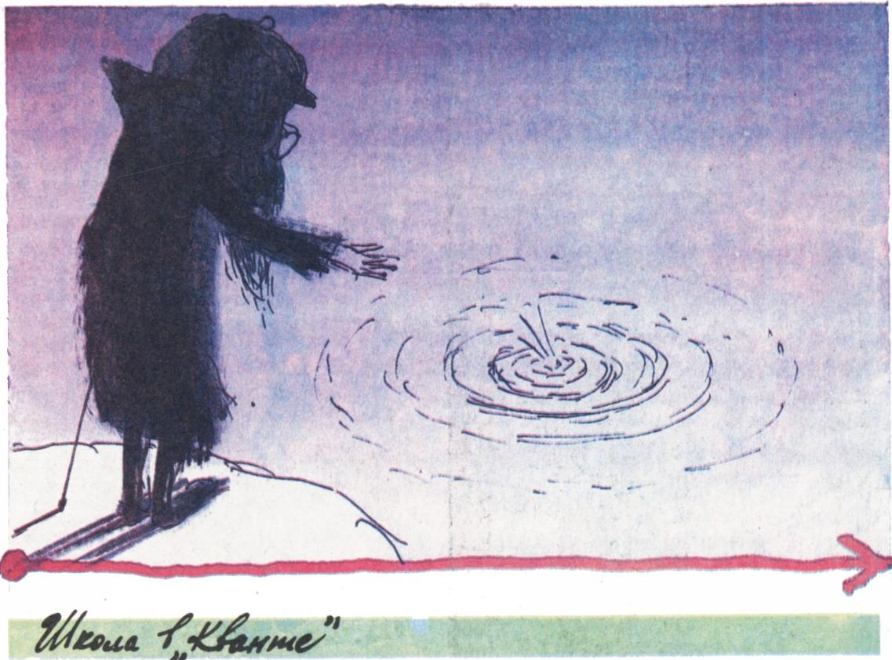

# 数列的极限

> **原标题**：Предел последовательности
> **作者**：Ю. Соловьёв（Ю. 索洛维耶夫，物理-数学科学博士）
> **译自**：Квант 1992, № 10, с. 43–49
> **原文扫描**：https://www.kvant.digital/kvant/1992/10/
> **主题**：数列极限（定义、极限的四则运算、单调有界原理、波尔查诺-魏尔斯特拉斯公理、施托尔茨定理、自然对数底 $e$）
> **难度**：★★★（极限的 $\varepsilon$-$N$ 定义、子列、施托尔茨定理属大学/数学分析层面）
> **译者**：Claude（初译）／ 2026-06-24

---

*图 1：本篇题图*

## 基本概念与命题

设每一个自然数 $n$ 都对应一个确定的实数 $a_{n}$。这些数组成的集合 $\{a_{n}\}$（其中 $n=1,2,\dots$）称为**数值数列**，或简称**数列**；每一个数 $a_{n}$ 称为该数列的一个**元素**或**项**，而 $n$ 称为它的**编号**（下标）。

数值数列是函数的一种特殊情形，确切地说：数列是定义在自然数集合上、取值于实数集合中的函数。

怎样给定一个数值数列呢？最自然的是**解析法**——它明确地指明，要对数 $n$ 施行哪些运算才能得到数列的通项 $a_{n}=f(n)$。

**例**

1. 数列

$$
1,\ \frac{1}{2},\ \frac{1}{3},\ \frac{1}{4},\ \dots
$$

的通项为 $a_{n}=\dfrac{1}{n}$。

2. 数列

$$
1,\ -1,\ 1,\ -1,\ 1,\ -1,\ \dots
$$

由规则 $a_{n}=(-1)^{n+1}$ 给出，也可写作

$$
a_{n}=\sin\frac{(2n-1)\pi}{2}.
$$

给定数列的另一种常用方法是**递推法**。它指明：对已经算出的若干项

$$
a_{1},\ a_{2},\ \dots,\ a_{n},
$$

要施行哪些运算才能得到下一项 $a_{n+1}$；此外，按照依赖关系的不同，还需事先给出若干最初的一些项——所谓**初始数据**。

**例**

1. **等差数列**由递推关系

$$
a_{n+1}=a_{n}+d,\qquad n=1,2,3,\dots
$$

及初始数据 $a_{1}=a$ 确定。

这个数列呈

$$
a,\ a+d,\ a+2d,\ \dots,\ a+(n-1)d,\ \dots
$$

2. **斐波那契数列**由条件

$$
a_{n+1}=a_{n}+a_{n-1},\qquad n=2,3,\dots
$$

及初始数据 $a_{1}=1$、$a_{2}=1$ 确定。

该数列呈

$$
1,\ 1,\ 2,\ 3,\ 5,\ 8,\ 13,\ 21,\ 34,\ \dots
$$

这一数列也可以写成解析形式：

$$
a_{n}=\frac{1}{\sqrt{5}}\left\{\left(\frac{1+\sqrt{5}}{2}\right)^{n}-\left(\frac{1-\sqrt{5}}{2}\right)^{n}\right\},\qquad n=1,2,\dots
$$

数列 $\{a_{n}\}$ 称为

а) **上有界**的，若其所有项都小于同一个数 $M$：$a_{n}<M$，$n=1,2,3,\dots$；

б) **下有界**的，若其所有项都大于同一个数 $m$：$a_{n}>m$，$n=1,2,3,\dots$；

в) **有界**的，若它既上有界又下有界：

$$
m<a_{n}<M,\qquad n=1,2,3,\dots
$$

现在来陈述我们的基本定义。

> 数 $a$ 称为数列 $\{a_{n}\}$ 的**极限**，若对任意 $\varepsilon>0$，都能指出这样一个数 $N$，使得对一切编号 $n\geqslant N$ 都成立不等式

$$
\left|a_{n}-a\right|<\varepsilon.
$$

此时记作 $\lim\limits_{n\to\infty}a_{n}=a$，或 $a_{n}\xrightarrow[n\to\infty]{}a$。

存在极限的数列称为**收敛数列**。

现在我们引入以无穷大为极限的数列。这样的数列称为**无穷大数列**，定义如下：

> 数列 $\{a_{n}\}$ 称为**无穷大数列**，若对任意数 $\varepsilon$，都存在这样一个编号 $N$，使得对一切 $n\geqslant N$ 都成立不等式 $|a_{n}|>\varepsilon$。

如果数列满足 $a_{n}>\varepsilon$（对一切充分大的 $n$），则记 $\lim\limits_{n\to\infty}a_{n}=+\infty$；如果满足 $a_{n}<-\varepsilon$，则采用记号 $\lim\limits_{n\to\infty}a_{n}=-\infty$。在所有这些情形下，都说数列 $\{a_{n}\}$ 有**无穷极限**，等于 $+\infty$ 或 $-\infty$。

实际计算极限，以下四条定理是其基础。

**定理 1.** 如果数列 $\{a_{n}\}$ 与 $\{b_{n}\}$ 都有极限：$\lim\limits_{n\to\infty}a_{n}=a$，$\lim\limits_{n\to\infty}b_{n}=b$，那么数列 $\{a_{n}+b_{n}\}$ 也有极限，且

$$
\lim_{n\to\infty}(a_{n}+b_{n})=a+b.
$$

**定理 2.** 在同样的假设下，数列 $\{a_{n}-b_{n}\}$ 有极限

$$
\lim_{n\to\infty}(a_{n}-b_{n})=a-b.
$$

**定理 3.** 在同样的假设下，数列 $\{a_{n}b_{n}\}$ 有极限

$$
\lim_{n\to\infty}a_{n}b_{n}=ab.
$$

**定理 4.** 在同样的假设下、并附加条件 $b\neq 0$，数列 $\left\{\dfrac{a_{n}}{b_{n}}\right\}$ 有极限

$$
\lim_{n\to\infty}\frac{a_{n}}{b_{n}}=\frac{a}{b}.
$$

定理 1 常被简述为：「和的极限等于极限之和」，并写成

$$
\lim_{n\to\infty}(a_{n}+b_{n})=\lim_{n\to\infty}a_{n}+\lim_{n\to\infty}b_{n},
$$

其中定理的条件是默认成立的。对定理 2—4 也可作类似说明。

四条定理的证明或多或少是类似的，因此我们只证定理 1。

**证明.** 已知当 $n$ 充分大时，偏差 $|a_{n}-a|$ 与 $|b_{n}-b|$ 都可任意小。要证偏差

$$
\left|(a_{n}+b_{n})-(a+b)\right|
$$

也是如此。由绝对值的性质有

$$
\begin{aligned}
\left|(a_{n}+b_{n})-(a+b)\right| & =\left|(a_{n}-a)+(b_{n}-b)\right| \\
 & \leqslant \left|a_{n}-a\right|+\left|b_{n}-b\right|.
\end{aligned}
$$

给定某个 $\varepsilon>0$。于是可以选取这样的 $N_{1}$，使当 $n>N_{1}$ 时

$$
\left|a_{n}-a\right|<\frac{\varepsilon}{2},
$$

以及这样的 $N_{2}$，使当 $n>N_{2}$ 时

$$
\left|b_{n}-b\right|<\frac{\varepsilon}{2}.
$$

这样，令 $N$ 为 $N_{1}$、$N_{2}$ 中较大者，则当 $n>N$ 时便有

$$
\left|(a_{n}+b_{n})-(a+b)\right|\leqslant\left|a_{n}-a\right|+\left|b_{n}-b\right|<\frac{\varepsilon}{2}+\frac{\varepsilon}{2}=\varepsilon,
$$

这正是要证的。$\square$

现在引入如下定义。如果对每个 $n=1,2,\dots$ 都成立 $a_{n}\leqslant a_{n+1}$（相应地 $a_{n}\geqslant a_{n+1}$），则数列 $\{a_{n}\}$ 称为**不减**的（相应地**不增**的）。不减数列与不增数列统称**单调**数列。若上述不等式都是严格的，则数列称为**递增**的（**递减**的）。例如，数列 $\left\{\dfrac{1}{n^{2}}\right\}$ 递减，数列 $\{n\}$ 递增，而数列 $\left\{\sin\dfrac{\pi n}{2}\right\}$ 不是单调的。

在极限理论中，实数的下述性质非常重要，通常把它作为公理来接受。

> **波尔查诺-魏尔斯特拉斯公理.** 任何不减（不增）数列都有极限——若它上有界（下有界），则极限有限；若它不上有界（不下有界），则极限为无穷，等于 $+\infty$（相应地为 $-\infty$）。

在数学分析课程中会证明，波尔查诺-魏尔斯特拉斯公理与下列每一条命题都是等价的：

- 若在数轴上构造了一串区间（嵌套的线段序列），使每一条后继线段都包含在前一条之内，则所有这些线段至少有一个公共点；
- 每个实数都可写成无穷（循环或不循环）十进小数，且每个这样的小数都对应于某个实数。

如果把上述命题之一取作公理，则另一条命题与波尔查诺-魏尔斯特拉斯公理就都成为可以证明的定理。

**定理 5.** 从任何含有无穷多个数的数列中，都可以选出一个收敛于某个有限或无穷极限的（子）数列。

**证明.** 如果在所给数列 $\{a_{n}\}$ 中，不超过 $a_{1}$ 的数只有有限多个，那么其中大于 $a_{1}$ 的数必然有无穷多个。为确定起见，我们假设数列中含有无穷多个大于 $a_{1}$ 的数。取其中之一为 $a_{r_{1}}$。可能出现这样的情况：在它之后的数中能找到 $a_{r_{2}}>a_{r_{1}}$，在 $a_{r_{2}}$ 之后的数中能找到 $a_{r_{3}}>a_{r_{2}}$，如此等等。如果这种选取可以无限制地继续下去，那么就从原数列中分出了一个数列，它由波尔查诺-魏尔斯特拉斯公理保证有有限或无穷极限。

否则，会遇到某个 $a_{r_{i}}$，它后面的任何数都不能超过它；这样就分出了一条有限的链

$$
a_{1}<a_{r_{1}}<a_{r_{2}}<\dots<a_{r_{i}}.
$$

根据假设，在 $a_{r_{i}}$ 之后的数中，仍然有无穷多个大于 $a_{1}$ 但不超过 $a_{r_{i}}$ 的数。从其中某一个（设为 $a_{s_{1}}$）开始，仿照前述做法，构造一个递增数列；它要么可无限延伸（则定理获证），要么在某数 $a_{s_{j}}$ 处中断——其后的任何数都不能超过它，而它本身不超过 $a_{r_{i}}$。这样又得到一条新的有限链

$$
a_{1}<a_{s_{1}}<a_{s_{2}}<\dots<a_{s_{j}},\qquad a_{r_{i}}\geqslant a_{s_{j}}.
$$

继续这样做下去，我们得到一系列链

$$
\begin{array}{l}
a_{1}<a_{r_{1}}<a_{r_{2}}<\dots<a_{r_{i}},\\
a_{1}<a_{s_{1}}<a_{s_{2}}<\dots<a_{s_{j}},\\
a_{1}<a_{t_{1}}<a_{t_{2}}<\dots<a_{t_{k}},\\
\dots\dots
\end{array}
$$

这时，我们要么得到一个含无穷多个递增项的数列（定理获证），要么得到一个由无穷多个不增项组成的数列

$$
a_{r_{i}}\geqslant a_{s_{j}}\geqslant a_{t_{k}}\geqslant\dots,
$$

后者由波尔查诺-魏尔斯特拉斯公理有有限极限，因为它的所有项都大于 $a_{1}$。$\square$

**定理 6.** 设 $\{a_{n}\}$ 与 $\{b_{n}\}$ 是两个具有如下性质的数列：

1) 若从 $\{a_{n}\}$ 中选出收敛于极限 $a$ 的子列 $\{a_{r_{i}}\}$，则子列 $\{b_{r_{i}}\}$ 收敛于某个极限 $b$；
2) 不同的极限值 $a$ 对应于不同的极限值 $b$。

那么，若 $\{b_{n}\}$ 有确定的极限，则 $\{a_{n}\}$ 也有确定的极限。

**证明.** 用反证法。事实上，假如数列 $\{a_{n}\}$ 没有确定的极限，我们就能从中分出具有不同极限 $a$ 的子列，它们将对应于不同的 $b$ 值，这与 $\{b_{n}\}$ 有确定的极限值相矛盾。$\square$

**定理 7.** 如果 $\{a_{n}\}$ 是某个数列，而 $\{b_{n}\}$ 是一个无穷递增的无界数列，则

$$
\lim_{n\to\infty}\frac{a_{n}}{b_{n}}=\lim_{n\to\infty}\frac{a_{n}-a_{n-1}}{b_{n}-b_{n-1}},\tag{1}
$$

这里假定右端的极限存在。

（这就是数列形式的**施托尔茨定理**。）

**证明.** 记 (1) 式右端的极限为 $l$。那么可以找到这样的 $N$，使当 $n>N$ 时恒有

$$
\left|\frac{a_{n}-a_{n-1}}{b_{n}-b_{n-1}}-l\right|<\frac{\varepsilon}{2}.
$$

换言之，所有分数

$$
\frac{a_{N+1}-a_{N}}{b_{N+1}-b_{N}},\ \frac{a_{N+2}-a_{N+1}}{b_{N+2}-b_{N+1}},\ \dots,\ \frac{a_{n}-a_{n-1}}{b_{n}-b_{n-1}}
$$

都介于 $l-\dfrac{\varepsilon}{2}$ 与 $l+\dfrac{\varepsilon}{2}$ 之间。同时，由于所有分母都为正，便有

$$
\left|\frac{a_{n}-a_{N}}{b_{n}-b_{N}}-l\right|<\frac{\varepsilon}{2}.
$$

取 $N$ 充分大，不仅使最后这一不等式成立，而且使 $b_{N}>0$——这总能做到，因为按条件 $\{b_{n}\}$ 无穷递增。同理，固定 $N$ 后，可以选取 $n$ 使得数 $\dfrac{\varepsilon}{2}b_{n}$ 超过数 $a_{N}-lb_{N}$ 的绝对值，并随着 $n$ 的增大始终保持大于后一数。注意到

$$
\begin{aligned}
\frac{a_{n}}{b_{n}}-l & = \\
 & =\frac{a_{N}-lb_{N}}{b_{n}}+\left(1-\frac{b_{N}}{b_{n}}\right)\left(\frac{a_{n}-a_{N}}{b_{n}-b_{N}}-l\right),
\end{aligned}
$$

直接得到

$$
\left|\frac{a_{n}}{b_{n}}-l\right|<\varepsilon,\quad\text{即}\quad\lim\frac{a_{n}}{b_{n}}=l.
$$

$\square$

**推论 1.** 如果某个数列收敛于有限极限，那么它的前 $n$ 项的**算术平均**与**几何平均**也收敛于同一极限。

事实上，由上面这条定理有

$$
\lim_{n\to\infty}\frac{a_{1}+a_{2}+\dots+a_{n}}{n}=\lim_{n\to\infty}a_{n},\tag{2}
$$

这里假定右端的极限存在。

下面我们将看到（见下一节的例 3°），

$$
\lim_{n\to\infty}(\log_{b}a_{n})=\log_{b}\!\left(\lim_{n\to\infty}a_{n}\right).
$$

假定这一结果已证，把前一等式中的 $a_{n}$ 换成 $\log_{b}a_{n}$，便得

$$
\lim_{n\to\infty}\!\left(\log_{b}\sqrt[n]{a_{1}a_{2}\dots a_{n}}\right)=\lim_{n\to\infty}(\log_{b}a_{n}),
$$

从而

$$
\lim_{n\to\infty}\sqrt[n]{a_{1}a_{2}\dots a_{n}}=\lim_{n\to\infty}a_{n},\tag{3}
$$

这里假定右端的极限存在。

**推论 2.** 如果在某数列 $\{a_{n}\}$ 中，比值 $\dfrac{a_{n}}{a_{n-1}}$ 收敛于某个有限极限，那么 $\sqrt[n]{a_{n}}$ 也收敛于同一极限。

事实上，只要在等式 (3) 中把 $a_{n}$ 换成 $\dfrac{a_{n}}{a_{n-1}}$，便得

$$
\lim_{n\to\infty}\sqrt[n]{a_{1}\cdot\frac{a_{2}}{a_{1}}\cdot\frac{a_{3}}{a_{2}}\cdot\dots\cdot\frac{a_{n}}{a_{n-1}}}=\lim_{n\to\infty}\frac{a_{n}}{a_{n-1}},
$$

即

$$
\lim_{n\to\infty}\sqrt[n]{a_{n}}=\lim_{n\to\infty}\frac{a_{n}}{a_{n-1}}\left(=\lim_{n\to\infty}\frac{a_{n+1}}{a_{n}}\right).\tag{4}
$$

## 极限计算举例

**1°.** 给定正数 $a$，求 $a^{n}$ 当 $n$ 趋于无穷时的极限。当 $a=1$ 时，恒有 $a^{n}=1$。当 $a<1$ 时，$a^{n}=a^{n-1}\cdot a<a^{n-1}$，即数列 $\{a^{n}\}$ 单调递减，因此由波尔查诺-魏尔斯特拉斯公理，它必须收敛于某个有限极限 $l\geqslant 0$。但由 $a^{n}=a^{n-1}\cdot a$ 取极限可得 $l=la$，即 $(a-1)l=0$，从而 $l=0$。当 $a>1$ 时，$a^{n}=a^{n-1}\cdot a>a^{n-1}$。可见数列 $\{a_{n}\}$ 随 $n$ 单调递增，必须收敛于有限或无穷极限；但此极限不可能是有限的，因为它应是正数 $l$，而前述等式取极限给出 $l=la$，即 $l=0$，矛盾。所以

$$
\lim_{n\to\infty}a^{n}=\begin{cases}
0 & \text{当}\ a<1,\\
1 & \text{当}\ a=1,\\
+\infty & \text{当}\ a>1.
\end{cases}
$$

**2°.** 假定 $\lim\limits_{n\to\infty}a_{n}=a$ 存在，并设 $b$ 是某个给定的正数。求数列 $\{b^{a_{n}}\}$ 的极限。先设 $b$ 小于 $1$，并记 $\alpha_{n}=\left|a_{n}-a\right|$。给定任意小的正数 $\varepsilon$，由上例可知，可以找到这样的 $m$，使 $(1-\varepsilon)^{m}<b$。固定 $m$，选取 $n$ 使 $\alpha_{n}<\dfrac{1}{m}$ 并在 $n$ 继续增大时保持如此（这是可能的，因为 $\lim\limits_{n\to\infty}\alpha_{n}=0$）。

于是有

$$
1-b^{\alpha_{n}}<1-(1-\varepsilon)^{m\alpha_{n}}<1-(1-\varepsilon)=\varepsilon.
$$

由此得

$$
\lim_{n\to\infty}b^{\alpha_{n}}=1,
$$

从而 $\lim\limits_{n\to\infty}b^{a_{n}}=b^{a}$，即 $\lim\limits_{n\to\infty}b^{a_{n}}=b^{\lim\limits_{n\to\infty}a_{n}}$。

当 $b>1$ 时，可以写

$$
\lim_{n\to\infty}b^{a_{n}}=\frac{1}{\lim\limits_{n\to\infty}b^{-a_{n}}}=\frac{1}{b^{-a}}=b^{a}.
$$

**3°.** 假定数列 $\{a_{n}\}$ 收敛于极限 $a$，求数列 $\{\log_{b}a_{n}\}$ 的极限。令 $\log_{b}a_{n}=c_{n}$，则 $a_{n}=b^{c_{n}}$。若 $\{c_{n}\}$ 收敛于极限 $c$，则由例 2°，数列 $\{a_{n}\}$ 收敛于极限 $b^{c}$。因此（由定理 6）反之亦然：若 $\{a_{n}\}$ 的极限存在，则 $\{c_{n}\}$ 的极限也存在，且

$$
a=b^{c},\qquad c=\log_{b}a.
$$

故

$$
\lim_{n\to\infty}(\log_{b}a_{n})=\log_{b}\!\left(\lim_{n\to\infty}a_{n}\right).
$$

**4°.** 设数列 $\{a_{n}\}$（$a_{n}>0$）与 $\{b_{n}\}$ 分别收敛于极限 $a$ 与 $b$。求数列 $\{a_{n}^{b_{n}}\}$ 的极限。令 $c_{n}=a_{n}^{b_{n}}$，有

$$
\log_{2}c_{n}=b_{n}\log_{2}a_{n},
$$

从而

$$
\begin{aligned}
\lim_{n\to\infty}\log_{2}c_{n} & =\log_{2}\!\left(\lim_{n\to\infty}c_{n}\right)=b\log_{2}a= \\
 & =\log_{2}a^{b}.
\end{aligned}
$$

所以

$$
\lim_{n\to\infty}a_{n}^{b_{n}}=\left(\lim_{n\to\infty}a_{n}\right)^{\lim\limits_{n\to\infty}b_{n}}.
$$

**5°.** 现在研究数列 $\left\{\left(1+\dfrac{1}{n}\right)^{n}\right\}$。

首先证明一些不等式。设 $x_{1},x_{2},x_{3},\dots$ 是一些小于 $1$ 的正数。记 $s_{n,r}$ 为所给数列前 $n$ 个数中每次取 $r$ 个相乘、所有这类乘积之和：

$$
\begin{array}{l}
s_{n,1}=x_{1}+x_{2}+\dots+x_{n},\\
s_{n,2}=x_{1}x_{2}+x_{1}x_{3}+\dots+x_{1}x_{n}+\dots+x_{n-1}x_{n},\\
\dots\\
s_{n,n}=x_{1}x_{2}x_{3}\dots x_{n}.
\end{array}
$$

由多项式乘法法则可得

$$
\begin{aligned}
(1-x_{1})(1-x_{2})\dots(1-x_{n}) & =1-s_{n,1}+\\
 & \quad+s_{n,2}-\dots+(-1)^{n}s_{n,n}.
\end{aligned}\tag{5}
$$

我们证明，恒可写成

$$
\begin{array}{l}
(1-x_{1})(1-x_{2})\dots(1-x_{n})=\\
\quad=1-s_{n,1}+s_{n,2}-\dots+(-1)^{r}\Theta s_{n,r},
\end{array}\tag{6}
$$

其中 $\Theta$ 介于 $0$ 与 $1$ 之间。换言之，若在 (5) 式右端于给定的 $r$ 处截断、舍去 $s_{n,r}$ 之后的所有项，则所得之数小于或大于左端之数，视 $r$ 为奇或偶而定。用数学归纳法。我们只需证明：(6) 式在 $n=r$ 时显然成立，且若它在某个 $n\geqslant r$ 处成立，则在把 $n$ 换成 $n+1$ 后仍成立。把 (6) 式两边乘以 $1-x_{n+1}$，得

$$
\begin{array}{l}
(1-x_{1})(1-x_{2})\dots(1-x_{n+1})=\\
\quad=1-s_{n,1}+s_{n,2}-\dots+(-1)^{r}\Theta s_{n,r}-\\
\quad-x_{n+1}+x_{n+1}s_{n,1}-\dots+(-1)^{r-1}x_{n+1}\,\times\\
\quad\times s_{n,r-1}+(-1)^{r}\Theta x_{n+1}s_{n,r}.
\end{array}
$$

注意到

$$
s_{n+1,r}=s_{n,r}+x_{n+1}s_{n,r-1},
$$

便得

$$
\begin{aligned}
 & (1-x_{1})(1-x_{2})\dots(1-x_{n+1})=\\
 & \quad=1-s_{n+1,1}+s_{n+1,2}-\dots+(-1)^{r-1}\,\times\\
 & \quad\times s_{n+1,r-1}+(-1)^{r}\bigl(x_{n+1}s_{n,r-1}+\Theta(1-\\
 & \qquad-x_{n+1})s_{n,r}\bigr).
\end{aligned}
$$

括号中的量显然为正，且不超过

$$
\begin{aligned}
 & x_{n+1}s_{n,r-1}+(1-x_{n+1})s_{n,r}=\\
 & \qquad=s_{n+1,r}-x_{n+1}s_{n,r}<s_{n+1,r}.
\end{aligned}
$$

因此它可写成 $\Theta's_{n+1,r}$，其中 $\Theta'$ 介于 $0$ 与 $1$ 之间。这正是要证的。

特别地，在 (6) 式中令 $x_{1}=x_{2}=\dots=x_{n}=x$ 且 $r=1$，得

$$
(1-x)^{n}>1-nx,\tag{7}
$$

因为此时 $s_{n,1}=nx$。

现在用公式 (6)、(7) 来分析数列 $a_{n}=\left(1+\dfrac{1}{n}\right)^{n}$。在公式 (7) 中令 $x=\dfrac{1}{n^{2}}$，得

$$
\left(1-\frac{1}{n^{2}}\right)^{n}>1-\frac{1}{n},\quad\text{即}
$$

$$
\left(1+\frac{1}{n}\right)^{n}>\left(1-\frac{1}{n}\right)^{1-n}.
$$

注意到

$$
\begin{aligned}
 & \left(1-\frac{1}{n}\right)^{1-n}=\left(\frac{n}{n-1}\right)^{n-1}=\\
 & \qquad=\left(1+\frac{1}{n-1}\right)^{n-1},
\end{aligned}\tag{8}
$$

便得

$$
a_{n}=\left(1+\frac{1}{n}\right)^{n}>\left(1+\frac{1}{n-1}\right)^{n-1}=a_{n-1}.
$$

可见数列 $\{a_{n}\}$ 单调递增。又由同一公式 (6)，

$$
(1-x)^{n}>1-\frac{n}{1}x+\frac{n(n-1)}{1\cdot 2}x^{2}-\frac{n(n-1)(n-2)}{1\cdot 2\cdot 3}x^{3},
$$

特别地，令 $x=\dfrac{1}{n}$，

$$
\left(1-\frac{1}{n}\right)^{n}>\frac{n^{2}-1}{3n^{2}}=\frac{1}{3}\!\left(1-\frac{1}{n}\right)\!\left(1+\frac{1}{n}\right)>\frac{1}{3}\!\left(1-\frac{1}{n}\right).
$$

由此借助等式 (8) 得

$$
\left(1-\frac{1}{n}\right)^{n-1}>\frac{1}{3},\qquad\left(1+\frac{1}{n-1}\right)^{n-1}<3.
$$

由此可见，$a_{n}=\left(1+\dfrac{1}{n}\right)^{n}$ 的各项随 $n$ 单调递增，却不会超过数 $3$。所以数列 $a_{n}=\left(1+\dfrac{1}{n}\right)^{n}$ 收敛于某个有限极限。这个极限记作 $e$。在数学分析课程中会证明，数 $e$ 是无理数，进一步还是**超越数**，即它不是任何整系数代数方程的根。成立近似等式

$$
e\approx 2{,}718281828459045.
$$

## 供独立求解的习题

计算下列极限：

1. $\lim\limits_{n\to\infty}\dfrac{n^{2}+n+1}{(n+1)^{2}}$；

2. $\lim\limits_{n\to\infty}\dfrac{\sqrt[3]{n^{2}+2}}{n+2}$；

3. $\lim\limits_{n\to\infty}\dfrac{\sqrt{n^{2}+1}+\sqrt{n}}{\sqrt[n]{n^{3}+n}-n}$；

4. $\lim\limits_{n\to\infty}\!\left(\dfrac{1+2+3+\dots+n}{n+2}-\dfrac{n}{2}\right)$；

5. $\lim\limits_{n\to\infty}\dfrac{1-2+3-\dots-2n}{\sqrt{n^{2}+1}}$；

6. $\lim\limits_{n\to\infty}\dfrac{1}{n}\!\left(\left(a+\dfrac{1}{n}\right)^{2}+\left(a+\dfrac{2}{n}\right)^{2}+\dots+\left(a+\dfrac{n-1}{n}\right)^{2}\right)$；

7. $\lim\limits_{n\to\infty}\dfrac{1\cdot 2+2\cdot 3+\dots+n(n+1)}{n^{3}}$；

8. $\lim\limits_{n\to\infty}\!\left(\sqrt{n^{2}+1}-\sqrt{n^{2}-1}\right)$；

9. $\lim\limits_{n\to\infty}\!\left(\sqrt{n^{2}+n+1}-\sqrt{n^{2}-n+1}\right)$；

10. $\lim\limits_{n\to\infty}n\!\left(\sqrt{n^{2}+1}-n\right)$；

11. $\lim\limits_{n\to\infty}\!\left(n^{\frac{4}{3}}-(n^{2}-1)^{\frac{2}{3}}\right)$。

---

## 译者注与校对说明

1. **OCR 校正**：本文由 MinerU 对扫描页做俄文 OCR 后翻译。已校正若干 OCR 错误：
   - **斐波那契递推**（p44）：OCR 误识为 $a_{n+1}=a_{n}+a_{n+1}$（右端自指，无意义），据数列 $1,1,2,3,5,8,\dots$ 及解析通项校正为标准形式 $a_{n+1}=a_{n}+a_{n-1}$，递推下标改为 $n=2,3,\dots$；
   - **负无穷极限定义**（p44）：OCR 写成 "$a_{n}>-\varepsilon$ 则 $\lim a_{n}=-\infty$"，方向错误，据标准定义校正为 $a_{n}<-\varepsilon$；
   - **波尔查诺-魏尔斯特拉斯公理**中的 $-\infty$：OCR 用了长破折号"——"代替负号，已还原；
   - "моно-тонными"等行内换行连字符合并；"Фибonаччи"中夹带的拉丁字母"on"还原为"он"；
   - 施托尔茨定理证明中"нёпосредственно"（直接）等处 OCR 残字已据上下文还原；公式 (4) 末 OCR 把 $\dfrac{a_{n+1}}{a_{n}}$ 错排成两行矩阵，已按原文意图排成标准分式。
   其余公式均与扫描页核对一致。
2. **术语**：предел=极限，последовательность=数列，сходящаяся=收敛，бесконечно большая=无穷大（数列），монотонная=单调，возрастающая/убывающая=递增/递减，ограниченная=有界，арифметическая прогрессия=等差数列，теорема=定理，следствие=推论，аксиома=公理。Больцано-Вейерштрасса 通译"波尔查诺-魏尔斯特拉斯"；定理 7 即数列形式的**施托尔茨定理**（Teorema lui Stolz），原文未命名，译文中补注其名以便检索。$e$ 称**超越数**（трансцендентно）。
3. **背景**：本文是 Квант"数学分析入门"系列的典型篇目，从 $\varepsilon$-$N$ 定义出发，依次给出极限四则运算、单调有界原理（以波尔查诺-魏尔斯特拉斯公理形式陈述）、子列收敛定理（定理 5、6）、施托尔茨定理（定理 7）及其推论（柯西第一定理的算术平均、几何平均形式与比式极限），最后用二项式型不等式严格证明 $\left(1+\dfrac{1}{n}\right)^{n}$ 递增有界、从而定义自然对数底 $e$。文末附 11 道极限计算习题。术语遵照《01_工作规范.md》对照表。
4. **图表**：原文仅 p43 顶部有一幅题图（fig_p43_01.png），其余各页均为文字与公式，无插图，故全文仅引用图 1。

## 建议讨论题

1. 波尔查诺-魏尔斯特拉斯公理把"单调有界数列有极限"取作实数系的出发点。本文又说它与"嵌套区间有公共点""实数即无穷十进小数"等价——你能看出这三者其实是同一件事的不同说法吗？
2. 定理 7（施托尔茨定理）的两个推论——算术平均极限 (2) 与几何平均极限 (3)——你能用它们重新解释"为什么 $\sqrt[n]{n!}$ 与 $\dfrac{n}{e}$ 同阶"这类问题吗？
3. 例 5° 证明 $\left(1+\dfrac{1}{n}\right)^{n}$ 递增时，关键是用 $x=\dfrac{1}{n^{2}}$ 代入伯努利不等式 $(1-x)^{n}>1-nx$。这一步的几何或代数"直觉"是什么？能否找到更直接的证法？
4. 文末习题 10、11 都含"差式趋于零但放大后非零"的结构（$\infty\cdot 0$ 型）。请总结这类题的有理化处理套路，并尝试不查表估算习题 10 的答案。

---

> **版权说明**：原文版权归 MCCME（莫斯科连续数学教育中心）及作者继承者所有。本译文为非商业、自用、数学圈内部参考，未获授权不得公开分发。原文扫描见 [kvant.digital](https://www.kvant.digital/)。

> **复用说明**：本译文的俄文 OCR 原文与所有插图均存档于 `ocr/1992_10_solovev_A06/`（`ru.md` 为合并 OCR 文本，`meta.json` 为图映射）。如对译文质量不满意，可直接基于 `ru.md` 重译，无需重跑 OCR。
