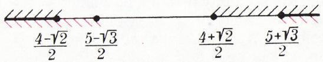
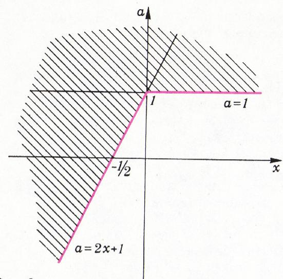
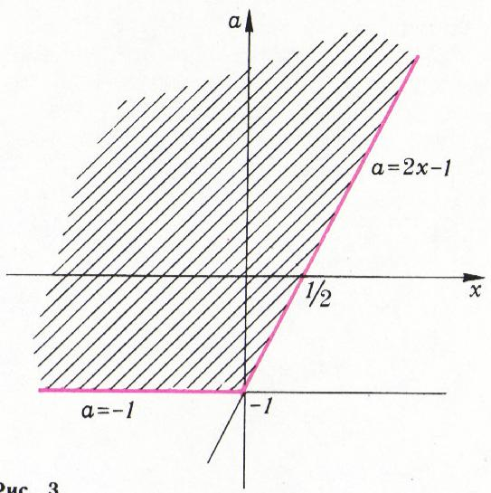
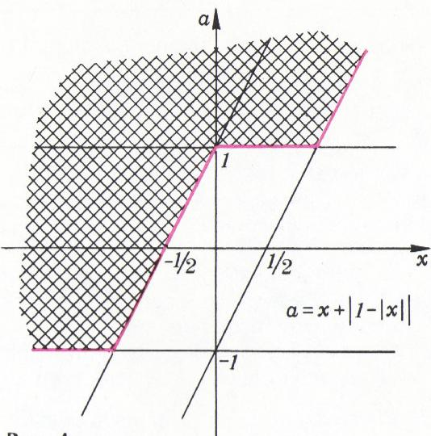

# 含绝对值不等式的解法

> **原标题**：Решение неравенств с модулем
> **作者**：С. Овчинников（С. 奥夫钦尼科夫）、И. Ф. Шарыгин（И. Ф. 沙雷金，1937—2004，苏联／俄罗斯数学教育家、几何学家，Kvant 编委）
> **译自**：Квант 1979, № 2, с. 48–51
> **原文扫描**：https://www.kvant.digital/data/kvant_1979_2/jpg/0048.jpg
> **主题**：用「等价变换」把含绝对值的不等式自动化为（不含绝对值的）不等式组与不等式组的并（система／совокупность）
> **难度**：★★（高中；含参数的例 5 略难）
> **译者**：Claude（初译）／ 2026-06-24

---

## 引言

本短文介绍一个技巧：在某种意义上，它能「自动地」把含变量带绝对值的不等式，化归为变量已不带绝对值的不等式组（система）与不等式组的并（совокупность）来求解。

给定若干不等式——为简单起见，设它们是关于同一个变量的两个不等式：

$$
f (x) > 0,\tag{1}
$$

$$
g (x) > 0.\tag{2}
$$

把不等式 (1) 的解集记作 $A$，不等式 (2) 的解集记作 $B$。

若要找同时满足不等式 (1) **和**不等式 (2) 的数所成的集合，即求集合 $A$ 与 $B$ 的**交集** $C = A \cap B$，则把不等式 (1)、(2) 用花括号联起来：

$$
\left\{ \begin{array}{l} f (x) > 0, \\ g (x) > 0 \end{array} \right.
$$

并称之为**不等式组**（система неравенств，见《代数与分析初步 10》第 123 节）。

若要找满足不等式 (1) **或**不等式 (2) 的数所成的集合，即求集合 $A$ 与 $B$ 的**并集** $D = A \cup B$，则把不等式 (1)、(2) 用方括号联起来：

$$
\left[ \begin{array}{l} f (x) > 0, \\ g (x) > 0 \end{array} \right.
$$

并称之为**不等式组的并**（совокупность неравенств）。

再强调一遍：求交集时用「组」（система）；求并集时用「组的并」（совокупность）。下表把三对相互对应的概念并列起来：

| 不等式组（система） | 不等式组的并（совокупность） |
|---|---|
| 交集（пересечение） | 并集（объединение） |
| 和（и） | 或（или） |

在解题时——我们下面就会看到——常常会遇到「组」与「组的并」的复合情形；为避免在这些场合出错，必须谨慎地使用上面引进的记号。

解含变量带绝对值的不等式，常用的办法——「去绝对值」——是这样的。由绝对值的定义

$$
| x | = \left\{ \begin{array}{c} x, \text{   若   } x \geqslant 0, \\ - x, \text{   若   } x <   0, \end{array} \right.
$$

把变量的取值范围（容许值集合）划分成若干两两不相交的子集，使得在每一个子集上，凡位于绝对值符号下的函数都保持固定的符号。这样一来，原问题的求解就化归为解一组（совокупность）不等式组（система）。

例如，要解不等式

$$
\vert x - 1 \vert + \vert x - 2 \vert > 3 + x.
$$

把数轴划分成若干不相交的区间……

## 例 0（引子）：用「去绝对值」法

……区间 $]{-}\infty;\,1[$、$[1;\,2]$ 与 $[2;\,+\infty[$。在这些区间上，$x-1$ 与 $x-2$ 各自保持符号。依次「去绝对值」，便得到下面这组不等式组：

$$
\left\{ \begin{array}{l} x <   1, \\ - (x - 1) - (x - 2) > 3 + x, \\ \left\{ \begin{array}{l} 1 \leqslant x <   2, \\ (x - 1) - (x - 2) > 3 + x, \end{array} \right. \\ \left\{ \begin{array}{l} x \geqslant 2, \\ (x - 1) + (x - 2) > 3 + x. \end{array} \right. \end{array} \right.
$$

最上面一组不等式的解集是 $]{-}\infty;\,1[\,\cap\,]{-}\infty;\,0[$，即区间 $]{-}\infty;\,0]$；中间一组无解；最下面一组的解集是 $[2;\,+\infty[\,\cap\,]6;\,+\infty[$，即区间 $[6;\,+\infty[$。把所得解集**取并集**（是 совокупность！），即得答案：

$$
] - \infty ; 0 [ \cup ] 6; + \infty [.
$$

用这种解法，常常要考虑许多情形，有时甚至要在情形里再分情形。此外，去绝对值有时还会带来一些技术上的麻烦（见下文例 4）。

## 基本定理

我们承诺的技巧，其基础是下面这个简单的定理：

$$
\begin{array}{l} 1)\ \ | f (x) | \leqslant g (x) \Leftrightarrow \left\{ \begin{array}{l} f (x) \leqslant g (x), \\ f (x) \geqslant - g (x); \end{array} \right. \\ 2)\ \ | f (x) | \geqslant g (x) \Leftrightarrow \left[ \begin{array}{l} f (x) \geqslant g (x), \\ f (x) \leqslant - g (x). \end{array} \right. \end{array}
$$

它用「去绝对值」即可轻易证明。设 $x_{0}$ 是不等式 $|f(x)| \leqslant g(x)$ 的一个解，即

$$
\left| f \left(x _ {0}\right) \right| \leqslant g \left(x _ {0}\right).\tag{3}
$$

则 $g(x_{0})\geqslant0$。若 $f(x_{0})\geqslant0$，则 $|f(x_{0})|=f(x_{0})$，不等式 (3) 化为

$$
f (x _ {0}) \leqslant g (x _ {0}).\tag{4}
$$

又因 $f(x_{0}) \geqslant 0$，$g(x_{0}) \geqslant 0$，故

$$
f (x _ {0}) \geqslant - g (x _ {0}).\tag{5}
$$

不等式 (4)、(5) 表明：在此情形下 $x_{0}$ 是不等式组

$$
\left\{\begin{array}{l}f(x)\leqslant g(x),\\ f(x)\geqslant -g(x)\end{array}\right.
$$

的解。若 $f(x_0) <  0$，则 $|f(x_0)| = -f(x_0)$，不等式 (3) 化为 $-f(x_0)\leqslant g(x_0)$，即不等式 (5)。而不等式 (4) 此时由 $f(x_0) <  0$、$g(x_0)\geqslant 0$ 立得。

定理的余下部分请读者自行补全。

当然，若把定理中处处出现的非严格不等号 $\leqslant$ 全部换成严格不等号 $<$，定理仍然成立。

## 例题

**例 1**（莫斯科大学地理系，1977）。解不等式

$$
2 \vert x + 1 \vert > x + 4.
$$

解：

$$
\begin{array}{r l} 2 | x + 1 | > x + 4 & \Leftrightarrow \left[ \begin{array}{l} 2 x + 2 > x + 4, \\ 2 x + 2 <   - x - 4 \end{array} \right. \\ & \Leftrightarrow \left[ \begin{array}{l} x > 2, \\ x <   - 2. \end{array} \right. \end{array}
$$

答案：$x > 2$ 或 $x < -2$。

**例 2**（莫斯科大学地质系，1977）。解不等式 $|x-2| \leqslant 2x^{2}-9x+9$。

解：

$$
\begin{array}{r l} & {| x - 2 | \leqslant 2 x ^ {2} - 9 x + 9 \Leftrightarrow} \\ & {\Leftrightarrow \left\{ \begin{array}{l l} {x - 2 \leqslant 2 x ^ {2} - 9 x + 9,} \\ {x - 2 \geqslant - 2 x ^ {2} + 9 x - 9} \end{array} \right. \Leftrightarrow} \\ & {\quad \Leftrightarrow \left\{ \begin{array}{l l} {2 x ^ {2} - 1 0 x + 1 1 \geqslant 0,} \\ {2 x ^ {2} - 8 x + 7 \geqslant 0.} \end{array} \right.} \end{array}
$$

所得不等式组中两个不等式的解集，在图 1 中用不同方向的阴影线分别画出。取它们的交集，即得答案：

$$
\left] - \infty ; \frac {4 - \sqrt {2}}{2} \right] \cup \left[ \frac {5 + \sqrt {3}}{2}; + \infty \right].
$$

*图 1*

我们回到本文开头用「去绝对值」法解过的那个不等式。

**例 3**。解不等式

$$
\vert x - 1 \vert + \vert x - 2 \vert > 3 + x.
$$

*图 2*

解。两次应用定理：

$$
\begin{array}{r l} & {| x - 1 | + | x - 2 | > 3 + x \Leftrightarrow} \\ & {\quad \Leftrightarrow | x - 1 | > 3 + x - | x - 2 | \Leftrightarrow} \\ & {\Leftrightarrow \left[ \begin{array}{l} {x - 1 > 3 + x - | x - 2 |,} \\ {x - 1 <   - 3 - x + | x - 2 |} \end{array} \right. \Leftrightarrow} \\ & {\qquad \Leftrightarrow \left[ \begin{array}{l} {| x - 2 | > 4,} \\ {| x - 2 | > 2 x + 2} \end{array} \right. \Leftrightarrow} \\ & {\qquad \Leftrightarrow \left[ \begin{array}{l} {x - 2 > 4,} \\ {x - 2 <   - 4,} \\ {x - 2 > 2 x + 2,} \\ {x - 2 <   - 2 x + 2} \end{array} \right. \Leftrightarrow} \\ & {\Leftrightarrow \left[ \begin{array}{l} {x - 2 > 4,} \\ {x - 2 <   - 4,} \\ {x - 2 > 2 x + 2,} \\ {x - 2 <   - 2 x - 2} \end{array} \right. \Leftrightarrow \left[ \begin{array}{l} {x > 6,} \\ {x <   - 2,} \\ {x <   - \frac {4}{3},} \\ {x <   0} \end{array} \right.} \end{array}
$$

$$
\Leftrightarrow \left[ \begin{array}{l} x > 6, \\ x <   0. \end{array} \right.
$$

$$
\text { 答案：}\ ] - \infty ; 0 [ \cup ] 6; + \infty [.
$$

（**译者注**：原文此处印作 $]6;\,+8[$，显系 $+\infty$ 之 OCR／排印误，已校正为 $+\infty$。）

前面几道题，用「去绝对值」法也不难解出。下一道题若用该法相当棘手，而用已证定理则解来十分轻巧。

*图 3*

**例 4**。解不等式

$$
\left| \left| 3 ^ {x} + 4 x - 9 \right| - 8 \right| \leqslant 3 ^ {x} - 4 x - 1.
$$

解。再次两次应用定理：

$$
\begin{array}{r l} & {| | 3 ^ {x} + 4 x - 9 | - 8 | \leqslant 3 ^ {x} - 4 x - 1 \Leftrightarrow} \\ & {\Leftrightarrow \left\{ \begin{array}{l l} {| 3 ^ {x} + 4 x - 9 | \leqslant 3 ^ {x} - 4 x + 7,} \\ {| 3 ^ {x} + 4 x - 9 | \geqslant - 3 ^ {x} + 4 x + 9} \end{array} \right. \Leftrightarrow} \\ & {\Leftrightarrow \left\{ \begin{array}{l l} {\left\{ \begin{array}{l l} {3 ^ {x} + 4 x - 9 \leqslant 3 ^ {x} - 4 x + 7,} \\ {3 ^ {x} + 4 x - 9 \geqslant - 3 ^ {x} + 4 x - 7,} \end{array} \right.} \\ {\left[ \begin{array}{l l} {3 ^ {x} + 4 x - 9 \geqslant - 3 ^ {x} + 4 x + 9,} \\ {3 ^ {x} + 4 x - 9 \leqslant 3 ^ {x} - 4 x - 9} \end{array} \right.} \end{array} \right. \Leftrightarrow} \\ & {\Leftrightarrow \left\{ \begin{array}{l l} {\left\{ \begin{array}{l l} {x \leqslant 2,} \\ {3 ^ {x} \geqslant 1,} \end{array} \right.} \\ {\left[ \begin{array}{l l} {3 ^ {x} \geqslant 9,} \\ {x \leqslant 0} \end{array} \right.} \end{array} \right. \Leftrightarrow \left\{ \begin{array}{l l} {\left\{ \begin{array}{l l} {x \leqslant 2,} \\ {x \geqslant 0,} \end{array} \right.} \\ {\left[ \begin{array}{l l} {x \geqslant 2,} \\ {x \leqslant 0.} \end{array} \right.} \end{array} \right.} \end{array}
$$

故所求解集为 $[0;\,2]\,\cap\,\bigl(]{-}\infty;\,0]\cup[2;\,+\infty[\bigr)$。

答案：$\{0,\,2\}$。

我们以一道含参数的不等式来结束本文。

**例 5**。解不等式

$$
\vert 1 - \vert x \vert \vert <   a - x.
$$

解：

$$
\begin{array}{r l} 1 - | x | & <   a - x \Leftrightarrow \\ & \Leftrightarrow \left\{ \begin{array}{l} 1 - | x | <   a - x, \\ 1 - | x | > - a + x \end{array} \right.\end{array}
$$

*图 4*

$$
\Leftrightarrow \left\{ \begin{array}{l} | x | > 1 - a + x, \\ | x | <   1 + a - x \end{array} \right. \Leftrightarrow \left\{ \begin{array}{l} \left[ \begin{array}{l} x > 1 - a + x, \\ x <   - 1 + a - x, \end{array} \right. \\ \left\{ \begin{array}{l} x <   1 + a - x, \\ x > - 1 - a + x \end{array} \right. \end{array} \right.
$$

$$
\Leftrightarrow \left\{ \begin{array}{l} {\left[ \begin{array}{l} a > 1, \\ x <   \frac {a - 1}{2}, \end{array} \right.} \\ {\left\{ \begin{array}{l} x <   \frac {a + 1}{2}, \\ a > - 1. \end{array} \right.} \end{array} \right.
$$

原则上，所得这组复合不等式已可据以写出答案。不过，为得出最终答案，我们将改用一个在解含参数问题时往往很有用的技巧。

考虑一个坐标平面，其一条坐标轴表示 $x$ 的值，另一条表示 $a$ 的值。图 2 画出的是这组不等式（组的并）

$$
\left[ \begin{array}{l} a > 1, \\ x <   \frac {a - 1}{2}, \end{array} \right.
$$

的解集；而图 3（**译者注**：原文如此，结合上下文及图 4 应指下方不等式组）画出的则是这组不等式组

$$
\left\{ \begin{array}{l} x <   \frac {a + 1}{2}, \\ a > - 1. \end{array} \right.
$$

的解集。图 4 中阴影部分是这两个集合的交集，即与原不等式等价的不等式组的解集。由这张图已可十分方便地写出答案：

- 当 $a \in ]{-}\infty;\,-1]$ 时，无解；
- 当 $a \in ]{-}1;\,+1]$ 时，

$$
x \in ] - \infty ; \tfrac {a - 1}{2} [;
$$

- 当 $a \in ]1;\,+\infty[$ 时，

$$
x \in ] - \infty ; \tfrac {a + 1}{2} [.
$$

细心的读者会发现：既然作者用到了 $Oxa$ 平面，那何不一上来就在该平面上画出函数

$$
a = x + | 1 - | x | |
$$

的图像，然后考察该图像上方的区域、直接写出答案呢？这样的读者无疑是对的。（图 4 上的红色曲线，正是函数 $a = x + |1 - |x||$ 的图像。）

利用坐标平面（其中一条坐标轴为参数值轴）的方法威力很强，借助它可以解决许多困难的问题。

## 练习题

解下列不等式（第 1—4 题）：

1. （莫斯科大学生物系，1968）$|3x + 2| \leqslant x^2 + x$。

2. （莫斯科大学物理系，1974）$3|x - 1| > (x - 1)^2 + 1$。

3. （莫斯科大学地理系，1977）

   а) $3|x-1|\leqslant x+3$；

   б) $4|x+2|<2x+10$；

   в) $3|x+1|\geqslant x+5$。

4. （莫斯科大学地质系，1977）

   а) $3x^{2}-|x-3|>9x-2$；

   б) $x^{2} + 4 \geqslant | 3 x - 2 | - 7 x$；

   в) $x^{2}-|5x-3|-x<2$。

5. （莫斯科大学经济系政治经济学教研室，1977）

   а) 确定当 $a$ 取何值时，不等式 $3-|x-a|>x^{2}$ 至少有一个负数解。

   б) 确定当 $a$ 取何值时，不等式 $2 > |x + a| + x^2$ 至少有一个正数解。

---

## 译者注与校对说明

1. **OCR 校正**：本文由 MinerU 对扫描页（p48–p51）做俄文 OCR 后翻译。校正要点：
   - 作者署名原文为 «С. Овчинников, И. Шарыгин»（OCR 中 Шарыгин 曾被误识）；译者按规范补出姓氏首字母 И. Ф. 及生卒年。
   - 例 3 末答案原文印作 $]6;\,+8[$，显系 $]6;\,+\infty[$ 的排印／OCR 误植，已校正为 $+\infty$（与例 0 中同一不等式的答案一致，二者均为 $]{-\infty};\,0[\cup]6;\,+\infty[$）。
   - 例 2 答案 $\dfrac{4-\sqrt{2}}{2}$ 与 $\dfrac{5+\sqrt{3}}{2}$ 经核，根号内的 $\sqrt{2}$、$\sqrt{3}$ 来自两个二次方程 $2x^{2}-8x+7=0$（根 $\frac{4\pm\sqrt{2}}{2}$）与 $2x^{2}-10x+11=0$（根 $\frac{5\pm\sqrt{3}}{2}$），已据扫描页与算式核对，无误。
   - 习题 3、4、5 的项目字母 а) б) в) 经 OCR 后曾出现 a/6/b 等混淆，已据俄文字母表还原为 а) б) в)。
   - 第 3 题前缀 «Георр. ф-т»（OCR 误）已校正为 «Геогр. ф-т»（地理系）；第 5 题出处 «Отд. полйт. экон.» 校正为 «Отд. полит. экон.»（政治经济学教研室）。
   - 例 5 中段，原文口述「图 2」「图 3」实际对应正文中尚未单列的两个解集示意，且原文叙述与图号略有错位；译文加「译者注」点明，最终答案仍以图 4 为准。扫描页公式、表格（系统／组的并对照表）均已与 p48 扫描页核对一致。
2. **术语**：система неравенств 译「不等式组」（求**交集**，花括号），совокупность неравенств 译「不等式组的并」（求**并集**，方括号）；модуль 译「绝对值／模」；区间记号 $]a;\,b[$、$[a;\,b[$ 沿用原文（俄式开闭区间记法，对应 $(a,b)$、$[a,b)$）。其余术语遵《01_工作规范.md》。
3. **背景**：本文发表于 1979 年，正值苏联高校招生（МГУ 各系）考题密集期，所引例题与习题均取自莫斯科大学 1968—1977 年各系入学试题，保留原署系名。作者之一沙雷金（И. Ф. Шарыгин）是苏联著名几何学／数学教育家，Kvant 长期编委，其编写的几何教材在俄语世界影响深远。

## 建议讨论题

1. 定理 1)、2) 的「等价」为何成立？请用自己的话把 $f(x_0)<0$ 那一支的证明补完，并说明为什么 $|f(x)|\leqslant g(x)$ 一定隐含 $g(x)\geqslant 0$。
2. 例 4 中双重绝对值 $||3^{x}+4x-9|-8|$ 若改用「去绝对值」分情形讨论，要分几种情形？对比定理法，体会「自动去绝对值」的省力之处。
3. 例 5 用 $Oxa$ 参数平面读答案，红色曲线 $a=x+|1-|x||$ 的形状你能徒手画出吗？它由哪几段折线／抛物线段拼成？
4. 习题 5а、5б 这类「至少有一个正／负数解」的含参数问题，与「对一切 $x$ 成立」的问题在几何（$Oxa$ 平面）解释上有何不同？

---

> **版权说明**：原文版权归 MCCME（莫斯科连续数学教育中心）及作者继承者所有。本译文为非商业、自用、数学圈内部参考，未获授权不得公开分发。原文扫描见 [kvant.digital](https://www.kvant.digital/data/kvant_1979_2/jpg/0048.jpg)。

> **复用说明**：本译文的俄文 OCR 原文与所有插图均存档于 `ocr/1979_02_sharygin_A07/`（`ru.md` 为合并 OCR 文本，`meta.json` 为图映射）。如对译文质量不满意，可直接基于 `ru.md` 重译，无需重跑 OCR。
