# 围绕 Pick 公式

> **原标题**：ВОКРУГ ФОРМУЛЫ ПИКА
> **作者**：Н. Б. Васильев（N. B. 瓦西里耶夫，1931—2001，苏联数学家、Kvant 编辑部成员、莫斯科数学科普代表人物之一）
> **译自**：Квант 1974, № 12, с. 39–43
> **原文扫描**：https://www.kvant.digital/data/kvant_1974_12/jpg/0039.jpg
> **主题**：Pick 公式（格点多边形面积 $S = r/2 + i - 1$）及其围绕它展开的格点几何、三蚱蜢游戏、三角剖分与欧拉定理式的关系
> **难度**：★★★（文字本身初高中可读，但附有 33 道层层递进的命题，需要做几何与组合的细致推理）
> **译者**：Claude（初译）／ 2026-06-24

---

> *本栏为「数学小组」（Математический кружок）专栏文章。*

*专栏题头：Математический кружок（数学小组）*

要估计画在方格纸上的多边形的面积，只需数一数这个多边形覆盖了多少个格子（我们把一个格子的面积取为单位 1）。更精确地说，若 $S$ 是多边形的面积，$N_{1}$ 是整个落在多边形内部的格子数，$N_{2}$ 是与多边形内部至少有一个公共点的格子数，则

$$
N_{1} \leqslant S \leqslant N_{2}.
$$

（这一事实也可用来给出多边形乃至其它图形面积的精确定义。）

下面我们只考察这样的多边形：它的所有顶点都落在方格纸的**格点**上，即落在网格线相交的点上。结果发现，对于这样的多边形，可以写出一个非常简洁的公式：

$$
S = \frac{r}{2} + i - 1,
$$

其中 $S$ 为面积，$r$ 为落在多边形边界（即各边及各顶点）上的格点数，$i$ 为严格落在多边形内部的格点数。

这个公式有时被称作 **Pick 公式**，得名于在 1899 年发现它的那位数学家。（不过，我们也难以断言这条自然得几乎显而易见、又允许好几种截然不同证法的公式，在 Pick 之前就没有人想到过。）

在我们这篇短文中，Pick 公式的证明与应用，都将或多或少地与《Kvant 问题集》中的某些题目发生联系。

## 简单三角形

先提醒一下：我们只考察顶点都落在方格纸格点上的多边形（特别地，三角形也是这样），这一点每次都不再特别声明。我们把一张方格纸看作在所有方向上都无限延伸，每个格子都是边长为 1 的正方形。

画在方格纸上的任何一个三角形的面积，都不难算出来：只要过所画三角形的三个顶点引出沿网格线的直线，把它表示成若干个直角三角形与矩形的面积之和或之差即可。例如对图 1 中的几个三角形这样做了之后，你就会发现，得到的面积总是等于一个**「半整数」**，即形如 $m/2$（$m$ 为整数）的数。

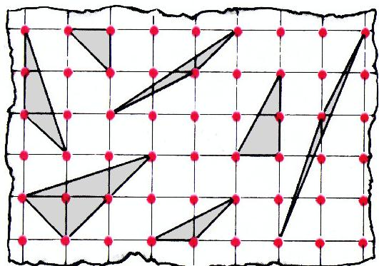

*图 1*

如果一个三角形，除三个顶点外，它的内部和各边上都没有格点，我们就称它为**简单三角形**。（之所以这样命名，是因为任何其它三角形都可由若干简单三角形拼成；这是后文要用到的事实之一。）请注意：图 1 中所有简单三角形的面积都是 $1/2$。我们将会看到，这并非偶然。

《Kvant》1974 年第 6 期登载过 **M226** 题的解答，其中向读者提出了这样一个问题。**三只蚱蜢**（三个点）在初始时刻坐在同一格子的三个顶点上，然后开始「跳背」游戏：每一只都可以越过另外两只中的一只，落到关于这只的对称点上（图 2；显然，任意多次这样的跳跃之后，蚱蜢们都会落在方格纸的格点上）。经过若干次跳跃之后，蚱蜢们可能同时出现在哪些三点组上？

如果一个三角形的三个顶点上可以同时出现三只在初始时刻同处一格三顶点的蚱蜢，我们就称它为**可达的**；所谓一次**跳跃**，是指如下的三角形变换：某一顶点移到关于另外两顶点中任一个的对称点处（这两顶点保持不动）。

**定理 1**。对于顶点在方格纸格点上的三角形，下列三条性质彼此等价：

1) 三角形面积为 $1/2$；

2) 三角形是简单的；

3) 三角形是可达的。

要确信这条定理成立，你可以去证明下面列出的 12 条命题。带星号 * 的题目，其证明提示附在本期末尾。其余各条，若按下面给出的次序去证，则几乎是显然的：

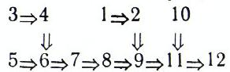

1. 三角形面积在一次跳跃中保持不变。

2. 任何可达三角形的面积都是 $1/2$。

3\*. 若把一个简单三角形 $ABC$ 补成一个平行四边形 $ABCD$，则除顶点外，这个平行四边形内部及各边上都没有格点。

4\*. 一个简单三角形经一次跳跃仍得简单三角形。

5\*. 简单三角形中必有一角为钝角或直角（且后一情形只可能出现在三顶点同属一格的三角形中；这种边长为 $1,\ 1,\ \sqrt{2}$ 的简单三角形，我们将称之为**最小三角形**）。

6. 任何一个简单的、非最小的三角形，都可以经一次跳跃化成一个最大边严格小于原三角形最大边的三角形。

7\*. 任何一个简单三角形，都可以经有限次跳跃化为最小三角形。

8. 任何一个简单三角形都是可达的。

9. 任何一个简单三角形的面积都是 $1/2$。

10\*. 任何一个三角形都可被切成若干个简单三角形。

11. 任何一个三角形的面积都等于 $m/2$，并且，不论把它怎样切成简单三角形，简单三角形的个数都等于 $m$。

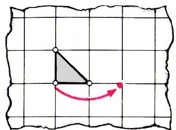

*图 2*

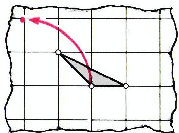

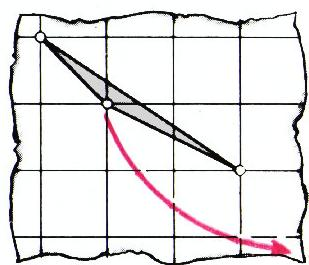

12. 任何面积为 $1/2$ 的三角形都是简单的。

显然，由命题 2、8、12 即可推出定理 1。

请再证明简单三角形的几条性质。

13. 对于格点上任意两个顶点之间不再含其它格点的线段 $AB$，都存在格点 $C$，使得三角形 $ABC$ 是简单的。

14. 上题中的格点 $C$ 总可以这样选取，使角 $ACB$ 为钝角或直角。

15. 一个平行四边形，当且仅当它由一条对角线分成的两个三角形都是简单的时，它所「生成」的格才恰好是方格纸所有格点构成的格（参见 A. A. Egorov 的文章，第 26 页）。

同一条性质也可叙述为：

16. 三角形 $ABC$ 是简单的，当且仅当把 $ABC$ 经所有「将顶点 $A$ 平移到格点」的平行移动后所得的全部三角形彼此不重叠（图 3）。

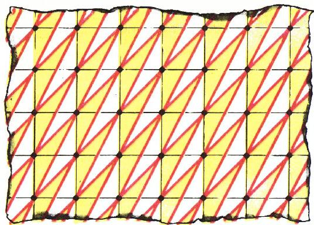

*图 3*

现在回到三只蚱蜢的问题。设蚱蜢们在初始时刻占据某个特定的（而非任意的）最小三角形——题目最初正是这样设定的。由于每只蚱蜢在一次跳跃中沿水平和竖直方向都必定移动偶数个格子，所以它必定落到「自己的」那个 $2\times2$ 格子大小的格中。图 4 把构成整个格的四个「子格」中的三个染上了不同颜色（每只蚱蜢只跳到属于自己颜色的格点上），而第四个子格则与网格线同色。

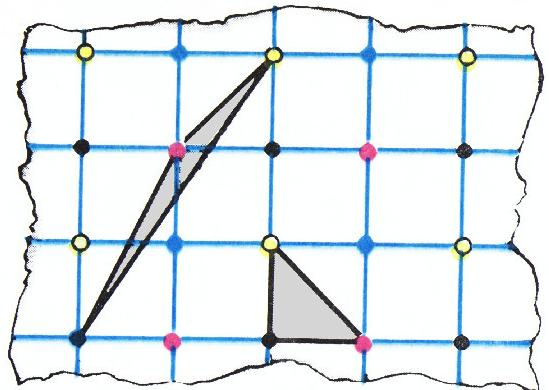

*图 4*

据定理 1，蚱蜢们可以同时落到一个简单三角形的三个顶点上。

由此又可推出这些三角形的一条有趣性质。

17. 若把格——方格纸的全部格点——分成四个 $2\times2$ 子格（图 4），则一个简单三角形的三个顶点必定分别落在三个不同的子格中（即三种不同颜色上）。

现在已不难证明下面两条命题，它们给出了三蚱蜢问题的答案（在初始三角形已被固定的情形下；见图 4）。

18. 三只蚱蜢能够同时到达、且仅能到达那些构成简单三角形顶点的三点组，并且这些点的颜色分别与初始三角形相应顶点的颜色一致。

19. 两只蚱蜢能够同时到达、且仅能到达那些相应颜色的格点对，且这两点之间的线段上不再含其它格点。

## 多边形的三角剖分

我们已对方格纸上的一类特殊多边形（在 Pick 公式中对应 $i=0$、$r=3$、$S=1/2$ 的情形）做了详尽研究。但从这种特殊情形，借助关于任意多边形可被切成三角形的定理，可以一步跨到最一般的情形（这里方格纸已不再需要）。

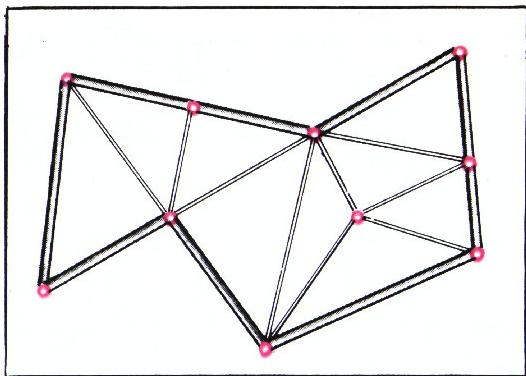

*图 5*

设在平面上给定一个（不一定是凸的）多边形，以及一个由有限个点组成的集合 $K$，这些点既落在多边形内部、又落在它的边界上（并且多边形的所有顶点都属于 $K$）。所谓**以 $K$ 为顶点的三角剖分**，是指把所给多边形分成若干个三角形（顶点都在 $K$ 中），且 $K$ 中的每一点，作为它所属的三角剖分中每个三角形的顶点而出现（也就是说，$K$ 中的点既不落在某个三角形内部，也不落在某条边的内部，见图 5）。

**定理 2**。а) 任何一个 $n$ 边形都可以用对角线切成若干个三角形，且三角形的个数恰为 $n - 2$。（这种剖分——就是以 $n$ 边形的各顶点为顶点的三角剖分。）

б) 设多边形边界上共标出 $r$ 个点（含全部顶点），内部又标出 $i$ 个点。则以这些标出点为顶点存在一种三角剖分，且这种三角剖分中三角形的个数等于

$$
r + 2i - 2.
$$

显然，а) 是 б) 在 $r = n$、$i = 0$ 时的特例。这条定理的证明，我们同样拆成若干条简单命题。

20\*. 从 $n$ 边形（$n > 3$）最大角的顶点出发，总能引出一条完全落在多边形内部的对角线。

21. 若 $n$ 边形被一条对角线分成一个 $p$ 边形和一个 $q$ 边形，则 $n = p + q - 2$。

22. 任何一个 $n$ 边形都可用对角线切成 $n - 2$ 个三角形。

23. $n$ 边形的内角和等于 $180^{\circ}\cdot(n - 2)$。

24. 对于任意一个三角形，若在其内部及边界上标出若干个点（其中包括它的全部三个顶点），则以这些标出点为顶点的三角剖分总是存在的。

25. 同样的结论对任意 $n$ 边形也成立。

26. 三角剖分中三角形的个数等于 $r + 2i - 2$，其中 $i$ 与 $r$ 分别是多边形内部与边界上标出点的个数。

由此即得定理 2。

27. 由定理 1 与定理 2 推出 Pick 公式：$S = r/2 + i - 1$。

命题 26 证明中那个方便的手法——**清点各角之和**——在其它几何组合题（特别是关于多边形剖分的题目）中也常常奏效。下面再举两例。

把 $n$ 边形剖分成若干个多边形，如果其中一个多边形的某个顶点，只要它还属于别的剖分多边形，就同时是那些多边形的顶点，我们就称这种剖分为**规则剖分**。

28. 若把 $n$ 边形作规则剖分所得的各个 $k$ 边形中，有 $i$ 个顶点落在 $n$ 边形内部，$r$ 个落在边界上，则 $k$ 边形的个数为

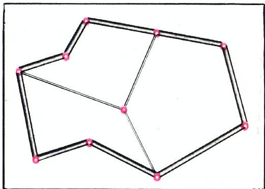

*图 6*

$$
m = \frac{r + 2i - 2}{k - 2}.
$$

29（**「欧拉定理」的变体**）. 若平面上的 $N_{0}$ 个点与以这些点为端点的 $N_{1}$ 条线段构成一个被规则地剖分成 $N_{2}$ 个多边形的多边形，则（图 6）

$$
N_{2} - N_{1} + N_{0} = 1.
$$

## 若干题目

Pick 公式的应用，主要并不在于计算具体某个多边形的面积，而在于各种关于方格纸上折线的题目与定理。

30. 设某个多边形的面积与它某一条边长平方之比为无理数（例如正三角形就是如此）。证明：与它相似的多边形不可能画在方格纸上使其顶点都落在格点处。

31. 设 $A$、$B$ 是方格纸上的两个格点，其中第二个比第一个向右 $p$ 格、向上 $q$ 格（即两格点之间的距离为 $\sqrt{p^{2} + q^{2}}$）。直线 $AB$ 到离它最近、但不在它上面的格点的距离等于多少？

32. 一只国际象棋**王**走遍了 $8\times8$ 棋盘，每个格子恰好经过一次，且最后一步回到出发的格子。依次连接王所经过各格中心所得的折线没有自交点。

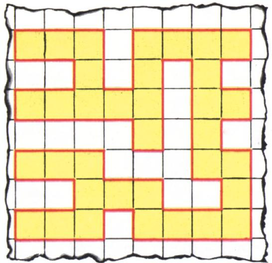

*图 8*

а) 这条折线最长可达多少？

б) 这条折线所能围出的面积是多少？（格子边长为 1。）

题 а) 在今年《Kvant》第 5 期（第 52 页）已经讨论过——它在《Kvant 问题集》中编号为 M220。这里我们给出另一种解法。但先从题 б) 入手。由 Pick 公式立得：折线所围面积等于 $64/2 - 1 = 31$（方格纸的格点就是 64 个格子的中心；按条件，它们全都落在所围多边形的边界上）。再转向题 а)。图 7 给出了一个王的走法实例，其中 64 步里有 36 步长度为 $\sqrt{2}$（沿对角线方向）。我们来证明：这样的对角线步不可能超过 36 步。

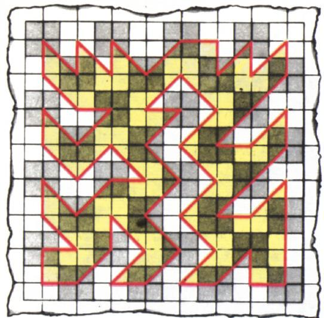

*图 7*

对王走过的每一段长为 $\sqrt{2}$ 的线段，以它为对角线作一个 $1\times1$ 正方形。这个正方形的一半落在王所走折线所围多边形之外。但所有这些「半块」所占的总面积不超过 $49 - 31 = 18$，因为它们都落在 $7\times7$ 的方格正方形之内。所以对角线步数不超过 36。

于是，第 32 题的答案为：

а) $28 + 36\sqrt{2}$；б) $31$。

33. 需要沿网格线作一条闭合的不自交的折线，使它通过一个 $p\times q$ 格子的矩形内部所有方格纸格点。

а) 对怎样的 $p$ 与 $q$ 这才能做到？

б) 这条折线的长度是多少？

в) 它所围的面积是多少？（图 8）。

---

## 译者注与校对说明

1. **OCR 校正**：本文由 MinerU 对扫描页做俄文 OCR 后翻译。已据扫描页校正若干 OCR 错误，主要包括：
   - 专栏题头「МАТЕМАТИЧЕСКИЙ КРУЖОК」被 OCR 误识为「МАТЕМАТИЧЕСНИЙ КРУЖОН」（ш→с、к→н），已还原；
   - Pick 公式正文 $S = \dfrac{r}{2} + i - 1$ 及夹逼不等式 $N_{1} \leqslant S \leqslant N_{2}$ 已据扫描页 p39 核对无误；
   - 题号中的星号标记（3\*、4\*、5\*、7\*、10\*、20\*）与俄文项目字母 а) б) в) 均按俄文规范还原（OCR 曾将 а/б/в 与拉丁 a/6/b 混淆）；
   - 第 32 题答案 6) 实为俄文 б)，已还原；夹文中 $S=1/2$（OCR 误作 $S=^{1/2}$）已修正；
   - 原文若干处破折号「много-угольника」「n-угольник」中的软连字符已合并。
2. **术语**：本文核心术语遵照《01_工作规范.md》对照表：многоугольник=多边形、треугольник=三角形、параллелограмм=平行四边形、триангуляция=三角剖分、разбиение=剖分、решётка=格（格点构成的格）、узел=格点、кузнечик=蚱蜢、прыжок=跳跃、достижимый=可达的、минимальный（треугольник）=最小三角形。Pick 公式中 $r$（граница，边界格点数）、$i$（внутри，内部格点数）按通行记法保留。
3. **图表**：原文插图（图 1—8 及命题插图）由 MinerU 从整页扫描中自动裁出，存于 `images/1974_12_vasilev_B01/fig_*.png`，共 12 幅。图号与正文「图 N」对应如下——图 1=fig\_p39\_02，图 2=fig\_p40\_02，图 3=fig\_p41\_01，图 4=fig\_p41\_02，图 5=fig\_p42\_01，图 6=fig\_p42\_02，图 7=fig\_p43\_01，图 8=fig\_p43\_02；另有 fig\_p39\_01（专栏题头）、fig\_p40\_01（命题 3\*/4\*/5\*/7\* 插图）、fig\_p40\_03/fig\_p40\_04（格点三角形示意）。原 OCR 中图 3、图 4 的图注位置错乱（p41 顶部「Рис. 4」与「Рис. 3」先后颠倒），已据内容归位：fig\_p41\_01 含图 3「平行移动铺满平面」，fig\_p41\_02 含图 4「四色子格」。本文无表格。
4. **时代感**：M226、M220 等《Kvant 问题集》编号、所引 A. A. Egorov 文章「第 26 页」、以及 $8\times8$ 棋盘王的回路问题，均保留 1974 年苏联 Kvant 原貌。

## 建议讨论题

1. 定理 1 把「面积 $1/2$」「简单」「可达」三件事画上等号。这三者之间，你觉得哪一条作为「出发点」最自然、哪一条证起来最费劲？为什么三只蚱蜢游戏会和格点三角形面积挂钩？
2. 第 32 题（王走遍 $8\times8$ 棋盘）中，Pick 公式一下子给出面积 31，而长度的上界 $28+36\sqrt{2}$ 却要靠「数对角线半块」来夹逼。请体会：为什么面积能「算」而长度只能「估」？这背后是不是「格点数」这一离散不变量在帮忙？
3. 第 28 题给出的 $k$ 边形个数公式 $m=\dfrac{r+2i-2}{k-2}$，与第 26 题三角剖分中三角形个数 $r+2i-2$ 是何关系？能否据此一眼看出：把多边形规则剖分成三角形（$k=3$）时三角形个数恰为 $r+2i-2$？
4. 命题 29 给出 $N_{2}-N_{1}+N_{0}=1$，这正是平面图的欧拉公式 $V-E+F=2$ 的「挖掉外面那一面」的版本。请把它与你学过的欧拉公式对照，想想为什么这里是 $=1$ 而不是 $=2$？

---

> **版权说明**：原文版权归 MCCME（莫斯科连续数学教育中心）及作者继承者所有。本译文为非商业、自用、数学圈内部参考，未获授权不得公开分发。原文扫描见 [kvant.digital](https://www.kvant.digital/data/kvant_1974_12/jpg/0039.jpg)。

> **复用说明**：本译文的俄文 OCR 原文与所有插图均存档于 `ocr/1974_12_vasilev_B01/`（`ru.md` 为合并 OCR 文本，`meta.json` 为图映射）。如对译文质量不满意，可直接基于 `ru.md` 重译，无需重跑 OCR。
