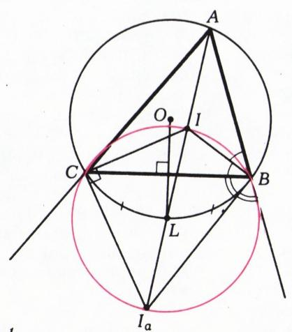
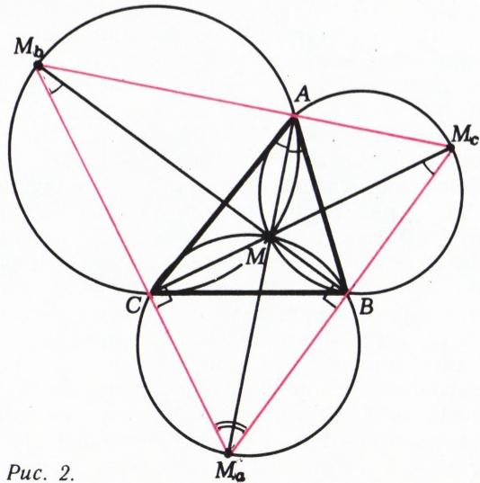
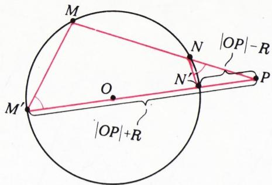
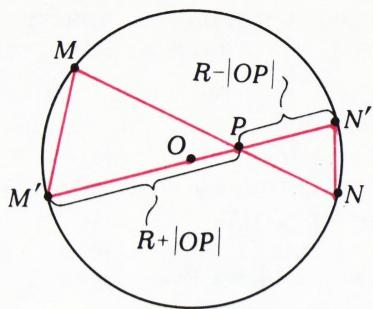
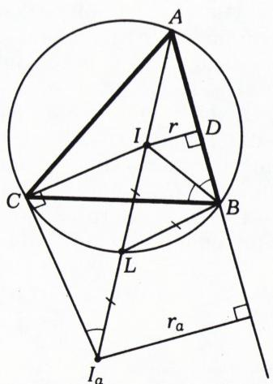
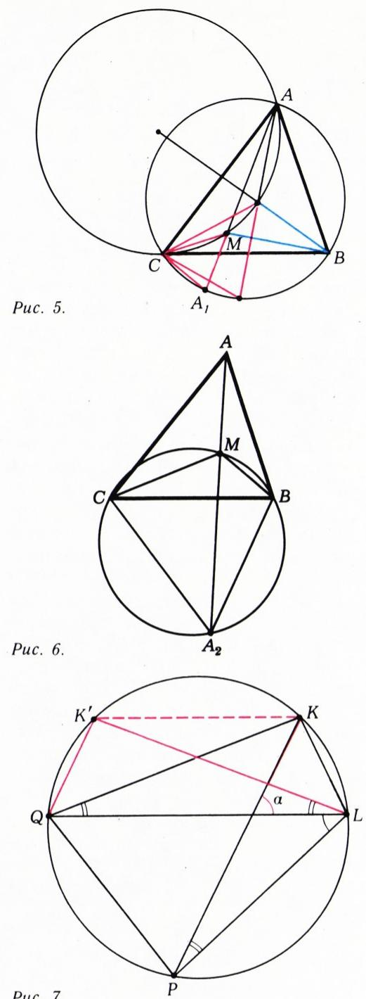

# 围绕角平分线

> **原标题**：Вокруг биссектрисы
> **作者**：И. Ф. Шарыгин（I. F. 沙雷金，1937—2004，苏联／俄罗斯数学教育家、数学科普作家，莫斯科国立大学物理数学副博士）
> **译自**：Квант 1983, № 8, с. 32–36
> **原文扫描**：https://www.kvant.digital/data/kvant_1983_8/jpg/0032.jpg
> **主题**：三角形角平分线（内、外）及其相关度量与极值性质，旁切圆、欧拉公式，斯坦纳—莱默斯定理及其反例
> **难度**：★★（高中／竞赛层面，涉及圆幂、托勒密定理、间接极值论证）
> **译者**：Claude（初译）／ 2026-06-24

---

## 引子

本文收集了一些几何事实，它们直接或间接地与三角形的角平分线有关。读者在其中既能找到那些不甚困难、却使用频繁的「引理」，也能遇到更扎实、更艰难的「定理」，以及若干单纯是漂亮的「习题」。我们不去对它们作任何分类，只是按照在文中出现的先后次序编号。文中那些未加证明的命题，自动归入习题之列。至于文中已有的证明，我们也尽量写得简练，以便给读者留下思考的余地。

*图 1*

## 人人皆应知晓的几条

首先回忆一些通用记号：$ABC$ 是给定的三角形，$S_{ABC}$ 是它的面积，$|BC|=a$，$|CA|=b$，$|AB|=c$，$2p=a+b+c$，$O$ 与 $R$ 分别是外接圆圆心及其半径，$I$ 与 $r$ 是内切圆圆心及其半径。此外，三角形还有三个**旁切圆**，每个旁切圆与三角形的一条边相切，并与另外两条边的延长线相切。它们的圆心和半径分别记作 $I_{a}$，$I_{b}$，$I_{c}$ 和 $r_{a}$，$r_{b}$，$r_{c}$（其中 $I_{a}$ 是与边 $BC$ 及边 $AB$、$AC$ 的延长线相切的旁切圆圆心，$r_{a}$ 是其半径）。

其它记号将在相应处加以说明。

(1) 设角 $A$ 的角平分线与边 $BC$ 交于点 $A_{1}$。则

$$
\frac{\left| B A _ {1} \right|}{\left| A _ {1} C \right|} = \frac{\left| B A \right|}{\left| A C \right|} = \frac{c}{b}.
$$

(2) 设顶点 $A$ 处外角的角平分线与直线 $BC$ 交于点 $A_{2}$。则

$$
\frac{\left| B A _ {2} \right|}{\left| A _ {2} C \right|} = \frac{\left| B A \right|}{\left| A C \right|} = \frac{c}{b}.
$$

(3) $S_{ABC} = pr$。

(4) $S_{ABC} = (p - a)\,r_{a}$。

(5) 若 $M$ 是内切圆与边 $AB$ 的切点，则 $|AM| = p - a$。（内切圆与各边的切点分三角形各边所成的其它线段，可类似地确定。）

(6) 若 $M$ 是以 $I_{a}$ 为圆心的旁切圆与直线 $AB$ 的切点，则 $|AM| = p$。

(7) 顶点 $B$ 与 $C$ 落在以 $II_{a}$ 为直径的圆上；该圆圆心 $L$ 落在外接圆上（图 1）。

由此可见，内切圆圆心 $I$ 具有如下性质：直线 $AI$、$BI$、$CI$（也就是各角的角平分线）分别通过三角形 $BIC$、$CIA$、$AIB$ 的外接圆圆心。其逆定理也成立。

(8) 若直线 $AM$、$BM$、$CM$ 分别通过三角形 $BMC$、$CMA$、$AMB$ 的外接圆圆心，则 $M$ 是三角形 $ABC$ 的内切圆圆心。

事实上，设 $M_{a}$、$M_{b}$、$M_{c}$ 分别是直线 $AM$、$BM$、$CM$ 与相应外接圆的、异于 $M$ 的交点（图 2）。则 $MM_{a}$、$MM_{b}$、$MM_{c}$ 是这些圆的直径，因此 $M_{a}A$、$M_{b}B$、$M_{c}C$ 是三角形 $M_{a}M_{b}M_{c}$ 的高。由此得 $\widehat{BAM}=B\widehat{M}_{c}M=90^{\circ}-B\widehat{M}_{a}C=C\widehat{M}_{b}M=\widehat{CAM}$，即 $M$ 落在角 $A$ 的角平分线上，类似地也落在角 $B$、$C$ 的角平分线上。

**「值得注意的圆」的圆心之间的距离。**

(9) $\left|OI\right|^{2}=R^{2}-2Rr$（欧拉公式）。

(10) $\left| O I_{a} \right|^{2}=R^{2}+2 R r_{a}$。

(11) $\left|II_{a}\right|^{2}=4R\left(r_{a}-r\right)$。

为证前两个公式，先回忆：若过定点 $P$ 的任一直线与以 $O$ 为圆心、$R$ 为半径的圆相交于点 $M$、$N$，则 $|PM| \cdot |PN| = \left|R^{2} - |OP|^{2}\right|$。（这由三角形 $PMM'$ 与 $PNN'$ 的相似性得出，其中 $M'$、$N'$ 是直线 $OP$ 与圆的交点；见图 3，а 与 б。）由此可知 $R^{2} - |OI|^{2} = |IA| \cdot |IL|$，其中 $L$ 是角 $A$ 的角平分线与外接圆的交点（图 4）。但 $|IA| = r/\sin (\hat{A}/2)$，而由 (7) 有 $|IL| = |LB| = 2R \sin (\hat{A}/2)$，故 $R^{2} - |OI|^{2} = 2Rr$。类似地，$|OI_{a}|^{2} - R^{2} = |I_{a}L| \cdot |I_{a}A| = 2R \sin (\hat{A}/2) \cdot r_{a}/\sin (\hat{A}/2) = 2Rr_{a}$。最后，$|II_{a}|^{2} = (2|IL|) \cdot (|I_{a}A| - |IA|) = 4R \sin \dfrac{\hat{A}}{2} \cdot \dfrac{r_{a} - r}{\sin \dfrac{\hat{A}}{2}} = 4R(r_{a} - r)$。

*图 3，а*

(12) 各旁切圆圆心关于外接圆圆心作对称所得的点，都落在以 $I$ 为圆心、$2R$ 为半径的圆上。

*图 3，б*

*图 4*

## 内切圆圆心的两个极值性质

在三角形 $ABC$ 内任取一点 $M$。关于该点到三角形各顶点的距离，存在相当多的不等式。我们考察其中两条与本文主题有关的不等式。

(13) 记直线 $AM$ 与外接圆的交点为 $A_{1}$。则

$$
\frac {| B M | \cdot | C M |}{| A _ {1} M |} \geqslant 2 r.
$$

(14) $|AM|\sin B\widehat{M}C + |BM| \sin C\widehat{M}A + |CM|\sin A\widehat{M}B \leqslant p$。

在两种情形中，等号当且仅当 $M$ 与 $I$（内切圆圆心）重合时取得。

设不等式 (13) 左端的表达式 $f(M) = \dfrac{|BM| \cdot |CM|}{|A_{1}M|}$ 在三角形 $ABC$ 内某点 $M$ 处取得最小值。我们将证明 $M=I$。又因 $f(I)=2r$（例如，这可由图 4\* 中直角三角形 $BID$ 与 $I_{a}IC$ 的相似性得出），故可推知：只要 $f(M)$ 在三角形 $ABC$ 内取得最小值，便有 $f(M) \geqslant 2r$。上述「最小值取得于三角形内部」这一假设是非平凡的、也是非常关键的，我们稍后再作讨论。

作三角形 $AMC$ 的外接圆（图 5）。当点 $M$ 沿其弧 $AC$ 移动时，所得到的所有三角形 $CMA_{1}$ 彼此相似（为什么？），因而比值 $|CM|/|A_{1}M|$ 对它们是同一个常数。因此，若 $M$ 是 $f(M)$ 的极小点，直线 $BM$ 必通过三角形 $AMC$ 的外接圆圆心，否则我们就可以在保持比值 $|CM|/|A_{1}M|$ 不变的同时减小 $|BM|$。现记直线 $BM$、$CM$ 与三角形 $ABC$ 的外接圆的交点分别为 $B_{1}$、$C_{1}$，则如在公式 (9) 的证明中所见，$|MA| \cdot |MA_{1}| = |MB| \cdot |MB_{1}| = |MC| \cdot |MC_{1}|$，故

*图 7*

$$
\frac {| B M | \cdot | C M |}{| A _ {1} M |} = \frac {| C M | \cdot | A M |}{| B _ {1} M |} = \frac {| A M | \cdot | B M |}{| C _ {1} M |}.
$$

因此，直线 $AM$ 与 $CM$ 也必须分别通过三角形 $BMC$ 与 $AMB$ 的外接圆圆心，由 (8)，点 $M$ 就是三角形 $ABC$ 的内切圆圆心。

现在回到函数 $f(M)$ 取得最小值的问题。在分析学中证明了：在闭区间上定义的连续数值函数，必然在其某些点处取得最大值和最小值\*。对多元函数也有类似的定理成立，例如对平面上的函数；特别地，在多边形上连续的函数，总在其上取得最大值和最小值。然而这条定理不能直接应用于我们的问题——函数 $f(M)$ 在三角形 $ABC$ 的顶点处没有定义。更甚者，即便在 $A$、$B$、$C$ 处补充定义，也无法使它在整个三角形（包括边界）上连续！但是，若把三角形的角「削」去，就得到一个六边形，我们的函数在其上是连续的，从而取得最小值。可以证明，在三角形边界附近 $f(M)>2r$。因此，只要削去的角足够小，$f(M)$ 在六边形上、从而也在三角形上的最小值，在 $M=I$ 处取得，且等于 $2r$。

上面给出的不等式 (13) 的证明属于**间接证法**，与之相对的是所谓**直接证法**——即直接证明（在我们的情形下）对三角形 $ABC$ 内的一切点 $M$ 都有 $f(M) \geqslant f(I)$。间接证法需要以一定的谨慎来对待，因为函数的最大值或最小值并不总是存在的。例子远在天边近在眼前：函数 $f(M)$ 本身就不取最大值；请读者证明 $f(M) < l$，其中 $l$ 是三角形最长边的长度，此式对三角形 $ABC$ 内的一切点 $M$（顶点当然除外）成立，而 $f(M)$ 却可以任意地接近 $l$。

下面转入不等式 (14) 的证明。它也是间接的：我们将证明，若该不等式左端的极大点 $M$（如果它存在的话！）存在，则 $M$ 与 $I$ 重合。

作三角形 $BMC$ 的外接圆，并将线段 $AM$ 延长到与该圆再次相交，记交点为 $A_{2}$（图 6）。对圆内接四边形 $BMCA_{2}$ 应用托勒密定理——「圆内接四边形两组对边乘积之和，等于其两条对角线的乘积」：

$$
|BM| \cdot |A_{2}C| + |CM| \cdot |A_{2}B| = |BC| \cdot |A_{2}M|.
$$

这条定理可以这样证明：用两种方式表达四边形的面积。设 $KLPQ$ 是圆内接四边形，且弦 $KK'$ 平行于对角线 $LQ$，则 $S_{KLPQ} = S_{K'LPQ}$（图 7）；同时 $2S_{KLPQ} = |KP| \cdot |LQ| \cdot \sin \alpha$，其中 $\alpha$ 是对角线 $KP$ 与 $LQ$ 的夹角；而 $2S_{K'LPQ} = |K'L| \cdot |LP| \sin K'\widehat{L}P + |K'Q| \cdot |QP| \sin K'\widehat{Q}P = (|KQ| \cdot |LP| + |KL| \cdot |QP|) \sin \alpha$，因为 $K'\widehat{L}P = \alpha$——见图 7。

注意同一圆中弦的长度正比于其所对圆周角的正弦，便得

$$
\begin{array}{r l} | B M | \sin A _ {2} \widehat {M} C + | C M | \sin A _ {2} \widehat {M} B = \\ = | A _ {2} M | \sin B \widehat {M} C, \end{array}
$$

或

$$
\begin{array}{r l} | B M | \sin A \widehat {M} C + | C M | \sin A \widehat {M} B = \\ = | A _ {2} M | \sin B \widehat {M} C. \end{array}
$$

将上面最后的等式与不等式 (14) 对照可见，不等式左端等于 $|AA_{2}|\sin B\widehat{M}C$。故直线 $AM$ 必通过三角形 $BMC$ 的外接圆圆心，否则沿弧 $BC$ 移动 $M$ 便可增大不等式 (14) 的左端。其余论证（包括极大点存在性的证明）与题 (13) 完全一样。

请读者自行证明：当 $M$ 与 $I$ 重合时，$\left|AA_{2}\right|\sin B\widehat{M}C=p$；为此可以利用，例如，题 (6)、(7) 以及 $B\widehat{I}C=90^{\circ}+\widehat{A}/2$ 这一事实。

## 直觉也会失手的时候

如果一个三角形的两个「同类型」元素（比如两个角或两条中线等等）相等，那么人们自然会期望它是一个等腰三角形。在涉及此类命题的证明题中，长期以来最难的一类要数所谓的**斯坦纳—莱默斯问题**。

(15) 求证：若一个三角形的两条角平分线相等，则该三角形是等腰三角形。

这道题广为人知\*，而下面这道同一主题的有趣变体，即便是几何爱好者也几乎闻所未闻。

(16) 已知一个三角形，由其三条角平分线的垂足（即角平分线与对边的交点——译注）所构成的新三角形是等腰三角形。能否断定原三角形也是等腰三角形呢？

答案是：一般而言，并不能断定！更精确地说，设 $A_{1}$、$B_{1}$、$C_{1}$ 是三角形 $ABC$ 三条角平分线的垂足。若 $|A_{1}B_{1}| = |A_{1}C_{1}|$，而三角形 $ABC$ 并非等腰三角形，则它的角 $A$ 是钝角，且 $\cos\hat{A}$ 落在区间 $\left[- \dfrac{1}{4},\ \dfrac{\sqrt{17}-5}{4}\right]$ 内，对应到角 $A$ 本身，就是区间 $\left[102^{\circ}40',\ 104^{\circ}28'\right]$（度数为近似值）。反过来，对上述区间内的任一角 $\alpha$，都存在唯一的（在相差一个位似的意义下）非等腰三角形 $ABC$，其 $\hat{A}=\alpha$ 且 $|A_{1}B_{1}| = |A_{1}C_{1}|$。本题的详尽解答见 И. Ф. 沙雷金著《几何题集（平面几何）》（莫斯科，科学出版社，1982）第 157 页。遗憾的是，作者本人没能构造出具有如此奇异性质的具体三角形（即精确给出其各角的度数或各边之长）。也许本刊的读者能做到这一点？

## 另有 11 道题

(17) 求证：三角形的角平分线，平分由同一顶点引出的外接圆半径与高线之间的夹角。

(18) 设 $AA'$ 是三角形 $ABC$ 的一条角平分线。求证：

$$
|AA'| = \sqrt{bc - |BA'| \cdot |CA'|} = \frac{2bc \cos (A/2)}{b+c}.
$$

(19) 求证：三角形的三条高线，是由它们的垂足所构成的那个三角形的角平分线。

(20) 设 $M$、$N$ 是三角形 $ABC$ 的垂心在顶点 $A$ 处内、外角的角平分线上的投影。求证：直线 $MN$ 平分边 $BC$。

(21) 求证：以每个旁切圆与三角形各边（或其延长线）相切的三个切点为顶点的三个三角形，其面积之和，等于该三角形面积的二倍，再加上以内切圆与各边的切点为顶点的那个三角形的面积。

(22) 设 $AA'$、$BB'$、$CC'$ 是三角形 $ABC$ 的三条角平分线，$L$、$K$ 分别是直线 $AA'$ 与 $B'C'$ 的交点、直线 $CC'$ 与 $A'B'$ 的交点。求证：$BB'$ 是角 $LBK$ 的角平分线。

(23) 设 $M$、$N$ 分别是圆内接四边形 $ABCD$ 两条对角线 $AC$、$BD$ 的中点。求证：若 $BD$ 是角 $ANC$ 的角平分线，则 $AC$ 是角 $BMD$ 的角平分线。

(24) 在三角形 $ABC$ 中，角 $B$ 的角平分线与「过 $AC$ 中点及「$AC$ 边上的高的中点」的直线」交于点 $M$，$N$ 是角 $B$ 的角平分线的中点。求证：角 $C$ 的角平分线同时也是角 $MCN$ 的角平分线。

(25) 过三角形 $ABC$ 三条角平分线的垂足作一个圆。考虑三角形各边与该圆相交所形成的三条弦。求证：其中一条弦的长度，等于另外两条弦的长度之和。

(26) 在三角形 $ABC$ 中，在边 $AB$、$BC$ 上分别取点 $K$、$L$，使 $|AK| = |KL| = |LC|$。过直线 $AL$ 与 $CK$ 的交点作一条平行于角 $B$ 的角平分线的直线，与直线 $AB$ 交于点 $M$。求证：$|AM| = |BC|$。

(27) 给定一个圆内接四边形 $ABCD$。其对边 $AB$ 与 $CD$ 延长后交于点 $K$，对边 $BC$ 与 $AD$ 延长后交于点 $L$。求证：角 $BKC$ 与角 $BLA$ 的角平分线互相垂直，且相交于连接 $AC$、$BD$ 中点的直线上。

---

## 译者注与校对说明

1. **OCR 校正**：本文由 MinerU 对 1983 年 №8 第 32–36 页扫描件做俄文 OCR 后翻译。已校正若干 OCR 错误：
   - 「Puc.」系俄文 «Рис.»（图…）的 OCR 误识（Cyrillic с 与拉丁 c、句点混淆），文中图注已据上下文校正。
   - (16) 中 OCR 将 «Про данный треугольник»（关于给定的三角形）误识为 «Про-данный треугольник»（断词）；已还原。
   - (16) 末句 OCR 出现残缺符号 «$\uparrow = a$»，据上下文应指角 $\hat{A}=\alpha$，已校正。
   - 部分公式中的 ASCII 近似（如 «$\times \times$»、«$\sin$» 与 «$\widehat{}$» 的混排）已统一为规范的 LaTeX 排版。
   - 角度区间右端原 OCR 写作 «$[102^{\circ}40'$ ; $104^{\circ}28'$ [»（俄文用方括号反向表示开区间），译文中保留其含义（区间端点为近似值）。
   - 题号 (16)–(27) 与图号（图 1–7）均与扫描页一致；图 5、图 6 在扫描页中未单独编号（原图正文直接引用），译文沿用文中实际给出的「图 7」标注对应唯一存在的插图 `fig_p34_01.png`，并据文中语境补注说明。
2. **术语**：遵循《01_工作规范.md》对照表：биссектриса=角平分线，вневписанная окружность=旁切圆，вписанная окружность=内切圆，описанная окружность=外接圆，гомотетия=位似（题 16 译文中用到），теорема Птолемея=托勒密定理，формула Эйлера=欧拉公式（此处指圆心距公式 $|OI|^{2}=R^{2}-2Rr$）。задача Штейнера—Лемуса=斯坦纳—莱默斯问题（两条角平分线相等的三角形必等腰）。
3. **背景与延伸**：
   - **斯坦纳—莱默斯定理**（题 15）是 1840 年由莱默斯提出、斯坦纳给出证明的经典名题，素以「直接证法难寻」著称，本文给出的间接（极值）论证别具一格。
   - **题 16 的反例**是本文最引人注目之处：角平分线垂足三角形为等腰，并不能反推原三角形等腰；满足条件的钝角 $A$ 局限于约 $102^{\circ}40'$–$104^{\circ}28'$ 的狭窄区间，且沙雷金本人在文中坦言未能给出具体数值例子，并就此向读者「悬赏」。
   - 欧拉公式 $|OI|^{2}=R^{2}-2Rr$（(9)）与旁切圆版本 $|OI_{a}|^{2}=R^{2}+2Rr_{a}$（(10)）是联系「值得注意的圆」之间距离的核心恒等式。
4. **图表**：原文插图共 7 幅，由 MinerU 从整页扫描中自动裁出，存于 `images/1983_08_sharygin_B07/fig_p32_01.png` … `fig_p34_01.png`。其中 `fig_p32_01.png` 为页眉处的小装饰图（无图注），译文未引用；其余 6 幅均在正文相应处引用并配以图注。

## 建议讨论题

1. 题 (8) 给出了一个判定内切圆圆心的「充要条件」（三条直线分别通过三个外接圆圆心）。请用这个条件，重新审视 (13)、(14) 两个极值命题的证明：为什么「极值点必满足 (8)」这一步是整个论证的关键？
2. 题 16 说：角平分线垂足三角形等腰，原三角形未必等腰。这与「两条角平分线相等则三角形等腰」（题 15，斯坦纳—莱默斯）表面矛盾，根源何在？「角平分线相等」与「角平分线垂足构成的三角形等腰」究竟差在哪里？
3. 沙雷金用「削角法」绕开 $f(M)$ 在顶点处无定义的困难，从而应用连续函数取极值的定理。这种「先在缩小了的区域上论证，再令缩小量趋于零」的技巧，你们还在哪些问题里见过？
4. 题 (18) 给出了角平分线长度的两个公式。试用它们验证：等腰三角形中两腰上的角平分线确实相等（即从代数上「看出」斯坦纳—莱默斯定理的一半）。

---

> **版权说明**：原文版权归 MCCME（莫斯科连续数学教育中心）及作者继承者所有。本译文为非商业、自用、数学圈内部参考，未获授权不得公开分发。原文扫描见 [kvant.digital](https://www.kvant.digital/data/kvant_1983_8/jpg/0032.jpg)。

> **复用说明**：本译文的俄文 OCR 原文与所有插图均存档于 `ocr/1983_08_sharygin_B07/`（`ru.md` 为合并 OCR 文本，`meta.json` 为图映射）。如对译文质量不满意，可直接基于 `ru.md` 重译，无需重跑 OCR。
