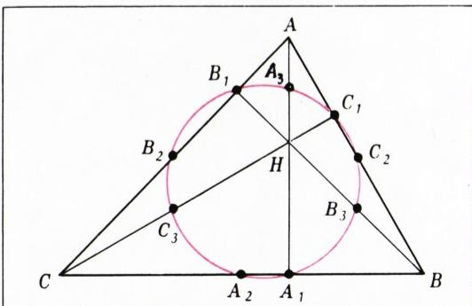
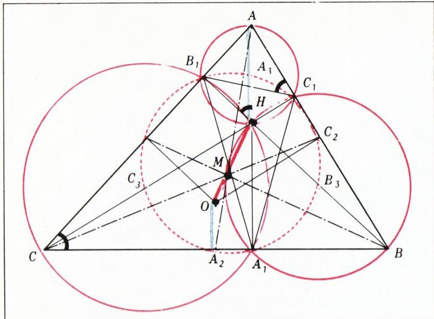
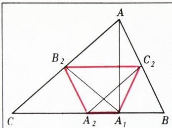
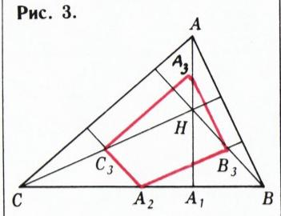
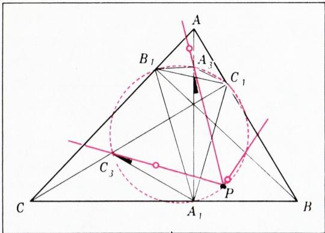
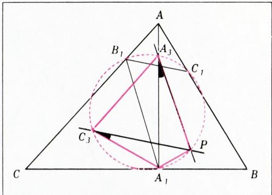
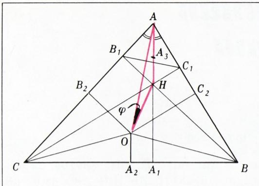

# 九点圆与欧拉线

> **原标题**：Окружность девяти точек и прямая Эйлера
> **作者**：И. Ф. Шарыгин（I. F. 沙雷金，1937—2004，俄罗斯数学教育家、几何学家）；А. Ягубьянц（A. 雅古比扬茨）
> **译自**：Квант 1981, № 8, с. 34–37
> **原文扫描**：https://www.kvant.digital/data/kvant_1981_8/jpg/0034.jpg
> **主题**：九点圆（欧拉圆）、欧拉线、垂心、位似、费尔巴哈定理
> **难度**：★★★（需要圆、相似三角形、正弦定理等基础知识；末尾难题涉及较深入的几何论证）
> **译者**：Claude（初译）／ 2026-06-24

---

## 九点圆

最简单的多边形——三角形——自古以来就吸引着几何学家们的注意。继欧几里得之后，阿波罗尼奥斯、海伦、梅涅劳斯和托勒密等古代杰出学者都曾为它证明过一些优美的定理。到了较近的时代，欧拉、彭赛列、西姆松、笛沙格、克莱因、阿达马等人也都醉心于三角形的研究。

如今，三角形已经略显「过时」，但它昔日的美丽丝毫未减。读者只要读完下文关于与三角形相关、并以莱昂哈德·欧拉的名字命名的那条圆和那条直线的介绍，便会深信这一点。而我们随后讨论的几道题目，则希望能让大家看到：围绕三角形，还有不少值得思考的东西。

我们从下面这条由欧拉于 1765 年发表的优美定理开始：

> **定理。** 三角形的高线足、中线足，以及从垂心\*) 到三角形各顶点的线段的中点，这三组点（共九点）共圆。

这个圆称为**九点圆**，也称**欧拉圆**（图 1）。

在给出这条定理的证明之前，我们先注意几个与三角形几何相关的简单而有用的结论（建议读者自行加以证明）。

设 $O$ 是三角形 $ABC$ 外接圆的圆心，$M$ 是其三条中线的交点（其余记号见图 1）。

(1) 点 $A_{3}$、$B_{3}$、$C_{3}$ 分别是三角形 $AB_{1}C_{1}$、$A_{1}BC_{1}$、$A_{1}B_{1}C$ 的外接圆圆心。（提示：$AH$、$BH$、$CH$ 是这些圆的直径——见图 2。）

(2) 三角形 $AB_{1}C_{1}$、$A_{1}BC_{1}$、$A_{1}B_{1}C$ 彼此相似，且都与原三角形 $ABC$ 相似。（提示：对应的顶点用同一字母标记；$\widehat{ABC}=\widehat{AHC_{1}}=\widehat{AB_{1}C_{1}}$。）

(3) 设 $A$、$B$、$C$ 是三角形 $ABC$ 的相应各角之大小。若这些角都是锐角，则三角形 $A_{1}B_{1}C_{1}$ 各角的大小分别为 $180^{\circ}-2A$、$180^{\circ}-2B$、$180^{\circ}-2C$；若（例如）$A>90^{\circ}$，则它们分别为 $2A-180^{\circ}$、$2B$、$2C$（图 2）。

(4) 点 $O$ 到三角形各边的距离，等于相应对顶点到垂心距离的一半：

$$
\left|A_{2}O\right|=\dfrac{1}{2}\left|AH\right|,\qquad \left|B_{2}O\right|=\dfrac{1}{2}\left|BH\right|,
$$

$$
\left|C_{2}O\right|=\dfrac{1}{2}\left|CH\right|.
$$

（提示：考虑一个各边分别过 $A$、$B$、$C$ 且分别平行于 $BC$、$AC$、$AB$ 的三角形。）

*图 1*

## 欧拉线

由结论 (4) 立刻可得：点 $O$、$M$、$H$ 共线，因为直线 $OH$ 与中线 $AA_{2}$ 相交的分点和点 $M$ 所分的中线 $AA_{2}$ 是同一个比值。这条直线称为三角形 $ABC$ 的**欧拉线**。容易看出

$$
|OM|=\dfrac{1}{2}|MH|.
$$

现在我们来证明：点 $A_{1}$、$B_{1}$、$C_{1}$、$A_{2}$、$B_{2}$、$C_{2}$、$A_{3}$、$B_{3}$、$C_{3}$ 共圆。我们只讨论 $ABC$ 为锐角三角形的情形。（钝角三角形的情形，请读者自行论证。）

首先注意到，点 $A_{1}$、$A_{2}$、$B_{2}$、$C_{2}$ 共圆（图 3），因为 $B_{2}A_{1}$ 和 $C_{2}A_{1}$ 分别是直角三角形 $AA_{1}C$ 和 $AA_{1}B$ 中由直角顶点引向斜边的中线，从而

$$
\widehat{B_{2}A_{1}C_{2}}=\widehat{B_{2}A_{1}A}+\widehat{AA_{1}C_{2}}=\widehat{A_{1}AB_{2}}+\widehat{A_{1}AC_{2}}=\widehat{A}=\widehat{B_{2}A_{2}C_{2}}.
$$

完全类似地可以证明：点 $B_{1}$、$A_{2}$、$B_{2}$、$C_{2}$ 共圆（点 $B_{1}$ 与点 $A_{1}$ 是「同一类」的点！），以及点 $C_{1}$、$A_{2}$、$B_{2}$、$C_{2}$ 共圆。于是六点 $A_{1}$、$B_{1}$、$C_{1}$、$A_{2}$、$B_{2}$、$C_{2}$ 共圆。另一方面，如果我们考虑（例如）四边形 $A_{3}B_{3}A_{2}C_{3}$（图 4），并把它的某两个对角用 $A$、$B$、$C$ 表出（这并不难做到），就会看到这两个对角之和等于 $180^{\circ}$；由此可知四边形 $A_{3}B_{3}A_{2}C_{3}$ 是圆内接四边形。于是六点 $A_{3}$、$B_{3}$、$C_{3}$、$A_{2}$、$B_{2}$、$C_{2}$ 也共圆。从而全部九点 $A_{1}$、$B_{1}$、$C_{1}$、$A_{2}$、$B_{2}$、$C_{2}$、$A_{3}$、$B_{3}$、$C_{3}$ 共圆（点 $A_{2}$、$B_{2}$、$C_{2}$ 同时属于上述两个六点组）。欧拉定理证毕。

*图 2*

*图 3*

*图 4*

## 欧拉线与九点圆的性质

(5) 九点圆的半径，等于三角形 $ABC$ 外接圆半径的一半。

(6) 九点圆与三角形 $ABC$ 的外接圆关于位似中心 $H$、位似系数 $\dfrac{1}{2}$ 位似（三角形 $ABC$ 与 $A_{3}B_{3}C_{3}$ 正是如此彼此相关的）。

(7) 这两个圆也彼此位似，但位似系数是 $\left(-\dfrac{1}{2}\right)$，位似中心在点 $M$（三角形 $ABC$ 与 $A_{2}B_{2}C_{2}$ 正是如此彼此相关的）。

(8) 九点圆的圆心位于欧拉线上、线段 $OH$ 的中点处。

## 一道难题

围绕九点圆和欧拉线，人们编拟了许多有趣的题目。下面就是其中一道，刊载于《American Mathematical Monthly 杂志精选题集》（莫斯科学「Мир」出版社，1977）一书中：

> **题。** 给定三角形 $ABC$；$AA_{1}$、$BB_{1}$、$CC_{1}$ 是它的高。求证：三角形 $AB_{1}C_{1}$、$A_{1}BC_{1}$、$A_{1}B_{1}C$ 的欧拉线交于三角形 $ABC$ 的九点圆上的一点 $P$，且线段 $PA_{1}$、$PB_{1}$、$PC_{1}$ 中必有一个等于另外两个之和（图 5）。

仍如前，设 $H$ 是三角形 $ABC$ 的垂心，$A_{3}$、$B_{3}$、$C_{3}$ 是线段 $AH$、$BH$、$CH$ 的中点（前面已经指出，它们分别是以相似三角形 $AB_{1}C_{1}$、$A_{1}BC_{1}$、$A_{1}B_{1}C$ 为三角形的外接圆圆心）。

我们先证明一个辅助结论。如果过 $A_{3}$、$B_{3}$、$C_{3}$ 各作一条直线，使它们关于三角形 $AB_{1}C_{1}$、$A_{1}BC_{1}$、$A_{1}B_{1}C$ 具有相同的「位置」\*)，那么这三条直线在三角形 $ABC$ 的九点圆上相交。设 $P$ 是其中两条——例如过 $A_{3}$ 和 $C_{3}$ 的那两条——的交点（图 6）。由于直线 $A_{3}P$ 与 $C_{3}P$ 关于三角形 $AB_{1}C_{1}$ 与 $A_{1}B_{1}C$ 具有相同的位置，故 $\widehat{A_{1}A_{3}P}=\widehat{A_{1}C_{3}P}$。因此过点 $P$、$A_{1}$、$C_{3}$ 的圆必过点 $A_{3}$。但这个圆恰是三角形 $ABC$ 的九点圆！这样，所作三条直线中任意两条的交点都落在三角形 $ABC$ 的九点圆上，由此不难推出三条直线共点。

为完成证明，现设 $P$ 是这三条欧拉线的交点。容易看出（请验证！），数 $|PA_{1}|$、$|PB_{1}|$、$|PC_{1}|$ 与角 $PA_{3}A_{1}$、$PA_{3}B_{1}$、$PA_{3}C_{1}$ 的正弦成正比。记 $\widehat{PA_{3}A_{1}}=\varphi$。

*图 5*

设 $ABC$ 是锐角三角形。利用性质 (3) 和图 5，可得

$$
\begin{aligned}
\widehat{PA_{3}B_{1}} &= \varphi+\widehat{A_{1}A_{3}B_{1}}=\varphi+\widehat{A_{1}C_{1}B_{1}}\\
&= \varphi+180^{\circ}-2C,\\[4pt]
\widehat{PA_{3}C_{1}} &= \widehat{A_{1}A_{3}C_{1}}-\varphi=\widehat{A_{1}B_{1}C_{1}}-\varphi\\
&= 180^{\circ}-2B-\varphi.
\end{aligned}
$$

*图 6*

于是，我们只需证明，下列三个数

$$
\sin\varphi,\qquad \sin(2C-\varphi),\qquad \sin(2B+\varphi)
$$

之中必有一个（在本情形中即第二个）等于另外两个之和。

考虑三角形 $AOH$（图 7）。由于 $\triangle ABC\sim\triangle AB_{1}C_{1}$，且点 $O$、$A_{3}$ 分别是以这两个三角形为三角形的外接圆圆心，故 $\widehat{AOH}=\varphi$，又 $\widehat{OAC}=\widehat{HAB}=90^{\circ}-B$。从而

$$
\widehat{OAH}=\widehat{A}-\widehat{OAC}=\widehat{A_{1}AB}=A-(90^{\circ}-B)-(90^{\circ}-B)=2B+A-180^{\circ},
$$

进而

$$
\sin\widehat{OHA}=\sin(360^{\circ}-2B-A-\varphi)=-\sin(2B+A+\varphi).
$$

若 $R$ 是三角形 $ABC$ 外接圆的半径，则 $|OA|=R$；由性质 (4) 及等式 $\widehat{A_{2}OB}=\dfrac{1}{2}\widehat{AOB}=A$，得

$$
\left|AH\right|=2\left|OA_{2}\right|=2R\cos A.
$$

对三角形 $OAH$ 应用正弦定理，得

$$
\dfrac{R}{-\sin(2B+A+\varphi)}=\dfrac{2R\cos A}{\sin\varphi},
$$

即

$$
\begin{aligned}
-\sin\varphi &= \sin(2A+2B+\varphi)+\sin(2B+\varphi),\\
-\sin\varphi &= -\sin(2C-\varphi)+\sin(2B+\varphi),\\
\sin(2C-\varphi) &= \sin\varphi+\sin(2B+\varphi).
\end{aligned}
$$

请读者自行尝试在 $ABC$ 为钝角三角形时完成证明。

最后，我们不加证明地给出一个与九点圆有关的优美事实：

> **费尔巴哈定理。** 九点圆与三角形的内切圆及三个旁切圆\*) 都相切。

*图 7*

据我们所知，这条定理的所有已知证明都相当繁琐，本质上纯属计算性的。或许，读者你能为费尔巴哈定理找到一个漂亮的几何证明。

想进一步了解三角形几何的读者，我们推荐以下两本书：

- С. И. Зетель，《三角形的新几何》（С. И. 泽特尔，《Новая геометрия треугольника》，莫斯科，Учпедгиз出版社，1962）。

\*) **旁切圆**是指与三角形的一条边及另外两条边的延长线相切的圆。

- С. М. Коксетер、С. Л. Грейтцер，《几何的新相遇》（С. М. 考克斯特、С. Л. 格雷策，《Новые встречи с геометрией》，莫斯科，Мир出版社，1978）。

## 习题

1. 设 $H$ 是三角形 $ABC$ 的垂心。求证：三角形 $ABC$、$ABH$、$BCH$、$CAH$ 有同一个九点圆。

2. 设 $K$ 是三角形某条边的中点，$H$ 是垂心，$L$ 是直线 $HK$ 与三角形外接圆的交点（$K$ 介于 $H$ 与 $L$ 之间）。求证 $|HK|=|KL|$。

3. 设 $P$ 是三角形某条高线的垂足，$M$ 是中线的交点，$N$ 是直线 $MP$ 与外接圆的交点（$M$ 介于 $P$ 与 $N$ 之间）。求证 $2|PM|=|MN|$。

4. 求证：由外接圆上任一点向三角形各边（或其延长线）所作垂线的垂足共线。这条直线称为**西姆松线**。再证：与一条直径的两个端点相对应的两条西姆松线互相垂直，且它们的交点落在九点圆上。

5. 在三角形 $ABC$ 内给定一点 $M$。求证：三角形 $AMB$、$BMC$、$CMA$ 的欧拉线共点，如果

   а) $M$ 是三角形 $ABC$ 的垂心；

   б) $M$ 是这样一个点：从它看三角形的每一边所张的角都是 $120^{\circ}$（设三角形各角均小于 $120^{\circ}$）。

6. 设 $L$ 是三角形 $ABC$ 所在平面上满足

$$
|AL|:|BL|:|CL|=|BC|:|CA|:|AB|
$$

的点。求证 $L$ 在三角形 $ABC$ 的欧拉线上。

---

## 译者注与校对说明

1. **OCR 校正**：本文由 MinerU 对扫描页（p34—p37）做俄文 OCR 后翻译。已据扫描页校正若干 OCR 错误：
   - 性质 (4) 中 $|C_{2}O|$ 一式原 OCR 误作带奇怪间隔的 $\mid C\ \_{2}\ O\mid$，已整理为标准 $\left|C_{2}O\right|$；
   - 角度公式中 $180^{\circ}$ 的 OCR 数字间存在多余空格（如 `1 8 0 ^ {\circ}`），已统一为 $180^{\circ}$；
   - 难题证明中 $A_{2}\widehat{OB}=\dfrac{1}{2}\widehat{OB}$ 一处，据上下文（外心角与圆周角关系）应为 $\widehat{A_{2}OB}=\dfrac{1}{2}\widehat{AOB}=A$，原文印刷亦有省略，已补全为 $\widehat{A_{2}OB}=\dfrac{1}{2}\widehat{AOB}=A$；
   - 习题 1 中原 OCR 把「ортоцентр」（垂心）误识为「отроцентр」，已校正；
   - 图 3（原图无独立标题，位于 p35 上部）在 `ru.md` 中与图 4 的标题混排，已据 `meta.json` 拆分为独立的 fig_p35_02.png（图 3）与 fig_p35_03.png（图 4）。
2. **术语**：遵照《01_工作规范.md》对照表，окружность 译「圆」，треугольник 译「三角形」，ортотцентр 译「垂心」，гомотетия 译「位似」，инверсия 译「反演」，прямая Эйлера 译「欧拉线」，окружность девяти точек / окружность Эйлера 译「九点圆／欧拉圆」（二者同义），вневписанная окружность 译「旁切圆」，вписанная окружность 译「内切圆」，теорема Фейербаха 译「费尔巴哈定理」。
3. **图表**：原文共 7 幅插图（图 1—7），由 MinerU 从整页扫描中自动裁出，存于 `images/1981_08_sharygin_B08/fig_pXX_NN.png`。其中图 1（p34）、图 2、图 3、图 4（p35）、图 5、图 6（p36）、图 7（p37）按 `meta.json` 的 `std_name` 字段对应嵌入。图 3（fig_p35_02）在 OCR 原文中无独立图注，与图 4 混排于 p35 上部，译文据 `meta.json` 拆分为独立的图 3 与图 4。
4. **作者署名**：原文署名「И. Шарыгин, А. Ягубьянц」。沙雷金（Игорь Фёдорович Шарыгин，1937—2004）是俄罗斯著名数学教育家、几何学家，著有《几何》《图形与对称》等多种教材与习题集，对苏联及俄罗斯中学几何教育影响深远。

## 建议讨论题

1. 九点圆上九个点分为三组（高线足、中线足、垂心—顶点连线中点），它们的「来源」各不相同，却恰好共圆。试想：为什么恰好是这九个点？你能从位似（性质 6、7）的角度直观地理解这一点吗？
2. 性质 (6)、(7) 给出了九点圆与外接圆的两个位似（系数 $\tfrac12$ 与 $-\tfrac12$，中心分别是 $H$ 与 $M$）。这两个位似中心的「中点」是否正好是九点圆心（性质 8）？由此能否看出欧拉线上 $O$、$M$、$N$（九点圆心）、$H$ 四点的精确位置关系？
3. 难题的结论「$PA_1$、$PB_1$、$PC_1$ 中必有一个等于另外两个之和」令人联想到托勒密定理（圆内接四边形对边乘积之和等于对角线乘积）。二者之间是否有联系？试探讨之。
4. 费尔巴哈定理说九点圆与内切圆及三个旁切圆都相切。习题 1 告诉我们，三角形及其三个「垂心三角形」共用一个九点圆——这与费尔巴哈定理中「一个内切、三个旁切」的格局有无某种对偶？

---

> **版权说明**：原文版权归 MCCME（莫斯科连续数学教育中心）及作者继承者所有。本译文为非商业、自用、数学圈内部参考，未获授权不得公开分发。原文扫描见 [kvant.digital](https://www.kvant.digital/data/kvant_1981_8/jpg/0034.jpg)。

> **复用说明**：本译文的俄文 OCR 原文与所有插图均存档于 `ocr/1981_08_sharygin_B08/`（`ru.md` 为合并 OCR 文本，`meta.json` 为图映射）。如对译文质量不满意，可直接基于 `ru.md` 重译，无需重跑 OCR。
