# 塞瓦与梅涅劳斯定理

> **原标题**：ТЕОРЕМЫ ЧЕВЫ И МЕНЕЛАЯ（塞瓦与梅涅劳斯定理）
> **作者**：И. Ф. Шарыгин（I. F. 沙雷金，1937—2004，苏联／俄罗斯数学教育家、几何学家，长期主持全苏／全俄数学奥林匹克）
> **译自**：Квант 1976, № 11, с. 22–30
> **原文扫描**：https://www.kvant.digital/data/kvant_1976_11/jpg/0022.jpg
> **主题**：塞瓦定理与梅涅劳斯定理（共点、共线判据及其对偶）
> **难度**：★★★（向量、有向比、三角形式；属竞赛／大学层面）
> **译者**：Claude（初译）／ 2026-06-24

---

## 引言

几何是从三角形开始的。随便翻开一本中学几何教科书，你就会看到，最初那些有实质内容的定理，恰恰都是关于三角形的。在此之前的一切，只不过是公理、定义，或是它们的最简单推论。在平面几何萌芽的岁月里，它实质上就是一门「三角形几何」。

「三角形几何」可以引以为豪地拥有冠以欧拉（Euler）、托里拆利（Torricelli）、莱布尼茨（Leibniz）之名的定理。在十九、二十世纪之交，由于大批专门研究三角形的著作问世，平面几何中甚至形成了一整个分支，被称为「新三角形几何」。这些著作中，许多在今天看来已乏善可陈、不够完善；其中使用的术语也多半被人遗忘，只在百科全书里才能觅得踪迹。然而，「新几何」中的某些定理至今仍葆有生命力。本文要讲的，正是这样的两条定理——塞瓦定理与梅涅劳斯定理\*）。

塞瓦定理和梅涅劳斯定理可以说是一对「对偶」定理：它们的表述彼此相像（而且每条定理都仿佛以两副面孔出现），证明也相仿；在解题时它们常常可以互换使用。每当需要「理清」点与直线之间的关系——例如证明某三条直线交于一点、某三点共线等等——塞瓦定理和梅涅劳斯定理便显得格外有用。

\*) 有意更深入了解三角形几何的读者，我们推荐 С. И. 泽捷利（Зетель）的《新三角形几何》（莫斯科，Учпедгиз，1962）一书。

关于三角形的中线、高、角平分线，你又知道些什么呢？想必你们每个人，只要略作思索，都能证明例如三角形的角平分线交于一点、高也交于一点、中线也交于一点（关于角平分线和中线的定理，当然都收在中学几何教科书里）……然而，这些定理的证明并不那么简单。原来，只要掌握了……塞瓦定理，上述任何一条结论都很容易推出。

## 记号与定理的叙述

我们需要用到向量；我们照例这样记它们：要么是顶上带箭头的小写拉丁字母 $a, b, a_{1}, \ldots$，要么是顶上带箭头的两个大写字母 $AB, AA_{1}$ 等等。我们把两个向量 $a$ 与 $b$ 之间的角 $\nrightarrow(a, b)$，理解为要把向量 $a$ 沿正向（逆时针方向）旋转到与向量 $b$ 同向所扫过的那个角（图 1）。为确定起见，设 $0 \leqslant \nrightarrow(a, b) < 2\pi$\*）。由这个定义以及函数 $y = \sin x$ 的性质立即可得

$$
\sin \angle(\vec{a}, \vec{b}) = - \sin \angle(\vec{b}, \vec{a}).
$$

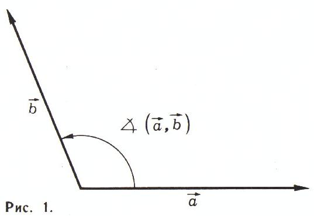

*图 1：两个向量间的有向角*

\*) 此处原文即作 $0 \leqslant \nrightarrow(a,b) < 2\pi$。

考虑两个三角形：$ABC$（记它为 $\Delta$）和 $A_{1}B_{1}C_{1}$，其中 $A_{1}$、$B_{1}$、$C_{1}$ 分别位于直线 $BC$、$AC$、$AB$ 上；把三角形 $A_{1}B_{1}C_{1}$ 记作 $\Delta_{1}$。容易看出，向量 $\overrightarrow{AC_{1}}$ 与 $\overrightarrow{C_{1}B}$ 共线；同样，向量 $\overrightarrow{BA_{1}}$、$\overrightarrow{A_{1}C}$ 以及 $\overrightarrow{CB_{1}}$、$\overrightarrow{B_{1}A}$ 也分别共线。对于共线向量 $\overrightarrow{AB}$ 与 $\overrightarrow{CD}$，我们引入量 $\left\{\dfrac{\overrightarrow{AB}}{\overrightarrow{CD}}\right\}$，它等于这两个向量长度之比，当 $\overrightarrow{AB}$ 与 $\overrightarrow{CD}$ 同向时取「$+$」号，反向时取「$-$」号。现在对三角形 $\Delta$ 与 $\Delta_{1}$ 定义量 $R(\Delta, \Delta_{1})$：

$$
R (\Delta, \Delta_{1}) = \left\{\frac{\overrightarrow{AC_{1}}}{\overrightarrow{C_{1}B}}\right\} \cdot \left\{\frac{\overrightarrow{BA_{1}}}{\overrightarrow{A_{1}C}}\right\} \cdot \left\{\frac{\overrightarrow{CB_{1}}}{\overrightarrow{B_{1}A}}\right\}.\tag{1}
$$

进一步设 $\omega$ 是与向量 $\overrightarrow{BC}$、$\overrightarrow{AC}$、$\overrightarrow{AB}$（即三角形 $ABC$ 的三边）共线的三个向量 $\vec{a}, \vec{b}, \vec{c}$ 所成的三元组；$\omega_{1}$ 是与向量 $\overrightarrow{AA_{1}}$、$\overrightarrow{BB_{1}}$、$\overrightarrow{CC_{1}}$ 共线的三个向量 $\vec{a}_{1}, \vec{b}_{1}, \vec{c}_{1}$ 所成的三元组。对 $\omega$ 与 $\omega_{1}$ 定义量 $R^{*}(\omega, \omega_{1})$：

$$
R^{*}(\omega, \omega_{1}) = \frac{\sin \nrightarrow(\vec{b}, \vec{c}_{1})}{\sin \nrightarrow(\vec{a}, \vec{c}_{1})} \cdot \frac{\sin \nrightarrow(\vec{c}, \vec{a}_{1})}{\sin \nrightarrow(\vec{b}, \vec{a}_{1})} \cdot \frac{\sin \nrightarrow(\vec{a}, \vec{b}_{1})}{\sin \nrightarrow(\vec{c}, \vec{b}_{1})}.\tag{2}
$$

**引理。**

$$
R(\Delta, \Delta_{1}) = R^{*}(\omega, \omega_{1}).\tag{3}
$$

**证明。** 先验证 $R$ 与 $R^{*}$ 同号。容易看出，改变向量 $a, b, c, a_{1}, b_{1}, c_{1}$ 中任一个的方向都不会改变 $R^{*}(\omega, \omega_{1})$ 的值，因此可以任意地为每一个定向；例如，不妨设向量 $a, b, c, a_{1}, b_{1}, c_{1}$ 分别与向量 $\overrightarrow{BC}$、$\overrightarrow{CA}$、$\overrightarrow{AB}$、$\overrightarrow{AA_{1}}$、$\overrightarrow{BB_{1}}$、$\overrightarrow{CC_{1}}$ 同向（图 2）。在此情形下，组成 $R(\Delta, \Delta_{1})$ 的三个比式中每一个，都与组成 $R^{*}(\omega, \omega_{1})$ 的相应比式同号。例如，比式

$$
\left\{\frac{\overrightarrow{AC_{1}}}{\overrightarrow{C_{1}B}}\right\} \quad \text{与} \quad \frac{\sin \nrightarrow(\vec{b}, \vec{c}_{1})}{\sin \nrightarrow(\vec{a}, \vec{c}_{1})}
$$

当点 $C_{1}$ 位于 $A$、$B$ 两点之间时同为正，否则同为负（图 3 与图 2）。

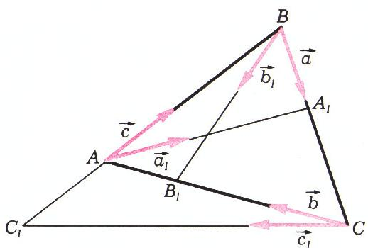

*图 2*

余下只需证 $|R(\Delta, \Delta_{1})| = |R^{*}(\omega, \omega_{1})|$。我们有

$$
\left|\left\{\frac{\overrightarrow{AC_{1}}}{\overrightarrow{C_{1}B}}\right\}\right| = \frac{S_{\triangle ACC_{1}}}{S_{\triangle BCC_{1}}} = \frac{\tfrac{1}{2}|AC|\cdot|CC_{1}|\cdot|\sin \nrightarrow(b, c_{1})|}{\tfrac{1}{2}|BC|\cdot|CC_{1}|\cdot|\sin \nrightarrow(a, c_{1})|} = \frac{|AC|}{|BC|}\cdot\frac{|\sin \nrightarrow(b, c_{1})|}{|\sin \nrightarrow(a, c_{1})|},
$$

$$
\left|\left\{\frac{\overrightarrow{BA_{1}}}{\overrightarrow{A_{1}C}}\right\}\right| = \frac{|AB|}{|AC|}\cdot\frac{|\sin \nrightarrow(c, a_{1})|}{|\sin \nrightarrow(b, a_{1})|},
$$

$$
\left|\left\{\frac{\overrightarrow{CB_{1}}}{\overrightarrow{B_{1}A}}\right\}\right| = \frac{|BC|}{|AB|}\cdot\frac{|\sin \nrightarrow(a, \vec{b}_{1})|}{|\sin \nrightarrow(c, \vec{b}_{1})|}.
$$

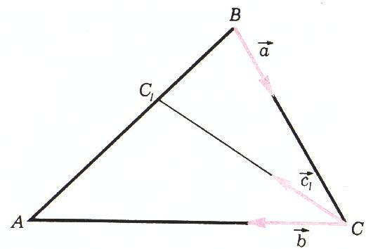

*图 3*

把这三个等式相乘，便得 $|R(\Delta, \Delta_{1})| = |R^{*}(\omega, \omega_{1})|$。引理证毕。

今后我们还要用到一条直接由 $R^{*}(\omega, \omega_{1})$ 的定义推出的等式：

$$
R^{*}(\omega, \omega_{1}) = \frac{1}{R^{*}(\omega_{1}, \omega)}.\tag{4}
$$

现在我们叙述塞瓦定理与梅涅劳斯定理。

**塞瓦定理。** 直线 $AA_{1}$、$BB_{1}$、$CC_{1}$ 共点的充分必要条件是

$$
R(\Delta, \Delta_{1}) = 1,\tag{5}
$$

或与之等价的

$$
R^{*}(\omega, \omega_{1}) = 1.\tag{5'}
$$

**梅涅劳斯定理。** 点 $A_{1}$、$B_{1}$、$C_{1}$ 共线的充分必要条件是

$$
R(\Delta, \Delta_{1}) = -1,\tag{6}
$$

或与之等价的

$$
R^{*}(\omega, \omega_{1}) = -1.\tag{6'}
$$

## 塞瓦定理的证明

**必要性。** 设直线 $AA_{1}, BB_{1}, CC_{1}$ 交于一点。要证条件 (5) 与 (5') 成立。

注意：若 $AA_{1}$、$BB_{1}$、$CC_{1}$ 交于一点，则要么 $A_{1}$、$B_{1}$、$C_{1}$ 三点全在三角形 $ABC$ 的边上，要么其中一点在某条边上、另两点在相应边的延长线上。前一种情形下，$R(\Delta, \Delta_{1})$ 中三个比式全为正；后一种情形下，三个比式中一个为正、两个为负，于是 $R(\Delta, \Delta_{1})$（从而由引理，$R^{*}(\omega, \omega_{1})$ 也）仍大于零。下面证明 $|R^{*}(\omega, \omega_{1})| = 1$（既然 $R^{*}(\omega, \omega_{1}) > 0$，由此即得 $R^{*}(\omega, \omega_{1}) = 1$）。记 $AA_{1}$、$BB_{1}$、$CC_{1}$ 的公共点为 $D$（图 4а）。用正弦定理得

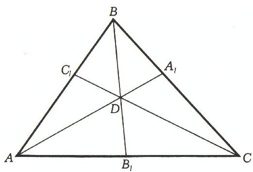

*图 4а*

$$
\frac{|\sin \nrightarrow(\vec{b}, \vec{c}_{1})|}{|\sin \nrightarrow(\vec{b}, \vec{a}_{1})|} = \frac{|DA|}{|DC|},
$$

$$
\frac{|\sin \nrightarrow(\vec{c}, \vec{a}_{1})|}{|\sin \nrightarrow(\vec{c}, \vec{b}_{1})|} = \frac{|DB|}{|DA|},
$$

$$
\frac{|\sin \nrightarrow(\vec{a}, \vec{b}_{1})|}{|\sin \nrightarrow(\vec{a}, \vec{c}_{1})|} = \frac{|DC|}{|DB|}.
$$

把这三式相乘，可见 $|R^{*}(\omega, \omega_{1})| = 1$。必要性证毕。

**充分性。** 用反证法证充分性。设 $R(\Delta, \Delta_{1})\;(= R^{*}(\omega, \omega_{1})) = 1$，但直线 $AA_{1}, BB_{1}, CC_{1}$ 不共点（图 4б）。记 $AA_{1}$ 与 $BB_{1}$ 的交点为 $D_{1}$，又记直线 $AB$ 与 $CD_{1}$ 的交点为 $C_{1}'$。既然 $AA_{1}$、$BB_{1}$、$CD_{1}$ 共点于 $D_{1}$，由已证的必要性有

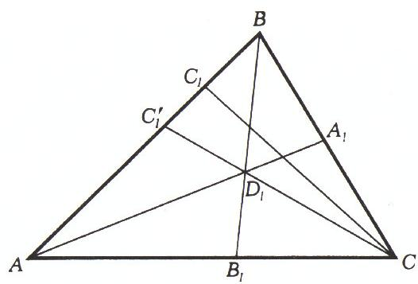

*图 4б*

$$
\left\{\frac{\overrightarrow{AC_{1}'}}{\overrightarrow{C_{1}'B}}\right\}\cdot\left\{\frac{\overrightarrow{BA_{1}}}{\overrightarrow{A_{1}C}}\right\}\cdot\left\{\frac{\overrightarrow{CB_{1}}}{\overrightarrow{B_{1}A}}\right\} = 1.
$$

而由假设

$$
\left\{\frac{\overrightarrow{AC_{1}}}{\overrightarrow{C_{1}B}}\right\}\cdot\left\{\frac{\overrightarrow{BA_{1}}}{\overrightarrow{A_{1}C}}\right\}\cdot\left\{\frac{\overrightarrow{CB_{1}}}{\overrightarrow{B_{1}A}}\right\} = 1,
$$

从而 $\left\{\dfrac{\overrightarrow{AC_{1}'}}{\overrightarrow{C_{1}'B}}\right\} = \left\{\dfrac{\overrightarrow{AC_{1}}}{\overrightarrow{C_{1}B}}\right\}$。由于点 $C_{1}$ 与 $C_{1}'$ 都在直线 $AB$ 上，由此可知它们重合。塞瓦定理证毕。

## 梅涅劳斯定理的证明

**必要性。** 已知 $A_{1}$、$B_{1}$、$C_{1}$ 三点共线。要证 (6) 与 (6')。

再次注意：若 $A_{1}$、$B_{1}$、$C_{1}$ 共线，则要么三点全在三角形 $ABC$ 的边 $BC$、$AC$、$AB$ 的延长线上，要么其中两点在各自的边上、第三点在延长线上。两种情形下 $R(\Delta, \Delta_{1})$ 都为负（请自行验证）。下面证明：当 $A_{1}, B_{1}, C_{1}$ 共线时 $|R(\Delta, \Delta_{1})| = 1$（既然 $R(\Delta, \Delta_{1}) < 0$，由此即得 $R(\Delta, \Delta_{1}) = -1$）。

过点 $B$ 作平行于 $AC$ 的直线，记它与直线 $B_{1}A_{1}C_{1}$ 的交点为 $D$（图 5）。

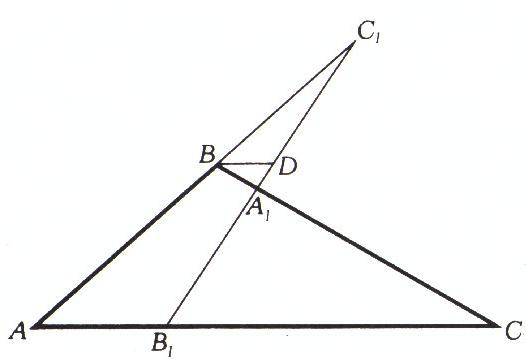

*图 5*

利用相似，易得

$$
\left\{\frac{\overrightarrow{CA_{1}}}{\overrightarrow{A_{1}B}}\right\} = \frac{|B_{1}C|}{|BD|},\qquad \left\{\frac{\overrightarrow{BC_{1}}}{\overrightarrow{C_{1}A}}\right\} = \frac{|BD|}{|AB_{1}|}.
$$

再补上显然的等式 $\dfrac{|\overrightarrow{AB_{1}}|}{|\overrightarrow{B_{1}C}|} = \dfrac{|AB_{1}|}{|B_{1}C|}$，将三式相乘，便得 $|R(\Delta, \Delta_{1})| = 1$。梅涅劳斯定理的必要性证毕。

梅涅劳斯定理中条件 (6)、(6') 的充分性证明，与塞瓦定理中条件 (5)、(5') 的充分性证明相仿。

## 若干推论

在塞瓦定理与梅涅劳斯定理的叙述中同时引入两个等价条件——(5) 与 (5')、(6) 与 (6')——并不只是为了便于证明这两条定理。有些题目用其中一组条件方便，有些用另一组方便。请你自己试着证明下面这条命题来体会这一点。

**命题 1。** 若过三角形三个顶点的三条直线交于一点，则它们关于相应角平分线的对称直线也交于一点。又若这三条直线与对边相交所得三点共线，则它们关于相应角平分线的对称直线与对边相交所得三点也共线。

回忆等式 (4)，便容易证明

**命题 2。** 若过三角形 $ABC$ 三个顶点 $A, B, C$、分别平行于三角形 $A_{1}B_{1}C_{1}$ 的边 $B_{1}C_{1}, A_{1}C_{1}, A_{1}B_{1}$ 的三条直线交于一点，则过三角形 $A_{1}B_{1}C_{1}$ 三个顶点 $A_{1}, B_{1}, C_{1}$、分别平行于三角形 $ABC$ 的边 $BC, AC, AB$ 的三条直线也交于一点。又若前三条直线与三角形 $ABC$ 对应边的三个交点共线，则后三条直线（过 $A_{1}B_{1}C_{1}$ 各顶点、分别平行于 $BC, AC, AB$）的情形也相同（图 6、7）。

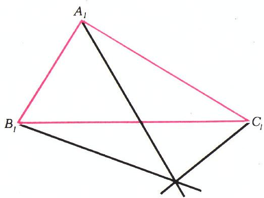

*图 6*

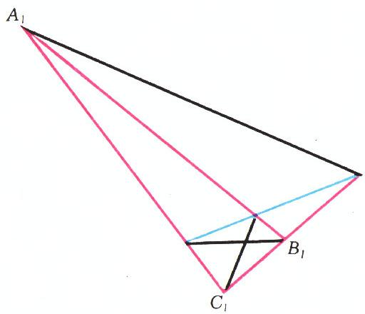

*图 7*

请你也自行证明

**命题 3。** 若过三角形 $ABC$ 三个顶点 $A, B, C$、分别垂直于三角形 $A_{1}B_{1}C_{1}$ 的边 $B_{1}C_{1}, A_{1}C_{1}, A_{1}B_{1}$ 的三条直线交于一点，则由三角形 $A_{1}B_{1}C_{1}$ 三个顶点 $A_{1}, B_{1}, C_{1}$ 向直线 $BC, AC, AB$ 所作的三条垂线也交于一点。又若第一组三条直线与三角形 $ABC$ 对应边的三个交点共线，则过三角形 $A_{1}B_{1}C_{1}$ 各顶点、分别垂直于三角形 $ABC$ 各边的三条直线，与三角形 $A_{1}B_{1}C_{1}$ 对应边的三个交点也共线（图 8、9）。

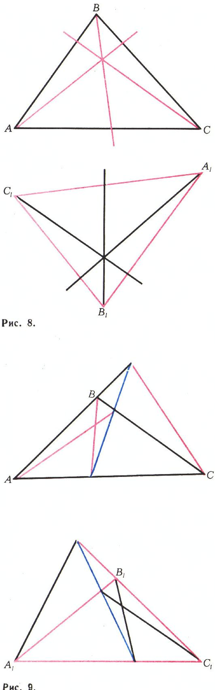

*图 8、9*

下面再举两个应用塞瓦定理与梅涅劳斯定理的例子。

**命题 4（帕斯卡定理）。** 设 $A_{1}, A_{2}, A_{3}, A_{4}, A_{5}, A_{6}$ 是同一圆上的六个点。则直线 $A_{1}A_{2}$ 与 $A_{4}A_{5}$、$A_{2}A_{3}$ 与 $A_{5}A_{6}$、$A_{3}A_{4}$ 与 $A_{6}A_{1}$ 的三个交点共线。

**证明。** 把题中所述三个交点分别记作 $K, L, M$。不妨设直线 $A_{1}A_{2}$、$A_{3}A_{4}$、$A_{5}A_{6}$ 不共点；于是它们围成一个三角形——记作 $ABC$，其中 $A$ 是 $A_{1}A_{2}$ 与 $A_{5}A_{6}$ 的交点，$B$ 是 $A_{1}A_{2}$ 与 $A_{4}A_{3}$ 的交点，$C$ 是 $A_{3}A_{4}$ 与 $A_{5}A_{6}$ 的交点。

列出下表：

|  |  |  |  |  |
|---|---|---|---|---|
| $A$ | $K$ | $A_{1}$ | $A_{2}$ | $B$ |
| $B$ | $A_{4}$ | $M$ | $A_{3}$ | $C$ |
| $C$ | $A_{5}$ | $A_{6}$ | $L$ | $A$ |

表中同一行、同一列的字母所对应的点共线。

既然点 $K, A_{4}, A_{5}$ 分别位于三角形 $ABC$ 的边 $AB, BC, CA$ 上且共线，应满足条件 (6)，即

$$
\left\{\frac{\overrightarrow{AK}}{\overrightarrow{KB}}\right\}\cdot\left\{\frac{\overrightarrow{BA_{4}}}{\overrightarrow{A_{4}C}}\right\}\cdot\left\{\frac{\overrightarrow{CA_{5}}}{\overrightarrow{A_{5}A}}\right\} = -1.\tag{7}
$$

类似地，

$$
\left\{\frac{\overrightarrow{AA_{1}}}{\overrightarrow{A_{1}B}}\right\}\cdot\left\{\frac{\overrightarrow{BM}}{\overrightarrow{MC}}\right\}\cdot\left\{\frac{\overrightarrow{CA_{6}}}{\overrightarrow{A_{6}A}}\right\} = 1,\tag{8}
$$

$$
\left\{\frac{\overrightarrow{AA_{2}}}{\overrightarrow{A_{2}B}}\right\}\cdot\left\{\frac{\overrightarrow{BA_{3}}}{\overrightarrow{A_{3}C}}\right\}\cdot\left\{\frac{\overrightarrow{CL}}{\overrightarrow{LA}}\right\} = -1.\tag{9}
$$

因为 $A_{1}, A_{2}, A_{5}, A_{6}$ 四点共圆，而 $A$ 是 $A_{1}A_{2}$ 与 $A_{5}A_{6}$ 的交点，故 $|AA_{1}|\cdot|AA_{2}| = |AA_{5}|\cdot|AA_{6}|$。对共线向量 $AA_{i}$ 与 $AA_{j}$，引入量 $\{AA_{i}\cdot AA_{j}\}$，它等于两向量长度之积，当二者同向时取「$+$」号、反向时取「$-$」号。于是上式在新记号下可写为

$$
\{\overrightarrow{AA_{1}}\cdot\overrightarrow{AA_{2}}\} = \{\overrightarrow{AA_{5}}\cdot\overrightarrow{AA_{6}}\} = \{\overrightarrow{A_{5}A}\cdot\overrightarrow{A_{6}A}\}.
$$

类似地，

$$
\{\overrightarrow{BA_{4}}\cdot\overrightarrow{BA_{3}}\} = \{\overrightarrow{A_{1}B}\cdot\overrightarrow{A_{2}B}\},\tag{10}
$$

$$
\{\overrightarrow{CA_{5}}\cdot\overrightarrow{CA_{6}}\} = \{\overrightarrow{A_{4}C}\cdot\overrightarrow{A_{3}C}\}.\tag{11}
$$

把等式 (7)—(9) 相乘，并利用 (10)—(11)，以及（按定义成立的）例如

$$
\left\{\frac{\overrightarrow{BA_{4}}}{\overrightarrow{A_{4}C}}\right\}\cdot\left\{\frac{\overrightarrow{BA_{3}}}{\overrightarrow{A_{3}C}}\right\} = \frac{\{\overrightarrow{BA_{4}}\cdot\overrightarrow{BA_{3}}\}}{\{\overrightarrow{A_{4}C}\cdot\overrightarrow{A_{3}C}\}},\tag{12}
$$

便得 $\left\{\dfrac{\overrightarrow{AK}}{\overrightarrow{KB}}\right\}\cdot\left\{\dfrac{\overrightarrow{BM}}{\overrightarrow{MC}}\right\}\cdot\left\{\dfrac{\overrightarrow{CL}}{\overrightarrow{LA}}\right\} = -1$，由梅涅劳斯定理，这正说明 $K, L, M$ 三点共线。

至于直线 $A_{1}A_{2}$、$A_{3}A_{4}$、$A_{5}A_{6}$ 共点（从而不构成三角形 $ABC$）的情形，请自行讨论。

图 10—12 画出了点 $A_{1}, \ldots, A_{6}$ 的三种不同布局，当然这并未穷尽所有可能。

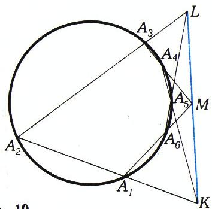

*图 10*

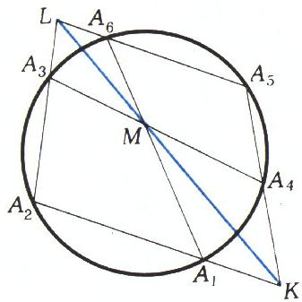

*图 11*

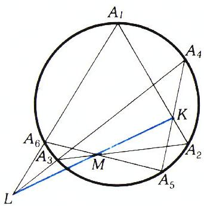

*图 12*

最后，再给一条推论。

**命题 5。** 由圆外一点 $A$ 作圆的两条切线 $AM, AN$ 及两条割线；设第一割线与圆相交于 $P, Q$，第二割线与圆相交于 $K, L$。则直线 $PK, QL, MN$ 共点。

**证明（图 13）。** 对三角形 $KLM$ 应用塞瓦定理。注意 $PK, QL, MN$ 共点当且仅当

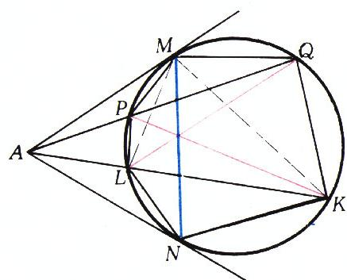

*图 13*

$$
\frac{\sin \widehat{LMN}}{\sin \widehat{NMK}}\cdot\frac{\sin \widehat{KLQ}}{\sin \widehat{QLM}}\cdot\frac{\sin \widehat{MKP}}{\sin \widehat{PKL}} = 1.\tag{13}
$$

上式中各角都是该圆的圆周角；这些角的正弦与它们所张弦的长成正比（例如 $\sin \widehat{LMN} = \dfrac{|LN|}{2R}$，其中 $R$ 为圆半径）。故等式 (13) 等价于

$$
\frac{|LN|}{|NK|}\cdot\frac{|KQ|}{|QM|}\cdot\frac{|MP|}{|PL|} = 1.\tag{13'}
$$

下面证 (13') 确实成立。由 $\triangle AMP \sim \triangle AMQ$ 得 $\dfrac{|PM|}{|MQ|} = \dfrac{|AM|}{|AQ|}$；由 $\triangle APL \sim \triangle AQK$ 得 $\dfrac{|KQ|}{|PL|} = \dfrac{|AQ|}{|AL|}$；最后由 $\triangle ALN \sim \triangle ANK$ 得 $\dfrac{|LN|}{|NK|} = \dfrac{|AL|}{|AM|}$。三式相乘即得 (13')。

**附注。** 由命题 5 可知，单用一根直尺，便可由圆外一点作出该圆的切线。作法见图 14。

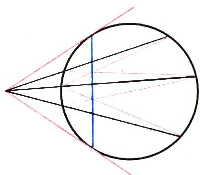

*图 14*

## 习题

1. 证明：а) 三角形外角的平分线与对边所在直线相交所得三点共线；б) 在三角形外接圆的各顶点处所作的切线，与对边所在直线相交所得三点共线。

2. 在三角形 $ABC$ 的边 $AB, BC, CA$ 上分别取点 $C_{1}, A_{1}, B_{1}$，使直线 $AA_{1}, BB_{1}, CC_{1}$ 共点。证明：若 $\widehat{CA_{1}B_{1}} = 90^{\circ}$，则 $A_{1}B_{1}$ 是角 $\widehat{AA_{1}C}$ 的平分线。

3. 证明：在三角形各角平分线的中点处所作的垂线，与对应角平分线所指向的边（或其延长线）相交所得三点共线。

4. 一圆与三角形 $ABC$ 的边 $AB$ 交于 $C_{1}, C_{2}$，与边 $BC$ 交于 $A_{1}, A_{2}$，与边 $CA$ 交于 $B_{1}, B_{2}$。证明：若直线 $AA_{1}, BB_{1}, CC_{1}$ 共点，则直线 $AA_{2}, BB_{2}, CC_{2}$ 也共点。

5. 给定三个互不相交的圆。对每一对圆，作出它们两条外公切线的交点与两条内公切线的交点。证明所得六个点位于三条直线上，每条直线上各三点。

6. 在三角形 $ABC$ 的边 $AB, BC, CA$ 上分别取点 $C_{1}, A_{1}, B_{1}$。设 $C_{2}$ 是直线 $AB$ 与 $A_{1}B_{1}$ 的交点，$A_{2}$ 是直线 $BC$ 与 $B_{1}C_{1}$ 的交点，$B_{2}$ 是直线 $AC$ 与 $A_{1}C_{1}$ 的交点。证明：若直线 $AA_{1}, BB_{1}, CC_{1}$ 共点，则点 $A_{2}, B_{2}, C_{2}$ 共线。

7. 一直线与三角形 $ABC$ 的边 $AB, BC$ 及边 $AC$ 的延长线分别相交于点 $D, E, F$。证明：线段 $DC, AE, BF$ 的中点共线。

8. 在凸四边形 $ABCD$ 中，$\widehat{ADB} = 26^{\circ}$，$\widehat{BCD} = 51^{\circ}$，$\widehat{BCA} = 13^{\circ}$，$\widehat{ACD} = 73^{\circ}$。求 $\widehat{ABD}$。

9. 在三角形 $ABC$ 的边 $AC$ 上取点 $K$，在中线 $BD$ 上取点 $P$，使 $\triangle BPC$ 的面积等于 $\triangle APK$ 的面积。求直线 $AP$ 与 $BK$ 交点的轨迹。

10. 给定三角形 $ABC$。按如下方式定义点 $A_{1}, B_{1}, C_{1}$：点 $A_{1}$ 是与三角形 $ABC$ 的边 $BA$ 和 $CA$ 都相切、且在边 $BC$ 上截出弦的圆在该边上所截弦的中点；类似地，$B_{1}$ 是与边 $AB$ 和 $CB$ 相切的圆在边 $AC$ 上截出弦的中点，$C_{1}$ 是与边 $AC$ 和 $BC$ 相切的圆在边 $AB$ 上截出弦的中点。三个圆落在三角形内部的那段弧所对的圆心角彼此相等。证明：直线 $AA_{1}, BB_{1}, CC_{1}$ 共点。

11. 在四面体 $ABCD$ 的棱 $AB, BC, CD, DA$ 上分别取点 $K, L, M, N$。证明：图形 $KLMN$ 为平面四边形的充分必要条件是

$$
|AK|\cdot|BL|\cdot|CM|\cdot|DN| = |BK|\cdot|CL|\cdot|DM|\cdot|AN|.
$$

12. 过四边形 $ABCD$ 的顶点 $A$ 和 $B$ 作一圆。直线 $AD$ 与 $BC$ 分别（再次）与该圆交于 $K$ 和 $L$，直线 $AC$ 与 $BD$ 分别（再次）与该圆交于 $M$ 和 $N$。证明：直线 $KL, MN, CD$ 共点或互相平行。

---

## 译者注与校对说明

1. **OCR 校正**：本文由 MinerU 对 1976 年 № 11 第 22–30 页扫描件做俄文 OCR 后翻译。已校正的主要 OCR 错误：
   - 公式中的记号 $\nrightarrow(a,b)$（有向角）在 OCR 中多处被误识为 $\vartriangleleft(a,b)$、$\Rightarrow(a,b)$、$\not\rightarrow(a,b)$、$\widehat{}$ 等，文中统一还原为 $\nrightarrow$；
   - (4) 式右端 OCR 误作 $\dfrac{1}{R^{*}(\omega_{1},\omega)}^{\,*}$，多余的右上星号已删；
   - 引理证明中面积比 $S_{\triangle ACC_{1}}/S_{\triangle BCC_{1}}$ 的 OCR 严重残缺（出现 `1/_2`、孤立花括号、`|AB|'` 等），已据三角形面积公式 $\tfrac12|AC|\cdot|CC_{1}|\cdot|\sin|$ 还原；
   - 第 27 页命题 4 中 OCR 把「$A_{6}A_{1}$」误作「$A_{8}A_{1}$」，已改为 $A_{6}A_{1}$；
   - 命题 4 表格（原为 HTML `<table>`）改写为 Markdown 表格，行／列含义不变；
   - 习题 11 的条件式 OCR 在等号后中断，已据四面体共面判据（空间塞瓦／梅涅劳斯）补全为 $|AK|\cdot|BL|\cdot|CM|\cdot|DN| = |BK|\cdot|CL|\cdot|DM|\cdot|AN|$；
   - 第 30 页文末混入下一篇《原子核是怎样构成的》（«Как устроено атомное ядро»）的开头，与本篇无关，已剔除；
   - 项目字母 а)/б)/в) 等已据规范保留俄文字母。
2. **图号与配图**：原文图号在版面上编排较乱（图 6、7、8、9 与图 10—14 的标号位置与正文引用顺序不完全一致），meta.json 中个别 `orig_caption` 亦有错位（如 fig_p29_04 实为图 13 却标作「Рис. 12」）。译文依据扫描页图像内容逐一比对后重新对应：fig_p23_01=图 1，fig_p24_01=图 2，fig_p24_02=图 3，fig_p25_01=图 4а，fig_p25_02=图 4б，fig_p26_01=图 5，fig_p27_02=图 6，fig_p27_04=图 7，fig_p28_01=图 8／9，fig_p29_01=图 10，fig_p29_02=图 11，fig_p29_03=图 12，fig_p29_04=图 13，fig_p29_05=图 14。p22 的整页装饰图（fig_p22_01）与 p27 两幅无图号辅助图（fig_p27_01、fig_p27_03）未单独引用。
3. **术语**：遵循《01_工作规范.md》对照表：теорема=定理、лемма=引理、доказательство=证明、следствие=推论、утверждение=命题、задача=习题、биссектриса=角平分线、медиана=中线、высота=高、вписанный угол=圆周角、касательная=切线、секущая=割线、хорда=弦、коллинеарны=共线、сонаправлены=同向、подобие=相似。定理名「Чева」译「塞瓦」、「Менелай」译「梅涅劳斯」（均采通行译名）。
4. **背景**：作者 И. Ф. 沙雷金是苏联／俄罗斯著名几何学家与数学教育家，长期主持全苏（后全俄）数学奥林匹克，著有《几何》系列教材。本文以「有向比 + 三角（正弦）形式」统一处理塞瓦与梅涅劳斯两条定理，并通过引理把长度比形式 (1) 与正弦形式 (2) 等价起来，是一篇精炼的竞赛几何专题文。

## 建议讨论题

1. 塞瓦定理的「共点判据」与梅涅劳斯定理的「共线判据」仅差一个正负号（$+1$ 对 $-1$），作者称之为「对偶」。请用自己的语言解释：为什么共点与共线这两种看似不同的几何事实，会落在这种「差一个符号」的关系上？
2. 引理 $R(\Delta,\Delta_{1})=R^{*}(\omega,\omega_{1})$ 把「长度比」与「正弦比」沟通起来。请想清楚这背后的面积原理（证明中用到 $S=\tfrac12 ab\sin C$），并据此说明：为什么角平分线、中线、高三种情形都能从同一组公式导出？
3. 命题 4（帕斯卡定理）是圆锥曲线理论的名定理，本文只用圆上的情形。请你把六点 $A_{1}\ldots A_{6}$ 想象成退化的布局（例如有两点重合），看看能退化出哪些熟知的结论？
4. 命题 5 给出了「单用直尺由圆外一点作切线」的作法。请弄清其依据，并思考：若没有给出那个圆（只给点和切线要经过的圆心），还能仅用直尺完成吗？为什么？

---

> **版权说明**：原文版权归 MCCME（莫斯科连续数学教育中心）及作者继承者所有。本译文为非商业、自用、数学圈内部参考，未获授权不得公开分发。原文扫描见 [kvant.digital](https://www.kvant.digital/data/kvant_1976_11/jpg/0022.jpg)。

> **复用说明**：本译文的俄文 OCR 原文与所有插图均存档于 `ocr/1976_11_sharygin_B09/`（`ru.md` 为合并 OCR 文本，`meta.json` 为图映射）。如对译文质量不满意，可直接基于 `ru.md` 重译，无需重跑 OCR。
