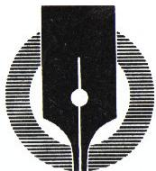
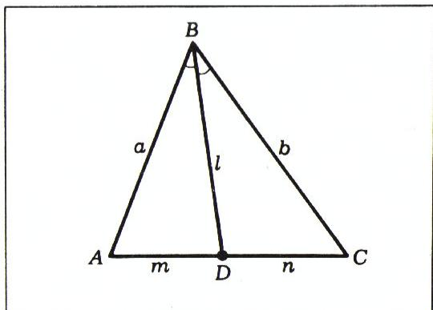
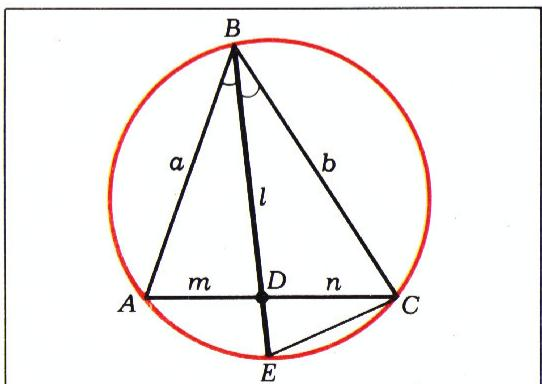
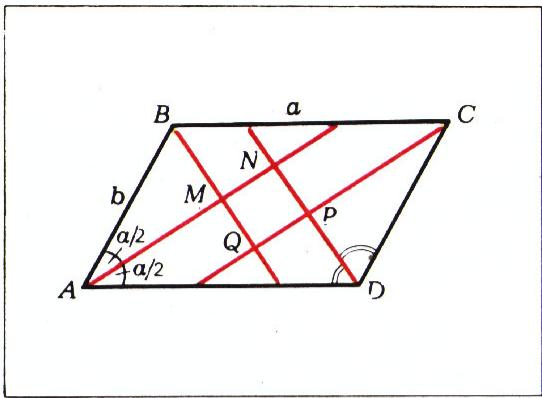
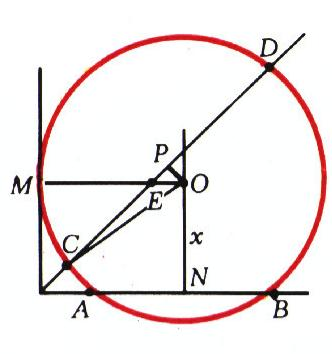
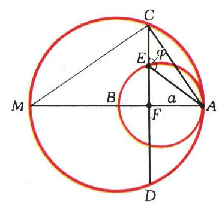
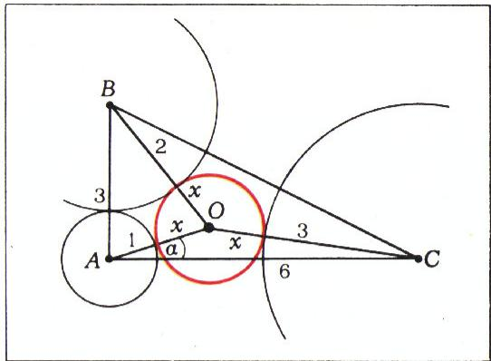
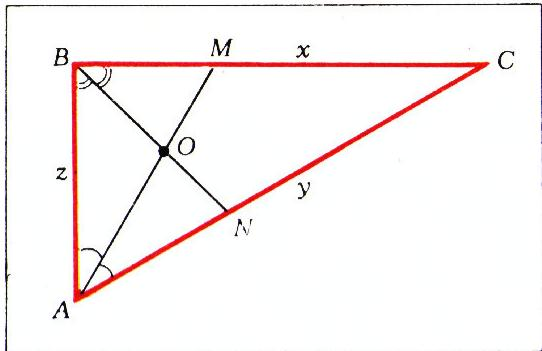
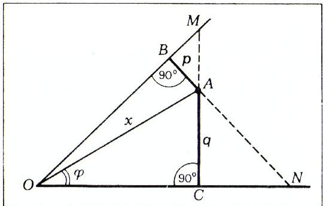
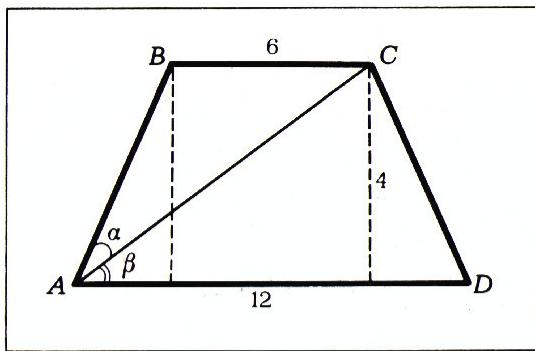

# 解几何题的代数方法

> **原标题**：Алгебраический метод решения геометрических задач
> **作者**：И. Ф. Шарыгин（И. Ф. 沙雷金，1937—2004，苏联／俄罗斯数学教育家、几何普及作家）、С. В. Романов（С. В. 罗曼诺夫）
> **译自**：Квант 1975, № 11, с. 45–49
> **原文扫描**：https://www.kvant.digital/data/kvant_1975_11/jpg/0045.jpg
> **主题**：用代数手段（「直接计算」与「列方程」）解平面几何题；余弦定理、正弦定理、辅助未知数与方程组
> **难度**：★★（面向高考考生，属高中平面几何／三角层面）
> **译者**：Claude（初译）／ 2026-06-24

---

> *本篇属《高考生实习》（Практикум абитуриента）栏目。*
> *——栏目配图*

*栏目标头*

当考场上人家给你出一道平面几何题时，往往不值得花时间去寻找几何解法——更划算的是用代数方法去解。当然，几何解法通常更精巧，而代数解法则要拖着一串繁琐的演算；但考试不同于竞赛，解法的精巧程度对评分几乎没有什么影响。因此，在考场上解几何题时，主要的「武器」就是代数方法。本文要谈的正是它。

我们先给出同一道题的两种解法。

**题 1.** 证明：过任意三角形一个顶点所作的角平分线，其长度的平方等于两腰之积减去底边被分成的两段之积。

需要证明 $l^{2} = ab - mn$（图 1）。设 $\angle ADB = \alpha$。对三角形 $ABD$ 和 $BDC$ 分别用余弦定理，有：

$$
a^{2} = l^{2} + m^{2} - 2 m l \cos \alpha, \tag{1}
$$

$$
b^{2} = l^{2} + n^{2} + 2 n l \cos \alpha. \tag{2}
$$

将 (1) 乘以 $n$，(2) 乘以 $m$，再把所得两式相加。注意到 $\dfrac{m}{n} = \dfrac{a}{b}$，我们很容易把和式化成 $l^{2} = ab - mn$ 的形式。

*图 1*

这就是代数方法。

在阅读下面的解法之前，请先自己尝试用纯几何方法来解这道题。

下面是纯几何解法。作三角形 $ABC$ 的外接圆（图 2），并把角平分线延长，使它与外接圆相交于点 $E$。由一条熟知的定理知 $mn = l \cdot DE$。此外，由三角形 $BCE$ 与 $ABD$ 相似可得 $\dfrac{a}{l} = \dfrac{l + DE}{b}$，从而 $ab = l^{2} + l \cdot DE$。把 $l \cdot DE$ 换成 $mn$，即得所要证的结论。

*图 2*

当然，这个解法比前一个更短、更精巧；但要想到它，恐怕得花相当多的时间。

代数方法建立在一些标准手法之上。可以把代数方法分成两种变体：

а) 「直接计算」；

б) 「列方程」。

「直接计算」的要旨如下。把题目条件中给定的量与所求的量，用一连串中间量串起来，使每一个中间量都能依次由前一个量算出。

**题 2（莫斯科大学地理系，1966 年）.** 在边长为 $a$、$b$、夹角为 $\alpha$ 的平行四边形中，作出四个角的四条角平分线。求这四条角平分线所围成的四边形的面积（图 3）。

先拟定一个解题计划，换句话说，把一连串能够依次算出的元素写出来，让它把已知量和所求量连接起来。

首先注意到 $MNPQ$ 是平行四边形。我们依次求出 $\angle ABC$、$\angle ABM$、$\angle AMB = \angle QMN$。然后由 $\triangle BCQ$（按正弦定理）求出 $BQ$，由 $\triangle BMA$ 求 $BM$ 和 $AM$，由 $\triangle NAD$ 求 $AN$。此后便不难算出 $MN$ 和 $QM$，进而得到所求面积 $S = QM \cdot MN \cdot \sin\angle QMN$。

*图 3*

于是 $\angle ABC = 180^{\circ} - \alpha$，$\angle ABM = \dfrac{180^{\circ} - \alpha}{2}$，$\angle AMB = 90^{\circ} = \angle QMN$，即 $MNPQ$ 是矩形。$BQ = a \sin\dfrac{\alpha}{2}$，$BM = b \sin\dfrac{\alpha}{2}$，$MQ = BQ - BM = (a - b)\sin\dfrac{\alpha}{2}$，等等。得到的答案是：

$$
S = \frac{1}{2}(a - b)^{2} \sin\alpha.
$$

下面给一个「列方程」的例子。

**题 3（莫斯科大学地理系地球物理专业，1973 年）.** 平面上给定一个直角。一个圆心在该角内部的圆与角的一边相切，与另一边相交于点 $A$ 和 $B$，并且与角的平分线相交于点 $C$ 和 $D$；$AB = \sqrt{6}$，$CD = \sqrt{7}$。求该圆的半径。

设 $O$ 为圆心，$R$ 为其半径，$M$ 为切点（图 4）。把圆心到 $AB$ 的距离记作 $x$。立即可以列出第一个方程：$R^{2} - x^{2} = AN^{2}$。

作 $OP \perp CD$，则 $OP = \dfrac{OE}{\sqrt{2}} = \dfrac{R - x}{\sqrt{2}}$。现在可以列出第二个方程：

$$
R^{2} - \left(\frac{R - x}{\sqrt{2}}\right)^{2} = CP^{2}.
$$

利用 $AN = \dfrac{\sqrt{6}}{2}$、

*图 4*

$CP = \dfrac{\sqrt{7}}{2}$，列出方程组：

$$
\left\{\begin{array}{l} R^{2} - x^{2} = \dfrac{6}{4}, \\[4pt] R^{2} - \left(\dfrac{R - x}{\sqrt{2}}\right)^{2} = \dfrac{7}{4}. \end{array}\right.
$$

解之，得 $R = \sqrt{2}$。

解「列方程」类的题目时，往往并不要求未知数的个数与方程的个数相等。重要的是：在列方程时要把由条件推出的一切关系都用上。只要做到这一点，所需的那个未知数（或未知数的某个组合）就一定能由所列方程组定出。

类似情形在「直接计算」类题目中也可能出现。

**题 4.** 半径分别为 $R$ 和 $r$（$R > r$）的两个圆在点 $A$ 内切。大圆的弦 $CD$ 垂直于小圆的直径 $AB$，$E$ 是 $CD$ 与半径为 $r$ 的圆的交点，且 $E$ 与 $C$ 在 $AB$ 的同一侧。求三角形 $AEC$ 的外接圆半径。

把 $\angle CEA$ 记作 $\varphi$，$AF$ 记作 $a$（图 5）。由三角形 $CAM$ 得 $AC = \sqrt{2aR}$，同理 $AE = \sqrt{2ar}$。由三角形 $AEC$ 按正弦定理可得所求半径的值 $\dfrac{AC}{2\sin\varphi}$。$\sin\varphi$ 的值不难由三角形 $FEA$ 求出。

*图 5*

答案是 $\sqrt{Rr}$。

我们不得不引入参数 $a$、$\varphi$，因为题目的条件并未完全确定几何构形。但这些参数并不出现在答案中。

**题 5（莫斯科物理技术学院，1967 年）.** 在直角三角形 $ABC$ 中，直角边 $AB = 3$，直角边 $AC = 6$。半径分别为 $1$、$2$、$3$ 的三个圆的圆心分别在点 $A$、$B$、$C$。求一个与这三个已知圆都外切的圆的半径。

设 $O$ 为所求圆的圆心，$x$ 为其半径，$\angle OAC = \alpha$（图 6）。对三角形 $AOC$ 与 $AOB$ 写出余弦定理，得方程组：

$$
\left\{\begin{array}{l} (x + 3)^{2} = (x + 1)^{2} + 36 - 12(x + 1)\cos\alpha, \\[4pt] (x + 2)^{2} = (x + 1)^{2} + 9 - 6(x + 1)\sin\alpha. \end{array}\right.
$$

*图 6*

从这两个方程分别解出 $\sin\alpha$ 与 $\cos\alpha$，再利用恒等式 $\sin^{2}\alpha + \cos^{2}\alpha = 1$，便得到只含一个未知数 $x$ 的方程；解之，即得答案：$x = \dfrac{8\sqrt{11} - 19}{7}$。

应当指出，利用余弦定理来列方程，是最常见的手法之一。一般说来，在解几何题时正确地选取未知数，起着十分重要的作用。这方面，经验与直觉起着不小的作用。

**题 6（莫斯科物理技术学院，1966 年）.** 三角形 $ABC$ 的两条角平分线 $AM$ 与 $BN$ 交于点 $O$。已知 $AO = \sqrt{3}\,MO$，$NO = (\sqrt{3} - 1)BO$。求三角形 $ABC$ 的各角。

引入如下未知数（图 7）：$BC = x$、$AC = y$、$AB = z$。由于 $\dfrac{MC}{BM} = \dfrac{AC}{AB}$，所以 $MB = \dfrac{zx}{y + z}$，同理 $AN = \dfrac{yz}{x + z}$。现在考察分别以 $BO$、$AO$ 为角平分线的三角形 $BMA$ 和 $BAN$，不难得到如下的方程组：

$$
\left\{\begin{array}{l} \dfrac{x}{z + y} = \dfrac{1}{\sqrt{3}}, \\[4pt] \dfrac{y}{x + z} = \sqrt{3} - 1. \end{array}\right.
$$

*图 7*

接下来可以把所有未知数都用某一个（比如 $x$）表示出来，再按余弦定理求出三角形的各个角——$30^{\circ}$、$60^{\circ}$、$90^{\circ}$。请你试着改用所求的角作为未知数来解这道题，你会看到解法明显地复杂化了。

必须指出这样一个事实：大多数可用代数方法求解的题目，都有两条路可走——既可以作为「直接计算」，也可以作为「列方程」，二者并不互斥。

*图 8*

**题 7.** 在一个锐角 $\alpha$ 的内部取一点 $A$，它到角两边的距离分别为 $p$ 和 $q$。求点 $A$ 到角顶的距离。

设 $M$ 为 $AC$ 与 $OB$ 的交点（图 8），容易看出 $\angle BAM = \alpha$。于是 $MC = q + \dfrac{p}{\cos\alpha}$，$OC = MC \cdot \operatorname{ctg}\alpha = \dfrac{q\cos\alpha + p}{\sin\alpha}$。所求距离 $AO$ 由三角形 $AOC$ 求出：

$$
AO = \frac{\sqrt{p^{2} + 2pq\cos\alpha + q^{2}}}{\sin\alpha}.
$$

这就是「直接计算」。但本题同样不难用「列方程」来解，而且两条路在简洁程度上恐怕不相上下。下面就写「列方程」的解法。

引入未知数 $\angle AOC = \varphi$，$AO = x$。考察三角形 $AOB$ 与 $AOC$，列出含两个未知数的二元方程组：

$$
\left\{\begin{array}{l} x\sin\varphi = q, \\[4pt] x\sin(\alpha - \varphi) = p. \end{array}\right.
$$

请你自行解出这个方程组。

如果再仔细回顾本文所举的各个例子，很容易发现：几乎在每一个例子里都作了某些辅助作图，都用到了一些几何上的考虑。所以，在用代数方法解平面几何题时，仍然不要忘记：这终究是一道平面几何题，而不是代数题，也就是说，不要放过任何几何上的考虑，因为它们通常能使解法简化。否则，你就会把一道最简单的几何题，变成一道更繁琐的代数题——某本高考辅导书的作者们就曾在下面这道题上犯过这样的毛病。

**题 8（莫斯科大学地理系，1969 年）.** 在等腰梯形 $ABCD$ 中，底边 $AD = 12$，$BC = 6$，梯形的高为 $4$。对角线 $AC$ 把梯形的角 $BAD$ 分成 $\angle BAC$ 与 $\angle CAD$ 两个角。这两个角哪个较大？

那本辅导书给出的解法是这样的。设 $\angle BAC = \alpha$（图 9）、$\angle CAD = \beta$。先算出 $\operatorname{tg}\angle BAD = \operatorname{tg}(\alpha + \beta)$，再算 $\operatorname{tg}\beta$，最后用三角公式求出 $\operatorname{tg}\alpha$。比较 $\operatorname{tg}\alpha$ 与 $\operatorname{tg}\beta$，便得到题中所问的答案。然而，注意到 $\angle BCA = \beta$ 以及 $AB = 5$（由勾股定理）要简单得多。在三角形 $ABC$ 中 $\alpha > \beta$，因为在同一个三角形中，大边对大角。

*图 9*

## 习题

1.（莫斯科大学地理系，1966 年）在等腰梯形中，两底分别为 $a$ 和 $b$，对角线与底的夹角为 $\alpha$。求连接对角线交点与梯形一腰中点的线段之长。

2.（莫斯科大学物理系，1963 年）在半径为 $R$ 的圆中，过直径上一点 $M$ 作一条与直径成 $\varphi$ 角的弦 $AB$；此时 $BM : AM = p : q$。过点 $B$ 再作一条垂直于该直径的弦 $BC$，并把点 $C$ 与点 $A$ 相连。求三角形 $ABC$ 的面积。

3.（莫斯科大学经济系，1968 年）在梯形 $ABCD$ 中，较大底边的两个底角为 $\alpha$ 和 $\beta$，梯形的高为 $h$。设 $O_{1}$、$O_{2}$、$O_{3}$、$O_{4}$ 分别是三角形 $ABC$、$BCD$、$CDA$、$DAB$ 的外接圆圆心。求四边形 $O_{1}O_{2}O_{3}O_{4}$ 的面积。

4. 半径分别为 $R$ 和 $r$ 的两圆相交。作它们的一条公切线。设两圆的交点 $A$ 与两切点 $B$、$C$ 位于连心线的两侧。求三角形 $ABC$ 的外接圆半径。

5.（莫斯科大学力学数学系，1968 年）在凸四边形 $ABCD$ 中，角 $ABC$ 的平分线交边 $AD$ 于点 $M$，而从顶点 $A$ 向边 $BC$ 所作的高交 $BC$ 于点 $N$，使得 $BN = NC$ 且 $AM = 2MD$。已知该四边形周长为 $5 + \sqrt{3}$，$\angle BAD = 90^{\circ}$，$\angle ABC = 60^{\circ}$。求四边形 $ABCD$ 的各边及面积。

6.（莫斯科物理技术学院，1967 年）半径分别为 $R$ 和 $r$ 的两圆在点 $A$ 内切。求正三角形 $ABC$ 的边长，其中顶点 $B$、$C$ 分别在半径为 $R$、$r$ 的圆上。

7. 直线 $l$ 分别交等腰三角形 $ABC$ 的两腰 $AB$、$BC$ 于点 $M$、$N$。已知 $\dfrac{AM}{BM} = m$，$\dfrac{CN}{BN} = n$。求直线 $l$ 分从顶点 $B$ 引出的三角形的高所得之比。

8.（莫斯科大学物理系，1969 年）在三角形 $ABC$（$AB \ne AC$）中，由顶点 $B$、$C$ 分别引向对边 $AC$、$AB$ 的两条中线，与这两条对边成反比。已知 $BC = a$，$\angle BAC = \alpha$，求 $AC$ 和 $AB$。

9.（莫斯科大学力学数学系，1971 年）四边形 $ABCD$ 既可内切于圆（有内切圆）、又可外接于圆（有外接圆），且两条对角线互相垂直。已知外接圆半径为 $R$ 且 $AB = 2BC$，求该四边形的面积。

10.（莫斯科大学物理系，1974 年）两个全等的正三角形 $ABC$ 与 $CDE$，边长均为 $1$，在平面上放置得使它们只有一个公共点 $C$，且 $\angle BCD < \pi/3$。点 $K$ 为 $AC$ 中点，$L$ 为 $CE$ 中点，$M$ 为 $BD$ 中点。已知三角形 $KLM$ 的面积为 $\dfrac{\sqrt{3}}{5}$，求 $BD$。

---

## 译者注与校对说明

1. **作者与栏目**：本文署名 С. В. Романов（罗曼诺夫）与 И. Ф. Шарыгин（沙雷金，1937—2004，俄罗斯著名几何教育家、IMO 领队、《Kvant》长期作者，著有《几何的对称》《数学的视觉》等）。文首「Практикум абитуриента」（高考生实习）是《Kvant》面向大学入学考试的长设栏目。OCR 把栏目名前的署名顺序写作「С. В. Романов, И. Ф. Шарыгin」，按俄文习惯复原。

2. **OCR 校正**：
   - 公式处 OCR 噪声 `$l^{2}=ab-$ — mn`（多余的 `—`）已校正为 $l^{2} = ab - mn$；与首页扫描核对一致（已用图像分析核对：余弦定理两式 $a^{2}=l^{2}+m^{2}-2ml\cos\alpha$、$b^{2}=l^{2}+n^{2}+2nl\cos\alpha$ 及角平分线性质 $\frac{m}{n}=\frac{a}{b}$ 均与扫描页吻合）。
   - OCR 把角符号 `\nrightarrow`、`\nLeftrightarrow`、`\preceq`、`\not\rightarrow`、`\Rightarrow` 一律误识；已按上下文还原为相应的角记号 $\angle$（如 $\angle ADB=\alpha$、$\angle CEA=\varphi$、$\angle OAC=\alpha$、$\angle BAC=\alpha$、$\angle BAM=\alpha$、$\angle AOC=\varphi$、$\angle BAD$、$\angle ABC$ 等）。
   - `\text{ctg }` 保留为俄式记号 $\operatorname{ctg}$（即余切 $\cot$）；`tg` 同理保留为 $\operatorname{tg}$（即 $\tan$），符合俄国教材传统，不作改写。
   - 方程组中 `36` 实为 $6^{2}=36$（题 5 中 $AC=6$），已保留。
   - 题 6 中 OCR `$NO = -(\sqrt{3}-1) BO$` 之多余负号，按题意（线段长之比）应为 $NO=(\sqrt{3}-1)BO$，已去负号。
   - 习题 8「与这两条对边成反比」：俄文 «обратно пропорциональны этим сторонам»，即中线长 $\propto$ 对应边长的倒数，译文忠实保留。
   - 第 47 页系统中的 `V \overline {{{2}}}` 是 OCR 对 $\sqrt{2}$ 的误识，已还原为 $\sqrt{2}$。

3. **图号对照**：原文图号（Рис. 1—9）与配图位置在跨页时略有错位，译文按「正文中首次引用的图号」对齐各图，并补上缺失的图注。10 张图（`fig_p45_01` 至 `fig_p49_01`）全部引用：`fig_p45_01` 为栏目标头装饰；图 1—9 对应 `fig_p45_02/03`、`fig_p46_01/02`、`fig_p47_01/02`、`fig_p48_01/02`、`fig_p49_01`。其中原文题 7 的配图（p48 右栏）未带 caption，译文中标注为图 8（紧接在题 7 之前，与正文「图 8」对应）。

4. **术语**：теорема косинусов=余弦定理，теорема синусов=正弦定理，биссектриса=角平分线，хорда=弦，диаметр=直径，касательная=切线（公切线 общая касательная），описанная окружность=外接圆，вписанная окружность=内切圆，равнобедренная/равнобочная трапеция=等腰梯形，параллелограмм=平行四边形，прямоугольник=矩形，подобие=相似，гомотетия 与 инверсия 本文未出现。年代与「МГУ 地理系／物理系／力学数学系／经济系」「МФТИ（莫斯科物理技术学院）」等机构名均保留时代原名。

## 建议讨论题

1. 题 1 给出了代数解与几何解两种。请比较：在考场上你更愿意用哪一种？为什么作者说「在考试中（不同于竞赛）解法的精巧几乎不影响评分」？
2. 作者把代数方法分成「直接计算」与「列方程」两类，并强调二者并不互斥。请用题 7（点到角顶的距离）说明这两种思路分别是怎样展开的，并体会「同一道题可有两条路」。
3. 题 8 中，作者批评了「把简单几何题做成繁琐代数题」的做法。你在自己解题时，是否也犯过类似的「过度代数化」的毛病？怎样在动手前判断该走几何路还是代数路？
4. 题 4、题 5 都引入了不进入最终答案的辅助参数（如 $a$、$\varphi$、$\alpha$）。这种「引而消之」的手法为什么有效？它和「列方程」中未知数个数不必等于方程个数这件事，有什么内在联系？

---

> **版权说明**：原文版权归 MCCME（莫斯科连续数学教育中心）及作者继承者所有。本译文为非商业、自用、数学圈内部参考，未获授权不得公开分发。原文扫描见 [kvant.digital](https://www.kvant.digital/data/kvant_1975_11/jpg/0045.jpg)。

> **复用说明**：本译文的俄文 OCR 原文与全部插图均存档于 `ocr/1975_11_sharygin_B10/`（`ru.md` 为合并 OCR 文本，`meta.json` 为图映射）。如对译文质量不满意，可直接基于 `ru.md` 重译，无需重跑 OCR。
