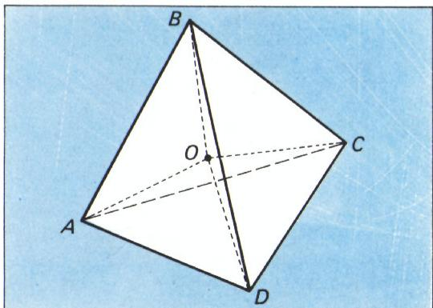
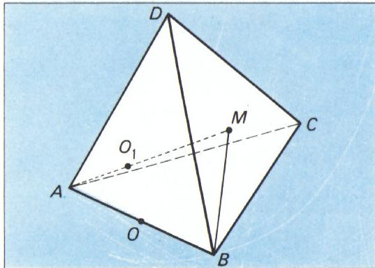
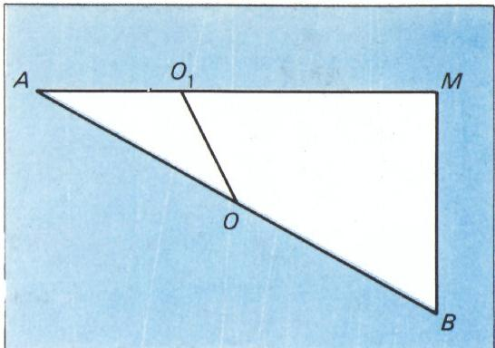
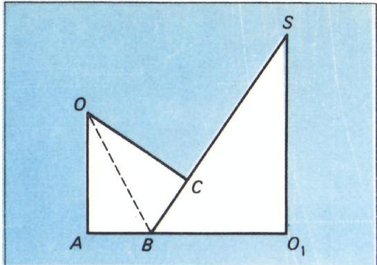
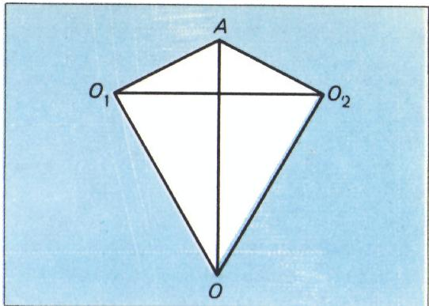
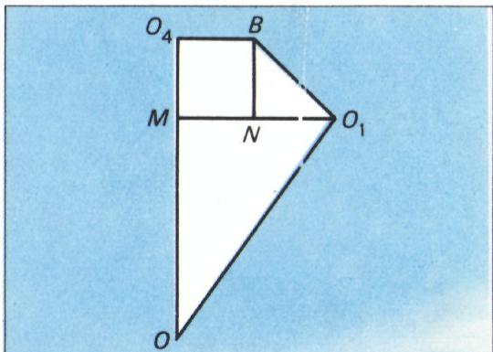
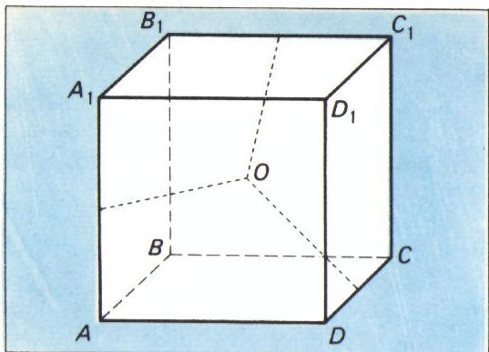
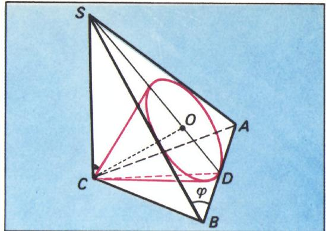
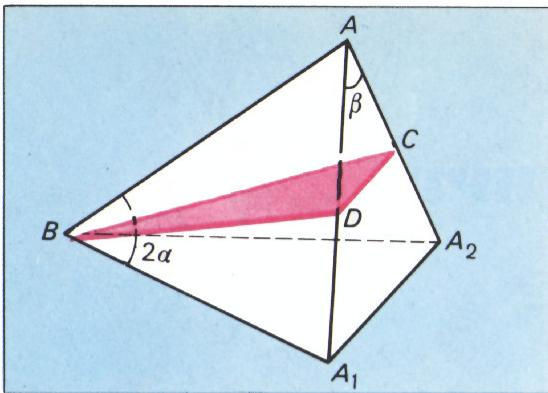

# 立体几何题中的作图

> **原标题**：Чертеж в стереометрических задачах
> **作者**：И. Ф. Шарыгин（И. Ф. 沙雷金，1937—2004，苏联／俄罗斯数学家、数学教育家，以几何题集与培养奥林匹克选手闻名）
> **译自**：Квант 1974, № 10, с. 32–37
> **原文扫描**：https://www.kvant.digital/data/kvant_1974_10/jpg/0032.jpg
> **主题**：立体几何（球面、球、圆锥、圆柱、棱锥的相切与作图方法）
> **难度**：★★（文字高中可读，但相切、外接／内切等技巧属高考／竞赛层面）
> **译者**：Claude（初译）／ 2026-06-24

---

> *本文是 Kvant 杂志「高考者自习室（Практикум абитуриента）」栏目的一篇几何专题。作者通过七道立体几何例题，向准备报考高校的中学生示范：怎样把一道看起来需要复杂立体作图的题，化归为几张简单的、甚至纯平面几何的图。*
> *——栏目按*

在批阅报考高校的考生答卷时，常常会发现这样的情形：誊清稿里的几何题往往配有相当不错的图，而草稿上画的东西，充其量只能勉强称之为「图」。真让人纳闷：考生们是凭了怎样的「图」，居然把题给解出来了。众所周知，一张好的图能给几何题、尤其是立体几何题的求解带来很大的帮助。当然，指望一般的中学生做出 Kvant 美术作者那样水准的图，是不现实的。可是，只要在解每一道几何题时都留意图的质量，迟早你会画得相当过得去。请给自己立下一条规矩：**在做出一张过得去的图之前，不要着手解题**。不要吝惜纸张，要把图画大些；看不见的线用虚线表示；在没有确认其必要性之前，不要随手添加辅助线。立体几何题往往可以化归为一道或几道平面几何题。为每一道这样的题，单独画一张图。球（шар）一般不必画出来；标出它的球心、它与直线、平面或其它球的切点，通常就足够了。两球相切，意味着两球心之间的距离，在外切时等于两半径之和，在内切时等于两半径之差。

下面看例子。

## 题 1（莫斯科大学化学系，1968 年）

在一球面（сфера）内放置四个半径为 $r$ 的球。每个球都与其余三个球相切，并与球面相切。求球面的半径。

**解。** 设 $A$、$B$、$C$、$D$ 是四个半径为 $r$ 的球的球心，$O$ 是球面的球心（图 1）。由这四个球两两外切可知，$ABCD$ 是棱长为 $2r$ 的正四面体。所有球都与以 $O$ 为心的球面内切，因此 $AO$、$BO$、$CO$、$DO$ 互不相等而彼此相等，且等于 $R - r$，其中 $R$ 为所求球面半径。另一方面，所有这些距离又都等于：棱长为 $2r$ 的正四面体的外接球半径。至此已不难求出所求的 $R$。请读者自行完成。

*图 1*

> **译者注**：正四面体（棱长 $2r$）的外接球半径为 $\dfrac{2r\sqrt{6}}{4}=\dfrac{r\sqrt{6}}{2}=r\sqrt{\dfrac32}$，故 $R-r=r\sqrt{\dfrac32}$，即 $R=r\!\left(1+\sqrt{\dfrac32}\right)$。

$$
\text{答：}\quad R = r\left(1 + \sqrt{\frac{3}{2}}\right).
$$

## 题 2（莫斯科物理技术学院，1966 年）

正四面体 $ABCD$ 的棱长为 $a$。以棱 $AB$ 为直径作一球面。求四面体在顶点 $A$ 处的三面角（трёхгранный угол）的内切球中、与所作球面相切者的半径。

**解。** 设 $O$ 为 $AB$ 的中点——即已知球面的球心，$O_{1}$ 为所求球的球心。容易想到 $O_{1}$ 在四面体 $ABCD$ 的高 $AM$ 上（图 2）。

*图 2*

记以 $O_{1}$ 为心的球之半径为 $x$。由该球内切于三面角 $A$ 可知 $AO_{1} = 3x$。其道理是：对内切于三面角 $A$ 的任一球而言，其球心到顶点 $A$ 的距离与半径之比是常数。试看内切于正四面体 $ABCD$ 的球：其球心与外接球球心重合（这是众所周知的）；而正四面体的外接球半径与内切球半径之比不难算出，等于 $3$。

把 $\triangle AMB$ 单独画出来（$\angle M$ 为直角）（图 3），考察 $\triangle AOO_{1}$。

*图 3*

有

$$
AO_{1} = 3x, \quad AO = \frac{a}{2},
$$

$$
O_{1}O = \frac{a}{2} \pm x.
$$

其中「$+$」对应球心为 $O$ 与 $O_{1}$ 的两球外切，「$-$」对应内切。（图 3 画的是内切的情形。外切时点 $O_{1}$ 应在 $AM$ 越过 $M$ 的延长线上。）

由直角 $\triangle AMB$ 求出 $\cos\angle O_{1}AO$，再对 $\triangle OAO_{1}$ 写出余弦定理，即可求得 $x$。

$$
\text{答：}\ \frac{a}{8}(\sqrt{6} \pm 1).
$$

## 题 3（莫斯科大学化学系，1971 年）

三个相同的直圆锥（прямой круговой конус），其底面半径均为 $r$，且等于各自高的 $\dfrac{3}{4}$，同处于平面 $P$ 的一侧，底面落在该平面上。每两个圆锥的底面圆周相外切。求一个位于圆锥之间、且与平面 $P$ 及三个圆锥都相切的球的半径。

为解此题，我们需要下面两条引理（请读者自证）：

**引理 1。** 若一球外切于圆锥的侧面以及圆锥底面所在的平面，则圆锥的轴、过球与圆锥切点的母线、球心以及球与底面所在平面的切点，四者共面，且该平面垂直于圆锥的底面（图 4）。（图 4 中 $SO_{1}$ 为圆锥的轴，$SB$ 为其母线，$O$ 为球心，$A$ 为球与底面所在平面的切点，$C$ 为球与圆锥的切点。）

*图 4*

**引理 2。** 球与平面 $P$ 的切点，恰为由三个圆锥底面圆心所构成的等边三角形的中心（球、圆锥与平面 $P$ 均如题设）。

现在图 4 就能帮我们解题。有

$$
AO_{1} = \frac{2r\sqrt{3}}{3},\quad BO_{1} = r,\quad SO_{1} = \frac{4}{3}r.
$$

在直角 $\triangle AOB$ 中，已知直角边 $AB$ 及 $\angle OBA = \dfrac{1}{2}\angle ABS$，而 $\angle ABS$ 的一切三角函数都不难算出，于是所求半径 $OA$ 便容易求出。

$$
\text{答：}\ 2r \cdot \frac{2\sqrt{3} - 3}{3}.
$$

## 题 4（莫斯科大学物理系，1972 年）

在半径为 $2$ 的球面上有三条半径为 $1$ 的圆周，每一条都与另外两条相切。求一条比上述圆周都小、同样位于该球面上、且与三条已知圆周都相切的圆周的半径。

*图 5*

下面列举解题时要依据的几个事实，请读者自行证明：

1. 若球面上的两条圆周相切，则球心、两圆心与切点共面；
2. 三条半径为 $1$ 的圆周的圆心 $O_{1}$、$O_{2}$、$O_{3}$ 构成等边三角形；
3. 所求圆周的圆心，位于垂直于平面 $O_{1}O_{2}O_{3}$ 的球面半径上。

解题要用到图 5 和图 6。

图 5 中 $O$ 为球心，$O_{1}$、$O_{2}$ 为两条半径为 $1$ 的圆周之圆心，$A$ 为其切点，

$$
\angle AO_{1}O = \angle AO_{2}O = 90^{\circ},\quad OA = 2.
$$

*图 6*

由此容易求得

$$
OO_{1} = OO_{2} = O_{1}O_{2} = \sqrt{3}.
$$

图 6 中 $M$ 是以 $\sqrt{3}$ 为边长的等边 $\triangle O_{1}O_{2}O_{3}$ 的中心，故 $O_{1}M = 1$；$O_{4}$ 是所求圆周的圆心，$B$ 是它与第一条圆周的切点，$BN \perp MO_{1}$。由 $\triangle O_{1}BN$ 与 $\triangle O_{1}MO$ 相似，可求得 $NO_{1}$，进而所求半径

$$
O_{4}B = MN = MO_{1} - NO_{1}.
$$

$$
\text{答：}\ 1 - \sqrt{\frac{2}{3}}.
$$

有时，考察题目条件中并未出现的某个几何体——棱锥、平行六面体、棱柱等——会颇有助益。

## 题 5（本题是对 1973 年莫斯科物理技术学院数学奥林匹亚一道题的改写）

三条半径均为 $r$、两两相切的圆柱面（цилиндрическая поверхность），其轴线两两互相垂直。求与三条曲面都相切的最小球的半径。

**解。** 考察棱长为 $2r$ 的立方体 $ABCDA_{1}B_{1}C_{1}D_{1}$。不妨认为棱 $AA_{1}$ 落在一条圆柱的轴线上，棱 $DC$ 落在另一条的轴线上，棱 $B_{1}C_{1}$ 落在第三条的轴线上（图 7）。

*图 7*

我们来证明：所求球的球心与立方体的中心 $O$ 重合。

事实上，考虑与三个已知圆柱同轴、且都通过点 $O$ 的三个圆柱。则

*图 8*

$O$ 是同时位于这三个圆柱内部或边界上的唯一点；故对任一异于 $O$ 的点，它到三条直线 $AA_{1}$、$DC$、$B_{1}C_{1}$ 中至少一条的距离，都大于 $O$ 到该直线的距离。

答：$r(\sqrt{2} - 1)$。

## 题 6

$n$ 个相同的圆锥（$n \geqslant 3$）有公共顶点，每一个与另外两个相切，且全部都与同一平面相切。求这些圆锥的轴截面顶角。

**解。** 考察三棱锥 $SABC$（图 8），其底面是等腰 $\triangle ABC$（$AC = CB$），且 $\angle ACB = \dfrac{2\pi}{n}$；$SC$ 垂直于平面 $ABC$，且 $C$ 在平面 $SAB$ 上的投影恰为 $\triangle ABS$ 的内心。现在考察以 $C$ 为顶点、以 $\triangle SAB$ 的内切圆为底面圆周的圆锥。容易验证，这一圆锥可作为所求的圆锥。事实上，把 $n$ 个与棱锥 $SABC$ 全等的棱锥依次并放、使其顶点 $S$ 重合，则分别内切于这些棱锥的圆锥，恰好构成满足本题条件的一组。

记圆锥的母线长为 $l$、底面圆半径为 $r$。由直角 $\triangle SCD$ 与 $\triangle OCD$ 相似，得 $SD = \dfrac{l^{2}}{r}$；由 $\triangle CDB$ 得 $DB = l\operatorname{tg}\dfrac{\pi}{n}$。另一方面，由 $\triangle SDB$ 得

$$
SD = DB \cdot \operatorname{tg}\varphi = DB \cdot \frac{2\operatorname{tg}\dfrac{\varphi}{2}}{1 - \operatorname{tg}^{2}\dfrac{\varphi}{2}},
$$

其中 $\varphi = \angle SBD$，即

$$
\operatorname{tg}\frac{\varphi}{2} = \frac{OD}{DB} = \frac{r}{l\operatorname{tg}\dfrac{\pi}{n}}.
$$

所求角之半的正弦，等于比值 $r/l$；而后者可由下面得到的方程定出：

$$
\frac{l^{2}}{r} = l\operatorname{tg}^{2}\frac{\pi}{n}\cdot\frac{2\cdot\dfrac{r}{l\operatorname{tg}\dfrac{\pi}{n}}}{1 - \dfrac{r^{2}}{l^{2}\operatorname{tg}^{2}\dfrac{\pi}{n}}}.
$$

*图 9*

$$
\text{答：}\ 2\arcsin\frac{\operatorname{tg}\dfrac{\pi}{n}}{\sqrt{1 + 2\operatorname{tg}^{2}\dfrac{\pi}{n}}}.
$$

## 题 7

一束光线以角 $\alpha$ 射到平面镜上。镜子绕光线在镜面上的投影线转过角 $\beta$。反射光线偏离了多少角度？

设 $A$ 为光线上某一点，$B$ 为光线在镜面上的入射点，$A_{1}$ 为 $A$ 关于原镜面的对称点，$A_{2}$ 为 $A$ 关于转过后的镜面的对称点，$D$ 与 $C$ 分别为 $A$ 在这两个镜面上的投影（图 9）。则 $BA_{1}$ 与 $BA_{2}$ 分别是两条反射光线的延长线，于是所求角即 $\angle A_{1}BA_{2}$。

在四面体 $AA_{1}A_{2}B$ 中（见图 9），$D$、$C$ 分别是棱 $AA_{1}$、$AA_{2}$ 的中点；平面 $BDC$（即转过后的镜面）垂直于棱 $AA_{2}$，$AB = A_{1}B = A_{2}B$，$\angle ABA_{1} = 2\alpha$，$\angle A_{1}AA_{2} = \beta$。于是容易求得

$$
A_{1}A_{2} = 2DC = 2AD\sin\beta = 2AB\sin\alpha\sin\beta.
$$

再由 $\triangle A_{1}BA_{2}$ 即可求出所求角。

答：$2\arcsin(\sin\alpha\sin\beta)$。

---

在动手求解本札记末尾所列各题之前，请再仔细回顾一遍题 1—7 的解法。乍看之下，这些题似乎都需要相当复杂的图。然而我们设法用简单的、有些场合甚至是纯平面的图就解决了问题。要用一张简单的图去说明一道相当棘手的立体几何题，必须具备发达的空间想象力。而这，唯有靠练习、唯有靠练习才能达到。

## 练习

**3（莫斯科物理技术学院，1966 年）。** 在一正四棱锥中，斜高（апофема）等于底面的边长。棱锥内部放置两个球：半径为 $r$ 的球与所有侧面都相切；半径为 $2r$ 的球与底面及两条相邻的侧面相切；两球彼此外切。求此棱锥的斜高。

**4（莫斯科物理技术学院，1973 年）。** 两个相等的球彼此相切，并且都与一个二面角 $2\alpha$ 的两个面相切。设 $A$ 是其中一个球与角的一个面的切点，$B$ 是另一个球与角的另一个面的切点。线段 $AB$ 被两球面分成的比是多少？

**5（莫斯科大学力学数学系，1968 年）。** 给定正四棱锥 $SABCD$（$S$ 为顶点），底面边长为 $a$，侧棱长为 $a$。以 $O$ 为心的球面过点 $A$，且与侧棱 $SB$、$SD$ 在它们的中点处相切。求棱锥 $OSCD$ 的体积。

**6（莫斯科大学化学系，1971 年）。** 边长为 $a$ 的正三角形位于平面 $P$ 上。它被三条中位线分成四个三角形；在与顶点相邻的三个三角形上，各以之为底面，在平面 $P$ 的同一侧作高为 $a$ 的正三棱锥。求一个位于棱锥之间、且与平面 $P$ 及三个棱锥都相切的球的半径。

**7（莫斯科大学计算数学与控制论系，1972 年）。** 正三棱锥 $SABC$ 的侧棱与底面所在平面成 $45^{\circ}$ 角。一球在点 $A$ 处与底面 $ABC$ 相切，并且还与内切于棱锥的球相切。过第一个球的球心与底面的高 $BD$ 作一平面。求此平面与底面所成的角。

**8。** 三条半径均为 $r$、两两相切的圆柱面，其轴线两两互相垂直。求能在这些圆柱之间穿过的最大圆柱面的半径。

> **译者注**：练习 3 的编号沿袭原文（原文在该节习题中以「3」起编，盖因前两组练习已发表于该专栏此前各期）。题 8 与正文题 5 为姊妹题（一求最小外切球，一求最大内接圆柱），可对照阅读。

---

## 译者注与校对说明

1. **OCR 校正**：本文由 MinerU 对 1974 年第 10 期第 32—37 页扫描件做俄文 OCR 后翻译。已校正的 OCR 错误主要有：
   - 答案标记 `O T B e r` / `Otbet` 实为俄文 **Ответ**（「答」），OCR 将其逐字母拆开或误识，译文统一改为「答：」。
   - 题 1 答案 $R = r\!\left(1+\sqrt{\dfrac32}\right)$ 已与扫描页及数学推导（正四面体外接球半径 $=\dfrac{\text{棱长}\cdot\sqrt6}{4}$）双向核对，无误。
   - 题 2 中 $\angle M$ 为直角，原文 OCR 写作 `$\times M$ — прямой`（`×` 为 `∠` 的误识）；题 4 中 $\angle AO_{1}O$ 等同样有 `×` 误识，均已还原为 $\angle$。
   - 题 3 中 $\angle OBA=\tfrac12\angle ABS$，原文 OCR 作 `$\preceq OBA$`（`$\preceq$` 为 `∠` 的误识），已校正。
   - 题 6、题 7 中 `△` 与 `×`（应为 `∠`）混用，已统一为 $\triangle$ 与 $\angle$。
   - 题 6 的圆锥母线记号原 OCR 有处作 `t`（应为斜体 $l$），已据上下文校正为 $l$。
   - 文末另附的「数字 1974 的若干表示」（А. Ф. 古利耶夫作）一栏，其 OCR 出现严重乱码（一长串 $W_{-}$ 及负数列），与正文无关，且非沙雷金所撰，译文不予收录；如读者有意，可径查原刊 p. 37。
2. **术语**：сфера=球面、шар=球（体）、конус=圆锥、цилиндр=圆柱、пирамида=棱锥、тетраэдр=四面体、апофема=斜高、трёхгранный угол=三面角、образующая=母线，遵照《01_工作规范.md》对照表。МГУ（莫斯科大学）、МФТИ（莫斯科物理技术学院）等高校名保留缩写并首次出现处给出全称。
3. **图与编号**：原文插图共 9 张（题 1—7 各配图，图 1—9；其中题 5 配图 7、8 两张，题 6 配图 9）。图号、内容均与扫描页一致，引用 `../images/1974_10_sharygin_C01/fig_pXX_NN.png`。
4. **公式抽查**：题 1 的关键结论 $R=r\!\left(1+\sqrt{3/2}\right)$ 经数学推导复核（正四面体外接球半径 $=\frac{2r\sqrt6}{4}=r\sqrt{3/2}$，加内切半径 $r$）一致；题 4 答案 $1-\sqrt{2/3}$、题 5 答案 $r(\sqrt2-1)$、题 7 答案 $2\arcsin(\sin\alpha\sin\beta)$ 均与原文 OCR 一致。

## 建议讨论题

1. 沙雷金反复强调「不要着手解题，先画好图」。你解立体几何题时，图的优劣究竟在哪些环节（找思路、检验结果、避免漏解）影响最大？能否各举一个自己的例子？
2. 题 2 的答案是 $\dfrac{a}{8}(\sqrt6\pm1)$，即同一组条件下内切、外切各得一解。原文为何要保留「$\pm$」？这种「一题两解」在你做过的几何题中常见吗？
3. 题 5 用一个棱长 $2r$ 的立方体把三条互相垂直的圆柱「装」进去，从而把立体问题化为点到直线的距离。这种「补体（嵌入一个便于计算的几何体）」的手法，你能想到别的可用之处吗？
4. 题 7 把光的反射问题翻译成关于镜面（平面）的对称点问题，从而化为四面体 $AA_1A_2B$ 中的边角计算。这种「物理问题几何化」的思路，还能处理哪些反射／折射问题？

---

> **版权说明**：原文版权归 MCCME（莫斯科连续数学教育中心）及作者继承者所有。本译文为非商业、自用、数学圈内部参考，未获授权不得公开分发。原文扫描见 [kvant.digital](https://www.kvant.digital/data/kvant_1974_10/jpg/0032.jpg)。

> **复用说明**：本译文的俄文 OCR 原文与所有插图均存档于 `ocr/1974_10_sharygin_C01/`（`ru.md` 为合并 OCR 文本，`meta.json` 为图映射）。如对译文质量不满意，可直接基于 `ru.md` 重译，无需重跑 OCR。
