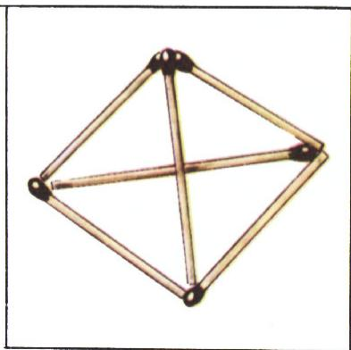
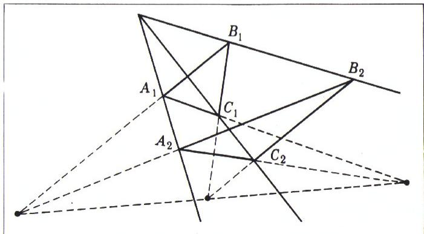
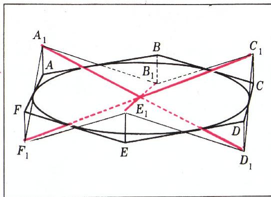
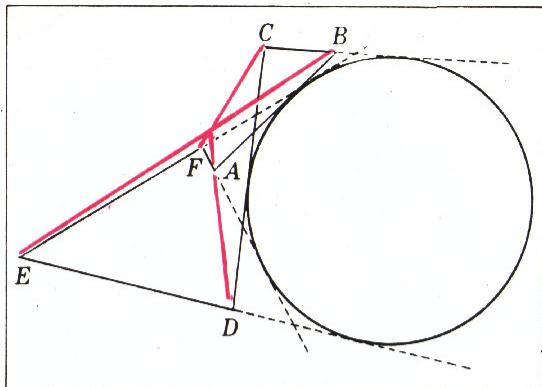
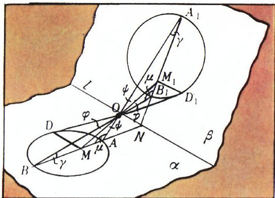
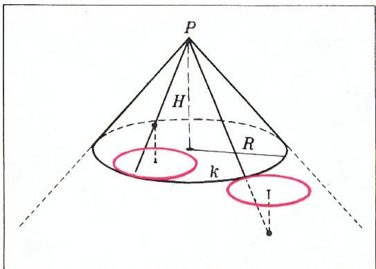
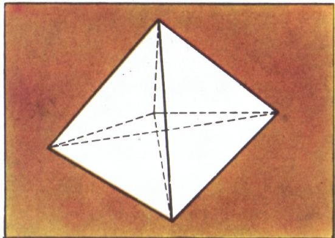
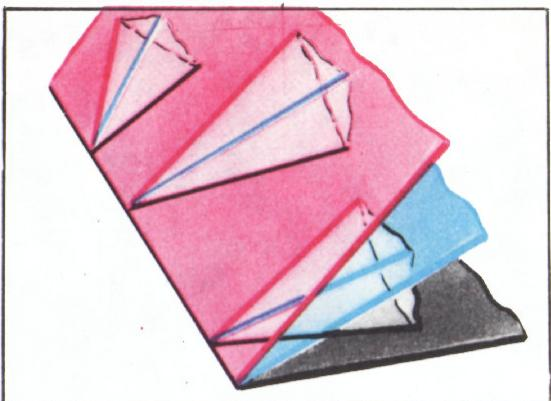
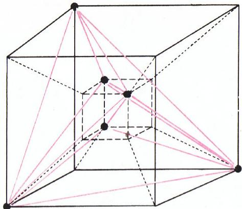

# 走向空间（升维法）

> **原标题**：Выход в пространство
> **作者**：И. Ф. Шарыгин（I. F. 沙雷金，1937—2004，苏联／俄罗斯数学家、数学教育家，Kvant 数学圈栏目主持人）
> **译自**：Квант 1975, № 5, с. 45—49
> **原文扫描**：https://www.kvant.digital/data/kvant_1975_5/jpg/0045.jpg
> **主题**：升维法——借助高维空间证明平面几何定理（德萨格定理、布里昂绍定理、阿波罗尼斯问题、单尺作图等）
> **难度**：★★★★（涉及射影几何、立体几何与四维空间初等概念，需较好的几何直观）
> **译者**：Claude（初译）／ 2026-06-24

---

> *数学圈*

## 1. 一个引子：火柴棍谜题

请试着解下面这个谜题：用六根火柴摆出四个正三角形，使每个三角形的边都是一整根火柴。看来无论怎样尝试都达不到目的。不仅如此，还能证明这样的作图在平面上是不可能实现的（请读者自行一试）。那该怎么办？原来，需要**走向空间**——用火柴摆一个正四面体（图 1）。在平面上办不到的事，在三维空间中却能做到！

*图 1*

借助走向空间，还能漂亮地解决一些平面几何题。德萨格定理就是一个经典的例子。

## 2. 德萨格定理

若两个三角形 $A_{1}B_{1}C_{1}$ 与 $A_{2}B_{2}C_{2}$ 在平面上的位置满足：直线 $A_{1}A_{2}$、$B_{1}B_{2}$、$C_{1}C_{2}$ 相交于同一点；那么直线 $A_{1}B_{1}$ 与 $A_{2}B_{2}$ 的交点、直线 $B_{1}C_{1}$ 与 $B_{2}C_{2}$ 的交点、以及直线 $C_{1}A_{1}$ 与 $C_{2}A_{2}$ 的交点，这三个点在同一条直线上（图 2）。

只要在图 2 中看出一个空间图形——具体地说，是一个被两张平面所截的三面角，这一定理就立刻变得显然：其中一张平面在三面角的棱上截得点 $A_{1}$、$B_{1}$、$C_{1}$，另一张则截得点 $A_{2}$、$B_{2}$、$C_{2}$。三角形 $A_{1}B_{1}C_{1}$ 与 $A_{2}B_{2}C_{2}$ 的相应边的三个交点都落在两张平面的交线上，因而共线。

*图 2*

## 3. 布里昂绍定理

借助走向空间，布里昂绍定理也能得到优美的证明：

> **定理。** 外切于一个圆的六边形，连接其三对对顶点的三条对角线交于同一点。

**证明。** 设 $ABCDEF$ 为平面上一个外切于圆的六边形。任取一个空间六边形 $A_{1}B_{1}C_{1}D_{1}E_{1}F_{1}$（图 3），它与 $ABCDEF$ 不同，它在平面 $p$ 上的投影恰好是六边形 $ABCDEF$，并且它的对应边都通过 $ABCDEF$ 与圆的切点。

*图 3*

为证明这样的六边形 $A_{1}B_{1}C_{1}D_{1}E_{1}F_{1}$ 存在，只需随意取一个顶点，例如把 $A_{1}$ 任意地取在过点 $A$ 且与平面 $p$ 垂直的直线上；其余各顶点便随之唯一确定。事实上，设 $a, b, c, d, e, f$ 分别是由 $A, B, C, D, E, F$ 所引圆的切线长，而 $h$ 是 $A_{1}$ 到六边形 $ABCDEF$ 所在平面的距离。那么 $B_{1}$ 位于与 $A_{1}$ 相对的平面的另一侧，与平面的距离为 $hb/a$；$C_{1}$ 与 $A_{1}$ 在平面的同一侧，与平面的距离为 $\dfrac{hb}{a} \cdot \dfrac{c}{b} = \dfrac{hc}{a}$；依此类推。最后求得 $F_{1}$ 与 $A_{1}$ 在平面的异侧，与平面的距离为 $hf/a$，因而 $A_{1}$ 与 $F_{1}$ 位于一条通过切点 $AF$（此处切于圆）的直线上。空间六边形 $A_{1}B_{1}C_{1}D_{1}E_{1}F_{1}$ 的任意两条对边都位于同一平面内（请读者自证）。所以，连接其任意两对对顶点的对角线都相交，从而三条对角线（它们不共面）交于同一点。既然平面六边形 $ABCDEF$ 是空间六边形 $A_{1}B_{1}C_{1}D_{1}E_{1}F_{1}$ 的投影，定理获证。

请注意，用类似的方法还能证明一个更一般的事实：**若直线 $AB, BC, CD, DE, EF$ 与 $FA$ 同切于一个圆，则直线 $AD, BE$ 与 $CF$ 或共点，或相互平行。** 点 $A, B, C, D, E, F$ 的可能分布之一如图 4 所示。

*图 4*

刚刚证明的布里昂绍定理对于外切于任意圆锥曲线（椭圆、抛物线、双曲线）的六边形同样成立，因为任意圆锥曲线总可以关于某一点投影到另一张平面，使其投影成为圆；此时切于圆锥曲线的直线便变为切于圆的直线。

## 4. 单尺能找到圆心吗？

再看一个较复杂的例子：**试证明，仅用一根直尺不可能作出一个已知圆的圆心。**

设已知圆位于平面 $\alpha$ 上。如果我们能证明：存在平面 $\beta$ 和点 $O$，使得已知圆关于点 $O$ 在平面 $\beta$ 上的投影是一个圆，但第一个圆的圆心在投影下变成一个与第二个圆的圆心不同的点，那么问题即告解决（图 5）。因为平面 $\alpha$ 上任何只用直尺能完成的作图，经投影后都对应于平面 $\beta$ 上一个同样只用直尺能完成的作图。

*图 5*

取平面 $\beta$ 为任意一张与平面 $\alpha$ 相交于直线 $l$ 的平面，且 $l$ 不通过已知圆的圆心。设 $AB$ 为已知圆中与 $l$ 垂直的直径，$N$ 为直线 $AB$ 与 $l$ 的交点。在平面 $\beta$ 内由点 $N$ 引 $l$ 的垂线，并在其上取点 $A_{1}$ 与 $B_{1}$，使得 $A_{1}N = BN$，$B_{1}N = AN$。取直线 $AA_{1}$ 与 $BB_{1}$ 的交点作为投影中心 $O$。显然，线段 $AB$ 的中点投影为不同于 $A_{1}B_{1}$ 中点的另一点。

在已知圆上任取点 $D$，作 $DM \perp AB$。$DM$ 的投影为 $D_{1}M_{1} \perp A_{1}B_{1}$。我们来证明 $D_{1}$ 落在以 $A_{1}B_{1}$ 为直径所作的圆上。利用 $M_{1}D_{1} \cdot MO = MD \cdot M_{1}O$（$\triangle DMO \sim \triangle D_{1}M_{1}O$）以及 $MD^{2} = BM \cdot MA$，我们要证的是 $M_{1}D_{1}^{2} = B_{1}M_{1} \cdot M_{1}A_{1}$，亦即借助前两式推出

$$
\frac{BM \cdot MA}{MO^{2}} = \frac{B_{1}M_{1} \cdot M_{1}A_{1}}{M_{1}O^{2}},
$$

$$
\frac{BM}{MO} \cdot \frac{MA}{MO} = \frac{B_{1}M_{1}}{M_{1}O} \cdot \frac{M_{1}A_{1}}{M_{1}O}.
$$

*图 6*

把最后一式中的线段比换成相应三角形中对角的正弦比，便得到显然成立的等式

$$
\frac{\sin \varphi}{\sin \gamma}\,\frac{\sin \psi}{\sin \mu} = \frac{\sin \varphi}{\sin \mu} \cdot \frac{\sin \psi}{\sin \gamma}.
$$

## 5. 阿波罗尼斯问题

「走向空间」这一主题最漂亮、最出人意料的实例之一，大概是用这种方法求解著名的阿波罗尼斯问题：

> **作一个圆，与三个已知圆相切。**

我们把已知平面上的每一个圆，对应于空间中的两个点：它们位于平面的两侧、到平面的距离都等于该圆的半径，且它们在平面上的投影都是该圆的圆心。反过来，空间中的每一个点，都对应于已知平面上的一个圆：其圆心为该点在平面上的投影，其半径为该点到平面的距离。在转入阿波罗尼斯问题的求解之前，先注意如下情形：若 $P$ 是与圆 $k$ 对应的两个点之一，那么以 $P$ 为顶点、以圆 $k$ 为准线的锥面（连同它的两叶）上的每一点，都对应一个与圆 $k$ 相切的圆（图 6）。

现设平面上给出三个圆。按上述方法对每一个圆各作两张锥面中的一张。三张锥面的公共交点所对应的圆，便与三个已知圆相切。取与各圆对应的不同点，便能得到本问题的全部解。

## 6. 走向四维空间

我们举了几个三维空间帮上忙的例子。那四维空间能否也帮上忙呢？当然能！例如，借助它可以解这样一道谜题：**用十根火柴摆出十个正三角形，使每个三角形的边长等于一整根火柴。**

> **解。** 走入四维空间，在其中摆出一个与四面体相类比的多面体。这样的多面体叫做**单纯形**（симплекс）。平面上的单纯形是三角形，三维空间中的单纯形是四面体；四维空间中的单纯形是什么样的，可以从图 7 中体会到。

*图 7*

这个例子当然只算半正经。下面才是一个完全正经的例子：

> **定理。** 设三张平面同过一条直线。考虑三个三面角，它们的顶点都在这条直线上，而它们的棱分别落在三张给定的平面内（假定相应的棱——即位于同一平面内的那一对棱——不交于同一点）。那么这三个三面角的对应面的交点共线（图 8）。

*图 8*

既然要为证明这一定理而「走出」到四维空间，那就先讲讲这种空间的若干性质。

## 7. 四维空间的初等概念

四维空间中最简单的图形有：点、直线、平面，以及一种三维流形，我们称之为**超平面**（гиперплоскость）。前三种图形都是三维空间里的老相识了。不过，涉及它们的某些命题需要重新表述。例如，三维空间中那条公理——「两不同平面若有一公共点，则它们交于一直线」——应改成：「**属于同一超平面的两不同平面若有一公共点，则它们交于一直线。**」引入新的几何对象——超平面——使我们不得不引入与之相应的一组公理，就像由平面几何（平面几何学）过渡到三维空间几何（立体几何学）时，要引入一组公理（请回忆，是哪些公理？）来表达平面的基本性质那样。这一组公理由下面三条组成：

1. 不论给出哪一张超平面，都有属于它的点，也有不属于它的点。
2. 若两不同的超平面有一公共点，则它们交于一平面，即存在同时属于两超平面的平面。
3. 若一条不属于某平面的直线与该平面有一公共点，则存在唯一一张超平面同时包含这条直线和这张平面。

由这些公理直接推得：四个不共面的点确定一张超平面；同样地，三条不共面但有公共点的直线确定一张超平面，两条有公共直线的不同平面也确定一张超平面。这些断言我们不予证明；请读者自行尝试。

后续推理需要用到四维空间中的下述事实：**三个有公共点的不同超平面，必有一条公共直线。** 事实上，由公理 2，三张超平面中任意两张都有公共平面。取出其中某一张超平面与另两张相交的两张平面；这两张平面同属一张超平面（即那个三维流形），又有公共点，因而相交于一直线（或重合）。

现在回到我们那个命题的证明。倘若题中所说的三张平面确实处于四维空间中，那么结论是显然的。事实上，每个三面角确定一张超平面。两超平面相交于一平面。这一平面不属于第三张超平面（按条件，这三张超平面分别把给定平面之一截成三条不共点的直线），因此它（与第三张超平面）相交于一直线。三面角的任意三组对应面都同属一张超平面——该超平面由相应棱所在的两张平面确定——因而每一组对应面都有公共点。这三点同属于由三面角确定的三张超平面，如上所证，共线。为完成证明，只要在题设中「看出」相应的四维平面与三面角构型的投影即可。

## 8. 不要迷信三维直觉

最后，我想告诫读者：涉及四维空间时，切莫过分信赖自己的「三维直觉」。

您想想看，一个凸多面体（顶点连接两两的每一线段都作棱）最多能有多少个顶点？平面上具备这种性质的只有三角形，三维空间中只有四面体。而在四维空间中，却存在这样的多面体，其顶点数可以任意多（参见例如图 9）。

*图 9*

## 练习题

1. 在平面上有四条直线，四个行人 $A, B, C, D$ 分别以匀速沿它们行走。已知行人 $A, B, C$ 两两相遇，行人 $D$ 与 $A, B$ 都相遇。证明：行人 $C$ 与 $D$ 也会相遇。

2. 平面上给出三个互不相交的圆。考虑六个点，其中每一个点都是某两个已知圆的内公切线或外公切线的交点。证明：这六个点位于四条直线上，每条直线上恰有三个。

3. 给出三条平行直线与平面上的三个点。作一个三角形，使其三个顶点分别在三条给定直线上，而三边分别通过三个给定点。

4. 三点 $A, B, C$ 在同一条直线上。任取一个过 $A, B$ 的圆，并由 $C$ 作它的两条切线 $CM$ 与 $CN$。证明：直线 $MN$ 与 $AB$ 的交点是一个定点。

5. 设 $A$ 为已知圆内一个已知点，$BC$ 为过 $A$ 的任一弦。圆在点 $B$ 与 $C$ 处的切线相交于点 $M$。求点 $M$ 的轨迹。

6. 试证：在四维空间中，两个平面可以相交于一点。

---

## 译者注与校对说明

1. **OCR 校正**：本文俄文 OCR 由 MinerU 对扫描页（p45—p49）处理后取得，翻译前已校正若干 OCR 错误：
   - 页眉处 «МАТЕМАТИЧЕСКИЙ КРУЖОК»（数学圈）OCR 为图块，已据版面还原为引言小标。
   - p46 中 «по гу же сторону» 系 «по ту же сторону» 之误（т/г 形近），已校正为「同一侧」。
   - p46 中 «$hb/a$» 等距离比例公式据上下文及对称结构还原（$B_1, C_1, \ldots, F_1$ 到平面的距离依次为 $\frac{hb}{a}, \frac{hc}{a}, \ldots, \frac{hf}{a}$）。
   - p47 中 «зада-ча» 跨行连字符已合并为 «задача»。
   - p48 中 «трегранный»、«трех-гранных» 等连字符跨行残字已合并为 «трехгранный»（三面角的）。
   - p47 中阿波罗尼斯问题一段 «$\dot P$»（P 上加点）系 OCR 对 «$P$» 的误读，已按几何意义（$P$ 为锥顶）校正。
   - 俄文小数逗号（如 $7{,}5$）在本文中未出现数量级数字处，公式中保留原符号体系。
   - 公式 $\dfrac{\sin \varphi}{\sin \gamma}\dfrac{\sin \psi}{\sin \mu} = \dfrac{\sin \varphi}{\sin \mu} \cdot \dfrac{\sin \psi}{\sin \gamma}$ 经图像核对无误，左右两侧确实相等（仅乘法顺序不同）。
2. **术语**：核心术语遵照《01_工作规范.md》对照表：выход в пространство 译「走向空间」（亦称升维法）、теорема Дезарга 德萨格定理、теорема Брианшона 布里昂绍定理、задача Аполония 阿波罗尼斯问题、симплекс 单纯形、гиперплоскость 超平面、трехгранный угол 三面角、коническое сечение 圆锥曲线、гомотетия 位似（本文未出现）、касающаяся окружность 切于圆。Брианшон、Аполоний、Дезарг 等人名按通行译法。
3. **图表**：原文插图 9 幅（图 1—9）由 MinerU 从整页扫描中自动裁出，存于 `images/1975_05_sharygin_C02/fig_pXX_NN.png`；图号、内容均与扫描页一致。p45 顶部页眉图（МАТЕМАТИЧЕСКИЙ КРУЖОК 装饰）按体例不单列图号。
4. **结构**：原文无显式小标题，为便于阅读译者按内容分节并加标题（1—8 节 + 练习题）；章节划分与原文段落一一对应，无删省。练习题 1—6 完整译出。

## 建议讨论题

1. 德萨格定理的「空间证明」之所以一目了然，关键在于把两个三角形看作三面角被两张平面所截。这种「升维看清结构」的思路，能否用你们熟悉的另一个平面几何题重新体验一遍（例如练习 1 中四个匀速行人的相遇问题）？
2. 布里昂绍定理的证明构造了一个空间六边形 $A_1B_1C_1D_1E_1F_1$，并断言「任意两条对边都共面」。请把这个自证补全——它依据的是什么？
3. 第 4 节证明「单尺不能定圆心」时，关键在于构造一个把圆心投到非圆心点的中心投影。这种「反证」式的论证，与第 5 节阿波罗尼斯问题中「圆 ↔ 锥顶」的对应，在思想上有什么共同之处？
4. 沙雷金在结尾警告我们「不要迷信三维直觉」，并举出四维空间中两两顶点皆可相连、顶点数任意大的凸多面体为例。你能想象出这种多面体在三维投影下会呈现怎样的「矛盾」图像吗？

---

> **版权说明**：原文版权归 MCCME（莫斯科连续数学教育中心）及作者继承者所有。本译文为非商业、自用、数学圈内部参考，未获授权不得公开分发。原文扫描见 [kvant.digital](https://www.kvant.digital/data/kvant_1975_5/jpg/0045.jpg)。

> **复用说明**：本译文的俄文 OCR 原文与所有插图均存档于 `ocr/1975_05_sharygin_C02/`（`ru.md` 为合并 OCR 文本，`meta.json` 为图映射）。如对译文质量不满意，可直接基于 `ru.md` 重译，无需重跑 OCR。
