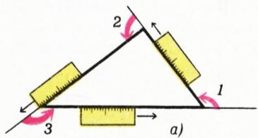
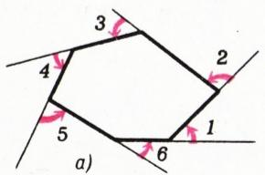
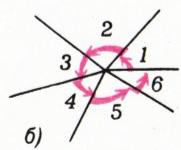
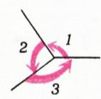
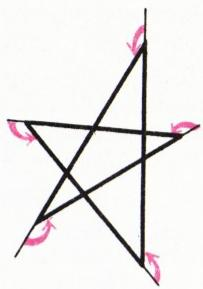
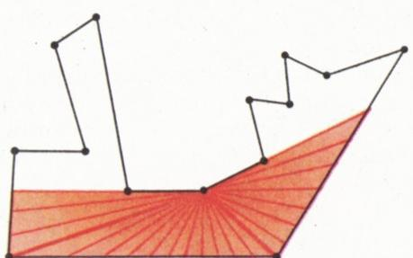
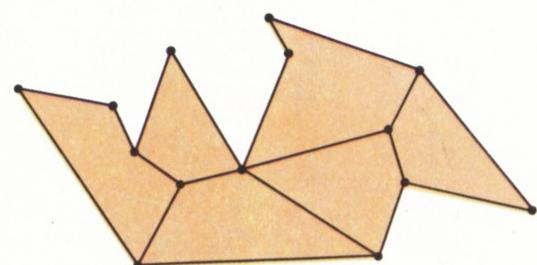
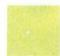
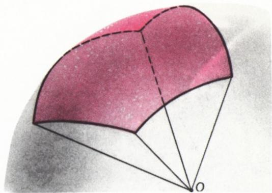

# 多边形剖分与欧拉定理

> **原标题**：О разрезаниях многоугольников и теореме Эйлера（《论多边形的剖分与欧拉定理》）
> **作者**：Н. Б. Васильев（Н. Б. 瓦西里耶夫）、В. Гутенмахер（В. 古滕马赫尔）
> **译自**：Квант 1988, № 2, с. 52–55
> **原文扫描**：https://www.kvant.digital/
> **主题**：多边形剖分、内角和定理、欧拉地图定理与多面体欧拉定理（$B-P+M=1$ 与 $B-P+\Gamma=2$）、球面多边形
> **难度**：★★（文字高中可读，归纳法与欧拉公式证明属高中／竞赛层面）
> **译者**：Claude（初译）／ 2026-06-24

---

> *本篇是《Kvant》"数学笔记"栏目的两则连续笔记：先在上一篇的基础上用剖分法证明任意（不一定是凸的）$n$ 边形内角和定理，进而通过双重计数把多边形、平面地图与凸多面体三个层面联系起来，得到欧拉定理；最后推广到球面上的多边形，给出球面三角形面积公式 $S=\alpha+\beta+\gamma-\pi$。*

## 开篇（承前篇）

*图 5*

……凸多边形的外角和等于 $360^{\circ}$（图 4）。

*图 3*

*图 4*

因为每个外角与和它相邻的内角相加得 $180^{\circ}$，所以 $n$ 边形全部内角之和等于 $180^{\circ}n - 360^{\circ} = 180^{\circ}(n - 2)$。

在教科书里，这个结果是用另一种方法证明的：把凸 $n$ 边形从同一个顶点出发的对角线剖分成 $n-2$ 个三角形；所有这些三角形的角之和，显然等于 $n$ 边形全部 $n$ 个角之和，因而是单个三角形角之和的 $n-2$ 倍。

任何 $n$ 边形——不一定是凸的——的内角之和也都是这样大。但证明要稍微复杂一些。

如果尝试沿着一个"复杂"多边形的边界走一圈并计算外角和——也就是转角之和——那么，第一，需要区分转向的方向：把逆时针方向的转角算作正的，顺时针方向的算作负的（这种转向对应于大于 $180^{\circ}$ 的内角）；第二，"沿一条不自交的闭合折线走完一圈后，总转角恰为一个整圈 $360^{\circ}$"这件事并不那么显然。请注意：沿图 5 中那条自交折线——五角星——走一圈时，直尺转了两个整圈，也就是说，星形各顶点处的外角之和

*图 1（局部，承前篇）*

等于 $720^{\circ}$（从而其内角之和恒等于 $180^{\circ}\times5 - 720^{\circ} = 180^{\circ}$；请你考虑组成这颗星形的若干三角形和凸五边形，来验证这个结果）。

任意（不一定是凸的）多边形的内角和定理，是可以通过剖分法来证明的。但这件事，我们留到下一篇笔记里再讲。

## 论多边形的剖分与欧拉定理

从现在起，我们把"多边形"理解为不自交的闭合折线在平面上所切下的一块区域。我们先兑现上一篇笔记中的承诺，用剖分法证明任意（不一定是凸的）多边形内角和定理。

当然，在一般情况下，已经不可能像凸多边形那样，找到一个"看得到"所有其余顶点的顶点。甚至连"总能找到一条完全落在 $n$ 边形内部的对角线"这件事也并不十分显然。但这个事实是成立的。

> **引理**. 在任一内角大于 $180^{\circ}$ 的非凸多边形的顶点处，都可以引一条完全落在此多边形内部的对角线。

考虑从这样一个顶点出发、指向多边形内部的一切射线（图 1）。它们"照亮"的，至少是两条边——可能只是部分地照亮。

## 论数学归纳法

这里我们以如下形式来使用数学归纳法原理。设某个含有自然数 $n$ 的断言对 $n=n_{0}$ 成立，并且由"它对一切满足 $n_{0}\leqslant n<N$ 的 $n$ 都成立"可以推出"它对 $n=N$ 也成立"。那么它对一切自然数 $n\geqslant n_{0}$ 都成立。

我们就用归纳法来证明所需的断言。

> **定理**. 任意（不一定是凸的）$n$ 边形的内角之和等于 $180^{\circ}(n-2)$。

对 $n=3$ 这是成立的。设我们的断言对一切 $n<N$（$n\geqslant3$）都成立。考虑某个 $N$ 边形。由引理，它可以用一条对角线剖成两个多边形。设其中一个含有大 $N$ 边形的 $K$ 条边——也就是说它是一个 $(K+1)$ 边形；另一个含有剩下的 $N-K$ 条边——从而它是一个 $(N-K+1)$ 边形。由归纳假设，它们的内角和分别为 $180^{\circ}(K-1)$ 与 $180^{\circ}(N-K-1)$。把两者相加，便得到 $N$ 边形全部内角之和为

$$
180^{\circ}(K-1) + 180^{\circ}(N-K-1) = 180^{\circ}(N-2).
$$

定理证毕。

*图 1：从某顶点引向多边形内部的射线"照亮"两条边；其间的分界射线指向一个顶点，从而给出一条内部对角线*

附带还可以得到这样的结论：不论用什么方式把 $n$ 边形用对角线剖成三角形，所得三角形的个数总是 $n-2$——因为所有三角形全部角之和，一方面等于 $180^{\circ}t$（其中 $t$ 是三角形个数），另一方面又等于 $n$ 边形的内角和，即 $180^{\circ}(n-2)$。

## 论可加性

在上面的论证里，我们用到了"内角和"这一量所具有的下述性质：用对角线把多边形剖开时，整体的角之和等于各部分角之和；具有类似性质的，还有图形的另一个几何特征量——面积。

把多边形剖成若干部分，用不同的方式去计算内角之和，就可以得到一些有趣的等式；这些等式里不再出现"角之和"，而只涉及多边形的个数、顶点数、边数。在下面这些例子中，我们约定只讨论"规范"的多边形剖分：在剖分中，任意两个多边形要么共一条边，要么共一个顶点，要么根本没有公共点（不允许出现"一个多边形的顶点落在另一个多边形的边上"这种情形）。

设 $n$ 边形被剖成 $T$ 个三角形，并且在 $n$ 边形内部还有 $k$ 个"节点"——即若干三角形的公共顶点。用两种方式计算角之和，并注意到每个内部节点处聚集的角之和为 $360^{\circ}$，便得到公式

$$
T = n + 2k - 2.
$$

把一个更为一般的、已经涉及任意多边形地图的公式，我们以定理的形式给出。

*图 2*

> **欧拉地图定理**. 设平面上选定了 $B$ 个点，并用 $P$ 条线段把它们连接起来，使得它们构成一个被规范地剖分成另外 $M$ 个多边形的多边形（图 2）。则有
>
> $$B - P + M = 1.$$

**证明**. 设大的（外侧的）多边形有 $n$ 条边（从而有 $n$ 个顶点），而把它所剖分成的 $M$ 个多边形的边数依次为 $n_{1}, n_{2}, \ldots, n_{M}$。在地图的全部 $B$ 个顶点中，有 $n$ 个位于边界上，而 $(B-n)$ 个位于大多边形的内部。用两种方式计算这 $M$ 个多边形全部角之和，便得到等式

$$
180^{\circ}(n_{1}-2) + \ldots + 180^{\circ}(n_{M}-2) = 180^{\circ}(2B - n - 2),
$$

由此

$$
n_{1} + n_{2} + \dots + n_{M} - 2M = 2B - n - 2.
$$

现在请注意：在和式 $n_{1}+n_{2}+\ldots+n_{M}+n$ 中，每条线段都出现两次——它或者同时是两个内部多边形的边，或者同时是一个内部多边形和外侧大多边形的边，因此

$$
n_{1} + n_{2} + \ldots + n_{M} + n = 2P.
$$

由此即得所需等式 $B - P + M = 1$。

| 多面体 | 草图 | $B$ | $P$ | $\Gamma$ |
|---|---|---|---|---|
| 立方体 | 见扫描 | $8$ | $12$ | $6$ |
| 四面体 | 见扫描 | $4$ | $6$ | $4$ |
| 五棱锥 | 见扫描 | $6$ | $10$ | $6$ |
| 八面体 | 见扫描 | $6$ | $12$ | $8$ |
| 十二面体 | 见扫描 | $20$ | $30$ | $12$ |
| **总有** |  | $B-P+\Gamma=2$ |  |  |

*图 3：若干凸多面体的 $B$、$P$、$\Gamma$ 值表*

由它容易推出一个更为人熟知的、对象不再是平面地图而是空间中凸多面体的欧拉定理。

> **欧拉多面体定理**. 对任意一个有 $B$ 个顶点、$P$ 条棱、$\Gamma$ 个面的凸多面体，成立等式：
>
> $$B - P + \Gamma = 2.$$

图 3 的表里列出了几个具体例子。要证明关于多面体的这个公式，只要设想：把它的线框骨架（各面是透明的）从位于某一面附近、但在多面体之外的一点 $C$ 处"拍一张照片"——用更数学化的语言说，就是把多面体的骨架从点 $C$ 中心投影到一张平面上。这样，"照片"上就得到一张多边形平面地图，有 $B$ 个顶点和 $P$ 条棱—线段，而内部多边形的个数 $M$ 等于 $\Gamma-1$，因为有一个面——即中心投影所在的那一面——在投影下变成了整个外侧的大多边形。图 4 中画出了立方体、四棱锥和八面体的地图。

| 地图（草图） | $B$ | $P$ | $M$ |
|---|---|---|---|
| 立方体 | $8$ | $12$ | $5$ |
| 四棱锥 | $5$ | $8$ | $4$ |
| 八面体 | $6$ | $12$ | $7$ |
| **总有** | $B-P+M=1$ |  |  |

*图 4：立方体、四棱锥、八面体的骨架中心投影所得平面地图*

## 一般欧拉定理

利用内角和来证明欧拉定理，做法虽漂亮，但多少有些人为。事实上，欧拉定理在更一般的情形下也成立——例如，对球面上任意一张有 $B$ 个顶点、$P$ 条棱、$\Gamma$ 个国家的地图都成立，其中"棱"可以是任意曲线段，只要每个国家的边界都由若干首尾相接的棱组成（特别地，国家内部不能有"属于别的国家的洞"）。在这样大的普遍性下证明该定理，一种可行的思路，是基于"把其中一个国家缩成一点"的归纳法。

关于球面上多边形的内角和、以及球面地图的欧拉定理，下一篇笔记专门讨论。

## 球面多边形的内角和

在球面上，我们将考察那种其边为大圆弧的多边形。这样的多边形，可以看作球面与一个顶点在球心 $O$ 处的多面角之交（图 1）。球面上多边形之"角"的大小，自然应取为从该顶点处对其"两边"所作切线之间的夹角；由于这些切线都垂直于从 $O$ 引向该顶点的半径，所以球面多边形在该顶点的角，就等于该半径处的那个二面角。

我们在上一篇笔记里一笔带过地提到过的"内角和"与"面积"之间的类比，在这里变得触手可及：两个量中，一个可以用另一个直接表出。

> **定理**. 球面上多边形的面积，正比于它的内角和与 $180^{\circ}(n-2)$（其中 $n$ 是多边形的顶点数）之差。

比例系数只与球的半径有关。取球的半径为单位长（于是球的面积等于 $4\pi$），并约定角的单位用弧度而非度数（$180^{\circ}$ 对应 $\pi$ 弧度）。则单位球面上 $n$ 边形的面积等于

$$
\alpha_{1}+\alpha_{2}+\ldots+\alpha_{n} - \pi(n-2),
$$

其中 $\alpha_{1}, \alpha_{2}, \ldots, \alpha_{n}$ 是它的各角。

*图 1：球面多边形*

特别地，单位球面上一个内角为 $\alpha$、$\beta$、$\gamma$ 的三角形，其面积为 $\alpha+\beta+\gamma-\pi$。

我们用球的"八分之一"来验证公式 $S=\alpha+\beta+\gamma-\pi$：这"八分之一"是由过球心的三张互相垂直的平面从球面切下的部分；它有三个角，各为 $\pi/2$，按公式它的面积为 $3\pi/2-\pi=\pi/2$——确实，这正好是整球面积 $4\pi$ 的八分之一。

把定理证到球面三角形的情形就足够了：一般的公式，可以像证明平面 $n$ 边形内角和定理那样，从这一特例通过剖分与数学归纳法得到。

延长球面三角形的三边，我们得到三个大圆，它们把球面分成 $8$ 个三角形（不妨想象这三个大圆所在的、相交于球心 $O$ 的三张平面，把空间分成 $8$ 个三面角——每个三面角在球面上都截出一个三角形）。把我们所考察的三角形的角记作 $\alpha$、$\beta$、$\gamma$，其面积记作 $S$；把与它相邻的三个三角形（分别贴着对着 $\alpha$、$\beta$、$\gamma$ 各角的那一边）的面积记作 $a$、$b$、$c$。把它与每一个相邻三角形合在一起看，我们的三……

---

## 译者注与校对说明

1. **OCR 校正**：本文由 MinerU 对 1988 年 №2 第 52–55 页扫描件做俄文 OCR 后翻译。已校正的 OCR 问题主要有：
   - 公式排版残缺：原文 p54 显示数学块处 OCR 给出了断裂的 `180°(n₁−2)+…+180°(n_M−2)=` 后接空行，已据上下文补全为 $180^{\circ}(2B-n-2)$（右侧由角之和的双重计数给出）。
   - 俄文 OCR 常见混淆：`Puc.` = `Рис.`（"图"的缩写）；表头中 `Γ`（希腊大写 Gamma，俄文中表示"面"грань）与拉丁 `r`/`Г` 一致，已统一为 $\Gamma$。
   - `4л` 应为 $4\pi$（OCR 把希腊字母 $\pi$ 误识为西里尔字母 `л`）；正文已校正为 $4\pi$。
   - `provenеденному` 是 OCR 把俄文 `проведенному`（"所引的"）误插入了拉丁词根，已校正。
   - 项目符号 / 图序在原扫描中跨页，图号体系（图 1、2、3、4、5）已按 meta.json 的 figures[].std_name 与扫描页位置对齐：p52 含图 1—5（星形、外角、直尺绕行等，承前篇），p53 含"剖分"图 1，p54 含地图图 2 与多面体表图 3、骨架投影表图 4，p55 含球面多边形图 1。
   - `а/б/в` 等俄文小写字母项目在本文未出现于正文。
2. **术语**：遵循《01_工作规范.md》对照表。关键术语：многоугольник=多边形，разрезание=剖分，диагональ=对角线，индукция=归纳，лемма=引理，теорема=定理，доказательство=证明，вершина=顶点，сторона=边，угол=角，грань=面（$\Gamma$），ребро=棱（$P$），многогранник=多面体，выпуклый=凸的，двугранный угол=二面角，большой круг=大圆，центральная проекция=中心投影。欧拉公式中 $B$=вершины（顶点数）、$P$=рёбра（棱／边数）、$\Gamma$=грани（面数）、$M$=内部多边形数。
3. **背景与衔接**：本篇由两则"数学笔记"衔接而成。第一则（"论多边形剖分与欧拉定理"）承接上一篇关于内角和的笔记，给出任意 $n$ 边形内角和定理的剖分—归纳证明，并由此推出平面地图欧拉定理 $B-P+M=1$ 与凸多面体欧拉定理 $B-P+\Gamma=2$。第二则（"球面多边形的内角和"）把"角之和—面积"类比搬到球面，给出球面三角形面积公式 $S=\alpha+\beta+\gamma-\pi$（即著名的吉拉尔／笛沙格公式），并预告以"把一国缩为一点"的归纳法处理球面地图的欧拉定理。原文末句"我们的三……"系杂志排版到此页为止，结论延续到下期。
4. **图表**：原文插图共 10 张，由 MinerU 从整页扫描中自动裁出，存于 `images/1988_02_vasilev_C03/fig_*.png`，文件名严格对应 meta.json 的 std_name。p54 的两张表（多面体 $B/P/\Gamma$ 表、骨架投影 $B/P/M$ 表）原为图片表格，已据 OCR 文本与扫描页核验后用 Markdown 重排。

## 建议讨论题

1. 引理断言："任一内角大于 $180^{\circ}$ 的非凸多边形顶点处，必能引一条完全落在多边形内部的对角线。" 请你用自己的话把这个"照亮两条边"的论证补完整——为什么"照亮"了两条不同边的两条射线之间的分界射线，一定指向某个顶点？
2. 在剖分—归纳证明里，关键一步是用一条内部对角线把 $N$ 边形剖成 $(K+1)$ 边形和 $(N-K+1)$ 边形。如果把"凸多边形从一个顶点引全部对角线"的标准证法硬搬到非凸情形，会在哪一步失效？
3. 平面地图欧拉定理 $B-P+M=1$ 与多面体欧拉定理 $B-P+\Gamma=2$ 仅差一个 1，而这个 1 正来自"中心投影把一面变成了外侧大多边形"。请据此解释：为什么把地图放到球面上（而不是平面上）后，公式会变成 $B-P+\Gamma=2$？
4. 球面三角形面积公式 $S=\alpha+\beta+\gamma-\pi$ 表明：球面三角形内角和恒大于 $\pi$，且"超出量"正比于面积。这与平面三角形"内角和恰为 $\pi$"形成对照。请你想一想：是否存在内角和小于 $\pi$ 的"三角形"？它该住在什么样的曲面上？

---

> **版权说明**：原文版权归 MCCME（莫斯科连续数学教育中心）及作者继承者所有。本译文为非商业、自用、数学圈内部参考，未获授权不得公开分发。

> **复用说明**：本译文的俄文 OCR 原文与所有插图均存档于 `ocr/1988_02_vasilev_C03/`（`ru.md` 为合并 OCR 文本，`meta.json` 为图映射）。如对译文质量不满意，可直接基于 `ru.md` 重译，无需重跑 OCR。
