# 平面图

> **原标题**：Плоские графы
> **作者**：В. Г. Болтянский（V. G. 博尔强斯基，1915—1995，苏联／俄罗斯数学家，苏联科学院通讯院士，数学教育家）
> **译自**：Квант 1981, № 7, с. 11–16
> **原文扫描**：https://www.kvant.digital/data/kvant_1981_7/jpg/0011.jpg
> **主题**：平面图（图论、拓扑）、库拉托夫斯基定理、相交指数、若尔当定理
> **难度**：★★★（拓扑与图论的组合论证，属大学／竞赛层面）
> **译者**：Claude（初译）／ 2026-06-24

---

*图 1：可嵌入平面的两个图（四面体棱图与立方体棱图）*

本文继续研究图的拓扑性质，这一研究始于本刊上一期。这一次要谈的是平面图的一些深刻性质。研究它们需要请出「抽象代数的魔鬼」及其爪牙之一——一个名叫**相交指数**的不变量。

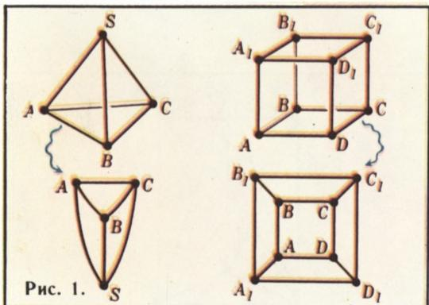

*三座房子与三口井*

## 三座房子与三口井

如果一个图 $A$ 在平面上存在一个与之同胚的图 $A'$，则称图 $A$ **可嵌入平面**。例如，由四面体各棱组成的图、由立方体各棱组成的图，都可以嵌入平面（图 1）。下面给出两个**不可**嵌入平面的图的例子。

**例 1（「房子与井」）。** 平面上给定六个点：$D_{1}, D_{2}, D_{3}$（房子）和 $K_{1}, K_{2}, K_{3}$（井）；问能否在平面上从每座房子到每口井各修一条小路，使得任何两条小路都不相交？

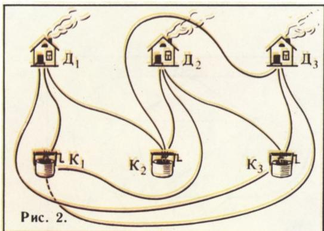

*图 2：图 $P_1$（房子与井）*

如果我们画出除一条之外的所有小路，那么最后一条小路在平面上已经「无地可容」。由此可见，图 2 所示的图 $P_{1}$ 不能嵌入平面。

**例 2.** 设 $P_{2}$ 是有五个顶点 $M_{1}, M_{2}, M_{3}, M_{4}, M_{5}$ 的完全图，即一个没有环、且任一对顶点之间都有一条边的图。图 3 画出了这个图的九条边，而第十条被中断了：它在平面上「无地可容」。同样可见图 $P_{2}$ 不能嵌入平面。

结果是，图 $P_{1}$、$P_{2}$ 确实都不能嵌入平面。当然，例 1 和例 2 中所作的论证（「平面上无地可容」）并不是证明。证明留待后文；眼下我们暂且把 $P_{1}$、$P_{2}$ 不能嵌入平面当作已知事实，来看图 4。图中画出了一个图 $A$，其中标出了一个「蓝色」子图。这个子图与 $P_{1}$ 同胚，因而图 $A$ 不能嵌入平面（请自行说明！）。一般地，若某个图 $G$ 含有一个与 $P_{1}$ 或 $P_{2}$ 同胚的子图，则图 $G$ 不能嵌入平面。波兰数学家库拉托夫斯基（Куратовский）证明了其逆定理：若一个图不能嵌入平面，则它含有一个与 $P_{1}$ 或 $P_{2}$ 同胚的子图。

我们不证明库拉托夫斯基定理，而只限于证明 $P_{1}$ 和 $P_{2}$ 不能嵌入平面。为此需要

## 相交指数

设 $a$、$b$ 是平面上的两条线段，每一条都不含另一条的端点。若这两条线段相交，则记 $I(a, b) = 1$；若不相交，则记 $I(a, b) = 0$。数 $I(a, b)$ 称为线段 $a$ 与 $b$ 的**相交指数**。若线段 $a$、$b$ 中有一条含另一条的端点，则数 $I(a, b)$ 无定义。

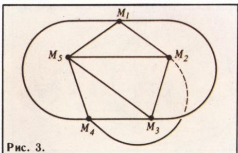

*图：相交指数的定义*

设 $x=\{a_{1}, a_{2}, \ldots, a_{m}\}$ 和 $y=\{b_{1}, b_{2}, \ldots, b_{n}\}$ 是平面上两个线段集合，且对任意 $i, j$，指数 $I(a_{i}, b_{j})$ 都有定义。

若和数 $\sum_{i,j} I(a_i, b_j)$（即线段 $a_{1}, \ldots, a_{m}$ 中每一条与线段 $b_{1}, \ldots, b_{n}$ 中每一条的相交指数之和）为偶数，则令 $I(x, y) = 0$；若此和数为奇数，则令 $I(x, y) = 1$。数 $I(x, y)$ 称为集合 $x$ 与 $y$ 的**相交指数**。这个数在本文中将扮演主要角色。

下面考虑边为线段的图。若在这种图的每一个顶点处汇聚的边数都是偶数，我们称之为**圈**（цикл）。我们来证明：对于平面上任意两个相交指数有定义的圈 $x$、$y$，

## 相交指数等于零

按定义，圈的每个顶点至少汇聚两条边。由上一篇习题 7 的结论可知，圈必含一条与圆周同胚的折线。若从圈中删去这条折线后还至少剩一条线段，则剩下的图仍是圈。在剩下的圈里又可以再分出一条与圆周同胚的折线，如此继续。上述论证表明：

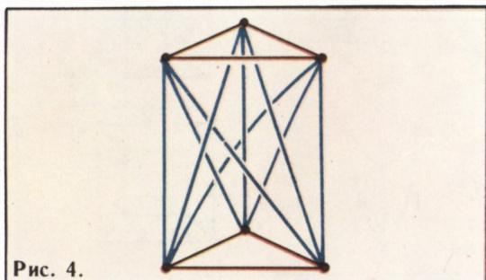

*图：圈分解为与圆周同胚的折线*

每个圈都是有限条折线的并，每条折线都与圆周同胚（且这些折线两两没有公共节）。

因此，只要在圈 $x$、$y$ 各由一条与圆周同胚的折线组成的情形下证明命题即可。把圈 $x$、$y$ 的顶点稍稍挪动一下，我们可以做到：相交指数 $I(x, y)$ 不变，且圈 $x$ 的任一条线段都不与圈 $y$ 的任一条线段平行。现选一条直线 $l$，它不平行于连接 $x$ 的任一顶点与 $y$ 的任一顶点的任何直线，然后将圈 $x$（作为一个刚体）沿平行于 $l$ 的方向连续平移（图 5）。相交指数 $I(x, y)$ 只可能在下面这些时刻发生变化：运动中圈 $x$ 的顶点穿过静止圈 $y$ 的边的时刻，或圈 $x$ 的边穿过圈 $y$ 的顶点的时刻（由于直线 $l$ 的选法，圈 $x$ 的顶点不可能落到圈 $y$ 的顶点上）。然而如图 6 所示，当圈 $x$ 的某条边 $a$ 穿过圈 $y$ 的一个顶点 $q$ 的瞬间，交点个数的奇偶性不变，因而相交指数 $I(x, y)$ 不变。圈 $x$ 的顶点穿过圈 $y$ 的边的情形也同样如此。

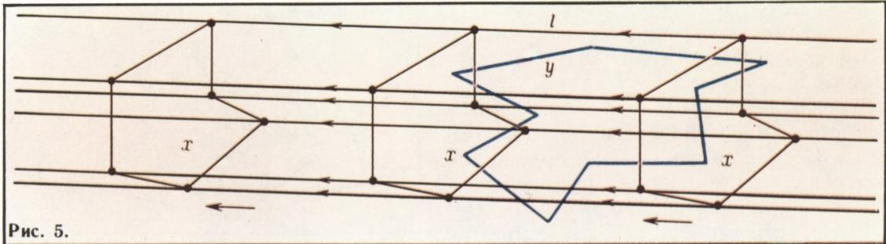

*图 5、6：平移圈 $x$ 时交点个数的奇偶性不变*

于是，在整个运动过程中相交指数都不变，它是一个不变量。而最终圈 $x$ 会到达一个与 $y$ 完全没有公共点的位置（见图 5），此时相交指数变为零。因此原来也有 $I(x, y) = 0$。

## 完全五点图的不可嵌入性

现在我们可以证明例 2 中的图 $P_{2}$ 不能嵌入平面。把平面上 $5$ 个点两两用折线连接，暂且不管它们是否相交。我们约定，把没有公共端点的边折线称为**不相邻**的。记 $J$ 为所有不相邻的边对的相交指数之和。当然，数 $J$ 依赖于边在平面上是怎样画的。如果能画得没有交点，数 $J$ 就等于零。然而我们要证明，无论

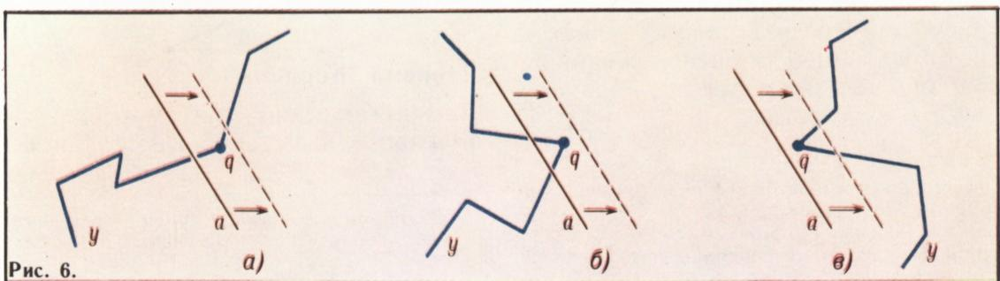

*图 7：移动边 $M_{1}M_{2}$ 时与圈 $y$ 的相交情况*

怎样画这些边，数 $J$ 总是奇数。这样就证明了图 $P_{2}$ 不能嵌入平面。

设我们改变一条边的位置，比如 $M_{1}M_{2}$。记这条边的原位置为 $x$，新位置为 $x'$。与边 $M_{1}M_{2}$ 不相邻的有三条边（$M_{3}M_{4}$、$M_{4}M_{5}$、$M_{5}M_{3}$）。闭合折线 $M_{3}M_{4}M_{5}$（可能自交）是一个圈，记之为 $y$（图 7）。折线 $x$ 与 $x'$ 合起来也是一个圈。既然任意两个圈的相交指数都等于零：

$$
I (x \cup x ^ {\prime}, y) = 0,
$$

边 $x$ 与圈 $y$（即与它所有不相邻的边）的交点个数，就和边 $x'$ 与圈 $y$ 的交点个数有相同的奇偶性。

由此可见，把边 $x$ 换成边 $x'$ 时，数 $J$ 的奇偶性不变。

由所证可知，无论边在平面上怎样布置，数 $J$ 总有同一个奇偶性。事实上，若给定两个不同的边的布置，则先把第一个布置的一条边换成第二个布置中对应的边，再换一条、再换一条……我们逐步把第一个布置换成第二个布置，而由所证，数 $J$ 的奇偶性始终不变。

于是，要么对所有布置数 $J$ 都是偶数，要么对所有布置数 $J$ 都是奇数。在图 3 中只有一个交点（当然，该图中的曲边可以换成折线）。因此在图 3 中数 $J$ 等于 $1$，从而对任何边的布置它都是奇数，故 $P_{2}$ 不能嵌入平面。

## 习题

1. 证明例 1 中的图 $P_{1}$ 不能嵌入平面。

2. 图的边取正 $n$ 边形（$n>3$）$^{*}$ 的边和最短对角线。证明：当 $n$ 为偶数时该图可嵌入平面，当 $n$ 为奇数时则不能。

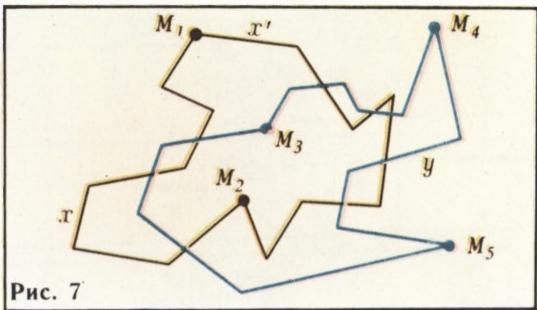

*习题 3、4：正多边形的边与最长对角线*

3. 图的边取正 $2n$ 边形的边和最长对角线$^{*}$。证明：当 $n \geqslant 3$ 时该图不能嵌入平面。

4. 图的边取正 $(2n+1)$ 边形的边和最长对角线$^{*}$（共 $2n+1$ 条）。证明该图不能嵌入平面。

## 难道不能更简单些吗？

上面（见图 5、6）我们证明了平面上任意两个圈的相交指数等于零。读者也许会提出下面这种更简单的证明：沿闭合折线 $x$ 走一遍；在与闭合折线 $y$ 的每一个交点处，我们要么进入折线 $y$ 的内部，要么从内部走到外部；由于进入点与走出点是交替出现的，所以回到出发点时，进入点的个数等于走出点的个数；因而折线 $x$、$y$ 交点的总数为偶数。

然而这个证明只有在「内部」这个概念的含义已经弄清楚之后，才能承认是严格的；而这个概念远不像初看那样简单。弄清这个概念的含义，正是

## 若尔当定理

与圆周同胚的闭合曲线称为**简单闭合曲线**。若尔当定理说的是：平面上的任何一条简单闭合曲线都把平面分成两个区域（内部与外部）。我们来解释这一定理的含义。设 $l$ 是平面上的一条简单闭合曲线。取两个不在曲线 $l$ 上的点 $p$、$q$。若 $p$、$q$ 可以用一条不与 $l$ 相交的折线连接，就认为 $p$、$q$ 关于曲线 $l$ 处在同一区域；若连接 $p$、$q$ 的任何折线都必然与 $l$ 相交，就认为 $p$、$q$ 处在不同的区域。若尔当定理断言：曲线 $l$ 恰好在平面上确定了两个区域。

不要以为若尔当定理断言的是某种完全显然的事实。它看上去之所以「显然」，只是因为浮现在脑海里的往往是些非常简单的曲线（圆周、凸多边形的边界等等）。一般而言，若尔当定理的论断并不那么显然。图 8 画了一条简单闭合折线（可以用铅笔沿曲线描一遍来验证）。然而这条曲线是否把平面分成两个区域，却远非显然；例如，点 $a$、$b$、$c$、$d$ 究竟在哪个区域（内部还是外部），就不容易一眼看出。

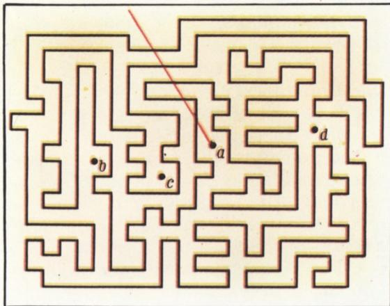

*图 8：一条简单闭合折线构成的「迷宫」*

我们给出一个运用相交指数的若尔当定理证明。这里只限于 $l$ 不是任意一条平面上的简单闭合曲线、而是一条简单闭合折线的情形。

设 $b_1, b_2, \ldots, b_n$ 是折线 $l$ 的相继各节。作一条在点 $a$ 处与节 $b_1$ 相交的线段，并在此线段上取两点 $p$、$p'$，它们分居节 $b_1$ 两侧且到 $b_1$ 等距。过点 $p$ 作一条平行于节 $b_1$ 的线段，直到它与节 $b_1$、$b_2$ 夹角的平分线相交（图 9）；从这一交点再作一条平行于 $b_2$ 的线段，直到它与节 $b_2$、$b_3$ 夹角的平分线相交，如此继续。结果得到一条折线 $x$，其各节到折线 $l$ 对应各节等距。若此时点 $p$ 取得足够接近 $a$，则所作的曲线 $x$ 不与 $l$ 相交，且沿曲线 $l$ 走一圈后应回到 $p$ 或 $p'$。然而易见折线 $x$ 不可能到达 $p'$：若折线 $x$ 连接 $p$ 与 $p'$，则把线段 $pp'$ 并到 $x$ 上就得到一个圈，它与圈 $l$ 仅在唯一的点 $a$ 相交，即这两个圈的相交指数等于 $1$，这不可能。因此 $x$ 是一条从 $p$ 出发、沿折线 $l$ 走一圈、又回到 $p$ 的闭合折线。类似地可得一条从 $p'$ 出发、沿折线 $l$ 走一圈、又回到 $p'$ 的闭合折线 $x'$。

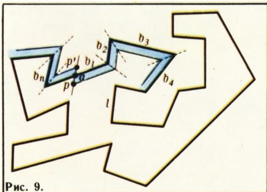

*图 9：构造与 $l$ 平行的折线 $x$（$x'$）*

现设 $c$ 是不在曲线 $l$ 上的任意一点。那么它可以不穿过 $l$ 地与 $p$ 或 $p'$ 相连：从 $c$ 引一条与曲线 $x$、$x'$ 相交的射线，从 $c$ 沿射线走到它与曲线 $x$、$x'$ 之一的第一个交点，再沿该曲线走到 $p$ 或 $p'$ 即可。

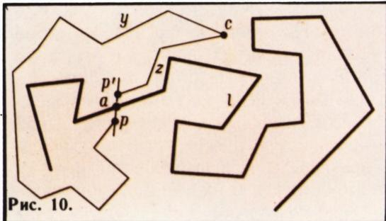

*图 10：两个区域不可混淆的反证*

不难明白，若从点 $c$ 引出两条不同的折线 $y$、$z$，它们都不与 $l$ 相交且都终止于 $p$、$p'$ 之一，则二者必终止于同一点。事实上，若折线 $y$ 连接 $c$ 与 $p$、而折线 $z$ 连接 $c$ 与 $p'$（图 10），则折线 $y \cup z$ 与线段 $pp'$ 合成一个圈，它与圈 $l$ 的相交指数等于 $1$，这不可能。

至此已不难证明若尔当定理。记 $U$ 为平面上所有可不穿过 $l$ 地与 $p$ 相连的点组成的集合，记 $V$ 为所有可不穿过 $l$ 地与 $p'$ 相连的点组成的集合。则 $U$ 与 $V$ 就是曲线 $l$ 把平面分成的两个区域。事实上，若点 $c_{1}$、$c_{2}$ 属于同一区域（设为 $U$），则存在不与 $l$ 相交的折线 $y_{1}$、$y_{2}$，分别把 $c_{1}$、$c_{2}$ 与点 $p$ 相连。它们的并就是一条连接 $c_{1}$、$c_{2}$ 且不与 $l$ 相交的折线。可见属于同一区域的两点可用不与 $l$ 相交的折线相连。若点 $c_{1}$、$c_{2}$ 属于不同区域（$c_{1} \in U$，$c_{2} \in V$），则它们不能用不与 $l$ 相交的折线相连（否则如上所述，就会得到一个与 $l$ 相交指数为 $1$ 的圈）。至此若尔当定理（简单闭合折线的情形）证毕。

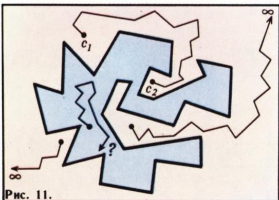

*图 11：外部区域是无界的，内部区域是有界的*

**注.** 平面上所有「远方」的点关于曲线 $l$ 都位于同一区域（图 11）。因此曲线 $l$ 所确定的两个区域中，一个无界、另一个有界。无界的那个区域称为**外部**，有界的那个称为**内部**。外部区域的点有这样的特征：从这些点可以引出不与 $l$ 相交、且能任意远离 $l$ 的折线；内部区域的点则没有这一性质。

## 习题

5. 若折线 $l$ 非常复杂，则单凭肉眼很难判断点 $a$ 究竟在哪个区域（内部还是外部）：为此需要弄清，从点 $a$ 出发能否走出曲线 $l$ 构成的「迷宫」（见图 8）。证明：若从点 $a$ 出发、且不经过折线 $l$ 的任一顶点的射线与 $l$ 相交于偶数个点，则点 $a$ 在外部区域（即能走出「迷宫」）；若相交于奇数个点，则点 $a$ 在内部区域。

6. 平面上作了 $k$ 条折线，每条都连接两个给定的点 $p$、$q$。证明：若这些折线两两之间除 $p$、$q$ 外没有其他公共点，则平面被分成 $k$ 个区域。

---

## 译者注与校对说明

1. **OCR 校正**：本文由 MinerU 对扫描页（p11–p16）做俄文 OCR 后翻译。已据扫描页校正若干 OCR 问题：原文小标题「Невложимость полного пятивершин- ного графа」中间断行，译为「完全五点图的不可嵌入性」；图 3 在 OCR 中无独立图块（仅出现在正文中），图 1 至图 11 的编号据上下文及配图位置确定（原文图块无题注，OCR 图序由译者据正文「见图 N」对应补出）；公式 $I(x \cup x^{\prime}, y) = 0$ 与 OCR 一致。其余公式、记号均与扫描页核对。本文 OCR 文本质量较高，未见 ш/щ、и/й 等典型混淆。

2. **术语**：核心术语依《01_工作规范.md》对照表与图论通行译法：вложимый в плоскость = 可嵌入平面；плоский граф = 平面图；граф = 图；ребро = 边；вершина = 顶点；цикл = 圈（本文特指每个顶点度数为偶数的图，即欧拉图意义下的「圈」）；гомеоморфный = 同胚；индекс пересечения = 相交指数；инвариант = 不变量；простая замкнутая линия = 简单闭合曲线；теорема Жордана = 若尔当定理；теорема Куратовского = 库拉托夫斯基定理；ломаная = 折线；звено = 折线的节。**圈**（цикл）在本文的定义与中学「环」不同，须按文中定义理解。

3. **记号约定**：原文「房子」用拉丁字母 $D$（домики）、「井」用 $K$（колодцы），完全图记 $P_2$（五点）、$P_1$（房子—井，即 $K_{3,3}$ 的细分）。$P_1$ 即通常所谓的「三个公用设施图」$K_{3,3}$，$P_2$ 即 $K_5$——二者正是库拉托夫斯基定理中两个禁用子图，本文用相交指数这一组合不变量给出了 $K_5$ 不可嵌入平面的初等证明。

4. **图表**：原文插图（图 1–11）由 MinerU 从整页扫描自动裁出，存于 `images/1981_07_boltyanskij_C04/fig_pXX_NN.png`；图 8 带原题注「Рис. 8.」，其余图块原书无题注，图注由译者据正文补写。本文无表格。

## 建议讨论题

1. 本文用「相交指数」证明了 $K_5$（$P_2$）不能嵌入平面。能否用完全相同的思路证明 $K_{3,3}$（$P_1$，三座房子三口井）也不能嵌入平面？关键差别在哪里？（提示：$K_{3,3}$ 中不相邻的边对的相交指数之和 $J$ 的奇偶性与 $K_5$ 有何不同？）
2. 库拉托夫斯基定理说「不可嵌入平面当且仅当含 $K_5$ 或 $K_{3,3}$ 的同胚子图」。本文只证了必要性方向的「若含…则不可嵌入」这一半（且只证 $K_5$）。你能体会到为什么充分性方向（「若不可嵌入则必含…」）难得多吗？
3. 若尔当定理「看上去显然」实则不然——图 8 的「迷宫」就是反例。请用习题 5 的射线计数法，亲手判断图 8 中点 $a$、$b$、$c$、$d$ 各在内部还是外部。
4. 本文的「相交指数」与拓扑学中的**模 2 相交数**（mod 2 intersection number）是同一回事。试想想：为什么「相交数模 2」会是连续变形下的不变量？这跟「橡皮膜上的几何」有什么关系？

---

> **版权说明**：原文版权归 MCCME（莫斯科连续数学教育中心）及作者继承者所有。本译文为非商业、自用、数学圈内部参考，未获授权不得公开分发。原文扫描见 [kvant.digital](https://www.kvant.digital/data/kvant_1981_7/jpg/0011.jpg)。

> **复用说明**：本译文的俄文 OCR 原文与所有插图均存档于 `ocr/1981_07_boltyanskij_C04/`（`ru.md` 为合并 OCR 文本，`meta.json` 为图映射）。如对译文质量不满意，可直接基于 `ru.md` 重译，无需重跑 OCR。
