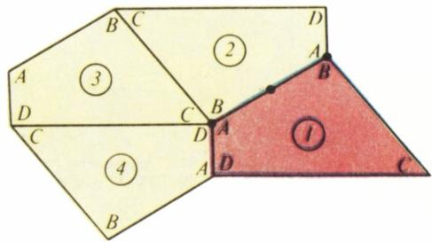
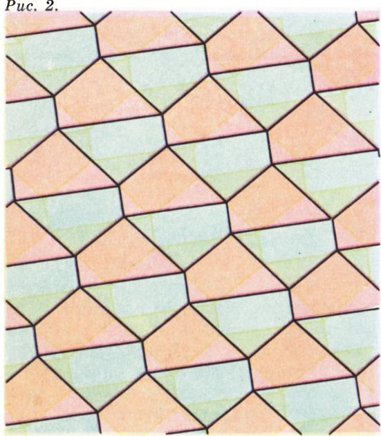
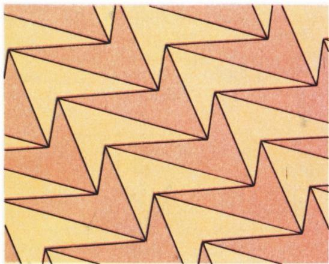
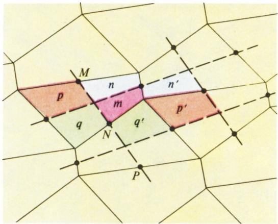
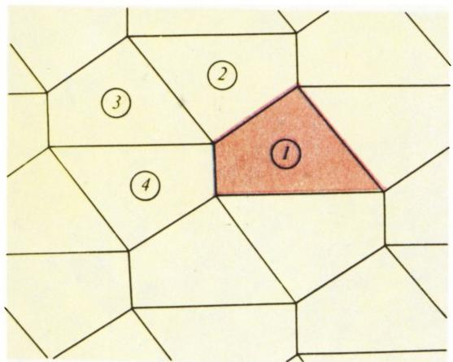
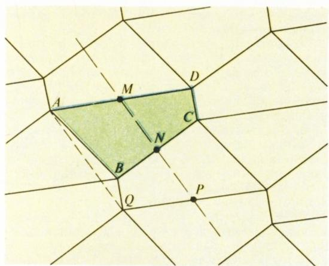
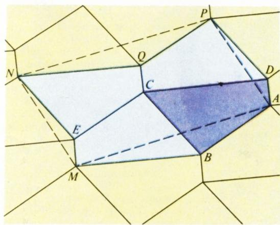
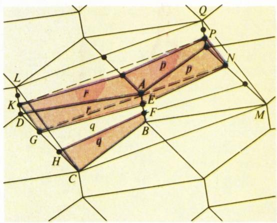

# 四边形铺砌

> **原标题**：Паркет из четырехугольников
> **作者**：В. Г. Болтянский（V. G. 博尔强斯基，1915—2001，苏联数学家，数理科学博士，苏联科学院精密机械与计算技术研究所，几何与拓扑、凸几何、控制论方向）
> **译自**：Квант 1989, № 11, с. 57–60
> **原文扫描**：https://www.kvant.digital/data/kvant_1989_11/jpg/0057.jpg
> **主题**：几何（用中心对称铺砌平面，及其在四边形一系列性质中的应用）
> **难度**：★★（初中几何基础即可读懂铺砌构造；中位线、等积变形等证明属高中／竞赛层面）
> **译者**：Claude（初译）／ 2026-06-24

---

## 用四边形铺平面

在第六届莫斯科数学奥林匹克（1940 年）上有这样一道题：用任意形状的一个给定四边形来铺砌地面，即用它与它的副本无重叠、无缝隙地填满整个平面。这道题的解可以借助于中心对称得到。把四边形 $ABCD$ 关于边 $AB$ 的中点作中心对称。在图 1 中，原来的四边形标为 1 号，对称得到的四边形标为 2 号。接下来，把四边形 2 关于其边 $BC$ 的中点作中心对称，得到四边形 3，再把 3 关于其边 $CD$ 的中点作中心对称，得到四边形 4。于是四边形 1、2、3、4 的角 $A$、$B$、$C$、$D$ 恰好围在它们的公共顶点处。由于四边形四内角之和等于 $360^{\circ}$，这四个四边形便正好围绕它们的公共顶点无缝隙、无重叠地铺满一周。对每一个新四边形的每一个顶点都可以同样地做下去，这样就在整个平面上铺出了密铺（图 2）。

*图 1：把四边形依次关于各边中点作中心对称*

把密铺中的四边形染成两种颜色（图 3）。在这样的染色下，两个同色的四边形可由一个平移相互得到，而两个异色的四边形则可由一个中心对称相互得到。注意，原来的四边形甚至可以是**凹的**——这种情形下也能铺出密铺（图 4）。

*图 2：四边形铺满整个平面*

*图 3：两种颜色的染色*

*图 4：凹四边形也能铺砌*

## 用密铺解四边形问题

这样构造出来的密铺，使我们能够解决一系列与四边形性质有关的问题。下面每一道题的解，其实都可以不用密铺来写：只需保留解题所必需的那几个四边形，而把密铺其余的「痕迹」擦掉。不过，借助密铺来寻找解法要容易得多。

**题 1.** 用纸剪了两个相同的凸四边形。其中一个沿一条对角线剪开，另一个沿另一条对角线剪开。证明：这样得到的四个三角形可以拼成一个平行四边形。

这道题的解，只要端详封面（封二）上的那幅密铺图，就变得一目了然了。

**题 2.** 在一个凸四边形中作中位线，即连接对边中点的线段。证明：由此得到的四块可以拼成一个平行四边形。

**解.** 在图 5 中，密铺的一个片段被中位线分成了若干块（中位线 $MN$ 与 $NP$ 在同一条直线上，因为它们关于点 $N$ 对称；其他中位线同样如此）。这些块 $m$、$n$、$p$、$q$ 拼成密铺中的一个四边形，而与它们相等的块 $m'$、$n'$、$p'$、$q'$ 则拼成一个平行四边形。

*图 5：中位线切分密铺片段，四块重拼成平行四边形*

> **译者注**：原文此处第 5 题插图与第 6 题插图位置交错（OCR 将 fig\_p58\_04 与 fig\_p58\_01 与正文顺序错配）。译文按论证逻辑重新归位：图 5 对应题 2 的中位线切分（fig\_p58\_01），图 4 对应凹四边形密铺（fig\_p58\_04）。

**题 3.** 证明：若连接四边形两条对边中点的那条中位线，等于另外两条对边之和的一半，则这个四边形是梯形（或平行四边形）。

**解.** 在图 6 中，$MN$ 与 $NP$ 是中位线；线段 $AQ$ 与 $MP$ 相等且平行（因为 $AM$ 与 $QP$ 相等且平行）。若 $MN = \dfrac{1}{2}(AB + CD)$，即 $AQ = MP = AB + BQ$，则点 $B$ 落在线段 $AQ$ 上。于是 $AB \parallel CD$，即 $ABCD$ 是梯形。

*图 6：题 3——由中位线等于对边半和推出梯形*

**题 4.** 在古巴比伦，人们计算四边形 $ABCD$ 的面积时，是把两双对边之和的一半相乘：

$$
S = \frac{AB + CD}{2} \cdot \frac{AD + BC}{2}.\tag{1}
$$

证明：这种算法仅当四边形为矩形时才给出正确结果。

**解.** 在图 7 中，四个被涂色的四边形拼成的图形，与平行四边形 $AMNP$ 等积（这可由 $\triangle AMB = \triangle PNQ$ 与 $\triangle MEN = \triangle ADP$ 得出）。进而

$$
\begin{array}{l}
AB + CD = AB + BM \geqslant AM,\\
AD + BC = AD + DP \geqslant AP.
\end{array}\tag{2}
$$

*图 7：题 4——巴比伦面积公式仅对矩形成立*

现设四边形 $ABCD$ 不是平行四边形，即点 $B$、$D$ 中至少有一个不在平行四边形 $AMNP$ 的边界上。那么在 (2) 中至少有一个不等式是严格的，于是 (1) 的右端大于平行四边形 $AMNP$ 面积的四分之一，即大于 $S$。由此可见，只要 $ABCD$ 不是平行四边形，公式 (1) 就一定不对。对于本身不是矩形的平行四边形，公式 (1) 显然也不对。

**题 5.** 作两条直线，把凸四边形的两条对边都三等分，并且这两条直线在四边形内部不相交。证明：夹在这两条直线之间的部分，占四边形面积的三分之一。

**解.** 在图 8 中，点 $E$、$F$ 把边 $AB$ 三等分，点 $G$、$H$ 把边 $DC$ 三等分。线段 $CM$、$GN$、$KP$、$LQ$ 彼此相等且平行。平行四边形 $CMQL$ 的面积等于 $4S$，其中 $S$ 是四边形 $ABCD$ 的面积（这与上一题的证法同理）。进而，平行四边形 $KGNP$ 的面积等于 $2(p + r)$，其中 $p$、$q$、$r$ 是线段 $GE$ 与 $HF$ 把四边形 $ABCD$ 的面积 $S$ 所分成的三部分的面积。由于线段 $KG$ 平行于线段 $LC$ 且长度为其三分之一，平行四边形 $KGNP$ 的面积是平行四边形 $CMQL$ 面积的三分之一，即

$$
2(p + r) = \frac{1}{3} \cdot 4S,
$$

故 $p + r = \dfrac{2}{3}S$。从而 $q = \dfrac{1}{3}S$（因为 $p + q + r = S$），此即所欲证。

*图 8：题 5——两条三等分线之间夹住四边形面积的三分之一*

## 供独立解答的习题

**6.** 证明：用中心对称的六边形（任意形状，甚至是凹的）可以铺满平面，使得任何两个六边形都可由一个平移相互得到。

**7.** 证明：四边形的密铺可以这样得到：先按题 6 的办法铺一层六边形密铺，然后在所有六边形中过其中心作彼此平行的对角线。

**8.** 证明：若凸四边形中有一条中位线把它面积平分，则这个四边形是梯形。若两条中位线都把面积平分，则该四边形是平行四边形。

**9.** 在凸四边形中，有一条对角线不过中位线的交点，并且被两条中位线分成三段，其中两端的两段相等。证明：另一条对角线过中位线的交点。

**10.** 证明题 9 的逆命题：若凸四边形中有一条对角线过中位线的交点，则另一条对角线若不过该交点，便被两条中位线分成三段，其中两端的两段相等。

**11.** 证明：若凸四边形两条中位线长度之和等于它的半周长，则这个四边形是平行四边形。

**12.** 证明：若凸四边形中，中位线交点到各顶点距离之和等于两条对角线长度之和，则这个四边形是平行四边形。

---

## 译者注与校对说明

1. **OCR 校正**：本文由 MinerU 对 1989 №11 第 57—60 页扫描件做俄文 OCR 后翻译。校正要点：
   - 第 57 页段落被分到下一页（页脚的「两个」与页眉的「四边形」原属同一段），译文已按段落合并；
   - 公式 $MN = \dfrac{1}{2}(AB+CD)$（题 3）与 $AQ = MP = AB + BQ$ 均据 OCR 与数学含义核对（巴比伦公式、三角形不等式、中位线定理均为标准结论，自洽）；
   - 原文题号「6—12」是供独立解答的习题，按 OCR 标号保留（注意原题 1—5 的前 5 道带详细解答，后 7 道为习题）；
   - 题 9、题 10 中 OCR 的 «крайне из которых равны» 应为 «крайние из которых равны»（其中两端的相等），译文已校正；
   - 文末的《致读者注意》（«Вниманию наших читателей»）一栏为「Академкнига」书店邮购图书目录，与本篇数学内容无关，按规范略去不译。
2. **术语**：паркет（密铺／铺砌）、центральная симметрия（中心对称）、симметрия относительно точки（关于某点的中心对称）、средняя линия（中位线）、равновеликий（等积的）、параллельный перенос（平移）、трапеция（梯形）。术语遵照《01_工作规范.md》对照表。
3. **插图归位**：原文插图为整页排版，OCR 自动裁切后图序与正文出现顺序略有错位（图 5 与图 4 的位置颠倒）。译文按论证逻辑将 fig\_p58\_01（中位线切分，对应题 2）置于题 2 处作为图 5，将 fig\_p58\_04（凹四边形密铺）置于引言末尾作为图 4，使图号与正文指涉一致。
4. **背景**：作者 В. Г. Болтянский（博尔强斯基）是苏联著名几何学家与科普作家，著有《数学奥林匹克中的几何》等多种科普读物；本文以「铺砌」这一几何构造为线索，串起六道与四边形中位线、面积相关的经典竞赛题，体现了「用一个统一构造统摄一批问题」的典型苏联数学奥林匹克试题风格。本文题 1 即 1940 年第六届莫斯科数学奥林匹克的赛题。

## 建议讨论题

1. 为什么「关于各边中点的中心对称」恰好能让四个四边形围住一个顶点而无缝？如果改用轴对称（关于边本身）会出什么问题？
2. 题 4 告诉我们巴比伦的面积公式只对矩形成立。能否构造一个非矩形的四边形，使该公式给出的「面积」与真实面积相差任意大？
3. 题 6 说中心对称六边形也能铺平面。试把它与本文的四边形密铺联系起来——题 7 正是给出二者之间的桥梁，你能自己想出这个桥梁吗？
4. 题 9 与题 10 是互逆的两个命题。请用自己的语言说明「中位线的交点」与「对角线被三等分」之间的等价关系，并想想这背后用到了中位线的什么本质性质。

---

> **版权说明**：原文版权归 MCCME（莫斯科连续数学教育中心）及作者继承者所有。本译文为非商业、自用、数学圈内部参考，未获授权不得公开分发。原文扫描见 [kvant.digital](https://www.kvant.digital/data/kvant_1989_11/jpg/0057.jpg)。

> **复用说明**：本译文的俄文 OCR 原文与所有插图均存档于 `ocr/1989_11_boltyanskij_C05/`（`ru.md` 为合并 OCR 文本，`meta.json` 为图映射）。如对译文质量不满意，可直接基于 `ru.md` 重译，无需重跑 OCR。
