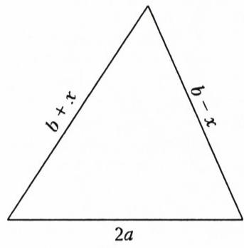
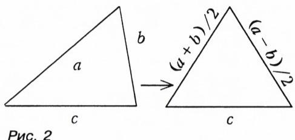
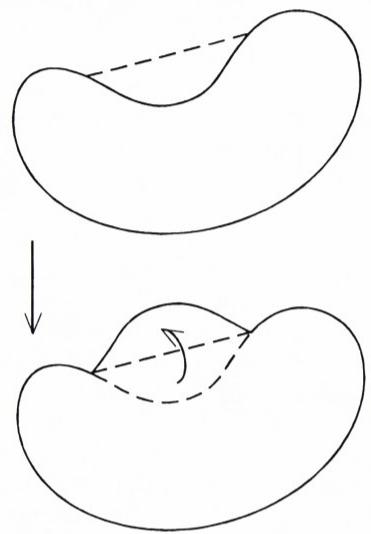
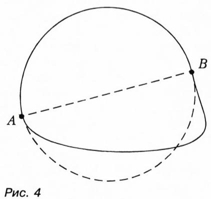
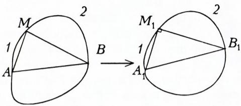
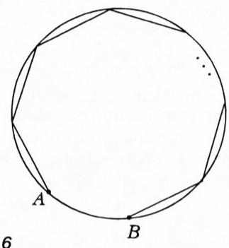
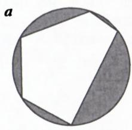
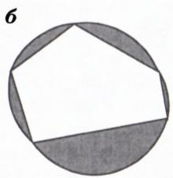

# 狄多神话与等周问题

> **原标题**：Миф о Дидоне и изопериметрическая задача
> **作者**：И. Ф. Шарыгин（I. F. 沙雷金，1937—2004，俄罗斯几何学家、数学教育家，俄罗斯联邦功勋科学活动家）
> **译自**：Квант 1997, № 1, с. 42–44
> **原文扫描**：https://www.kvant.digital/data/kvant_1997_1/jpg/0042.jpg
> **主题**：等周问题（在周长相等的平面闭曲线中，何种图形围成的面积最大），从狄多神话到施泰纳的证明
> **难度**：★★（文字初中可读，但施泰纳四弦证明与变分思想属高中／竞赛层面）
> **译者**：Claude（初译）／ 2026-06-24

---

## 数学小组

> *我们能找到那批宝藏，是因为事先知道它存在。*
> *——寻宝者的回忆*

### 狄多的神话

罗马神话中有一则关于狄多的传说。据这则传说，狄多是提尔国王的女儿，是赫拉克勒斯祭司阿刻尔巴斯的妻子。后来，狄多的哥哥皮格马利翁贪图她丈夫的财富，杀死了他，狄多被迫出逃。她带上丈夫的一部分财宝，在众多同伴的随行下抵达非洲，向柏柏尔国王雅尔巴斯买下了一块土地。按约定，她可以拿走"一张牛皮所能覆盖"的那么大一片地。狄多把这张牛皮剪成细长的皮条，用这些皮条圈出了一大块地。迦太基的卫城"比尔萨"（Birsa）就建立在这块地上（希腊语中"比尔萨"恰恰就是"皮"的意思）。

传说如此。下面是一道众所周知的智力题：

> 能否在一张普通练习本大小的纸页上剪出一个洞，让一个人能从中自由穿过去？

不难看出这道题与狄多所解的问题之间的相似之处。尽管题目稍有变难——纸不能断成几片——但"狄多方法"完全可以用来解这道智力题。顺便说一句，很可能狄多本人当年解决的正是这样的题。只不过史学家、神话专家以及翻译家们，对"狄多问题"的精确表述并未给予太多注意。（如果你没能解出这道智力题，请翻到本刊末尾，那里给出了一个可能的解答。）

虽说从数学角度看，智力题中的问题表述比交给狄多的那个问题更精确，但它仍然达不到一道真正的"数学问题"所应有的精确程度。一般而言，"如何提出问题"正是数学建模的核心问题，是应用数学的关键所在。在某种意义上，能否正确地提出、表述一个问题，甚至比把它解出来更为重要。

不过，在进入本文的数学部分之前，我们还要提一道民间和文学作品中常常见到的题。作为例子，不妨取列夫·托尔斯泰的寓言《人需要多少土地》。这里不再复述它的情节，只把寓言主人公所要解决的那个问题表述出来：在一天之内走过的地面围成尽可能大的一块。

由这些神话故事和文学作品，可以衍生出整整一 cycle 的数学题。下面是最简单的一道之一。

**题 1.** 在一切给定了一条边长与另外两边之和的三角形中，求出面积最大的那个三角形。

**解.** 设已知边长为 $2a$，另外两边之和为 $2b$（显然 $b>a$）。把其中一条边记作 $b+x$，则另一条边为 $b-x$（图 1）。记三角形面积为 $\Delta$，由海伦公式得：

$$
\begin{array}{r l}
\Delta^{2} & = (a+b)(b-a)(a+x)(a-x) =\\
 & = (b^{2}-a^{2})(a^{2}-x^{2}).
\end{array}
$$

由该等式可见，面积在 $x=0$ 时取最大，即我们的三角形为等腰三角形时。

*图 1*

**解的说明.** 请注意，我们之所以能把这道题解得如此简短，要归功于恰当地选好了参数化。具体地说，如果给定的是两个量之和（我们这里是 $2b$），而所求的结果在两量相等时似乎达到，那么往往把这两个量就记作 $b+x$、$b-x$ 最为方便。

**题 2.** 证明：在一切周长给定的三角形中，面积最大的是正三角形。

这里非常重要的一点是，在证明过程中我们将用到这样一个事实：在一切周长给定的三角形中，**存在**一个面积最大的三角形。

**证明.** 考虑一个周长给定、面积最大的三角形。假设它不是等边的。我们证明：此时必存在一个周长相同、面积更大的三角形。也就是说，所考虑的那个三角形不可能具有最大的面积。

于是，所考虑三角形的各边之中至少有一对不相等（图 2）。把这两条边记作 $a$ 和 $b$，第三条边记作 $c$（$a\ne b$）。据前一道题，以 $(a+b)/2$、$(a+b)/2$、$c$ 为边的三角形[1]，在周长相同的情况下面积更大。而这与所考虑三角形在周长为 $P=a+b+c$ 的三角形中面积最大的假设相矛盾。

> [1] **译者注**：原文此处写作"以 $(a+b)/2$、$(a-b)/2$、$c$ 为边"，系 OCR/排版之误——三角形的边长必须为正，$(a-b)/2$（当 $a<b$）或 $(b-a)/2$（当 $a>b$）取负或为零均不合。结合题 1 的证明，应为以 $(a+b)/2$、$(a+b)/2$、$c$ 为边的等腰三角形（即把不相等的 $a$、$b$ 两边各替换为它们的算术平均）。本译文按几何上正确的形式译出。

*图 2*

接下来本可以证明：在一切周长给定的 $n$ 边形中，面积最大的是正 $n$ 边形；然后让 $n$ 增大，在极限情形下"逼近"圆。但我们不打算走这条漫长的路，而是径直转向主要问题。先把问题表述出来。

**题 3.** 在一切长度给定的平面闭曲线中，求出围成最大面积的那一条。

这就是著名的**等周问题**（来自希腊文"ísos"——相等，与"perimetréō"——沿周长度量）。"周长"一词你们早已熟悉，只不过通常把它用于多边形。但正如本题所示，这一概念可推广到任意图形。有时这道题也被称作"狄多问题"。这一名称的由来，现在已无需再作解释。

求解时，与前面一样，我们也要用到这样一个事实：在一切周长给定的图形中，存在一个面积最大的图形。换言之，在一切给定长度的闭曲线中，存在围成最大面积的那一条。（不然还能怎样——周长给定的一切图形的面积毕竟是有界的！）我们将给出由雅各布·施泰纳（Jakob Steiner，1796—1863）——十九世纪杰出的瑞士几何学家——所找到的解答。（可见，去年正是他诞辰 200 周年。）

**解.** 首先注意，周长给定、面积最大的图形必须是凸的。（即：若图形内部的或边界上的任意两点都在图形中，则连接这两点的整条线段也都在图形内部或边界上。）否则，我们就能构造出一条长度相同、却围成更大面积的曲线（图 3）。

*图 3*

关于所求图形的第二个性质：若一条直线把图形的周长平分，则它也把图形的面积平分。事实上，设直线 $AB$（$A$、$B$ 在边界上，图 4）把图形周长平分，但两部分中有一块面积较大。把较小的一块换成较大的一块关于直线 $AB$ 的对称图形，这样图形的面积便增大了，而周长却未变。

*图 4*

现在设 $M$ 是边界上任意一点，且不同于 $A$、$B$（图 5）。我们证明 $\angle AMB=90^{\circ}$。

*图 5*

假设不是这样。连结线段 $AM$、$MB$ 与 $AB$，它们把我们的图形切成四块。按如下方式构造一个新图形。先作一个直角三角形 $A_1M_1B_1$，使 $A_1M_1=AM$，$M_1B_1=MB$，$\angle A_1M_1B_1=90^{\circ}$。把等于弓形 1 和弓形 2（见图 5）的弓形拼到它的两条直角边上，然后把所得图形整体关于斜边 $A_1B_1$ 反射，得到一个周长相同、面积更大的新图形。因为三角形 $A_1M_1B_1$ 的面积大于三角形 $AMB$ 的面积。于是我们证明了：若直线 $AB$ 把面积最大的图形的周长平分，而 $M$ 是边界上任意一个不同于 $A$、$B$ 的点，那么 $\angle AMB=90^{\circ}$，即 $M$ 落在以 $AB$ 为直径的圆上。这样一来，等周问题的解就是圆。

等周问题，实质上正是现代数学最重要的一个分支——**变分法**——的起点。

到此本可结束本文，但我们还要再往前迈一步（往前？还是往后？）。如前所述，从多边形走向圆似乎是最自然的途径。然而，人们也提出过一种解决一般问题的方法，它完全不依赖于极值多边形的性质。更有甚者，反过来，这些多边形的某些性质反而可以相当容易地从这一一般结论中导出，而不借助于一般结论去证明这些性质则看来十分困难。下面是一个例子。

**题 4.** 考虑一切各边给定的 $n$ 边形。（可以设想有一个多边形，其相邻各边用铰链连接；考虑该多边形在形变过程中所能得到的各种多边形。）证明：在这类多边形中，存在一个外接圆的多边形，并且恰是这一个多边形在所考虑的多边形中面积最大。

**解.** 取一个充分大的圆，使得若从其上某点 $A$ 出发，依次沿同一方向截取等于该多边形各边的弦，则所有相应弧的总长小于圆周。记最后一条弦的端点为 $B$。$A$、$B$ 之间的两段弧中，有一段不包含我们所引的弦（图 6）。现在让圆的半径逐渐缩小。到某一时刻，$A$、$B$ 两点会重合。此时便得到所要的圆内接多边形（图 7,а）。证明它的面积最大。考虑任意一个边长相同的多边形。在其各边上作与圆内接多边形对应边上相同的弓形（图 7,б）。这些弓形外缘所成的边界，其长度等于外接圆的周长。因此图 7,б 中由弓形弧所围成的面积，小于图 7,а 中圆的面积。把弓形去掉，便得到：图 7,а 中圆内接多边形的面积，大于任何边长相同的其他多边形（图 7,б）的面积。

*图 6*

*图 7,а*

*图 7,б*

现在让我们回到主要的等周问题（题 3）。解的存在这一事实本身——对于未被数学诡辩所败坏的理智而言相当显然的事实——恰恰使我们能够把这个解找到。关于这一点，讲一个属于当代科学"民间文学"的故事。

有一个复杂的科学难题交给了一个科学家小组来解决，其中有数学家，也有物理学家。有一次数学家遇见物理学家，高兴地告诉他：自己证明了一个关于该问题解的存在性的定理。物理学家回答说，要是他哪怕有一瞬间怀疑过解的存在，他就根本不会去研究这个问题。

## 自解题

1. 三角形的一边长为 $a$，其对角为 $\alpha$。求这类三角形面积的最大值。

2. 考虑一切面积为 1 的三角形。求这类三角形周长的最小值。

3. 在某圆的弧 $AB$ 上求出这样的点 $K$ 和 $M$，使四边形 $AKMB$ 的面积达到最大。

4. 考虑周长为 $l$、面积为 $\Delta$ 的图形。证明 $l^{2}>12{,}5\,\Delta$。

5. 给定一组线段。考虑一切依次以所给线段（按某种顺序取定）为边的多边形。证明：这类多边形面积的最大值，与线段按何种顺序取定无关。

6. 考虑一切给定了 $n-1$ 条边的 $n$ 边形。证明：这类 $n$ 边形面积的最大值，在某个圆内接 $n$ 边形处达到，且该 $n$ 边形中未被固定的那条边恰是外接圆的直径。

7. 求把边长为 1 的正三角形面积平分的最短曲线。

## 更正

本刊 1996 年第 6 期《报考 ОЛ ВЗМШ》一文，化学方向入学试题第 6 题有误。反应中生成的黑色沉淀 $C$ 的质量应为 $12{,}7$ 克。

---

## 译者注与校对说明

1. **OCR 校正与版面说明**：
   - 本文原载页面（с. 42—44）的起首，第 42 页还接续着上一篇（热力学）文章的末尾数段；本译文只译出从"**数学小组**"栏目标题起的本文部分（即狄多神话之后），物理部分一概不译。
   - 海伦公式段落中，OCR 给出的 $\Delta^{2}=(a+b)(b-a)(a+x)(a-x)=(b^{2}-a^{2})(a^{2}-x^{2})$ 已据扫描页 p43 核对无误。
   - 题 2 证明中原文写作"以 $(a+b)/2$、$(a-b)/2$、$c$ 为边的三角形"，$(a-b)/2$ 应为 $(a+b)/2$（边长须为正，且与题 1 一脉相承），已在正文中加译者注说明并按几何正确形式译出。
   - 等周不等式自解题 4 中的俄文小数记法 $12{,}5$（即 $12.5$）按规范保留逗号写法；与之对比，题 4 中应得到的最佳常数其实为 $4\pi\approx 12{,}57$，此处给出的 $12{,}5$ 是一个略弱但易证的界（学生可由正三角形或圆面积估计）。
   - 希腊词源 ísos / perimetréō 按原文给出，括注希腊文形式。
   - 篇末"更正"条目（关于 ОЛ ВЗМШ 化学试题）虽与本文主题无关，但属于原版同一页面内容，按规范一并译出。

2. **术语**（俄→中）：изопериметрическая задача=等周问题，периметр=周长，площадь=面积，выпуклая фигура=凸图形，сегмент=弓形，описанная окружность/окружность, около которой=外接圆，вписанный многоугольник=圆内接多边形，равнобедренный треугольник=等腰三角形，равносторонний/правильный треугольник=等边／正三角形，хорда=弦，дуга=弧，катет=直角边，гипотенуза=斜边，вариационное исчисление=变分法，параметризация=参数化。术语遵照《01_工作规范.md》对照表。

3. **图表**：原文插图（图 1—7）由 MinerU 从整页扫描中自动裁出，存于 `images/1997_01_sharygin_C06/fig_*.png`。其中图 7 在原版排成上下相邻的两个小图（а、б），分别对应 `fig_p44_03.png` 与 `fig_p44_04.png`，译文据此分别引用并加注说明。图 4 在原版无 "Рис." 编号，但据上下文为图 3 与图 5 之间的插图，译文按出现顺序编为"图 4"。

## 建议讨论题

1. 狄多"把牛皮剪成细条"的做法，与题 1 解中所用的参数化 $b+x$、$b-x$，本质上都是"把一个看似受限的条件转化为自由可变的量"。你能再举一个数学里把约束"切开重排"从而把问题化难的例子吗？
2. 题 2 的证明依赖于"周长给定的三角形中**存在**面积最大者"这一事实。这一"存在性"在本是显然的吗？末尾那个数学家与物理学家的故事，说明了"存在性"与"求解"之间怎样的关系？
3. 施泰纳的证明（题 3）展示了等周问题的解是圆，但严格地说它假定了最大面积图形的存在性。试想：如果没有这个存在性假设，证明在哪一步会失效？
4. 自解题 4 的不等式 $l^{2}>12{,}5\,\Delta$ 与"真正的"等周不等式 $l^{2}\geqslant 4\pi\Delta$（$4\pi\approx 12{,}566$）相比弱了多少？你能否仅用正三角形（或正方形）的面积给出一个较粗的界？

---

> **版权说明**：原文版权归 MCCME（莫斯科连续数学教育中心）及作者继承者所有。本译文为非商业、自用、数学圈内部参考，未获授权不得公开分发。原文扫描见 [kvant.digital](https://www.kvant.digital/data/kvant_1997_1/jpg/0042.jpg)。

> **复用说明**：本译文的俄文 OCR 原文与所有插图均存档于 `ocr/1997_01_sharygin_C06/`（`ru.md` 为合并 OCR 文本，`meta.json` 为图映射）。如对译文质量不满意，可直接基于 `ru.md` 重译，无需重跑 OCR。
