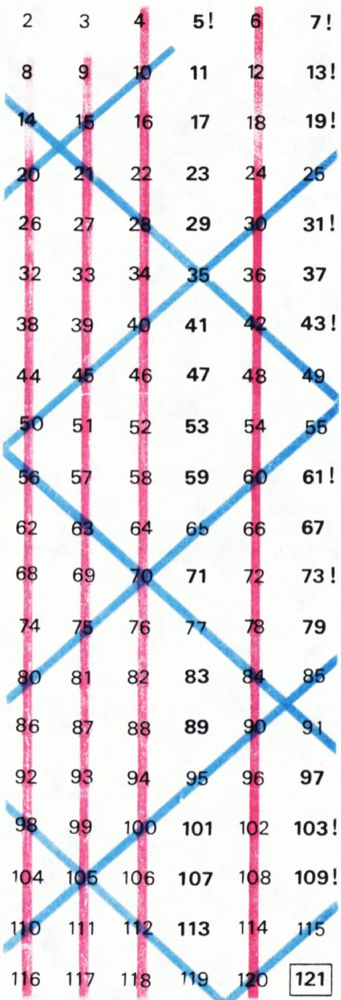

# 埃拉托色尼筛法

> **原标题**：Решето Эратосфена
> **作者**：А. Н. Колмогоров（A. N. 柯尔莫哥洛夫，1903—1987，苏联数学家，Kvant 创刊主编之一）
> **译自**：Квант 1974, № 1, с. 77
> **原文扫描**：https://www.kvant.digital/data/kvant_1974_1/jpg/0077.jpg
> **主题**：素数、埃拉托色尼筛法、孪生素数
> **难度**：★（初等数论，初中可读）
> **译者**：Claude（初译）／ 2026-06-24

---

这种美观的埃拉托色尼筛法表现形式\*)，取自 M. 加德纳的《数学消遣》一书（«Мир» 出版社，1972 年版）。所有未被（红色或蓝色）划掉的数都是素数，唯有数 $121$ 是个例外。请解释，这是为什么！

**题 1.** 为了得到小于 $1000$ 的素数表，需要「筛掉」那些能被 $2$、$3$、$5$、$7$、$11$、…… 整除的数。在这个过程中，可以停在哪个素数上？

当问题改为「编制小于 $10\,000$ 的素数表」时，答案会如何变化？

表中用感叹号标出了成对的素数「孪生」\*\*)。在我们的这张表里，这样的孪生对共有九对。

众所周知，素数有无穷多个。但至今谁也不知道，孪生对组成的集合究竟是有限的还是无穷的。

**题 2.** 最初的两对孪生 $(3,\,5)$ 与 $(5,\,7)$ 有一个公共元素（即 $5$）。第二对孪生 $(5,\,7)$ 与第三对孪生 $(11,\,13)$ 之间的「距离」等于

$$
11 - 7 = 4.
$$

第三对 $(11,\,13)$ 与第四对 $(17,\,19)$ 之间的距离

$$
17 - 13 = 4,
$$

第四对与第五对 $(29,\,31)$ 之间的距离是

$$
29 - 19 = 10.
$$

请证明：此后任意两对相邻孪生之间的距离都不会小于 $4$。

*图 1：埃拉托色尼筛法的方阵（据 M. 加德纳《数学消遣》）。红蓝斜线划去素数的倍数，余下未划者除 121 外皆为素数。*

А. Н. 柯尔莫哥洛夫

---

\*) 这种美观的埃拉托色尼筛法形式，取自 M. 加德纳《数学消遣》（«Мир» 出版社，1972）。

\*\*) 关于「素数孪生」，参见《Квант》1973 年第 5 期第 56 页。

## 译者注与校对说明

1. **OCR 校正**：本文正文仅占原刊第 77 页一页。第 78—79 页虽与本文同批扫描，但内容是《Квант》本期的「答案·提示·解答」（ОТВЕТЫ, УКАЗАНИЯ, РЕШЕНИЯ）专栏，分属《Сюрпризы》《Электролиз и закон сохранения энергии》《Переформулировка задачи》《Свойства паров…》《Московский инженерно-физический институт》等其他文章，**与柯尔莫哥洛夫此文无关**，故不译入正文。已在文末以脚注补出原文两个星标注（关于加德纳书的出处、关于孪生素数的引文出处）。OCR 文本中「красивая форма」（美观的形式）一处，经 MCP 读图复核，确为「красивая」（漂亮的），而非个别视觉模型误读的「красная」（红色的）。
2. **关于 121 的解释（题外提示，供主持讨论用）**：图 1 的方阵止于约 $130$ 附近，因此 $11$ 的倍数里能被红蓝斜线逐一划去的，只到 $110$（$=11\times10$）为止；而 $121=11^{2}$ 已超出这张表的「逐行连乘」覆盖范围，故未被任何一根斜线划去，可它并不是素数。这就是文中让读者「解释为什么 121 是例外」的答案。
3. **关于题 1 的答案**：要得到小于 $N$ 的素数表，只需用不超过 $\sqrt{N}$ 的素数去筛即可。故对 $N=1000$，停在 $31$（$\sqrt{1000}\approx 31{,}6$）即可；对 $N=10\,000$，停在 $97$（$\sqrt{10\,000}=100$）。理由：任一合数 $n<N$ 必有一个不超过 $\sqrt{n}\leqslant\sqrt{N}$ 的素因子。
4. **关于题 2 的提示**：除 $(3,5)$ 外，任何一对孪生素数 $(p,p+2)$ 都满足 $p>3$。注意 $p,p+2$ 之外，三个连续奇数 $p,\,p+2,\,p+4$ 中至少有一个是 $3$ 的倍数；既然 $p$、$p+2$ 都是大于 $3$ 的素数（不被 $3$ 整除），那么 $p+4$ 必为 $3$ 的倍数，故不可能是素数（除非 $p+4=3$，不可能）。因此下一对孪生的较小素数至少要从 $p+6$ 起算，相邻两对的「距离」$\geqslant 6-2=4$。
5. **术语**：простое число = 素数；составное число = 合数；близнецы（простые числа-близнецы）= 孪生素数（相差 $2$ 的一对素数）；решето Эратосфена = 埃拉托色尼筛法。

## 建议讨论题

1. 图 1 中，为什么用不超过 $\sqrt{130}$ 的素数（即 $2,3,5,7$）去划线，就已经能把这张表里的所有合数划掉？为什么唯独 $121$ 漏网？（提示：$121=11^{2}$。）
2. 题 1 中，欲得小于 $1000$（或 $10\,000$）的素数表，分别应停在第几个素数？请你先猜后证。
3. 题 2 要证明「相邻孪生对的距离不小于 $4$」。请把三个连续奇数 $p,\,p+2,\,p+4$ 中关于 $3$ 的倍数的论证写清楚——为什么 $p+4$ 一定不是素数？
4. 文中说「素数有无穷多个，但孪生对是否无穷多至今未知」。五十年过去了（本文发表于 1974 年），孪生素数猜想的研究有了哪些进展？请查阅张益唐 2013 年的工作。（开放性讨论。）

---

> **版权说明**：原文版权归 MCCME（莫斯科连续数学教育中心）及作者继承者所有。本译文为非商业、自用、数学圈内部参考，未获授权不得公开分发。原文扫描见 [kvant.digital](https://www.kvant.digital/data/kvant_1974_1/jpg/0077.jpg)。

> **复用说明**：本译文的俄文 OCR 原文与所有插图均存档于 `ocr/1974_01_kolmogorov_eratosfen/`（`ru.md` 为合并 OCR 文本，`meta.json` 为图映射）。注意 `ru.md` 中第 78—79 页的内容属于本刊其它文章的「答案·提示·解答」专栏，并非本文内容；如对译文质量不满意，可仅取第 77 页内容基于 `ru.md` 重译，无需重跑 OCR。
