# 论正多边形、欧拉函数与费马数

> **原标题**：О правильных многоугольниках, функции Эйлера и числах Ферма
> **作者**：А. А. Кириллов（A. A. 基里洛夫，1936— ，苏联／俄罗斯数学家，莫斯科大学教授，苏联科学院通讯院士）
> **译自**：Квант 1977, № 7, с. 2–9
> **原文扫描**：https://www.kvant.digital/data/kvant_1977_7/jpg/0002.jpg
> **主题**：尺规作图（正 $n$ 边形的可作性）与数论（欧拉函数、费马数、伽罗瓦理论）
> **难度**：★★★（用到欧拉函数、素因数分解、伽罗瓦理论的概念，需高中以上数论基础）
> **译者**：Claude（初译）／ 2026-06-24

---

## 1. 引子

几何作图题是中学数学里最受欢迎的题目之一。几乎每一个数学小组都要讨论这类题目。这当然并非偶然。几何作图的历史长达数千年，古希腊人在这方面就已达到极高的造诣。阿波罗尼奥斯问题便是一例：作一个与三条给定圆都相切的圆\*）。

大约有不少人知道三道著名的古代难题，它们最终被证明是不可解的：化圆为方、三等分角、倍立方\*\*）。

不过，最美的，恐怕还要数正多边形的作图问题。严格地说，这并非一道题，而是一整列题目：对每一个自然数 $n \geqslant 3$，要求用圆规和直尺作出一个正 $n$ 边形。

对于某些 $n$ 值，这道题非常简单（例如 $n = 3, 4, 6, 8, 12$）；对另一些值则稍难（$n = 5, 10, 15$；下面我们会讲如何作十边形和五边形）；还有一些值非常难（$n = 17$ 或 $257$）\*）。最后，也存在一些 $n$ 值，使这道题根本无解（例如 $n = 7, 9, 11$）。

我们把从 $n = 3$ 起的若干自然数依次写出，用红色标出那些可以用圆规直尺作出正 $n$ 边形的数 $n$：

$$3, \color{red}{4, 5, 6}, 7, \color{red}{8}, 9, \color{red}{10, 11, 12}, \ldots$$

> **译者注**：原文在正文中以红色／黑色两种颜色连续列出了 $n = 3$ 到 $48$ 的全部自然数（如上式起首所示），并据此区分「可作」与「不可作」。因打印体例限制，译文中以加粗等区分代替颜色，请读者参照下文规则自行判定。

「红」数和「黑」数的分布究竟有没有什么规律呢？答案是：有；但要找到它却颇为不易。这个规律具有算术性质；为了描述它，我们得暂时放下几-

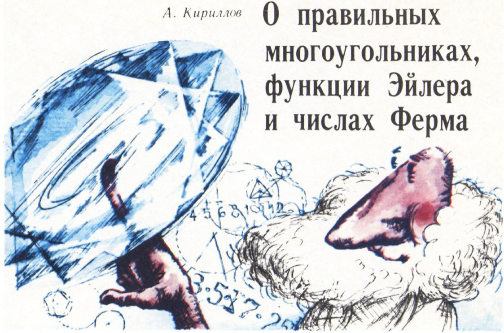

*图 1*

何学，转而研究数论——也就是算术的更高部分——的一些内容。

## 2. 欧拉函数

数 $n$ 的一个重要算术特征是：小于 $n$ 且与 $n$ 互素的数的个数。最早注意到这一点的是十八世纪的著名数学家列昂哈德·欧拉。他为这个个数引入了记号 $\varphi(n)$，自此函数 $n \mapsto \varphi(n)$ 就以「欧拉函数」之名传世\*）。例如，对 $n = 10$ 而言，比 $10$ 小且与它互素的数有四个：$1, 3, 7, 9$；因此 $\varphi(10) = 4$。

函数 $\varphi$ 有许多有趣的性质。其中一条是欧拉本人发现的：对任意两个互素的数 $m$ 和 $n$，下式成立：

$$
\varphi(m\,n) = \varphi(m)\,\varphi(n).\tag{1}
$$

此外，容易验证：若 $p$ 是素数，则 $\varphi(p) = p - 1$，$\varphi(p^{2}) = p^{2} - p$，一般地

$$
\varphi(p^{m}) = p^{m-1}(p - 1).\tag{2}
$$

这些性质使得欧拉函数在 $n$ 不太大时易于计算。例如

$$
\varphi(10) = \varphi(2) \cdot \varphi(5) = 1 \cdot 4 = 4,
$$

$\varphi(100) = \varphi(4) \cdot \varphi(25) = 2 \cdot 20 = 40$。我们把 $n$ 从 $1$ 到 $42$ 的欧拉函数值列于下表（表 1，а 与 б）。

| $n$ | 1 | 2 | 3 | 4 | 5 | 6 | 7 | 8 | 9 | 10 | 11 | 12 | 13 | 14 | 15 | 16 | 17 | 18 | 19 | 20 |
|---|---|---|---|---|---|---|---|---|---|---|---|---|---|---|---|---|---|---|---|---|
| $\varphi(n)$ | 1 | 1 | 2 | 2 | 4 | 2 | 6 | 4 | 6 | 4 | 10 | 4 | 12 | 6 | 8 | 8 | 16 | 6 | 18 | 8 |

*表 1，а*

| $n$ | 21 | 22 | 23 | 24 | 25 | 26 | 27 | 28 | 29 | 30 | 31 | 32 | 33 | 34 | 35 | 36 | 37 | 38 | 39 | 40 | 41 | 42 |
|---|---|---|---|---|---|---|---|---|---|---|---|---|---|---|---|---|---|---|---|---|---|---|
| $\varphi(n)$ | 12 | 10 | 22 | 8 | 20 | 12 | 24 | 12 | 28 | 8 | 30 | 16 | 20 | 16 | 24 | 12 | 36 | 18 | 24 | 16 | 40 | 12 |

*表 1，б*

请把这两张表与上面那串「红」数、「黑」数对照一下。数 $n$ 的「颜色」与 $\varphi(n)$ 的值之间的关系，是不是已经呼之欲出了？我们看到：**只要正 $n$ 边形可以用圆规直尺作出，那么相应的 $\varphi(n)$ 一定是 $2$ 的幂**。事实证明，这一条件不仅是必要的，而且也是充分的。

在本文里我们无法对这一论断给出严格证明。但我们将-

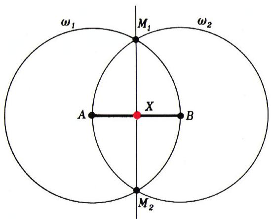

*图 2：列昂哈德·欧拉（L. Euler）*

给出一些简单而有说服力的理由来支持它。类似的想法也适用于其它许多作图问题——例如三等分角问题。

## 3. 「作图」是什么意思？

尺规作图题的精确提法，此前已在《Квант》上讨论过。这里我们不再重复提醒读者正确使用数学工具的种种注意事项。只想说一句：一道作图题的最终解答，（至少在原则上）应当能写成一条由「基本运算」串成的指令链，正如给电子计算机下达的一串命令。

例如，「作线段 $AB$ 的中点」这道题，可由下面的「程序」解决（见图 1，下文「图 1」即指本节所引插图）：

1. 用圆规，以 $A$ 为圆心、$|AB|$ 为半径作圆 $\omega_{1}$。
2. 用圆规，以 $B$ 为圆心、$|BA|$ 为半径作圆 $\omega_{2}$。
3. 标出两圆 $\omega_{1}$、$\omega_{2}$ 的交点 $M_{1}$、$M_{2}$。
4. 用直尺连直线 $M_{1}M_{2}$。
5. 标出直线 $M_{1}M_{2}$ 与 $AB$ 的交点 $X$。

再举一例：作已知角 $AOB$ 的角平分线（图 2）。相应的命令序列是：

1. 用圆规，以 $O$ 为圆心、任取半径 $R$ 作圆 $\omega_{1}$。
2, 3. 标出此圆与直线 $OA$、$OB$ 的交点，分别记为 $A_{1}$、$B_{1}$。
4, 5. 用圆规，分别以 $A_{1}$、$B_{1}$ 为圆心，半径 $R$ 作圆 $\omega_{2}$、$\omega_{3}$。
6. 标出 $\omega_{2}$ 与 $\omega_{3}$ 的交点 $C$。
7. 用直尺连直线 $OC$。

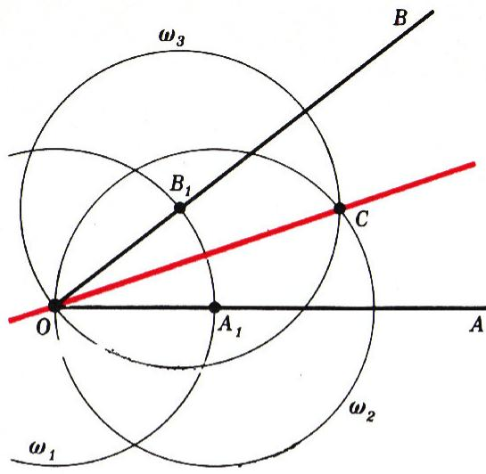

*图 2*

不过，此时第 2、3 步的程序表述并不精确。因为圆 $\omega_{1}$ 与直线 $OA$、$OB$ 各有两个交点，并不清楚究竟该把哪两个点叫作 $A_{1}$、$B_{1}$。你或许会反驳：这里说的是射线 $OA$、$OB$，它们与圆只有一个交点呀。可是「射线」这个概念，已经超出了我们这台「数学机器」能理解的范围；它所能理解的，只有「直线」这个概念。

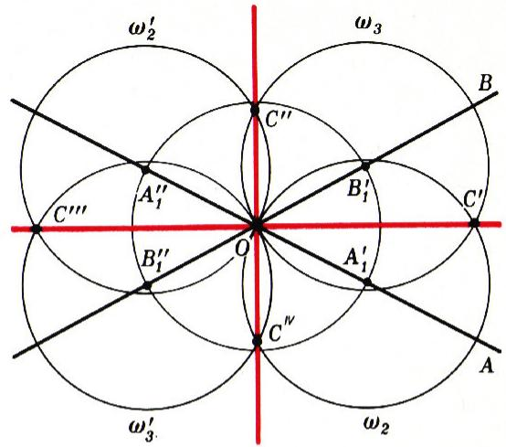

*图 3*

我们来看一看，若把「交点」理解为「任一交点」，会发生什么。这时，前述程序就对应于图 3：原来的 $A_{1}$、$B_{1}$ 各自变成两个点 $A_{1}^{\prime}, A_{1}^{\prime\prime}$ 与 $B_{1}^{\prime}, B_{1}^{\prime\prime}$。于是原来一个点 $C$，现在对应四个不同的点 $C^{\prime}, C^{\prime\prime}, C^{\prime\prime\prime}, C^{IV}$。然而这最终只导出两个不同的答案：直线 $OC^{\prime}$ 与 $OC^{\prime\prime\prime}$ 重合，直线 $OC^{\prime\prime}$ 与 $OC^{IV}$ 也重合。

那么，同一道程序，最多能导出多少个不同的答案呢？任何一道作图程序都由若干基本运算组成。基本运算一共只有五种：过两给定点作直线；以给定的圆心和半径作圆；求两条给定直线的交点；求给定直线与给定圆的交点；求两个给定圆的交点。前三者是单值运算，后两者含有二值的不确定性\*）。

若程序中只含单值运算，则只能得到一个答案。若其中有-

一道二值运算，则执行此运算会产生两种实现（如上例所示）。一般地，若程序中含有 $k$ 道二值运算，那么这道程序可以有 $2^{k}$ 种实现方式。

我们看到，有些不确定性最终可以「约去」，不影响最终答案。事实证明（这可以严格证明，但不是本文目的），这些约去总以一种协调一致的方式发生，使得最终答案的不确定性恒具 $2^{l}$ 之形（$l \leqslant k$）。这一事实的根源不在几何，而在代数（相应的代数分支叫作伽罗瓦理论）。读者不妨自行选一道具体的作图题，验证这一论断；我们建议从「作两圆的公切线」一题入手。

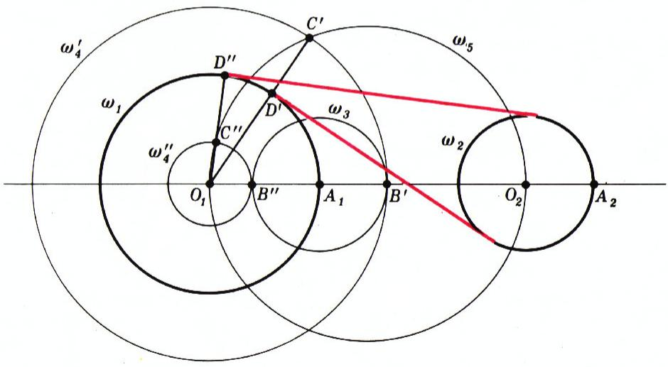

*图 4*

为解此题，例如可采用下面的程序（这里为简洁起见，只给出大致思路，不把每条「命令」都拆成基本运算）：

1. 用直尺连两给定圆 $\omega_{1}$、$\omega_{2}$ 的圆心 $O_{1}$、$O_{2}$，得直线 $O_{1}O_{2}$；求出 $\omega_{1}$、$\omega_{2}$ 与此直线的交点 $A_{1}$、$A_{2}$（图 4）。
2. 以 $A_{1}$ 为圆心、$|O_{2}A_{2}|$ 为半径作圆 $\omega_{3}$，标出 $\omega_{3}$ 与直线 $O_{1}O_{2}$ 的交点 $B$。
3. 以 $O_{1}$ 为圆心、$|O_{1}B|$ 为半径作圆 $\omega_{4}$。
4. 以 $O_{1}O_{2}$ 为直径作圆 $\omega_{5}$。
5. 标出 $\omega_{4}$ 与 $\omega_{5}$ 的交点 $C$，并用直尺连 $O_{1}C$。
6. 求直线 $O_{1}C$ 与 $\omega_{1}$ 的交点 $D$，过 $D$ 作 $O_{1}C$ 的垂线。此垂线即所求切线。

回到角平分线的题目。我们的程序，除了角 $AOB$ 的（内）平分线外，还同时给出角 $AOB$ 的外角平分线（图 3）。这个解不应被视为「多余」。因为从圆规直尺的眼光看——它们只把角理解为一对相交直线——这个外角与原来的角 $AOB$ 毫无二致。一旦你试着用「圆规直尺能够理解」的措辞去界定「角平分线」这一概念，就会发现外角平分线同样满足此界定，正如内角平分线一样。

这一情形具有普遍性：一道含有不确定性的程序所给出的全部 $2^{l}$ 个解，**都是真正的解，而非多余的解**——只要问题提法得当。

例如，题目「作给定三角形的内切圆」，其程序的不确定性是 $16$（要作两个角的平分线），最终给出 $4$ 个不同的答案（一个内切圆、三个旁切圆）。如果把题目改提为「作一个与三条给定直线都相切的圆」，那么这 $4$ 个答案就完全平等了。内切圆与旁切圆的区别，依赖于「之间」（或「之内」）这一概念，而我们的机器是不能理解的。

以上各例还表明：一道作图题若有多个解，作图程序就会把它们**全部**给出。这一论断在一般情形下也成立。

一个颇具教益的例子：用几何作图求一元二次方程的一个根，会自动地同时作出另一个根。

于是我们得到下面的原理：

> **凡可由圆规直尺解决的作图题，必有 $2^{l}$ 个解。**

这一论断的严格证明属伽罗瓦理论，无法在本文中展开。然而这论断本身十分简明，古希腊数学家本完全可能发现它。问题来了：既然许多佐证之例早已为人所知数千年（例如上述阿波罗尼奥斯问题就有 $8$ 个解），为何这一发现却迟至上个世纪才被作出？

一种可能的原因，是缺乏现代的、「机器化」的问题提法。另一种原因，是把每道题孤立看待，而不是像「对每个 $n$ 作正 $n$ 边形」那样，把一整列同型问题放在一起考察。

也许这一课题会引起数学史家的注意，他们能更充分地为我们解释，这次「错失的良机」究竟缘何而起。

## 4. 正多边形

回到我们的主问题。我们想知道：何时可以用圆规直尺作出正 $n$ 边形？上一节的思考启发我们——去看这道题有多少个解。为得到一个合理的答案，须把问题提法再精确化。具体地说，须固定正 $n$ 边形的大小与位置（否则，只要有一个解，解的个数就无穷多）。设我们的 $n$ 边形内接于给定的圆 $\omega$（圆心为 $O$），并且其中一个顶点 $A_{0}$ 的位置已固定。要求确定其余顶点 $A_{1}, A_{2}, \ldots, A_{n-1}$ 的位置。显然，只须找到 $A_{1}$ 的位置——依次截取弧 $A_{0}A_{1}$，便得 $A_{2}, A_{3}, A_{4}, \ldots$。

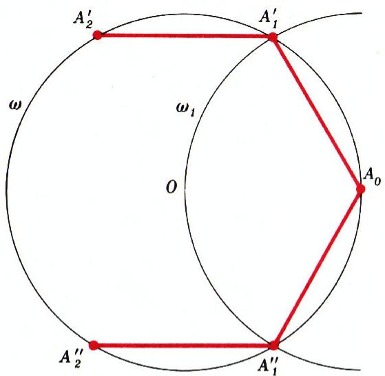

*图 5*

此题在 $n = 6$ 时最简单。众所周知，内接正六边形的边长等于外接圆的半径。于是所需「程序」如下（图 5）：

1. 用圆规，以 $A_{0}$ 为圆心、$|OA_{0}|$ 为半径作圆 $\omega_{1}$。
2. 标出 $\omega$ 与 $\omega_{1}$ 的交点 $A_{1}$。

我们看到，此程序给出两个不同答案，但相应的两个六边形 $A_{0}A_{1}^{\prime}A_{2}^{\prime}A_{3}^{\prime}A_{4}^{\prime}A_{5}^{\prime}$ 与 $A_{0}A_{1}^{\prime\prime}A_{2}^{\prime\prime}A_{3}^{\prime\prime}A_{4}^{\prime\prime}A_{5}^{\prime\prime}$，仅是顶点编号顺序不同。

$n = 3$ 与 $n = 4$ 的情形同样如此。更有意思的是 $n = 5$ 与 $n = 10$。作正五边形的方法，已见于 А. 萨温的文章〈如何画一颗五角星〉（《Квант》1976 年第 1 期）。这里我们讨论 $n = 10$。

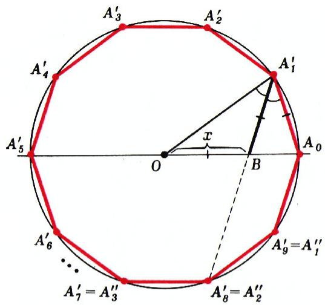

*图 6*

若作角 $OA_{1}A_{0}$ 的平分线 $A_{1}B$，则所得三角形 $OA_{1}B$、$BA_{1}A_{0}$ 都是等腰的（图 6），而三角形 $OA_{1}A_{0}$ 与 $BA_{1}A_{0}$ 相似。把直线 $OA_{0}$ 当作数轴：$O$ 点对应于 $0$，$A_{0}$ 点对应于 $1$。设 $B$ 点对应于数 $x$。则得到方程

$$
\frac{x}{1 - x} = \frac{1}{x}, \quad\text{即}\quad x^{2} + x - 1 = 0.
$$

解此方程便得 $B$ 点。所求点 $A_{1}$ 是圆 $\omega$ 与「以 $A_{0}$ 为圆心、长 $x$ 为半径」之圆的交点。这样的点有两个——故得两解：$A_{1}^{\prime}$ 与 $A_{1}^{\prime\prime}$（图 6）。

但我们的二次方程有两个根：

$$
x_{1} = -\frac{1}{2} + \frac{\sqrt{5}}{2},\qquad x_{2} = -\frac{1}{2} - \frac{\sqrt{5}}{2}.
$$

第二个根为负，因此似乎不可用。但先别急着「丢掉」它，让我们来理解它的几何含义。

把图 6 重画一遍，但假定 $B$ 点不在 $O$ 的右侧，而在 $O$ 的左侧，便得图 7。这又给所求点 $A_{1}$ 增添两个可能位置：$A_{1}^{\prime\prime\prime}$ 与 $A_{1}^{IV}$。

于是，关于 $A_{1}$ 我们共得四种不同的可能。

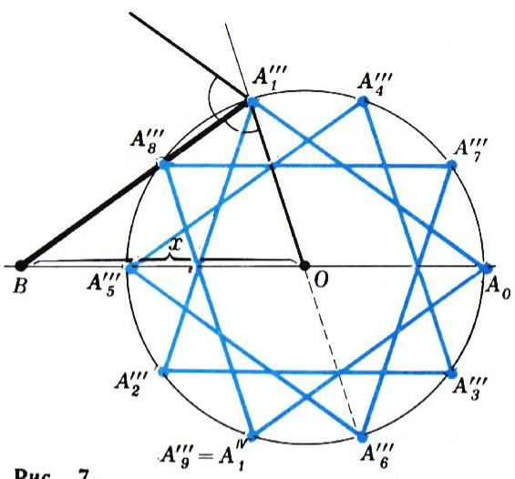

*图 7*

最终得到两个不同的十边形：一个凸的，一个星形的；每个又各有两种不同的顶点编号（见图 6 与图 7）。

请注意：从圆规直尺的「眼光」看，星形十边形与凸十边形并无高下之分。

或许有人会反驳：凸多边形的非邻接边不相交，而星形多边形的边相交。但只要我们把「边」定义为一整条直线——而非两顶点之间的线段（我们根本没有「之间」这一概念！）——这条反驳就站不住脚了。于是凸十边形的「正规」画法，在尺度上与星形画法有所不同（图 8）。

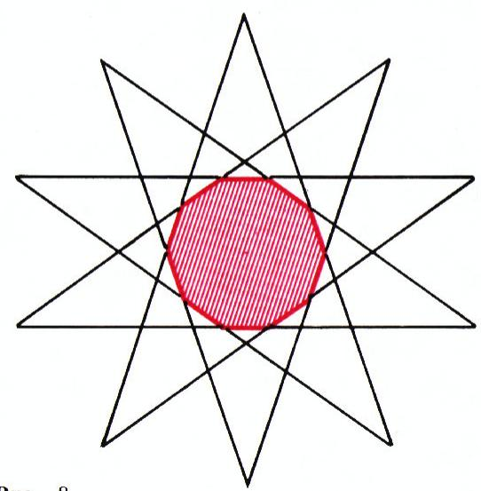

*图 8*

五边形的情形与之类似：同样有 $4$ 个解，对应两个不同的五边形（图 9，а、б），每个又有两种不同的顶点编号。

> **译者注**：原文图 9，а、б 在扫描页中位于 p8 顶部，与文中描述的「五边形图」一致，但 meta.json 提取的图块 `fig_p8_01.png` 实为下一节的文字示意（正 $n$ 边形顶点排布），故此处不再重复引用，仅以文字说明。

现在，我们不去显式地解「作一般正 $n$ 边形」的作图题，而试着确定它有多少个不同的解。（回忆：我们视圆 $\omega$ 及其上的点 $A_{0}$ 为已给定。）以 $x$ 记弧 $A_{0}A_{1}$ 的长度。点 $A_{1}$ 成为该题的解（从圆规的眼光看），当且仅当：从 $A_{0}$ 出发依次截取长为 $x$ 的弧共 $n$ 次，恰好回到出发点 $A_{0}$；而截取较少次数时则回不到 $A_{0}$。

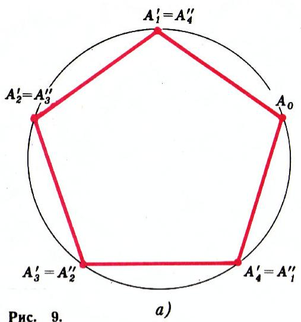

*依次截取弧 $A_{0}A_{1}$ 得到 $A_{2}, A_{3}, \ldots$*

后一限定至关重要。否则，比如 $n = 6$ 时，我们就会把「绕行两圈的三角形」、「绕行三圈的直径」、甚至「重复六次的同一点 $A_{0}$」也称作「正内接六边形」了。

用算术的语言来说（取整圆周长为单位），我们的条件可表为：数 $nx$ 是整数，而 $x, 2x, 3x, \ldots, (n-1)x$ 都不是整数。若 $n = 10$，例如可取 $x = \tfrac{1}{10}$。但这并非唯一可能的选择：$x$ 还可取 $\tfrac{3}{10}$、$\tfrac{7}{10}$、$\tfrac{9}{10}$。这正对应于我们先前用几何方法找到的四个解。注意，若取 $x = \tfrac{11}{10}$（或 $\tfrac{13}{10}$、$\tfrac{17}{10}$、…），并不会得到新的几何解：圆上一点的位置并不取决于数 $x = \tfrac{k}{n}$ 本身，而取决于

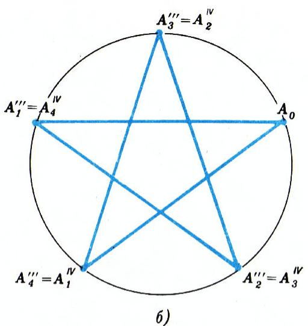

*$k$ 除以 $n$ 所得的余数。*

显然，既约分数 $\tfrac{m}{n}\,(m<n)$，且只有它们，具有这样的性质：$k\cdot\tfrac{m}{n}$ 只有在 $k = n$ 时才落到整数（即圆的起点）上。由此可见，**每一个小于 $n$ 且与 $n$ 互素的数，都给出正 $n$ 边形作图题的一个解**。因此，此题不同解的个数正是由欧拉函数给出的（见第 2 节）！特别地，

$$
\varphi(3) = \varphi(4) = \varphi(6) = 2,\qquad \varphi(5) = \varphi(10) = 4,
$$

与我们上面用几何方法所得的结果一致。

现在回想：凡可由圆规直尺解决的作图题，必有 $2^{l}$ 个不同的解（见第 3 节）。于是我们得到一个关于「正 $n$ 边形可作性」的、方便的**必要条件**：

> **正 $n$ 边形可由圆规直尺作出，仅当 $\varphi(n) = 2^{l}$（对某个整数 $l$）。**

（例如，正七边形不可作，因为 $\varphi(7) = 6$ 不是 $2$ 的幂。）

我们尽力解释了这一条件的必要性。至于它也是**充分**的——则-

## 5. 费马数

是另一个（独立）的结果，这里不再讨论。

但所得结果并未完全解决我们一开始提出的问题。还有一个问题悬而未决——一般而言，满足 $\varphi(n) = 2^{l}$ 的 $n$ 究竟多不多？也就是「红」数究竟多不多？

当然，对每一个具体的数，我们都能相当快地说出它是红是黑——只要算一下 $\varphi(n)$ 即可。但这并不能给「红数全体」一个直观的描述。事实证明，对这种描述的追寻，把我们引到了数论中一个困难且至今未解的问题。下面简要讲讲这个问题的实质。

把 $n$ 作素因数分解：

$$
n = p_{1}^{m_{1}} \cdot p_{2}^{m_{2}} \cdot \ldots \cdot p_{k}^{m_{k}},
$$

其中 $p_{1}, \ldots, p_{k}$ 是互不相同的素数，然后算 $\varphi(n)$。由欧拉函数的性质 (1)、(2)（见第 2 节）得：

$$
\varphi(n) = \varphi\!\left(p_{1}^{m_{1}}\right) \cdot \varphi\!\left(p_{2}^{m_{2}}\right) \cdot \ldots \cdot \varphi\!\left(p_{k}^{m_{k}}\right)
$$

$$
= p_{1}^{m_{1}-1} \cdot p_{2}^{m_{2}-1} \cdot \ldots \cdot p_{k}^{m_{k}-1} \cdot (p_{1} - 1)(p_{2} - 1)\ldots(p_{k} - 1).
$$

要使最后这个表达式成为 $2$ 的幂，每个奇素因子 $p_{i}$ 都须以幂次 $m_{i} = 1$ 出现；同时 $p_{i}$ 本身又必须有 $p_{i} = 2^{l} + 1$ 的形式。另一方面，$2^{l} + 1$ 仅当 $l$ 本身是 $2$ 的幂时才可能为素数（若 $l$ 被某奇数 $m > 1$ 整除，则 $2^{l} + 1$ 被 $2^{\,l/m} + 1$ 整除）。所以每个奇因子都形如 $p_{i} = 2^{2^{R}} + 1$。

形如 $2^{2^{k}} + 1$ 的数称为**费马数**。前五个费马数（$k = 0, 1, 2, 3, 4$ 时）——即 $3, 5, 17, 257, 65537$——确实都是素数。但欧拉发现，第六个费马数 $2^{2^{5}} + 1$ 被 $641$ 整除。

自欧拉以来，各国的数学家都对费马数怀有兴趣。特别是在整整一百年前的 1878 年，圣彼得堡科学院的一次会议上，听取了 Е. И. 佐洛塔廖夫关于一份提交给科学院的报告——其作者是一位名叫约安·佩尔武申的神父。该报告确定：数 $2^{223} + 1$ 被 $167\,722\,161 = 5 \cdot 2^{25} + 1$ 整除。

近年来，许多费马数已在高速电子计算机上被研究。其中既有素数，也有合数。然而至今人们仍不知道，费马素数究竟是有穷多个还是无穷多个。因此我们不得不把答案以下面这种尚未最终化的形式给出：

> **正 $n$ 边形可由圆规直尺作出，当且仅当**
> $$n = 2^{s} \cdot p_{1} \cdot p_{2} \cdots p_{k},$$
> **其中 $p_{i}$ 是两两不同的费马素数。**

也许，本文某位读者会为这道极其有趣而困难的题目的最终解答，贡献自己的一份力量。

---

## 「二次方程」

请你的一位朋友写出一个完整二次方程的两项。假设他接受了你的提议，纸上出现了：

$$
97x^{2} - 217x \ldots = 0.
$$

于是你立刻补上第三项，并报出方程的根：

$$
97x^{2} - 217x + 120 = 0,\qquad x_{1} = 1,\quad x_{2} = 1\tfrac{23}{97}.
$$

*配图*

如果你的朋友写下另外两项：

$$
839x^{2} \ldots - 391 = 0,
$$

你便立即「解出」这个方程：

$$
839x^{2} - 448x - 391 = 0,
$$

并写出它的根：

$$
x_{1} = 1,\qquad x_{2} = -391/839.
$$

$$
\text{那要是给你写下}\quad \ldots - 978x + 39 = 0,
$$

你便迅速补上第一项，并报出方程的根：

$$
939x^{2} - 978x + 39 = 0,\qquad x_{1} = 1,\quad x_{2} = 1\tfrac{3}{313}.
$$

仔细审视这些方程的根，找出这套魔术所依据的定理，并学会自己表演。

*——А. 普雷斯曼*

---

## 译者注与校对说明

1. **OCR 校正**：本文由 MinerU 对扫描页（p2–p9）做俄文 OCR 后翻译。已校正若干 OCR 错误与排版问题：
   - 第 2 节表格（表 1，а、б）的 OCR 将整张表压成了一行 HTML，已据扫描页还原为 Markdown 表格，逐格与原图核对，数值无误。
   - 第 2 节正文中「著名的十八世纪数学家」与「$\varphi(n)$」之间的衔接，OCR 因跨页（p2/p3）与表格夹排而错乱，已据扫描页重排：先介绍欧拉函数的定义与例（$\varphi(10)=4$），再列性质 (1)、(2) 与表格，最后回到「红黑数」与 $\varphi(n)$ 是 $2$ 的幂这一核心观察。原文逻辑顺序如此。
   - 「шестиугольник／шестнугольник」统一为「六边形」；「$\omega_{1}$」等下标统一；俄文小数逗号（如 $1\tfrac{23}{97}$ 的带分数写法）按原文保留。
   - 第 4 节「图 9，а、б」在扫描页 p8 顶部，meta.json 提取的 `fig_p8_01.png` 实为「依次截取弧」的文字示意而非五边形图，故仅在译文中以译者注说明，未错引图号。
2. **术语**：核心术语遵照《01_工作规范.md》对照表：окружность=圆，многоугольник=多边形，функция Эйлера=欧拉函数，простое число=素数，числа Ферма=费马数，теория Галуа=伽罗瓦理论，биссектриса=角平分线，касательная=切线。文章核心是 **高斯—旺策尔定理**（正 $n$ 边形可作 $\Leftrightarrow$ $n$ 为 $2$ 的幂与两两不同费马素数之积）的「必要性」部分的直观论证。
3. **公式核对**：用 `analyze_image` 工具对扫描首页（p2）做了核对，确认标题、$\varphi(n)$ 为 $2$ 的幂（степень двойки）这一核心论断与 OCR 文本一致。文末二次方程魔术（А. Пресман）的根 $x_{2} = -391/839$、$1\tfrac{3}{313}$ 等已逐式验算（$97\cdot1 + (-217) + 120 = 0$ ✓，$839 - 448 - 391 = 0$ ✓，$939 - 978 + 39 = 0$ ✓）。
4. **图表**：原文插图（图 1–8，及若干文字示意）由 MinerU 从整页扫描中自动裁出，存于 `images/1977_07_kirillov_D02/fig_*.png`。图号、图注均依扫描页还原。图 1 在原文中为彩色装饰图，OCR 未给图注，译文据上下文拟题为「阿波罗尼奥斯问题示意」。

## 建议讨论题

1. 第 3 节的核心原理是「凡可由尺规解决的作图题，必有 $2^{l}$ 个解」。请用「作线段中点」「三等分（不可作）」「阿波罗尼奥斯问题（$8$ 个解）」三个例子，分别说明 $l = 0$、$l$ 不存在、$l = 3$ 的情形。
2. 为什么 $\varphi(7) = 6$、$\varphi(9) = 6$、$\varphi(11) = 10$ 都不是 $2$ 的幂，从而正七、九、十一边形不可作？请用第 5 节的素因数分解论证，把「$\varphi(n)$ 必须是 $2$ 的幂」翻译成「$n$ 必须是 $2$ 的幂乘若干两两不同的费马素数」。
3. 前五个费马数 $3, 5, 17, 257, 65537$ 都是素数；第六个 $2^{2^{5}}+1 = 4\,294\,967\,297$ 被 $641$ 整除（欧拉，1732）。至今没有发现第六个费马素数。如果费马素数真只有这五个，那么「可作的正 $n$ 边形」一共有多少种（$n$ 取不同值）？这是一个有限还是无限的清单？
4. 文末 А. 普雷斯曼的「二次方程魔术」依据的定理是什么？（提示：观察三个方程都有 $x_{1}=1$ 这一共同点，再用韦达定理 $x_{1}x_{2} = c/a$。）

---

> **版权说明**：原文版权归 MCCME（莫斯科连续数学教育中心）及作者继承者所有。本译文为非商业、自用、数学圈内部参考，未获授权不得公开分发。原文扫描见 [kvant.digital](https://www.kvant.digital/data/kvant_1977_7/jpg/0002.jpg)。

> **复用说明**：本译文的俄文 OCR 原文与所有插图均存档于 `ocr/1977_07_kirillov_D02/`（`ru.md` 为合并 OCR 文本，`meta.json` 为图映射）。如对译文质量不满意，可直接基于 `ocr/1977_07_kirillov_D02/ru.md` 重译，无需重跑 OCR。
