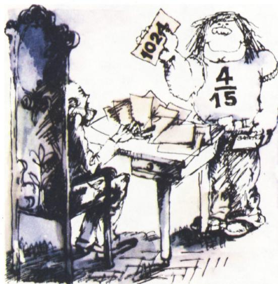
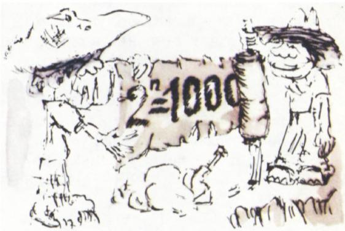
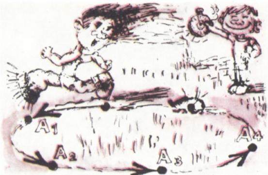
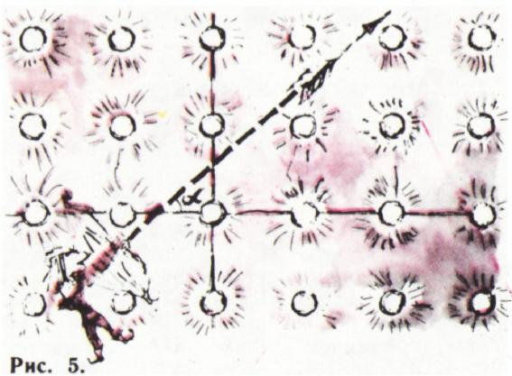
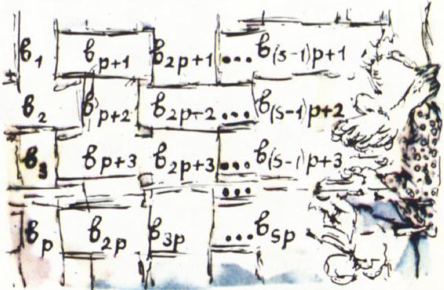
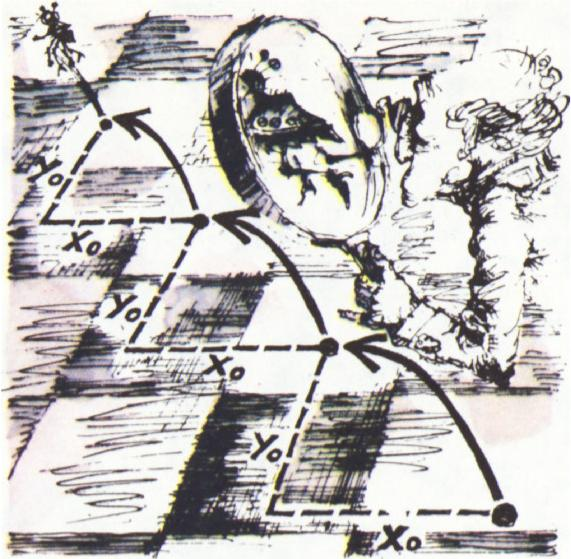

# 2 的幂首位是 1 吗？

> **原标题**：Часто ли степени двойки начинаются с единицы?
> **作者**：В. Г. Болтянский（V. G. 博尔强斯基，1915—2018，苏联数学家，苏联国家列宁奖得主，专长几何、拓扑、数学教育）
> **译自**：Квант 1978, № 5, с. 2–7
> **原文扫描**：https://www.kvant.digital/data/kvant_1978_5/jpg/0002.jpg
> **主题**：对数、小数部分（分数部分）、一致分布、本福特（首数字）现象、抽屉原理
> **难度**：★★★（需要熟悉对数、极限、小数部分；末节定理证明用到抽屉原理与估计）
> **译者**：Claude（初译）／ 2026-06-24

---

## 问题的提法

在 2 的各次幂之中，一再出现以 1 开头的数。它们出现的频率有多高？换言之，任意取一个 2 的幂，它以数字 1 开头的概率是多少？

我们把问题说得更确切些。在上面所列的（见篇首插图）十五个数中，有四个以 1 开头。把这些数分别写在十五张卡片上，洗乱后随机地抽出一张。这张卡片上的数以 1 开头的概率等于 $4/15$（图 1）。

*图 1*

现取 $2$ 的前 $n$ 个幂，即数 $2^{1}$、$2^{2}$、…、$2^{n}$；设其中有 $a_{n}$ 个数（在十进制表示下）以 1 开头。那么从 $2^{1}$、$2^{2}$、…、$2^{n}$ 中随机取一个数、它以数字 1 开头的概率等于 $a_{n}/n$。这一概率依赖于 $n$，也就是依赖于取了多少个 2 的幂。极限

$$
p _ {1} = \lim _ {n \rightarrow \infty} \frac {a _ {n}}{n},\tag{1}
$$

（若它存在）就叫做：任意取一个 2 的幂时，它以数字 1 开头的概率。

### 习题

1. 任意取一个自然数，它能被 3 整除的概率是多少？

2. 任意取十进制小数 $\dfrac{161}{222}$ 展开式中的一位数字，它是 5 的概率是多少？是 2 的概率又是多少？

3. 任意取一个自然数，它是完全平方数的概率是多少？

## 计算 (1) 式的极限

在两位数中、作为 2 的幂的，恰好有一个（即 16）以 1 开头。在三位数中、作为 2 的幂的，也恰好有一个数（即 128）以 1 开头。对于四位数的 2 的幂，同样如此。

一般地，当 $k > 1$ 时，在 $k$ 位数中作为 2 的幂的数里，恰好有一个以数字 1 开头。事实上，最小的那个作为 2 的幂的 $k$ 位数，必以 1 开头（否则，把它除以 2，便得到前一个 2 的幂也还是 $k$ 位数）。而以数字 1 开头的 $k$ 位 2 的幂也不会再有第二个：下一个 2 的幂，首位将会是 2 或 3；再下一个，首位会更大，直到我们得到一个 $(k+1)$ 位数。

由上所述可知：若 $2^{n}$ 是一个 $m$ 位数，则在 $2^{1}$、$2^{2}$、…、$2^{n}$ 中恰有 $m-1$ 个以 1 开头，即 $a_{n} = m-1$。但「$2^{n}$ 是一个 $m$ 位数」这句话意味着

$$
1 0 ^ {m - 1} \leqslant 2 ^ {n} <   1 0 ^ {m},
$$

即

$$
m - 1 \leqslant n \lg 2 <   m.
$$

回忆 $a_{n} = m-1$，便得

$$
\lg 2 - \frac {1}{n} <   \frac {a _ {n}}{n} \leqslant \lg 2,
$$

因而

$$
p _ {1} = \lim _ {n \rightarrow \infty} \frac {a _ {n}}{n} = \lg 2 = 0{,}30103\dots
$$

于是，30% 稍多的 2 的幂以 1 开头。

### 习题

4. 用 $p_{q}$ 表示任意取一个 2 的幂、它以数字 $q$\* 开头的概率。证明下列等式：

$$
\begin{array}{c} p _ {2} + p _ {3} = p _ {1},\quad p _ {4} + p _ {5} = p _ {2},\quad p _ {6} + p _ {7} = p _ {3}, \\ p _ {8} + p _ {9} = p _ {4}.\end{array}
$$

5. 证明：$p_{4} = 1 - 3\lg 2 = 0{,}096\dots$

*图 2*

可见，以数字 4 开头的 2 的幂，比以数字 1 开头的要少三倍多（图 2）。

## 一般问题

那么，任意取一个给定自然数 $l$ 的幂时，它以数字 $q$ 开头（在十进制表示下）的概率是多少？

设数 $l^{n}$ 在十进制表示下以数字 $q$ 开头，即

$$
q \cdot 1 0 ^ {m} \leqslant l ^ {n} <   (q + 1) \cdot 1 0 ^ {m},
$$

其中 $m$ 是某个整数。把这些不等式除以 $q \cdot 10^{m}$，再取以 10 为底的对数，便得：

$$
0 \leqslant (n \lg l - \lg q) - m <   \lg \frac {q + 1}{q}.\tag{2}
$$

因为右端的数小于 1（$\dfrac{q+1}{q} = 1 + \dfrac{1}{q} \leqslant 2 < 10$），所以不等式 (2) 表示：数 $n\lg l - \lg q$ 的小数部分小于 $\lg\dfrac{q+1}{q}$（提醒一下：数 $x$ 的**小数部分**是指 $x$ 与其整数部分的差：$\{x\} = x - [x]$，而 $x$ 的**整数部分** $[x]$ 是不超过 $x$ 的最大整数）。反之，若数 $n \lg l - \lg q$ 的小数部分小于 $\lg \dfrac{q + 1}{q}$，即存在某个整数 $m$ 使不等式 (2) 成立，则 $l^{n}$ 在十进制表示下以数字 $q$ 开头。这样一来，所提问题等价于下面这个问题：对任意取的自然数 $n$，

$$
\{n \lg l - \lg q \} <   \lg \frac {q + 1}{q}
$$

成立的概率是多少？

解这后一个问题，将借助于下述

**小数部分定理**。设 $\alpha$、$\beta$ 是实数，其中 $\alpha$ 是无理数，$I$ 是包含在区间 $[0,\,1]$ 之内、长度为 $h$ 的某个区间。考虑无穷数列 $\alpha+\beta$、$2\alpha+\beta$、…、$n\alpha+\beta$、…。从该数列中任取一个数，它的小数部分属于区间 $I$ 的概率等于 $h$。

这条定理的证明放到文章末尾，现在先来看它如何应用于我们的问题。

首先注意：若 $l$ 是 10 的幂，则 $l$ 的一切幂都以 1 开头，即此情形下问题平凡。

若 $l$ 不是 10 的幂，则数 $\alpha = \lg l$ 是无理数。由小数部分定理，数列 $n \lg l - \lg q\ (n = 1,\,2,\,\ldots)$ 中任取一个数、它的小数部分属于区间 $\left[0,\,\lg\dfrac{q + 1}{q}\right]$ 的概率等于 $\lg\dfrac{q + 1}{q}$。这就给出了前面问题的解：任意取自然数 $l$（$l$ 不是 10 的幂）的一个幂、它以数字 $q$ 开头的概率等于 $\lg\dfrac{q + 1}{q}$。

请注意：这一概率**与 $l$ 无关**！例如，2 的幂和 3 的幂，都以同样的频率（即以概率 $\lg 2$）以数字 1 开头。

### 习题

6. 证明：若自然数 $l$ 不是 10 的幂，则数 $\lg l$ 是无理数。

7. 计算题 4 中所列的概率 $p_{2},\ldots,p_{9}$。由此重新给出那里所列等式的新证明。

8. 任意取一个 2 的幂，它以数字组合 1000 开头的概率是多少（图 3）？

*图 3*

9. 任意取数 $l$（$l$ 不是 10 的幂）的一个幂、它以数字组合 $q_{1}q_{2}\ldots q_{r}$（其中 $q_{1}\neq0$）开头的概率是多少？由此推出：数 $l$ 的幂可以以任意的数字组合 $q_{1}q_{2}\ldots q_{r}$（$q_{1}\neq0$）开头。

10. 证明下列断言：

а) 任意取数 $l$（$l$ 不是 10 的幂）的一个幂、它从左数第二位是 0 的概率等于

$$
p _ {0} ^ {(2)} = \lg (1\cdot 2\cdot 3\cdots\cdot 9) - \lg (9!) - 9.
$$

提示：$p_{0}^{(2)}$ 是数 $l$ 的任意一个幂以数字组合 10、20、…、90 开头的概率之和。

б) 任意取数 $l$（$l$ 不是 10 的幂）的一个幂、它从左数第 $k$ 位是 $q$（$k > 1$，$q = 0,\,1,\,\ldots,\,9$）的概率等于：

$$
p _ {q} ^ {(k)} = \sum_ {i = 1 0 ^ {k - 2}} ^ {1 0 ^ {k - 1} - 1} \lg \left(1 + \frac {1}{q + 1 0 i}\right).
$$

11\*. 利用题 10 б 的结果证明 $\lim_{k\to\infty}p_{q}^{(k)}=1/10$。也就是说，当 $k$ 充分大时，概率 $p_{0}^{(k)},\,p_{1}^{(k)},\,\ldots,\,p_{9}^{(k)}$ 中每一个都与 $1/10$ 任意接近。

> 提示：先证当 $x>0$ 时 $\ln(1+x)<x$\*；然后利用下列关系：
>
> $$
> \begin{array}{r l} & \lg \left(1 + \frac {1}{1 0 i}\right) - \lg \left(1 + \frac {1}{1 0 i + q}\right) < \\ & < \lg \left(1 + \frac {q}{1 0 0 i (i - 1)}\right) = \\ & = \frac {1}{\ln 1 0} \ln \left(1 + \frac {q}{1 0 0 i (i - 1)}\right) < \\ & < \frac {1}{\ln 1 0} \cdot \frac {q}{1 0 0 i (i - 1)} = \\ & = \frac {q}{1 0 0 \ln 1 0} \left(\frac {1}{i - 1} - \frac {1}{i}\right).\end{array}
> $$

12. 把题 9 和题 10 б 的结果推广到把数 $l$ 的幂写在 $b$ 进制（$b > 1$）下的情形。特别地，在二进制下题 10 б 的公式取如下形式：

$$
p _ {0} ^ {(k)} = \log_ {2} \left[ \frac {2 ^ {k - 1} + 1}{2 ^ {k - 1}} \cdot \frac {2 ^ {k - 1} + 3}{2 ^ {k - 1} + 2} \times \cdots \right. \left. \cdots \times \frac {2 ^ {k} - 1}{2 ^ {k} - 2} \right].
$$

$$
\begin{array}{r l} p _ {1} ^ {(k)} = \log_ {2} \left[ \frac {2 ^ {k - 1} + 2}{2 ^ {k - 1} + 1} \cdot \frac {2 ^ {k - 1} + 4}{2 ^ {k - 1} + 3} \times \cdots \right. \\ & \left. \cdots \times \frac {2 ^ {k}}{2 ^ {k} - 1} \right].\end{array}
$$

## 再一个问题

作为小数部分定理应用的又一个例子，考虑下面的问题：数 $\alpha$ 是无理数；试证存在自然数 $n$，使 $\cos n\alpha\pi > 0{,}999$。

注意，不等式 $\cos n\alpha\pi > 0{,}999$ 等价于下述不等式：

$$
\begin{array}{r l} 2 m \pi - \arccos 0{,}999 & < n \alpha \pi < \\ & < 2 m \pi + \arccos 0{,}999\end{array}
$$

$$
\begin{array}{l} \text{（对某个整数 } m\text{），即} \\ m < \frac {\alpha}{2} n + \frac {1}{2 \pi} \arccos 0{,}999 < \end{array}
$$

$$
< m + \frac {1}{\pi} \arccos 0{,}999.
$$

换言之，不等式 $\cos n\alpha\pi > 0{,}999$ 成立，当且仅当

$$
\left\{\frac {\alpha}{2} n + \frac {1}{2 \pi} \arccos 0{,}999 \right\}
$$

落在区间

$$
\left[0,\ \frac {1}{\pi} \arccos 0{,}999 \right]
$$

之内。

*图 4*

由小数部分定理，任取一个自然数 $n$，它满足上述条件的概率等于 $\dfrac{1}{\pi}\arccos 0{,}999 \approx 0{,}014$。这样，若 $N$ 充分大，则在 $1,\,2,\,\ldots,\,N$ 这些数中，约有 1.4% 满足所提要求。

### 习题

13. 从单位圆周的任一点起，依次截取长度为 1 的弧。记所得的弧的端点依次为 $A_{1},\,A_{2},\,\ldots,\,A_{n},\,\ldots$。证明：无论在该圆周上任取哪一段弧 $Q$，都存在某点 $A_{i} \in Q$（图 4）。

14. 证明：若 $\alpha$ 是无理数，则函数 $\cos x + \cos\alpha x$ 不是周期函数。

15. 给定两个无穷等差数列：

$$
\begin{array}{l} a _ {1} + d _ {1},\ a _ {1} + 2 d _ {1},\ a _ {1} + 3 d _ {1},\ \ldots; \\ a _ {2} + d _ {2},\ a _ {2} + 2 d _ {2},\ a _ {2} + 3 d _ {2},\ \ldots,\end{array}
$$

其中 $d_{1}$ 与 $d_{2}$ 为正数，且比值 $d_{1}/d_{2}$ 是无理数。是否一定存在第一个数列的某一项与第二个数列的某一项，其差的模小于 $0{,}000001$？

16. 把以整数坐标点为圆心、半径为 $\varepsilon$ 的所有圆的并集称为半径 $\varepsilon$ 的「森林」。证明：若一条直线与横轴的夹角 $\varphi$ 满足 $\tan\varphi$ 是无理数，则此直线必穿过森林（无论 $\varepsilon$ 多么小；图 5）。

## 定理的证明

现在转向小数部分定理的证明。

取任一自然数 $r$。点 $\dfrac{1}{r}$、$\dfrac{2}{r}$、…、$\dfrac{r-1}{r}$ 把区间 $[0,\,1]$ 分成 $r$ 个长为 $\dfrac{1}{r}$ 的小段。把这些小段称为「鸽笼」，而把数 $\alpha$、$2\alpha$、…、$(r+1)\alpha$ 的小数部分称为「鸽子」\*。由于「鸽笼」有 $r$ 个而「鸽子」有 $r+1$ 个，故必有两只「鸽子」落入同一个鸽笼，即存在自然数 $p'$ 与 $p''$（$p' > p''$），使 $p'\alpha$ 与 $p''\alpha$ 的小数部分之差小于 $\dfrac{1}{r}$。亦即 $|(p'\alpha - p''\alpha) - m| < \dfrac{1}{r}$，其中 $m$ 为某个整数。令 $p = p' - p''$，便可写 $|p\alpha - m| = \varepsilon$，其中 $\varepsilon < \dfrac{1}{r}$。注意 $\varepsilon \neq 0$，因为 $\alpha$ 是无理数。记 $s$ 为超过 $\dfrac{1}{\varepsilon}$ 的最小自然数，即 $s - 1 \leqslant \dfrac{1}{\varepsilon} < s$。

考虑以 $p\alpha$ 为公差的、$s$ 个连续的等差数列项：

$$
\gamma + p\alpha,\ \gamma + 2p\alpha,\ \ldots,\ \gamma + sp\alpha,\tag{3}
$$

其中 $\gamma$ 是某个实数。把 (3) 中各数的小数部分记作 $x_1,\,x_2,\,\ldots,\,x_s$。由等式 $|p\alpha - m| = \varepsilon$ 知，$x_1,\,x_2,\,\ldots,\,x_s$ 彼此相距 $\varepsilon$（图 6）。由不等式 $\dfrac{1}{s} < \varepsilon \leqslant \dfrac{1}{s - 1}$ 知，在图 6б 中点 $x_1$ 与 $x_{s}$ 之间的距离小于 $\varepsilon$。综上可知：落入长为 $h$ 的区间 $I$ 的点 $x_{1},\,x_{2},\,\ldots,\,x_{s}$ 的个数，介于 $\dfrac{h}{\varepsilon}-1$ 与 $\dfrac{h}{\varepsilon}+2$ 之间，即介于 $sh-2$ 与 $sh+2$ 之间（注意 $h < 1$）。

![图 6：数列 (3) 各项小数部分 $x_1,x_2,\ldots,x_s$ 在区间 $[0,1]$ 上的分布；它们彼此相距 $\varepsilon$](../images/1978_05_boltyanskij_D06/fig_p6_01.png)

*图 6*

现取以 $\alpha$ 为公差的任一等差数列的 $ps$ 个连续项 $b_{1}$、$b_{2}$、…、$b_{ps}$（即 $b_{i+1} = b_{i} + \alpha$）。把它们排成如图 7 所示的表。显然表中每一行都是形如 (3) 的数列。由于表的行数为 $p$，故所考虑的数列 $b_{1}$、$b_{2}$、…、$b_{ps}$ 中、其小数部分落入区间 $I$ 的项数，介于 $p(sh-2)$ 与 $p(sh+2)$ 之间。

*图 7*

最后，设 $n$ 是任一大于 $rps$ 的自然数。把 $n$ 除以 $ps$（带余），得 $n = lps + q$，其中 $l \geqslant r$，$0 \leqslant q < ps$。于是，从数 $\alpha + \beta$、$2\alpha + \beta$、…、$n\alpha + \beta$ 中，可以取出 $l$ 组、每组 $ps$ 个以 $\alpha$ 为公差的连续项，外加剩下的 $q$ 个数。所以

$$
l p (s h - 2) \leqslant a _ {n} \leqslant l p (s h + 2) + q,
$$

其中 $a_{n}$ 是数 $\alpha+\beta$、$2\alpha+\beta$、…、$n\alpha+\beta$ 中、其小数部分落入区间 $I$ 的个数。此不等式可改写为

$$
(n - q) h - 2 l p \leqslant a _ {n} \leqslant (n - q) h + 2 l p + q,
$$

由此（利用 $0 \leqslant h < 1$、$q < ps$）得

$$
n h - 2 l p - p s \leqslant a _ {n} \leqslant n h + 2 l p + p s,
$$

即

$$
\begin{array}{r l} \left| \frac {a _ {n}}{n} - h \right| & \leqslant \frac {2 l p + p s}{n} \leqslant \frac {2 l p + p s}{l p s} = \\ & = \frac {2}{s} + \frac {1}{l} < \frac {3}{r}\end{array}
$$

（因 $l \geqslant r$ 且 $\dfrac{1}{s} < \varepsilon < \dfrac{1}{r}$）。故存在自然数 $N$（即 $N = rps$），使当 $n > N$ 时不等式 $\left|\dfrac{a_{n}}{n} - h\right| < \dfrac{3}{r}$ 成立。鉴于 $r$ 的任意性，由此推得 $\lim_{n \to \infty} \dfrac{a_{n}}{n} = h$。

### 习题

17. 证明小数部分定理的下述「二维」推广。设在平面上固定了一个坐标系。以坐标 $x,\,y$ 给出的向量 $\mathbf{a}$ 的**小数部分**定义为：其坐标分别是 $x$ 与 $y$ 的小数部分的向量（图 8）。设 $M$ 是包含在以 $(0;\,0)$、$(0;\,1)$、$(1;\,0)$、$(1;\,1)$ 为顶点的正方形内的某个多边形。称某向量 $b$ **落入** $M$，若 $b = OB$，其中 $O$ 是坐标原点而 $B \in M$。设 $\alpha$、$\beta$ 是平面上任意两个向量，其中向量 $\alpha$ 的坐标 $x_0,\,y_0$ 使 $\dfrac{x_0}{y_0}$ 是无理数。考虑无穷向量序列 $\alpha + \beta$、$2\alpha + \beta$、…、$n\alpha + \beta$。从该序列任取一向量、其小数部分落入多边形 $M$ 的概率，等于此多边形的面积 $S(M)$\*。

![图 8：向量的二维小数部分——坐标分量分别取小数部分；多边形 $M$ 落在单位正方形 $[0,1]^2$ 之内](../images/1978_05_boltyanskij_D06/fig_p7_01.png)

*图 8*

18. 在以边长为 1 的正方形为格子的无穷棋盘上，有一只跳蚤，每跳一次向左移动 $x_0$、向上移动 $y_0$（图 9）。证明：若数 $x_0$、$y_0$ 与 $\dfrac{x_0}{y_0}$ 都是无理数，则该跳蚤迟早必定会落到一个黑格上。

*图 9*

19. 数 $\dfrac{\lambda_{1}}{\pi}$、$\dfrac{\lambda_{2}}{\pi}$ 与 $\dfrac{\lambda_{1}}{\lambda_{2}}$ 都是无理数。证明：不等式组

$$
\sin n\lambda_{1}>0{,}999999,\qquad \sin n\lambda_{2}>0{,}999999
$$

有自然数解 $n$。

---

## 译者注与校对说明

1. **OCR 校正**：本文由 MinerU 对扫描页做俄文 OCR 后翻译。已校正若干典型 OCR 错误：题 5 中 $p_{4}=1-3\lg 2$ 原文 `1-3 lg 2`（空格与数字连写）已规范化；题 10 а）中 $p_{0}^{(2)}$ 的表达式原 OCR 将 `1·2·3·…·9`（即 $9!$）误植为带感叹号样式 `1 1·2 1·3 1……·9 1`（数字间夹了空格），此处按数学含义还原为 $\lg(1\cdot2\cdot3\cdots\cdot9)-\lg(9!)-9$，其结果确为负数 $-\lg 9 - 9 + \lg 9!$；题 10 项目字母 а)、б) 原 OCR 误识为 a)、6)，已还原为俄文字母 а)、б)；多处俄文小数逗号（如 $0{,}30103$、$0{,}999$、$0{,}000001$）保留俄式记法；公式 (1) $p_1=\lim\limits_{n\to\infty}\dfrac{a_n}{n}$ 与扫描首页核对无误。
2. **术语**：本文核心工具是 $\{x\} = x - [x]$（**小数部分**，俄语 дробная часть）与 $[x]$（**整数部分**，俄语 целая часть）；关键结果是 $2$ 的幂首位数字分布服从 $\lg\dfrac{q+1}{q}$——即今日所称的**本福特定律**（Benford's law）。证明用到**抽屉原理**（принцип Дирихле，原文形象化作「鸽笼 / 兔笼」比喻）。术语遵照《01_工作规范.md》对照表。
3. **图表**：原文插图（图 1—9 及篇首卷首插图）由 MinerU 从整页扫描中自动裁出，存于 `images/1978_05_boltyanskij_D06/fig_*.png`，共 10 幅；fig_p2_01.png 为篇首卷首插图（$2^2$ 到 $2^{16}$ 的 2 的幂表，经图像分析核实）。题 10、12 中较长的连乘积、对数不等式链等公式已与扫描页核对排式。
4. **苏联时代用语**：原文以「森林（лес）」「兔子（зайцы）」「鸽笼（клетки）」等形象比喻穿插全文（题 16「森林」、定理证明中的「兔笼原理」），译文予以保留，以存苏联科普文章的时代风味。

## 建议讨论题

1. 为什么 $2$ 的幂以 1 开头的概率（$\lg 2\approx 0.301$）竟然与 $3$、$7$、甚至任意（非 10 的幂的）自然数的幂以 1 开头的概率**完全相同**？这一结果与你的直觉是否冲突？请用自己的话解释其背后的原因（提示：关键在于 $\lg l$ 是无理数）。
2. 本文所得到的首位数字分布 $\lg\dfrac{q+1}{q}$，其实就是著名的「本福特定律」。试想：为什么在现实世界中（人口统计、账目数据、河流长度）首数字 1 比 9 出现得更频繁？本文的概率模型是否能套到这些数据上？
3. 小数部分定理其实是数论中「一致分布」（равномерное распределение）的一个初等版本。文中用「鸽笼」比喻证明它——你能复述这个论证中 $\varepsilon$、$s$、$p$ 这三个量各自扮演的角色吗？
4. 题 19 中两个不等式 $\sin n\lambda_1 > 0.999999$ 与 $\sin n\lambda_2 > 0.999999$ 同时成立的概率约为 $0.014^2\approx 0{,}0002$。尽管这概率极小，定理仍保证有解——这与「独立小概率事件几乎不发生」的日常直觉如何调和？（提示：此处 $n$ 取遍无穷多个自然数。）

---

> **版权说明**：原文版权归 MCCME（莫斯科连续数学教育中心）及作者继承者所有。本译文为非商业、自用、数学圈内部参考，未获授权不得公开分发。原文扫描见 [kvant.digital](https://www.kvant.digital/data/kvant_1978_5/jpg/0002.jpg)。

> **复用说明**：本译文的俄文 OCR 原文与所有插图均存档于 `ocr/1978_05_boltyanskij_D06/`（`ru.md` 为合并 OCR 文本，`meta.json` 为图映射）。如对译文质量不满意，可直接基于 `ru.md` 重译，无需重跑 OCR。
