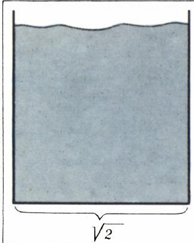
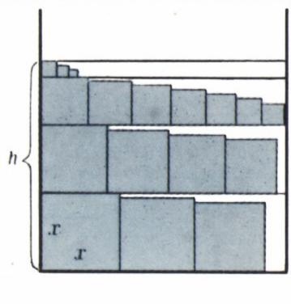
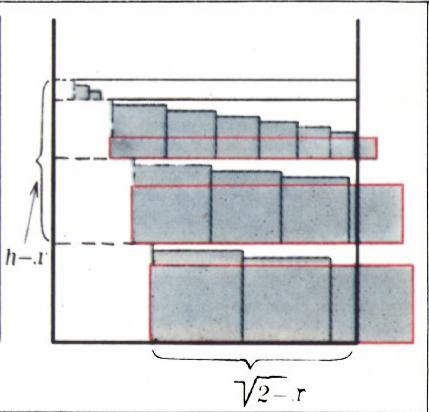
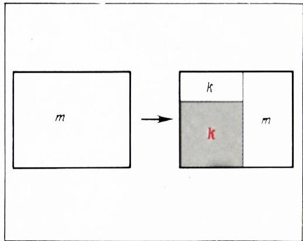
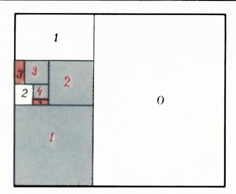
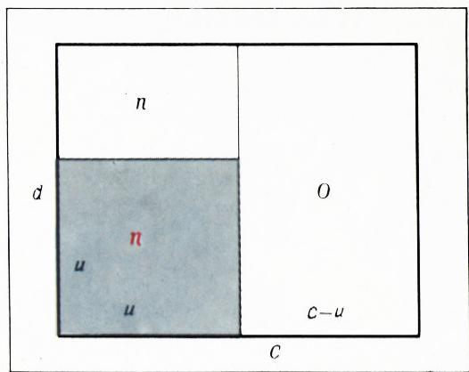

# 正方形装箱

> **原标题**：Упаковка квадратов
> **作者**：Н. Б. Васильев, Г. А. Гальперин（Н. Б. 瓦西里耶夫；Г. А. 加尔佩林，苏联数学家，Kvant 编辑部）
> **译自**：Квант 1973, № 4, с. 35–37
> **原文扫描**：https://www.kvant.digital/data/kvant_1973_4/jpg/0035.jpg
> **主题**：将若干小正方形（面积之和为 1）无重叠地装入面积为 2 的大正方形——两套证明及其推广
> **难度**：★★（高中／竞赛层面：放缩估计、归纳式装箱算法、反证）
> **译者**：Claude（初译）／ 2026-06-24

---

这篇短记用来解答《Kvant》题库中的一道题（M155）。

> 给定若干个正方形，其面积之和等于 1。证明：可以把它们无重叠地放进一个面积为 2 的正方形中。

我们将给出这道题的两种解法，它们分别基于两种不同的摆放正方形的方式；然后讨论它的一些推广。于是，设给定若干个总面积为 1 的正方形。把它们按边长递减的顺序编号，也就是使第 $k$ 个正方形的边长不小于第 $(k+1)$ 个的边长（$k=1,2,3,\ldots$）。我们要证明，所有这些正方形都能被放进一个边长为 $\sqrt{2}$ 的正方形中。

## 第一种解法

在平面上作一条长为 $\sqrt{2}$ 的水平线段，并从它的两端各引一条竖直射线。我们就在这样形成的「半带形」中（图 1）把正方形装进去。

装箱的方法很简单。把第一个、也就是最大的正方形放进左下角（这个正方形的边长记作 $x$），紧挨着它的右边放第二个、即次大的正方形，如此继续下去，直到下一个正方形再也放不进半带形为止。装完「第一层」之后，作一层「楼板」——把左端正方形上方的边延长到半带形的整个宽度；在得到的这段线段上完全同样地搭「第二层」，然后是第三层，依此类推，直到所有正方形用完为止（图 2）。

现在，为了证明题目的断言，我们只要证明高度 $h$（见图 2）不超过数 $\sqrt{2}$ 即可。（在读下去之前，请先自己动手证一证！）

*图 1：准备装箱的半带形*

*图 2：分层装箱*

为此，我们把 $h$ 与 $x$ 视为给定量，从下方估计装进半带形的所有小正方形面积之和。把每一个紧贴左侧「墙」的小正方形（最下方那个 $x \times x$ 的正方形除外）在心中搬到下一层的末端，如图 3 所示。由各层的构造方式可知，所有这些正方形都会探出右侧的墙外。现在把每一个这样得到的新正方形的水平边向左延长，一直延到对应一层最左侧的正方形为止（这样便形成一些矩形，在图 3 中用红线画出）。显然，所有正方形（除 $x \times x$ 外）的面积之和不小于所得诸矩形面积之和。

*图 3：搬运贴墙正方形并放大矩形*

由于每个矩形的水平底边不小于 $\sqrt{2}-x$，而它们的高之和等于 $h-x$，所以所有矩形面积之和不小于 $(\sqrt{2}-x)(h-x)$，从而所有正方形面积之和不小于 $x^{2}+(\sqrt{2}-x)(h-x)$。

但根据条件，它们的面积之和等于 1。于是

$$
x ^ {2} + (\sqrt {2} - x) (h - x) \leqslant 1,
$$

由此

$$
h \leqslant \frac {1 - x ^ {2}}{\sqrt {2} - x} + x = \sqrt {2} \left[ 3 - \left(y + \frac {1}{y}\right) \right],
$$

其中

$$
y = 2 - x \sqrt {2}.
$$

因此，由于圆括号中的量 $y + \dfrac{1}{y}$ 对任意 $y$ 都不小于 2，故 $h \leqslant \sqrt{2}$。

## 第二种解法

如果在第一种解法里，描述正方形的摆放方式非常容易，而主要困难在于证明所需的不等式估计；那么第二种解法正好相反：难以描述装箱的方式（而估计几乎是显然的）。有好几位读者提出过下文装箱方式的若干不甚精确的描述。

我们在这里把装箱方式完全形式化地描述出来。「算法」——也就是我们要按其去装箱正方形的那份指令——包含在下一段中。在所述操作执行 $k$ 次之后，前 $k$ 个正方形（我们仍然假定它们是按边长递减编号的）已被放进 $\sqrt{2} \times \sqrt{2}$ 的正方形，而 $\sqrt{2} \times \sqrt{2}$ 正方形的剩余部分被划分为 $(k+1)$ 个矩形，每个矩形都附有一个确定的编号（从 $0$ 到 $k$）。其中一些矩形被宣布为「关闭」（意思是再也不往里放正方形了），其余的被宣布为「开放」（$(k+1)$ 个正方形会被放进某一个开放的矩形）。开始时，整个 $\sqrt{2} \times \sqrt{2}$ 的正方形被宣布为「第 0 号矩形」。于是，正方形的摆位算法如下：

**第 $k$ 步（$k = 1, 2, 3, \ldots$）**。在所有未关闭的矩形中选出编号最大的那一个（设其编号为 $m$）。在其角上放上第 $k$ 个正方形。把这个正方形平行于矩形 $m$ 较短边的那条边延长（如果矩形两邻边相等，任取其一），使得矩形 $m$ 中未被第 $k$ 个正方形占据的部分被划分为两个矩形。在这两个矩形中，与第 $k$ 个正方形共同构成一个矩形的那个，我们赋予它编号 $k$；而编号 $m$ 则保留给「原」矩形 $m$ 剩下的那部分（图 4）。除矩形 $m$ 和矩形 $k$ 外，所有正方形与矩形都保留原来的编号。如果我们所放的第 $k$ 个正方形不是最后一个，那么就检验第 $(k+1)$ 个正方形是否还能放进矩形 $k$ 和矩形 $m$；若不能，则把对应的矩形（或两个矩形都）宣布为关闭。

*图 4：单步装箱算法的图示*

（在图 5 中举例展示了第 4 步之后可能出现的一种局面。对于 $k = 5$，编号 $m$ 将等于 2；淡色矩形是关闭的。）

*图 5：第 4 步后的局面*

还要证明：不会出现所有矩形、连「第 0 号」都关闭了的情形。在证明这一点之前，请注意，编号为 $k$ 的关闭矩形的面积小于编号为 $k$ 的正方形的面积（这正是我们这种装箱方式的核心思想！）。事实上，显然只要矩形 $k$ 的较短边还等于正方形 $k$ 的边长，它就还不能被关闭（就连第 $k$ 个正方形本身都还能放进去）。

现在假设在第 $n$ 步，那个在此步之前尺寸为 $c \times d\ (c \geqslant d)$ 的矩形 0 被关闭。显然在第 $n$ 步 $m = 0$，即所有编号 $m > 0$ 的矩形都已关闭，它们的面积都小于对应正方形的面积。

设 $u$ 与 $v$ 分别是编号为 $n$ 和 $n+1$ 的正方形的边长。如果正方形 $v \times v$ 放不进矩形 $d \times (c - u)$（图 6），则 $v \geqslant c - u$，因此

$$
2 (u ^ {2} + v ^ {2}) \geqslant (u + v) ^ {2} \geqslant c ^ {2} \geqslant c d,
$$

也就是说，第 $n$ 个与第 $(n+1)$ 个正方形的面积之和不小于矩形 $c \times d$ 面积的一半。这样一来，光是前 $(n+1)$ 个正方形就占去了 $\sqrt{2} \times \sqrt{2}$ 正方形面积的一大半。矛盾。

*图 6：反证法的关键估计*

下面给出若干题目，它们对正方形装箱命题作了细化与推广。

## 题目

1. 两个边长为 $a$ 的相同正方形，不能无重叠地放进一个边长小于 $2a$ 的正方形中。

2. 若干个正方形，其面积之和等于 $S$，且其中最大者的边长为 $x$，则可以把它们装箱进一个边长为 $x + \sqrt{S - x^{2}}$ 的正方形中。

3. 这些正方形可以装箱进一个 $a \times b$ 的矩形中，只要 $a \geqslant x$、$b \geqslant x$ 且 $ab \geqslant 2S$。

4. 如果任何一组总面积为 1 的正方形都能被装箱进某个 $a \times b$（其中 $a \geqslant b$）的矩形中，那么下述两条件中至少有一个成立：1) $a \geqslant \sqrt{3}$ 且 $b \geqslant 1$； 2) $a \geqslant \sqrt{2}$ 且 $b \geqslant 2/\sqrt{3}$。

D. 克莱特曼（D. Kleitman）与 M. 克里格（M. Krieger）证明了：在 $1 \times \sqrt{3}$ 的矩形中可以放进任意一组总面积为 1 的正方形。可以猜测，对于 $\sqrt{2} \times 2/\sqrt{3}$ 的矩形也有同样的结论。

5. 若干个矩形，其面积之和等于 $S$，且其中最大边长为 $x$，则可以把它们装箱进一个 $a \times b$ 的矩形中，只要 $a \geqslant x$ 且 $ab \geqslant 2S + a^{2}/8$。

6. 总体积为 $V$ 的若干个立方体，可以装箱进一个体积为 $4V$ 的立方体中。

---

## 译者注与校对说明

1. **OCR 校正**：本文由 MinerU 对扫描页（p35–p37）做俄文 OCR 后翻译。已校正若干 OCR 瑕疵：「Первоерешение」实为「Первое решение」（第一解）的连写，已按词义断开；图 5 说明中「бежевые」（米色／淡色的）原指图中标记关闭矩形所用浅色填充，译作「淡色矩形」；原文跨页公式 $h \leqslant \ldots \leqslant \ldots$ 被拆成两个独立公式块（OCR 第 43–49 行），已合并为一条连续不等式。其余公式（含 $\sqrt{2}$、$y + 1/y \geqslant 2$、$2(u^2+v^2)\geqslant(u+v)^2\geqslant c^2\geqslant cd$）均与扫描页核对，识别正确。

2. **术语**：核心为 **упаковка**（装箱／packing）；「этаж」（楼层）译作「层」；「закрытый / открытый прямоугольник」译作「关闭 / 开放的矩形」；其余遵循《01_工作规范.md》对照表（квадрат=正方形, прямоугольник=矩形, площадь=面积, сторона=边长, доказательство=证明, противоречие=矛盾）。

3. **图表**：6 张插图（图 1—6）由 MinerU 从整页扫描裁出，存于 `images/1973_04_vasilev_E01/fig_pXX_NN.png`。图号、相对位置与扫描页一致。

4. **算法注记**：第二种解法给出的「递归分裂矩形 + 编号」装箱方案，与现代计算几何中 **guillotine cutting / shelf packing** 一类装箱算法思想相通；其反证的关键在于「关闭矩形面积 < 对应正方形面积」这一不变量。

5. **公式抽查**：原拟用图像分析工具读取扫描页 p35.jpg 核对首个不等式，但工具当日达到速率限制（HTTP 429）未能执行；已改由人工对照 OCR 文本与数学逻辑一致性校验（不等式 $x^2+(\sqrt2-x)(h-x)\leqslant1$ 经代数化简确可导出 $h\leqslant\sqrt2\,[3-(y+1/y)]$，再由 $y+1/y\geqslant2$ 得 $h\leqslant\sqrt2$，逻辑自洽）。

## 建议讨论题

1. 第一种解法把高度估计化为 $h \leqslant \sqrt{2}\,[3-(y+1/y)]$ 再用 $y+1/y\geqslant2$。请直接验证：当 $x=\sqrt2/2$（即 $y=1$）时取到等号 $h=\sqrt2$，此时半带形恰好「装满」。这说明题目中的常数 $2$（面积）能否再小？请结合题目 1 思考。

2. 第二种解法的「关闭矩形面积小于对应正方形面积」这一不变量为何始终成立？试追踪前 5 步，亲手验证图 5 中各编号矩形的尺寸。

3. 题目 3 说 $ab\geqslant2S$ 即可装箱进 $a\times b$ 矩形。它的证明思路与哪种解法（第一种还是第二种）更接近？请给出证明梗概。

4. 题目 6 把平面结论「面积之和 $1$ 可装箱进面积 $2$」推广到三维「体积之和 $V$ 可装箱进体积 $4V$」。这里的常数 $4$ 是怎么来的？能否类比二维的 $\sqrt2$（线性尺度）给出直觉解释？

---

> **版权说明**：原文版权归 MCCME（莫斯科连续数学教育中心）及作者继承者所有。本译文为非商业、自用、数学圈内部参考，未获授权不得公开分发。原文扫描见 [kvant.digital](https://www.kvant.digital/data/kvant_1973_4/jpg/0035.jpg)。

> **复用说明**：本译文的俄文 OCR 原文与所有插图均存档于 `ocr/1973_04_vasilev_E01/`（`ru.md` 为 OCR 文本，`meta.json` 为图映射）。如对译文质量不满意，可直接基于 `ru.md` 重译，无需重跑 OCR。
