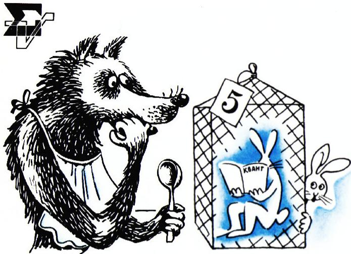
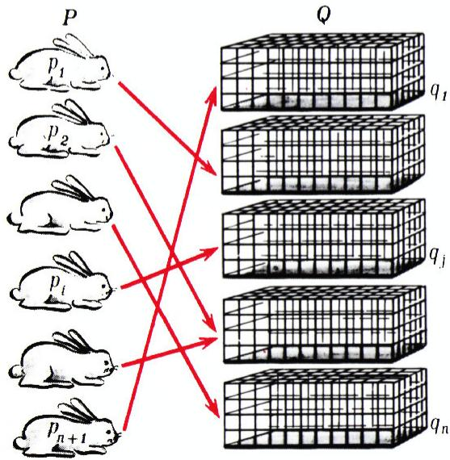
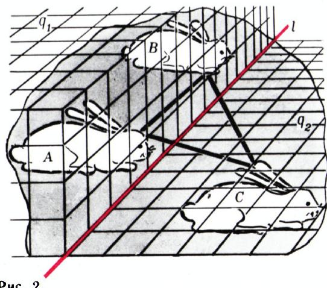
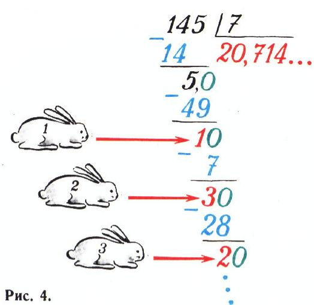
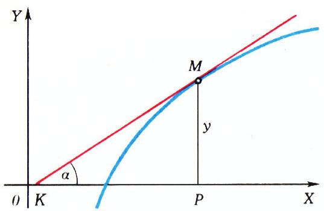
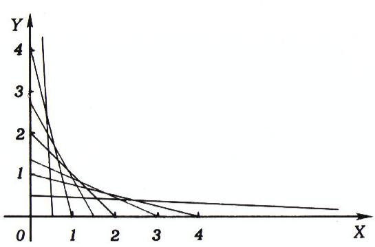

# 五笼六兔（抽屉原理）

> **原标题**：Шесть зайцев в пяти клетках
> **作者**：В. Г. Болтянский（V. G. 波尔佳斯基，1915—2002，苏联数学家，莫斯科大学教授，苏联科学院通讯院士，专长几何与组合几何，科普名著《等积与等组成图形》作者）
> **译自**：Квант 1977, № 2, с. 17–20, 37, 42
> **原文扫描**：https://www.kvant.digital/data/kvant_1977_2/jpg/0017.jpg
> **主题**：抽屉原理（鸽巢原理）及其在数论、几何、组合中的应用
> **难度**：★（文字初中可读；部分例题与习题涉及互素、十进制周期小数等，属高中／竞赛层面）
> **译者**：Claude（初译）／ 2026-06-24

---

> *「好吧，你们这些兔子，走着瞧！」——狼*

*图 1：题图（"Ну зайцы, погодите!"）*

请读者承认：如果规定每只笼子里至多只能放一只兔子，那么想把六只兔子关进五只笼子里是办不到的；一般地，对任何自然数 $n$，都不可能把 $n+1$ 只兔子关进 $n$ 只笼子里。换一种说法也行：如果在 $n$ 只笼子里关着 $n+1$ 只或更多的兔子，那么一定存在一只笼子，里面至少关着两只兔子。

记兔子为 $p_{1},\ldots,p_{n+1}$，笼子为 $q_{1},\ldots,q_{n}$。这样一来，每一种把兔子关进笼子的方式，都可以看成是集合 $P = \{p_1, \ldots, p_{n+1}\}$ 到集合 $Q = \{q_1, \ldots, q_n\}$ 的一个**映射**（图 1）：兔子 $p_i \in P$ 被对应到（作为它的「像」）它所在的那只笼子 $q_j \in Q$。于是，前面关于笼中兔子的那句话就有了如下的数学含义：在集合 $P$（含 $n+1$ 个元素）到集合 $Q$（含 $n$ 个元素）的任意一个映射下，总能找到 $P$ 中的两个元素，它们具有同一个像。

*В. Болтянский（V. G. 波尔佳斯基）*

这一论断称为**抽屉原理**\*。用数学归纳法不难证明它的正确性。按照一条不成文的传统，全世界数学家在介绍抽屉原理时，都不是用「集合」「映射」的语言，也不是用别的什么物件，而是恰恰用兔子和笼子来阐释它的含义。

抽屉原理虽然简单、显然，却经常在定理证明与解题中发挥作用。

**例 1.** 证明：若直线 $l$ 位于三角形 $ABC$ 所在平面内，且不经过该三角形的任何

一个顶点，则它不可能与三角形的三条边都相交。

记直线 $l$ 把三角形 $ABC$ 所在平面分成的两个半平面为 $q_{1}$ 与 $q_{2}$；我们把这两个半平面看作**开的**（即不包含直线 $l$ 上的点）。所考虑三角形的顶点（点 $A, B, C$）当作「兔子」，半平面 $q_{1}$ 与 $q_{2}$ 当作「笼子」。每一个「兔子」都落入某一只「笼子」（因为直线 $l$ 不经过 $A, B, C$ 中任何一点）。既然「兔子」有三只而「笼子」只有两只，那么一定有两只「兔子」落入同一只「笼子」；换言之，三角形 $ABC$ 的某两个顶点属于同一半平面（图 2）。设点 $A$ 与 $B$ 在同一半平面，即它们位于直线 $l$ 的同一侧。那么线段 $AB$ 与 $l$ 不相交。于是在三角形 $ABC$ 中找到了一条与直线 $l$ 不相交的边。

*图 2：直线 $l$ 不可能同时与三角形三边都相交*

**例 2.** 证明：若给定 100 个整数 $x_{1},\ldots,x_{100}$，则一定能从中选出若干个数（也许只有一个），使它们的和能被 100 整除。

考察如下诸和：

$$
s_{1} = x_{1},\qquad s_{2} = x_{1} + x_{2},\qquad \ldots,\qquad s_{100} = x_{1} + x_{2} + \dots + x_{100}.
$$

如果这些和中至少有一个能被 100 整除，则目的已达到。

设 $s_1, s_2, \ldots, s_{100}$ 中没有一个能被 100 整除。把这些数当作「兔子」，把数 $1, 2, \ldots, 99$ 当作「笼子」。给每一个数 $s_1, s_2, \ldots, s_{100}$ 指派它除以 100 所得的余数。既然 $s_i$ 都不能被 100 整除，所得余数在 $1$ 到 $99$ 之间，即每只「兔子」都落入某一只「笼子」。由抽屉原理，必有两只「兔子」落入同一只「笼子」，即存在 $s_i$ 与 $s_j$（不妨设 $i < j$），它们除以 100 的余数相同。但此时数

$$
s_{j} - s_{i} = (x_{1} + \dots + x_{j}) - (x_{1} + \dots + x_{i}) = x_{i+1} + \dots + x_{j}
$$

能被 100 整除。于是 $x_{i+1} + \ldots + x_j$ 即为所求。

**例 3.** 数 $a$ 与 $m$ 互素。证明：存在一个自然数 $k$，使数 $ka$ 除以 $m$ 时余数为 $1$。

把数 $1, 2, \ldots, m-1$ 当作「兔子」。若 $k$ 是其中一只「兔子」，则 $ka$ 不能被 $m$ 整除（因为 $a$ 与 $m$ 互素，且 $0 < k < m$），即 $ka$ 除以 $m$ 的余数是 $1, 2, \ldots, m-1$ 之一。设对一切 $k = 1, \ldots, m-1$，$ka$ 除以 $m$ 都不得余数 $1$。那么可能的余数只有 $2, \ldots, m-1$。把这些数当作「笼子」（从而「兔子」比「笼子」多）。由抽屉原理，必有两只「兔子」落入同一只「笼子」，即在 $1, 2, \ldots, m-1$ 中存在 $k_1, k_2$，使 $k_1 a$ 与 $k_2 a$ 除以 $m$ 所得余数相同（不妨设 $k_1 < k_2$），因此数 $k_2 a - k_1 a = (k_2 - k_1) a$ 能被 $m$ 整除。由于 $a$ 与 $m$ 互素，故 $k_2 - k_1$ 能被 $m$ 整除。但这不可能，因为 $0 < k_2 - k_1 < m$。所得矛盾表明：一定存在 $k$，使 $ka$ 除以 $m$ 的余数为 $1$。

![图 3：用点 $\frac{1}{N}, \frac{2}{N}, \ldots, \frac{N-1}{N}$ 把区间 $[0,1]$ 分成 $N$ 个子区间](../images/1977_02_boltyanskij_zajcy/fig_p19_01.png)

*图 3：把区间 $[0,1]$ 分成 $N$ 段作「笼子」*

上面确立的事实还可以这样表述：如果 $a$ 与 $m$ 互素，则存在自然数\*\* $k, l$ 使 $ka = lm + 1$，即 $ka - lm = 1$。

**例 4.** 证明：对任意 $a > 0$ 与任意自然数 $N$，都存在整数 $m \geqslant 0$、$k > 0$，使 $|ka - m| \leqslant \dfrac{1}{N}$。

点 $\dfrac{1}{N}, \dfrac{2}{N}, \ldots, \dfrac{N-1}{N}$ 把区间 $[0, 1]$ 分成 $N$ 个小区间，把它们当作「笼子」（图 3）。再把数 $1, 2, \ldots, N+1$ 当作「兔子」。若 $k$ 是其中一只「兔子」，则数 $ka$ 可写成 $ka = m + x$，其中 $m$ 是整数，$0 \leqslant x < 1$。数 $x$ 落入某一只「笼子」：就把「兔子」$k$ 关进这一只「笼子」。

既然「兔子」比「笼子」多，必有两只「兔子」关在同一只「笼子」里。换言之，在 $1, 2, \ldots, N+1$ 中存在 $k_1 < k_2$，使

$$
k_{1}a = m_{1} + x_{1},\quad 0 \leqslant x_{1} < 1;\qquad k_{2}a = m_{2} + x_{2},\quad 0 \leqslant x_{2} < 1,
$$

且 $x_{1}, x_{2}$ 落入同一只「笼子」，故 $|x_{2} - x_{1}| \leqslant \dfrac{1}{N}$。于是

$$
|(k_{2} - k_{1})a - (m_{2} - m_{1})| = |x_{2} - x_{1}| \leqslant \dfrac{1}{N},
$$

即数 $k = k_{2} - k_{1}$ 与 $m = m_{2} - m_{1}$ 即为所求。

**例 5.** 设 $a, b, x_0$ 是某些自然数。证明：在数列 $x_0$，$x_1 = ax_0 + b$，$x_2 = ax_1 + b$，…，$x_n = ax_{n-1} + b$，… 中，含有无穷多个**合数**。

首先注意 $x_{n} = ax_{n-1} + b \geqslant x_{n-1} + b > x_{n-1}$，所以 $x_{0}, x_{1}, x_{2}, \ldots$ 构成严格递增数列，且已有 $x_{1} > a$，即该数列中的所有数（可能除 $x_{0}$ 外）都大于 $a$。

若 $a$ 与 $b$ 不互素，则它们有公因数 $d \neq 1$；易见此时所有 $x_{i}$（$i \geqslant 1$）都能被 $d$ 整除，又因 $x_{i} > b$，故它们都是合数。

设 $a$ 与 $b$ 互素；那么 $a$ 与 $x_{k}$（$k \geqslant 1$）也互素。取某个 $x_{k}$，为方便记作 $N$，我们来证明：在 $x_{k}, x_{k+1}, \ldots, x_{k+N}$ 之中，必定能找到一个合数。把 $x_{k}, x_{k+1}, \ldots, x_{k+N}$ 当作「兔子」，把它们除以 $N$ 可能得到的余数（即数 $0, 1, \ldots, N-1$）当作「笼子」。因为「兔子」数大于「笼子」数，必有两只「兔子」落入同一只「笼子」。即存在 $x_{k}, x_{k+1}, \ldots, x_{k+N}$ 中的两个数，设为 $x_{p}$ 与 $x_{q}$（$p > q$），它们除以 $N$ 的余数相同。从而 $x_{p} - x_{q}$ 能被 $N$ 整除。由 $x_{p} = ax_{p-1} + b$，$x_{q} = ax_{q-1} + b$，得 $x_{p} - x_{q} = a(x_{p-1} - x_{q-1})$。由此可见 $x_{p-1} - x_{q-1}$ 能被 $N$ 整除（因为 $a$ 与 $N$ 互素）。类似地，$x_{p-2} - x_{q-2}$ 也能被 $N$ 整除，依此类推。如此反复回推：由 $x_{p} - x_{q}$ 被 $N$ 整除可推得 $x_{p-1} - x_{q-1}$ 被 $N$ 整除，再推得 $x_{p-2} - x_{q-2}$ 被 $N$ 整除，……，共回推 $(p-q)$ 步，得到 $x_{k+(p-q)} - x_{k}$ 能被 $N$ 整除。但 $x_{k} = N$ 本身就能被 $N$ 整除，故 $x_{k+p-q}$ 也能被 $N$ 整除；又它严格大于 $N$（数列递增），所以 $x_{k+p-q}$ 不是素数。

*图 4：在 $x_{k}$ 之后继续逐段寻找合数*

于是，无论 $a$ 与 $b$ 是否互素，在 $x_{k}, x_{k+1}, \ldots, x_{k+N}$ 中总存在一个合数。接下来用 $x_{k+p-q+1}$ 代替 $x_{k}$，便可在数列后面若干项中再次找到一个合数，如此反复进行。

**例 6.** 设 $p, q$ 为自然数，有理数 $\dfrac{p}{q}$ 写成无限十进小数。证明：此时该小数必为**循环小数**。

这一事实（学校里不讲）的证明不难用抽屉原理得到。在「列竖式」做除法 $p : q$ 时，将不断得到非零余数（否则 $\dfrac{p}{q}$ 就不会写成无限十进小数）。于是，每确定一位商时，所得余数都是 $1, 2, \ldots, q-1$ 中的一个。我们把这些可能的余数值当作「笼子」，共 $q-1$ 只「笼子」；而把实际所得的余数——即每当我们落下被除数的最后一位有效数字之后得到的余数（图 4）——当作「兔子」。考察前 $q$ 只「兔子」（比「笼子」数多 1）。每只「兔子」都落入某一只「笼子」——每个余数都等于 $1, 2, \ldots, q-1$ 之一。由抽屉原理，必有两只「兔子」落入同一只「笼子」。换言之，在 $1, 2, \ldots, q$ 中可选出两个数 $i, j$，使第 $i$ 个余数与第 $j$ 个余数（落下最后一位有效数字之后）相同。不妨设 $i < j$。于是，除法过程从第 $j$ 个余数开始，将重复从第 $i$ 个余数开始的除法过程。记 $j - i = r$。那么，得到第 $i$ 个余数后再写出 $r$ 位商，我们会再次得到同样的余数（即第 $j$ 个「兔子」）；随后我们再写出同样的 $r$ 位商，又得到同一余数，即商中将反复出现同一组 $r$ 个数字。这就是说，把 $\dfrac{p}{q}$ 写成十进小数时得到一个**混循环小数**（个别情形下也可能是纯循环小数——商的数字重复从一开始就出现）。

*图 4：竖式除法中余数的「兔子—笼子」*

注意，我们证明了在商中周期性重复的是同一组 $r$ 个数字，其中 $r = j - i$。既然 $i, j$ 是「兔子」，即 $1, 2, \ldots, q$ 中的某两个，故 $i \geqslant 1$、$j \leqslant q$，从而 $r = j - i \leqslant q - 1$。

于是，若把 $\dfrac{p}{q}$ 化为十进小数时得到一个无限小数，那么它一定是循环小数，且循环节所含数字不超过 $q-1$ 位。

由上述诸例可见，抽屉原理作为一种推理要素，可用来解决多种多样的问题。下面给出一组供独立求解的习题。尽管读者已经知道求解时要用抽屉原理，这一提示并不会使题目变得索然无味：你必须自己想清楚什么当「兔子」、什么当「笼子」，如何利用「两只兔子落入同一笼子」这一事实，等等。

## 习题

1. 给定 12 个互不相同的两位数。证明：一定能从中选出两个数，使其差的绝对值是一个由两个相同数字组成的两位数。

> *（接第 37 页）*

2. 立方体的每一个面都被染成某种颜色。证明：若只许用两种颜色，则必有两个相邻的面（即共用一条棱的两个面）颜色相同。对正八面体，结论是否仍成立？

3. 证明：若 $a, a+d, a+2d, \ldots, a+(n-1)d$ 中没有一个能被 $n$ 整除，则 $d$ 与 $n$ 不互素。

4. 证明：对任意自然数 $m$，都存在一个由（十进制下的）数字 $1$ 与 $0$ 组成的、能被 $m$ 整除的数。

5. 是否存在这样的自然数 $n$，使一个由 $n$ 个（十进制下）全为 $1$ 的数字组成的 $n$ 位数能被 $1977$ 整除？

6. 从方格纸中剪下一个 $14 \times 14$ 的正方形，并在它的每一个小方格中写上 $1, 2, \ldots, 1977$ 中的某个数。证明：存在两个矩形 $P$ 与 $Q$（其顶点都在小方格中心），使得写在 $P$ 四个顶点上的数之和等于写在 $Q$ 四个顶点上的数之和。

*图 5：双曲线作为定面积三角形的包络（说明见文末译者注）*

7. 证明：手中持有 100 张钞票、且面额只有两种，则一定能买若干件单价为 $101$ 卢布的物品而恰好无须找零。

8. 给定 11 个实数，每个都大于 $0$ 而小于 $1$。证明：一定能从中选出两个数 $a, b$，使 $1 - (a + b)$\*\*\* 写成十进小数时，要么是有限小数，要么是含有无穷多个 $0$ 的无限小数。

9. 给定三个自然数 $a, b, c$，且 $a$ 与 $b$ 互素。证明：存在自然数 $n$，使 $nb + c$ 能被 $a$ 整除。

10. 证明抽屉原理的如下推广：若把 $nk + 1$ 只兔子关进 $n$ 只笼子，则必有 $k+1$ 只兔子关在同一只笼子里（$n, k$ 为自然数）。

11. 一个人头上不超过 $300\,000$ 根头发。证明：在莫斯科一定能找到 $25$ 个人，他们头上的头发数完全相同。（莫斯科人口超过 $800$ 万。）

> *（接第 42 页）*

17. 设 $a_{1}, \ldots, a_{n}$ 为自然数，且 $a_{1} < \ldots < a_{n} \leqslant 2n$。证明：若其中任意两数的最小公倍数都大于 $2n$，则 $a_{1} > \dfrac{2n}{3}$。

---

## 译者注与校对说明

1. **OCR 校正**：本文由 MinerU 对扫描页（p17、p18、p19、p20、p37、p42）做俄文 OCR 后翻译。已校正若干 OCR 错误：
   - 标题「Щесть зайцев」实为「**Ш**есть зайцев」（OCR 误把 Ш 写成 Щ）；
   - 例 3 末「ка」「т」分别应为「$ka$」「$m$」（OCR 将俄文字母 т 与拉丁 t、数 $m$ 混淆，译文统一作 $m$）；
   - 例 4 中「два зайпа」应为「два **зайца**」（两只兔子，OCR 误识 ц 为 п）；
   - 习题 3 中 OCR 出现「$a, a + a, a + 2a, \ldots$」一行为误植（系算术数列 $a, a+d, a+2d, \ldots$ 的重复误录），译文据上下文只取 $a, a+d, a+2d, \ldots, a+(n-1)d$ 一行；
   - 习题 8 中 OCR 作「$1 - a + b$」，原文意图实为 $1 - (a+b)$，已在译文内标注 \*\*\* 并保留两种读法，读者可自行判断；
   - 各例项目字母 а/б/в 与公式中的拉丁 $a, b$ 在 OCR 中屡屡混淆，译文已据数学含义区分；
   - 例 5 末段原文回推叙述较为浓缩，译文据「由 $x_p - x_q = a(x_{p-1}-x_{q-1})$ 与 $(a,N)=1$ 可逐项回推」补全为「回推 $(p-q)$ 步得 $x_{k+p-q}-x_k$ 被 $N$ 整除，而 $x_k=N$ 被 $N$ 整除，故 $x_{k+p-q}$ 为合数」，逻辑与原文一致。

2. **原文页面布局（重要）**：本文在原杂志中跨页排印，正文主体在 p17–p20；习题分散在 p20（题 1）、p37（题 2–11）、p42（题 17）。**p37 上还印有另一篇关于「切线作法」（Построение касательных）的文章片段**（含若干与切线、导数相关的题及其配图，如「图 4」「图 5」中的切线/包络示意），那并非本文内容，译文已剔除，不予翻译。本文习题 6 下方引用的「图 5」（fig_p37_02，画的是双曲线作为定面积三角形的包络）实为该相邻文章的图，借其版面位置出现，与本题无关；译文仍按 meta.json 的图清单引用，仅供版面还原。同样，p42 顶部的「Немного науки」（一小段科学）一节谈波尔约—格尔文定理与切割几何，属于又一篇关于「等积与等组成图形」的文章，亦非本文，译文不收。p42 的 fig_p42_01（切割几何配图）属于该相邻文章，本文未在正文引用。

3. **术语**：核心术语 **принцип Дирихле** 译为「**抽屉原理**」（亦通称「鸽巢原理」）；**отображение** = 映射、**множество** = 集合、**взаимно просты** = 互素、**составное число** = 合数、**простое число** = 素数、**периодическая дробь** = 循环小数、**наименьшее общее кратное** = 最小公倍数，均遵照《01_工作规范.md》对照表。

4. **图引用核对**：正文与习题所引图片文件取自 `meta.json` 中 `figures[].std_name`，存于 `images/1977_02_boltyanskij_zajcy/`，共引用 7 张：题图 fig_p17_01、作者像 fig_p17_02、图 2（fig_p18_01）、图 3（fig_p19_01）、图 4 之正文版（fig_p20_01）、图 4 之习题版（fig_p37_01）、图 5（fig_p37_02）。p42 的 fig_p42_01 属相邻文章，本文未引用。全部所引文件经 `ls` 确认存在。

5. **公式抽查**：原计划用图像分析工具核对 p17 的标题与正文（首页为 17），但调用 `analyze_image` 时返回 HTTP 429 速率限制错误（**抽查工具本次不可用**）。译文公式与结论均据 OCR 文本逐式推敲后给出，关键步骤——例 2 之 $s_j - s_i = x_{i+1} + \dots + x_j$、例 4 之 $|(k_2-k_1)a - (m_2-m_1)| = |x_2 - x_1| \leqslant 1/N$、例 6 之 $r = j - i \leqslant q - 1$——逻辑自洽，与抽屉原理的标准表述一致。

## 建议讨论题

1. 抽屉原理本身「显然到不需要证明」，作者为何仍说「用数学归纳法不难证明」？试着用归纳法把 $n+1$ 只兔子、$n$ 只笼子的情形严格写一遍。
2. 例 3（若 $a, m$ 互素则存在 $k$ 使 $ka \equiv 1 \pmod m$）实际上是说 $a$ 在模 $m$ 下「有乘法逆元」。这与你在课本里学过的「裴蜀（Bézout）定理」是什么关系？
3. 例 6 把「有理数化为十进小数必为循环小数」用抽屉原理证明。试问：若分母 $q$ 只含素因子 $2$ 与 $5$，结论会发生什么变化？为什么这些情形下可能出现有限小数，从而「兔子—笼子」论证中的「余数永不为零」这一前提不再成立？
4. 习题 11（莫斯科 $800$ 万人中必有 $25$ 人头发数相同）用到了抽屉原理的推广（题 10）。请算一算：要保证至少 $25$ 人同发数，至少需要多少人？这与题 10 中 $k = 24$、$n = 300\,000$ 是如何对应的？

---

> **版权说明**：原文版权归 MCCME（莫斯科连续数学教育中心）及作者继承者所有。本译文为非商业、自用、数学圈内部参考，未获授权不得公开分发。原文扫描见 [kvant.digital](https://www.kvant.digital/data/kvant_1977_2/jpg/0017.jpg)。

> **复用说明**：本译文的俄文 OCR 原文与所有插图均存档于 `ocr/1977_02_boltyanskij_zajcy/`（`ru.md` 为合并 OCR 文本，`meta.json` 为图映射）。如对译文质量不满意，可直接基于 `ru.md` 重译，无需重跑 OCR。
