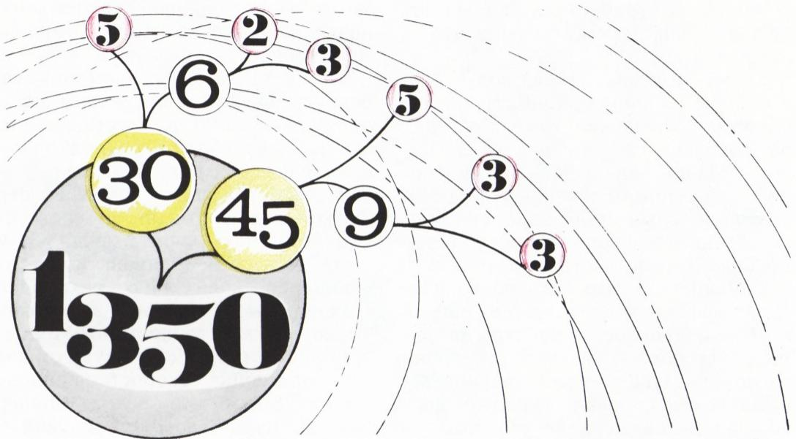
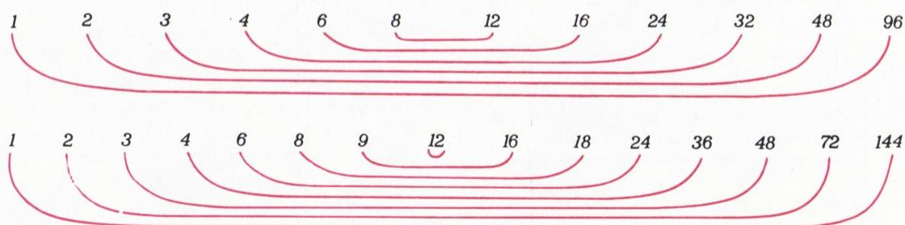
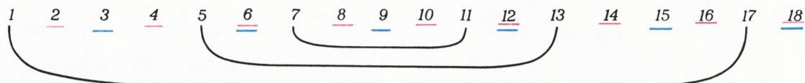
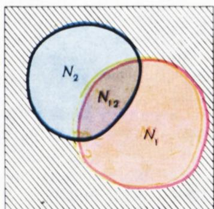
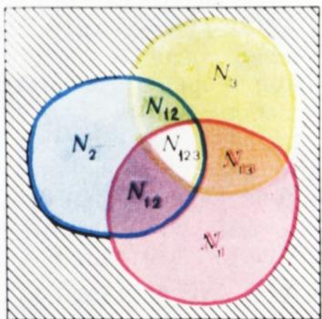

# 算术与计数原理

> **原标题**：Арифметика и принципы подсчета
> **作者**：Н. Б. Васильев（Н. Б. 瓦西里耶夫）、В. Л. Гутенмахер（В. Л. 古滕马赫尔；二人均为莫斯科大学数学科普作家，长期为《Квант》撰稿）
> **译自**：Квант 1983, № 1, с. 30–35
> **原文扫描**：https://www.kvant.digital/magazines/kvant/1983/files/1983_01.pdf
> **主题**：算术基本定理、约数个数函数 $d(n)$、欧拉函数 $\varphi(n)$、乘法原理与容斥原理
> **难度**：★★（文字初中可读；容斥原理、欧拉函数公式等属高中／竞赛层面）
> **译者**：Claude（初译）／ 2026-06-24

---

数学的基础是算术——即自然数 $1, 2, 3, \ldots$ 的理论。数论中有许多深刻而优美的定理，也有不少至今尚未解决的难题，几百年来一直令最杰出的数学家们殚精竭虑。现代数学的若干整个分支，正是从试图解决和推广数论问题的努力中孕育而生的。C. F. 高斯（1777—1855）在数论以及数学其他领域都作出了许多卓越发现，他说过：「数学是科学的皇后；数论是数学的皇后。」

本文的目的，是向读者介绍这门引人入胜的学科的最基本概念——算术基本定理、若干算术函数以及计数原理。

## § 1. 素数与合数

以下我们处处与自然数打交道。我们说数 $n$ **能被**数 $a$ **整除**，如果存在数 $b$ 使 $n=ab$。此时称 $a$ 为 $n$ 的**约数**（делитель），而 $n$ 相应地称为 $a$ 的**倍数**。

每一个大于 1 的自然数，至少有两个约数：$1$ 和它自身。一个大于 $1$ 的数，若没有其它约数，称为**素数**（простое число）；若还有别的约数，则称为**合数**（составное число）。至于 $1$，它既不是素数，也不是合数。

每一个自然数都可以分解为素数的乘积。

事实上，合数 $n$ 可以分解为两个都比 $n$ 小的因子的乘积。若其中还有不是素数（即合数）的因子，可再把每个这样的因子分解成两个更小的因子，如此等等。显然，这个过程不可能无限地进行下去，因为每一步得到的因子都比上一步更小，而小于 $n$ 的自然数总共只有有限个：$n-1$ 个。最终我们就得到把数分解为素因子的结果。

通常把相同的素因子合并起来，写成如下标准形式：

$$
n = p_{1}^{\alpha_{1}} \cdot p_{2}^{\alpha_{2}} \cdot \dots \cdot p_{k}^{\alpha_{k}},
$$

其中 $p_{1}<p_{2}<\ldots<p_{k}$ 是互不相同的素数，$\alpha_{1}, \alpha_{2}, \ldots, \alpha_{k}$ 是自然数。例如，$1350 = 2 \cdot 3^{3} \cdot 5^{2}$。

*题图：把 $1350$ 逐层分解为素因子的「分解树」（$1350 = 30 \cdot 45 = (5 \cdot 6) \cdot (5 \cdot 9) = 5 \cdot (2 \cdot 3) \cdot 5 \cdot (3 \cdot 3) = 2 \cdot 3^{3} \cdot 5^{2}$）*

> **算术基本定理**（Основная теорема арифметики）。每一个大于 $1$ 的自然数，都**唯一地**分解为素因子的乘积。

之所以称为「基本」定理，是因为数的整除性的几乎所有性质都是它的推论。

我们不去细述算术基本定理的证明（它可以在例如 [1]、[3] 中找到），只陈述它的一个推论：

> **推论。** 要使数 $a$ 能被数 $b$ 整除，必须且只需 $b$ 的分解式中出现的每一个素因子，在 $a$ 的分解式中以**同样的或更高的**幂次出现。

那么，怎样把一个大数分解为素因子呢？下面这条有用的观察会有所帮助。

> 如果数 $n$ 是合数，那么它存在一个既大于 $1$、又不大于 $\sqrt{n}$ 的约数。

假设相反。设 $n = ab$，且两个因子 $a$、$b$ 都大于 $\sqrt{n}$。既然 $a > \sqrt{n}$ 且 $b > \sqrt{n}$，便得 $ab > n$，与假设矛盾。

为判断数 $n$ 是否为素数，或当 $n$ 为合数时找出它的一个约数，只需检验 $n$ 能否被不超过 $\sqrt{n}$ 的素数整除即可。

要列出不超过给定数 $N$ 的全部素数，可以这样做：把从 $1$ 到 $N$ 的所有自然数顺次写下，划去 $1$，然后划去除 $2$ 以外的所有偶数，再划去除 $3$ 以外的所有 $3$ 的倍数，再划去除 $5$ 以外的所有 $5$ 的倍数，如此继续，直到不超过 $\sqrt{N}$ 的最大素数为止。在划去某素数 $p$ 的所有倍数之后，第一个未被划去的数就是 $p$ 之后的下一个素数。这种筛数的方法叫做「**埃拉托斯特尼筛法**」（решето Эратосфена）。它不像乍看起来那么笨拙：例如，要造一张 $2000$ 以内的素数表，只需划去前 $14$ 个素数（即从 $2$ 到 $43$）的倍数就够了（因为 $47^{2} > 2000 > 43^{2}$）。借助现代电子计算机，已造出了非常庞大的素数表。这里当然应该指出：所有的素数是不可能写尽的——正如欧几里得就已能证明的那样，

> **素数有无穷多个。**

假设素数只有有限个，而 $p$ 是其中最大的。考虑从 $1$ 到 $p$ 所有数的乘积 $p! = 1 \cdot 2 \cdot 3 \cdot 4 \cdot \ldots \cdot p$（$p!$ 读作「$p$ 的阶乘」）。数 $p!$ 能被全部素数整除，因为按假设，所有素数都已包含在乘积 $p!$ 中。它后面紧邻的自然数 $p! + 1$ 必须能够分解为素因子，但这不可能，因为 $p! + 1$ 不能被任何素数整除！矛盾。

许多古老而至今仍未完全解决的数论问题，都与素数在自然数列中的分布有关。

例如，观察表明，存在相邻的两个奇素数：$3$ 与 $5$，$5$ 与 $7$，$17$ 与 $19$，$29$ 与 $31$ 等等。这样的数称为**孪生素数**（простые близнецы）。孪生素数对究竟是有限个还是无穷多个，至今仍不得而知。

另一方面，素数之间可以有任意大的间隔，确切地说：

> 对任何 $k$，自然数列中都存在 $k$ 个连续的合数。

事实上，取数 $(k+1)!$，考察下面 $k$ 个连续的数：

$$
(k+1)! + 2,\ (k+1)! + 3,\ (k+1)! + 4,\ \ldots,\ (k+1)! + k + 1.
$$

它们全都是合数：第一个能被 $2$ 整除，第二个能被 $3$ 整除，……，最后一个能被 $k+1$ 整除。

### 习题

1. 把下列数分解为素因子：а) $1981$；б) $1982$；в) $1983$；г) $1984$。

   **题 1в 的解答。** 把 $1983$ 除以 $3$，得 $1983 = 3 \cdot 661$。现在寻找 $661$ 的约数。由于 $25^{2} < 661 < 26^{2}$，需要检验 $661$ 能否被素数 $3, 5, 7, 11, 13, 17, 19, 23$ 整除。$661$ 不能被其中任何一个整除，因此 $661$ 是素数。

2. 在自然数列中指出 а) 六个；б) 十三个连续的合数。в) 是否存在这样一对相邻素数，它们之间恰好夹着六个合数？

3. 证明：若 $d$ 是合数 $n$ 的小于 $n$ 的最大约数，则 $n/d$ 是素数。

4. 证明：在从 $1$ 到 $30m$ 的自然数中，素数不超过 $10m$ 个（对每个 $m=1, 2, 3, \ldots$）。

5. 求出所有满足条件的数 $p$，使 $p$、$p+2$、$p+4$ 同时为素数（这样的数可称为素数「三胞胎」）。

6. 数 $30!$ 的十进制表示以多少个零结尾？

7. 证明：在 $2, 5, 8, 11, \ldots$（即形如 $3m+2$ 的数，其中 $m=0, 1, 2, \ldots$）中，素数有无穷多个。

## § 2. 约数的个数。计数的乘法原理

在下面的图 1 中，写出了 $96$ 和 $144$ 的全部自然数约数。我们看到，$96$ 的所有约数可以分成一对对**互补**的约数（图 1 中用弧线相连）；而 $144$ 有一个约数 $12$ 与自身互补，因为 $144 = 12^{2}$。由约数集合的这种对称性，可以得到如下论断：

> 若数 $n$ 不是整数的平方，则它的约数有偶数个；若它**是**整数的平方，则约数有奇数个。

事实上，对于数 $n$ 的每一个小于 $\sqrt{n}$ 的约数 $a$，都对应一个大于 $\sqrt{n}$ 的约数 $n/a$。因此除 $\sqrt{n}$ 之外的约数总是成对的，个数总是偶数。如果 $n = k^{2}$，那么还要再加上一个约数 $k$。

记 $d(n)$ 为自然数 $n$ 的约数个数。如上所述，当 $n$ 是完全平方数时，$d(n)$ 为奇数（例如 $d(144) = 15$）；否则 $d(n)$ 为偶数（例如 $d(96) = 12$）。下面我们来说明，已知数 $n$ 的素因子分解后，如何求 $d(n)$。

首先注意，对素数 $p$ 总有 $d(p^{\alpha}) = \alpha + 1$。

*图 1：96 与 144 的约数，互补的约数以弧线相连*

确实如此：按定义，素数 $p$ 只有两个约数 $1$ 和 $p$；而由算术基本定理的推论，数 $p^{\alpha}$ 有 $(\alpha+1)$ 个约数：$1, p, p^{2}, \ldots, p^{\alpha}$（约定 $p^{0} = 1$）。

现在考虑有两个不同素因子的数，例如 $n = 144 = 2^{4} \cdot 3^{2}$。它的一切约数都具有 $2^{\beta_{1}} \cdot 3^{\beta_{2}}$ 的形式，其中 $\beta_{1}$ 可取 $0$ 到 $4$ 共五个整数值，$\beta_{2}$ 可取 $0, 1, 2$ 三个值之一。因此，不同的数对 $(\beta_{1}; \beta_{2})$ 共有 $5 \cdot 3 = 15$ 个，于是 $d(144) = 15$（见图 2）。这里我们用到了一条有用的计数原理。

|   | $2^{0}$ | $2^{1}$ | $2^{2}$ | $2^{3}$ | $2^{4}$ |
|---|---|---|---|---|---|
| $3^{0}$ | $1$ | $2$ | $2^{2}$ | $2^{3}$ | $2^{4}$ |
| $3^{1}$ | $3$ | $2\cdot3$ | $2^{2}\cdot3$ | $2^{3}\cdot3$ | $2^{4}\cdot3$ |
| $3^{2}$ | $3^{2}$ | $2\cdot3^{2}$ | $2^{2}\cdot3^{2}$ | $2^{3}\cdot3^{2}$ | $2^{4}\cdot3^{2}$ |

*图 2：乘法原理——$144 = 2^{4} \cdot 3^{2}$ 的形如 $2^{\beta_{1}} \cdot 3^{\beta_{2}}$ 的约数（$0 \leqslant \beta_{1} \leqslant 4$，$0 \leqslant \beta_{2} \leqslant 2$）排成一个 $5 \times 3$ 的表格*

> **乘法原理**（Правило произведения）。若元素 $\beta_{1}$ 可用 $N_{1}$ 种方式选取，而元素 $\beta_{2}$ 与 $\beta_{1}$ **独立地**用 $N_{2}$ 种方式选取，则一共可以组成 $N_{1} \cdot N_{2}$ 个不同的数对 $(\beta_{1}; \beta_{2})$。一般地，若要组成 $k$ 元素的数组 $(\beta_{1}; \beta_{2}; \ldots; \beta_{k})$，其中 $\beta_{1}$ 有 $N_{1}$ 种取法，$\beta_{2}$ 有 $N_{2}$ 种取法，……，$\beta_{k}$ 有 $N_{k}$ 种取法，则一共可以组成 $N_{1} \cdot N_{2} \cdot \ldots \cdot N_{k}$ 个不同的数组 $(\beta_{1}; \beta_{2}; \ldots; \beta_{k})$。

这一通用规则使我们能写出任意 $n = p_{1}^{\alpha_{1}} \cdot p_{2}^{\alpha_{2}} \cdots p_{k}^{\alpha_{k}}$ 的约数个数的公式。事实上，由算术基本定理的推论，$n$ 的任何一个约数都形如 $p_{1}^{\beta_{1}} \cdot p_{2}^{\beta_{2}} \cdots p_{k}^{\beta_{k}}$，其中 $\beta_{i}$ 取 $0, 1, \ldots, \alpha_{i}$ 这 $(\alpha_{i}+1)$ 个值之一。因此，不同数组 $(\beta_{1}; \beta_{2}; \ldots; \beta_{k})$ 的个数，也就是 $n$ 的不同约数的个数，等于

$$
d(n) = (\alpha_{1}+1)(\alpha_{2}+1) \cdots (\alpha_{k}+1). \tag{$*$}
$$

### 习题

8. 求下列各值：а) $d(1000)$；б) $d(1350)$；в) $d(5040)$；г) $d(84^{19})$。

   **题 8б 的解答。** 答案：$24$。因为 $1350 = 2 \cdot 3^{3} \cdot 5^{2}$，由公式 ($*$) 得

   $$
   d(2^{1} \cdot 3^{3} \cdot 5^{2}) = (1+1)(3+1)(2+1) = 24.
   $$

9. 举出一个数，使它恰好有 а) $6$ 个；б) $7$ 个约数。

10. 证明：若数 $n$ 除以 $3$ 余 $2$，则它形如 $3l+1$ 与形如 $3s+2$ 的约数个数相等，且 $n$ 不是完全平方数。

11. 一个圆周被等分为 $720$ 段弧。问：以分点为顶点、不同（按边数区分）的正多边形共有多少种？

12. 数 $n$ 有多少个偶约数（写出一般公式）？哪些数 $n$ 的偶约数个数恰为 $\tfrac{1}{2} d(n)$？

13. 一张书桌有 $9$ 个抽屉。把 $5$ 本不同的书放进这些抽屉里，共有多少种放法？

    **答案：** $9^{5}$ 种。**解：** 第一本书可以放进这 $9$ 个抽屉中的任意一个，有 $9$ 种放法；与这一选择无关，第二本书也有 $9$ 种放法，依此类推。由乘法原理，总共 $9^{5}$ 种放法。

14. 各位数字都是奇数的三位数共有多少个？

15. 十进制表示中至少出现一次数字 $5$ 的五位数共有多少个？

## § 3. 欧拉函数。容斥原理

在 § 2 中我们认识了算术函数 $d(n)$。数论中更常用到的是**欧拉函数**：$\varphi(n)$ 表示小于 $n$ 且与 $n$ **互素**的数的个数，即与 $n$ 除 $1$ 之外没有别的公因数的数。

在图 3 中，以 $n=18$ 为例写出了从 $1$ 到 $18$ 的数。可以看到，所有与 $18$ 互素的数可以配成一对对 $(a;\ 18-a)$。

对任何 $n > 2$ 都存在这种对称性：若数 $a$ 与 $n$ 互素，则 $n - a$ 也与 $n$ 互素，且 $n - a \neq a$。事实上，倘若 $n-a$ 与 $n$ 有公因数 $p > 1$，那么它们的差 $n - (n-a) = a$ 也将含有同一个因数 $p$，于是 $n$ 与 $a$ 就不是互素的了。

由对称性 $a \leftrightarrow (n-a)$ 可见，数 $\varphi(n)$ 总是偶数（当 $n > 2$ 时）。

下面我们说明，已知数 $n$ 的素因子分解后如何求 $\varphi(n)$。首先注意，若 $p$ 为素数，则 $\varphi(p) = p - 1$，因为 $1, 2, \ldots, p-1$ 都与 $p$ 互素且都比 $p$ 小。设 $n = p^{\alpha}$，其中 $p$ 为素数，$\alpha > 1$。那么在不超过 $n$ 的数（即 $1, 2, 3, \ldots, n$）中，应剔除能被 $p$ 整除的那些。这样的数有 $\dfrac{n}{p} = \dfrac{p^{\alpha}}{p} = p^{\alpha-1}$ 个，因此

$$
\varphi(n) = n - \frac{n}{p} = n\left(1 - \frac{1}{p}\right). \tag{1}
$$

*图 3：在从 $1$ 到 $18 = 2 \cdot 3^{2}$ 的数中，所有 $2$ 的倍数（红）和所有 $3$ 的倍数（蓝）都作了记号。被同时记两次（既红又蓝）的是 $6$ 的倍数。未作记号的——即与 $18$ 互素的数——剩下 $\varphi(18) = 18 - 18/2 - 18/3 + 18/6 = 18 - 9 - 6 + 3 = 6$ 个，它们可配成和为 $18$ 的数对。*

现在考虑 $n = p_{1}^{\alpha_{1}} p_{2}^{\alpha_{2}}$ 这种具有两个不同素因子的数。$\varphi(n)$ 的计算（对 $n = 18$ 已在图 3 中做过）我们用图 4 的示意图来说明：正方形表示从 $1$ 到 $n$ 所有数的集合，红色和蓝色的圆分别表示能被 $p_{1}$ 整除、能被 $p_{2}$ 整除的数的集合，两圆的交集则是能被 $p_{1} p_{2}$ 整除的数的集合。

与 $n$ 互素的数，由正方形中带阴影的部分表示。为计算其个数，要减去 $N_{1} = n/p_{1}$ 个「红数」和 $N_{2} = n/p_{2}$ 个「蓝数」，并补回位于两圆交集中的 $N_{12} = n/(p_{1} p_{2})$ 个数。于是

$$
\varphi(n) = N - N_{1} - N_{2} + N_{12} = n - \frac{n}{p_{1}} - \frac{n}{p_{2}} + \frac{n}{p_{1} p_{2}},
$$

$$
= n\left(1 - \frac{1}{p_{1}}\right)\left(1 - \frac{1}{p_{2}}\right). \tag{2}
$$

为讨论 $n = p_{1}^{\alpha_{1}} \cdot p_{2}^{\alpha_{2}} \cdot p_{3}^{\alpha_{3}}$ 这种有三个不同素因子的情形，图 5 会有所帮助：正方形表示不超过 $n$ 的数的集合，圆则分别表示能被 $p_{1}$、$p_{2}$、$p_{3}$ 整除的数的集合；那么各圆中分别有 $N_{1} = \dfrac{n}{p_{1}}$、$N_{2} = \dfrac{n}{p_{2}}$、$N_{3} = \dfrac{n}{p_{3}}$ 个数，它们两两交集中分别有 $N_{12} = \dfrac{n}{p_{1} p_{2}}$、$N_{13} = \dfrac{n}{p_{1} p_{3}}$、$N_{23} = \dfrac{n}{p_{2} p_{3}}$ 个数，而三圆公共交集中有 $N_{123} = \dfrac{n}{p_{1} p_{2} p_{3}}$ 个数（这些数同时能被 $p_{1}$、$p_{2}$、$p_{3}$ 整除，即能被 $p_{1} p_{2} p_{3}$ 整除）。

我们需要统计有多少个数落在正方形内、却一个圆都不进入。若我们从 $n$ 中减去和 $(N_{1} + N_{2} + N_{3})$，那么恰好落入三个圆中两个的数会被减去两次，而同时落入三个圆的数甚至会减去三次。

再在和 $N - (N_{1} + N_{2} + N_{3})$ 上加回 $(N_{12} + N_{13} + N_{23})$。这样，恰好只落在一个或两个圆中的数就统计正确了，唯独同时落入全部三个圆中的数仍未算对：它们的个数被减了三次、又加回了三次。因此还须从和 $N - (N_{1} + N_{2} + N_{3}) + (N_{12} + N_{13} + N_{23})$ 中再减去 $N_{123}$。至此，进入三圆并集的所有数都被恰好统计了一次，于是得到公式：

*图 4：两圆（两个素因子）情形下的容斥示意图*

*图 5：若正方形内共有 $N$ 个元素，则圆外的元素数为 $N - N_{1} - N_{2} - N_{3} + N_{12} + N_{23} + N_{31} - N_{123}$*

$$
\begin{array}{rl}
\varphi(n) & = n - \dfrac{n}{p_{1}} - \dfrac{n}{p_{2}} - \dfrac{n}{p_{3}} + \dfrac{n}{p_{1} p_{2}} + \dfrac{n}{p_{1} p_{3}} \\[4pt]
& \quad + \dfrac{n}{p_{2} p_{3}} - \dfrac{n}{p_{1} p_{2} p_{3}} \\[4pt]
& = n\left(1 - \dfrac{1}{p_{1}}\right)\left(1 - \dfrac{1}{p_{2}}\right)\left(1 - \dfrac{1}{p_{3}}\right).
\end{array} \tag{3}
$$

我们在这里遇到了如下一般计数规则的特例。

> **容斥原理**（Правило включений и исключений）。给定集合 $A$ 并指定它的 $k$ 个子集。集合 $A$ 中不落入任何一个指定子集的元素个数，按如下方式计算：从 $A$ 的元素总数中，减去所有 $k$ 个子集的元素个数，加上它们所有两两交集的元素个数，再减去所有三元交集的元素个数，再加上所有四元交集的元素个数，如此等等，直到全部 $k$ 个子集的公共交集。

把这条原理用于计算

$$
n = p_{1}^{\alpha_{1}} p_{2}^{\alpha_{2}} \dots p_{k}^{\alpha_{k}}
$$

时的 $\varphi(n)$，并利用代数恒等式

$$
\begin{array}{rl}
& 1 - x_{1} - x_{2} - \dots - x_{k} + x_{1} x_{2} \\
& + x_{1} x_{3} + \dots + x_{k-1} x_{k} - x_{1} x_{2} x_{3} - \dots \\
& - x_{k-2} x_{k-1} x_{k} + \dots + (-1)^{k} x_{1} x_{2} \dots x_{k} \\
= & (1 - x_{1})(1 - x_{2}) \dots (1 - x_{k}),
\end{array}
$$

（其左端的构造恰好就是「容斥」式的）即可得到一般公式

$$
\varphi(n) = n\left(1 - \frac{1}{p_{1}}\right)\left(1 - \frac{1}{p_{2}}\right) \dots \left(1 - \frac{1}{p_{k}}\right).
$$

应指出，上面那个代数恒等式也可用于证明一般的容斥原理本身：在 $k$ 个字母 $x_{1}, x_{2}, \ldots, x_{k}$ 中令其中某 $j$ 个等于 $1$、其余 $(k-j)$ 个等于 $0$，则当 $0 < j \leqslant k$ 时右端为 $0$，而左端正说明恰好落入某 $j$ 个子集的交集的元素被同等次数地加上和减去。

最后指出，$\varphi(n)$ 与上一节的 $d(n)$ 都具有数论中称为**积性**（мультипликативность）的重要性质：

> 若 $a$ 与 $b$ 互素，则
> $$\varphi(ab) = \varphi(a)\,\varphi(b), \qquad d(ab) = d(a)\,d(b).$$

（请读者自行验证。）

### 习题

16. 分母为 $288$ 的既约真分数共有多少个？

17. 求：а) $\varphi(96)$；б) $\varphi(540)$；в) $\varphi(1983)$。

18. 不超过 $1000$ 的数中，有多少个 а) 同时能被 $6$ 和 $15$ 整除；б) 能被 $3$ 但不能被 $7$ 整除；в) 能被 $6$ 或 $15$ 整除？

19. 不超过 $1000$ 的自然数中，既不能被 $3$、也不能被 $5$、也不能被 $7$ 整除的共有多少个？

20. 集合 $A$ 与 $B$ 的并集有 $25$ 个元素，交集有 $10$ 个元素。若 $B$ 中有 а) $15$ 个；б) $21$ 个；в) $10$ 个元素，则 $A$ 中有多少个元素？

21. 十二月份有 $10$ 个晴朗无风的日子，$15$ 个有风的日子，$12$ 个下雪的日子。问有多少天是暴风雪天（既有雪又有风）？

22. 一个 $25$ 人的小组中，$12$ 人学拉丁语，$10$ 人学希腊语，$9$ 人学梵语。任意两种语言都恰好有 $5$ 人同时学习。问三种语言都学的有多少人？

23. 在三角形 $ABC$ 的每条边上各标出 $9$ 个点，把该边分成 $10$ 等份。考察以这些标出的点为顶点（每条边上各取一点）所能构成的一切三角形。其中，三边都不与三角形 $ABC$ 的边平行的三角形有多少个？

## 文献

1. И. М. 维诺格拉多夫。《数论基础》（М., «Наука», 1980）。
2. И. И. 叶若夫、А. В. 斯科罗霍德、М. И. 亚德连科。《组合数学基础》（М., «Наука», 1977）。
3. Л. А. 卡卢日宁。《算术基本定理》（М., «Наука», 1969）。
4. О. 奥尔。《数论邀请》（М., «Наука», Библиотечка «Квант», 1980）。
5. Л. А. 巴索娃、М. А. 舒宾、Л. А. 埃普施泰因。《数学讲义与习题》（М., «Просвещение», 1981）。
6. 《函授数学奥林匹克》（М., «Наука», 1981）。
7. R. 库朗、H. 罗宾斯。《数学是什么？》（М., «Просвещение», 1967）。

---

## 译者注与校对说明

1. **OCR 校正**：本文由 MinerU 对扫描页做俄文 OCR 后翻译。结合扫描页图像复核，已校正以下 OCR 错误：
   - 第 1 节末「**题 18)**」实为「**题 1в)**」的解答（即第 1 题小题 в 的解答），OCR 把西里尔字母「в」误识为数字「8」。译文已还原为「**题 1в 的解答**」。
   - 第 8 题 OCR 漏识小题字母 в：「а) $d(1000)$；б) $d(1350)$；$d(5040)$；г) $d(84^{19})$」，译文补为「в) $d(5040)$」。另 OCR 把此题的「**题 8б 的解答**」误标为「**题 6 的解答**」，已据内容（讲 $1350$）改正。
   - 公式与变量中下标统一为 LaTeX 形式（如 $\alpha$、$\beta$、$\varphi$），原文中个别 OCR 把希腊字母误识为拉丁字母（如 $\varphi$ 误作 $\varphi$ 附近的杂码、$\alpha$ 误作 a），已统一校正。
   - 第 2 节「$p^{a}$ 有 $(a+1)$ 个约数」中的 $a$ 实为 $\alpha$，已校正。
   - §3 结尾的「多重性」公式块原文用 `
` 包裹，译文改为规范的引用块与行间公式呈现。
   - 图 5 的说明在原文中附于图 4 之后，且 OCR 把图 4 说明误识为「Puc. 4.」（应为「Рис. 4.」，«Рис.» 即俄文「图」），译文已还原。原文图 5 单列于图 4 之旁（页 34 右栏），译文按图序排列并配文字说明。
2. **术语**：遵循《01_工作规范.md》术语表：делитель→约数，простое число→素数，составное число→合数，основная теорема арифметики→算术基本定理，функция Эйлера→欧拉函数，правило произведения→乘法原理，правило включений и исключений→容斥原理，мультипликативность→积性。函数 $d(n)$（约数个数函数）与 $\varphi(n)$（欧拉函数）保留标准记号。
3. **图表**：原文 5 张插图（图 1—5，分别对应素因子互补配对、$144$ 的因子 $5\times3$ 表、$18$ 的容斥计数、两圆与三圆文氏图）由 MinerU 自动裁出，存于 `images/1983_01_vasilev_E03/fig_*.png`。图 2（因子表）改用 Markdown 表格重排，行列结构与扫描页一致（行标 $3^{0},3^{1},3^{2}$，列标 $2^{0},\ldots,2^{4}$）。
4. **扫描页复核**：用图像分析工具核对 p32（题 1 的四个数 $1981,1982,1983,1984$、题 1в 解答 $1983=3\cdot661$、合数串 $(k+1)!+2,\ldots,(k+1)!+k+1$）与 p33（因子数公式 ($*$)、$144=2^{4}\cdot3^{2}$ 的 $5\times3$ 因子表、习题 8—15、欧拉函数引入段落），译文与扫描页一致。
5. **时代感**：原文提到「借助现代电子计算机（ЭВМ）」生成素数表，ЭВМ（电子计算机）为苏联时代用语，译文保留其时代特征。

## 建议讨论题

1. 算术基本定理说素因子分解「唯一」，试说明：若没有「$p_{1}<p_{2}<\ldots<p_{k}$」这种排序约定，「唯一」二字应如何理解？分解式 $2^{3}\cdot 5$ 与 $5\cdot 2\cdot 2\cdot 2$ 算不算「同一个」分解？
2. $d(n)$ 与 $\varphi(n)$ 都是**积性**函数。能否利用这一性质，把求 $d(1350)$（题 8б）的计算拆成对 $2$、$3^{3}$、$5^{2}$ 各自求 $d$ 再相乘？这与公式 ($*$) 的结果是否一致？为什么？
3. 容斥原理的代数恒等式（正文末）中令 $x_{1}=x_{2}=\ldots=x_{k}=1$ 会得到什么？这与「$k$ 个子集全部计入」的情形有何关系？
4. 题 16（分母 $288$ 的既约真分数个数）与欧拉函数 $\varphi(288)$ 有何联系？请说明为何答案恰是 $\varphi(288)$。

---

> **版权说明**：原文版权归 MCCME（莫斯科连续数学教育中心）及作者继承者所有。本译文为非商业、自用、数学圈内部参考，未获授权不得公开分发。

> **复用说明**：本译文的俄文 OCR 原文与所有插图均存档于 `ocr/1983_01_vasilev_E03/`（`ru.md` 为合并 OCR 文本，`meta.json` 为图映射）。如对译文质量不满意，可直接基于 `ru.md` 重译，无需重跑 OCR。
