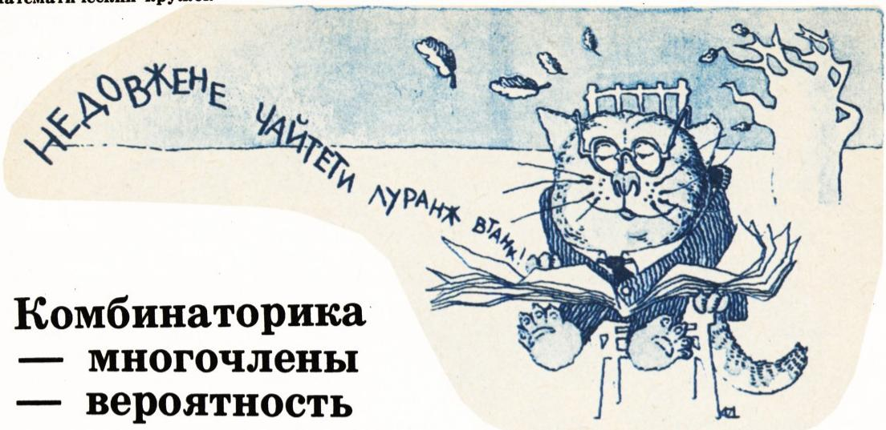
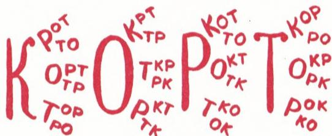

# 组合——多项式——概率

> **原标题**：Комбинаторика — многочлены — вероятность
> **作者**：Н. Б. Васильев（N. B. 瓦西里耶夫，数理副博士）、В. Л. Гутенмахер（V. L. 古滕马赫尔，数理副博士）
> **译自**：Квант 1986, № 1, с. 19–23
> **原文扫描**：https://www.kvant.digital/data/kvant_1986_1/jpg/0019.jpg
> **主题**：组合计数（阶乘、排列与带重复的排列）、多项式展开系数、概率，以及三者之间的统一联系
> **难度**：★★（前六年数学即可阅读，但排列与概率的衔接属高中／竞赛层面）
> **译者**：Claude（初译）／ 2026-06-24

---

> *阅读本文只需要前六个年级的数学课程知识，但我们相信，高年级学生也会在这里发现有趣的东西——本文讲的是组合公式及其应用。同样的组合推理与组合公式，贯穿于数学及其应用的各个领域。本文的目的，是要展示其中一条这样的联结线索：组合——多项式代数——概率论。*
> *——作者按*

## 阶乘

为了计算前 $n$ 个自然数之和，有一个方便的公式

$$
1 + 2 + 3 + \dots + n = \frac{n(n+1)}{2}.
$$

对于前 $n$ 个自然数之积，却没有这样的公式；不过，这个在组合数学及数学其他分支中频繁出现的量有一个专门的记号：$n!$（读作「恩阶乘」）。选用感叹号来作记号，或许与下面的事实有关：即便 $n$ 的值相当小，$n!$ 也已经非常大了。为了展示 $n!$ 随 $n$ 增长得有多快，我们把 $n$ 从 1 到 10 时的 $n!$ 一一列出：

$$
1! = 1,\quad 2! = 1\cdot 2 = 2,\quad 3! = 1\cdot 2\cdot 3 = 6,
$$

$$
4! = 3!\cdot 4 = 24,\quad 5! = 4!\cdot 5 = 120,
$$

$$
\begin{array}{l} 6! = 720,\quad 7! = 5040,\quad 8! = 40320,\\ 9! = 362880,\quad 10! = 3628800. \end{array}
$$

从 $n!$ 的定义可以看出，两个相邻自然数 $n$ 与 $n+1$ 的阶乘之间有公式

$$
(n+1)! = n!\cdot(n+1),\tag{$*$}
$$

——为了得到从 1 到 $n+1$ 所有数的乘积，只需把从 1 到 $n$ 的乘积再乘上 $(n+1)$ 即可。

注意，若在此等式中代入 $n=0$，就得到 $1! = 0!\cdot 1$，因此规定 $0! = 1$；这一约定在各种一般公式中常常是方便的。

## 题

1. 求 $n=11,\ 12$ 时的 $n!$。

2. $n!$ 能否恰好以五个零结尾？（$n!$ 从最小的哪个 $n$ 开始会以六个零结尾？）

3. 证明公式 $(n+1)! - n! = n!\cdot n$。

4. 求和 $1\cdot 1! + 2\cdot 2! + 3\cdot 3! + \dots + 9\cdot 9!$。（用上一题的公式把每一项换成差。）

5. 验证等式（其中 $0 < k \leqslant n$）

$$
\frac{n!}{k!(n-k)!} + \frac{n!}{(k-1)!(n-k+1)!} = \frac{(n+1)!}{k!(n-k+1)!}
$$

在 $n=7,\ k=3$ 时成立，并证明它对任意自然数 $n$ 和 $k$ 都成立。

6. 找出四组数 $(x,y,z)$，使等式 $x!\cdot y! = z!$ 成立。（在公式 $(*)$ 中代入 $n = k! - 1$。）

## 排列

当我们去数不同物品的排列数时，阶乘出现得再自然不过了。

取 4 个字母：К、О、Р、Т，看看有多少种方式把它们排成一排，也就是问：由这些字母能组成多少个「词」。结果是，这些方式的数目等于 $4! = 4\cdot 3\cdot 2\cdot 1 = 24$。事实上，第一个位置可以放 4 个字母中的任意一个，第二个位置可以放剩下 3 个字母中的任意一个，第三个位置可以放前两个位置没用过的那 2 个字母中的任意一个，最后，第四个位置上就只剩下最后一个字母了。所有这些排列都按字母表顺序列在了图 1 中。一个词的字母的排列，称作这个词的**变位词**（анаграмма）。

*图 1*

再看一个例子。考虑 10 个数字 $0,1,2,3,4,5,6,7,8,9$ 的所有排列。若它们不以 0 开头，可看作十位数；若以 0 开头，则可看作九位数。所有这样的数的总数等于 $10!$。

这些例子说明了下面的一般性论断：

> **由 $n$ 个不同物品组成的排列的数目等于 $n!$。**

常常需要从所有排列中挑出所有具备某种确定性质的那些。例如，从图 1 中所列出的单词 КОРТ 的变位词里，只有一个（不算 КОРТ 本身）在俄语中有意义：КРОТ；而在上述 $10!$ 个数中，我们知道有四个数能同时被从 2 到 18 的所有数整除：$2438195760,\ 3785952160,\ 4753869120,\ 4876391520$。为了找出有意义的变位词，或在 $10!$ 个数中找出所要求的那些数，需要对许多情形逐一排查。在生产与经济中，每当要寻找最优方案时，这类问题就不断出现。

对 $10!$ 种排列逐一排查，不仅对人、即便对现代计算机来说也是困难的。关于这一点，多卷本名著《计算机程序设计艺术》的作者 D. 克努特（D. Knuth）写道：

> *应当记住，$10!$ 大约是 360 万。在某种意义上，$10!$ 这个数大约就是计算机能数得过来与数不过来之间的分界线。如果某个算法要求检验多于 $10!$ 种情形，那么计算可能会耗费过多的机时，从而在实践中无法实行。另一方面，如果我们必须检验 $10!$ 种情形，而每种情形比方说需要一毫秒的机时，那么总的计算时间大约是一小时。*

因此，那些能显著减少、甚至完全避免全面排查的论证，是很有意思的。

## 题

7. а) 单词 НИСЕЛЬАП 有多少个变位词？

　 б) 在其中找出两个词，一个是一种水果的名称，另一个是一种狗的品种。

8. 找出两个九位数，都用全 9 个数字 $1,2,3,4,5,6,7,8,9$ 组成，使其中一个数恰好是另一个数的 8 倍。

9. а) 平面上一个正六边形的顶点要用字母 $A,B,C,D,E,F$ 来标记。有多少种标法？

　 б) 其中有多少种标法能使得结果是六边形 $ABCDEF$？（字母可以按顺时针方向走，也可以按逆时针方向走。）

10. 在棋盘上摆 8 个互不相吃的车（车=ладья），有多少种摆法？

## 带重复的排列

阶乘之比在计算带重复的排列时出现。例如，单词 БАОБАБ 的变位词数目等于

$$
\frac{6!}{3!\,2!\,1!} = 60.
$$

我们来解释这是为什么。这个词中字母 Б 重复了 3 次，字母 А 重复了 2 次，字母 О 出现 1 次。设想这个词中所有字母都互不相同：三个 Б 和两个 А 可以涂上不同的颜色。于是我们有 6 个不同的符号，它们的排列数为 $6!$。但这时，单词 БАОБАБ 的每一个变位词——ОААБББ、БОААББ、ААОББА、……——都对应 $3!\cdot 2!$ 种排列（见图 2），因为对于每个变位词，我们都可以用 $3!$ 种方式重排 3 个不同色的 Б，用 $2!$ 种方式重排不同色的 А。

*图 2*

原来，对于带重复的排列，存在一个一般公式。

$$
\boxed{\text{若一个词有 } n_1 \text{ 个字母 } A_1,\ n_2 \text{ 个字母 } A_2,\ldots,\ n_r \text{ 个字母 } A_r,\text{ 则其变位词数目等于}\\ \dfrac{(n_1+n_2+\dots+n_r)!}{n_1!\,n_2!\,\dots\,n_r!}.}
$$

当然，这个公式适用于任意物品的带重复排列。例如，数字 $0,0,0,0,1,1,3$ 的排列数为

$$
\frac{7!}{4!\,2!\,1!} = \frac{4!\cdot 5\cdot 6\cdot 7}{4!\cdot 2} = 5\cdot 3\cdot 7 = 105.
$$

## 题

11. 下列单词各有多少个不同的变位词：а) реестр；б) анаграмма？

12. 一周之内妈妈要给女儿 3 根香蕉、2 个梨和 2 个橙子，每天给一个水果。有多少种给法？

13. 解出第 19 页图上那句话，其中每个词都换成了它的变位词。

14. 用 1 颗黑、2 颗白、3 颗红、5 颗蓝的珠子串成一条项链，有多少种串法？

## 和的幂

字母的组合——变位词——在两个或若干个多项式相乘时自然地出现，而组合系数——变位词的数目——在合并同类项时出现。

两数和的平方公式是大家熟知的：

$$
(a+b)^{2} = a^{2} + 2ab + b^{2}.
$$

对于三个或更多项之和的平方，也可以得到类似的公式。例如，把 $a+b+c$ 平方：

$$
\begin{array}{rl}(a+b+c)(a+b+c) & = aa+ab+ac+\\ &\quad ba+bb+bc+ca+cb+cc =\\[2pt] & = a^{2}+b^{2}+c^{2}+2ab+2bc+2ac.\end{array}
$$

对 $(a+b+c+d)^{2}$ 也有类似的公式（图 3 中每个单项式表示它所在矩形的面积）；一般地，$n$ 个数之和的平方按下法计算：把这 $n$ 个数的所有平方相加，再加上这些数一切可能的**两两之积**之和的两倍。

| | $a$ | $b$ | $c$ | $d$ |
|---|---|---|---|---|
| $a$ | $aa$ | $ab$ | $ac$ | $ad$ |
| $b$ | $ba$ | $bb$ | $bc$ | $bd$ |
| $c$ | $ca$ | $cb$ | $cc$ | $cd$ |
| $d$ | $da$ | $db$ | $dc$ | $dd$ |

*图 3：$(a+b+c+d)^{2}$ 的乘法表——每个格子给出一个单项式，恰等于对应矩形的面积。*

如果把 $a+b+c$ 乘三次自己，会得到这样的公式：

$$
\begin{array}{l}(a+b+c)^{3} = a^{3}+b^{3}+c^{3}+\\ \quad +3(a^{2}b+a^{2}c+b^{2}a+b^{2}c+c^{2}a+c^{2}b)+\\ \quad +6abc.\end{array}
$$

我们来解释，这里出现的系数 1、3、6 如何不通过繁琐的乘法与合并同类项而得到。它们就是我们已经熟悉的变位词数目。项 $a^{3}$ 只能以一种方式得到——即从每个括号

$$
(a+b+c)(a+b+c)(a+b+c)
$$

中取出字母 $a$。为了得到 $a^{2}b$ 的系数，需要从一个括号取 $b$、另两个括号取 $a$，也就是说这一项对应的是由两个字母 $a$ 和一个字母 $b$ 组成的变位词 $aab,\ aba,\ baa$：其数目等于

$$
\frac{(2+1)!}{2!\,1!} = 3.
$$

最后，$abc$ 的系数等于由三个互不相同字母 $a,b,c$ 组成的「词」的变位词（排列）数

$$
\frac{3!}{1!\,1!\,1!} = 6.
$$

对更多项之和的立方，也会得到类似的公式，例如

$$
\begin{array}{l}(a+b+c+d+e)^{3} = \\ = (a^{3}+\dots)+3(a^{2}b+\dots)+6(abc+\dots).\end{array}\tag{$**$}
$$

这里每对括号中的省略号，代表把已写出的第一项中的字母作一切可能的替换后所得到的那些项。

现在给出一般公式。

> 把 $r$ 项之和 $a_{1}+a_{2}+\dots+a_{r}$ 取 $n$ 次幂时，所得到的项 $a_{1}^{n_{1}}a_{2}^{n_{2}}\dots a_{r}^{n_{r}}$ 的系数（其中 $n=n_{1}+n_{2}+\dots+n_{r},\ n_{1}\geqslant 0,\ n_{2}\geqslant 0,\ldots,n_{r}\geqslant 0$），等于由 $n_{1}$ 个字母 $A_{1}$、$n_{2}$ 个字母 $A_{2}$、……、$n_{r}$ 个字母 $A_{r}$ 组成的词的变位词数目，也就是
>
> $$\dfrac{n!}{n_{1}!\,n_{2}!\,\dots\,n_{r}!}.$$
>
> （当然，若某个 $n_{j}=0$，则 $a_{j}^{n_{j}}=1$，也就是说在此单项式中字母 $a_{j}$ 不出现；回忆 $0!=1$。）

回到公式 $(**)$。有趣的是，「每个括号里有多少项」这个问题，也归结为带重复排列的计数。把我们的 5 个字母排成一行，并在每个字母下面写上它在该单项式中的指数（若该字母不进入此单项式，则写指数 0）。那么，括号 $(a^{2}+\dots)$ 中的每个单项式对应于一个由 5 个数组成的「词」：一个 2、一个 1、三个 0，所以它们总的个数等于 $\dfrac{5!}{3!\,1!\,1!} = 20$；括号 $(a^{3}+\dots)$ 中的项数等于「词」$30000$ 的变位词数，即 $\dfrac{5!}{4!\,1!} = 5$；最后，形如 $(abc+\dots)$ 的项数为 $\dfrac{5!}{3!\,2!} = 10$（图 4）。

| | $a$ | $b$ | $c$ | $d$ | $e$ |
|---|---|---|---|---|---|
| $a^{2}b$ | 2 | 1 | 0 | 0 | 0 |
| $b^{2}c$ | 0 | 2 | 1 | 0 | 0 |
| $b^{2}a$ | 1 | 2 | 0 | 0 | 0 |
| $\dots$ | $\dots$ | $\dots$ | $\dots$ | $\dots$ | $\dots$ |

| | $a$ | $b$ | $c$ | $d$ | $e$ |
|---|---|---|---|---|---|
| $a^{3}$ | 3 | 0 | 0 | 0 | 0 |
| $b^{3}$ | 0 | 3 | 0 | 0 | 0 |
| $c^{3}$ | 0 | 0 | 3 | 0 | 0 |
| $\dots$ | $\dots$ | $\dots$ | $\dots$ | $\dots$ | $\dots$ |

| | $a$ $b$ $c$ $d$ $e$ |
|---|---|
| $dbc$ | 1 1 1 0 0 |
| $abd$ | 1 1 0 1 0 |
| $abe$ | 1 1 0 0 1 |
| $\dots$ | $\dots$ $\dots$ $\dots$ $\dots$ $\dots$ |

*图 4：公式 $(**)$ 中各类括号内的项数，归结为带重复的排列（指数为 0、1、2、3 的「词」的变位词数）。*

可以核验我们没有弄错：只要算一下合并同类项之前所有单项式的总数——换言之，把公式 $(**)$ 中所有字母都换成 1；此时左边得到 $5^{3}$，右边得到 $5+3\cdot 20+6\cdot 10$。

## 题

15. 下列乘积展开后有多少项：

$$
(a+b+c+d)(x+y+z)(u+v)?
$$

（提示：把字母都换成 1。）

16. 求下列多项式的最大系数：

а) $(a+b+c+d+e)^{5}$；б) $(a+b+c+d)^{5}$。

17. 在公式

$$
(a+b+c+d+e)^{4} = K_{1}(a^{4}+\dots)+K_{2}(a^{3}b+\dots)+K_{3}(a^{2}b^{2}+\dots)+K_{4}(a^{2}bc+\dots)+K_{5}(abcd+\dots)
$$

中，求系数 $K_{1},K_{2},K_{3},K_{4},K_{5}$。每个圆括号里有多少项？

## 一种计算概率的方法

从日常经验可知：面包片涂黄油的一面朝下落地的概率是 $1/2$，朝上的概率也是 $1/2$。诚然，有人认为前一种结局的概率是 $0.9$、后一种是 $0.1$。但是，大概没有人会怀疑：掷一枚骰子出现 6 点的概率是 $1/6$，连续两次出现 6 点的概率是 $1/36$。

这些例子说明：**概率**是介于 0 和 1 之间的某个数，它定量地表达了某一随机事件（面包片落地）的某一结局（黄油朝下或朝上）发生的机会；并且所有可能结局的概率之和等于 1。

在给每个结局都赋予某个概率之后，去求更复杂事件的概率是很有意思的。这个问题蕴含着相当大的数学困难。计算复杂事件概率的一种方法，与下面这个简单的观察有关：**若若干个正数之和为 1，则这些数之和的任意次幂也等于 1**。原来，和取幂时出现的每一个单项式，都可以赋予一个概率意义。下面用一个人为的例子来说明这是怎么做的。

商店里堆着一大堆辣椒，其中 $1/3$ 是红的，$1/2$ 是黄的，$1/6$ 是绿的。如果售货员不看地从堆里挑一个辣椒，那我们就规定它是红的（к）的概率为 $1/3$、黄的（ж）为 $1/2$、绿的（з）为 $1/6$。

如果售货员不看地挑两个辣椒，可能出现这些情形：кк、кж、кз、жк、жз、жж、зк、зж、зз。每一种的概率按下法计算：等于构成该字母对的各字母单独出现的概率之积：

$$
\begin{array}{c}\left(\dfrac{1}{3}\right)^{2},\ \dfrac{1}{3}\cdot\dfrac{1}{2},\ \dfrac{1}{3}\cdot\dfrac{1}{6},\ \dfrac{1}{2}\cdot\dfrac{1}{3},\ \left(\dfrac{1}{2}\right)^{2},\\[4pt] \dfrac{1}{2}\cdot\dfrac{1}{6},\ \dfrac{1}{6}\cdot\dfrac{1}{3},\ \dfrac{1}{6}\cdot\dfrac{1}{2},\ \left(\dfrac{1}{6}\right)^{2}.\end{array}
$$

这 9 个数之和等于 1，因为它们恰是在把 $\dfrac{1}{3}+\dfrac{1}{2}+\dfrac{1}{6} = 1$ 平方时出现的。

为了求两个辣椒中既有红的又有绿的概率，要把 кз 和 зк 这两种情形的概率相加：

$$
\dfrac{1}{3}\cdot\dfrac{1}{6}+\dfrac{1}{6}\cdot\dfrac{1}{3} = 2\cdot\dfrac{1}{3}\cdot\dfrac{1}{6} = \dfrac{1}{9}.
$$

请注意，这一运算对应于下面这件事：把 $(\text{к}+\text{ж}+\text{з})$ 平方并合并同类项 кз 与 зк——结果是 $2\text{кз}$，然后把字母 к 和 з 分别换成它们的概率。

利用取幂时求系数的规则，也可以确定更长组合的概率。例如，若售货员不看地依次挑 5 个辣椒，那么其中恰好 3 个红的、1 个黄的、1 个绿的概率按下面来算：

$$
\frac{5!}{3!\,1!\,1!}\cdot\left(\frac{1}{3}\right)^{3}\cdot\frac{1}{2}\cdot\frac{1}{6} = \frac{5}{81},
$$

因为 $\dfrac{5!}{3!\,1!\,1!}\text{к}^{3}\text{жз}$ 正是把多项式 $(\text{к}+\text{ж}+\text{з})^{5}$ 取幂并合并同类项后所得到的那个单项式，也就是单词 кккжз 的所有变位词的概率之和。

有趣的是，「2 红 3 黄」与「2 红、2 黄、1 绿」这两种情形具有相同的概率：

$$
\frac{5!}{2!\,3!}\left(\frac{1}{2}\right)^{3}\left(\frac{1}{3}\right)^{2} = \frac{5!}{2!\,2!\,1!}\left(\frac{1}{2}\right)^{2}\left(\frac{1}{3}\right)^{2}\left(\frac{1}{6}\right) = \frac{5}{36}.
$$

（这是在我们所选的概率下，5 个辣椒最可能出现的组合。）

## 题

18. 立方体 $6\times 6\times 6$ 的从顶点 $A$ 出发的三条棱，都按 $3:2:1$（自 $A$ 起算）的比例分割，过各分点作平行于相应面的平面，把立方体切成 21 块（图 5）。

а) 其中有多少块是 $3\times 2\times 1$ 的长方体？

б) 还有哪些块、各有多少？它们的体积各是多少？

в) 这道题与辣椒那道题之间有没有联系？

19. 一台机器用黑、白、红、蓝四种珠子（按 $1:2:3:4$ 的比例混在一大堆里）随机地选 6 颗来串项链。问这样一条项链：

а) 全是蓝珠的概率是多少？

б) 全是同色的概率是多少？

в) 一颗红珠都没有的概率是多少？

г) 四种颜色的珠子都出现的概率是多少？

д) 哪些项链会最常出现？

е) 大堆里珠子的比例应取成多少，才能使「2 红、2 黑、1 白、1 蓝」的项链最常出现？

20. 设面包片涂黄油一面朝下落地的概率是 $3/4$。发生了这样一个随机事件：一个装着 7 块面包片的托盘翻了。恰好 $k$ 块黄油朝下落地的概率是多少（对每个 $k=0,1,2,\dots,7$）？

把 $(p+q)^{7}$ 取幂，并对 $p=3/4,\ q=1/4$ 计算每一单项式。计算系数时可借助微型计算器。（见附录。）

## 二项式系数

上面我们几乎没有触及最简单、大概也是最重要的情形——**两个**字母的情形。多项式 $(a+b)^{n}$ 的系数有专门的记号 $C_{n}^{k}$，而公式

$$
(a+b)^{n} = C_{n}^{0}a^{n} + C_{n}^{1}a^{n-1}b + \dots + C_{n}^{k}a^{n-k}b^{k} + \dots + C_{n}^{n}b^{n}
$$

称为**牛顿二项式公式**。我们知道，$C_{n}^{k}$ 等于由 $n$ 个字母（其中 $k$ 个是 $b$，$n-k$ 个是 $a$）组成的词的数目——它可由公式

$$
C_{n}^{k} = \frac{n!}{(n-k)!\,k!} = \frac{n(n-1)\dots(n-k+1)}{k!}
$$

求出。例如，

$$
(a+b)^{4} = a^{4}+4a^{3}b+6a^{2}b^{2}+4ab^{3}+b^{4},
$$

因为

$$
C_{4}^{0} = C_{4}^{4} = \frac{4!}{4!\,0!} = 1,
$$

$$
C_{4}^{1} = C_{4}^{3} = \frac{4!}{3!\,1!} = 4,\qquad C_{4}^{2} = \frac{4!}{2!\,2!} = 6.
$$

二项式系数——数 $C_{n}^{k}$——出现于组合数学、代数、几何、数学分析、概率论的形形色色的问题中。它们由许多优美的恒等式彼此相联；例如，由等式 $C_{n}^{k}+C_{n}^{k-1} = C_{n+1}^{k}$（见题 5）可得，对所有自然数 $n$ 和 $k$，$0 \leqslant k < n$，

$$
C_{k}^{k}+C_{k+1}^{k}+C_{k+2}^{k}+\dots+C_{n}^{k} = C_{n+1}^{k+1},
$$

（当 $k=1$ 时，这正是本文开头那条公式）。关于这些奇妙的数，将在今后某期杂志中作更详细的介绍。

## 附录：在 Б3-34 计算器上计算二项式系数

当 $n$ 很大时，手算二项式系数是一件十分繁琐的工作。下面给出一个适用于 Б3-34 计算器的程序$^{*}$，可对任何 $n \leqslant 334$、一切 $k \leqslant n$ 计算系数 $C_{n}^{k}$（其中当 $n \leqslant 28$ 时得到精确答案；$n$ 更大时程序给出近似答案$^{**}$）。

把程序输入内存后，转入自动模式（F АВТ），把数 $n$ 存入寄存器 X，按动按键 В/О、С/П。停机后显示出 1——第一个系数。然后按 С/П，依次得到其余系数 $n = C_{n}^{1},\ C_{n}^{2},\ \dots,\ C_{n}^{n-1},\ 1$。

ФПРГ 07—15：

| | | |
|---|---|---|
| 00 ПА | 08 1 | 16 ПВ |
| 01 ПО | 09 + | 17 С/П |
| 02 1 | 10 П1 | 18 FL1 |
| 03 ПВ | 11 ПВ | 19 20 |
| 04 С/П | 12 ПО | 20 FL0 |
| 05 ПА | 13 × | 21 05 |
| 06 ПО | 14 П1 | | |
| 07 1 | 15 | | |

## 参考文献

1. В. А. Успенский.《Треугольник Паскаля》（帕斯卡三角形）. М.: Наука, 1979.

2. М. И. Башмаков, Б. М. Беккер, В. М. Гольховой.《Задачи по математике: Алгебра и анализ》（数学题：代数与分析）. М.: Наука, 1982. ——（《Квант》小文库，第 22 辑）

3. А. Н. Колмогоров, И. Г. Журбенко, А. В. Прохоров.《Введение в теорию вероятностей》（概率论导论）. М.: Наука, 1982. ——（《Квант》小文库，第 23 辑）

4. Д. Кнут.《Искусство программирования для ЭВМ》（计算机程序设计艺术）. М.: Мир, 1976, т. 1.

5. Ф. Мостеллер.《Пятьдесят занимательных вероятностных задач с решениями》（五十个有趣的概率问题及解答）. М.: Наука, 1985.

---

## 译者注与校对说明

1. **OCR 校正**：本文由 MinerU 对扫描页做俄文 OCR 后翻译。已校正若干 OCR 错误：
   - 阶乘值 $6!=720,\ 7!=5040,\ 8!=40320,\ 9!=362880,\ 10!=3628800$，OCR 在数字间插入空格（如 `7 2 0`），已合并；已据 p19 扫描页核对一致。
   - 题目项目字母 а)/б) 在第 7、9、11、16 题中被 OCR 部分误识，已统一还原为俄文字母 а)、б)。
   - 第 16 题原 OCR 写作 `6)`，实为 б)，已校正。
   - 单词 НИСЕЛЬАП（题 7）本身即词 АПЕЛЬСИН「橙子」的变位词；其变位词含水果名 апельсин（橙子）与狗品种 спаниель（长毛垂耳犬）。
   - 多项式展开系数「求和恒等式」OCR 中下标多处错乱（如 $C_{k+2}^{k}$ 误作跳跃项、求和末端误作 $C_{n}^{k}\ddagger 1$），已据恒等式 $\sum_{i=k}^{n}C_{i}^{k}=C_{n+1}^{k+1}$（由题 5 递推而得）还原。
   - Б3-34 计算器程序表中的运算码（ПА、ПО、ПВ、С/П、FL0、FL1 等）OCR 误将俄文 П 识作拉丁 Π 或 Ι、С 识作 C 等，已统一还原为俄文字母。
   - p22 末「и приведения подобных членов，то есть сумма вероятностей анаграмм слова кккжз」一句被 OCR 断到 p23 开头，已拼接还原（OCR 此处正常，无重复页）。
2. **术语**：核心术语遵照《01_工作规范.md》对照表：многочлен=多项式、уравнение=方程、перестановка=排列、анаграмма=变位词（字谜/异序词）、бином Ньютона=牛顿二项式、биномиальный коэффициент=二项式系数、вероятность=概率。变位词（анаграмма）国内常译「字谜词」或「异序词」，本文取「变位词」以贴合俄文原意（同一组字母的重新排列）。
3. **图表**：原文插图 1—4 由 MinerU 从整页扫描中自动裁出，存于 `images/1986_01_vasilev_E04/fig_p19_01.png`（КОРТ 的 24 个排列）、`fig_p20_01.png`（БАОБАБ 变位词示意）、`fig_p21_01.png`（图 2，存档为同一文件，本文按页引用）。原文图 3、图 4 为乘法表/指数表，已用 Markdown 重排；图 5（立方体切分）对应题 18，原扫描中图注标记在 p23 程序段附近，本文未单独裁出该位似图，题 18 文字已完整给出切分描述。
4. **背景**：Б3-34 是苏联 1977 年起生产的一款普及型可编程电子计算器（与早期的 Б3-21 一脉相承），在 1980 年代苏联中学／大学数学圈中极为流行，常用于求解组合与数值问题。附录中的程序指令（ПА=存入 A 寄存器、ПО=存入 П0 寄存器、FL0/FL1=带非零判断的循环、С/П=停机／继续）是 Б3-34 系列的助记符，本文按俄文原貌保留。克努特引文中的「360 万」「一毫秒」「一小时」等数据为 1970—80 年代机型语境，予以保留时代感。

## 建议讨论题

1. 本文反复强调「组合—多项式—概率」是同一条主线。你能否用自己的话，把第 19—23 页这条主线（阶乘 → 带重复的排列 → 多项式系数 → 概率）串成一句话？
2. 题 8（找两个九位数，一个恰是另一个的 8 倍）如果不靠穷举，能否用整除性（被 9、被 5、被 8 整除的判据）缩小范围？请设计一个搜索策略。
3. 题 13 要求破译 p19 图上那段变位词组成的句子。请先查 p19 图（fig_p19_01.png 的周边），逐词还原原句——这正是「穷举排查 vs. 借助约束」的一个生动例子。
4. 关于面包片「黄油一面朝下的概率是 $3/4$」（题 20），把 $(p+q)^{7}$ 取幂得到的一列系数，就是恰好 $k$ 块黄油朝下的概率。这一列数总和为什么一定是 1？它与「7 个独立事件至少发生一个」之间是什么关系？

---

> **版权说明**：原文版权归 MCCME（莫斯科连续数学教育中心）及作者继承者所有。本译文为非商业、自用、数学圈内部参考，未获授权不得公开分发。原文扫描见 [kvant.digital](https://www.kvant.digital/data/kvant_1986_1/jpg/0019.jpg)。

> **复用说明**：本译文的俄文 OCR 原文与所有插图均存档于 `ocr/1986_01_vasilev_E04/`（`ru.md` 为合并 OCR 文本，`meta.json` 为图映射）。如对译文质量不满意，可直接基于 `ru.md` 重译，无需重跑 MinerU。
