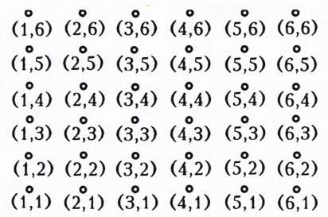
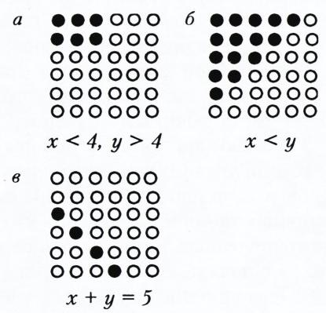
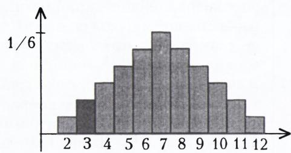
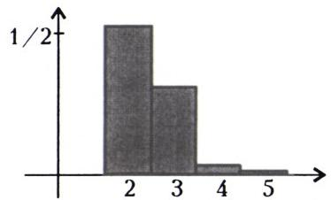
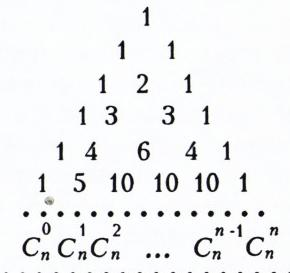
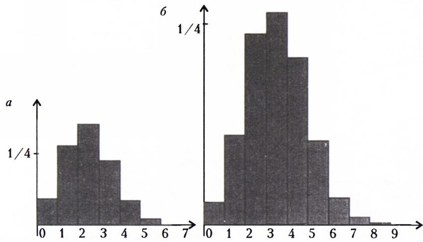

# 来算算概率

> **原标题**：Посчитаем вероятности
> **作者**：Н. Васильев, А. Спивак（N. 瓦西里耶夫、A. 斯皮瓦克，俄罗斯数学教育家，Kvant 杂志长期撰稿人）
> **译自**：Квант 1997, № 4, с. 31, 34–39
> **原文扫描**：https://www.kvant.digital/magazines/1997-1998/issue_4
> **主题**：概率论入门（古典概型、排列组合、条件概率、随机变量与数学期望、方差、切比雪夫不等式、大数定律）
> **难度**：★★（文字初中可读，但组合数、条件概率、数学期望、切比雪夫不等式等概念属高中／大学层面）
> **译者**：Claude（初译）／ 2026-06-24

---

在世界上大多数国家，概率论与统计学的初步内容都在中学阶段讲授，并且由于其广泛的应用（物理学、生物学、经济学……），它们甚至被认为比许多俄罗斯学生所熟悉的章节更为重要。遗憾的是，在我们国家，目前仍只有极少数学校开设概率课程。本文的目的，是给读者一个关于概率论的基本概念、问题和结论的初步印象，并希望今后在《Kvant》的篇幅中能越来越多地看到这一理论的各个片段。

## 来算算概率

## Н. 瓦西里耶夫，А. 斯皮瓦克

什么是概率？要给出一个适用于其所有众多应用的精确定义，并不容易。

去问一位数学系大学生，他会一口气报出：

——所谓概率空间，是一个集合的 $\sigma$-代数，其上定义了一个 $\sigma$-可加的非负函数（测度），且该函数在整个空间上取值为 1。一个事件（即一个集合）的概率，就是它的测度。

——那什么是随机变量？

——就是可测函数。

——那什么是随机变量的平均值？

——就是它的勒贝格积分。

这位大学生是对的。在 А. Н. 柯尔莫哥洛夫 1933 年出版的《概率论的基本概念》一书中，给出的正是这样的定义。但作为初次接触，这种处理方式显然并不合适：我们的大多数读者并不了解什么叫勒贝格积分！

那么，一位非数学家会怎样回答这个问题呢？他多半会说：一个事件的概率，就是它的频率。确切地说，假如我们设想在可以反复重现的相似条件下，一个事件有时发生、有时不发生，那么所谓概率，就是它在所有情形中发生的份额。

这种解释更易懂，但要把它变成精确的数学定义却不容易。（例如，假如我们掷一枚硬币 100 次，自然可以期望大约有 50 次正面朝上。但正面朝上并不一定恰好是 50 次，可能是 51 次、45 次，甚至 100 次。只不过最后这种情形的概率小得骇人——稍后我们就学会计算这类概率，并知道它等于 $1/2^{100}<1/10^{30}$。）

事实上，连六年级学生也能掌握计算概率的主要方法。我们将从所谓**古典（组合）定义**讲起，直到文章末尾才通过切比雪夫不等式引出大数定律，后者在一定程度上解释了事件概率与事件发生频率之间的联系。

本文的大部分内容是题目，其中一部分在文中已给出解答，另一部分则作为练习留给读者（所有题目均按顺序编号，其中一部分附有提示）。

## 组合定义

设有一个由 $N$ 个元素组成的有限集合 $E$。集合 $E$ 的元素称为**基本事件**（即试验的可能结果）。所谓**事件**，就是集合 $E$ 的任意一个子集 $A$。事件 $A$ 的概率 $\mathbf{P}(A)$ 由下式给出

$$
\mathbf{P}(A)=\frac{|A|}{N},
$$

其中 $|A|$ 是集合 $A$ 中元素的个数。

也就是说，每个基本事件（集合 $E$ 中的一个单独元素）的概率都是 $1/N$，而任意一个事件 $A$ 的概率，像由原子那样由这些基本事件的概率累加而成。

这种概率定义适用于，例如，抛硬币或掷骰子之类的问题，也适用于一切存在若干**机会均等**（通常出于对称性考虑）的可能结果的场合。

1. 一颗骰子掷两次。求下列事件的概率：

   а) 第一次掷出的点数小于 4，第二次掷出的点数大于 4；

   б) 第一次掷出的点数小于第二次掷出的点数；

   в) 两次掷出的点数之和为 $k$，其中 $k=1,2,\ldots,12$？

   **解。** 骰子掷两次，就相当于独立地掷两颗骰子。因此共有 $6\cdot 6=36$ 种可能的结果。它们就是数对 $(x,y)$，其中 $x$ 是第一颗骰子的点数，$y$ 是第二颗骰子的点数（$1\leqslant x\leqslant 6$，$1\leqslant y\leqslant 6$）。可以方便地把它们画成排成 $6\times 6$ 方阵的 36 个点（图 1）。

   

   *图 1*

   接下来只需把满足相应条件的点 $(x,y)$ 标出来，数一数它们的个数，再除以 36 即可（图 2）。

   

   *图 2*

   得到答案：а) $3\cdot 2/36=1/6$；б) $15/36=5/12$。而第 в) 小题的答案以直方图的形式画出，图中各柱的高度对应于各个事件的概率（图 3）。

   

   *图 3*

   下面再讨论三个稍难的题目。

## 二元组、三元组、四元组……

2. 费佳会做 30 个问题中的 10 个。考签上从这 30 个问题中随机地抽出 2 个。费佳顺利答对两个问题的把握有多大？

   **解。** 先看考官总共能编出多少张不同的考签。这个数目等于从 30 个元素中取 2 个所能组成的二元组数，即 $30\cdot 29=870$。

   这个数怎么算出来的呢？第一个问题可以从 30 个中任取。一旦它选定后，第二个问题就可以从剩下的 29 个中任取。

   同样地，对费佳"有利"的考签数为 $10\cdot 9=90$。

   所以，通过考试的概率为 $90/870=3/29\approx 0{,}103$。

   我们也可以换一种思路：把仅问题序不同、内容相同的考签不加以区分。那么不同的考签数就减半，即 $30\cdot 29/2=435$。对费佳有利的也减半：$10\cdot 9/2=45$。答案当然相同。

   从 $n$ 个元素中取出无序二元组的个数记作 $C_{n}^{2}$。这个数在很多场合都会出现，正如我们刚才所见，它按如下公式计算

   $$
   C_{n}^{2}=\frac{n(n-1)}{2}.
   $$

3. 费佳到了考场才得知，每张考签上不是 2 个问题，而是 3 个。他顺利答对全部问题的把握有多大？

   **解。** 这次可以编出 $30\cdot 29\cdot 28=24360$ 张不同的考签。事实上，第一个问题有 30 种取法，无论它如何取，第二个问题都可从其余 29 个中取，选定前两个之后，第三个问题可从其余 28 个中取。

   同样地，对费佳有利的考签为 $10\cdot 9\cdot 8=720$ 张，所以这次通过考试的概率只有

   $$
   \frac{720}{24360}=\frac{6}{203}<0{,}03.
   $$

   当然，这道题也可以不计较问题在考签上的顺序，即去数全体问题的所有三元子集 $\{P,Q,R\}$ 的个数。这个数是 $30\cdot 29\cdot 28$ 的 $1/6$，因为三个元素 $P,Q,R$ 共有 6 种排列：$PQR,\ PRQ,\ QPR,\ QRP,\ RPQ,\ RQP$。

   于是，费佳可能拿到的、内容不同的考签共有 $\dfrac{30\cdot 29\cdot 28}{6}=4060$ 张，其中对他有利的只有 $10\cdot 9\cdot 8/6=120$ 张。把 120 除以 4060，得到同样的概率。

   从 $n$ 个元素中取出无序三元组的个数记作 $C_{n}^{3}$。它等于

   $$
   C_{n}^{3}=\frac{n(n-1)(n-2)}{6}.
   $$

4. 当然，费佳运气不佳，考试没通过。等他下次再来时，考官改了规则：他要问 4 个问题（同样从 30 个中随机抽取）。如果费佳答对全部 4 个就得 5 分，答对 3 个得 4 分，答对 2 个得 3 分，否则得 2 分。

   费佳分别以多大的概率得到评分：а) 5；б) 4；в) 3；г) 2？

   **解。** а) 正如刚才所见，总共可编出 $30\cdot 29\cdot 28\cdot 27$ 张考签。其中仅由费佳会做的问题组成的考签有 $10\cdot 9\cdot 8\cdot 7$ 张，所以考试得"5"的概率为

   $$
   \frac{10\cdot 9\cdot 8\cdot 7}{30\cdot 29\cdot 28\cdot 27}=\frac{2}{261}\approx 0{,}0076.
   $$

   在第 а) 小题的解答中，我们曾把仅问题序不同、内容相同的考签视作不同。在下面几小题中我们将不再区分它们，即考虑的不是有序组，而是由 4 个问题组成的子集。其数目是 $30\cdot 29\cdot 28\cdot 27$ 的 $1/24$，因为 4 个元素共有 24 种排列：

   $PQRS,\ PQSR,\ PRQS,\ PRSQ,\ PSQR,\ PSRQ,\ QPRS,\ QPSR,\ QRPS,\ QRSP,\ QSPR,\ QSRP,\ RPQS,\ RPSQ,\ RQPS,\ RQSP,\ RSPQ,\ RSQP,\ SPQR,\ SPRQ,\ SQPR,\ SQRP,\ SRPQ,\ SRQP$.

   于是，30 元素集合的 4 元子集的个数为

   $$
   C_{30}^{4}=\frac{30\cdot 29\cdot 28\cdot 27}{24}=27405.
   $$

   б) 费佳得"4"的条件是：考签中含 1 个他不会的问题（从 20 个中任取）和 3 个他会的问题。这 3 个会的问题从 10 个中取共有 $C_{10}^{3}=\dfrac{10\cdot 9\cdot 8}{6}=120$ 种取法。所以得"4"的概率为

   $$
   \frac{20\cdot 120}{27405}\approx 0{,}0876.
   $$

   в) 要得"3"，需要考签中含 2 个会的问题和 2 个不会的问题。此概率为

   $$
   \frac{C_{10}^{2}\,C_{20}^{2}}{C_{30}^{4}}=\frac{(10\cdot 9/2)\cdot(20\cdot 19/2)}{27405}\approx 0{,}312.
   $$

   г) 得 2 分有两种方式：答出考签中的 1 个问题，或一个都答不出。相应的概率为

   $$
   \frac{10\cdot C_{20}^{3}}{27405}=\frac{10\cdot(20\cdot 19\cdot 18/6)}{27405}\approx 0{,}416
   $$

   和

   $$
   \frac{C_{20}^{4}}{27405}=\frac{20\cdot 19\cdot 18\cdot 17/24}{27405}\approx 0{,}177.
   $$

   因此得 2 分的概率约为

   $$
   0{,}416+0{,}177=0{,}593.
   $$

   答案可写成一张表：

   | 评分 | 2 | 3 | 4 | 5 |
   |---|---|---|---|---|
   | 概率 | 0,593 | 0,312 | 0,0876 | 0,0076 |

   这一分布可以用直方图直观地表示（图 4）。

   

   *图 4*

   注意，和

   $$
   0{,}0076+0{,}0876+0{,}312+0{,}593=1{,}002\approx 1.
   $$

   当然，实际上这些概率之和严格等于 1，因为 2、3、4、5 这几个评分中费佳总会拿到一个。

   一般地，如果把基本事件的全体空间 $E$ 划分为若干个（互不相交的）集合 $A_{1},A_{2},\ldots,A_{r}$，则它们的元素总数之和等于 $N=|E|$：

   $$
   |A_{1}|+|A_{2}|+\dots+|A_{r}|=|E|
   $$

   因而事件 $A_{1},A_{2},\ldots,A_{r}$ 的概率之和等于 1：

   $$
   \mathbf{P}(A_{1})+\mathbf{P}(A_{2})+\dots+\mathbf{P}(A_{r})=\frac{|A_{1}|}{N}+\frac{|A_{2}|}{N}+\dots+\frac{|A_{r}|}{N}=\frac{N}{N}=1.\tag{1}
   $$

   我们说这样的 $A_{1},A_{2},\ldots,A_{r}$ 构成一个**完备事件组**。

   这里非常重要的是：这些事件中任何两个都不相交。一般地，如果 $E$ 中的两个集合 $A$ 和 $B$ 不相交，就说事件 $A$ 与 $B$ **互斥**。这时，二者至少发生其一的概率——即落入 $A$ 或 $B$ 的概率——等于事件 $A$ 与事件 $B$ 的概率之和：

   $$
   \mathbf{P}(A\cup B)=\mathbf{P}(A)+\mathbf{P}(B).\tag{2}
   $$

   我们在上文第 4 题第 г) 小题的解答中就用到过这一事实。

## 练习

5. 假设费佳会做的问题不是 10 个，而是 20 个（在 30 个中）。那么他得评分 2、3、4、5 的概率分别是多少？请画出相应的直方图。

6. 20 个人相互写信。一共寄出了多少封信？（每个人给其余所有人各写一封信。）

7. 15 名特级大师举行一次比赛，每两人之间各下一盘。一共下了多少盘棋？

8. 在所有两位数中随机地取一个。求：а) 它的十位数字大于个位数字；б) 它的两个数字相等；в) 它能被 9 整除——的概率。

9. 一个班有 25 名学生，其中包括丹尼斯、丹尼拉和季米特里。现随机地从中抽出 10 名学生要求上午 9 点来考试，再抽 10 名要求中午 12 点来；其余 5 名要求下午 2 点来。求丹尼斯、丹尼拉和季米特里 а) 三人同时分在第一组；б) 三人分在同一组；в) 三人分在三个不同组——的概率。

## 乘法原理。排列与组合

在解决关于费佳的题目时，我们计算过各种不同组合的数目：排列、有限集合的子集等等。我们是怎么做的呢？用到的基本方法是**乘法原理**。每个人都明白：如果一片森林里有 100 棵云杉，每棵云杉有 20 根树枝，每根树枝有 40 个枝丫，每个枝丫有 70 根针叶，那么整片森林里共有 $100\cdot 20\cdot 40\cdot 70$ 根针叶。

一般地，如果对象 $x$ 有 $m$ 种取法，并且在每一次这样的选取之后对象 $y$ 都有 $n$ 种取法，那么选取数对 $(x,y)$ 共有 $mn$ 种方式。

当数对 $(x,y)$ 中第二个元素 $y$ 的取法完全不依赖于 $x$ 时，乘法原理的形式尤其简单。这时全部 $mn$ 个数对可以填成一张表（图 5）。

   |  | $y_1$ | $y_2$ | … | $y_n$ |
   |---|---|---|---|---|
   | $x_1$ | $(x_1,y_1)$ | $(x_1,y_2)$ | … | $(x_1,y_n)$ |
   | $x_2$ | $(x_2,y_1)$ | $(x_2,y_2)$ | … | $(x_2,y_n)$ |
   | … | … | … | … | … |
   | $x_m$ | $(x_m,y_1)$ | $(x_m,y_2)$ | … | $(x_m,y_n)$ |

   *图 5：$m\times n$ 个数对排成的表*

10. "茶具大全"店里有 5 种不同的茶杯和 3 种不同的茶碟。买一只茶杯配一只茶碟共有多少种方式？

    **解。** 选定一只茶杯，配上它可以从 3 只茶碟中任选其一。茶杯共有 5 只，所以不同的配套共有 15 套（$15=3\cdot 5$）。

11. "茶具大全"店里还有 4 种茶匙。买一只茶杯配一只茶碟再加一只茶匙共有多少种方式？

    **解。** 选定上一题中的 15 套中的任意一套，再以 4 种不同方式配上茶匙。所以配套的总数为 $60=15\cdot 4=5\cdot 3\cdot 4$。

12. 随机地取一个六位数。它的第二位数字等于 3、第四位数字为偶数的概率是多少？

    **解。** 六位数共有 900000 个。其中满足条件的为 $9\cdot 1\cdot 10\cdot 5\cdot 10\cdot 10$ 个，所以概率为

    $$
    \frac{9\cdot 1\cdot 10\cdot 5\cdot 10\cdot 10}{9\cdot 10\cdot 10\cdot 10\cdot 10}=\frac{1}{10}\cdot\frac{5}{10}=0{,}05.
    $$

    请注意，这一答案等于 $\dfrac{1}{10}$（这是第二位数字等于 3 的概率）与 $\dfrac{5}{10}$（这是第四位数字为偶数的概率）的乘积。我们在第 1 题第 а) 小题中已经遇到过类似情形，那里概率等于 $\dfrac{1}{2}$ 与 $\dfrac{1}{3}$ 的乘积。

    下面来解释这是为什么。设想我们从 $m\times n$ 表（见图 5）的 $N=mn$ 个格子中随机地取一个，其中事件 $A$ 表示取到的格子落在事先指定的 $k$ 行之一，事件 $B$ 表示它落在事先指定的 $l$ 列之一。那么交集 $A\cap B$ 由 $kl$ 个格子组成，所以

    $$
    \mathbf{P}(A\cap B)=\frac{kl}{N}=\frac{k}{m}\cdot\frac{l}{n}=\mathbf{P}(A)\,\mathbf{P}(B).
    $$

    一般地，两个事件 $A$ 和 $B$ 称为**独立**的，如果

    $$
    \mathbf{P}(A\cap B)=\mathbf{P}(A)\,\mathbf{P}(B).\tag{3}
    $$

13. 把 $n$ 盏路灯排成一列。共有多少种照明这条街的方式（包括所有路灯都不亮这一"照明方式"）？（用数学语言说，就是要计算 $n$ 元集合的子集个数。）

    **解。** 第一盏路灯有两种状态：亮或不亮。与它无关，第二盏路灯也有亮或不亮两种状态。所以前两盏路灯共有 $2\cdot 2=4$ 种状态。再加上第三盏路灯，可能的状态数就翻一倍。同样地，每加一盏路灯都会使状态数翻倍。所以 $n$ 盏路灯共有 $2^{n}$ 种照明方式。

    顺便，我们也算出了长度为 $n$ 的由 0 和 1 组成的序列的个数，它等于 $2^{n}$。事实上，亮着可记为 1，不亮可记为 0。（那么由 $n$ 个 0 组成的序列就表示所有路灯都不亮，即对应空集；而由 $n$ 个 1 组成的序列则表示所有路灯都亮。）

    利用乘法原理，很容易算出 $n$ 个元素的**排列**的总数，即把这 $n$ 个元素排成一列的方式总数。我们已经看到 $n=3$ 时它等于 6，$n=4$ 时它等于 24。一般地，它等于

    $$
    n!=n\cdot(n-1)\cdot\dots\cdot 2\cdot 1.
    $$

    事实上，若要把 $n$ 个元素排成一行，则第一个有 $n$ 种取法，之后第二个有 $(n-1)$ 种取法，每次选定前两个之后第三个有 $(n-2)$ 种取法，……，倒数第二个从这时剩下的两个里取，而最后一个则被唯一确定。

    现在讨论对组合数学和概率论同样重要的**组合数** $C_{n}^{k}$。我们将通过下面的题目来得到它。

14. 把 5 盏灯泡排成一列。共有多少种方式点亮其中的 $k$ 盏（依次取 $k=0,1,2,3,4,5$）？若是 $n$ 盏灯泡呢？

    **解。** 0 盏灯只有一种"点亮"方式——一盏也不点。从 5 盏中取 1 盏有 5 种取法，取 2 盏有 10 种取法（确实，第一盏有 5 种取法，此后第二盏有 4 种取法；但 $5\cdot 4$ 要除以 2，因为灯一旦点亮，就分不清是哪一盏先被点的）。

    取 3 盏时答案为 $5\cdot 4\cdot 3/3!=10$，取 4 盏时为 $5\cdot 4\cdot 3\cdot 2/4!=5$，而取 5 盏时为 1 种。（其实，立刻就能想到答案序列 $1,\ 5,\ 10,\ 10,\ 5,\ 1$ 应当是对称的：因为 $k$ 盏亮、其余 $5-k$ 盏不亮的情形数，与情形全部反过来时一样多。）

    你当然已经注意到：在解决关于费佳的第 2、3 题时，我们正是这样得到 $C_{n}^{2}$ 和 $C_{n}^{3}$ 的公式的。

    $C_{n}^{k}$——从 $n$ 盏灯中点亮 $k$ 盏的方式数——的一般公式同样可以这样推出。第一盏从 $n$ 种中取，第二盏从 $(n-1)$ 种中取，第三盏从 $(n-2)$ 种中取，如此取 $k$ 次（注意第 $k$ 盏是从 $n-k+1$ 个中取，绝不是草率所想的 $n-k$ 个）。最后要除以 $k!$，即 $k$ 个元素的排列数：

    $$
    C_{n}^{k}=\frac{n(n-1)\ldots(n-k+1)}{k!}.
    $$

    组合数 $C_{n}^{k}$ 在英文教材中记作 $\binom{n}{k}$。它在多种场合出现。$C_{n}^{k}$ 是：

    - $n$ 元集合的 $k$ 元子集的个数；
    - 由 $k$ 个 1 和 $(n-k)$ 个 0 组成的长度为 $n$ 的序列的个数；
    - 沿单位格的边从点 $(0,0)$ 走到点 $(k,n-k)$、长度为 $n$ 的路径的条数；
    - 在展开 $(x+1)^{n}$ 的括号之后 $x^{k}$ 的系数。

    把组合数排成所谓**杨辉三角**（图 6）十分方便，其中每一个数

    

    *图 6*

    等于其正上方两数之和，这对应于公式 $C_{n+1}^{k+1}=C_{n}^{k}+C_{n}^{k+1}$。

    组合数下文还要用到。

## 练习

15. 从 $A$ 城到 $B$ 城有 4 条路，从 $B$ 城到 $C$ 城有 6 条路。从 $A$ 城到 $C$ 城共有多少种走法？

16. 有多少个三位数，其各位数字互不相同且都是奇数？

17. 在一张棋盘上标出 8 个格，使得任何两个所标格既不在同一列也不在同一行，共有多少种标法？

18. 各位数字全是奇数的六位数共有多少个？

19. 随机地取一个三位奇数。求：а) 它的三个数字互不相同；б) 它的首位数字为 1；в) 它的首位数字等于末位数字——的概率。

20. 把 $n$ 盏路灯排成一列，每盏亮或不亮的概率都是 $1/2$。求恰好有 $k$ 盏灯亮的概率。

21. 一个 $n\times n$ 的方格城市，被街道划分成单位正方形。从西南角出发的有 $2^{n}$ 个人：一半向北、一半向东。每个到达下一个路口的人中，又有一半向北、一半向东。最后会有多少人到达对角线上的第 $k$ 个路口？

## 概率的加法与乘法

概率并非总能按 $\mathbf{P}(A)=|A|/N$ 来算。有时可以通过一些概率去算另一些概率。例如，给定 $E$ 中的两个集合 $A$ 和 $B$，并集 $A\cup B$ 的元素个数可以这样算：把 $A$、$B$ 的元素个数相加，再减去它们交集 $A\cap B$ 的元素个数：

$$
|A\cup B|=|A|+|B|-|A\cap B|.
$$

两边除以 $N$，得到关于概率的公式

$$
\mathbf{P}(A\cup B)=\mathbf{P}(A)+\mathbf{P}(B)-\mathbf{P}(A\cap B).\tag{4}
$$

它的一个特例——对互斥事件 $A$、$B$——就是公式 (2)。

22. 一次舞会上，$80\%$ 的时间灯是关着的，$90\%$ 的时间在放音乐，$50\%$ 的时间在下雨。这三件事同时发生的比例，至少要占多少？

    **解。** 改用对立事件：灯亮着的时间占 $20\%$，音乐停了占 $10\%$，没下雨占 $50\%$，所以这些对立事件所占时间之和不超过 $20+10+50=80\%$。因此，在黑暗中、雨里、伴着音乐跳舞的时间至少占 $100-80=20\%$。

    这道题里，我们利用了从事件 $A$ 转到其**对立事件** $E\setminus A$（为简便常记作 $\overline{A}$，读作"$A$ 的补"或"非 $A$"）。这时

    $$
    \mathbf{P}(\overline{A})=1-\mathbf{P}(A).
    $$

23. 含有至少一个偶数数字的六位数共有多少个？

    **提示。** 与其直接数符合条件的六位数，不如先数各位数字全是奇数的六位数。

24. 一个班里有 $40\%$ 男生和 $60\%$ 女生。男生中每两人就有一个会滑旱冰，女生中则有 $30\%$ 会。这个班会滑旱冰的学生占多大比例？

    **解。** 设班里有 $n$ 个人，则男生共 $0{,}4n$ 人，女生共 $0{,}6n$ 人。所以会滑的有 $0{,}5\cdot 0{,}4n$ 个男生和 $0{,}3\cdot 0{,}6n$ 个女生，所求比例为

    $$
    \frac{0{,}5\cdot 0{,}4n+0{,}3\cdot 0{,}6n}{n}=0{,}5\cdot 0{,}4+0{,}3\cdot 0{,}6=0{,}38.
    $$

    上面这条公式，如果说的不是百分比和比例，而是概率，就叫作**全概率公式**。它的一般形式是：若 $A_{1},A_{2},\ldots,A_{r}$ 是一个完备事件组，则

    $$
    \mathbf{P}(B)=\mathbf{P}(A_{1})\,\mathbf{P}_{A_{1}}(B)+\mathbf{P}(A_{2})\,\mathbf{P}_{A_{2}}(B)+\dots+\mathbf{P}(A_{r})\,\mathbf{P}_{A_{r}}(B).\tag{5}
    $$

    解释一下记号。设 $A$ 和 $B$ 是两个事件（例如 $A$ 为"是男生"、$B$ 为"会滑冰"）。在事件 $A$ 已发生的条件下，事件 $B$ 的**条件概率** $\mathbf{P}_{A}(B)$ 定义为比值 $\mathbf{P}(A\cap B)/\mathbf{P}(A)$。（在我们的例子中，$\mathbf{P}_{A}(B)=0{,}5$，$\mathbf{P}_{A}(B)=0{,}3$。）

    为了说清这个定义，我们回到概率的组合定义。如果想从整个空间 $E$ 转到较小的空间 $A$，那么只需考虑 $B$ 中那些含于 $A$ 的元素，其个数为 $|A\cap B|$。其中 $\mathbf{P}(A\cap B)=|A\cap B|/|E|$，$\mathbf{P}(A)=|A|/|E|$。由此得到条件概率的公式

    $$
    \mathbf{P}_{A}(B)=\frac{\mathbf{P}(A\cap B)}{\mathbf{P}(A)}=\frac{|A\cap B|}{|A|}.
    $$

    条件概率 $\mathbf{P}_{A}(B)$ 也可记作 $\mathbf{P}(B|A)$。有人偏爱这种记法，有人偏爱另一种。

    由条件概率的定义，常常用到下面的公式：

    $$
    \mathbf{P}(A\cap B)=\mathbf{P}(A)\,\mathbf{P}_{A}(B).
    $$

    顺带一提，由于在左边，$A$ 与 $B$ 处于对称地位，所以也有

    $$
    \mathbf{P}(B)\,\mathbf{P}_{B}(A)=\mathbf{P}(A\cap B)=\mathbf{P}(A)\,\mathbf{P}_{A}(B).
    $$

    由此很容易推出全概率公式：

    $$
    \mathbf{P}(B)=\mathbf{P}(A_{1}\cap B)+\mathbf{P}(A_{2}\cap B)+\dots+\mathbf{P}(A_{r}\cap B)=\mathbf{P}(A_{1})\,\mathbf{P}_{A_{1}}(B)+\mathbf{P}(A_{2})\,\mathbf{P}_{A_{2}}(B)+\dots+\mathbf{P}(A_{r})\,\mathbf{P}_{A_{r}}(B).
    $$

## 练习

25. 我收到两个包裹。其中一个有 $20\%$ 梨、$50\%$ 苹果和 $30\%$ 橘子；另一个有 $30\%$ 梨、$10\%$ 苹果和 $60\%$ 猕猴桃。我闭着眼睛先随机抽一个包裹，再在其中抽一个水果。我抽到橘子的概率是多少？

26. 已知掷一颗骰子掷出的是偶数。求它小于 5 的概率。

27. 证明：若事件 $A$ 和 $B$ 独立，则事件 $A$ 和 $\overline{B}$ 也独立。

28. 两个朋友连抛三枚硬币，想算出三枚硬币全部同面（同是正面或同是反面）的概率。第一个人说这个概率是 $\dfrac{1}{4}$。他的理由是：第二枚硬币与第一枚同面的概率是 $\dfrac{1}{2}$，而第三枚硬币又与前两枚同面的概率再减半——即 $\dfrac{1}{4}$。

    第二个人说所求概率是 $\dfrac{1}{2}$。他的理由是：三枚硬币里总有两枚必同面，第三枚又与它们同面的概率是 $\dfrac{1}{2}$。谁说得对？

29. 已知某家有两个孩子。有一次妈妈带了一个（随机选取的）孩子出去散步，发现是个男孩。问：另一个孩子是男孩还是女孩的概率更大？

30. （帕斯卡问题）两个棋艺相当的棋手下一种不允许和棋的棋。他们下了相同的赌注，并约定谁先赢满 10 局谁就拿走全部赌金。下到比分 9 : 8 时因故中断，不能再下了。他们该如何分这笔钱？

## 随机变量与平均值

正如开头所言，在实践中求概率，是通过反复做试验、再算出我们所关心事件发生情形所占份额（即"频率"）来实现的。例如，把一枚硬币多抛几次，它数字面朝上的次数大约占一半。这种"频率的稳定性"，在多次重复试验的许多场合都能观察到。雅各布·伯努利在他 1713 年出版的《猜度术》一书中，给出了这种稳定性的数学解释。他建立了大数定律：如果在 $n$ 次独立试验的每一次中，某事件 $A$ 都以同样的概率 $p$ 发生，那么事件 $A$ 出现的次数 $Z$ 不必恰好等于 $np$，可能与之有较大偏差；但发生较大偏差的概率很小：对任意正数 $\varepsilon$ 和 $\eta$，当 $n$ 充分大时，都有 $\mathbf{P}(|Z/n-p|>\varepsilon)<\eta$。

我们将在下一节末尾，用切比雪夫不等式给出一个比伯努利更简单的证明。

本节我们处理这样的问题：设某事件 $A$ 以概率 $p$ 发生。在 $n$ 次独立试验中它恰好发生 $k$ 次的概率是多少？

首先要把"以同一概率 $p$ 做 $n$ 次关于 $A$ 的独立试验"这句话的精确含义讲清楚。为此要用到一个极其重要的概率空间——所谓**伯努利概型**。它由 $2^{n}$ 个基本事件构成，即由 0 和 1 组成的、长度为 $n$ 的行 $(z_{1},z_{2},\ldots,z_{n})$。给含有 $k$ 个 1 和 $n-k$ 个 0 的行赋予的概率为 $p^{k}(1-p)^{n-k}$。当 $p=1/2$ 时，所得到的就是描述抛 $n$ 次对称硬币的概率空间，也就是第 20 题中遇到过的空间。注意，伯努利概型（当 $p\neq 1/2$ 时）已不属于概率空间 $E$ 的"组合"定义，那里所有的"原子"都是等概率的。

下面是一个更一般的定义，也更适用于实际。

**定义。** 所谓**有限概率空间**，是指一个有限集合 $E=\{e_{1},e_{2},\ldots,e_{n}\}$，其中每个元素 $e_{i}$ 都被赋予一个非负数 $w_{i}$（称为基本事件 $e_{i}$ 的概率），并且它们的和等于 1：

$$
w_{1}+w_{2}+\dots+w_{n}=1.
$$

任意事件 $A$（即子集 $A\subseteq E$）的概率定义为

$$
\mathbf{P}(A)=\sum_{e_{i}\in A}w_{i}.
$$

后一公式说明，$\mathbf{P}(A)$ 是组成 $A$ 的所有基本事件的概率之和。

注意，前述关于概率计算的主要规则 (1)—(7) 此时仍然成立。

下面我们需要另一些新概念：随机变量、它的分布、它的平均值等等。事实上这些概念比概率论更古老，大家也都熟悉：它们属于传统的统计学，这种统计学与书写的数字一同诞生。

**定义。** **随机变量**就是定义在集合 $E$ 上的一个函数 $X$。

每个事件 $A\subseteq E$ 都对应一个"特征"随机变量 $\xi_{A}$，它只取值 0 和 1：当 $e\in A$ 时 $\xi_{A}(e)=1$，否则 $\xi_{A}(e)=0$（因此可把"随机变量"看作"事件"概念的一种推广）。

由于我们只考虑有限集合 $E$，每个随机变量 $X:E\to\mathbb{R}$ 都可以由一组数 $X(e_{i})$（$i=1,2,\ldots,N$）给出，它们可以列成一张表。例如，在第 1 题关于两次掷骰子的问题中，"掷出点数之和"这个量就可以用下表给出：

| 基本事件 | $(1,1)$ | $(1,2)$ | $(2,1)$ | $(1,3)$ | … | $(6,6)$ |
|---|---|---|---|---|---|---|
| 概率 | $\dfrac{1}{36}$ | $\dfrac{1}{36}$ | $\dfrac{1}{36}$ | $\dfrac{1}{36}$ | … | $\dfrac{1}{36}$ |
| $X$ | 2 | 3 | 3 | 4 | … | 12 |

如果概率空间含有很多元素，那么这张表会变得完全无法阅读。然而，通常只要知道随机变量的**分布**就够了，即它一切可能取值的集合 $\{x_{1},\ldots,x_{m}\}$ 以及每个取值的概率 $u_{j}=\mathbf{P}(X=x_{j})$。这里 $X=x_{j}$ 是"随机变量 $X$ 等于 $x_{j}$"这一事件；它的概率 $u_{j}$ 是对所有满足 $X(e_{i})=x_{j}$ 的 $e_{i}$ 求 $w_{i}$ 之和。事件 $X=x_{j}$（$j=1,2,\ldots,m$）显然构成一个完备事件组，所以 $u_{1}+u_{2}+\dots+u_{m}=1$。随机变量的分布完全决定了它的基本性质——平均值、"离散程度"、最可能取值是单个还是多个……在骰子一例中，分布为：

$$
\begin{array}{c|ccccccccccc}
x_{j} & 2 & 3 & 4 & 5 & 6 & 7 & 8 & 9 & 10 & 11 & 12\\
\hline
u_{j} & \dfrac{1}{36} & \dfrac{2}{36} & \dfrac{3}{36} & \dfrac{4}{36} & \dfrac{5}{36} & \dfrac{6}{36} & \dfrac{5}{36} & \dfrac{4}{36} & \dfrac{3}{36} & \dfrac{2}{36} & \dfrac{1}{36}
\end{array}
$$

而在伯努利概型中，随机变量"1 的个数"——记为 $z$——服从**二项分布**：

$$
\mathbf{P}(z=k)=C_{n}^{k}p^{k}(1-p)^{n-k}.
$$

第 4 题中"费佳考试评分"这一随机变量（记为 $\Phi$）的分布，则由前述表格或图 4 的直方图给出。

**定义。** 随机变量 $X$ 的**平均值（数学期望）**定义为和

$$
\mathbf{M}(X)=\sum_{i=1}^{N}w_{i}X(e_{i})=w_{1}X(e_{1})+w_{2}X(e_{2})+\dots+w_{N}X(e_{N}).
$$

若已知分布 $\mathbf{P}(X=x_{j})=u_{j}$（$j=1,2,\ldots,m$），把 $X(e_{i})$ 取值相同的项合并，上式可改写为

$$
\mathbf{M}(X)=\sum_{j=1}^{m}u_{j}x_{j}=u_{1}x_{1}+u_{2}x_{2}+\dots+u_{m}x_{m}.
$$

平均值也叫作随机变量的**数学期望**。

事件 $A$ 的特征函数 $\xi=\xi_{A}$（只取 0 和 1）的平均值，等于事件 $A$ 的概率：

$$
\mathbf{M}(\xi)=\mathbf{P}(\xi=0)\cdot 0+\mathbf{P}(\xi=1)\cdot 1=\mathbf{P}(\xi=1)=\mathbf{P}(A).
$$

费佳评分的平均值为

$$
\mathbf{M}(\Phi)\approx 0{,}0076\cdot 5+0{,}0876\cdot 4+0{,}312\cdot 3+0{,}593\cdot 2\approx 2{,}51.
$$

伯努利概型中"1 的个数"的平均值，按定义是

$$
\mathbf{M}(Z)=\sum_{k=0}^{n}C_{n}^{k}p^{k}(1-p)^{n-k}\cdot k.
$$

我们来算这个和。由于当 $k\geqslant 1$ 时

$$
C_{n}^{k}\cdot k=\frac{n!}{k!(n-k)!}\cdot k=\frac{n!}{(k-1)!(n-k)!}=n\,C_{n-1}^{k-1}
$$

所以

$$
\mathbf{M}(Z)=\sum_{k=1}^{n}n\,C_{n-1}^{k-1}p^{k}(1-p)^{n-k}=np\sum_{k=1}^{n}p^{k-1}(1-p)^{n-k}=np\sum_{l=0}^{n-1}p^{l}(1-p)^{n-1-l}.
$$

由二项式定理，和 $\sum_{l=0}^{n-1}p^{l}(1-p)^{n-1-l}$ 等于 $(p+(1-p))^{n}=1$。所以随机变量 $Z$ 的平均值等于 $np$。

不过，借助下面的性质算这一平均值要简便得多。

**定理 1。** 随机变量 $X$ 与 $Y$ 之和 $X+Y$ 的平均值，等于二者平均值之和：

$$
\mathbf{M}(X+Y)=\mathbf{M}(X)+\mathbf{M}(Y).
$$

**证明。** 按定义，

$$
\mathbf{M}(X)=w_{1}X(e_{1})+w_{2}X(e_{2})+\dots+w_{N}X(e_{N}),\tag{8}
$$

$$
\mathbf{M}(Y)=w_{1}Y(e_{1})+w_{2}Y(e_{2})+\dots+w_{N}Y(e_{N}).\tag{9}
$$

把这两个等式逐项相加，得

$$
\mathbf{M}(X)+\mathbf{M}(Y)=w_{1}\bigl(X(e_{1})+Y(e_{1})\bigr)+w_{2}\bigl(X(e_{2})+Y(e_{2})\bigr)+\dots+w_{N}\bigl(X(e_{N})+Y(e_{N})\bigr)=\mathbf{M}(X+Y).
$$

当然，定理对若干个随机变量之和也成立。

为把它用于求 $\mathbf{M}(Z)$，我们把 $Z$ 写成 $n$ 个随机变量之和

$$
Z=Z_{1}+Z_{2}+\dots+Z_{n},
$$

其中 $Z_{j}$ 是行 $(Z_{1},Z_{2},\ldots,Z_{n})$ 的第 $j$ 个坐标。这 $n$ 项中每一项的平均值都是

$$
\mathbf{M}(Z_{j})=p,\tag{10}
$$

所以 $\mathbf{M}(Z)=np$。

对乘积而言就没这么简单——并非总有"乘积的数学期望等于数学期望的乘积"。例如，若随机变量 $X$ 以等概率 $1/2$ 取值 $1$ 和 $-1$，则 $\mathbf{M}(X)=0$，而 $\mathbf{M}(X^{2})=\mathbf{M}(1)=1$。

**定义。** 随机变量 $X$ 与 $Y$ 称为**独立**的，如果对任意取值 $x_{j}$ 和 $y_{k}$，事件 $X=x_{j}$ 与 $Y=y_{k}$ 都独立，即

$$
\mathbf{P}\bigl(X=x_{j},\,Y=y_{k}\bigr)=\mathbf{P}\bigl(X=x_{j}\bigr)\,\mathbf{P}\bigl(Y=y_{k}\bigr).
$$

**定理 2。** 独立随机变量 $X$ 与 $Y$ 之积的平均值，等于二者平均值之积：

$$
\mathbf{M}(XY)=\mathbf{M}(X)\,\mathbf{M}(Y).
$$

**证明。** 设 $X$ 取值 $x_{1},x_{2},\ldots,x_{m}$，$Y$ 取值 $y_{1},y_{2},\ldots,y_{l}$。记 $\mathbf{P}(X=x_{j})=u_{j}$，$\mathbf{P}(Y=y_{k})=v_{k}$。则

$$
\mathbf{P}\bigl(X=x_{j},\,Y=y_{k}\bigr)=u_{j}v_{k},
$$

所以

$$
\sum_{j=1}^{m}\sum_{k=1}^{l}\mathbf{P}(X=x_{j},\,Y=y_{k})\,x_{j}y_{k}=\sum_{j=1}^{m}\sum_{k=1}^{l}u_{j}v_{k}x_{j}y_{k}=\sum_{j=1}^{m}u_{j}x_{j}\cdot\sum_{k=1}^{l}v_{k}y_{k}=\mathbf{M}(X)\,\mathbf{M}(Y).
$$

## 练习

31. 两人玩这样一种游戏：掷一颗骰子，若掷出 1 或 2，则第一个从第二个手里赢 5 分；否则第二个从第一个手里赢 2 分。这个游戏对谁有利——对第一个还是第二个？

32. 我上班通常坐公交车 20 分钟，或坐无轨电车半小时，且坐公交的次数是坐无轨电车的 3 倍。偶尔地，我每 10 天坐一次出租车 10 分钟，每 10 天步行 1 小时。我平均每天花多少时间在路上？

33. 每走一步，玩家掷一颗骰子，得点数等于掷出点数。此外，若掷出 6，他在同一手再掷一次，并额外获得第二次掷出的点数。玩家平均每手得多少分？

34. 证明：若随机变量 $X$ 和 $Y$ 满足 $Y=aX+b$，其中 $a$、$b$ 为常数，则 $\mathbf{M}(Y)=a\,\mathbf{M}(X)+b$。

35. 证明：若恒有 $X\leqslant Y$，则 $\mathbf{M}(X)\leqslant\mathbf{M}(Y)$。

36. 证明：若 $\mathbf{M}(X^{2})=\mathbf{M}(X)^{2}$，则 $X$ 是常数。

37. 费佳在考试中被问 а) 6 个；б) 9 个问题，每个问题他以概率 $1/3$ 答对。求他答对 $k$ 个问题的概率（相应的直方图见图 7，а、б）。

   

   *图 7*

## 方差与切比雪夫不等式。大数定律

除了平均值 $\mathbf{M}(X)$，随机变量还有其他特征。如果我们只知道平均每小时到站 10 辆公交车，由此还不能推出我们不会等上半小时。考虑随机变量 $\hat{X}=X-\mathbf{M}(X)$，即 $X$ 对数学期望的**偏差**（其绝对值越大，$X$ 的"离散"越大）。

当然，$\hat{X}$ 的数学期望等于 0。$\hat{X}$ 绝对值的数学期望可作为衡量 $X$ 取值离散程度的一种尺度。但数学家们更愿用另一种特征，称为**方差**：

$$
\mathbf{D}(X)=\mathbf{M}\bigl(\hat{X}\bigr)^{2}=\mathbf{M}\bigl(X-\mathbf{M}(X)\bigr)^{2}.
$$

方差是 $X$ 偏离其平均值的"特征偏差"的平方。方差越小，分布直方图就越尖锐（越窄）。

38. 证明：

    $$
    \mathbf{D}(X)=\mathbf{M}(X^{2})-\mathbf{M}(X)^{2}.
    $$

下面是方差最值得称道的性质。

**定理 3。** 独立随机变量 $X$ 与 $Y$ 之和的方差，等于二者方差之和：

$$
\mathbf{D}(X+Y)=\mathbf{D}(X)+\mathbf{D}(Y).
$$

39. 证明这条定理。

定理 3 当然对若干个独立随机变量之和也成立。由此可见，对 $n$ 个同分布的独立随机变量（例如伯努利概型中 1 的个数），其和的方差等于 $nD$，其中 $D$ 是单个随机变量的方差。因此 $n$ 个随机值之和与其数学期望的特征偏差是 $\sqrt{nD}$（"平方根法则"），从而 $n$ 个值的算术平均与概率 $p$ 之差是 $\sqrt{D}/\sqrt{n}$ 这一数量级。大数定律的证明即建立于此。

请自行证明下列断言：

40. 伯努利概型中随机变量 $Z$ 的方差为 $np(1-p)$。

**定理 4。** 若随机变量 $X$ 只取非负值，则对任意正数 $\varepsilon$ 有不等式

$$
\mathbf{P}(X\geqslant\varepsilon)\leqslant\mathbf{M}(X)/\varepsilon.
$$

**定理 5（切比雪夫不等式）。** 对任意正数 $\varepsilon$ 和任意随机变量 $X$，有不等式

$$
\mathbf{P}\bigl(|\hat{X}|\geqslant\varepsilon\bigr)\leqslant\mathbf{D}(X)/\varepsilon^{2}.
$$

**定理 6（大数定律）。** 若随机变量 $Y$ 是 $n$ 个独立随机变量之和，其中每个的平均值为 $a$、方差为 $D$，则对任意正数 $\varepsilon$，

$$
\mathbf{P}\left(\left|\frac{Y}{n}-a\right|>\varepsilon\right)<\frac{D}{n\varepsilon^{2}}.
$$

后面这几条定理是概率论中典型的结果。我们无法断言试验结果（随机变量）或若干次试验的算术平均一定与真正的平均——数学期望——相差不超过 $\varepsilon$，但我们可以确信：发生较大偏差的概率很小。概率论的主要内容，正是各种用来估计概率的不等式。

我们来看一看，切比雪夫不等式对 400 次抛对称硬币能给出怎样的估计。数字面朝上的次数偏离 200 超过 20 的概率 $\mathbf{P}$ 可这样估计：

$$
\mathbf{P}<\frac{D}{400\cdot(1/20)^{2}}=\frac{1/4}{400\cdot(1/20)^{2}}=\frac{1}{4},
$$

其中 $D=1/4$。

实际上，有一些了不起的定理可以远为精确地估计这种量。例如，上面这个例子中其实 $P\approx 0{,}05$。关于这一点，我们下次再谈。

---

## 译者注与校对说明

1. **OCR 校正**：本文由 MinerU 对扫描页做俄文 OCR 后翻译。已校正的 OCR 错误主要包括：
   - 第 4 题第 г) 小题的项目字母 г) OCR 误识为 "6)"，已据上下文还原；第 4 题答表中评分 2 对应的概率 0,593 在 OCR 中错位，已据正文核对；
   - 第 24 题正文 "$\mathbf{P}_{A}(B)=0{,}5$，$\mathbf{P}_{A}(B)=0{,}3$" 重复书写条件概率记号（原文如此，意指男生中会滑者占 $0{,}5$、女生中占 $0{,}3$），译文照录；
   - 公式 (4) 在 OCR 中误作 $\mathbf{P}(A)\mathbf{P}(B)-\mathbf{P}(A\cap B)$，已校正为 $\mathbf{P}(A)+\mathbf{P}(B)-\mathbf{P}(A\cap B)$（容斥原理）；
   - $C_{n-1}^{k-1}$ 在 OCR 中误作 $C_{n\to 1}^{k-1}$，已校正；
   - 数学期望记号原文为俄式黑体 $\mathbf{M}$（математическое ожидание），保留；
   - 俄文小数逗号（如 $0{,}38$、$2{,}51$）一律保留，符合俄文书写习惯；
   - "кольцо/σ-алгебра"等测度论术语在引言中出现，按通用译名处理。
2. **术语**：вероятность=概率, событие=事件, элементарное событие=基本事件, несовместные события=互斥事件, независимые события=独立事件, полная система событий=完备事件组, условная вероятность=条件概率, случайная величина=随机变量, распределение=分布, среднее значение/математическое ожидание=平均值/数学期望, дисперсия=方差, схема Бернулли=伯努利概型, биномиальное распределение=二项分布, перестановка=排列, сочетание=组合, число сочетаний=组合数 $C_{n}^{k}$, правило произведения=乘法原理, треугольник Паскаля=帕斯卡三角（即杨辉三角）, неравенство Чебышёва=切比雪夫不等式, закон больших чисел=大数定律, формула полной вероятности=全概率公式。术语遵照《01_工作规范.md》对照表与通行译名。
3. **人物背景**：
   - А. Н. Колмогоров（柯尔莫哥洛夫，1903—1987）1933 年的《概率论的基本概念》用测度论语言为概率论建立了公理化基础，文中开篇所引"$\sigma$-代数上的 $\sigma$-可加测度"即指此公理体系。
   - 雅各布·伯努利（Jakob Bernoulli，1654—1705）的《猜度术》（Ars Conjectandi）于 1713 年（他身后）出版，首次严格证明了大数定律（伯努利形式）。
   - 帕斯卡（第 30 题）与费马 1654 年关于"分赌本问题"（problem of points）的通信，被公认为现代概率论的开端。
4. **图表**：原文插图（图 1—7）由 MinerU 从整页扫描中自动裁出，存于 `images/1997_04_vasilev_E05/fig_*.png`；费佳评分分布表（第 4 题）、$5\times 3$ 茶具配套表、$m\times n$ 数对表（图 5）、骰子点数之和分布表等已改用 Markdown 重排。图号、表格内容均与扫描页一致。
5. **完整性**：正文 7 节（组合定义 / 二元组三元组四元组 / 乘法原理·排列与组合 / 概率的加法与乘法 / 随机变量与平均值 / 方差与切比雪夫不等式·大数定律）及全部 40 道题（含题目、解答与提示）均无整段遗漏，与原文 31、34—39 页逐节对应。

## 建议讨论题

1. 引言中"概率 = 频率"的直觉说法，与文章末尾大数定律所给出的精确刻画，差别究竟在哪里？大数定律是否等于说"掷很多次硬币就一定会接近各半"？
2. 第 28 题的两个朋友对"三枚硬币同面"的概率给出了 $\tfrac{1}{4}$ 与 $\tfrac{1}{2}$ 两个答案，他们的推理各错在哪里？请用伯努利概型算出正确答案。
3. 第 29 题与第 30 题（帕斯卡分赌本）是两道著名的"反直觉"概率题。它们为何容易答错？条件概率与无条件概率的混淆起了什么作用？
4. 切比雪夫不等式给出的估计相当粗糙（400 次掷币的例子中它给 $P<\tfrac{1}{4}$，而实际约 $0{,}05$）。既然如此，它为何仍是概率论的核心工具之一？（提示：想想它对任意分布、任意 $n$ 都成立。）

---

> **版权说明**：原文版权归 MCCME（莫斯科连续数学教育中心）及作者继承者所有。本译文为非商业、自用、数学圈内部参考，未获授权不得公开分发。原文扫描见 [kvant.digital](https://www.kvant.digital/magazines/1997-1998/issue_4)。

> **复用说明**：本译文的俄文 OCR 原文与所有插图均存档于 `ocr/1997_04_vasilev_E05/`（`ru.md` 为合并 OCR 文本，`meta.json` 为图映射）。如对译文质量不满意，可直接基于 `ru.md` 重译，无需重跑 OCR。
